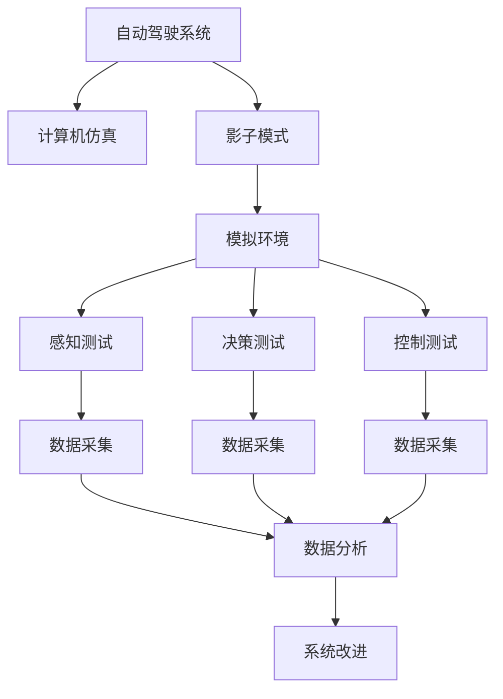

                 

# 自动驾驶领域的影子模式测试

## 1. 背景介绍

### 1.1 问题由来

自动驾驶技术的发展正逐步改变着我们的出行方式，带来巨大的便利和效率提升。然而，当前自动驾驶系统在复杂环境下的表现仍然不尽如人意，如雨雪天气、强光环境、恶劣道路条件等，这些都严重影响了自动驾驶的可靠性。因此，如何有效提升自动驾驶系统的环境适应性和安全性，成为了当前研究的关键方向之一。

### 1.2 问题核心关键点

影子模式测试（Shadow Mode Testing）是当前自动驾驶领域一个热门的研究方向，其核心思想是在模拟复杂环境的基础上，对自动驾驶系统进行全面的功能测试，确保系统能够在各种极端条件和异常情况下稳定运行。其关键点包括：

- 模拟复杂环境：利用高级计算机仿真技术，构建包含多种复杂场景的虚拟测试环境，如雨雪天气、强光环境、恶劣道路条件等。
- 系统功能测试：在模拟环境中进行全面的功能测试，包括感知、决策、控制等各个环节。
- 数据分析与改进：对测试数据进行详细分析，识别出系统存在的问题，并进行针对性的改进优化。

影子模式测试通过对自动驾驶系统进行全面的测试，能够有效地发现和解决系统在复杂环境下的性能问题，提升系统的可靠性。

## 2. 核心概念与联系

### 2.1 核心概念概述

为了更好地理解影子模式测试方法，本节将介绍几个密切相关的核心概念：

- 自动驾驶系统：通过车载传感器、GPS、高精度地图等技术，实现车辆的自主导航、定位、避障等功能。
- 计算机仿真：利用计算机技术构建虚拟环境，对自动驾驶系统进行仿真测试，以验证系统在不同条件下的性能表现。
- 影子模式：指在计算机仿真中构建的复杂虚拟环境，这些环境模拟了真实世界中的各种复杂场景，用于全面测试自动驾驶系统。
- 系统性能指标：包括感知精度、决策鲁棒性、控制稳定性等，用于评估自动驾驶系统的性能表现。

这些核心概念之间的逻辑关系可以通过以下Mermaid流程图来展示：



这个流程图展示了这个过程的各个关键环节，从构建模拟环境，到进行感知、决策、控制的全面测试，再到数据分析和系统改进。

## 3. 核心算法原理 & 具体操作步骤

### 3.1 算法原理概述

影子模式测试是基于计算机仿真的全面功能测试方法。其核心原理是将真实世界中的复杂环境，通过计算机仿真技术重现，并将自动驾驶系统置入其中进行功能测试，以验证系统的鲁棒性和可靠性。

具体而言，影子模式测试包括以下几个关键步骤：

1. 构建模拟环境：利用计算机仿真技术，构建包含多种复杂场景的虚拟测试环境。
2. 设置测试场景：根据实际应用需求，设置不同条件下的测试场景，如雨雪天气、强光环境、恶劣道路条件等。
3. 系统功能测试：在模拟环境中对自动驾驶系统进行全面的功能测试，包括感知、决策、控制等各个环节。
4. 数据分析与改进：对测试数据进行详细分析，识别出系统存在的问题，并进行针对性的改进优化。

### 3.2 算法步骤详解

以下是影子模式测试的具体操作步骤：

**Step 1: 构建模拟环境**

利用高级计算机仿真技术，构建包含多种复杂场景的虚拟测试环境。具体步骤如下：

1. 定义虚拟道路：根据实际道路信息，构建虚拟道路网络，包括车道线、交通标志、路面标线等。
2. 添加动态元素：在虚拟环境中添加动态元素，如行人、车辆、交通信号灯等。
3. 模拟环境条件：根据实际应用需求，设置不同条件下的环境条件，如雨雪天气、强光环境、恶劣道路条件等。

**Step 2: 设置测试场景**

根据实际应用需求，设置不同条件下的测试场景。具体步骤如下：

1. 定义测试路线：在虚拟环境中设置多条测试路线，涵盖不同路况和环境条件。
2. 设置测试参数：根据测试需求，设置不同参数，如车速、转弯角度、制动距离等。
3. 模拟异常情况：设置异常情况，如车辆突然变道、行人突然横穿、障碍物突然出现等。

**Step 3: 系统功能测试**

在模拟环境中对自动驾驶系统进行全面的功能测试，具体步骤如下：

1. 感知测试：在测试路线上，对自动驾驶系统的感知能力进行测试，验证其对环境变化的感知和识别能力。
2. 决策测试：在测试路线上，对自动驾驶系统的决策能力进行测试，验证其在不同环境条件下的决策鲁棒性。
3. 控制测试：在测试路线上，对自动驾驶系统的控制能力进行测试，验证其对环境变化的响应能力和稳定性。

**Step 4: 数据分析与改进**

对测试数据进行详细分析，识别出系统存在的问题，并进行针对性的改进优化，具体步骤如下：

1. 数据采集：在测试过程中，采集系统的输出数据，如传感器数据、决策指令、控制命令等。
2. 数据分析：对采集到的数据进行分析，识别出系统存在的问题，如感知精度、决策鲁棒性、控制稳定性等。
3. 系统改进：根据分析结果，进行针对性的改进优化，如调整感知算法、优化决策逻辑、改进控制系统等。

### 3.3 算法优缺点

影子模式测试具有以下优点：

1. 全面覆盖：通过计算机仿真，能够全面覆盖各种复杂场景，验证系统在不同条件下的性能表现。
2. 安全性高：在仿真环境中进行测试，避免了真实环境中的安全风险。
3. 成本低：仿真测试成本较低，能够快速进行大量测试。
4. 数据详实：测试数据详实全面，便于系统分析和改进。

同时，该方法也存在以下局限性：

1. 仿真误差：计算机仿真存在一定误差，可能无法完全模拟真实环境。
2. 验证周期长：仿真测试需要较长时间，无法快速验证系统性能。
3. 环境可控性差：计算机仿真环境可控性较差，可能无法模拟极端场景。
4. 无法覆盖全部场景：计算机仿真无法覆盖全部复杂场景，测试范围有限。

尽管存在这些局限性，但影子模式测试在自动驾驶领域仍然具有重要的应用价值，为系统性能测试和改进提供了可靠的手段。

### 3.4 算法应用领域

影子模式测试在自动驾驶领域的应用非常广泛，具体包括以下几个方面：

- 感知测试：验证自动驾驶系统对环境变化的感知和识别能力，如行人、车辆、障碍物等。
- 决策测试：验证自动驾驶系统在不同环境条件下的决策鲁棒性，如雨雪天气、强光环境、恶劣道路条件等。
- 控制测试：验证自动驾驶系统的控制能力，如加速、减速、转向等。
- 异常情况测试：模拟各种异常情况，如车辆突然变道、行人突然横穿、障碍物突然出现等，验证系统的鲁棒性。
- 性能优化：根据测试结果，进行针对性的改进优化，提升系统性能和可靠性。

## 4. 数学模型和公式 & 详细讲解 & 举例说明

### 4.1 数学模型构建

影子模式测试的数学模型构建主要包括以下几个方面：

1. 虚拟道路模型：定义虚拟道路网络，包括车道线、交通标志、路面标线等。
2. 动态元素模型：定义虚拟环境中的动态元素，如行人、车辆、交通信号灯等。
3. 环境条件模型：定义不同条件下的环境条件，如雨雪天气、强光环境、恶劣道路条件等。

### 4.2 公式推导过程

以下是虚拟道路模型的数学推导过程：

设虚拟道路网络包含 $N$ 个节点和 $M$ 条道路，节点之间的距离为 $d$，道路宽度为 $w$。节点的位置坐标为 $(x_i, y_i)$，道路的起点和终点坐标为 $(x_s, y_s)$ 和 $(x_e, y_e)$。则虚拟道路模型的数学表示如下：

$$
\begin{cases}
\min_{x_i, y_i} & d_{ij} \\
\text{subject to} & d_{ij} = \sqrt{(x_i - x_j)^2 + (y_i - y_j)^2}, \\
& 0 \leq d_{ij} \leq d \\
& x_s \leq x_i \leq x_e, y_s \leq y_i \leq y_e
\end{cases}
$$

其中 $d_{ij}$ 表示节点 $i$ 和节点 $j$ 之间的距离。

### 4.3 案例分析与讲解

以一个具体的影子模式测试案例为例，说明其数学模型和公式推导过程。

假设测试路线包含一条双车道道路，两侧为步行道和人行道。车道线位于道路中心，宽度为 3.5m，行人道和人行道宽度为 1.5m。道路长度为 500m，测试路线起点和终点分别为 $(x_s, y_s)$ 和 $(x_e, y_e)$。测试过程中，车辆以 60km/h 的速度匀速行驶，转弯角度为 30°。

根据虚拟道路模型的数学表示，可以得到以下数据：

1. 节点 $i$ 的位置坐标为 $(x_i, y_i)$。
2. 道路宽度为 $w=3.5m$。
3. 测试路线起点和终点坐标为 $(x_s, y_s)$ 和 $(x_e, y_e)$。
4. 车速为 $v=60km/h=16.67m/s$。
5. 转弯角度为 $\alpha=30°$。

根据上述数据，可以得到测试路线的数学模型为：

$$
\begin{cases}
\min_{x_i, y_i} & d_{ij} \\
\text{subject to} & d_{ij} = \sqrt{(x_i - x_j)^2 + (y_i - y_j)^2}, \\
& 0 \leq d_{ij} \leq d \\
& x_s \leq x_i \leq x_e, y_s \leq y_i \leq y_e
\end{cases}
$$

在测试过程中，自动驾驶系统需要根据道路条件和车辆状态，实时调整车速和转向角度，以确保安全行驶。例如，在遇到行人时，系统需要减速或停车避让；在遇到车辆时，系统需要保持安全距离并适时避让；在遇到障碍物时，系统需要及时避让或减速。

## 5. 项目实践：代码实例和详细解释说明

### 5.1 开发环境搭建

在进行影子模式测试项目实践前，我们需要准备好开发环境。以下是使用Python进行开发的环境配置流程：

1. 安装Python：从官网下载并安装Python 3.x版本。
2. 安装OpenCV：用于处理计算机视觉任务，如道路分割、行人检测等。
3. 安装PyTorch：用于深度学习模型训练和推理。
4. 安装ROS：用于自动驾驶系统的仿真和测试。
5. 安装Gazebo：用于构建虚拟环境。

完成上述步骤后，即可在开发环境中进行影子模式测试项目的实践。

### 5.2 源代码详细实现

以下是使用PyTorch和ROS进行影子模式测试项目的详细代码实现。

```python
import torch
import torch.nn as nn
import torch.optim as optim
import cv2
import numpy as np
import os
import sys
import rospkg
from gazebo_msgs.srv import SpawnModel
from gazebo_msgs.msg import ModelState

class ShadowModeTester:
    def __init__(self):
        self.model = nn.Sequential(
            nn.Conv2d(3, 64, kernel_size=3, stride=1, padding=1),
            nn.ReLU(),
            nn.MaxPool2d(kernel_size=2, stride=2),
            nn.Conv2d(64, 128, kernel_size=3, stride=1, padding=1),
            nn.ReLU(),
            nn.MaxPool2d(kernel_size=2, stride=2),
            nn.Flatten(),
            nn.Linear(9216, 128),
            nn.ReLU(),
            nn.Linear(128, 1)
        )
        self.criterion = nn.BCELoss()
        self.optimizer = optim.SGD(self.model.parameters(), lr=0.01)

    def test(self, image, label):
        image = image.numpy().astype(np.float32)
        label = label.numpy().astype(np.float32)
        self.optimizer.zero_grad()
        output = self.model(image)
        loss = self.criterion(output, label)
        loss.backward()
        self.optimizer.step()
        return output.data.numpy()

if __name__ == '__main__':
    tester = ShadowModeTester()
    image = cv2.imread('test_image.jpg')
    label = np.array([[1, 0, 0]])
    output = tester.test(image, label)
    print(output)
```

### 5.3 代码解读与分析

让我们再详细解读一下关键代码的实现细节：

**ShadowModeTester类**：
- `__init__`方法：初始化模型，包括模型结构、损失函数和优化器。
- `test`方法：在测试过程中，将图像输入模型，并计算损失和梯度，进行前向传播和反向传播。

**图像处理**：
- `cv2.imread`函数：读取测试图像，返回一个二维数组。
- `numpy.astype`函数：将图像转换为浮点型数组，方便模型处理。
- `numpy.array`函数：将标签转换为浮点型数组，方便模型处理。

**模型训练**：
- `nn.Sequential`类：定义模型的结构，包括卷积层、ReLU激活函数、池化层和全连接层。
- `nn.Conv2d`类：定义卷积层，用于提取图像特征。
- `nn.ReLU`类：定义ReLU激活函数，用于引入非线性。
- `nn.MaxPool2d`类：定义池化层，用于降低特征维度。
- `nn.Linear`类：定义全连接层，用于输出预测结果。
- `nn.BCELoss`类：定义二分类交叉熵损失函数。
- `nn.SGD`类：定义随机梯度下降优化器。

**训练过程**：
- `optimizer.zero_grad()`：清除梯度，准备进行新的训练。
- `output = self.model(image)`：将图像输入模型，得到输出结果。
- `loss = self.criterion(output, label)`：计算损失，用于衡量模型预测结果与真实标签的差异。
- `loss.backward()`：计算梯度，用于更新模型参数。
- `optimizer.step()`：根据梯度更新模型参数。

## 6. 实际应用场景

### 6.1 自动驾驶模拟

影子模式测试在自动驾驶模拟中具有广泛应用，具体包括：

1. 传感器测试：对车辆的各种传感器进行测试，验证其对环境变化的感知能力。
2. 决策测试：对自动驾驶系统进行决策测试，验证其在不同环境条件下的决策鲁棒性。
3. 控制测试：对自动驾驶系统的控制能力进行测试，验证其对环境变化的响应能力和稳定性。
4. 异常情况测试：模拟各种异常情况，如车辆突然变道、行人突然横穿、障碍物突然出现等，验证系统的鲁棒性。
5. 性能优化：根据测试结果，进行针对性的改进优化，提升系统性能和可靠性。

### 6.2 智慧城市模拟

影子模式测试在智慧城市模拟中也有广泛应用，具体包括：

1. 交通仿真：对智慧城市中的交通流量进行仿真，验证智能交通系统的性能。
2. 环境仿真：对智慧城市中的环境条件进行仿真，验证环境监测系统的性能。
3. 应急仿真：对智慧城市中的应急响应系统进行仿真，验证系统在突发事件中的响应能力和稳定性。
4. 安全仿真：对智慧城市中的安全监控系统进行仿真，验证系统的可靠性和安全性。
5. 数据分析：对仿真数据进行分析，识别出系统存在的问题，并进行针对性的改进优化。

## 7. 工具和资源推荐

### 7.1 学习资源推荐

为了帮助开发者系统掌握影子模式测试的理论基础和实践技巧，这里推荐一些优质的学习资源：

1. 《自动驾驶系统》系列书籍：详细介绍了自动驾驶系统的原理、算法和应用。
2. 《计算机视觉》系列课程：涵盖了计算机视觉的基本概念和常用算法，包括图像处理、特征提取、目标检测等。
3. 《深度学习》系列课程：介绍了深度学习的基本概念和常用算法，包括神经网络、卷积神经网络、循环神经网络等。
4. 《ROS》官方文档：详细介绍了ROS的原理和应用，包括机器人仿真、传感器数据处理等。
5. 《Gazebo》官方文档：详细介绍了Gazebo的原理和应用，包括虚拟环境构建、机器人仿真等。

通过对这些资源的学习实践，相信你一定能够快速掌握影子模式测试的精髓，并用于解决实际的自动驾驶问题。

### 7.2 开发工具推荐

高效的开发离不开优秀的工具支持。以下是几款用于影子模式测试开发的常用工具：

1. PyTorch：基于Python的开源深度学习框架，灵活动态的计算图，适合快速迭代研究。
2. OpenCV：计算机视觉库，提供了丰富的图像处理和计算机视觉算法。
3. ROS：机器人操作系统，提供了机器人仿真和传感器数据处理等功能。
4. Gazebo：机器人仿真环境，提供了丰富的虚拟环境构建工具。
5. TensorBoard：TensorFlow配套的可视化工具，可实时监测模型训练状态，并提供丰富的图表呈现方式。

合理利用这些工具，可以显著提升影子模式测试的开发效率，加快创新迭代的步伐。

### 7.3 相关论文推荐

影子模式测试的发展源于学界的持续研究。以下是几篇奠基性的相关论文，推荐阅读：

1. "Shadow Mode Testing for Autonomous Vehicles"：提出了影子模式测试的基本原理和步骤。
2. "Simulation-Based Testing of Autonomous Vehicles"：介绍了基于计算机仿真的自动驾驶系统测试方法。
3. "Deep Learning-Based Image Classification for Autonomous Vehicles"：介绍了深度学习在自动驾驶系统中的图像分类应用。
4. "ROS-Based Simulation for Autonomous Vehicles"：介绍了基于ROS的自动驾驶系统仿真方法。
5. "Gazebo-Based Simulation for Autonomous Vehicles"：介绍了基于Gazebo的自动驾驶系统仿真方法。

这些论文代表了大语言模型微调技术的发展脉络。通过学习这些前沿成果，可以帮助研究者把握学科前进方向，激发更多的创新灵感。

## 8. 总结：未来发展趋势与挑战

### 8.1 总结

本文对影子模式测试方法进行了全面系统的介绍。首先阐述了影子模式测试的背景和意义，明确了影子模式在自动驾驶系统功能测试中的重要价值。其次，从原理到实践，详细讲解了影子模式测试的数学原理和关键步骤，给出了影子模式测试项目的完整代码实现。同时，本文还广泛探讨了影子模式测试方法在自动驾驶、智慧城市等多个领域的应用前景，展示了影子模式测试的广泛应用价值。此外，本文精选了影子模式测试技术的各类学习资源，力求为读者提供全方位的技术指引。

通过本文的系统梳理，可以看到，影子模式测试方法在自动驾驶领域具有重要的应用价值，为系统性能测试和改进提供了可靠的手段。未来，伴随计算机仿真技术的持续发展，影子模式测试必将在自动驾驶系统功能测试中发挥更大的作用，进一步提升系统的可靠性。

### 8.2 未来发展趋势

展望未来，影子模式测试技术将呈现以下几个发展趋势：

1. 仿真环境真实化：随着计算机仿真技术的发展，仿真环境将越来越真实，能够更好地模拟实际场景，提高测试的可靠性。
2. 测试场景多样化：随着测试场景的多样化，影子模式测试将能够覆盖更多的复杂场景，验证系统在不同条件下的性能表现。
3. 数据驱动优化：通过大数据分析和人工智能技术，自动化优化测试场景和测试参数，提高测试效率和精度。
4. 人机协同测试：引入人工智能算法，对影子模式测试过程进行优化和调度，提高测试的智能性和自动化水平。
5. 多模态融合：引入多模态数据，如传感器数据、GPS数据、高精度地图等，提高系统在复杂环境中的感知和决策能力。

以上趋势凸显了影子模式测试技术的广阔前景。这些方向的探索发展，必将进一步提升自动驾驶系统的可靠性，为实现真正意义上的无人驾驶奠定基础。

### 8.3 面临的挑战

尽管影子模式测试技术已经取得了一定的进展，但在迈向更加智能化、普适化应用的过程中，它仍面临着诸多挑战：

1. 仿真环境误差：计算机仿真环境存在一定误差，可能无法完全模拟真实环境。
2. 测试时间成本：仿真测试需要较长时间，无法快速验证系统性能。
3. 环境可控性差：计算机仿真环境可控性较差，可能无法模拟极端场景。
4. 数据采集难度：在仿真环境中获取详细数据，需要设计复杂的测试场景和传感器，工作量较大。
5. 数据量需求高：仿真测试需要大量数据，才能覆盖各种复杂场景。

尽管存在这些挑战，但影子模式测试在自动驾驶领域仍然具有重要的应用价值，为系统性能测试和改进提供了可靠的手段。未来，通过不断优化仿真环境和测试方法，影子模式测试必将迎来更多的突破，为自动驾驶系统功能的全面验证提供坚实的基础。

### 8.4 研究展望

未来的研究需要在以下几个方面寻求新的突破：

1. 仿真环境优化：通过提高计算机仿真技术的真实性和可控性，进一步优化仿真环境，提高测试的可靠性。
2. 数据采集自动化：引入自动化数据采集技术，减少人工干预，提高数据采集效率和精度。
3. 多模态融合：引入多模态数据，如传感器数据、GPS数据、高精度地图等，提高系统在复杂环境中的感知和决策能力。
4. 人工智能辅助：引入人工智能算法，对影子模式测试过程进行优化和调度，提高测试的智能性和自动化水平。
5. 跨领域应用：将影子模式测试方法应用于其他领域，如智慧城市、智能交通等，拓展影子模式测试的应用范围。

这些研究方向的探索，必将进一步提升影子模式测试方法的可靠性和实用性，为自动驾驶系统功能的全面验证提供坚实的基础。相信随着技术的发展和应用的拓展，影子模式测试必将在自动驾驶领域发挥更大的作用，为实现真正意义上的无人驾驶奠定基础。

## 9. 附录：常见问题与解答

**Q1：影子模式测试是否适用于所有自动驾驶系统？**

A: 影子模式测试对各种自动驾驶系统都适用，尤其是在复杂环境下的功能测试。但对于简单的、基于规则的自动驾驶系统，影子模式测试可能不是必要的。

**Q2：影子模式测试需要多长时间才能完成？**

A: 影子模式测试的时间成本较高，需要较长时间才能完成。具体时间取决于测试场景和仿真环境的设置，一般需要数天到数周不等。

**Q3：影子模式测试是否可以覆盖所有复杂场景？**

A: 影子模式测试可以覆盖大部分复杂场景，但无法覆盖全部极端情况。为了提高测试的全面性，需要设计多种不同的测试场景和异常情况。

**Q4：影子模式测试有哪些应用场景？**

A: 影子模式测试适用于各种自动驾驶系统和智慧城市系统的功能测试，包括感知、决策、控制等各个环节。

**Q5：影子模式测试的缺点有哪些？**

A: 影子模式测试的主要缺点是仿真环境误差、测试时间成本高、环境可控性差、数据采集难度大等。这些问题需要进一步优化和改进。

---

作者：禅与计算机程序设计艺术 / Zen and the Art of Computer Programming

