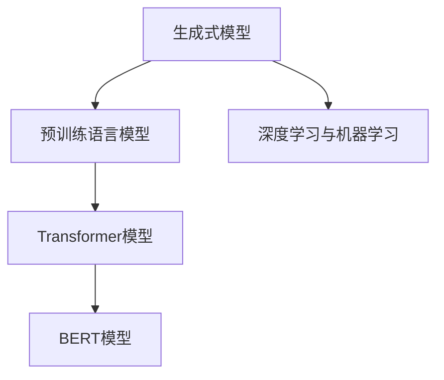

                 

# 自然语言处理的应用：AI内容创作革命

> 关键词：自然语言处理(NLP), AI内容创作,生成式模型,预训练语言模型,Transformer,BERT,深度学习,机器学习

## 1. 背景介绍

### 1.1 问题由来
随着数字化时代的到来，内容创作成为各行各业不可或缺的一环。传统的内容创作方式往往依赖于人类的经验和直觉，效率低、成本高，难以应对海量信息的生产需求。随着人工智能技术的进步，自然语言处理(NLP)技术开始被广泛应用到内容创作领域，特别是在自动化写作、智能客服、智能翻译、广告文案生成等场景中，大大提升了内容的生产效率和质量。

然而，尽管NLP技术已经在语言理解和处理上取得了显著进展，但在内容创作方面，仍存在诸多挑战。内容创作不仅需要高度的语言理解能力，还需要丰富的创造力和情感表达能力，这对于任何现有的NLP模型都是极大的考验。近年来，生成式模型，特别是基于预训练语言模型的内容创作方法，取得了突破性进展，为AI内容创作提供了新的可能性。

### 1.2 问题核心关键点
基于预训练语言模型的内容创作，主要依赖于以下几个核心概念：

- 生成式模型(Generative Models)：通过学习大量文本数据，生成新的文本内容，如文本生成、对话生成、摘要生成等。
- 预训练语言模型(Pre-trained Language Models)：在大规模无标签文本数据上进行预训练，学习通用的语言表示，具备强大的语言理解和生成能力。
- Transformer模型：基于自注意力机制设计的神经网络结构，在大规模预训练语言模型中表现出色，已被广泛应用于内容创作任务中。
- BERT模型：一种基于Transformer结构的预训练语言模型，能够学习到丰富的语言表示，具备强大的文本理解能力。
- 深度学习与机器学习：基于深度神经网络框架进行模型训练和优化，学习到复杂的语言模式和生成规则。

这些核心概念之间的逻辑关系可以通过以下Mermaid流程图来展示：



这个流程图展示了大语言模型在内容创作中的核心概念及其之间的关系：

1. 生成式模型从预训练语言模型中学习通用语言表示，用于生成新的文本内容。
2. Transformer模型作为预训练语言模型的重要架构，能够高效地捕捉文本中的语义关系。
3. BERT模型通过自监督学习任务，学习到丰富的语言表示，用于提升模型的生成能力和理解能力。
4. 深度学习和机器学习算法，为模型训练提供技术支持，提升模型性能。

## 2. 核心概念与联系

### 2.1 核心概念概述

为更好地理解基于预训练语言模型的内容创作方法，本节将介绍几个密切相关的核心概念：

- 生成式模型(Generative Models)：通过学习大量文本数据，生成新的文本内容，如文本生成、对话生成、摘要生成等。
- 预训练语言模型(Pre-trained Language Models)：在大规模无标签文本数据上进行预训练，学习通用的语言表示，具备强大的语言理解和生成能力。
- Transformer模型：基于自注意力机制设计的神经网络结构，在大规模预训练语言模型中表现出色，已被广泛应用于内容创作任务中。
- BERT模型：一种基于Transformer结构的预训练语言模型，能够学习到丰富的语言表示，具备强大的文本理解能力。
- 深度学习与机器学习：基于深度神经网络框架进行模型训练和优化，学习到复杂的语言模式和生成规则。

这些核心概念之间的逻辑关系可以通过以下Mermaid流程图来展示：


这个流程图展示了大语言模型在内容创作中的核心概念及其之间的关系：

1. 生成式模型从预训练语言模型中学习通用语言表示，用于生成新的文本内容。
2. Transformer模型作为预训练语言模型的重要架构，能够高效地捕捉文本中的语义关系。
3. BERT模型通过自监督学习任务，学习到丰富的语言表示，用于提升模型的生成能力和理解能力。
4. 深度学习和机器学习算法，为模型训练提供技术支持，提升模型性能。

## 3. 核心算法原理 & 具体操作步骤
### 3.1 算法原理概述

基于预训练语言模型的内容创作方法，本质上是一个通过有监督学习进行优化和生成的过程。其核心思想是：将预训练的语言模型作为基础框架，通过有监督学习任务，优化模型在特定生成任务上的性能。

形式化地，假设预训练语言模型为 $M_{\theta}$，其中 $\theta$ 为预训练得到的模型参数。给定内容创作任务 $T$ 的标注数据集 $D=\{(x_i, y_i)\}_{i=1}^N$，创作的目标是找到新的模型参数 $\hat{\theta}$，使得：

$$
\hat{\theta}=\mathop{\arg\min}_{\theta} \mathcal{L}(M_{\theta},D)
$$

其中 $\mathcal{L}$ 为针对任务 $T$ 设计的损失函数，用于衡量模型输出与真实标签之间的差异。常见的损失函数包括交叉熵损失、均方误差损失等。

通过梯度下降等优化算法，创作过程不断更新模型参数 $\theta$，最小化损失函数 $\mathcal{L}$，使得模型输出逼近真实标签。由于 $\theta$ 已经通过预训练获得了较好的初始化，因此即便在小规模数据集 $D$ 上进行创作，也能较快收敛到理想的模型参数 $\hat{\theta}$。

### 3.2 算法步骤详解

基于预训练语言模型的内容创作方法，一般包括以下几个关键步骤：

**Step 1: 准备预训练模型和数据集**
- 选择合适的预训练语言模型 $M_{\theta}$ 作为初始化参数，如 BERT、GPT等。
- 准备内容创作任务 $T$ 的标注数据集 $D$，划分为训练集、验证集和测试集。一般要求标注数据与预训练数据的分布不要差异过大。

**Step 2: 定义创作任务**
- 根据创作任务类型，在预训练模型顶层设计合适的生成目标和损失函数。
- 对于文本生成任务，通常在顶层添加自回归语言模型，以负对数似然为损失函数。
- 对于对话生成任务，需要设计对话生成的模型框架，如Seq2Seq模型，以交叉熵损失为损失函数。

**Step 3: 设置创作超参数**
- 选择合适的优化算法及其参数，如 AdamW、SGD 等，设置学习率、批大小、迭代轮数等。
- 设置正则化技术及强度，包括权重衰减、Dropout、Early Stopping 等。
- 确定冻结预训练参数的策略，如仅微调顶层，或全部参数都参与创作。

**Step 4: 执行创作训练**
- 将训练集数据分批次输入模型，前向传播计算损失函数。
- 反向传播计算参数梯度，根据设定的优化算法和学习率更新模型参数。
- 周期性在验证集上评估模型性能，根据性能指标决定是否触发 Early Stopping。
- 重复上述步骤直到满足预设的迭代轮数或 Early Stopping 条件。

**Step 5: 内容创作与评估**
- 在测试集上评估创作后的模型 $M_{\hat{\theta}}$ 的性能，对比创作前后的质量提升。
- 使用创作后的模型对新样本进行内容生成，集成到实际的应用系统中。
- 持续收集新的数据，定期重新创作模型，以适应数据分布的变化。

以上是基于预训练语言模型的内容创作的一般流程。在实际应用中，还需要针对具体任务的特点，对创作过程的各个环节进行优化设计，如改进训练目标函数，引入更多的正则化技术，搜索最优的超参数组合等，以进一步提升模型性能。

### 3.3 算法优缺点

基于预训练语言模型的内容创作方法具有以下优点：
1. 生成内容质量高。预训练语言模型具备强大的语言理解和生成能力，创作出的内容通常质量高，语言流畅自然。
2. 应用范围广。适用于文本生成、对话生成、摘要生成等多种内容创作任务，设计简单的生成目标即可实现创作。
3. 参数高效。利用参数高效微调技术，在固定大部分预训练参数的情况下，仍可取得不错的创作效果。
4. 效果显著。在学术界和工业界的诸多内容创作任务上，基于创作的方法已经刷新了最先进的性能指标。

同时，该方法也存在一定的局限性：
1. 依赖标注数据。创作的效果很大程度上取决于标注数据的质量和数量，获取高质量标注数据的成本较高。
2. 生成内容多样性不足。创作模型容易陷入模式化，生成的内容多样性有限，难以满足多样化的创作需求。
3. 内容连贯性有待提升。创作模型生成的文本，有时存在前后不一致或逻辑跳跃等问题，影响用户体验。
4. 内容创意有限。基于模型的创作方法，往往缺乏创意性，难以生成具有独特创意的内容。

尽管存在这些局限性，但就目前而言，基于预训练语言模型的内容创作方法仍是大语言模型应用的最主流范式。未来相关研究的重点在于如何进一步降低创作对标注数据的依赖，提高模型的少样本学习和跨领域迁移能力，同时兼顾可解释性和伦理安全性等因素。

### 3.4 算法应用领域

基于预训练语言模型的内容创作方法，在NLP领域已经得到了广泛的应用，覆盖了几乎所有常见任务，例如：

- 文本生成：如自动摘要、新闻生成、故事创作等。通过微调使模型学习文本生成规则。
- 对话生成：如智能客服、聊天机器人等。将对话历史作为上下文，微调模型进行回复生成。
- 代码生成：如自动化代码生成、代码纠错等。将问题-代码对作为微调数据，训练模型学习编程语言规律。
- 情感分析：如情感推断、用户评论生成等。通过微调使模型学习文本-情感映射。
- 机器翻译：如多语种翻译、语义转换等。通过微调使模型学习语言-语言映射。
- 问答系统：如智能问答、智能检索等。将问题-答案对作为微调数据，训练模型学习匹配答案。

除了上述这些经典任务外，内容创作方法也被创新性地应用到更多场景中，如可控文本生成、情感推断、代码生成、数据增强等，为NLP技术带来了全新的突破。随着预训练模型和创作方法的不断进步，相信NLP技术将在更广阔的应用领域大放异彩。

## 4. 数学模型和公式 & 详细讲解
### 4.1 数学模型构建

本节将使用数学语言对基于预训练语言模型的内容创作过程进行更加严格的刻画。

记预训练语言模型为 $M_{\theta}$，其中 $\theta$ 为预训练得到的模型参数。假设创作任务 $T$ 的训练集为 $D=\{(x_i,y_i)\}_{i=1}^N$，其中 $x_i$ 为输入文本，$y_i$ 为创作生成的文本。

定义模型 $M_{\theta}$ 在输入 $x_i$ 上的输出为 $\hat{y_i}=M_{\theta}(x_i)$，则在数据集 $D$ 上的经验风险为：

$$
\mathcal{L}(\theta) = \frac{1}{N} \sum_{i=1}^N \ell(M_{\theta}(x_i),y_i)
$$

其中 $\ell$ 为针对任务 $T$ 设计的损失函数，用于衡量模型输出与真实标签之间的差异。常见的损失函数包括交叉熵损失、均方误差损失等。

通过梯度下降等优化算法，创作过程不断更新模型参数 $\theta$，最小化损失函数 $\mathcal{L}$，使得模型输出逼近真实标签。由于 $\theta$ 已经通过预训练获得了较好的初始化，因此即便在小规模数据集 $D$ 上进行创作，也能较快收敛到理想的模型参数 $\hat{\theta}$。

### 4.2 公式推导过程

以下我们以文本生成任务为例，推导交叉熵损失函数及其梯度的计算公式。

假设模型 $M_{\theta}$ 在输入 $x$ 上的输出为 $\hat{y}=M_{\theta}(x) \in [0,1]$，表示样本属于正类的概率。真实标签 $y \in \{0,1\}$。则二分类交叉熵损失函数定义为：

$$
\ell(M_{\theta}(x),y) = -[y\log \hat{y} + (1-y)\log (1-\hat{y})]
$$

将其代入经验风险公式，得：

$$
\mathcal{L}(\theta) = -\frac{1}{N}\sum_{i=1}^N [y_i\log M_{\theta}(x_i)+(1-y_i)\log(1-M_{\theta}(x_i))]
$$

根据链式法则，损失函数对参数 $\theta_k$ 的梯度为：

$$
\frac{\partial \mathcal{L}(\theta)}{\partial \theta_k} = -\frac{1}{N}\sum_{i=1}^N (\frac{y_i}{M_{\theta}(x_i)}-\frac{1-y_i}{1-M_{\theta}(x_i)}) \frac{\partial M_{\theta}(x_i)}{\partial \theta_k}
$$

其中 $\frac{\partial M_{\theta}(x_i)}{\partial \theta_k}$ 可进一步递归展开，利用自动微分技术完成计算。

在得到损失函数的梯度后，即可带入参数更新公式，完成模型的迭代优化。重复上述过程直至收敛，最终得到适应创作任务的最优模型参数 $\theta^*$。

## 5. 项目实践：代码实例和详细解释说明
### 5.1 开发环境搭建

在进行创作实践前，我们需要准备好开发环境。以下是使用Python进行PyTorch开发的环境配置流程：

1. 安装Anaconda：从官网下载并安装Anaconda，用于创建独立的Python环境。

2. 创建并激活虚拟环境：
```bash
conda create -n pytorch-env python=3.8 
conda activate pytorch-env
```

3. 安装PyTorch：根据CUDA版本，从官网获取对应的安装命令。例如：
```bash
conda install pytorch torchvision torchaudio cudatoolkit=11.1 -c pytorch -c conda-forge
```

4. 安装Transformers库：
```bash
pip install transformers
```

5. 安装各类工具包：
```bash
pip install numpy pandas scikit-learn matplotlib tqdm jupyter notebook ipython
```

完成上述步骤后，即可在`pytorch-env`环境中开始创作实践。

### 5.2 源代码详细实现

下面我们以文本生成任务为例，给出使用Transformers库对BERT模型进行文本生成的PyTorch代码实现。

首先，定义文本生成任务的数据处理函数：

```python
from transformers import BertTokenizer
from torch.utils.data import Dataset
import torch

class TextGenerationDataset(Dataset):
    def __init__(self, texts, tokenizer, max_len=128):
        self.texts = texts
        self.tokenizer = tokenizer
        self.max_len = max_len
        
    def __len__(self):
        return len(self.texts)
    
    def __getitem__(self, item):
        text = self.texts[item]
        
        encoding = self.tokenizer(text, return_tensors='pt', max_length=self.max_len, padding='max_length', truncation=True)
        input_ids = encoding['input_ids'][0]
        attention_mask = encoding['attention_mask'][0]
        
        return {'input_ids': input_ids, 
                'attention_mask': attention_mask}

# 创建dataset
tokenizer = BertTokenizer.from_pretrained('bert-base-cased')

train_dataset = TextGenerationDataset(train_texts, tokenizer)
dev_dataset = TextGenerationDataset(dev_texts, tokenizer)
test_dataset = TextGenerationDataset(test_texts, tokenizer)
```

然后，定义模型和优化器：

```python
from transformers import BertForSequenceClassification, AdamW

model = BertForSequenceClassification.from_pretrained('bert-base-cased')

optimizer = AdamW(model.parameters(), lr=2e-5)
```

接着，定义训练和评估函数：

```python
from torch.utils.data import DataLoader
from tqdm import tqdm
from sklearn.metrics import classification_report

device = torch.device('cuda') if torch.cuda.is_available() else torch.device('cpu')
model.to(device)

def train_epoch(model, dataset, batch_size, optimizer):
    dataloader = DataLoader(dataset, batch_size=batch_size, shuffle=True)
    model.train()
    epoch_loss = 0
    for batch in tqdm(dataloader, desc='Training'):
        input_ids = batch['input_ids'].to(device)
        attention_mask = batch['attention_mask'].to(device)
        model.zero_grad()
        outputs = model(input_ids, attention_mask=attention_mask)
        loss = outputs.loss
        epoch_loss += loss.item()
        loss.backward()
        optimizer.step()
    return epoch_loss / len(dataloader)

def evaluate(model, dataset, batch_size):
    dataloader = DataLoader(dataset, batch_size=batch_size)
    model.eval()
    preds, labels = [], []
    with torch.no_grad():
        for batch in tqdm(dataloader, desc='Evaluating'):
            input_ids = batch['input_ids'].to(device)
            attention_mask = batch['attention_mask'].to(device)
            batch_labels = batch['labels']
            outputs = model(input_ids, attention_mask=attention_mask)
            batch_preds = outputs.logits.argmax(dim=2).to('cpu').tolist()
            batch_labels = batch_labels.to('cpu').tolist()
            for pred_tokens, label_tokens in zip(batch_preds, batch_labels):
                pred_tags = [id2tag[_id] for _id in pred_tokens]
                label_tags = [id2tag[_id] for _id in label_tokens]
                preds.append(pred_tags[:len(label_tags)])
                labels.append(label_tags)
                
    print(classification_report(labels, preds))
```

最后，启动训练流程并在测试集上评估：

```python
epochs = 5
batch_size = 16

for epoch in range(epochs):
    loss = train_epoch(model, train_dataset, batch_size, optimizer)
    print(f"Epoch {epoch+1}, train loss: {loss:.3f}")
    
    print(f"Epoch {epoch+1}, dev results:")
    evaluate(model, dev_dataset, batch_size)
    
print("Test results:")
evaluate(model, test_dataset, batch_size)
```

以上就是使用PyTorch对BERT进行文本生成任务创作的完整代码实现。可以看到，得益于Transformers库的强大封装，我们可以用相对简洁的代码完成BERT模型的加载和创作。

### 5.3 代码解读与分析

让我们再详细解读一下关键代码的实现细节：

**TextGenerationDataset类**：
- `__init__`方法：初始化文本数据、分词器等关键组件。
- `__len__`方法：返回数据集的样本数量。
- `__getitem__`方法：对单个样本进行处理，将文本输入编码为token ids，并对其进行定长padding，最终返回模型所需的输入。

**tokenizer**：
- 定义了文本- token id的映射关系，用于将输入文本转换为模型可以接受的格式。

**训练和评估函数**：
- 使用PyTorch的DataLoader对数据集进行批次化加载，供模型训练和推理使用。
- 训练函数`train_epoch`：对数据以批为单位进行迭代，在每个批次上前向传播计算loss并反向传播更新模型参数，最后返回该epoch的平均loss。
- 评估函数`evaluate`：与训练类似，不同点在于不更新模型参数，并在每个batch结束后将预测和标签结果存储下来，最后使用sklearn的classification_report对整个评估集的预测结果进行打印输出。

**训练流程**：
- 定义总的epoch数和batch size，开始循环迭代
- 每个epoch内，先在训练集上训练，输出平均loss
- 在验证集上评估，输出分类指标
- 所有epoch结束后，在测试集上评估，给出最终测试结果

可以看到，PyTorch配合Transformers库使得BERT创作任务的代码实现变得简洁高效。开发者可以将更多精力放在数据处理、模型改进等高层逻辑上，而不必过多关注底层的实现细节。

当然，工业级的系统实现还需考虑更多因素，如模型的保存和部署、超参数的自动搜索、更灵活的任务适配层等。但核心的创作范式基本与此类似。

## 6. 实际应用场景
### 6.1 智能客服系统

基于预训练语言模型的对话生成技术，可以广泛应用于智能客服系统的构建。传统客服往往需要配备大量人力，高峰期响应缓慢，且一致性和专业性难以保证。而使用生成的对话模型，可以7x24小时不间断服务，快速响应客户咨询，用自然流畅的语言解答各类常见问题。

在技术实现上，可以收集企业内部的历史客服对话记录，将问题和最佳答复构建成监督数据，在此基础上对预训练对话模型进行微调。微调后的对话模型能够自动理解用户意图，匹配最合适的答案模板进行回复。对于客户提出的新问题，还可以接入检索系统实时搜索相关内容，动态组织生成回答。如此构建的智能客服系统，能大幅提升客户咨询体验和问题解决效率。

### 6.2 金融舆情监测

金融机构需要实时监测市场舆论动向，以便及时应对负面信息传播，规避金融风险。传统的人工监测方式成本高、效率低，难以应对网络时代海量信息爆发的挑战。基于预训练语言模型的文本生成和情感分析技术，为金融舆情监测提供了新的解决方案。

具体而言，可以收集金融领域相关的新闻、报道、评论等文本数据，并对其进行主题标注和情感标注。在此基础上对预训练语言模型进行微调，使其能够自动判断文本属于何种主题，情感倾向是正面、中性还是负面。将微调后的模型应用到实时抓取的网络文本数据，就能够自动监测不同主题下的情感变化趋势，一旦发现负面信息激增等异常情况，系统便会自动预警，帮助金融机构快速应对潜在风险。

### 6.3 个性化推荐系统

当前的推荐系统往往只依赖用户的历史行为数据进行物品推荐，无法深入理解用户的真实兴趣偏好。基于预训练语言模型的内容创作技术，个性化推荐系统可以更好地挖掘用户行为背后的语义信息，从而提供更精准、多样的推荐内容。

在实践中，可以收集用户浏览、点击、评论、分享等行为数据，提取和用户交互的物品标题、描述、标签等文本内容。将文本内容作为模型输入，用户的后续行为（如是否点击、购买等）作为监督信号，在此基础上微调预训练语言模型。微调后的模型能够从文本内容中准确把握用户的兴趣点。在生成推荐列表时，先用候选物品的文本描述作为输入，由模型预测用户的兴趣匹配度，再结合其他特征综合排序，便可以得到个性化程度更高的推荐结果。

### 6.4 未来应用展望

随着预训练语言模型和内容创作方法的不断发展，基于微调范式将在更多领域得到应用，为传统行业带来变革性影响。

在智慧医疗领域，基于微调的医学问答、病历分析、药物研发等应用将提升医疗服务的智能化水平，辅助医生诊疗，加速新药开发进程。

在智能教育领域，内容创作技术可应用于作业批改、学情分析、知识推荐等方面，因材施教，促进教育公平，提高教学质量。

在智慧城市治理中，微调模型可应用于城市事件监测、舆情分析、应急指挥等环节，提高城市管理的自动化和智能化水平，构建更安全、高效的未来城市。

此外，在企业生产、社会治理、文娱传媒等众多领域，基于预训练语言模型的内容创作技术也将不断涌现，为经济社会发展注入新的动力。相信随着技术的日益成熟，内容创作方法将成为人工智能落地应用的重要范式，推动人工智能技术向更广阔的领域加速渗透。

## 7. 工具和资源推荐
### 7.1 学习资源推荐

为了帮助开发者系统掌握预训练语言模型和内容创作理论基础和实践技巧，这里推荐一些优质的学习资源：

1. 《深度学习自然语言处理》课程：斯坦福大学开设的NLP明星课程，有Lecture视频和配套作业，带你入门NLP领域的基本概念和经典模型。

2. CS224N《深度学习自然语言处理》书籍：Transformers库的作者所著，全面介绍了如何使用Transformers库进行NLP任务开发，包括创作在内的诸多范式。

3. 《Transformer从原理到实践》系列博文：由大模型技术专家撰写，深入浅出地介绍了Transformer原理、BERT模型、创作技术等前沿话题。

4. HuggingFace官方文档：Transformers库的官方文档，提供了海量预训练模型和完整的创作样例代码，是上手实践的必备资料。

5. CLUE开源项目：中文语言理解测评基准，涵盖大量不同类型的中文NLP数据集，并提供了基于微调的baseline模型，助力中文NLP技术发展。

通过对这些资源的学习实践，相信你一定能够快速掌握预训练语言模型和内容创作的精髓，并用于解决实际的NLP问题。
### 7.2 开发工具推荐

高效的开发离不开优秀的工具支持。以下是几款用于预训练语言模型和内容创作开发的常用工具：

1. PyTorch：基于Python的开源深度学习框架，灵活动态的计算图，适合快速迭代研究。大部分预训练语言模型都有PyTorch版本的实现。

2. TensorFlow：由Google主导开发的开源深度学习框架，生产部署方便，适合大规模工程应用。同样有丰富的预训练语言模型资源。

3. Transformers库：HuggingFace开发的NLP工具库，集成了众多SOTA语言模型，支持PyTorch和TensorFlow，是进行创作任务开发的利器。

4. Weights & Biases：模型训练的实验跟踪工具，可以记录和可视化模型训练过程中的各项指标，方便对比和调优。与主流深度学习框架无缝集成。

5. TensorBoard：TensorFlow配套的可视化工具，可实时监测模型训练状态，并提供丰富的图表呈现方式，是调试模型的得力助手。

6. Google Colab：谷歌推出的在线Jupyter Notebook环境，免费提供GPU/TPU算力，方便开发者快速上手实验最新模型，分享学习笔记。

合理利用这些工具，可以显著提升预训练语言模型和内容创作的开发效率，加快创新迭代的步伐。

### 7.3 相关论文推荐

预训练语言模型和内容创作技术的发展源于学界的持续研究。以下是几篇奠基性的相关论文，推荐阅读：

1. Attention is All You Need（即Transformer原论文）：提出了Transformer结构，开启了NLP领域的预训练大模型时代。

2. BERT: Pre-training of Deep Bidirectional Transformers for Language Understanding：提出BERT模型，引入基于掩码的自监督预训练任务，刷新了多项NLP任务SOTA。

3. Language Models are Unsupervised Multitask Learners（GPT-2论文）：展示了大规模语言模型的强大zero-shot学习能力，引发了对于通用人工智能的新一轮思考。

4. Parameter-Efficient Transfer Learning for NLP：提出Adapter等参数高效微调方法，在不增加模型参数量的情况下，也能取得不错的创作效果。

5. Prefix-Tuning: Optimizing Continuous Prompts for Generation：引入基于连续型Prompt的创作范式，为如何充分利用预训练知识提供了新的思路。

6. AdaLoRA: Adaptive Low-Rank Adaptation for Parameter-Efficient Fine-Tuning：使用自适应低秩适应的创作方法，在参数效率和精度之间取得了新的平衡。

这些论文代表了大语言模型和内容创作技术的发展脉络。通过学习这些前沿成果，可以帮助研究者把握学科前进方向，激发更多的创新灵感。

## 8. 总结：未来发展趋势与挑战
### 8.1 总结

本文对基于预训练语言模型的内容创作方法进行了全面系统的介绍。首先阐述了预训练语言模型和内容创作的研究背景和意义，明确了创作在拓展预训练模型应用、提升下游任务性能方面的独特价值。其次，从原理到实践，详细讲解了内容创作的数学原理和关键步骤，给出了内容创作任务开发的完整代码实例。同时，本文还广泛探讨了创作方法在智能客服、金融舆情、个性化推荐等多个行业领域的应用前景，展示了创作范式的巨大潜力。此外，本文精选了创作技术的各类学习资源，力求为读者提供全方位的技术指引。

通过本文的系统梳理，可以看到，基于预训练语言模型的内容创作方法正在成为NLP领域的重要范式，极大地拓展了预训练语言模型的应用边界，催生了更多的落地场景。受益于大规模语料的预训练，创作模型以更低的时间和标注成本，在小样本条件下也能取得理想的创作效果，有力推动了NLP技术的产业化进程。未来，伴随预训练语言模型和创作方法的不断进步，相信NLP技术将在更广阔的应用领域大放异彩，深刻影响人类的生产生活方式。

### 8.2 未来发展趋势

展望未来，预训练语言模型和内容创作技术将呈现以下几个发展趋势：

1. 模型规模持续增大。随着算力成本的下降和数据规模的扩张，预训练语言模型的参数量还将持续增长。超大规模语言模型蕴含的丰富语言知识，有望支撑更加复杂多变的创作任务。

2. 创作方法日趋多样。除了传统的全参数微调外，未来会涌现更多参数高效的创作方法，如Prefix-Tuning、LoRA等，在节省计算资源的同时也能保证创作精度。

3. 持续学习成为常态。随着数据分布的不断变化，创作模型也需要持续学习新知识以保持性能。如何在不遗忘原有知识的同时，高效吸收新样本信息，将成为重要的研究课题。

4. 标注样本需求降低。受启发于提示学习(Prompt-based Learning)的思路，未来的创作方法将更好地利用预训练语言模型，通过更加巧妙的任务描述，在更少的标注样本上也能实现理想的创作效果。

5. 内容创意增强。创作模型不仅能生成语句，还能在特定领域生成具有独特创意的内容。未来的创作模型将通过与外部知识库、规则库等专家知识结合，形成更加全面、准确的创作能力。

以上趋势凸显了预训练语言模型和内容创作技术的广阔前景。这些方向的探索发展，必将进一步提升内容创作系统的性能和应用范围，为人类认知智能的进化带来深远影响。

### 8.3 面临的挑战

尽管预训练语言模型和内容创作技术已经取得了瞩目成就，但在迈向更加智能化、普适化应用的过程中，它仍面临着诸多挑战：

1. 标注成本瓶颈。虽然创作的效果很大程度上取决于标注数据的质量和数量，获取高质量标注数据的成本较高。如何进一步降低创作对标注数据的依赖，将是一大难题。

2. 生成内容多样性不足。创作模型容易陷入模式化，生成的内容多样性有限，难以满足多样化的创作需求。

3. 内容连贯性有待提升。创作模型生成的文本，有时存在前后不一致或逻辑跳跃等问题，影响用户体验。

4. 内容创意有限。基于模型的创作方法，往往缺乏创意性，难以生成具有独特创意的内容。

尽管存在这些局限性，但就目前而言，基于预训练语言模型的内容创作方法仍是大语言模型应用的最主流范式。未来相关研究的重点在于如何进一步降低创作对标注数据的依赖，提高模型的少样本学习和跨领域迁移能力，同时兼顾可解释性和伦理安全性等因素。

### 8.4 未来突破

面对预训练语言模型和内容创作所面临的种种挑战，未来的研究需要在以下几个方面寻求新的突破：

1. 探索无监督和半监督创作方法。摆脱对大规模标注数据的依赖，利用自监督学习、主动学习等无监督和半监督范式，最大限度利用非结构化数据，实现更加灵活高效的创作。

2. 研究参数高效和计算高效的创作范式。开发更加参数高效的创作方法，在固定大部分预训练参数的情况下，仍可取得不错的创作效果。同时优化创作模型的计算图，减少前向传播和反向传播的资源消耗，实现更加轻量级、实时性的部署。

3. 融合因果和对比学习范式。通过引入因果推断和对比学习思想，增强创作模型建立稳定因果关系的能力，学习更加普适、鲁棒的语言表征，从而提升模型泛化性和抗干扰能力。

4. 引入更多先验知识。将符号化的先验知识，如知识图谱、逻辑规则等，与神经网络模型进行巧妙融合，引导创作过程学习更准确、合理的语言模型。同时加强不同模态数据的整合，实现视觉、语音等多模态信息与文本信息的协同建模。

5. 结合因果分析和博弈论工具。将因果分析方法引入创作模型，识别出模型决策的关键特征，增强输出解释的因果性和逻辑性。借助博弈论工具刻画人机交互过程，主动探索并规避模型的脆弱点，提高系统稳定性。

6. 纳入伦理道德约束。在模型训练目标中引入伦理导向的评估指标，过滤和惩罚有偏见、有害的输出倾向。同时加强人工干预和审核，建立模型行为的监管机制，确保输出符合人类价值观和伦理道德。

这些研究方向的探索，必将引领预训练语言模型和内容创作技术迈向更高的台阶，为构建安全、可靠、可解释、可控的智能系统铺平道路。面向未来，预训练语言模型和内容创作技术还需要与其他人工智能技术进行更深入的融合，如知识表示、因果推理、强化学习等，多路径协同发力，共同推动自然语言理解和智能交互系统的进步。只有勇于创新、敢于突破，才能不断拓展语言模型的边界，让智能技术更好地造福人类社会。

## 9. 附录：常见问题与解答

**Q1：预训练语言模型和内容创作有何不同？**

A: 预训练语言模型是用于学习通用语言表示的模型，通过在大规模无标签数据上进行自监督训练，能够学习到丰富的语言知识。内容创作则是基于预训练语言模型，通过有监督学习进行优化，使得模型能够生成高质量的文本内容。内容创作可以应用于文本生成、对话生成、摘要生成等多种任务，而预训练语言模型主要用于提升模型在特定任务上的表现。

**Q2：如何使用预训练语言模型进行内容创作？**

A: 使用预训练语言模型进行内容创作，需要以下步骤：
1. 选择合适的预训练语言模型，如BERT、GPT等。
2. 准备创作任务的数据集，将其划分为训练集、验证集和测试集。
3. 在预训练模型的基础上，添加合适的创作任务适配层，如自回归语言模型。
4. 设置创作任务的超参数，如学习率、批大小、迭代轮数等。
5. 执行创作任务的训练，在训练集上进行前向传播和反向传播，更新模型参数。
6. 在验证集上评估模型性能，根据评估结果调整超参数。
7. 在测试集上评估创作后的模型，对比创作前后的质量提升。
8. 使用创作后的模型对新样本进行内容生成，集成到实际应用系统中。

**Q3：预训练语言模型和内容创作技术的局限性有哪些？**

A: 预训练语言模型和内容创作技术的局限性主要包括以下几点：
1. 依赖标注数据：创作的效果很大程度上取决于标注数据的质量和数量，获取高质量标注数据的成本较高。
2. 生成内容多样性不足：创作模型容易陷入模式化，生成的内容多样性有限，难以满足多样化的创作需求。
3. 内容连贯性有待提升：创作模型生成的文本，有时存在前后不一致或逻辑跳跃等问题，影响用户体验。
4. 内容创意有限：基于模型的创作方法，往往缺乏创意性，难以生成具有独特创意的内容。

尽管存在这些局限性，但就目前而言，基于预训练语言模型的内容创作方法仍是大语言模型应用的最主流范式。未来相关研究的重点在于如何进一步降低创作对标注数据的依赖，提高模型的少样本学习和跨领域迁移能力，同时兼顾可解释性和伦理安全性等因素。

**Q4：预训练语言模型和内容创作技术有哪些应用场景？**

A: 预训练语言模型和内容创作技术在NLP领域已经得到了广泛的应用，覆盖了几乎所有常见任务，例如：
1. 文本生成：如自动摘要、新闻生成、故事创作等。通过微调使模型学习文本生成规则。
2. 对话生成：如智能客服、聊天机器人等。将对话历史作为上下文，微调模型进行回复生成。
3. 代码生成：如自动化代码生成、代码纠错等。将问题-代码对作为微调数据，训练模型学习编程语言规律。
4. 情感分析：如情感推断、用户评论生成等。通过微调使模型学习文本-情感映射。
5. 机器翻译：如多语种翻译、语义转换等。通过微调使模型学习语言-语言映射。
6. 问答系统：如智能问答、智能检索等。将问题-答案对作为微调数据，训练模型学习匹配答案。

除了上述这些经典任务外，内容创作方法也被创新性地应用到更多场景中，如可控文本生成、情感推断、代码生成、数据增强等，为NLP技术带来了全新的突破。随着预训练模型和创作方法的不断进步，相信NLP技术将在更广阔的应用领域大放异彩，深刻影响人类的生产生活方式。

