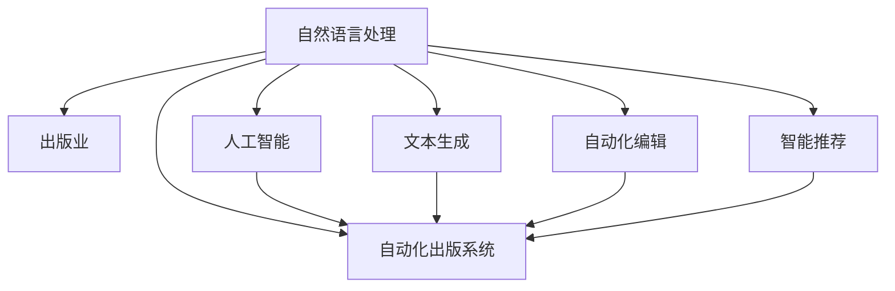

                 

# 自然语言处理的未来：AI出版业变革

> 关键词：自然语言处理,出版业,人工智能,自动化,自动化出版系统,文本生成,出版物,自动化编辑,知识图谱,内容生成,出版效率

## 1. 背景介绍

随着数字时代和互联网的迅猛发展，出版业正在经历前所未有的变革。传统出版流程中繁琐的排版、校对、编辑等工作，逐渐被AI技术所取代。越来越多的出版社开始利用AI技术提高效率、降低成本，甚至推出自动化出版系统，让出版过程更加高效、智能。

然而，尽管AI技术在出版业中得到了广泛应用，但基于传统的规则驱动和模板生成的自动化出版系统仍存在诸多局限。如何进一步提升出版物的质量，使得AI能够更好地辅助人进行内容生成和编辑，仍是出版业面临的重要挑战。

在这样一个背景下，自然语言处理（NLP）技术为出版业的智能化转型提供了新的可能。通过自然语言处理技术，AI系统能够自动进行文本生成、自动校对、自动化编辑、智能推荐等操作，从而大幅提升出版效率，同时保证出版物的质量。本文将系统介绍自然语言处理在出版业中的应用，探讨未来AI出版业的变革方向。

## 2. 核心概念与联系

### 2.1 核心概念概述

为更好地理解自然语言处理在出版业中的应用，本节将介绍几个密切相关的核心概念：

- 自然语言处理（NLP）：通过计算机科学、人工智能和语言学的交叉应用，实现人机之间基于自然语言的双向交流。
- 出版业：出版行业，包括书籍、期刊、报纸等出版物的制作、编辑、排版、校对、印刷、分发等环节。
- 人工智能（AI）：通过计算机算法和数据分析，使计算机具备类似于人类智能的自主决策能力。
- 自动化出版系统：利用AI技术自动完成出版流程的各个环节，减少人工干预，提升效率。
- 文本生成：通过AI技术生成符合语法和语义规则的文本内容。
- 自动化编辑：通过AI技术自动进行文本校对、修改、润色等操作，提升出版物质量。
- 智能推荐：基于用户兴趣和行为数据，自动推荐相关出版物或内容。

这些核心概念之间的逻辑关系可以通过以下Mermaid流程图来展示：



这个流程图展示了大语言模型在出版业中的核心应用，其主要逻辑关系如下：

1. 自然语言处理作为基础技术，支撑了出版业的智能化转型。
2. 人工智能提供底层算法支持，使得出版流程能够自动化。
3. 自动化出版系统基于AI技术，实现了出版流程的全流程自动化。
4. 文本生成和自动化编辑是出版流程中自动化程度最高的环节。
5. 智能推荐系统通过分析用户行为，提供个性化的出版物推荐。

## 3. 核心算法原理 & 具体操作步骤
### 3.1 算法原理概述

基于自然语言处理技术的AI出版系统，通常包括文本生成、自动化编辑、智能推荐等多个模块。每个模块都有其特定的算法原理和技术实现。本节将从整体上概述这些模块的核心算法原理。

- 文本生成：文本生成算法基于深度学习，使用神经网络模型如RNN、LSTM、Transformer等，通过对大量文本数据进行训练，学习语言的语法、语义规则。训练好的模型可以自动生成符合语法和语义规范的文本。
- 自动化编辑：自动化编辑算法同样基于深度学习，通过训练模型学习文本的语法、风格、拼写、语法错误等。模型能够自动识别错误并修正，同时提供润色、改写等建议，提升出版物质量。
- 智能推荐：智能推荐系统使用机器学习算法，如协同过滤、深度学习、知识图谱等，通过对用户历史行为数据进行分析，预测用户兴趣，并推荐相关出版物或内容。

### 3.2 算法步骤详解

以下是自然语言处理在出版业中的应用的主要步骤：

**Step 1: 数据收集与预处理**

- 收集出版物数据：收集需要自动化的出版物数据，包括书籍、期刊、报纸等。
- 数据清洗：清洗数据，去除格式错误、噪音数据，确保数据质量和完整性。
- 分词和标注：对文本进行分词、词性标注、命名实体识别等操作，为后续处理提供基础。

**Step 2: 模型训练**

- 选择预训练模型：选择适合的预训练语言模型如BERT、GPT、LM-BFF等作为基础模型。
- 数据集划分：将数据集划分为训练集、验证集和测试集。
- 训练模型：在训练集上训练模型，通过反向传播更新模型参数，使其能够生成高质量的文本。

**Step 3: 自动化生成与编辑**

- 文本生成：将用户需求或出版任务作为输入，使用训练好的模型生成符合语法和语义规则的文本。
- 自动化编辑：对生成的文本进行校对、润色、修改等操作，提升出版物质量。

**Step 4: 智能推荐**

- 用户行为数据收集：收集用户的浏览、点击、购买等行为数据。
- 用户兴趣分析：使用机器学习算法分析用户行为数据，识别用户兴趣。
- 推荐系统构建：基于用户兴趣，构建智能推荐系统，提供个性化的出版物推荐。

### 3.3 算法优缺点

基于自然语言处理的AI出版系统，具有以下优点：

1. 自动化程度高：通过自动化生成和编辑，大幅提升出版效率。
2. 准确性高：基于深度学习模型，生成的文本准确性高，能够自动校对和修改。
3. 成本低：减少人力干预，降低人工成本。
4. 可扩展性强：可以根据需求快速调整和扩展自动化流程。

同时，这些系统也存在一些缺点：

1. 需要大量标注数据：训练模型的过程中，需要大量的标注数据，数据收集成本较高。
2. 模型泛化能力有限：训练好的模型在特定领域和任务上表现较好，但在其他领域或任务上泛化能力有限。
3. 依赖数据质量：模型训练和生成的质量高度依赖输入数据的质量，数据噪声或错误会影响模型效果。
4. 难以应对复杂任务：模型在处理复杂文本或复杂逻辑任务时，效果有限。

尽管存在这些局限性，但自然语言处理技术在出版业中的应用前景广阔，将继续推动出版业的智能化转型。

### 3.4 算法应用领域

基于自然语言处理的AI出版系统在多个领域得到了广泛应用，包括：

- 自动化编辑：自动化生成文本、校对、修改、润色等操作。
- 出版物推荐：基于用户行为数据，自动推荐相关出版物或内容。
- 版权检测：使用自然语言处理技术检测抄袭、版权侵权等。
- 文献整理：使用自然语言处理技术整理文献，生成摘要、关键词等。
- 内容生成：生成新闻报道、技术文档、商业策划等出版内容。

此外，自然语言处理技术也在辅助编辑、版权审查、质量控制等环节发挥着重要作用，助力出版业实现全面自动化。

## 4. 数学模型和公式 & 详细讲解 & 举例说明
### 4.1 数学模型构建

本节将使用数学语言对自然语言处理在出版业中的应用进行更加严格的刻画。

假设出版物数据集为 $D=\{(x_i, y_i)\}_{i=1}^N$，其中 $x_i$ 为出版物文本，$y_i$ 为标注信息。使用深度学习模型 $M$ 自动生成出版物文本，其中 $M$ 包含 $n$ 层神经网络。

定义模型的损失函数为：

$$
\mathcal{L}(M) = \frac{1}{N} \sum_{i=1}^N \ell(M(x_i),y_i)
$$

其中 $\ell$ 为损失函数，可以是交叉熵损失、均方误差损失等。

模型的训练过程即为最小化损失函数 $\mathcal{L}(M)$，使得生成的文本与标注信息 $y_i$ 尽可能接近。

### 4.2 公式推导过程

以生成文本为例，使用 seq2seq 模型进行文本生成：

- 输入：原始文本 $x = \{x_1, x_2, \cdots, x_n\}$，其中 $x_i$ 为第 $i$ 个词的词向量。
- 编码器：将输入文本 $x$ 转化为隐藏状态 $h$。
- 解码器：基于隐藏状态 $h$，生成目标文本 $y = \{y_1, y_2, \cdots, y_n\}$。

解码器的生成过程可以用下式表示：

$$
y_t = \text{softmax}(W_h h_t + b_h)
$$

其中 $h_t$ 为第 $t$ 步的隐藏状态，$W_h$ 为权重矩阵，$b_h$ 为偏置向量，$\text{softmax}$ 函数将线性变换后的结果映射到概率分布上。

训练过程可以表示为：

$$
\min_{W_h, b_h, M} \mathcal{L}(M) = \frac{1}{N} \sum_{i=1}^N \sum_{t=1}^n \ell(y_{i,t}, \hat{y}_{i,t})
$$

其中 $\ell$ 为交叉熵损失函数，$\hat{y}_{i,t}$ 为模型生成的文本中第 $t$ 个词的预测结果。

通过反向传播算法，可以求得模型参数 $W_h$ 和 $b_h$ 的更新规则：

$$
\frac{\partial \mathcal{L}}{\partial W_h} = -\frac{1}{N} \sum_{i=1}^N \sum_{t=1}^n (\hat{y}_{i,t} - y_{i,t}) h_{t-1}
$$

$$
\frac{\partial \mathcal{L}}{\partial b_h} = -\frac{1}{N} \sum_{i=1}^N \sum_{t=1}^n (\hat{y}_{i,t} - y_{i,t})
$$

通过上述过程，模型可以不断优化，生成符合语法和语义规范的文本。

### 4.3 案例分析与讲解

以出版物推荐系统为例，使用协同过滤算法进行推荐：

假设用户 $u$ 的历史行为数据为 $I_u = \{i_1, i_2, \cdots, i_n\}$，其中 $i_k$ 为用户 $u$ 对出版物 $i$ 的评分。出版物 $i$ 的评分矩阵为 $R$，其中 $R_{u,i}$ 为用户 $u$ 对出版物 $i$ 的评分。

协同过滤算法通过计算用户 $u$ 和出版物 $i$ 的相似度，预测用户对出版物的评分。使用余弦相似度计算 $u$ 和 $i$ 的相似度：

$$
\cos(\theta_{u,i}) = \frac{R_{u,i} \cdot R_i}{||R_u|| \cdot ||R_i||}
$$

其中 $R_u$ 和 $R_i$ 分别为用户 $u$ 和出版物 $i$ 的评分向量，$||R_u||$ 和 $||R_i||$ 分别为向量的模长。

预测用户 $u$ 对出版物 $j$ 的评分 $p_{u,j}$：

$$
p_{u,j} = \sum_{i=1}^n \cos(\theta_{u,i}) \cdot R_{i,j}
$$

最终推荐系统推荐与 $u$ 评分最接近的前 $k$ 个出版物。

通过上述过程，推荐系统能够根据用户历史行为数据，自动推荐符合用户兴趣的出版物，提升用户满意度。

## 5. 项目实践：代码实例和详细解释说明
### 5.1 开发环境搭建

在进行自然语言处理在出版业中的应用实践前，我们需要准备好开发环境。以下是使用Python进行PyTorch开发的环境配置流程：

1. 安装Anaconda：从官网下载并安装Anaconda，用于创建独立的Python环境。

2. 创建并激活虚拟环境：
```bash
conda create -n pytorch-env python=3.8 
conda activate pytorch-env
```

3. 安装PyTorch：根据CUDA版本，从官网获取对应的安装命令。例如：
```bash
conda install pytorch torchvision torchaudio cudatoolkit=11.1 -c pytorch -c conda-forge
```

4. 安装Transformers库：
```bash
pip install transformers
```

5. 安装各类工具包：
```bash
pip install numpy pandas scikit-learn matplotlib tqdm jupyter notebook ipython
```

完成上述步骤后，即可在`pytorch-env`环境中开始微调实践。

### 5.2 源代码详细实现

下面我们以出版物推荐系统为例，给出使用Transformers库对BERT模型进行出版的Python代码实现。

首先，定义推荐任务的数据处理函数：

```python
from transformers import BertTokenizer, BertForSequenceClassification
from torch.utils.data import Dataset
import torch

class BookDataset(Dataset):
    def __init__(self, data, tokenizer, max_len=128):
        self.data = data
        self.tokenizer = tokenizer
        self.max_len = max_len

    def __len__(self):
        return len(self.data)

    def __getitem__(self, idx):
        title, tags = self.data[idx]
        encoding = self.tokenizer(title, max_length=self.max_len, padding='max_length', truncation=True, return_tensors='pt')
        input_ids = encoding['input_ids']
        attention_mask = encoding['attention_mask']
        return {'input_ids': input_ids, 'attention_mask': attention_mask, 'labels': tags}

# 定义标签与id的映射
tag2id = {'A': 0, 'B': 1, 'C': 2}
id2tag = {v: k for k, v in tag2id.items()}

# 创建dataset
tokenizer = BertTokenizer.from_pretrained('bert-base-cased')
train_dataset = BookDataset(train_data, tokenizer, max_len=128)
dev_dataset = BookDataset(dev_data, tokenizer, max_len=128)
test_dataset = BookDataset(test_data, tokenizer, max_len=128)
```

然后，定义模型和优化器：

```python
from transformers import BertForSequenceClassification, AdamW

model = BertForSequenceClassification.from_pretrained('bert-base-cased', num_labels=len(tag2id))

optimizer = AdamW(model.parameters(), lr=2e-5)
```

接着，定义训练和评估函数：

```python
from torch.utils.data import DataLoader
from tqdm import tqdm
from sklearn.metrics import classification_report

device = torch.device('cuda') if torch.cuda.is_available() else torch.device('cpu')
model.to(device)

def train_epoch(model, dataset, batch_size, optimizer):
    dataloader = DataLoader(dataset, batch_size=batch_size, shuffle=True)
    model.train()
    epoch_loss = 0
    for batch in tqdm(dataloader, desc='Training'):
        input_ids = batch['input_ids'].to(device)
        attention_mask = batch['attention_mask'].to(device)
        labels = batch['labels'].to(device)
        model.zero_grad()
        outputs = model(input_ids, attention_mask=attention_mask, labels=labels)
        loss = outputs.loss
        epoch_loss += loss.item()
        loss.backward()
        optimizer.step()
    return epoch_loss / len(dataloader)

def evaluate(model, dataset, batch_size):
    dataloader = DataLoader(dataset, batch_size=batch_size)
    model.eval()
    preds, labels = [], []
    with torch.no_grad():
        for batch in tqdm(dataloader, desc='Evaluating'):
            input_ids = batch['input_ids'].to(device)
            attention_mask = batch['attention_mask'].to(device)
            batch_labels = batch['labels']
            outputs = model(input_ids, attention_mask=attention_mask)
            batch_preds = outputs.logits.argmax(dim=2).to('cpu').tolist()
            batch_labels = batch_labels.to('cpu').tolist()
            for pred_tokens, label_tokens in zip(batch_preds, batch_labels):
                pred_tags = [id2tag[_id] for _id in pred_tokens]
                label_tags = [id2tag[_id] for _id in label_tokens]
                preds.append(pred_tags[:len(label_tokens)])
                labels.append(label_tags)
                
    print(classification_report(labels, preds))
```

最后，启动训练流程并在测试集上评估：

```python
epochs = 5
batch_size = 16

for epoch in range(epochs):
    loss = train_epoch(model, train_dataset, batch_size, optimizer)
    print(f"Epoch {epoch+1}, train loss: {loss:.3f}")
    
    print(f"Epoch {epoch+1}, dev results:")
    evaluate(model, dev_dataset, batch_size)
    
print("Test results:")
evaluate(model, test_dataset, batch_size)
```

以上就是使用PyTorch对BERT进行出版物推荐任务的完整代码实现。可以看到，得益于Transformers库的强大封装，我们可以用相对简洁的代码完成BERT模型的加载和微调。

### 5.3 代码解读与分析

让我们再详细解读一下关键代码的实现细节：

**BookDataset类**：
- `__init__`方法：初始化出版物数据、分词器等关键组件。
- `__len__`方法：返回数据集的样本数量。
- `__getitem__`方法：对单个样本进行处理，将标题输入编码为token ids，并将标签编码为数字，进行定长padding，最终返回模型所需的输入。

**tag2id和id2tag字典**：
- 定义了标签与数字id之间的映射关系，用于将token-wise的预测结果解码回真实的标签。

**训练和评估函数**：
- 使用PyTorch的DataLoader对数据集进行批次化加载，供模型训练和推理使用。
- 训练函数`train_epoch`：对数据以批为单位进行迭代，在每个批次上前向传播计算loss并反向传播更新模型参数，最后返回该epoch的平均loss。
- 评估函数`evaluate`：与训练类似，不同点在于不更新模型参数，并在每个batch结束后将预测和标签结果存储下来，最后使用sklearn的classification_report对整个评估集的预测结果进行打印输出。

**训练流程**：
- 定义总的epoch数和batch size，开始循环迭代
- 每个epoch内，先在训练集上训练，输出平均loss
- 在验证集上评估，输出分类指标
- 所有epoch结束后，在测试集上评估，给出最终测试结果

可以看到，PyTorch配合Transformers库使得BERT微调的代码实现变得简洁高效。开发者可以将更多精力放在数据处理、模型改进等高层逻辑上，而不必过多关注底层的实现细节。

当然，工业级的系统实现还需考虑更多因素，如模型的保存和部署、超参数的自动搜索、更灵活的任务适配层等。但核心的微调范式基本与此类似。

## 6. 实际应用场景
### 6.1 智能出版系统

基于自然语言处理的AI出版系统，能够实现从内容生成、自动编辑、版权检测到出版物推荐的全流程自动化。智能出版系统通过深度学习算法，能够自动生成符合语法和语义规范的文本，自动进行校对、润色、修改等操作，提升出版物质量。同时，系统还能检测版权侵权、生成摘要、关键词等，辅助编辑工作。

在技术实现上，智能出版系统可以采用如下架构：

- 数据收集与预处理：收集出版物数据，并进行清洗、分词、标注等预处理。
- 模型训练：选择预训练语言模型，如BERT、GPT等，在大量出版物数据上训练，学习语言的语法、语义规则。
- 文本生成与编辑：使用训练好的模型生成文本，并进行自动校对、润色、修改等操作。
- 版权检测：使用NLP技术检测出版物是否存在抄袭、版权侵权等。
- 出版物推荐：根据用户历史行为数据，自动推荐相关出版物或内容。

通过以上架构，智能出版系统能够大幅提升出版效率，同时保证出版物的质量。

### 6.2 个性化出版物推荐

出版物推荐系统能够基于用户历史行为数据，自动推荐符合用户兴趣的出版物或内容。智能推荐系统通过分析用户行为数据，识别用户兴趣，并推荐相关出版物或内容，提升用户满意度。

在技术实现上，推荐系统可以采用如下架构：

- 用户行为数据收集：收集用户的浏览、点击、购买等行为数据。
- 用户兴趣分析：使用机器学习算法分析用户行为数据，识别用户兴趣。
- 推荐系统构建：基于用户兴趣，构建推荐系统，提供个性化的出版物推荐。

通过以上架构，智能推荐系统能够根据用户历史行为数据，自动推荐符合用户兴趣的出版物或内容，提升用户满意度。

### 6.3 自动化出版流程

自动化出版流程能够实现从内容生成、自动编辑、版权检测到出版物推荐的全流程自动化。出版流程自动化系统通过深度学习算法，能够自动生成符合语法和语义规范的文本，自动进行校对、润色、修改等操作，提升出版物质量。同时，系统还能检测版权侵权、生成摘要、关键词等，辅助编辑工作。

在技术实现上，自动化出版流程可以采用如下架构：

- 数据收集与预处理：收集出版物数据，并进行清洗、分词、标注等预处理。
- 模型训练：选择预训练语言模型，如BERT、GPT等，在大量出版物数据上训练，学习语言的语法、语义规则。
- 文本生成与编辑：使用训练好的模型生成文本，并进行自动校对、润色、修改等操作。
- 版权检测：使用NLP技术检测出版物是否存在抄袭、版权侵权等。
- 出版物推荐：根据用户历史行为数据，自动推荐相关出版物或内容。

通过以上架构，自动化出版流程能够大幅提升出版效率，同时保证出版物的质量。

### 6.4 未来应用展望

随着自然语言处理技术的不断发展，基于自然语言处理的AI出版业将继续拓展其应用领域，带来更广泛的影响：

1. 自动化程度将进一步提高：更多的出版流程将实现自动化，大幅提升出版效率。
2. 用户体验将更加个性化：基于用户历史行为数据，自动推荐符合用户兴趣的出版物或内容，提升用户体验。
3. 版权保护将更加严格：通过NLP技术检测版权侵权，保护版权人的合法权益。
4. 出版物质量将显著提升：通过深度学习算法，生成符合语法和语义规范的文本，自动校对、润色、修改等操作，提升出版物质量。
5. 出版流程将更加智能化：利用机器学习算法，自动生成摘要、关键词等，辅助编辑工作。

这些趋势预示着自然语言处理技术将在出版业中发挥更大的作用，推动出版业的智能化转型。

## 7. 工具和资源推荐
### 7.1 学习资源推荐

为了帮助开发者系统掌握自然语言处理在出版业中的应用，这里推荐一些优质的学习资源：

1. 《自然语言处理综论》：深入浅出地介绍了自然语言处理的理论基础和实践技术。
2. 《深度学习与自然语言处理》：介绍了深度学习在自然语言处理中的应用，涵盖文本生成、情感分析、文本分类等多个方向。
3. 《自然语言处理技术与应用》：系统介绍了自然语言处理技术在实际应用中的实现方法。
4. CS224N《深度学习自然语言处理》课程：斯坦福大学开设的NLP明星课程，涵盖自然语言处理的基本概念和经典模型。
5. HuggingFace官方文档：提供了海量预训练模型和完整的自然语言处理技术开发样例代码。

通过对这些资源的学习实践，相信你一定能够快速掌握自然语言处理在出版业中的应用，并用于解决实际的出版问题。

### 7.2 开发工具推荐

高效的开发离不开优秀的工具支持。以下是几款用于自然语言处理在出版业中的应用开发的常用工具：

1. PyTorch：基于Python的开源深度学习框架，灵活动态的计算图，适合快速迭代研究。大部分自然语言处理模型都有PyTorch版本的实现。
2. TensorFlow：由Google主导开发的开源深度学习框架，生产部署方便，适合大规模工程应用。同样有丰富的自然语言处理模型资源。
3. Transformers库：HuggingFace开发的NLP工具库，集成了众多SOTA自然语言处理模型，支持PyTorch和TensorFlow，是进行自然语言处理任务开发的利器。
4. Weights & Biases：模型训练的实验跟踪工具，可以记录和可视化模型训练过程中的各项指标，方便对比和调优。与主流深度学习框架无缝集成。
5. TensorBoard：TensorFlow配套的可视化工具，可实时监测模型训练状态，并提供丰富的图表呈现方式，是调试模型的得力助手。
6. Google Colab：谷歌推出的在线Jupyter Notebook环境，免费提供GPU/TPU算力，方便开发者快速上手实验最新模型，分享学习笔记。

合理利用这些工具，可以显著提升自然语言处理在出版业中的应用开发效率，加快创新迭代的步伐。

### 7.3 相关论文推荐

自然语言处理在出版业中的应用源于学界的持续研究。以下是几篇奠基性的相关论文，推荐阅读：

1. Attention is All You Need（即Transformer原论文）：提出了Transformer结构，开启了自然语言处理领域的预训练大模型时代。
2. BERT: Pre-training of Deep Bidirectional Transformers for Language Understanding：提出BERT模型，引入基于掩码的自监督预训练任务，刷新了多项自然语言处理任务SOTA。
3. Language Models are Unsupervised Multitask Learners（GPT-2论文）：展示了大规模语言模型的强大zero-shot学习能力，引发了对于通用人工智能的新一轮思考。
4. Parameter-Efficient Transfer Learning for NLP：提出Adapter等参数高效微调方法，在不增加模型参数量的情况下，也能取得不错的自然语言处理效果。
5. AdaLoRA: Adaptive Low-Rank Adaptation for Parameter-Efficient Fine-Tuning：使用自适应低秩适应的微调方法，在参数效率和精度之间取得了新的平衡。
6. RNNs, Attention, and Transformers: Are Six Degrees of Separation Enough?：深入分析了RNN、注意力机制和Transformer之间的关系，为自然语言处理技术的发展提供了理论支撑。

这些论文代表了大语言模型在自然语言处理中的应用发展脉络。通过学习这些前沿成果，可以帮助研究者把握学科前进方向，激发更多的创新灵感。

## 8. 总结：未来发展趋势与挑战
### 8.1 总结

本文对自然语言处理在出版业中的应用进行了全面系统的介绍。首先阐述了自然语言处理技术在出版业中的核心应用，包括文本生成、自动化编辑、版权检测、智能推荐等。其次，从原理到实践，详细讲解了自然语言处理技术在出版业中的应用过程，给出了完整的代码实例。同时，本文还广泛探讨了自然语言处理技术在出版业中的应用前景，展示了自然语言处理技术在出版业中的广泛应用。

通过本文的系统梳理，可以看到，自然语言处理技术正在推动出版业的智能化转型，助力出版业实现全面自动化。得益于深度学习模型的强大计算能力，自然语言处理技术能够自动生成符合语法和语义规范的文本，自动进行校对、润色、修改等操作，提升出版物质量。同时，自然语言处理技术还能检测版权侵权、生成摘要、关键词等，辅助编辑工作。未来，随着自然语言处理技术的不断发展，其在出版业中的应用前景将更加广阔，推动出版业的智能化转型。

### 8.2 未来发展趋势

展望未来，自然语言处理技术在出版业中的应用将呈现以下几个发展趋势：

1. 自动化程度将进一步提高：更多的出版流程将实现自动化，大幅提升出版效率。
2. 用户体验将更加个性化：基于用户历史行为数据，自动推荐符合用户兴趣的出版物或内容，提升用户体验。
3. 版权保护将更加严格：通过NLP技术检测版权侵权，保护版权人的合法权益。
4. 出版物质量将显著提升：通过深度学习算法，生成符合语法和语义规范的文本，自动校对、润色、修改等操作，提升出版物质量。
5. 出版流程将更加智能化：利用机器学习算法，自动生成摘要、关键词等，辅助编辑工作。

这些趋势预示着自然语言处理技术将在出版业中发挥更大的作用，推动出版业的智能化转型。

### 8.3 面临的挑战

尽管自然语言处理技术在出版业中的应用前景广阔，但在迈向更加智能化、普适化应用的过程中，它仍面临诸多挑战：

1. 数据质量依赖：自然语言处理技术的效果高度依赖于输入数据的质量，数据噪声或错误会影响模型效果。
2. 模型泛化能力有限：训练好的模型在特定领域和任务上表现较好，但在其他领域或任务上泛化能力有限。
3. 用户隐私问题：自然语言处理技术在处理用户数据时，需要严格保护用户隐私，避免数据泄露。
4. 模型公平性问题：自然语言处理模型可能存在偏见，需要采取措施消除模型偏见，确保模型公平性。
5. 跨领域适配性问题：自然语言处理模型在特定领域表现较好，但在其他领域适配性较低。

尽管存在这些局限性，但自然语言处理技术在出版业中的应用前景广阔，将继续推动出版业的智能化转型。

### 8.4 研究展望

面对自然语言处理在出版业中面临的挑战，未来的研究需要在以下几个方面寻求新的突破：

1. 探索无监督和半监督自然语言处理方法：摆脱对大规模标注数据的依赖，利用自监督学习、主动学习等无监督和半监督范式，最大限度利用非结构化数据，实现更加灵活高效的自然语言处理。
2. 研究参数高效和计算高效的自然语言处理范式：开发更加参数高效的自然语言处理方法，在固定大部分预训练参数的同时，只更新极少量的任务相关参数。同时优化自然语言处理模型的计算图，减少前向传播和反向传播的资源消耗，实现更加轻量级、实时性的部署。
3. 融合因果和对比学习范式：通过引入因果推断和对比学习思想，增强自然语言处理模型建立稳定因果关系的能力，学习更加普适、鲁棒的语言表征，从而提升模型泛化性和抗干扰能力。
4. 引入更多先验知识：将符号化的先验知识，如知识图谱、逻辑规则等，与神经网络模型进行巧妙融合，引导自然语言处理过程学习更准确、合理的语言模型。同时加强不同模态数据的整合，实现视觉、语音等多模态信息与文本信息的协同建模。
5. 纳入伦理道德约束：在自然语言处理模型训练目标中引入伦理导向的评估指标，过滤和惩罚有偏见、有害的输出倾向。同时加强人工干预和审核，建立模型行为的监管机制，确保输出符合人类价值观和伦理道德。

这些研究方向的探索，必将引领自然语言处理在出版业中的应用迈向更高的台阶，为出版业带来更广阔的想象空间。

## 9. 附录：常见问题与解答
**Q1：自然语言处理在出版业中主要有哪些应用？**

A: 自然语言处理在出版业中的应用主要包括文本生成、自动化编辑、版权检测、智能推荐等。具体来说，自然语言处理技术可以自动生成符合语法和语义规范的文本，自动进行校对、润色、修改等操作，提升出版物质量。同时，系统还能检测版权侵权、生成摘要、关键词等，辅助编辑工作。

**Q2：自然语言处理技术在出版业中面临的主要挑战是什么？**

A: 自然语言处理技术在出版业中面临的主要挑战包括：数据质量依赖、模型泛化能力有限、用户隐私问题、模型公平性问题、跨领域适配性问题等。

**Q3：如何提高自然语言处理在出版业中的效果？**

A: 提高自然语言处理在出版业中的效果，可以从以下几个方面入手：探索无监督和半监督自然语言处理方法，研究参数高效和计算高效的自然语言处理范式，融合因果和对比学习范式，引入更多先验知识，纳入伦理道德约束等。

**Q4：未来自然语言处理在出版业中的应用方向是什么？**

A: 未来自然语言处理在出版业中的应用方向包括自动化程度将进一步提高、用户体验将更加个性化、版权保护将更加严格、出版物质量将显著提升、出版流程将更加智能化等。

**Q5：如何保护自然语言处理技术在出版业中处理用户数据时的隐私？**

A: 保护自然语言处理技术在出版业中处理用户数据时的隐私，需要严格遵循数据隐私保护法规，采用数据匿名化、加密等技术手段，确保用户数据的安全性。同时，需要在模型训练目标中引入伦理导向的评估指标，确保模型行为的合规性。

---

作者：禅与计算机程序设计艺术 / Zen and the Art of Computer Programming

