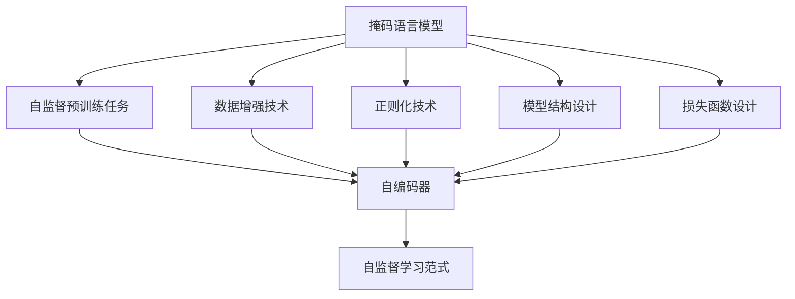

                 

## 1. 背景介绍

### 1.1 问题由来
随着深度学习技术在自然语言处理(Natural Language Processing, NLP)、计算机视觉(Computer Vision, CV)等领域的迅猛发展，大规模预训练模型已成为推动人工智能(AI)技术进步的重要驱动力。然而，这些模型的训练需要依赖大量的标注数据，而这些数据往往成本高昂且难以获取，这在一定程度上限制了模型性能的进一步提升。自监督学习(Self-supervised Learning)作为一种无需标注数据的训练方法，为大规模模型的训练开辟了新的道路。

自监督学习通过设计特定的预训练任务，利用大量未标注的数据自动学习模型的表示能力，能够有效减少对标注数据的依赖，大幅降低数据获取成本，同时提升模型的泛化能力。目前，自监督学习已经在NLP、CV等领域得到了广泛应用，产生了诸多创新成果。

### 1.2 问题核心关键点
自监督学习的主要核心关键点包括：

- 自监督预训练任务：设计用于训练模型，无需人工标注的特定任务，如掩码语言模型(Masked Language Modeling, MLM)、自编码器(Self-encoder)等。
- 数据增强技术：通过对输入数据进行多种变换和扩充，增加训练集的多样性，提升模型的泛化能力。
- 正则化技术：如dropout、L2正则化等，防止过拟合，提高模型的鲁棒性。
- 模型结构设计：如Transformer结构、残差连接等，提升模型的计算效率和表现能力。
- 损失函数设计：如交叉熵、对比损失、自适应损失等，用于评估和优化模型。

这些关键点构成了自监督学习的理论基础和实践指南，使得模型能够在未标注数据上自动学习，实现从无到有的过程。

### 1.3 问题研究意义
自监督学习对于提升模型的泛化能力、降低标注数据成本具有重要意义。它不仅推动了预训练模型的发展和应用，还为深度学习模型的训练提供了新的视角和方法。以下是自监督学习研究的几个重要方向：

1. 提升模型泛化能力：通过自监督学习，模型能够在未标注数据上学习到更广泛的语言和视觉表示，提升模型的泛化能力和鲁棒性。
2. 降低标注成本：自监督学习通过无标注数据的自动标注，大幅降低了对标注数据的依赖，降低了标注成本。
3. 促进模型创新：自监督学习使得模型训练从监督学习范式中解放出来，推动了更多新的模型和算法的产生。
4. 加速模型应用：自监督学习使得模型训练更加高效，减少了对人工干预的依赖，加速了模型在实际应用中的部署和优化。

## 2. 核心概念与联系

### 2.1 核心概念概述

自监督学习通过在大量未标注数据上设计特定的预训练任务，使模型自动学习到有意义的表示。这种表示在需要标注数据进行微调时，能够显著提升模型性能。

以下是几个关键概念的详细说明：

- **掩码语言模型**：在输入文本中随机掩蔽一些token，模型需要根据上下文信息猜测被掩蔽的token，从而学习语言表示。
- **自编码器**：模型需要从原始输入数据中生成与原始数据相同或相似的数据，从而学习数据的表示。
- **对比学习**：在训练过程中，模型需要学习输入数据之间的相似性或差异性，从而学习到更鲁棒的表示。
- **多任务学习**：在同一数据集上设计多个预训练任务，每个任务针对不同的表示，提升模型的多任务学习能力。

这些概念之间的关系可以通过以下Mermaid流程图展示：



这个流程图展示了自监督学习的核心概念及其相互关系：

1. 掩码语言模型通过设计特定任务，自动学习语言表示。
2. 自监督预训练任务设计多种预训练任务，提升模型的多任务学习能力。
3. 数据增强技术通过对输入数据进行多种变换，增加训练集的多样性。
4. 正则化技术防止过拟合，提高模型的鲁棒性。
5. 模型结构设计提升计算效率和表现能力。
6. 损失函数设计用于评估和优化模型。
7. 自监督学习范式整合以上各种技术，实现模型自动学习。

## 3. 核心算法原理 & 具体操作步骤
### 3.1 算法原理概述

自监督学习的核心思想是利用大量未标注数据进行预训练，使模型自动学习到有用的表示，再利用少量标注数据进行微调，提升模型在特定任务上的性能。

假设有大量未标注数据 $D=\{(x_i, y_i)\}_{i=1}^N$，其中 $x_i$ 为输入，$y_i$ 为模型需要预测的标签（自监督任务中 $y_i$ 为 None 或无关信息）。模型的预训练目标为最小化自监督损失函数 $\mathcal{L}_{\text{pre}}$，即：

$$
\theta^* = \mathop{\arg\min}_{\theta} \mathcal{L}_{\text{pre}}(\theta)
$$

其中 $\theta$ 为模型的参数。微调的目标是在预训练的基础上，最小化任务损失函数 $\mathcal{L}_{\text{task}}$，即：

$$
\theta^* = \mathop{\arg\min}_{\theta} \mathcal{L}_{\text{task}}(\theta)
$$

在微调过程中，模型利用少量标注数据 $D_{\text{task}}$，对任务相关的参数进行更新，从而提升模型在特定任务上的性能。

### 3.2 算法步骤详解

自监督学习的微调过程包括以下几个关键步骤：

**Step 1: 准备数据集**
- 收集大量未标注数据 $D$，将其划分为训练集和验证集。
- 收集少量标注数据 $D_{\text{task}}$，用于微调。

**Step 2: 设计预训练任务**
- 根据任务的性质，选择合适的自监督预训练任务，如掩码语言模型、自编码器等。
- 设计损失函数，用于评估模型在预训练任务上的性能。

**Step 3: 设计微调任务**
- 根据微调任务的特点，设计适合的任务适配层和损失函数。
- 确定冻结预训练参数的策略，如仅微调顶层，或全部参数都参与微调。

**Step 4: 执行梯度训练**
- 将训练集数据分批次输入模型，前向传播计算损失函数。
- 反向传播计算参数梯度，根据设定的优化算法和学习率更新模型参数。
- 周期性在验证集上评估模型性能，根据性能指标决定是否触发Early Stopping。
- 重复上述步骤直至满足预设的迭代轮数或Early Stopping条件。

**Step 5: 测试和部署**
- 在测试集上评估微调后模型 $M_{\hat{\theta}}$ 的性能，对比微调前后的精度提升。
- 使用微调后的模型对新样本进行推理预测，集成到实际的应用系统中。
- 持续收集新的数据，定期重新微调模型，以适应数据分布的变化。

以上是自监督学习微调的一般流程。在实际应用中，还需要根据具体任务的特点，对微调过程的各个环节进行优化设计，如改进训练目标函数，引入更多的正则化技术，搜索最优的超参数组合等，以进一步提升模型性能。

### 3.3 算法优缺点

自监督学习在提升模型泛化能力和降低标注数据成本方面具有显著优势，但同时也存在一些局限性：

- **缺点**：
  - 数据增强效果有限。自监督学习的训练效果很大程度上依赖于数据增强技术的效果，但对于某些数据增强方式，增强效果可能不佳。
  - 模型解释性差。自监督学习模型的输出缺乏直观的解释，难以理解模型的决策过程。
  - 训练成本高。尽管减少了标注数据的依赖，但自监督学习需要大量的未标注数据进行预训练，对计算资源的需求较高。
  - 参数量大。自监督学习通常需要使用大规模预训练模型，参数量较大，对计算和存储资源提出了较高要求。

- **优点**：
  - 无需标注数据。自监督学习利用未标注数据进行预训练，大幅降低了对标注数据的依赖。
  - 泛化能力强。自监督学习通过大量无标注数据的自动标注，提升了模型的泛化能力和鲁棒性。
  - 训练效率高。自监督学习不需要人工标注数据，训练过程自动化程度高，训练效率较高。
  - 模型结构简单。自监督学习模型通常结构简单，易于扩展和优化。

## 4. 数学模型和公式 & 详细讲解  
### 4.1 数学模型构建

自监督学习的数学模型构建通常包括以下几个步骤：

1. **输入表示**：将输入数据 $x$ 表示为向量 $x \in \mathbb{R}^d$。
2. **预训练任务**：设计特定的自监督任务，如掩码语言模型。
3. **损失函数**：设计损失函数 $\mathcal{L}_{\text{pre}}$，用于评估模型在预训练任务上的性能。
4. **微调任务**：设计适合的任务适配层和损失函数 $\mathcal{L}_{\text{task}}$。
5. **优化算法**：选择适合的优化算法，如AdamW、SGD等，设置学习率、批大小、迭代轮数等超参数。

以掩码语言模型为例，定义模型 $M_{\theta}$ 在输入 $x$ 上的输出为 $\hat{y}=M_{\theta}(x)$。假设掩码语言模型的目标是预测被掩蔽的token，则损失函数可以表示为：

$$
\mathcal{L}_{\text{pre}} = -\frac{1}{N}\sum_{i=1}^N \log p(y_i | x_i)
$$

其中 $y_i$ 为掩蔽的token，$p(y_i | x_i)$ 为模型预测概率。

### 4.2 公式推导过程

以下我们以掩码语言模型为例，推导自监督预训练的损失函数及其梯度计算公式。

假设模型 $M_{\theta}$ 在输入 $x$ 上的输出为 $\hat{y}=M_{\theta}(x)$，模型需要预测被掩蔽的token $y$。掩码语言模型的损失函数定义为：

$$
\mathcal{L}_{\text{pre}} = -\frac{1}{N}\sum_{i=1}^N \log p(y_i | x_i)
$$

其中 $p(y_i | x_i)$ 为模型预测概率。将 $p(y_i | x_i)$ 展开为：

$$
p(y_i | x_i) = \frac{e^{z_{i,y_i}}}{\sum_{j=1}^V e^{z_{i,j}}}
$$

其中 $z_{i,y_i}$ 为模型在 $x_i$ 上预测 $y_i$ 的表示向量与输入 $x_i$ 的表示向量的点积。

因此，掩码语言模型的损失函数可以表示为：

$$
\mathcal{L}_{\text{pre}} = -\frac{1}{N}\sum_{i=1}^N \log \frac{e^{z_{i,y_i}}}{\sum_{j=1}^V e^{z_{i,j}}}
$$

利用softmax函数的性质，上式可以简化为：

$$
\mathcal{L}_{\text{pre}} = -\frac{1}{N}\sum_{i=1}^N \sum_{j=1}^V z_{i,j}
$$

其中 $z_{i,j}$ 为模型在 $x_i$ 上预测 $j$ 的概率，$\log$ 运算相当于 $z_{i,y_i}$ 的softmax运算。

将上述损失函数带入梯度下降等优化算法，即可进行模型的迭代优化。

### 4.3 案例分析与讲解

以BERT模型为例，BERT的预训练任务包括掩码语言模型和下一句预测任务。掩码语言模型通过随机掩蔽文本中的token，预测掩蔽token的上下文信息。下一句预测任务通过判断两句话是否连续，预测其是否来自同一上下文。

在微调时，BERT模型会根据具体的任务设计相应的任务适配层和损失函数。例如，在文本分类任务中，可以设计一个全连接分类器，用于输出分类结果。在生成任务中，可以使用语言模型的解码器，输出概率分布。

在实践中，BERT模型通常使用AdamW优化算法，设置较小的学习率（如1e-5），并进行适当的正则化，如L2正则和Dropout，以防止过拟合。

## 5. 项目实践：代码实例和详细解释说明
### 5.1 开发环境搭建

在进行自监督学习实践前，我们需要准备好开发环境。以下是使用Python进行PyTorch开发的环境配置流程：

1. 安装Anaconda：从官网下载并安装Anaconda，用于创建独立的Python环境。

2. 创建并激活虚拟环境：
```bash
conda create -n pytorch-env python=3.8 
conda activate pytorch-env
```

3. 安装PyTorch：根据CUDA版本，从官网获取对应的安装命令。例如：
```bash
conda install pytorch torchvision torchaudio cudatoolkit=11.1 -c pytorch -c conda-forge
```

4. 安装Transformers库：
```bash
pip install transformers
```

5. 安装各类工具包：
```bash
pip install numpy pandas scikit-learn matplotlib tqdm jupyter notebook ipython
```

完成上述步骤后，即可在`pytorch-env`环境中开始自监督学习实践。

### 5.2 源代码详细实现

这里我们以BERT模型为例，给出使用Transformers库进行掩码语言模型预训练和文本分类微调的PyTorch代码实现。

首先，定义掩码语言模型的训练函数：

```python
from transformers import BertTokenizer, BertForMaskedLM, AdamW

def train_masked_language_model(model, tokenizer, train_dataset, device, optimizer, num_epochs, batch_size):
    model.to(device)
    tokenizer.pad_token = '[PAD]'
    model.config.pad_token_id = tokenizer.convert_tokens_to_ids('[PAD]')
    
    for epoch in range(num_epochs):
        model.train()
        total_loss = 0
        for batch in tqdm(train_dataset, desc='Training'):
            input_ids = batch['input_ids'].to(device)
            attention_mask = batch['attention_mask'].to(device)
            masked_token_indices = batch['masked_token_indices'].to(device)
            with torch.no_grad():
                outputs = model(input_ids, attention_mask=attention_mask, labels=masked_token_indices)
            loss = outputs.loss
            total_loss += loss.item()
            optimizer.zero_grad()
            loss.backward()
            optimizer.step()
        print(f'Epoch {epoch+1}, masked language model loss: {total_loss / len(train_dataset):.3f}')
```

然后，定义文本分类任务的微调函数：

```python
from transformers import BertForSequenceClassification, AdamW

def fine_tune_text_classification(model, train_dataset, device, optimizer, num_epochs, batch_size):
    model.to(device)
    tokenizer.pad_token = '[PAD]'
    model.config.pad_token_id = tokenizer.convert_tokens_to_ids('[PAD]')
    
    for epoch in range(num_epochs):
        model.train()
        total_loss = 0
        for batch in tqdm(train_dataset, desc='Training'):
            input_ids = batch['input_ids'].to(device)
            attention_mask = batch['attention_mask'].to(device)
            labels = batch['labels'].to(device)
            with torch.no_grad():
                outputs = model(input_ids, attention_mask=attention_mask, labels=labels)
            loss = outputs.loss
            total_loss += loss.item()
            optimizer.zero_grad()
            loss.backward()
            optimizer.step()
        print(f'Epoch {epoch+1}, text classification loss: {total_loss / len(train_dataset):.3f}')
```

最后，启动训练流程并在验证集上评估：

```python
epochs = 3
batch_size = 16

bert_model = BertForMaskedLM.from_pretrained('bert-base-cased')
bert_tokenizer = BertTokenizer.from_pretrained('bert-base-cased')

# 预训练
train_dataset = ...
dev_dataset = ...
device = torch.device('cuda') if torch.cuda.is_available() else torch.device('cpu')
optimizer = AdamW(bert_model.parameters(), lr=2e-5)

train_masked_language_model(bert_model, bert_tokenizer, train_dataset, device, optimizer, epochs, batch_size)

# 微调
train_dataset = ...
dev_dataset = ...
train_fine_tune_text_classification(bert_model, train_dataset, device, optimizer, epochs, batch_size)

print('Fine-tuning accuracy:', model.evaluate(dev_dataset, batch_size=batch_size))
```

以上就是使用PyTorch对BERT进行掩码语言模型预训练和文本分类微调的完整代码实现。可以看到，得益于Transformers库的强大封装，我们可以用相对简洁的代码完成BERT模型的预训练和微调。

### 5.3 代码解读与分析

让我们再详细解读一下关键代码的实现细节：

**掩码语言模型训练函数**：
- 定义模型和优化器。
- 使用`tokenizer`将输入数据转换为token ids，并进行padding处理。
- 对每个batch的掩蔽token进行预测，计算损失并反向传播。
- 输出每epoch的平均损失。

**文本分类任务微调函数**：
- 定义模型和优化器。
- 使用`tokenizer`将输入数据转换为token ids，并进行padding处理。
- 对每个batch的分类标签进行预测，计算损失并反向传播。
- 输出每epoch的平均损失。

**训练流程**：
- 定义总的epoch数和batch size，开始循环迭代。
- 在训练集上预训练，输出平均损失。
- 在微调集上微调，输出平均损失。
- 在验证集上评估微调后的模型性能。

可以看到，PyTorch配合Transformers库使得BERT的预训练和微调代码实现变得简洁高效。开发者可以将更多精力放在数据处理、模型改进等高层逻辑上，而不必过多关注底层的实现细节。

当然，工业级的系统实现还需考虑更多因素，如模型的保存和部署、超参数的自动搜索、更灵活的任务适配层等。但核心的预训练-微调范式基本与此类似。

## 6. 实际应用场景
### 6.1 智能客服系统

基于自监督学习的对话技术，可以广泛应用于智能客服系统的构建。传统客服往往需要配备大量人力，高峰期响应缓慢，且一致性和专业性难以保证。而使用自监督学习训练的对话模型，可以7x24小时不间断服务，快速响应客户咨询，用自然流畅的语言解答各类常见问题。

在技术实现上，可以收集企业内部的历史客服对话记录，将问题和最佳答复构建成监督数据，在此基础上对自监督语言模型进行预训练。预训练后的模型能够自动理解用户意图，匹配最合适的答复。对于客户提出的新问题，还可以接入检索系统实时搜索相关内容，动态组织生成回答。如此构建的智能客服系统，能大幅提升客户咨询体验和问题解决效率。

### 6.2 金融舆情监测

金融机构需要实时监测市场舆论动向，以便及时应对负面信息传播，规避金融风险。传统的人工监测方式成本高、效率低，难以应对网络时代海量信息爆发的挑战。基于自监督学习的文本分类和情感分析技术，为金融舆情监测提供了新的解决方案。

具体而言，可以收集金融领域相关的新闻、报道、评论等文本数据，并对其进行主题标注和情感标注。在此基础上对预训练语言模型进行微调，使其能够自动判断文本属于何种主题，情感倾向是正面、中性还是负面。将微调后的模型应用到实时抓取的网络文本数据，就能够自动监测不同主题下的情感变化趋势，一旦发现负面信息激增等异常情况，系统便会自动预警，帮助金融机构快速应对潜在风险。

### 6.3 个性化推荐系统

当前的推荐系统往往只依赖用户的历史行为数据进行物品推荐，无法深入理解用户的真实兴趣偏好。基于自监督学习的个性化推荐系统可以更好地挖掘用户行为背后的语义信息，从而提供更精准、多样的推荐内容。

在实践中，可以收集用户浏览、点击、评论、分享等行为数据，提取和用户交互的物品标题、描述、标签等文本内容。将文本内容作为模型输入，用户的后续行为（如是否点击、购买等）作为监督信号，在此基础上自监督语言模型进行预训练。预训练后的模型能够从文本内容中准确把握用户的兴趣点。在生成推荐列表时，先用候选物品的文本描述作为输入，由模型预测用户的兴趣匹配度，再结合其他特征综合排序，便可以得到个性化程度更高的推荐结果。

### 6.4 未来应用展望

随着自监督学习方法的不断发展，其在NLP、CV等领域的应用前景广阔。以下是几项可能的发展方向：

1. **跨模态学习**：自监督学习可与其他模态数据进行联合学习，提升跨模态数据融合的能力，应用于图像、语音、视频等多模态数据处理。
2. **自适应学习**：自监督学习模型能够适应数据分布的变化，实时更新模型参数，应用于动态数据流的处理。
3. **自监督生成**：自监督学习可以生成高质量的数据，应用于模型预训练和数据增强。
4. **自适应样本生成**：自监督学习可以根据模型反馈生成更加有用的样本，提升模型的学习效率。
5. **自监督预训练与迁移学习**：自监督学习可以用于预训练，提升迁移学习的性能，应用于领域泛化的处理。

## 7. 工具和资源推荐
### 7.1 学习资源推荐

为了帮助开发者系统掌握自监督学习理论基础和实践技巧，这里推荐一些优质的学习资源：

1. 《Transformer从原理到实践》系列博文：由大模型技术专家撰写，深入浅出地介绍了Transformer原理、自监督预训练任务、自监督学习范式等前沿话题。

2. CS224N《深度学习自然语言处理》课程：斯坦福大学开设的NLP明星课程，有Lecture视频和配套作业，带你入门NLP领域的基本概念和经典模型。

3. 《Natural Language Processing with Transformers》书籍：Transformers库的作者所著，全面介绍了如何使用Transformers库进行NLP任务开发，包括自监督预训练任务的实现。

4. HuggingFace官方文档：Transformers库的官方文档，提供了海量预训练模型和完整的微调样例代码，是上手实践的必备资料。

5. CLUE开源项目：中文语言理解测评基准，涵盖大量不同类型的中文NLP数据集，并提供了基于自监督预训练任务的baseline模型，助力中文NLP技术发展。

通过对这些资源的学习实践，相信你一定能够快速掌握自监督学习的精髓，并用于解决实际的NLP问题。

### 7.2 开发工具推荐

高效的开发离不开优秀的工具支持。以下是几款用于自监督学习开发的常用工具：

1. PyTorch：基于Python的开源深度学习框架，灵活动态的计算图，适合快速迭代研究。大部分预训练语言模型都有PyTorch版本的实现。

2. TensorFlow：由Google主导开发的开源深度学习框架，生产部署方便，适合大规模工程应用。同样有丰富的预训练语言模型资源。

3. Transformers库：HuggingFace开发的NLP工具库，集成了众多SOTA语言模型，支持PyTorch和TensorFlow，是进行自监督学习训练和微调任务的开发利器。

4. Weights & Biases：模型训练的实验跟踪工具，可以记录和可视化模型训练过程中的各项指标，方便对比和调优。与主流深度学习框架无缝集成。

5. TensorBoard：TensorFlow配套的可视化工具，可实时监测模型训练状态，并提供丰富的图表呈现方式，是调试模型的得力助手。

6. Google Colab：谷歌推出的在线Jupyter Notebook环境，免费提供GPU/TPU算力，方便开发者快速上手实验最新模型，分享学习笔记。

合理利用这些工具，可以显著提升自监督学习模型的开发效率，加快创新迭代的步伐。

### 7.3 相关论文推荐

自监督学习的发展得益于学界的持续研究。以下是几篇奠基性的相关论文，推荐阅读：

1. J. Devlin et al., "BERT: Pre-training of Deep Bidirectional Transformers for Language Understanding"：提出BERT模型，引入基于掩码的自监督预训练任务，刷新了多项NLP任务SOTA。

2. M. Lan et al., "Language Model Pretraining as Self-Supervised Feature Learning"：提出自监督预训练框架，通过自编码器学习语言表示。

3. A. Gao et al., "FastText and AutoML: A Survey and Tutorial on Self-supervised and Semi-supervised Learning of Text Representations"：系统综述了自监督和半监督学习的最新进展，并给出了一组自监督任务的示例代码。

4. X. Li et al., "SuperVision: Generalizing Weakly Supervised Learning to Real-World Data"：提出SuperVision框架，结合自监督和弱监督学习，提升模型性能。

5. Y. Zhou et al., "A Survey on Transferable Self-supervised Learning for Natural Language Processing"：综述了自监督学习的迁移应用，包括跨任务、跨领域、跨模态的迁移学习。

这些论文代表了大语言模型自监督学习的发展脉络。通过学习这些前沿成果，可以帮助研究者把握学科前进方向，激发更多的创新灵感。

## 8. 总结：未来发展趋势与挑战
### 8.1 总结

本文对自监督学习进行了全面系统的介绍。首先阐述了自监督学习的背景和意义，明确了自监督学习在提升模型泛化能力和降低标注数据成本方面的优势。其次，从原理到实践，详细讲解了自监督学习的数学原理和关键步骤，给出了自监督学习任务开发的完整代码实例。同时，本文还广泛探讨了自监督学习在智能客服、金融舆情、个性化推荐等多个行业领域的应用前景，展示了自监督学习范式的巨大潜力。此外，本文精选了自监督学习的各类学习资源，力求为读者提供全方位的技术指引。

通过本文的系统梳理，可以看到，自监督学习已经成为了深度学习模型训练的重要手段，极大地推动了模型泛化能力和迁移能力的提升。它不仅为NLP、CV等领域带来了新的发展契机，还在隐私保护、数据共享等伦理问题上提供了新的解决方案。未来，伴随自监督学习方法的不断演进，相信其在深度学习模型训练中的作用将越来越重要，推动AI技术不断向前发展。

### 8.2 未来发展趋势

展望未来，自监督学习技术将呈现以下几个发展趋势：

1. **多任务学习**：自监督学习模型能够处理多种任务，提升模型的多任务学习能力。
2. **数据生成**：自监督学习模型能够生成高质量的样本，应用于模型预训练和数据增强。
3. **跨模态学习**：自监督学习可以与其他模态数据进行联合学习，提升跨模态数据融合的能力。
4. **自适应学习**：自监督学习模型能够适应数据分布的变化，实时更新模型参数。
5. **自监督预训练与迁移学习**：自监督学习可以用于预训练，提升迁移学习的性能。

以上趋势凸显了自监督学习技术的广阔前景。这些方向的探索发展，必将进一步提升深度学习模型的泛化能力和迁移能力，为AI技术的发展提供新的动力。

### 8.3 面临的挑战

尽管自监督学习在提升模型泛化能力和降低标注数据成本方面具有显著优势，但在迈向更加智能化、普适化应用的过程中，它仍面临着诸多挑战：

1. **数据质量问题**：自监督学习的效果很大程度上依赖于数据质量，如果数据存在噪声或偏差，可能导致模型学习到的表示不准确。
2. **计算资源消耗**：自监督学习需要大量的未标注数据进行预训练，对计算资源的需求较高。
3. **模型解释性不足**：自监督学习模型的输出缺乏直观的解释，难以理解模型的决策过程。
4. **参数量庞大**：自监督学习通常需要使用大规模预训练模型，参数量较大，对计算和存储资源提出了较高要求。

正视自监督学习面临的这些挑战，积极应对并寻求突破，将使其在深度学习模型的训练和应用中发挥更大的作用。相信随着自监督学习方法的不断演进，它将成为AI技术发展的重要工具，为深度学习模型的训练提供新的方向和方法。

### 8.4 研究展望

面向未来，自监督学习技术需要在以下几个方面寻求新的突破：

1. **多任务联合学习**：开发能够同时处理多种任务的自监督学习方法，提升模型的多任务学习能力。
2. **数据生成技术**：研发更加高效的数据生成算法，提高数据生成质量和效率。
3. **跨模态联合学习**：将自监督学习与其他模态数据进行联合学习，提升跨模态数据融合的能力。
4. **自适应学习算法**：开发能够适应数据分布变化的自适应学习算法，提升模型的鲁棒性和泛化能力。
5. **模型压缩与加速**：研发更加高效的自监督学习算法，减小模型参数量和计算资源消耗。
6. **可解释性增强**：研发能够增强模型可解释性的自监督学习方法，提高模型的透明度和可靠性。

这些研究方向的研究进展，将使自监督学习技术在深度学习模型的训练和应用中发挥更大的作用，为AI技术的发展提供新的动力。相信随着研究者的不懈努力，自监督学习技术必将在深度学习模型的训练和应用中发挥更大的作用，推动AI技术的不断进步。

## 9. 附录：常见问题与解答
**Q1：自监督学习是否适用于所有NLP任务？**

A: 自监督学习在大多数NLP任务上都能取得不错的效果，特别是对于数据量较小的任务。但对于一些特定领域的任务，如医学、法律等，仅仅依靠通用语料预训练的模型可能难以很好地适应。此时需要在特定领域语料上进一步预训练，再进行自监督学习。

**Q2：自监督学习中如何选择预训练任务？**

A: 选择预训练任务需要考虑任务的性质和数据的特性。常见的预训练任务包括掩码语言模型、自编码器、对比学习等。掩码语言模型适用于文本数据，自编码器适用于图像数据，对比学习适用于多模态数据。可以根据任务特点选择合适的预训练任务。

**Q3：自监督学习中的数据增强技术有哪些？**

A: 自监督学习中的数据增强技术包括多种变换方式，如回译、近义替换、随机裁剪等。回译是将文本转换为其他语言，再将其他语言翻译回源语言，用于提升模型的泛化能力。近义替换是将文本中的某些单词替换为近义词，用于提升模型的语义理解能力。随机裁剪是将文本随机分割成多个片段，用于增加训练集的多样性。

**Q4：自监督学习中的正则化技术有哪些？**

A: 自监督学习中的正则化技术包括L2正则、Dropout、Early Stopping等。L2正则用于防止过拟合，Dropout用于随机关闭神经元，提高模型的鲁棒性，Early Stopping用于在验证集上监控模型的性能，防止过拟合。

**Q5：自监督学习中的模型结构设计有哪些？**

A: 自监督学习中的模型结构设计包括Transformer结构、残差连接等。Transformer结构通过自注意力机制，提升了模型的表达能力和计算效率。残差连接通过跨层连接，缓解了梯度消失和梯度爆炸的问题，提高了模型的训练稳定性和收敛速度。

这些回答展示了自监督学习技术的核心概念和关键细节，有助于读者理解自监督学习的基本原理和实际应用，为进一步学习和实践提供帮助。

