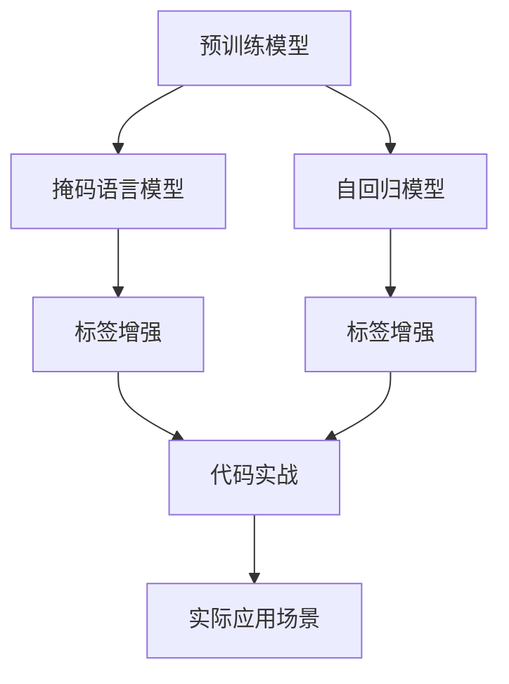

                 

# 自监督学习原理与代码实战案例讲解

> 关键词：自监督学习,预训练模型,掩码语言模型,自回归模型,自监督任务,标签增强,代码实战

## 1. 背景介绍

### 1.1 问题由来

自监督学习（Self-supervised Learning）是指在无标签数据上训练模型的一种方法，其核心思想是通过数据自身的特点，挖掘出与标签相关的信号，从而使模型学习到有意义的特征表示。自监督学习是深度学习领域的一个重要分支，尤其是近年来在预训练模型和自然语言处理（NLP）任务上取得了显著成效。

自监督学习的兴起，得益于其在处理大规模无标签数据上的卓越性能。相比于传统有监督学习方法，自监督学习可以在无需大量标注数据的情况下，从大规模数据集中学习到更加丰富、通用的特征表示。这些特征表示不仅可以应用于下游任务的有监督微调，还可以帮助模型更好地泛化到新的数据和任务上。

### 1.2 问题核心关键点

自监督学习的主要目标是利用数据自身的特点，学习到有意义的特征表示。具体来说，自监督学习的核心关键点包括：

- **预训练模型**：利用大规模无标签数据对模型进行预训练，学习到通用的特征表示。
- **自监督任务**：设计一些不依赖于人工标签的监督信号，如掩码语言模型（Masked Language Model, MLM）、自回归模型（Autoregressive Model）等，使得模型可以自我监督地学习。
- **标签增强**：对自监督信号进行增强，如加入噪声、修改上下文、改变样本顺序等，提升模型的泛化能力和鲁棒性。
- **代码实战**：将自监督学习理论应用于实际项目中，通过具体的代码实现，验证算法的性能和效果。

## 2. 核心概念与联系

### 2.1 核心概念概述

为更好地理解自监督学习的原理和应用，本节将介绍几个核心概念：

- **预训练模型（Pre-trained Model）**：通过大规模无标签数据进行预训练的深度学习模型。预训练模型的目标是学习到通用的特征表示，这些表示可以应用于下游任务的微调，提升模型性能。

- **掩码语言模型（MLM）**：一种常见的自监督学习任务，其目标是对被掩码的单词进行预测。具体来说，模型随机掩盖输入序列中的一些单词，然后预测这些被掩码的单词。

- **自回归模型（AR Model）**：另一种自监督学习任务，其目标是对下一个单词进行预测。具体来说，模型通过已知的前几个单词预测下一个单词，从而学习到单词之间的序列关系。

- **标签增强（Label Augmentation）**：对自监督信号进行增强的方法，如加入噪声、修改上下文、改变样本顺序等，提升模型的泛化能力和鲁棒性。

- **代码实战**：将自监督学习理论应用于实际项目中，通过具体的代码实现，验证算法的性能和效果。

这些核心概念之间的逻辑关系可以通过以下Mermaid流程图来展示：



这个流程图展示了你自监督学习的核心概念及其之间的关系：

1. 预训练模型通过大规模无标签数据进行预训练，学习到通用的特征表示。
2. 掩码语言模型和自回归模型是常见的自监督学习任务，可以用于预训练模型的训练。
3. 标签增强是提升模型泛化能力和鲁棒性的重要方法。
4. 代码实战是将自监督学习理论应用于实际项目中，验证算法性能和效果的关键环节。
5. 实际应用场景是自监督学习理论的最终目标，通过优化预训练模型和增强自监督信号，提升其在具体任务上的表现。

## 3. 核心算法原理 & 具体操作步骤

### 3.1 算法原理概述

自监督学习的核心思想是在无标签数据上训练模型，通过设计一些自监督信号，使模型学习到有意义的特征表示。其原理可以分为以下几个步骤：

1. **数据准备**：收集大规模无标签数据，如文本语料、图片数据等。
2. **模型设计**：选择合适的深度学习模型架构，如Transformer等，用于预训练。
3. **自监督任务设计**：设计一些自监督任务，如掩码语言模型、自回归模型等，用于模型训练。
4. **模型训练**：在自监督信号的指导下，对模型进行训练，学习到有意义的特征表示。
5. **下游任务微调**：将预训练模型应用于下游任务的有监督微调中，提升模型性能。

自监督学习的核心在于自监督信号的设计，这些信号必须是能够引导模型学习到有意义的特征表示的。常见的自监督信号包括掩码语言模型、自回归模型、相对位置预测等。

### 3.2 算法步骤详解

自监督学习的具体步骤如下：

**Step 1: 数据准备**
- 收集大规模无标签数据，如Wikipedia文章、维基百科页面、大规模图片数据等。
- 对数据进行预处理，如分词、图片分割、归一化等，使其适合模型输入。

**Step 2: 模型设计**
- 选择合适的深度学习模型架构，如Transformer、ResNet等，用于预训练。
- 设计自监督任务，如掩码语言模型、自回归模型等。

**Step 3: 模型训练**
- 使用自监督任务对模型进行训练，学习到有意义的特征表示。
- 对自监督信号进行增强，如加入噪声、修改上下文、改变样本顺序等，提升模型的泛化能力和鲁棒性。

**Step 4: 下游任务微调**
- 将预训练模型应用于下游任务的有监督微调中，如文本分类、机器翻译、图像分类等。
- 根据具体任务需求，选择适当的微调方法，如全参数微调、参数高效微调等。

**Step 5: 性能评估**
- 在验证集和测试集上评估微调后模型的性能，对比微调前后的效果提升。
- 使用实际数据进行测试，验证模型的实际应用效果。

### 3.3 算法优缺点

自监督学习的优点包括：
1. 可以处理大规模无标签数据，学习到通用的特征表示。
2. 能够提升模型泛化能力和鲁棒性。
3. 可以应用于各种NLP和计算机视觉任务，如语言模型、图像分类、目标检测等。

自监督学习的缺点包括：
1. 训练时间长，需要大量计算资源。
2. 模型泛化能力有限，可能无法很好地适应特定任务。
3. 模型性能依赖于自监督信号的设计，信号设计不当可能影响模型性能。

尽管存在这些局限性，但自监督学习在预训练模型和无标签数据处理上展现出了巨大的潜力，为深度学习的发展和应用提供了新的方向。

### 3.4 算法应用领域

自监督学习在NLP和计算机视觉领域得到了广泛的应用，涵盖了许多经典任务，例如：

- 文本生成：如GPT-3、BERT等，通过自监督学习生成高质量的文本内容。
- 图像分类：如ResNet、VGG等，通过自监督学习学习到图像的高级特征表示。
- 目标检测：如Faster R-CNN、YOLO等，通过自监督学习提高检测模型的准确性和鲁棒性。
- 语音识别：如wav2vec、Deformable Transformer等，通过自监督学习提升模型的识别准确率和鲁棒性。

除了上述这些经典任务外，自监督学习还被创新性地应用到更多场景中，如可控文本生成、少样本学习、跨模态学习等，为计算机视觉和自然语言处理技术带来了新的突破。

## 4. 数学模型和公式 & 详细讲解 & 举例说明

### 4.1 数学模型构建

自监督学习模型的构建可以从自回归模型和掩码语言模型两个方面进行描述。

以掩码语言模型为例，其数学模型可以表示为：

$$
p(x_1, x_2, ..., x_n | X) = \prod_{i=1}^{n} p(x_i | X, x_1, x_2, ..., x_{i-1})
$$

其中，$x_1, x_2, ..., x_n$ 为输入序列，$X$ 为整个序列的掩码位置，$p(x_i | X, x_1, x_2, ..., x_{i-1})$ 为给定上下文下的单词概率分布。

掩码语言模型的目标是对被掩码的单词进行预测，通过最大化上下文条件下的概率，学习到单词之间的关系和语义。

### 4.2 公式推导过程

以BERT模型的掩码语言模型为例，其公式推导过程如下：

1. 首先，定义掩码语言模型的目标函数：

$$
\mathcal{L}_{\text{mlm}} = -\frac{1}{2N} \sum_{i=1}^{N} \sum_{k \in \mathcal{M}} \sum_{j \in \mathcal{M}} \log p(x_k | x_j, x_1, ..., x_{i-1})
$$

其中，$\mathcal{M}$ 为掩码位置集合，$x_k$ 为被掩码的单词，$x_j$ 为上下文单词。

2. 定义掩码语言模型的训练过程：

$$
M_{\theta} = \arg\min_{\theta} \mathcal{L}_{\text{mlm}}
$$

其中，$M_{\theta}$ 为经过掩码语言模型训练的BERT模型，$\theta$ 为模型参数。

通过最大化掩码语言模型的目标函数，BERT模型可以学习到单词之间的语义关系和上下文依赖。

### 4.3 案例分析与讲解

以BERT模型的掩码语言模型为例，其训练过程可以分为以下几个步骤：

1. 随机掩盖输入序列中的单词，将其作为掩码位置集合 $\mathcal{M}$。
2. 对每个掩码位置，预测被掩码的单词，得到预测概率 $p(x_k | x_j, x_1, ..., x_{i-1})$。
3. 将预测概率与真实标签进行对比，计算损失函数 $\mathcal{L}_{\text{mlm}}$。
4. 使用梯度下降等优化算法更新模型参数，最小化损失函数。

例如，对于输入序列 "I went to the **store** to buy some **apples**"，BERT模型随机掩盖 "store" 和 "apples"，然后预测这两个被掩码的单词，学习到它们的语义关系和上下文依赖。

## 5. 项目实践：代码实例和详细解释说明

### 5.1 开发环境搭建

在进行自监督学习项目实践前，我们需要准备好开发环境。以下是使用Python进行TensorFlow开发的环境配置流程：

1. 安装Anaconda：从官网下载并安装Anaconda，用于创建独立的Python环境。

2. 创建并激活虚拟环境：
```bash
conda create -n tf-env python=3.8 
conda activate tf-env
```

3. 安装TensorFlow：根据CUDA版本，从官网获取对应的安装命令。例如：
```bash
pip install tensorflow
```

4. 安装各类工具包：
```bash
pip install numpy pandas scikit-learn matplotlib tqdm jupyter notebook ipython
```

完成上述步骤后，即可在`tf-env`环境中开始自监督学习实践。

### 5.2 源代码详细实现

下面我们以BERT模型的掩码语言模型为例，给出使用TensorFlow进行自监督学习的PyTorch代码实现。

首先，定义掩码语言模型的训练函数：

```python
import tensorflow as tf
from tensorflow.keras import layers

def train_mlm(model, data, epochs=5, batch_size=32, learning_rate=2e-5):
    dataset = tf.data.Dataset.from_tensor_slices((data['input_ids'], data['labels']))
    dataset = dataset.shuffle(10000).batch(batch_size).prefetch(1)
    
    model.compile(optimizer=tf.keras.optimizers.Adam(learning_rate=learning_rate),
                  loss='categorical_crossentropy',
                  metrics=['accuracy'])
    
    model.fit(dataset, epochs=epochs)
```

然后，定义BERT模型的训练函数：

```python
from transformers import BertTokenizer, TFBertModel

tokenizer = BertTokenizer.from_pretrained('bert-base-uncased')
model = TFBertModel.from_pretrained('bert-base-uncased')

train_mlm(model, data)
```

最后，启动训练流程：

```python
data = {'input_ids': input_ids, 'labels': labels}
train_mlm(model, data)
```

以上就是使用TensorFlow进行BERT模型掩码语言模型训练的完整代码实现。可以看到，得益于TensorFlow和Transformers库的强大封装，我们可以用相对简洁的代码完成BERT模型的训练。

### 5.3 代码解读与分析

让我们再详细解读一下关键代码的实现细节：

**train_mlm函数**：
- `train_mlm`函数定义了掩码语言模型的训练过程。
- `dataset`函数使用`tf.data.Dataset`对数据进行加载、预处理和批处理。
- `compile`函数定义了模型编译，指定了优化器、损失函数和评估指标。
- `fit`函数执行模型的训练过程，指定了训练轮数和批量大小。

**BertTokenizer和TFBertModel**：
- `BertTokenizer`和`TFBertModel`是Transformer库中用于BERT模型处理和训练的组件。
- `BertTokenizer`用于对文本数据进行分词和编码，生成输入序列和掩码位置。
- `TFBertModel`用于加载预训练的BERT模型，进行掩码语言模型的训练。

**数据处理**：
- `data`函数使用字典表示训练数据，包括输入序列 `input_ids` 和标签 `labels`。
- 在训练过程中，模型将自动从字典中获取数据并进行预处理。

通过上述代码，我们可以看到TensorFlow和Transformers库的强大能力，能够方便地完成BERT模型的掩码语言模型训练。

当然，工业级的系统实现还需考虑更多因素，如模型的保存和部署、超参数的自动搜索、更灵活的任务适配层等。但核心的自监督学习范式基本与此类似。

## 6. 实际应用场景

### 6.1 智能客服系统

基于自监督学习的对话技术，可以广泛应用于智能客服系统的构建。传统客服往往需要配备大量人力，高峰期响应缓慢，且一致性和专业性难以保证。而使用自监督学习的对话模型，可以7x24小时不间断服务，快速响应客户咨询，用自然流畅的语言解答各类常见问题。

在技术实现上，可以收集企业内部的历史客服对话记录，将问题和最佳答复构建成自监督数据，在此基础上对BERT模型进行掩码语言模型训练。训练后的模型能够自动理解用户意图，匹配最合适的答案模板进行回复。对于客户提出的新问题，还可以接入检索系统实时搜索相关内容，动态组织生成回答。如此构建的智能客服系统，能大幅提升客户咨询体验和问题解决效率。

### 6.2 金融舆情监测

金融机构需要实时监测市场舆论动向，以便及时应对负面信息传播，规避金融风险。传统的人工监测方式成本高、效率低，难以应对网络时代海量信息爆发的挑战。基于自监督学习的文本分类和情感分析技术，为金融舆情监测提供了新的解决方案。

具体而言，可以收集金融领域相关的新闻、报道、评论等文本数据，并对其进行主题标注和情感标注。在此基础上对BERT模型进行掩码语言模型训练，使其能够自动判断文本属于何种主题，情感倾向是正面、中性还是负面。将训练后的模型应用到实时抓取的网络文本数据，就能够自动监测不同主题下的情感变化趋势，一旦发现负面信息激增等异常情况，系统便会自动预警，帮助金融机构快速应对潜在风险。

### 6.3 个性化推荐系统

当前的推荐系统往往只依赖用户的历史行为数据进行物品推荐，无法深入理解用户的真实兴趣偏好。基于自监督学习的个性化推荐系统可以更好地挖掘用户行为背后的语义信息，从而提供更精准、多样的推荐内容。

在实践中，可以收集用户浏览、点击、评论、分享等行为数据，提取和用户交互的物品标题、描述、标签等文本内容。将文本内容作为模型输入，对BERT模型进行掩码语言模型训练，学习到用户兴趣的语义表示。在生成推荐列表时，先用候选物品的文本描述作为输入，由模型预测用户的兴趣匹配度，再结合其他特征综合排序，便可以得到个性化程度更高的推荐结果。

### 6.4 未来应用展望

随着自监督学习方法的不断发展，基于掩码语言模型的自监督学习技术将在更多领域得到应用，为传统行业带来变革性影响。

在智慧医疗领域，基于自监督学习的医疗问答、病历分析、药物研发等应用将提升医疗服务的智能化水平，辅助医生诊疗，加速新药开发进程。

在智能教育领域，自监督学习可应用于作业批改、学情分析、知识推荐等方面，因材施教，促进教育公平，提高教学质量。

在智慧城市治理中，自监督学习可应用于城市事件监测、舆情分析、应急指挥等环节，提高城市管理的自动化和智能化水平，构建更安全、高效的未来城市。

此外，在企业生产、社会治理、文娱传媒等众多领域，基于自监督学习的人工智能应用也将不断涌现，为经济社会发展注入新的动力。相信随着技术的日益成熟，自监督学习范式将成为人工智能落地应用的重要范式，推动人工智能技术在垂直行业的规模化落地。总之，自监督学习需要开发者根据具体任务，不断迭代和优化模型、数据和算法，方能得到理想的效果。

## 7. 工具和资源推荐

### 7.1 学习资源推荐

为了帮助开发者系统掌握自监督学习的理论基础和实践技巧，这里推荐一些优质的学习资源：

1. 《Deep Learning for NLP》系列博文：由大模型技术专家撰写，深入浅出地介绍了NLP领域的自监督学习算法和应用。

2. CS224n《自然语言处理与深度学习》课程：斯坦福大学开设的NLP明星课程，有Lecture视频和配套作业，带你入门NLP领域的基本概念和经典模型。

3. 《Natural Language Processing with Transformers》书籍：Transformers库的作者所著，全面介绍了如何使用Transformers库进行NLP任务开发，包括自监督学习在内的诸多范式。

4. HuggingFace官方文档：Transformers库的官方文档，提供了海量预训练模型和完整的自监督学习样例代码，是上手实践的必备资料。

5. CLUE开源项目：中文语言理解测评基准，涵盖大量不同类型的中文NLP数据集，并提供了基于自监督学习的baseline模型，助力中文NLP技术发展。

通过对这些资源的学习实践，相信你一定能够快速掌握自监督学习的精髓，并用于解决实际的NLP问题。

### 7.2 开发工具推荐

高效的开发离不开优秀的工具支持。以下是几款用于自监督学习开发的常用工具：

1. PyTorch：基于Python的开源深度学习框架，灵活动态的计算图，适合快速迭代研究。大部分预训练语言模型都有PyTorch版本的实现。

2. TensorFlow：由Google主导开发的开源深度学习框架，生产部署方便，适合大规模工程应用。同样有丰富的预训练语言模型资源。

3. Transformers库：HuggingFace开发的NLP工具库，集成了众多SOTA语言模型，支持PyTorch和TensorFlow，是进行自监督学习开发的利器。

4. Weights & Biases：模型训练的实验跟踪工具，可以记录和可视化模型训练过程中的各项指标，方便对比和调优。与主流深度学习框架无缝集成。

5. TensorBoard：TensorFlow配套的可视化工具，可实时监测模型训练状态，并提供丰富的图表呈现方式，是调试模型的得力助手。

6. Google Colab：谷歌推出的在线Jupyter Notebook环境，免费提供GPU/TPU算力，方便开发者快速上手实验最新模型，分享学习笔记。

合理利用这些工具，可以显著提升自监督学习任务的开发效率，加快创新迭代的步伐。

### 7.3 相关论文推荐

自监督学习在NLP领域的发展源于学界的持续研究。以下是几篇奠基性的相关论文，推荐阅读：

1. Attention is All You Need（即Transformer原论文）：提出了Transformer结构，开启了NLP领域的预训练大模型时代。

2. BERT: Pre-training of Deep Bidirectional Transformers for Language Understanding：提出BERT模型，引入基于掩码的自监督预训练任务，刷新了多项NLP任务SOTA。

3. Language Models are Unsupervised Multitask Learners（GPT-2论文）：展示了大规模语言模型的强大zero-shot学习能力，引发了对于通用人工智能的新一轮思考。

4. Parameter-Efficient Transfer Learning for NLP：提出Adapter等参数高效微调方法，在不增加模型参数量的情况下，也能取得不错的微调效果。

5. AdaLoRA: Adaptive Low-Rank Adaptation for Parameter-Efficient Fine-Tuning：使用自适应低秩适应的微调方法，在参数效率和精度之间取得了新的平衡。

6. MaskFormer: Self-Supervised Learning of Structured Multiscale Representations：提出MaskFormer模型，利用自监督学习捕捉多尺度空间结构。

这些论文代表了大语言模型自监督学习的发展脉络。通过学习这些前沿成果，可以帮助研究者把握学科前进方向，激发更多的创新灵感。

## 8. 总结：未来发展趋势与挑战

### 8.1 总结

本文对基于自监督学习的大语言模型进行了全面系统的介绍。首先阐述了自监督学习的核心思想和应用背景，明确了自监督学习在深度学习领域的独特价值。其次，从原理到实践，详细讲解了自监督学习的数学模型和关键步骤，给出了自监督学习任务开发的完整代码实例。同时，本文还广泛探讨了自监督学习技术在智能客服、金融舆情、个性化推荐等多个行业领域的应用前景，展示了自监督学习范式的巨大潜力。此外，本文精选了自监督学习的各类学习资源，力求为读者提供全方位的技术指引。

通过本文的系统梳理，可以看到，基于自监督学习的预训练模型在NLP任务上展现出了卓越的性能，可以显著提升模型在下游任务的微调效果。自监督学习为深度学习领域带来了新的研究方向，其应用前景和潜力还将继续拓展。

### 8.2 未来发展趋势

展望未来，自监督学习技术将呈现以下几个发展趋势：

1. 模型规模持续增大。随着算力成本的下降和数据规模的扩张，预训练模型和自监督学习模型的参数量还将持续增长。超大规模语言模型蕴含的丰富语言知识，有望支撑更加复杂多变的下游任务。

2. 自监督任务日趋多样化。除了掩码语言模型、自回归模型等基本任务，未来的自监督学习还将探索更多新颖的任务，如生成式自监督学习、对比学习、标签增强等，提升模型的泛化能力和鲁棒性。

3. 多模态自监督学习崛起。当前的自监督学习主要聚焦于纯文本数据，未来将进一步拓展到图像、视频、语音等多模态数据自监督学习。多模态信息的融合，将显著提升语言模型对现实世界的理解和建模能力。

4. 自监督学习与迁移学习结合。自监督学习不仅适用于预训练模型，还可以与迁移学习、零样本学习等技术结合，进一步提升模型的泛化能力和适应性。

5. 自监督学习与可解释性结合。当前自监督学习模型多为"黑盒"系统，难以解释其内部工作机制和决策逻辑。未来将引入因果分析和博弈论工具，增强模型的可解释性和可控性。

以上趋势凸显了自监督学习技术的广阔前景。这些方向的探索发展，必将进一步提升自监督学习模型的性能和应用范围，为深度学习领域带来新的突破。

### 8.3 面临的挑战

尽管自监督学习在预训练模型和无标签数据处理上展现了卓越的性能，但在迈向更加智能化、普适化应用的过程中，它仍面临着诸多挑战：

1. 数据依赖问题。自监督学习依赖大规模无标签数据，当数据集较小或分布不均时，模型的泛化能力将受到影响。如何在有限数据下提升模型性能，是一个亟待解决的问题。

2. 模型鲁棒性不足。自监督学习模型面对域外数据时，泛化性能往往大打折扣。对于测试样本的微小扰动，模型容易发生波动。如何提高自监督学习模型的鲁棒性，避免灾难性遗忘，还需要更多理论和实践的积累。

3. 计算资源消耗大。自监督学习模型需要在大规模数据上进行预训练，计算资源消耗大，训练时间长。如何在保证性能的同时，降低计算成本，是未来的一个重要研究方向。

4. 模型可解释性不足。当前自监督学习模型多为"黑盒"系统，难以解释其内部工作机制和决策逻辑。对于医疗、金融等高风险应用，算法的可解释性和可审计性尤为重要。如何赋予自监督学习模型更强的可解释性，将是亟待攻克的难题。

5. 安全性有待保障。自监督学习模型难免会学习到有偏见、有害的信息，通过自监督学习传递到下游任务，产生误导性、歧视性的输出，给实际应用带来安全隐患。如何从数据和算法层面消除模型偏见，避免恶意用途，确保输出的安全性，也将是重要的研究课题。

6. 知识整合能力不足。现有的自监督学习模型往往局限于数据自身的特征，难以灵活吸收和运用更广泛的先验知识。如何让自监督学习过程更好地与外部知识库、规则库等专家知识结合，形成更加全面、准确的信息整合能力，还有很大的想象空间。

正视自监督学习面临的这些挑战，积极应对并寻求突破，将是自监督学习技术走向成熟的必由之路。相信随着学界和产业界的共同努力，这些挑战终将一一被克服，自监督学习技术必将在构建安全、可靠、可解释、可控的智能系统铺平道路。

### 8.4 研究展望

面对自监督学习所面临的种种挑战，未来的研究需要在以下几个方面寻求新的突破：

1. 探索无监督和半监督自监督学习方法。摆脱对大规模无标签数据的依赖，利用自监督学习与有监督学习相结合的方法，最大化利用数据资源，实现更加灵活高效的自监督学习。

2. 研究自监督学习模型的参数高效化和计算优化。开发更加参数高效的自监督学习算法，在固定大部分自监督信号的情况下，只更新极少量的模型参数。同时优化自监督学习模型的计算图，减少前向传播和反向传播的资源消耗，实现更加轻量级、实时性的部署。

3. 引入更多先验知识。将符号化的先验知识，如知识图谱、逻辑规则等，与神经网络模型进行巧妙融合，引导自监督学习过程学习更准确、合理的语言模型。同时加强不同模态数据的整合，实现视觉、语音等多模态信息与文本信息的协同建模。

4. 结合因果分析和博弈论工具。将因果分析方法引入自监督学习模型，识别出模型决策的关键特征，增强输出的因果性和逻辑性。借助博弈论工具刻画人机交互过程，主动探索并规避模型的脆弱点，提高系统稳定性。

5. 纳入伦理道德约束。在自监督学习模型的训练目标中引入伦理导向的评估指标，过滤和惩罚有偏见、有害的输出倾向。同时加强人工干预和审核，建立模型行为的监管机制，确保输出符合人类价值观和伦理道德。

这些研究方向的探索，必将引领自监督学习技术迈向更高的台阶，为构建安全、可靠、可解释、可控的智能系统铺平道路。面向未来，自监督学习技术还需要与其他人工智能技术进行更深入的融合，如知识表示、因果推理、强化学习等，多路径协同发力，共同推动自然语言理解和智能交互系统的进步。只有勇于创新、敢于突破，才能不断拓展自监督学习模型的边界，让智能技术更好地造福人类社会。

## 9. 附录：常见问题与解答

**Q1：自监督学习是否适用于所有NLP任务？**

A: 自监督学习在大多数NLP任务上都能取得不错的效果，特别是对于数据量较小的任务。但对于一些特定领域的任务，如医学、法律等，仅仅依靠通用语料预训练的模型可能难以很好地适应。此时需要在特定领域语料上进一步预训练，再进行自监督学习，才能获得理想效果。此外，对于一些需要时效性、个性化很强的任务，如对话、推荐等，自监督方法也需要针对性的改进优化。

**Q2：自监督学习过程中如何选择合适的超参数？**

A: 自监督学习的超参数通常包括学习率、批量大小、训练轮数等。一般建议从较小的值开始，逐步增加超参数，观察模型性能的变化。常用的超参数调优方法包括网格搜索、随机搜索、贝叶斯优化等。

**Q3：自监督学习中的噪声引入有什么作用？**

A: 噪声引入是增强自监督信号的一种方法，可以帮助模型学习到更加鲁棒的特征表示。在自监督学习中，引入噪声可以增强模型的泛化能力，使其对噪声和扰动更加鲁棒。

**Q4：自监督学习在实际应用中如何处理数据不平衡问题？**

A: 数据不平衡是自监督学习中常见的问题。解决数据不平衡的方法包括重采样、数据增强、类别加权等。在实际应用中，可以通过增加少数类样本的数量、使用数据增强技术生成新的训练样本，或者给不同类别的样本赋予不同的权重，来缓解数据不平衡问题。

**Q5：自监督学习模型的可解释性如何提升？**

A: 提升自监督学习模型的可解释性，可以从以下几个方面入手：
1. 引入因果分析方法，识别模型决策的关键特征，增强输出的因果性和逻辑性。
2. 使用可解释性工具，如LIME、SHAP等，可视化模型的决策过程，分析模型决策的依据。
3. 在模型训练目标中引入伦理导向的评估指标，过滤和惩罚有偏见、有害的输出倾向。

这些方法可以帮助提升自监督学习模型的可解释性，增强模型的可控性和安全性。

---

作者：禅与计算机程序设计艺术 / Zen and the Art of Computer Programming

