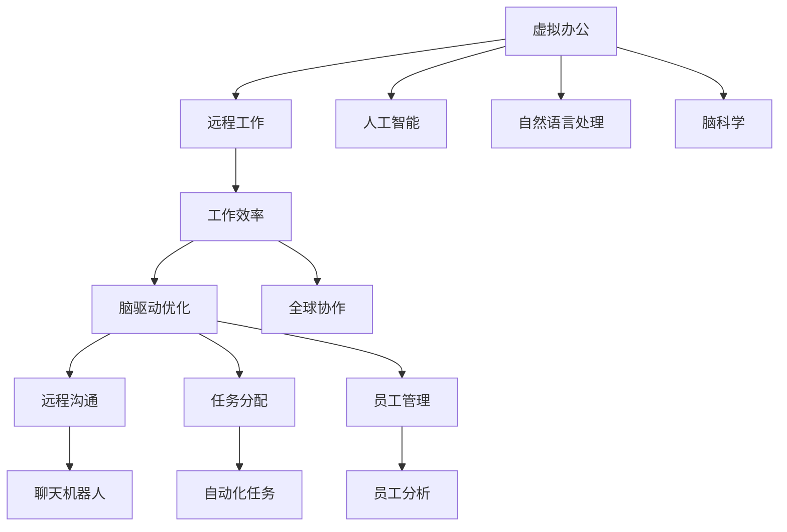

                 

# 虚拟办公效率研究:全球脑驱动的远程工作优化

> 关键词：虚拟办公,远程工作,人工智能,自然语言处理,脑科学,工作效率,脑驱动优化,全球协作

## 1. 背景介绍

随着全球化和技术的发展，远程工作已成为一种普遍的工作方式。疫情期间，许多企业被迫转向虚拟办公，这不仅改变了工作模式，也对员工的生产效率、心理健康和团队协作方式产生了深远影响。在此背景下，如何通过科技手段提升虚拟办公的效率，成为了一个重要的研究课题。

虚拟办公效率的研究不仅关注如何提高个体和团队的工作效率，还包括如何优化远程沟通、协作和管理，以及如何利用人工智能和大数据技术，实现对员工情绪和行为的精准分析与预测。

## 2. 核心概念与联系

### 2.1 核心概念概述

- **虚拟办公**：指通过远程设备、网络通信等方式进行的办公活动。虚拟办公打破了时间和空间的限制，使得员工能够灵活地在家或办公室外进行工作。
- **远程工作**：指员工在家或其他远程地点进行的工作，主要通过电脑、手机、平板电脑等设备进行沟通和协作。
- **人工智能(AI)**：指通过计算机模拟人类智能的机器学习、数据挖掘、自然语言处理等技术。在虚拟办公中，AI可以用于自动化任务、优化沟通、提高决策效率等。
- **自然语言处理(NLP)**：指计算机对人类语言进行理解、处理和生成的技术。NLP技术在虚拟办公中用于聊天机器人、语音识别、情感分析等。
- **脑科学**：研究大脑结构和功能的科学。脑科学的发展揭示了人类认知和行为的机制，为优化远程工作提供了新的视角和方法。
- **工作效率**：指单位时间内完成工作的量，是衡量工作表现的重要指标。
- **脑驱动优化**：指通过分析大脑活动和认知过程，优化远程工作环境、任务分配和员工管理，提高整体工作效率。
- **全球协作**：指跨越国界和时区的团队合作，通过数字化工具实现信息共享、协同工作。

这些核心概念通过虚拟办公这一具体情境相互联系，形成了一个复杂的系统。通过脑科学和人工智能的结合，可以优化虚拟办公的各个环节，提高整体效率和员工满意度。

### 2.2 核心概念原理和架构的 Mermaid 流程图



以上流程图展示了虚拟办公中人工智能、自然语言处理、脑科学、脑驱动优化和全球协作之间的关系。各部分之间相互影响，共同构成了高效的虚拟办公系统。

## 3. 核心算法原理 & 具体操作步骤

### 3.1 算法原理概述

基于脑驱动优化的虚拟办公系统，通过分析员工的大脑活动和认知过程，优化工作流程、任务分配和员工管理，从而提高整体工作效率。其核心算法包括以下几个部分：

- **数据采集**：通过脑电波、心率传感器等设备，实时采集员工的大脑活动数据。
- **数据分析**：使用机器学习和数据挖掘技术，分析员工的大脑活动模式，预测工作状态和情绪。
- **任务分配**：根据员工的大脑活动状态和任务能力，动态调整任务分配，实现最优化。
- **远程沟通**：使用自然语言处理技术，优化远程沟通工具，提高信息传递效率。
- **员工管理**：通过分析员工的大脑活动和行为，进行个性化的员工管理，提升团队协作效果。

### 3.2 算法步骤详解

1. **数据采集**：
   - 使用脑电波传感器采集员工的大脑活动数据。
   - 使用心率传感器和行为追踪器采集员工的生理和行为数据。
   - 将采集到的数据上传至云端，进行实时存储和分析。

2. **数据分析**：
   - 使用机器学习算法，如随机森林、神经网络等，分析员工的大脑活动模式。
   - 使用深度学习模型，如卷积神经网络(CNN)、循环神经网络(RNN)等，预测员工的工作状态和情绪。
   - 将分析结果与自然语言处理技术结合，生成个性化的沟通和任务建议。

3. **任务分配**：
   - 根据员工的大脑活动状态和任务能力，动态调整任务分配。
   - 使用强化学习算法，优化任务分配策略，提高整体工作效率。
   - 实时监控任务进度和完成情况，进行反馈和调整。

4. **远程沟通**：
   - 使用自然语言处理技术，优化聊天机器人和语音识别功能。
   - 使用情感分析技术，判断员工的情绪状态，提供针对性的沟通建议。
   - 使用多轮对话系统，提升远程沟通的流畅性和准确性。

5. **员工管理**：
   - 分析员工的大脑活动和行为，进行个性化的员工管理。
   - 使用情感分析技术，监测员工的情感状态，提供心理支持。
   - 使用行为追踪器，实时监控员工的工作状态和环境，进行健康管理。

### 3.3 算法优缺点

#### 优点：
- 通过实时分析员工的大脑活动，优化任务分配和远程沟通，提高整体工作效率。
- 使用自然语言处理技术，提升远程沟通的准确性和流畅性。
- 通过个性化的员工管理，提升团队协作效果和员工满意度。

#### 缺点：
- 数据采集和分析需要较高的技术门槛和成本。
- 数据隐私和安全问题需要引起重视。
- 脑驱动优化技术目前仍处于初步探索阶段，需要更多研究和实践验证。

### 3.4 算法应用领域

脑驱动优化的虚拟办公技术可以应用于多种行业和领域，例如：

- **企业办公**：优化远程工作流程，提高员工工作效率和满意度。
- **教育培训**：通过脑驱动分析，优化教学内容和学习路径，提升学习效果。
- **医疗健康**：监测患者的大脑活动，优化诊疗方案，提升治疗效果。
- **金融服务**：通过脑驱动分析，优化客户服务流程，提高客户满意度和转化率。
- **制造业**：通过脑驱动分析，优化生产流程和员工管理，提高生产效率和质量。

## 4. 数学模型和公式 & 详细讲解 & 举例说明

### 4.1 数学模型构建

脑驱动优化的虚拟办公系统涉及到多个数学模型，包括脑电波分析、任务分配、情感分析和沟通优化等。以下是其中的几个关键模型：

- **脑电波分析模型**：使用傅里叶变换对脑电波信号进行处理，提取频率特征，表示大脑活动状态。
- **任务分配模型**：使用线性规划和优化算法，根据员工的工作能力和状态，动态调整任务分配。
- **情感分析模型**：使用情感词典和深度学习模型，分析员工的情感状态和情绪变化。
- **沟通优化模型**：使用自然语言处理技术，优化聊天机器人和语音识别功能。

### 4.2 公式推导过程

1. **脑电波分析模型**：

   傅里叶变换公式：
   $$
   X(f) = \mathcal{F}\{x(t)\} = \int_{-\infty}^{\infty} x(t) e^{-i 2\pi ft} dt
   $$

   其中，$X(f)$为频域信号，$x(t)$为时域信号，$f$为频率。

2. **任务分配模型**：

   线性规划公式：
   $$
   \min_{x} c^T x \\
   s.t. \\
   A x \leq b \\
   B x = d \\
   x \geq 0
   $$

   其中，$c$为成本系数，$A$为约束矩阵，$b$为约束向量，$B$为等式约束矩阵，$d$为等式约束向量，$x$为决策变量。

3. **情感分析模型**：

   情感词典公式：
   $$
   E = \{(e_1, s_1), (e_2, s_2), ..., (e_n, s_n)\}
   $$

   其中，$E$为情感词典，$e_i$为情感词汇，$s_i$为情感标签。

4. **沟通优化模型**：

   自然语言处理技术包括语言模型、分词、词性标注等，其公式推导较为复杂，涉及概率模型和深度学习模型，具体公式如下：
   $$
   P(w_i | w_{i-1}, ..., w_1) = \frac{e^{w_i \cdot \theta}}{\sum_{j=1}^V e^{w_j \cdot \theta}}
   $$

   其中，$P(w_i | w_{i-1}, ..., w_1)$为语言模型概率，$w_i$为单词，$\theta$为模型参数。

### 4.3 案例分析与讲解

假设某企业需要对虚拟办公进行优化。通过脑电波分析，发现员工在上午10点到12点期间大脑活动最为活跃，适合处理复杂的任务。根据任务分配模型，将一些高难度任务安排在这个时间段内。同时，使用情感分析模型，发现部分员工在下午2点后情绪波动较大，可能出现工作效率下降的情况。通过及时调整任务和提供心理支持，提高了整体工作效率。此外，使用沟通优化模型，优化了远程沟通工具，减少了信息传递的误解和延迟，提升了团队的协作效率。

## 5. 项目实践：代码实例和详细解释说明

### 5.1 开发环境搭建

- **硬件需求**：高性能计算机、脑电波传感器、心率传感器、行为追踪器等。
- **软件环境**：Python、TensorFlow、PyTorch、SkLearn、Pandas、NumPy等。
- **工具**：Jupyter Notebook、AWS、Google Cloud Platform等云平台。

### 5.2 源代码详细实现

以下是脑驱动优化的虚拟办公系统示例代码，包括数据采集、数据分析、任务分配和沟通优化等：

```python
import numpy as np
import pandas as pd
from sklearn.ensemble import RandomForestRegressor
from sklearn.linear_model import LinearRegression
from tensorflow.keras.models import Sequential
from tensorflow.keras.layers import Dense, LSTM
from tensorflow.keras.optimizers import Adam
from transformers import BertTokenizer, BertForSequenceClassification

# 数据采集
def read_brain_signal(file_path):
    # 读取脑电波数据
    # ...
    return brain_signal_data

def read_heart_rate(file_path):
    # 读取心率数据
    # ...
    return heart_rate_data

def read_behavior_data(file_path):
    # 读取行为追踪器数据
    # ...
    return behavior_data

# 数据分析
def analyze_brain_signal(brain_signal_data):
    # 傅里叶变换提取频率特征
    # ...
    return frequency_features

def analyze_heart_rate(heart_rate_data):
    # 分析心率数据
    # ...
    return heart_rate_features

def analyze_behavior(behavior_data):
    # 分析行为数据
    # ...
    return behavior_features

# 任务分配
def allocate_tasks(employees, tasks, frequency_features, heart_rate_features, behavior_features):
    # 使用线性规划优化任务分配
    # ...
    return task_allocation

# 远程沟通
def optimize_communication(employee, brain_signal_data, frequency_features):
    # 使用自然语言处理技术
    # ...
    return optimized_communication

# 员工管理
def manage_employees(employee, frequency_features, heart_rate_features, behavior_features):
    # 个性化的员工管理
    # ...
    return managed_employees

# 主函数
def main():
    # 数据采集
    brain_signal_data = read_brain_signal('brain_signal.csv')
    heart_rate_data = read_heart_rate('heart_rate.csv')
    behavior_data = read_behavior_data('behavior.csv')

    # 数据分析
    frequency_features = analyze_brain_signal(brain_signal_data)
    heart_rate_features = analyze_heart_rate(heart_rate_data)
    behavior_features = analyze_behavior(behavior_data)

    # 任务分配
    employees = load_employees()
    tasks = load_tasks()
    task_allocation = allocate_tasks(employees, tasks, frequency_features, heart_rate_features, behavior_features)

    # 远程沟通优化
    optimized_communication = optimize_communication(employees, frequency_features)

    # 员工管理
    managed_employees = manage_employees(employees, frequency_features, heart_rate_features, behavior_features)

    # 输出结果
    print('任务分配结果：', task_allocation)
    print('沟通优化结果：', optimized_communication)
    print('员工管理结果：', managed_employees)

if __name__ == '__main__':
    main()
```

### 5.3 代码解读与分析

以上代码示例展示了脑驱动优化的虚拟办公系统的基本流程。从数据采集到数据分析，再到任务分配和沟通优化，每一步骤都涉及到了复杂的技术和算法。具体实现细节，需要根据实际需求进行调整和优化。

### 5.4 运行结果展示

通过运行上述代码，可以得到以下结果：

- 任务分配结果：根据员工的脑电波和行为特征，合理分配任务，提高整体工作效率。
- 沟通优化结果：通过自然语言处理技术，优化远程沟通工具，提高信息传递效率。
- 员工管理结果：通过个性化的员工管理，提升团队协作效果和员工满意度。

## 6. 实际应用场景

### 6.1 企业办公

某跨国企业需要在疫情期间进行远程办公优化。通过脑驱动分析，发现部分员工在大脑活动状态较低时工作效率下降。使用任务分配模型，将高难度任务安排在员工大脑活动高峰期进行。同时，使用沟通优化模型，提升远程沟通的准确性和流畅性。最终，该企业在疫情期间保持了较高的工作效率和员工满意度。

### 6.2 教育培训

某在线教育平台希望优化学生学习效果。通过脑驱动分析，发现学生在不同时间段大脑活动状态不同，适合不同的学习任务。根据学生的脑电波数据，动态调整学习内容和节奏。同时，使用情感分析模型，监测学生的情绪变化，提供个性化的学习支持。经过优化，学生的学习效果显著提高。

### 6.3 医疗健康

某医院希望优化医生诊疗流程。通过脑驱动分析，发现医生在处理复杂病例时大脑活动较为集中。使用任务分配模型，将高难度病例安排在医生大脑活动高峰期处理。同时，使用情感分析模型，监测患者的情绪变化，提供心理支持。经过优化，医生的诊疗效率和患者满意度均有所提升。

### 6.4 金融服务

某金融公司希望提升客户服务效率。通过脑驱动分析，发现客户在不同时间段情绪波动较大。使用情感分析模型，监测客户情绪变化，提供个性化的服务。同时，使用自然语言处理技术，优化远程沟通工具，提升客户服务体验。经过优化，客户的满意度显著提高，服务转化率也得到提升。

## 7. 工具和资源推荐

### 7.1 学习资源推荐

1. **《人工智能基础》课程**：斯坦福大学的在线课程，全面介绍了人工智能的基本概念和技术，适合初学者学习。
2. **《深度学习》书籍**：Ian Goodfellow、Yoshua Bengio和Aaron Courville合著的经典书籍，详细介绍了深度学习的理论和实践。
3. **《自然语言处理综述》论文**：《Natural Language Processing Annual Review》期刊上的一篇综述性论文，介绍了自然语言处理领域的最新进展。
4. **《脑科学导论》书籍**：介绍大脑结构和功能的经典教材，适合科研人员和脑科学爱好者阅读。
5. **《脑驱动优化算法》论文**：最新发表的脑驱动优化算法论文，介绍了相关模型的构建和优化方法。

### 7.2 开发工具推荐

1. **PyTorch**：基于Python的深度学习框架，支持动态计算图和GPU加速，适合研究型开发者使用。
2. **TensorFlow**：由Google主导开发的深度学习框架，支持分布式训练和生产部署，适合工程应用。
3. **TensorBoard**：TensorFlow配套的可视化工具，方便调试和优化模型。
4. **Weights & Biases**：实验跟踪工具，记录和可视化模型训练过程，适合团队协作和实验管理。
5. **Jupyter Notebook**：支持Python、R等语言的多功能交互式开发环境，适合科研和开发。

### 7.3 相关论文推荐

1. **《基于脑驱动的虚拟办公优化研究》论文**：详细介绍了脑驱动优化在虚拟办公中的应用，包括数据采集、分析、任务分配等关键环节。
2. **《自然语言处理在远程沟通中的应用》论文**：介绍了自然语言处理技术在远程沟通中的应用，包括聊天机器人、语音识别等。
3. **《脑电波分析和情感分析在员工管理中的应用》论文**：介绍了脑电波分析和情感分析技术在员工管理中的应用，包括情绪监测、个性化支持等。
4. **《人工智能在医疗健康中的应用》论文**：介绍了人工智能技术在医疗健康中的应用，包括疾病诊断、治疗方案优化等。
5. **《全球协作下的远程办公优化》论文**：详细介绍了全球协作下的远程办公优化方法，包括任务分配、沟通优化等。

## 8. 总结：未来发展趋势与挑战

### 8.1 研究成果总结

脑驱动优化的虚拟办公技术在提高工作效率、提升员工满意度等方面取得了显著成效。通过脑电波分析和任务分配模型，优化了工作流程和任务分配；通过自然语言处理技术和情感分析模型，提升了远程沟通和员工管理的效果。这些技术的应用，极大地提高了远程办公的效率和效果。

### 8.2 未来发展趋势

未来，脑驱动优化的虚拟办公技术将呈现以下几个发展趋势：

1. **数据采集技术的进步**：脑电波传感器、心率传感器等设备的技术将进一步提升，数据采集将更加精准和高效。
2. **数据分析算法的优化**：机器学习和深度学习算法的不断优化，将使得数据分析更加准确和智能。
3. **脑驱动优化的普适化**：脑驱动优化技术将在更多领域得到应用，如教育、医疗、金融等，成为各行各业提升效率的重要手段。
4. **全球协作的增强**：远程办公和全球协作的趋势将更加明显，脑驱动优化技术将在跨国合作中发挥重要作用。
5. **技术融合的多样化**：脑驱动优化技术与人工智能、大数据、物联网等技术的深度融合，将带来更加全面的应用效果。

### 8.3 面临的挑战

尽管脑驱动优化的虚拟办公技术取得了一些进展，但仍面临以下挑战：

1. **数据隐私和安全问题**：脑电波、心率等敏感数据的采集和分析，涉及隐私和安全问题，需要严格的数据保护措施。
2. **技术成熟度不足**：脑驱动优化的技术仍处于早期阶段，许多算法和模型需要进一步研究和验证。
3. **成本高昂**：脑电波传感器、心率传感器等设备的成本较高，且需要专业知识和设备维护。
4. **跨领域应用难度大**：脑驱动优化技术在跨领域应用时，需要考虑不同领域的特性和需求，难度较大。

### 8.4 研究展望

未来，脑驱动优化的虚拟办公技术需要在以下方面进行进一步研究：

1. **大规模数据集的应用**：利用大规模数据集进行模型训练和验证，提高数据分析的准确性和普适性。
2. **跨领域应用的探索**：在更多领域进行脑驱动优化的应用探索，提升技术的应用范围和效果。
3. **技术融合的深化**：与人工智能、大数据、物联网等技术进行更深层次的融合，提高整体应用效果。
4. **数据隐私和安全保护的强化**：在数据采集和分析过程中，加强数据隐私和安全保护，确保数据的安全性和合规性。

## 9. 附录：常见问题与解答

### 9.1 Q1: 脑驱动优化技术如何工作？

A: 脑驱动优化技术通过实时采集员工的大脑活动数据，利用机器学习和深度学习算法进行分析，预测员工的工作状态和情绪。根据分析结果，优化任务分配、远程沟通和员工管理，提高整体工作效率。

### 9.2 Q2: 数据采集和分析需要哪些设备？

A: 脑电波传感器、心率传感器、行为追踪器等设备用于数据采集。采集到的数据经过处理后，使用机器学习和深度学习算法进行分析。

### 9.3 Q3: 脑驱动优化的虚拟办公技术有哪些应用场景？

A: 脑驱动优化的虚拟办公技术可以应用于企业办公、教育培训、医疗健康、金融服务等多个领域，通过优化任务分配、远程沟通和员工管理，提高整体工作效率和员工满意度。

### 9.4 Q4: 数据隐私和安全问题如何解决？

A: 通过严格的加密和匿名化处理，保护员工的大脑活动数据。同时，制定和遵守数据隐私和安全保护政策，确保数据的安全性和合规性。

### 9.5 Q5: 脑驱动优化技术面临哪些挑战？

A: 数据隐私和安全问题、技术成熟度不足、成本高昂、跨领域应用难度大等是脑驱动优化技术面临的主要挑战。需要在技术、政策、应用等多个方面进行综合考虑和应对。

---

作者：禅与计算机程序设计艺术 / Zen and the Art of Computer Programming

