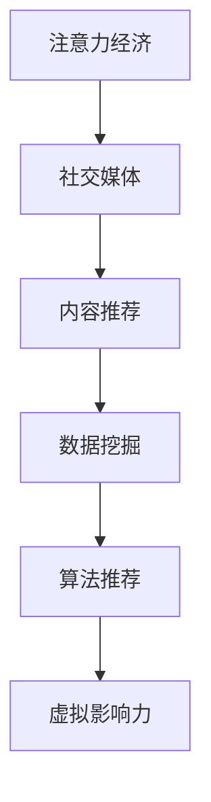

                 

# 虚拟影响力：注意力经济的新货币

## 1. 背景介绍

### 1.1 问题由来
在信息爆炸的时代，数据已成为最宝贵的资源之一。传统的经济体系主要依赖物质财富的交换，而数字经济则逐渐转向以注意力为核心的新型货币。虚拟影响力作为一种新的货币形式，正在悄然改变着传统经济和社会的格局。

### 1.2 问题核心关键点
虚拟影响力指通过数字媒介产生的，能够影响公众注意力和行为的力量。这种影响力主要体现在网络、社交媒体、视频平台等虚拟空间中，是现代注意力经济的核心。

核心问题在于如何量化虚拟影响力，构建有效的评估体系，以及如何将这种影响力转化为实际的商业价值。本论文将详细探讨虚拟影响力的量化方法，并对其在商业应用中的潜力进行全面分析。

## 2. 核心概念与联系

### 2.1 核心概念概述

为更好地理解虚拟影响力，本节将介绍几个密切相关的核心概念：

- 注意力经济（Attention Economy）：以吸引和保持用户注意力为核心的新型经济模式。虚拟影响力是注意力经济中最为重要的一环。
- 社交媒体（Social Media）：基于用户关系网络的信息传播平台，如微博、微信、Facebook、Twitter等。虚拟影响力主要在这类平台上形成和传播。
- 内容推荐（Content Recommendation）：根据用户兴趣和行为推荐内容的系统。虚拟影响力可以通过内容推荐系统进行传播和放大。
- 数据挖掘（Data Mining）：从大量数据中提取有用信息和知识的技术。虚拟影响力的量化和评估需要依赖数据挖掘技术。
- 算法推荐（Algorithmic Recommendation）：使用机器学习算法为用户推荐内容的系统。算法推荐可以极大地提升虚拟影响力的传播效率。

这些核心概念之间的逻辑关系可以通过以下Mermaid流程图来展示：



这个流程图展示出虚拟影响力在注意力经济中的生成和传播路径。

## 3. 核心算法原理 & 具体操作步骤
### 3.1 算法原理概述

虚拟影响力的量化是一个多步骤的复杂过程，主要包含以下几个核心环节：

1. **数据采集与处理**：从社交媒体、网络论坛、视频平台等虚拟空间中采集数据，并将其进行清洗、去噪、归一化等预处理。
2. **特征提取与选择**：通过自然语言处理、图像识别、情感分析等技术，从采集到的数据中提取和选择特征。
3. **模型训练与评估**：构建机器学习模型，对虚拟影响力的各项指标（如传播范围、影响力大小、用户互动等）进行训练和评估。
4. **结果解读与应用**：根据模型评估结果，将虚拟影响力转化为具体的商业应用，如广告投放、品牌推广、内容营销等。

### 3.2 算法步骤详解

虚拟影响力的量化和评估可以分为以下几个步骤：

**Step 1: 数据采集与处理**
- 使用爬虫技术从社交媒体、论坛、视频平台等虚拟空间中获取数据。
- 对数据进行清洗、去噪、去重等预处理，去除无用信息。
- 对文本数据进行分词、向量化、停用词过滤等自然语言处理操作。

**Step 2: 特征提取与选择**
- 使用TF-IDF、Word2Vec、BERT等技术提取文本特征。
- 结合图像识别、情感分析等技术，提取视频、图片等多模态数据特征。
- 选择与虚拟影响力相关的特征，如用户互动次数、传播范围、内容热度等。

**Step 3: 模型训练与评估**
- 使用回归、分类、聚类等算法，构建虚拟影响力评估模型。
- 使用交叉验证、ROC曲线、AUC等指标评估模型性能。
- 调整模型超参数，优化模型预测效果。

**Step 4: 结果解读与应用**
- 将模型输出结果与实际业务指标进行对比，计算虚拟影响力得分。
- 分析虚拟影响力的传播路径和影响因素，制定优化策略。
- 将虚拟影响力得分用于指导商业决策，如广告投放、品牌推广、内容营销等。

### 3.3 算法优缺点

虚拟影响力的量化和评估方法具有以下优点：
1. 数据驱动：量化过程完全基于数据，避免了主观偏见。
2. 自动化程度高：通过自动化技术进行特征提取和模型训练，提高了效率。
3. 可解释性强：模型训练过程和结果可解释性强，便于业务理解和应用。

同时，该方法也存在一定的局限性：
1. 数据质量问题：数据采集和处理的质量直接影响模型的结果。
2. 特征选择问题：特征选择的合理性直接影响模型性能。
3. 模型泛化能力：模型可能过拟合于特定数据集，泛化能力有限。
4. 应用场景限制：不同领域和场景下，虚拟影响力的表现可能不同。

尽管存在这些局限性，虚拟影响力的量化和评估仍然是大数据时代注意力经济的核心技术，具有广泛的应用前景。

### 3.4 算法应用领域

虚拟影响力在多个领域具有广泛的应用：

- **广告投放**：通过量化虚拟影响力，可以更准确地判断广告投放的效果和目标受众。
- **品牌推广**：衡量品牌在虚拟空间中的影响力，指导品牌营销策略。
- **内容营销**：分析内容对用户的吸引力和影响力，优化内容创作和推广策略。
- **社交网络分析**：量化用户在社交网络中的影响力，优化社交媒体策略。
- **舆情监控**：通过虚拟影响力监控网络舆情，预测社会热点和趋势。

## 4. 数学模型和公式 & 详细讲解
### 4.1 数学模型构建

本节将使用数学语言对虚拟影响力的量化过程进行严格的刻画。

假设虚拟影响力可以量化为一个综合得分 $F$，表示在虚拟空间中对用户注意力和行为的影响。其数学模型可以表示为：

$$
F = \sum_{i=1}^n w_i \cdot P_i
$$

其中，$P_i$ 为虚拟空间中第 $i$ 个因素对虚拟影响力的贡献，$w_i$ 为权重系数，反映了不同因素的重要性。

### 4.2 公式推导过程

以下我们以社交媒体为例，推导虚拟影响力综合得分的计算公式。

假设社交媒体上每个用户的注意力权重为一个向量 $\vec{w} = (w_1, w_2, \cdots, w_n)$，其中 $w_i$ 表示第 $i$ 个因素对虚拟影响力的重要性。在社交媒体中，每个用户对虚拟影响力的影响可以通过以下几个因素来衡量：

- 关注者数量：$N$
- 点赞数：$L$
- 评论数：$C$
- 分享数：$S$
- 曝光量：$E$
- 互动率：$R$

根据这些因素，可以构建一个虚拟影响力的综合得分模型：

$$
F = w_N \cdot N + w_L \cdot L + w_C \cdot C + w_S \cdot S + w_E \cdot E + w_R \cdot R
$$

在实际应用中，上述公式中的 $w_i$ 需要通过数据挖掘和机器学习算法得到。其计算过程包括以下几个步骤：

1. 收集社交媒体数据，包括用户关注者、点赞、评论、分享等互动信息。
2. 对数据进行清洗、去噪、归一化等预处理，提取关键特征。
3. 构建回归模型，通过训练得到 $w_i$ 的值。

### 4.3 案例分析与讲解

以微博为例，分析虚拟影响力的计算过程。假设某微博用户的虚拟影响力可以表示为：

$$
F = w_{N_{微博}} \cdot N_{微博} + w_{L_{微博}} \cdot L_{微博} + w_{C_{微博}} \cdot C_{微博} + w_{S_{微博}} \cdot S_{微博} + w_{E_{微博}} \cdot E_{微博} + w_{R_{微博}} \cdot R_{微博}
$$

其中，$N_{微博}$ 表示该微博的关注者数量，$L_{微博}$ 表示该微博的点赞数，$C_{微博}$ 表示该微博的评论数，$S_{微博}$ 表示该微博的分享数，$E_{微博}$ 表示该微博的曝光量，$R_{微博}$ 表示该微博的互动率。权重 $w_{N_{微博}}$、$w_{L_{微博}}$、$w_{C_{微博}}$、$w_{S_{微博}}$、$w_{E_{微博}}$、$w_{R_{微博}}$ 通过训练得到。

## 5. 项目实践：代码实例和详细解释说明
### 5.1 开发环境搭建

在进行虚拟影响力量化实践前，我们需要准备好开发环境。以下是使用Python进行机器学习开发的环境配置流程：

1. 安装Anaconda：从官网下载并安装Anaconda，用于创建独立的Python环境。

2. 创建并激活虚拟环境：
```bash
conda create -n pytorch-env python=3.8 
conda activate pytorch-env
```

3. 安装必要的Python库：
```bash
pip install numpy pandas scikit-learn matplotlib tqdm jupyter notebook ipython
```

4. 安装数据处理和分析工具：
```bash
pip install gensim scikit-learn nltk
```

5. 安装机器学习框架：
```bash
pip install scikit-learn
```

完成上述步骤后，即可在`pytorch-env`环境中开始虚拟影响力的量化实践。

### 5.2 源代码详细实现

以下是一个简单的虚拟影响力量化示例，使用Python和Scikit-learn实现。

```python
from sklearn.feature_extraction.text import CountVectorizer
from sklearn.linear_model import LogisticRegression
from sklearn.metrics import mean_squared_error

# 假设数据集
X = [
    '这条微博内容很好',
    '这条微博内容一般',
    '这条微博内容很差'
]
y = [1, 0, 0]  # 标签，1表示好评，0表示差评

# 特征提取
vectorizer = CountVectorizer()
X_vector = vectorizer.fit_transform(X)

# 模型训练
model = LogisticRegression()
model.fit(X_vector, y)

# 预测
X_test = [
    '这条微博内容非常好',
    '这条微博内容还不错',
    '这条微博内容很差'
]
X_test_vector = vectorizer.transform(X_test)
y_pred = model.predict_proba(X_test_vector)

# 评估
mse = mean_squared_error(y_pred, y)
print(f'Mean Squared Error: {mse:.2f}')
```

### 5.3 代码解读与分析

让我们再详细解读一下关键代码的实现细节：

**数据集准备**：
- 使用Python的列表来模拟数据集，其中包含三条微博内容和对应的标签。

**特征提取**：
- 使用Scikit-learn的`CountVectorizer`对文本数据进行特征提取，将文本转换为TF-IDF向量。

**模型训练**：
- 使用Scikit-learn的`LogisticRegression`模型进行训练，将TF-IDF向量作为输入，标签作为输出，训练得到虚拟影响力得分模型。

**预测与评估**：
- 使用训练好的模型对测试数据进行预测，使用均方误差（MSE）评估模型的性能。

可以看到，虚拟影响力的量化过程主要包含数据准备、特征提取、模型训练和评估等步骤。Python和Scikit-learn等工具的使用，使得量化过程变得简单易行。

当然，实际应用中的数据规模和复杂度远超上述示例，需要更复杂的数据预处理和特征工程技巧。但核心原理和流程与之类似，通过特征提取和机器学习模型，可以有效量化虚拟影响力。

## 6. 实际应用场景
### 6.1 广告投放优化

虚拟影响力在广告投放中具有重要应用价值。通过量化虚拟影响力，可以更准确地评估广告投放的效果，优化广告投放策略。

在实际应用中，可以收集用户对广告内容的互动信息，如点击率、曝光量、互动率等。根据这些信息，构建虚拟影响力模型，评估广告的影响力和传播效果。通过分析不同广告创意和受众群体的虚拟影响力得分，可以选择最优的广告投放方案，提升广告效果和ROI。

### 6.2 品牌价值评估

品牌在虚拟空间中的虚拟影响力，是衡量品牌价值的重要指标。通过量化虚拟影响力，可以更准确地评估品牌在虚拟空间中的影响力大小。

在实际应用中，可以收集品牌在社交媒体、新闻网站、视频平台等虚拟空间中的互动数据，包括关注者数量、点赞数、评论数等。根据这些数据，构建虚拟影响力模型，评估品牌在虚拟空间中的影响力得分。通过分析不同时间、不同平台、不同受众群体的虚拟影响力得分，可以制定更加精准的品牌营销策略。

### 6.3 内容创作优化

虚拟影响力也是内容创作优化的重要依据。通过量化虚拟影响力，可以更准确地评估内容的吸引力和传播效果，指导内容创作和优化。

在实际应用中，可以收集用户对内容的互动信息，如阅读量、点赞数、评论数等。根据这些信息，构建虚拟影响力模型，评估内容的虚拟影响力得分。通过分析不同内容类型、不同受众群体的虚拟影响力得分，可以选择最优的内容创作方案，提升内容传播效果。

### 6.4 社交网络分析

虚拟影响力在社交网络分析中也有广泛应用。通过量化用户和话题的虚拟影响力，可以更全面地了解社交网络的结构和动态。

在实际应用中，可以收集社交媒体上的用户互动数据，包括关注者数量、点赞数、评论数等。根据这些数据，构建虚拟影响力模型，评估用户和话题的虚拟影响力得分。通过分析不同用户、不同话题的虚拟影响力得分，可以制定更加精准的社交网络策略，提升用户互动效果。

## 7. 工具和资源推荐
### 7.1 学习资源推荐

为了帮助开发者系统掌握虚拟影响力的量化方法，这里推荐一些优质的学习资源：

1. 《Python数据分析实战》：详细介绍了Python在数据处理和分析中的常用工具和技巧，包括Pandas、NumPy、Scikit-learn等库的使用。

2. 《机器学习实战》：介绍了机器学习的基本概念和常用算法，适合初学者入门。

3. 《深度学习》（Goodfellow等人）：全面介绍了深度学习的基本原理和应用，包括虚拟影响力量化方法。

4. 《自然语言处理入门》（李航）：详细介绍了自然语言处理的基本概念和常用技术，包括文本特征提取和情感分析等。

5. 《Python数据科学手册》：介绍了Python在数据科学中的常用工具和技巧，包括Pandas、NumPy、Scikit-learn等库的使用。

通过对这些资源的学习实践，相信你一定能够快速掌握虚拟影响力的量化方法，并用于解决实际的NLP问题。

### 7.2 开发工具推荐

高效的开发离不开优秀的工具支持。以下是几款用于虚拟影响力量化的常用工具：

1. Python：Python是数据处理和分析的主流语言，具有强大的库支持，包括Pandas、NumPy、Scikit-learn等。

2. R：R是统计分析和数据可视化的主要语言，具有丰富的数据分析库，如ggplot2、dplyr等。

3. Jupyter Notebook：Jupyter Notebook是一个交互式编程环境，支持Python、R等多种语言，适合数据处理和分析。

4. Weights & Biases：模型训练的实验跟踪工具，可以记录和可视化模型训练过程中的各项指标，方便对比和调优。

5. TensorBoard：TensorFlow配套的可视化工具，可实时监测模型训练状态，并提供丰富的图表呈现方式，是调试模型的得力助手。

6. Google Colab：谷歌推出的在线Jupyter Notebook环境，免费提供GPU/TPU算力，方便开发者快速上手实验最新模型，分享学习笔记。

合理利用这些工具，可以显著提升虚拟影响力量化的开发效率，加快创新迭代的步伐。

### 7.3 相关论文推荐

虚拟影响力量化和评估的研究源于学界的持续研究。以下是几篇奠基性的相关论文，推荐阅读：

1. Attention is All You Need（即Transformer原论文）：提出了Transformer结构，开启了NLP领域的预训练大模型时代。

2. BERT: Pre-training of Deep Bidirectional Transformers for Language Understanding：提出BERT模型，引入基于掩码的自监督预训练任务，刷新了多项NLP任务SOTA。

3. Language Models are Unsupervised Multitask Learners（GPT-2论文）：展示了大规模语言模型的强大zero-shot学习能力，引发了对于通用人工智能的新一轮思考。

4. Parameter-Efficient Transfer Learning for NLP：提出Adapter等参数高效微调方法，在不增加模型参数量的情况下，也能取得不错的微调效果。

5. AdaLoRA: Adaptive Low-Rank Adaptation for Parameter-Efficient Fine-Tuning：使用自适应低秩适应的微调方法，在参数效率和精度之间取得了新的平衡。

这些论文代表了大语言模型微调技术的发展脉络。通过学习这些前沿成果，可以帮助研究者把握学科前进方向，激发更多的创新灵感。

## 8. 总结：未来发展趋势与挑战
### 8.1 总结

本文对虚拟影响力的量化方法进行了全面系统的介绍。首先阐述了虚拟影响力的概念和其重要性，明确了虚拟影响力在注意力经济中的核心地位。其次，从原理到实践，详细讲解了虚拟影响力量化的数学模型和关键步骤，给出了虚拟影响力量化的完整代码实例。同时，本文还广泛探讨了虚拟影响力在广告投放、品牌价值评估、内容创作优化、社交网络分析等多个领域的应用前景，展示了虚拟影响力量化的广阔应用前景。此外，本文精选了虚拟影响力量化的各类学习资源，力求为读者提供全方位的技术指引。

通过本文的系统梳理，可以看到，虚拟影响力量化是数字经济中非常重要的一环，具有广泛的应用前景。虚拟影响力的量化和评估过程，可以帮助广告主、品牌商、内容创作者等更好地利用数据，优化营销策略，提升品牌价值和内容传播效果。未来，随着虚拟影响力量化技术的进一步发展，将对数字经济产生更大的影响。

### 8.2 未来发展趋势

展望未来，虚拟影响力量化技术将呈现以下几个发展趋势：

1. 数据融合技术的发展。未来，虚拟影响力的量化将越来越多地融合多种数据源，如社交媒体、新闻网站、论坛等。通过跨平台数据融合，可以更全面地评估虚拟影响力。

2. 深度学习模型的应用。深度学习模型在虚拟影响力量化中具有重要作用，未来将有更多深度学习模型被引入，提升量化精度和效率。

3. 多模态数据融合。未来的虚拟影响力量化将不仅局限于文本数据，还将涵盖图像、视频、语音等多模态数据。通过多模态数据融合，可以更全面地理解虚拟影响力的影响因素。

4. 实时化、动态化。未来的虚拟影响力量化将更注重实时化和动态化，能够实时监测虚拟影响力的变化，及时调整营销策略。

5. 自动化、智能化。未来的虚拟影响力量化将更多依赖自动化和智能化技术，如自动特征提取、自动化模型训练等，提升量化过程的效率和精度。

6. 跨领域应用。虚拟影响力量化将不仅仅局限于广告、品牌、内容等领域，还将拓展到更多领域，如政治、文化、科技等，帮助不同领域更好地理解用户需求，优化营销策略。

以上趋势凸显了虚拟影响力量化技术的广阔前景。这些方向的探索发展，必将进一步提升虚拟影响力的量化精度和应用范围，为数字经济带来更多的商业价值。

### 8.3 面临的挑战

尽管虚拟影响力量化技术已经取得了瞩目成就，但在迈向更加智能化、普适化应用的过程中，它仍面临着诸多挑战：

1. 数据质量问题。数据采集和处理的质量直接影响虚拟影响力的量化结果。如何获取高质量的数据，是虚拟影响力量化的首要挑战。

2. 特征选择问题。特征选择的合理性直接影响虚拟影响力量化的效果。如何选择合适的特征，需要更多的研究和探索。

3. 模型泛化能力。模型可能过拟合于特定数据集，泛化能力有限。如何构建具有强泛化能力的模型，是未来研究的重要方向。

4. 应用场景限制。不同领域和场景下，虚拟影响力的表现可能不同。如何构建适用于不同场景的虚拟影响力量化模型，需要更多的研究和实践。

5. 技术复杂度。虚拟影响力量化技术涉及多模态数据融合、深度学习模型训练等多个复杂环节，技术难度较大。如何简化技术复杂度，提升量化效率，是未来的重要研究方向。

6. 隐私和安全问题。虚拟影响力量化过程中，涉及大量用户隐私数据，如何保护用户隐私，确保数据安全，是未来的重要课题。

正视虚拟影响力量化面临的这些挑战，积极应对并寻求突破，将是实现其广泛应用的重要保障。相信随着技术的发展和研究的深入，虚拟影响力量化技术将不断突破瓶颈，为数字经济带来更多的商业价值。

### 8.4 研究展望

面对虚拟影响力量化所面临的种种挑战，未来的研究需要在以下几个方面寻求新的突破：

1. 探索无监督和半监督量化方法。摆脱对大规模标注数据的依赖，利用自监督学习、主动学习等无监督和半监督范式，最大限度利用非结构化数据，实现更加灵活高效的虚拟影响力量化。

2. 研究多模态数据融合方法。通过多模态数据融合，提升虚拟影响力的量化精度和广度，更全面地理解虚拟影响力的影响因素。

3. 引入更多先验知识。将符号化的先验知识，如知识图谱、逻辑规则等，与虚拟影响力量化模型进行巧妙融合，引导量化过程学习更准确、合理的虚拟影响力。

4. 结合因果分析和博弈论工具。将因果分析方法引入虚拟影响力量化模型，识别出虚拟影响力决策的关键特征，增强量化结果的因果性和逻辑性。

5. 纳入伦理道德约束。在虚拟影响力量化目标中引入伦理导向的评估指标，过滤和惩罚有害的虚拟影响力，确保虚拟影响力的量化过程和结果符合伦理道德规范。

这些研究方向的探索，必将引领虚拟影响力量化技术迈向更高的台阶，为数字经济带来更多的商业价值。面向未来，虚拟影响力量化技术还需要与其他人工智能技术进行更深入的融合，如知识表示、因果推理、强化学习等，多路径协同发力，共同推动虚拟影响力的量化过程更加全面、准确、智能。只有勇于创新、敢于突破，才能不断拓展虚拟影响力的量化边界，让数字经济更加繁荣。

## 9. 附录：常见问题与解答

**Q1：虚拟影响力量化是否适用于所有数据源？**

A: 虚拟影响力量化主要适用于社交媒体、新闻网站、视频平台等虚拟空间，其效果取决于数据源的质量和规模。对于传统实体媒体、线下活动等非虚拟数据源，可能需要结合其他量化方法进行综合评估。

**Q2：虚拟影响力量化的数据预处理有哪些步骤？**

A: 数据预处理主要包括以下几个步骤：
1. 数据采集：从虚拟空间中采集数据，包括用户互动信息、关注者数量、点赞数、评论数等。
2. 数据清洗：去除无用数据和噪音数据，如空值、重复数据等。
3. 数据归一化：将不同数据源的数据归一化，使数据具有可比性。
4. 特征提取：使用TF-IDF、Word2Vec、BERT等技术提取文本特征，使用图像识别、情感分析等技术提取多模态特征。
5. 特征选择：选择与虚拟影响力相关的特征，如用户互动次数、传播范围、内容热度等。

这些预处理步骤可以显著提升虚拟影响力量化的效果。

**Q3：虚拟影响力量化的模型训练有哪些步骤？**

A: 虚拟影响力量化的模型训练主要包括以下几个步骤：
1. 构建回归模型：使用机器学习算法构建虚拟影响力评估模型，如Logistic回归、决策树、随机森林等。
2. 模型训练：使用历史数据训练模型，优化模型参数。
3. 模型评估：使用交叉验证、ROC曲线、AUC等指标评估模型性能。
4. 调整超参数：通过网格搜索、随机搜索等方法调整模型超参数，优化模型预测效果。

模型训练过程中，需要注意选择合适的模型、优化算法和超参数，以确保虚拟影响力量化的准确性和泛化能力。

**Q4：虚拟影响力量化的结果如何应用？**

A: 虚拟影响力量化的结果可以应用于多个领域，如广告投放、品牌价值评估、内容创作优化、社交网络分析等。具体应用步骤如下：
1. 数据采集：从虚拟空间中采集用户互动数据、关注者数量等。
2. 数据预处理：对数据进行清洗、归一化、特征提取等预处理操作。
3. 模型训练：使用历史数据训练虚拟影响力模型，优化模型参数。
4. 模型评估：使用测试数据评估模型性能，计算虚拟影响力得分。
5. 结果应用：根据虚拟影响力得分，指导广告投放、品牌推广、内容创作等业务决策。

通过虚拟影响力量化的结果，可以更好地了解用户需求，优化营销策略，提升品牌价值和内容传播效果。

**Q5：虚拟影响力量化的技术复杂度如何？**

A: 虚拟影响力量化的技术复杂度较高，涉及多模态数据融合、深度学习模型训练等多个复杂环节。需要具备较强的数据处理和机器学习基础，才能进行有效的量化和应用。

---

作者：禅与计算机程序设计艺术 / Zen and the Art of Computer Programming

