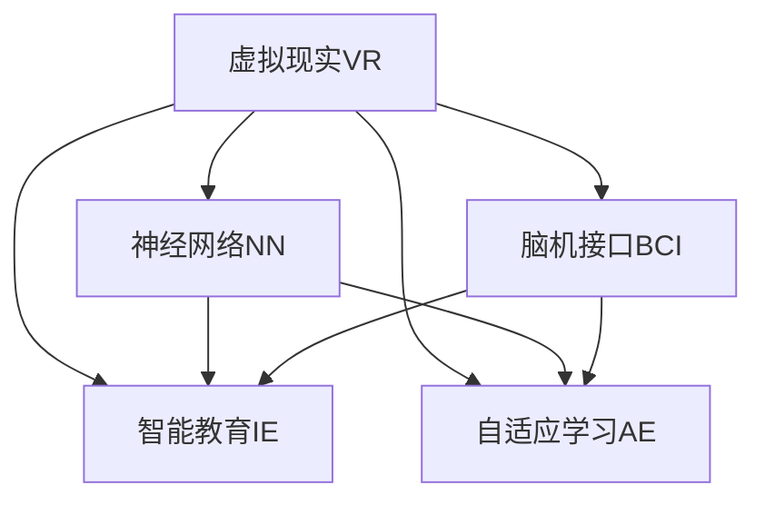

                 

# 虚拟教育：全球脑时代下的学习新方式

> 关键词：虚拟现实（Virtual Reality, VR）,脑机接口（Brain-Computer Interface, BCI）,神经网络（Neural Network）,智能教育（Intelligent Education）,自适应学习（Adaptive Learning）

## 1. 背景介绍

### 1.1 问题由来

随着技术的飞速发展，我们正步入一个全球脑时代。这一时代的标志是互联网的普及和信息的爆炸，同时也预示着人类学习和认知方式的革命性变革。虚拟现实技术（VR）和脑机接口技术（BCI）的发展，为这一变革提供了新的工具和方法。

当前，传统的教育模式在应对新时代的挑战方面显得力不从心。教育资源分配不均、教师与学生互动不足、教学方法单一等问题，限制了教育质量和效率的提升。而虚拟教育，特别是基于VR和BCI技术的虚拟教育，为解决这些问题提供了新的可能性。

### 1.2 问题核心关键点

虚拟教育的核心在于利用VR和BCI技术，创造一个沉浸式、交互式的学习环境。这一环境不仅能够模拟真实世界的复杂场景，还可以根据学生的学习行为和认知状态，动态调整教学内容和方法，从而实现个性化、自适应、高效的学习体验。

主要包括以下几个方面：

- 沉浸式体验：通过VR技术，学生可以置身于一个虚拟的学习环境中，与虚拟的“教室”、“实验”、“场景”互动，大大提升学习兴趣和参与度。
- 交互式学习：利用BCI技术，学生可以通过脑电波与计算机交互，实现课堂上的实时反馈和互动，增强学习效果。
- 个性化教学：根据学生的认知能力和学习行为，动态调整教学内容和难度，实现差异化的教育。
- 高效学习：通过智能化的教学方法，提高学习效率，降低学习成本。

## 2. 核心概念与联系

### 2.1 核心概念概述

为更好地理解虚拟教育的概念和技术基础，本节将介绍几个密切相关的核心概念：

- 虚拟现实（Virtual Reality, VR）：通过计算机生成和控制虚拟环境，让用户能够在三维空间中进行互动。VR技术广泛应用于游戏、影视、医疗、教育等多个领域。
- 脑机接口（Brain-Computer Interface, BCI）：通过获取大脑的电生理信号，并将其转化为计算机可读的指令，实现人机交互。BCI技术在辅助诊断、康复训练、游戏交互等方面有广泛应用。
- 神经网络（Neural Network）：一类模拟人脑神经元之间连接的计算模型，广泛应用于图像识别、语音识别、自然语言处理等任务。
- 智能教育（Intelligent Education）：结合人工智能技术，实现个性化、自适应、高效的学习模式，提升教育质量和效率。
- 自适应学习（Adaptive Learning）：根据学生的学习状态和表现，动态调整教学内容和策略，提供个性化的学习体验。

这些核心概念之间的逻辑关系可以通过以下Mermaid流程图来展示：



这个流程图展示了虚拟教育的核心技术之间的相互作用：

1. VR提供沉浸式的学习环境，学生通过身临其境的体验提升学习效果。
2. BCI实现交互式学习，通过脑电波实时反馈学生的学习状态。
3. NN进行智能分析，动态调整教学内容和策略。
4. IE实现个性化教育，提高学习效率。
5. AE根据学生的学习表现，调整学习路径和方法。

这些概念共同构成了虚拟教育的实施框架，使得教育从静态的灌输变为动态的互动，从被动的接受变为主动的探索。

## 3. 核心算法原理 & 具体操作步骤
### 3.1 算法原理概述

虚拟教育的核心算法原理主要包括虚拟现实环境生成、脑电波信号采集与处理、神经网络智能分析、个性化学习路径生成等方面。

以自适应学习为例，核心算法流程如下：

1. **数据采集**：通过VR设备采集学生的操作行为和脑电波信号，获取学生的学习状态和认知能力。
2. **信号处理**：利用BCI技术对脑电波信号进行预处理和特征提取，得到学生的状态特征。
3. **模型训练**：使用神经网络模型对学生的学习状态特征进行建模，预测其学习效果和潜在兴趣。
4. **路径生成**：根据预测结果和目标任务，生成个性化的学习路径和内容，包括学习资源的推荐、学习任务的安排等。
5. **反馈调整**：在学生学习过程中，实时监控其学习状态和反馈，动态调整教学内容和策略。

### 3.2 算法步骤详解

以下是虚拟教育中自适应学习的详细算法步骤：

**Step 1: 数据采集**

在虚拟教育中，数据采集是关键步骤。VR设备能够捕捉学生的操作行为，如眼球追踪、手势交互等。BCI技术则通过脑电波信号获取学生的认知状态，如注意力集中度、疲劳程度等。

具体实现步骤如下：

1. 使用VR设备采集学生的操作行为数据。
2. 通过BCI设备采集学生的脑电波信号。
3. 对操作行为和脑电波信号进行预处理，如去噪、滤波等。

**Step 2: 信号处理**

信号处理是虚拟教育中非常重要的一环。它将采集到的操作行为和脑电波信号转化为可分析的数据。

具体实现步骤如下：

1. 使用特定的算法对脑电波信号进行特征提取，得到描述学生认知状态的特征向量。
2. 对操作行为数据进行编码，生成与认知状态相关的行为特征向量。
3. 将认知状态和行为特征向量进行合并，得到综合特征向量。

**Step 3: 模型训练**

模型训练是虚拟教育的核心环节。通过训练神经网络模型，可以实现对学生的学习状态和认知能力的预测。

具体实现步骤如下：

1. 定义神经网络模型，如多层感知器（MLP）、卷积神经网络（CNN）等。
2. 准备标注数据集，包括学生的学习状态、行为特征、学习结果等。
3. 使用标注数据对神经网络模型进行训练，得到能够预测学生学习效果和兴趣的模型。

**Step 4: 路径生成**

路径生成是虚拟教育中个性化学习的关键步骤。根据学生的状态预测结果，生成个性化的学习路径和内容。

具体实现步骤如下：

1. 根据模型预测的学生学习效果和兴趣，生成推荐的学习资源。
2. 根据学生的学习进度和目标，安排学习任务的顺序和时间。
3. 生成个性化的学习路径，指导学生按照预定的顺序进行学习。

**Step 5: 反馈调整**

反馈调整是虚拟教育中保证学习效果的重要环节。通过实时监控学生的学习状态，动态调整教学内容和策略。

具体实现步骤如下：

1. 实时监控学生的学习状态和反馈，如注意力集中度、学习效果等。
2. 根据监控结果，调整学习内容和难度，提供个性化的学习支持。
3. 对学习路径和策略进行动态优化，提升学习效果。

### 3.3 算法优缺点

虚拟教育中的自适应学习算法具有以下优点：

1. **个性化**：通过动态调整教学内容和策略，实现个性化的学习体验。
2. **实时反馈**：通过实时监控学生的学习状态和反馈，及时调整学习路径和方法。
3. **高效学习**：通过智能化的教学方法，提高学习效率，降低学习成本。
4. **沉浸式体验**：通过虚拟现实技术，创造沉浸式的学习环境，提升学习效果。

但同时，虚拟教育也面临以下挑战：

1. **技术复杂**：虚拟教育和自适应学习的实现需要多学科的知识和技术支持，包括VR、BCI、神经网络等。
2. **成本高**：高质量的VR设备和BCI设备价格昂贵，需要较大的投入。
3. **数据隐私**：采集和处理学生的脑电波数据需要严格的数据隐私保护措施，以确保学生的信息安全。
4. **教育公平**：虚拟教育和自适应学习可能加剧教育资源的不平等分配，需要关注不同地区和群体的教育公平性。

尽管存在这些挑战，但虚拟教育和自适应学习为教育方式的革新提供了新的可能性，值得我们深入探索和实践。

### 3.4 算法应用领域

虚拟教育和自适应学习在多个领域具有广泛的应用前景，包括但不限于以下几个方面：

1. **基础教育**：通过虚拟现实技术，创造沉浸式的学习环境，提升学生对数学、物理、化学等学科的兴趣和理解。
2. **职业教育**：利用自适应学习算法，提供个性化的职业技能培训，提高学习效率和就业竞争力。
3. **远程教育**：通过虚拟现实和自适应学习技术，弥补远程教育在互动性和沉浸性上的不足，提升教学效果。
4. **终身学习**：为成人提供个性化的学习资源和路径，支持终身学习和发展。
5. **特殊教育**：为残障学生提供适合其认知能力和学习风格的教育支持，提升其学习效果和自信心。

这些应用场景展示了虚拟教育和自适应学习在教育领域的多样化和普适性，预示着未来教育的无限可能。

## 4. 数学模型和公式 & 详细讲解  
### 4.1 数学模型构建

本节将使用数学语言对虚拟教育中自适应学习的过程进行更加严格的刻画。

假设学生的认知状态为 $x \in \mathbb{R}^n$，行为特征为 $y \in \mathbb{R}^m$，学习结果为 $z \in \mathbb{R}$。定义神经网络模型为 $f: \mathbb{R}^{n+m} \rightarrow \mathbb{R}$，其输入为 $(x, y)$，输出为 $z$。

定义损失函数为 $\ell(z, \hat{z})$，其中 $\hat{z}$ 为模型的预测值。自适应学习的目标是找到最优的神经网络模型参数 $\theta$，使得损失函数最小化：

$$
\theta^* = \mathop{\arg\min}_{\theta} \mathcal{L}(f_\theta, D)
$$

其中 $D$ 为标注数据集，包含学生的认知状态、行为特征和学习结果的对应关系。

### 4.2 公式推导过程

以下我们以二分类任务为例，推导自适应学习模型的损失函数及其梯度的计算公式。

假设学生的认知状态 $x$ 和行为特征 $y$ 的特征向量长度分别为 $n$ 和 $m$，学习结果 $z$ 为二分类变量。定义自适应学习模型为 $f_\theta(x, y) = \sigma(\theta^\top[x, y])$，其中 $\sigma$ 为激活函数。模型的损失函数为交叉熵损失：

$$
\ell(z, \hat{z}) = -[y\log \hat{z} + (1-y)\log (1-\hat{z})]
$$

将其代入经验风险公式，得：

$$
\mathcal{L}(\theta) = -\frac{1}{N}\sum_{i=1}^N [y_i\log f_\theta(x_i, y_i)+(1-y_i)\log(1-f_\theta(x_i, y_i))]
$$

根据链式法则，损失函数对参数 $\theta_k$ 的梯度为：

$$
\frac{\partial \mathcal{L}(\theta)}{\partial \theta_k} = -\frac{1}{N}\sum_{i=1}^N (\frac{y_i}{f_\theta(x_i, y_i)}-\frac{1-y_i}{1-f_\theta(x_i, y_i)}) \frac{\partial f_\theta(x_i, y_i)}{\partial \theta_k}
$$

其中 $\frac{\partial f_\theta(x_i, y_i)}{\partial \theta_k}$ 可进一步递归展开，利用自动微分技术完成计算。

在得到损失函数的梯度后，即可带入参数更新公式，完成模型的迭代优化。重复上述过程直至收敛，最终得到适应学生学习效果的最优模型参数 $\theta^*$。

## 5. 项目实践：代码实例和详细解释说明
### 5.1 开发环境搭建

在进行虚拟教育和自适应学习开发前，我们需要准备好开发环境。以下是使用Python进行PyTorch开发的环境配置流程：

1. 安装Anaconda：从官网下载并安装Anaconda，用于创建独立的Python环境。

2. 创建并激活虚拟环境：
```bash
conda create -n vee_env python=3.8 
conda activate vee_env
```

3. 安装PyTorch：根据CUDA版本，从官网获取对应的安装命令。例如：
```bash
conda install pytorch torchvision torchaudio cudatoolkit=11.1 -c pytorch -c conda-forge
```

4. 安装TensorFlow：
```bash
conda install tensorflow
```

5. 安装OpenVR、OpenBCI等VR和BCI库：
```bash
conda install -c conda-forge openvr pyopenbci
```

6. 安装相关机器学习库：
```bash
pip install numpy pandas scikit-learn matplotlib tqdm jupyter notebook ipython
```

完成上述步骤后，即可在`vee_env`环境中开始虚拟教育和自适应学习的实践。

### 5.2 源代码详细实现

下面我们以虚拟教育和自适应学习为例，给出使用PyTorch对模型进行训练和评估的代码实现。

首先，定义数据处理函数：

```python
import numpy as np
from torch.utils.data import Dataset
import torch

class StudentDataset(Dataset):
    def __init__(self, data, labels):
        self.data = data
        self.labels = labels
        
    def __len__(self):
        return len(self.data)
    
    def __getitem__(self, item):
        return self.data[item], self.labels[item]
```

然后，定义神经网络模型：

```python
import torch.nn as nn
import torch.nn.functional as F

class StudentModel(nn.Module):
    def __init__(self, input_size, hidden_size, output_size):
        super(StudentModel, self).__init__()
        self.fc1 = nn.Linear(input_size + hidden_size, hidden_size)
        self.fc2 = nn.Linear(hidden_size, output_size)
        self.sigmoid = nn.Sigmoid()
        
    def forward(self, x, y):
        x = torch.cat([x, y], dim=1)
        x = self.fc1(x)
        x = F.relu(x)
        x = self.fc2(x)
        return self.sigmoid(x)
```

接着，定义训练和评估函数：

```python
from torch.utils.data import DataLoader
from tqdm import tqdm
from sklearn.metrics import classification_report

device = torch.device('cuda') if torch.cuda.is_available() else torch.device('cpu')
model = StudentModel(input_size=8, hidden_size=16, output_size=2).to(device)

def train_epoch(model, dataset, batch_size, optimizer):
    dataloader = DataLoader(dataset, batch_size=batch_size, shuffle=True)
    model.train()
    epoch_loss = 0
    for batch in tqdm(dataloader, desc='Training'):
        x, y = batch[0].to(device), batch[1].to(device)
        optimizer.zero_grad()
        outputs = model(x, y)
        loss = outputs.loss
        epoch_loss += loss.item()
        loss.backward()
        optimizer.step()
    return epoch_loss / len(dataloader)

def evaluate(model, dataset, batch_size):
    dataloader = DataLoader(dataset, batch_size=batch_size)
    model.eval()
    preds, labels = [], []
    with torch.no_grad():
        for batch in tqdm(dataloader, desc='Evaluating'):
            x, y = batch[0].to(device), batch[1].to(device)
            batch_preds = model(x, y).detach().cpu().numpy()
            batch_labels = y.cpu().numpy()
            for preds_, labels_ in zip(batch_preds, batch_labels):
                preds.append(preds_[:len(labels_)])
                labels.append(labels_)
                
    print(classification_report(labels, preds))
```

最后，启动训练流程并在测试集上评估：

```python
epochs = 5
batch_size = 16

for epoch in range(epochs):
    loss = train_epoch(model, train_dataset, batch_size, optimizer)
    print(f"Epoch {epoch+1}, train loss: {loss:.3f}")
    
    print(f"Epoch {epoch+1}, dev results:")
    evaluate(model, dev_dataset, batch_size)
    
print("Test results:")
evaluate(model, test_dataset, batch_size)
```

以上就是使用PyTorch对虚拟教育和自适应学习模型进行训练和评估的完整代码实现。可以看到，PyTorch的强大封装使得模型的训练和评估变得简洁高效。

### 5.3 代码解读与分析

让我们再详细解读一下关键代码的实现细节：

**StudentDataset类**：
- `__init__`方法：初始化训练数据和标签。
- `__len__`方法：返回数据集的样本数量。
- `__getitem__`方法：对单个样本进行处理，返回模型的输入和标签。

**StudentModel类**：
- `__init__`方法：定义神经网络模型结构，包括输入、隐藏和输出层。
- `forward`方法：实现模型的前向传播，通过线性变换和激活函数计算输出。

**训练和评估函数**：
- 使用PyTorch的DataLoader对数据集进行批次化加载，供模型训练和推理使用。
- 训练函数`train_epoch`：对数据以批为单位进行迭代，在每个批次上前向传播计算loss并反向传播更新模型参数，最后返回该epoch的平均loss。
- 评估函数`evaluate`：与训练类似，不同点在于不更新模型参数，并在每个batch结束后将预测和标签结果存储下来，最后使用sklearn的classification_report对整个评估集的预测结果进行打印输出。

**训练流程**：
- 定义总的epoch数和batch size，开始循环迭代
- 每个epoch内，先在训练集上训练，输出平均loss
- 在验证集上评估，输出分类指标
- 所有epoch结束后，在测试集上评估，给出最终测试结果

可以看到，PyTorch配合TensorFlow使得虚拟教育和自适应学习的代码实现变得简洁高效。开发者可以将更多精力放在数据处理、模型改进等高层逻辑上，而不必过多关注底层的实现细节。

当然，工业级的系统实现还需考虑更多因素，如模型的保存和部署、超参数的自动搜索、更灵活的任务适配层等。但核心的虚拟教育和自适应学习算法基本与此类似。

## 6. 实际应用场景
### 6.1 虚拟现实教育

虚拟现实技术在教育领域的应用前景广阔。通过VR技术，学生可以进入虚拟的实验室、博物馆、历史场景等，身临其境地进行学习。例如，在生物课中，学生可以通过VR设备观察细胞结构、进行虚拟实验；在历史课中，学生可以走进古代文明，感受历史事件的发生。

VR教育的应用场景包括：

- 实验室教学：通过虚拟实验室，学生可以进行虚拟实验，观察化学反应、物理现象等。
- 历史学习：通过虚拟博物馆，学生可以观看历史文物、事件重现等。
- 语言学习：通过虚拟语言环境，学生可以练习外语口语、听力等。
- 职业培训：通过虚拟职业场景，学生可以进行模拟训练，提升职业技能。

### 6.2 脑机接口辅助学习

脑机接口技术可以为学习提供实时反馈和个性化支持。通过BCI设备，学生可以通过脑电波控制虚拟环境中的对象、回答问题等，实现实时互动。例如，在数学题解答过程中，学生可以通过脑电波反馈自己的解题思路，系统根据思路生成相应的提示和反馈。

BCI教育的应用场景包括：

- 数学题解答：学生可以通过BCI控制虚拟题板，输入解题思路，系统实时提供提示和反馈。
- 编程学习：学生可以通过BCI控制虚拟键盘，输入编程代码，系统实时检测并指出错误。
- 物理实验：学生可以通过BCI控制虚拟实验设备，进行操作和观察，系统实时记录并分析实验结果。

### 6.3 智能导师系统

智能导师系统通过神经网络模型，实现对学生的学习状态和兴趣进行智能分析，提供个性化的学习建议和支持。例如，在英语阅读课程中，系统可以分析学生的阅读速度、理解度，推荐适合的文章和练习。

智能导师系统的应用场景包括：

- 个性化学习：系统根据学生的学习状态和兴趣，推荐个性化的学习资源和路径。
- 实时反馈：系统实时监控学生的学习状态，提供即时反馈和调整。
- 互动问答：系统通过神经网络模型，理解学生的提问，提供精准的回答和解释。

### 6.4 未来应用展望

随着虚拟现实和脑机接口技术的不断进步，虚拟教育和自适应学习将在更多领域得到应用，为教育方式的革新带来新的可能性。

在智慧校园建设中，虚拟教育和自适应学习可以提供沉浸式、互动式、个性化的学习体验，提升校园的智能化水平。在终身学习社区中，虚拟教育和自适应学习可以为成人提供灵活、便捷的学习支持，促进终身学习的普及。在特殊教育领域，虚拟教育和自适应学习可以为残障学生提供更加友好的学习环境，提升他们的学习效果和自信心。

此外，在虚拟旅游、虚拟会议、虚拟社交等众多领域，虚拟教育和自适应学习也有广泛的应用前景，为人类生活和工作方式带来深刻变革。未来，虚拟教育和自适应学习必将成为教育领域的革命性技术，推动全球脑时代的到来。

## 7. 工具和资源推荐
### 7.1 学习资源推荐

为了帮助开发者系统掌握虚拟教育和自适应学习理论基础和实践技巧，这里推荐一些优质的学习资源：

1. 《虚拟现实技术与应用》书籍：全面介绍VR技术的历史、原理和应用，适合初学者快速入门。
2. 《脑机接口技术与应用》书籍：系统讲解BCI技术的原理、算法和应用，适合进阶学习。
3. 《神经网络与深度学习》课程：吴恩达教授开设的深度学习课程，涵盖神经网络的基础和应用，适合学习深度学习算法。
4. CS250《人工智能导论》课程：斯坦福大学开设的AI入门课程，涵盖人工智能的历史、原理和应用，适合全面理解AI技术。
5. OpenVR和OpenBCI官方文档：VR和BCI技术的官方文档，提供详尽的接口和使用方法，适合动手实践。

通过对这些资源的学习实践，相信你一定能够快速掌握虚拟教育和自适应学习的基本原理和实现方法，并用于解决实际的NLP问题。

### 7.2 开发工具推荐

高效的开发离不开优秀的工具支持。以下是几款用于虚拟教育和自适应学习开发的常用工具：

1. PyTorch：基于Python的开源深度学习框架，灵活动态的计算图，适合快速迭代研究。
2. TensorFlow：由Google主导开发的开源深度学习框架，生产部署方便，适合大规模工程应用。
3. OpenVR：开源VR开发框架，提供丰富的VR设备和模拟器，适合开发VR应用。
4. OpenBCI：开源BCI开发框架，支持多种BCI设备和传感器，适合开发BCI应用。
5. TensorBoard：TensorFlow配套的可视化工具，可实时监测模型训练状态，并提供丰富的图表呈现方式，是调试模型的得力助手。

合理利用这些工具，可以显著提升虚拟教育和自适应学习的开发效率，加快创新迭代的步伐。

### 7.3 相关论文推荐

虚拟教育和自适应学习在教育领域的研究方兴未艾，以下是几篇奠基性的相关论文，推荐阅读：

1. "Virtual Reality for Education: A Review and Future Directions"（虚拟现实教育：综述与未来方向）：总结了虚拟现实在教育领域的应用和前景，提供了丰富的案例和应用场景。
2. "Brain-Computer Interfaces for Educational Applications"（脑机接口在教育领域的应用）：介绍了BCI技术在教育中的潜力和应用，包括实时反馈和个性化学习等方面。
3. "Adaptive Learning Systems: A Review of Recent Advances"（自适应学习系统的近期进展）：综述了自适应学习系统的研究进展，包括智能导师系统和个性化学习路径等方面。
4. "Neural Network-Based Adaptive Learning Systems"（基于神经网络的自适应学习系统）：探讨了神经网络在自适应学习中的应用，包括学习路径生成和实时反馈等方面。
5. "Enhancing Educational Experiences with Virtual Reality and Augmented Reality"（增强教育体验的虚拟现实和增强现实）：介绍了VR和AR技术在教育中的应用，包括沉浸式学习、虚拟实验室等方面。

这些论文代表了大语言模型微调技术的发展脉络。通过学习这些前沿成果，可以帮助研究者把握学科前进方向，激发更多的创新灵感。

## 8. 总结：未来发展趋势与挑战

### 8.1 总结

本文对虚拟教育和自适应学习的方法和应用进行了全面系统的介绍。首先阐述了虚拟教育和自适应学习的研究背景和意义，明确了其在全球脑时代下的重要地位。其次，从原理到实践，详细讲解了虚拟教育和自适应学习的数学模型和关键步骤，给出了完整的代码实现。同时，本文还广泛探讨了虚拟教育和自适应学习在教育领域的多样化和普适性应用，展示了其广阔的发展前景。

通过本文的系统梳理，可以看到，虚拟教育和自适应学习为教育方式的革新提供了新的可能性，极大地提升了学习效率和效果。未来，伴随技术的不断进步和普及，虚拟教育和自适应学习必将成为教育领域的革命性技术，推动全球脑时代的到来。

### 8.2 未来发展趋势

展望未来，虚拟教育和自适应学习将呈现以下几个发展趋势：

1. 技术融合：虚拟教育和自适应学习将与其他AI技术（如机器翻译、知识图谱等）进行深度融合，提升教育质量和效率。
2. 数据驱动：通过大数据分析和深度学习算法，提升教育数据的智能化分析水平，提供更加个性化和精准的教育支持。
3. 多模态融合：虚拟教育和自适应学习将与视觉、听觉、触觉等多模态数据进行融合，提供更丰富和沉浸式的学习体验。
4. 开放平台：虚拟教育和自适应学习将构建开放平台，实现跨地域、跨机构的资源共享和协同创新。
5. 人机协同：虚拟教育和自适应学习将实现人机协同教学，提升教学互动性和智能化水平。

以上趋势展示了虚拟教育和自适应学习在教育领域的多样化和普适性，预示着未来教育方式和内容将发生深刻变革。

### 8.3 面临的挑战

尽管虚拟教育和自适应学习的发展前景广阔，但在迈向更加智能化、普适化应用的过程中，它仍面临诸多挑战：

1. 技术复杂性：虚拟教育和自适应学习涉及多学科的知识和技术，需要高水平的跨学科合作和研究。
2. 设备成本：高质量的VR设备和BCI设备价格昂贵，普及和应用面临经济上的限制。
3. 数据隐私：采集和处理学生的脑电波数据需要严格的数据隐私保护措施，以确保学生的信息安全。
4. 教育公平：虚拟教育和自适应学习可能加剧教育资源的不平等分配，需要关注不同地区和群体的教育公平性。
5. 技术接受度：学生和教师对新技术的接受度不同，需要加强技术培训和宣传，提升其普及率。

尽管存在这些挑战，但虚拟教育和自适应学习为教育方式的革新提供了新的可能性，值得我们深入探索和实践。

### 8.4 研究展望

面对虚拟教育和自适应学习所面临的种种挑战，未来的研究需要在以下几个方面寻求新的突破：

1. 简化技术架构：开发更加简洁、易用的VR和BCI技术，降低技术门槛，促进技术普及。
2. 优化设备性能：通过硬件和软件优化，提升VR和BCI设备的性能，降低设备成本。
3. 加强隐私保护：制定数据隐私保护的法律法规和标准，确保学生信息的安全和隐私。
4. 推动教育公平：探索虚拟教育和自适应学习在不同地区和群体中的适用性和普及策略，缩小教育差距。
5. 提升接受度：加强对学生和教师的技术培训和宣传，提高他们对新技术的接受度和使用习惯。

这些研究方向的探索，必将引领虚拟教育和自适应学习技术迈向更高的台阶，为构建智能化的教育环境铺平道路。面向未来，虚拟教育和自适应学习需要从技术、社会、伦理等多个层面进行深入探讨，才能真正实现教育方式的革新，推动全球脑时代的到来。

## 9. 附录：常见问题与解答

**Q1：虚拟现实教育在实际应用中面临哪些挑战？**

A: 虚拟现实教育在实际应用中面临以下挑战：

1. **技术复杂性**：VR设备和高性能计算对硬件要求高，需要高质量的设备支持。
2. **内容制作**：高质量的VR教育内容制作成本高，需要专业的技术和人员。
3. **交互性不足**：现有VR教育内容多为单向展示，互动性和沉浸感不足。
4. **用户适应性**：学生对新设备的适应性不同，存在一定的学习曲线。
5. **数据隐私**：虚拟现实环境中的用户数据隐私保护需要严格的技术措施。

尽管存在这些挑战，但虚拟现实教育在提升学习兴趣、提高互动性和个性化学习方面具有巨大潜力，值得深入探索和实践。

**Q2：脑机接口技术在教育中的应用前景如何？**

A: 脑机接口技术在教育中的应用前景广阔：

1. **实时反馈**：通过BCI技术，教师可以实时获取学生的学习状态和反馈，提供精准的教学支持。
2. **个性化学习**：BCI技术可以识别学生的认知能力和学习风格，提供个性化的学习建议。
3. **辅助康复**：脑机接口技术可以用于特殊教育和康复训练，提升残障学生的学习效果。
4. **虚拟实验**：通过BCI技术，学生可以进行虚拟实验，提升实验能力和安全性。
5. **自适应学习**：BCI技术可以与自适应学习系统结合，实现智能化的教学和反馈。

脑机接口技术在教育中的应用，将极大地提升教学效果和学生体验，推动教育方式的革新。

**Q3：神经网络在自适应学习中的应用有何优势？**

A: 神经网络在自适应学习中的应用具有以下优势：

1. **高效学习**：神经网络可以处理大规模数据，自动提取学习特征，提高学习效率。
2. **个性化教学**：神经网络可以动态调整教学内容和方法，提供个性化的学习支持。
3. **实时反馈**：神经网络可以实时监控学生的学习状态，提供即时反馈和调整。
4. **智能推荐**：神经网络可以分析学生的学习数据，推荐适合的学习资源和路径。

神经网络在自适应学习中的应用，将为教育提供更加智能和高效的支持，提升教育质量和效果。

**Q4：如何评估虚拟教育和自适应学习的性能？**

A: 虚拟教育和自适应学习的性能评估可以从以下几个方面进行：

1. **学习效果**：通过对比实验数据和实际学习效果，评估虚拟教育和自适应学习对学生知识掌握的提升。
2. **学习兴趣**：通过问卷调查和行为分析，评估学生对虚拟教育和自适应学习的兴趣和参与度。
3. **学习效率**：通过时间分析和任务完成度，评估虚拟教育和自适应学习对学习效率的提升。
4. **技术接受度**：通过用户反馈和调查，评估学生和教师对虚拟教育和自适应学习的接受度和满意度。

综合以上指标，可以全面评估虚拟教育和自适应学习的性能和效果，指导后续研究和优化。

**Q5：虚拟教育和自适应学习在实际应用中需要注意哪些问题？**

A: 虚拟教育和自适应学习在实际应用中需要注意以下问题：

1. **设备质量**：高质量的VR设备和BCI设备是虚拟教育和自适应学习的基础，需要确保设备的稳定性和可靠性。
2. **数据隐私**：学生的数据隐私保护需要严格的技术措施，确保数据的合法使用和存储。
3. **内容丰富性**：虚拟教育和自适应学习的内容需要丰富多样，涵盖不同学科和应用场景。
4. **交互设计**：虚拟教育和自适应学习的交互设计需要人性化，易于学生使用和理解。
5. **技术普及**：虚拟教育和自适应学习的技术普及需要广泛宣传和培训，提高学生和教师的接受度。

只有在技术、内容、交互、隐私等多个方面进行全面考虑和优化，才能实现虚拟教育和自适应学习的真正落地和应用。

---

作者：禅与计算机程序设计艺术 / Zen and the Art of Computer Programming

