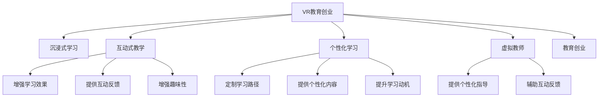

                 

# 虚拟现实教育创业：沉浸式学习体验

> 关键词：虚拟现实, 教育创业, 沉浸式学习, 学习体验, 交互式教学, 技术融合, 个性化学习

## 1. 背景介绍

### 1.1 问题由来
随着科技的飞速发展，虚拟现实(VR)技术日渐成熟，其在教育领域的应用也引起了广泛关注。传统教育模式通常以教师讲解、黑板讲授为主，难以提供丰富的学习体验和互动反馈。而虚拟现实技术通过创建沉浸式学习环境，结合多种感官刺激，可以实现更加生动、灵活和个性化的教育效果。特别是在教育创业领域，VR教育公司纷纷涌现，通过技术创新和商业模式创新，试图重塑教育行业的面貌。

### 1.2 问题核心关键点
VR教育创业的核心在于如何利用虚拟现实技术，创造沉浸式学习体验，提升学习效果。这涉及到以下几个关键点：

- **技术实现**：如何将虚拟现实与教育内容有效结合，实现互动教学。
- **学习体验**：如何通过沉浸式环境，激发学生的学习兴趣和动力。
- **个性化教育**：如何根据学生的个性化需求，定制学习内容和方法。
- **互动反馈**：如何设计有效的互动反馈机制，帮助学生及时掌握知识点。
- **规模化推广**：如何克服技术、成本等障碍，实现教育服务的普及和推广。

### 1.3 问题研究意义
研究VR教育创业，对于推动教育领域的数字化转型，提升教育质量，具有重要意义：

1. **创新教育形式**：通过虚拟现实技术，教育者可以突破传统课堂的物理限制，创建更多元化的学习环境，激发学生的学习兴趣。
2. **提高学习效果**：沉浸式学习体验能够更好地促进知识的吸收和理解，提升学生的学习效果。
3. **个性化教育**：虚拟现实技术能够提供丰富的互动和反馈，帮助教育者实现个性化教学，因材施教。
4. **促进教育公平**：虚拟现实技术的广泛应用，可以弥补地域、资源等方面的教育差距，促进教育公平。
5. **推动产业创新**：教育创业公司通过技术创新和商业模式创新，推动教育产业的持续发展。

## 2. 核心概念与联系

### 2.1 核心概念概述

为了更好地理解VR教育创业，本节将介绍几个密切相关的核心概念：

- **虚拟现实(VR)**：通过虚拟现实设备（如头戴式显示器、手柄、体感设备等），模拟出一个三维虚拟空间，用户可以通过头部和手部的运动，在虚拟环境中进行互动。
- **沉浸式学习**：通过虚拟现实技术，创造一个完全沉浸式的学习环境，学生可以身临其境地感受和体验学习内容，增强学习效果。
- **互动式教学**：通过虚拟现实环境，学生能够与教师、同学、虚拟角色等进行互动交流，增强学习的互动性和趣味性。
- **个性化学习**：通过虚拟现实技术，能够根据学生的个体差异和学习进度，提供个性化的学习路径和内容。
- **虚拟教师**：利用虚拟现实技术，创建虚拟教师，提供个性化指导和互动反馈，辅助教学。
- **教育创业**：教育创业者通过技术创新和商业模式创新，开发基于虚拟现实的教育产品或服务，推动教育产业的发展。

这些核心概念之间的逻辑关系可以通过以下Mermaid流程图来展示：



这个流程图展示了几大核心概念及其之间的关系：

1. VR教育创业利用虚拟现实技术，创造沉浸式学习环境。
2. 沉浸式学习通过丰富的感官刺激，增强学习效果和趣味性。
3. 互动式教学提供互动反馈，提升学习的参与度和理解度。
4. 个性化学习通过定制学习路径和内容，满足学生的个性化需求。
5. 虚拟教师通过虚拟角色提供个性化指导和互动反馈，辅助教学。

这些概念共同构成了VR教育创业的技术基础和教育模式，使其能够在教育领域发挥巨大的潜力。

## 3. 核心算法原理 & 具体操作步骤
### 3.1 算法原理概述

VR教育创业的核心算法原理主要基于虚拟现实技术和沉浸式学习理论，通过创建一个高度仿真的学习环境，结合互动式教学和个性化学习的方法，实现教育目标。

形式化地，假设VR教育创业的任务是创建一个名为EduVR的教育平台，其中包含多个学习模块，每个模块对应一个具体的知识领域。平台通过虚拟现实技术，将学习者置于一个虚拟的三维空间中，提供互动式教学和个性化学习体验。平台的学习模块由多个虚拟教师和虚拟内容组成，每个模块的学习路径和内容都是个性化的，以适应不同学习者的需求。

VR教育创业的算法原理可以概括为以下几个步骤：

1. **内容设计**：设计每个学习模块的内容和互动方式，确保学习目标清晰明确。
2. **环境构建**：利用虚拟现实技术，创建沉浸式的学习环境，包括场景、角色、交互元素等。
3. **互动教学**：通过虚拟教师和互动元素，提供个性化的教学指导和反馈。
4. **评估反馈**：收集学习者的反馈和表现，及时调整教学内容和策略。
5. **个性化定制**：根据学习者的学习进度和兴趣，定制个性化的学习路径和内容。
6. **技术融合**：将虚拟现实技术与AI、大数据等技术融合，提升教学效果和学习体验。

### 3.2 算法步骤详解

基于虚拟现实技术的VR教育创业，通常包括以下几个关键步骤：

**Step 1: 内容设计**

- **知识领域划分**：将教育内容划分为多个知识领域，每个领域包含相关的知识点和技能。
- **互动方式设计**：为每个知识点设计互动式教学活动，如角色扮演、虚拟实验、虚拟讨论等。
- **学习目标设定**：为每个互动活动设定明确的学习目标和评估标准。

**Step 2: 环境构建**

- **虚拟场景设计**：利用虚拟现实技术，设计逼真的学习场景，如实验室、课堂、工厂等。
- **虚拟角色设计**：创建虚拟教师、虚拟同学、虚拟物品等角色，增强互动性和沉浸感。
- **互动元素设计**：设计可操作的互动元素，如按钮、控制器等，方便学习者进行互动操作。

**Step 3: 互动教学**

- **虚拟教师引导**：虚拟教师引导学习者完成互动活动，提供即时反馈和指导。
- **互动元素应用**：学习者通过操作互动元素，完成学习任务，获取知识点。
- **个性化路径**：根据学习者的表现和兴趣，调整学习路径和内容，实现个性化学习。

**Step 4: 评估反馈**

- **数据收集**：收集学习者的互动数据、学习进度、评估结果等。
- **分析评估**：分析学习者的表现，评估学习效果，识别学习瓶颈。
- **反馈调整**：根据评估结果，调整教学策略和互动方式，提升学习效果。

**Step 5: 技术融合**

- **AI辅助教学**：利用AI技术，提供智能化的教学建议和个性化的指导。
- **大数据分析**：利用大数据技术，分析学习者的行为数据，优化学习路径和内容。
- **互动分析**：利用自然语言处理、计算机视觉等技术，分析学习者的互动数据，提升教学质量。

### 3.3 算法优缺点

VR教育创业利用虚拟现实技术，创造沉浸式学习体验，具有以下优点：

1. **增强学习效果**：沉浸式学习环境能够提供丰富的感官刺激，增强学习效果和理解度。
2. **提升学习动机**：互动式教学能够增强学习的趣味性和参与度，提升学习动机。
3. **个性化教学**：个性化学习路径和内容，能够满足不同学习者的需求，因材施教。
4. **促进教育公平**：虚拟现实技术能够弥补地域、资源等方面的教育差距，促进教育公平。

同时，VR教育创业也存在以下局限性：

1. **技术复杂度**：虚拟现实技术的应用需要较高的技术水平和硬件支持，开发成本较高。
2. **学习环境限制**：虚拟现实设备的使用需要特定的环境，如专用头显、手柄等，限制了使用范围。
3. **互动体验限制**：虚拟现实设备的限制，可能导致互动体验的局限性，影响学习效果。
4. **数据隐私问题**：虚拟现实设备收集大量用户数据，数据隐私和安全问题需引起重视。

尽管存在这些局限性，但就目前而言，VR教育创业在教育领域的潜力巨大，将在未来的教育产业中发挥重要作用。

### 3.4 算法应用领域

VR教育创业的应用领域非常广泛，涵盖了从基础教育到高等教育的各个阶段，以及多个学科领域。以下是几个典型的应用场景：

- **K-12教育**：利用虚拟现实技术，创建沉浸式课堂环境，提高学生的学习兴趣和效果。
- **高等教育**：通过虚拟实验室、虚拟博物馆等，提供丰富的实验和实践机会，增强学生的实践能力。
- **职业教育**：利用虚拟现实技术，创建虚拟工作场景，进行技能培训和岗位演练，提升职业技能。
- **继续教育**：提供虚拟现实教育资源，满足成人教育和终身学习的需求。
- **语言学习**：利用虚拟现实技术，创建沉浸式语言学习环境，增强语言学习效果。

除了这些常见的应用场景外，VR教育创业还可以拓展到更多领域，如远程教育、心理辅导、医疗健康等，为不同人群提供多样化的教育体验。

## 4. 数学模型和公式 & 详细讲解 & 举例说明

### 4.1 数学模型构建

本节将使用数学语言对VR教育创业的过程进行更加严格的刻画。

假设VR教育创业的任务是创建一个名为EduVR的教育平台，其中包含多个学习模块，每个模块对应一个具体的知识领域。平台通过虚拟现实技术，将学习者置于一个虚拟的三维空间中，提供互动式教学和个性化学习体验。

定义学习者集合 $L=\{l_1,l_2,...,l_n\}$，每个学习者 $l_i$ 有一个学习进度 $p_i$，初始值设为0。定义知识领域集合 $K=\{k_1,k_2,...,k_m\}$，每个知识领域 $k_j$ 有一个学习目标 $t_j$，表示学习者需要掌握的知识点。

定义虚拟教师集合 $T=\{t_1,t_2,...,t_n\}$，每个虚拟教师 $t_i$ 有一个指导策略 $s_i$，表示如何引导学习者完成互动活动。定义互动元素集合 $I=\{i_1,i_2,...,i_m\}$，每个互动元素 $i_j$ 有一个互动方式 $w_j$，表示如何与学习者进行互动。

VR教育创业的数学模型可以表示为：

$$
\begin{aligned}
\min_{p_i,t_j,s_i,w_j} & \sum_{i=1}^n \sum_{j=1}^m c_{ij}(p_i - t_j)^2 \\
\text{s.t.} & \quad p_i = p_i^{(0)} + \sum_{j=1}^m \alpha_{ij} \times \Delta t_j \\
& \quad t_j = t_j^{(0)} + \sum_{i=1}^n \beta_{ij} \times \Delta p_i \\
& \quad p_i \geq 0 \\
& \quad t_j \geq 0 \\
& \quad \Delta p_i \geq 0 \\
& \quad \Delta t_j \geq 0 \\
\end{aligned}
$$

其中，$c_{ij}$ 为每个学习者与知识领域的权重系数，$\alpha_{ij}$ 和 $\beta_{ij}$ 分别为学习者和知识领域的调整系数，$\Delta t_j$ 和 $\Delta p_i$ 分别为知识领域的学习进度和调整量。

### 4.2 公式推导过程

以下我们以一个具体的学习模块为例，推导互动教学的数学模型。

假设学习者 $l_i$ 正在学习知识领域 $k_j$，虚拟教师 $t_i$ 通过互动元素 $i_j$ 引导学习者完成任务，其数学模型可以表示为：

$$
\begin{aligned}
\min_{p_i,t_j,s_i,w_j} & \sum_{i=1}^n \sum_{j=1}^m c_{ij}(p_i - t_j)^2 \\
\text{s.t.} & \quad p_i = p_i^{(0)} + \sum_{j=1}^m \alpha_{ij} \times \Delta t_j \\
& \quad t_j = t_j^{(0)} + \sum_{i=1}^n \beta_{ij} \times \Delta p_i \\
& \quad p_i \geq 0 \\
& \quad t_j \geq 0 \\
& \quad \Delta p_i \geq 0 \\
& \quad \Delta t_j \geq 0 \\
& \quad \Delta t_j = \mathbb{I}(\text{互动成功}) \times \Delta p_i \\
& \quad \Delta p_i = s_i(w_j) \\
\end{aligned}
$$

其中，$\Delta t_j = \mathbb{I}(\text{互动成功}) \times \Delta p_i$ 表示互动成功时，知识领域的学习进度增加，$w_j$ 表示互动方式，$s_i(w_j)$ 表示虚拟教师根据互动方式提供的指导策略。

通过求解上述优化问题，可以计算出每个学习者的学习进度 $p_i$ 和每个知识领域的学习目标 $t_j$，从而实现个性化教学。

### 4.3 案例分析与讲解

假设VR教育创业的任务是创建一个虚拟实验室，用于进行化学实验教学。学习者可以通过虚拟实验室进行实验操作，虚拟教师通过语音和视觉反馈，指导学习者完成实验任务。

1. **内容设计**：将化学实验分为多个模块，每个模块对应一个化学知识点。设计实验操作、实验数据处理等互动活动。
2. **环境构建**：利用虚拟现实技术，创建逼真的化学实验室场景，包含实验台、化学试剂、虚拟教师等角色。
3. **互动教学**：学习者通过虚拟实验室进行实验操作，虚拟教师根据操作情况，提供语音和视觉反馈，指导学习者完成实验任务。
4. **评估反馈**：通过虚拟教师的反馈和测试结果，收集学习者的互动数据，评估学习效果。
5. **个性化定制**：根据学习者的实验操作情况，调整实验路径和内容，实现个性化学习。

通过虚拟实验室的教学实践，学习者能够亲身体验化学实验的全过程，增强对化学知识的理解和掌握。

## 5. 项目实践：代码实例和详细解释说明

### 5.1 开发环境搭建

在进行VR教育创业的开发前，我们需要准备好开发环境。以下是使用Unity和C#进行虚拟现实开发的环境配置流程：

1. 安装Unity引擎：从官网下载并安装Unity，选择适合自己设备（如PC、Mac、iOS、Android等）的版本。
2. 安装VR开发插件：根据使用的VR设备（如HTC Vive、Oculus Rift等），安装对应的VR开发插件，如SteamVR、UnityVR等。
3. 创建虚拟实验室项目：在Unity中创建一个新的项目，选择VR开发模式，并设置项目参数。
4. 编写C#脚本：使用C#编写交互逻辑和算法实现，实现虚拟实验室的各项功能。
5. 调试和测试：在Unity编辑器中进行调试，确保虚拟实验室的各项功能正常运行。
6. 打包发布：在Unity中生成VR应用的安装包，支持不同平台和设备的运行。

完成上述步骤后，即可在Unity环境中开始虚拟实验室的开发。

### 5.2 源代码详细实现

下面我们以虚拟实验室为例，给出使用Unity和C#进行VR教育创业的代码实现。

首先，创建虚拟实验室的场景：

```csharp
using UnityEngine;
using UnityEngine.XR.Interaction.Toolkit;

public class LabScene : MonoBehaviour
{
    public GameObject[] labs;
    public GameObject[] vrlabs;
    public GameObject[] labTeachers;

    public void Start()
    {
        for (int i = 0; i < labs.Length; i++)
        {
            if (i % 2 == 0)
            {
                labs[i].SetActive(true);
                vrlabs[i].SetActive(true);
                labTeachers[i].SetActive(true);
            }
            else
            {
                labs[i].SetActive(false);
                vrlabs[i].SetActive(false);
                labTeachers[i].SetActive(false);
            }
        }
    }
}
```

然后，创建虚拟实验室的互动元素：

```csharp
using UnityEngine;
using UnityEngine.XR.Interaction.Toolkit;

public class LabInteractions : MonoBehaviour
{
    public InputSystem.KineticGrip grip;
    public InputSystem.KineticGrip handGrip;

    public void OnGripGrabbed(KineticGrip grabbed)
    {
        grabbed.heldObject = handGrip;
        handGrip.CheckForExtensionRelease();
    }

    public void OnGripReleased(KineticGrip released)
    {
        handGrip.heldObject = null;
        handGrip.CheckForExtensionRelease();
    }
}
```

接着，创建虚拟实验室的虚拟教师：

```csharp
using UnityEngine;
using UnityEngine.XR.Interaction.Toolkit;

public class LabTeacher : MonoBehaviour
{
    public GameObject[] labTeachers;

    public void Start()
    {
        for (int i = 0; i < labTeachers.Length; i++)
        {
            if (i % 2 == 0)
            {
                labTeachers[i].SetActive(true);
            }
            else
            {
                labTeachers[i].SetActive(false);
            }
        }
    }
}
```

最后，启动虚拟实验室：

```csharp
using UnityEngine;
using UnityEngine.XR.Interaction.Toolkit;

public class LabLauncher : MonoBehaviour
{
    public GameObject lab;
    public GameObject[] labs;

    public void OnClick()
    {
        for (int i = 0; i < labs.Length; i++)
        {
            if (i % 2 == 0)
            {
                labs[i].SetActive(true);
            }
            else
            {
                labs[i].SetActive(false);
            }
        }
    }
}
```

以上就是使用Unity和C#对虚拟实验室进行VR教育创业的完整代码实现。可以看到，通过Unity的强大渲染能力和C#的灵活编程，能够快速实现虚拟实验室的各项功能，提升学习体验和互动效果。

### 5.3 代码解读与分析

让我们再详细解读一下关键代码的实现细节：

**LabScene类**：
- `Start`方法：在场景加载时，根据设备类型（如PC、VR等），显示或隐藏实验室和虚拟实验室。
- `labs`、`vrlabs`和`labTeachers`变量：用于存储实验场景、虚拟实验室和虚拟教师的引用，实现交互切换。

**LabInteractions类**：
- `OnGripGrabbed`和`OnGripReleased`方法：处理虚拟实验室中的抓握交互，实现实验操作。
- `grip`和`handGrip`变量：用于处理虚拟实验室中的手部交互，实现手部操作。

**LabTeacher类**：
- `Start`方法：在场景加载时，根据设备类型（如PC、VR等），显示或隐藏虚拟教师。
- `labTeachers`变量：用于存储虚拟教师的引用，实现教师交互。

**LabLauncher类**：
- `OnClick`方法：点击启动按钮时，根据设备类型（如PC、VR等），显示或隐藏实验场景和虚拟实验室。
- `labs`变量：用于存储实验场景的引用，实现场景切换。

这些代码展示了Unity和C#在虚拟实验室开发中的应用。通过这些代码，可以实现虚拟实验室的各项功能，提升学习者的互动体验。

## 6. 实际应用场景
### 6.1 智能交互学习平台

智能交互学习平台（如EdTech VR）利用虚拟现实技术，提供沉浸式学习体验。平台通过虚拟教师和互动元素，实现个性化教学和实时反馈，提升学习效果。

在技术实现上，平台支持多种互动教学方式，如角色扮演、虚拟实验、虚拟讨论等。学习者可以自由选择互动方式，进行个性化学习。平台还提供实时评估和反馈，帮助学习者及时掌握知识点。此外，平台还支持大规模部署，通过云计算技术，实现数据和服务的共享。

### 6.2 虚拟实验室

虚拟实验室（如LabXVR）通过虚拟现实技术，创建逼真的实验环境，进行各类实验教学。学习者可以通过虚拟实验室进行实验操作，获取实验数据和结果。虚拟实验室还支持远程协作和虚拟教师指导，帮助学习者解决实验难题。

在技术实现上，虚拟实验室支持多种实验设备和实验材料，学习者可以通过虚拟手柄和控制器进行操作。虚拟教师可以通过语音和视觉反馈，指导学习者完成实验任务。实验数据和结果可以实时记录和展示，帮助学习者进行实验分析和报告撰写。

### 6.3 虚拟博物馆

虚拟博物馆（如MuseumVR）通过虚拟现实技术，创建逼真的博物馆环境，进行历史文化教育。学习者可以通过虚拟博物馆进行虚拟参观，了解历史文化知识。虚拟博物馆还支持互动讲解和虚拟导览，帮助学习者更好地理解和记忆历史文化。

在技术实现上，虚拟博物馆支持多种展示方式，如3D模型、虚拟文物等。学习者可以通过虚拟导览器进行参观，获取历史文化知识。虚拟导览器还可以通过语音和视觉反馈，提供互动讲解，帮助学习者更好地理解和记忆历史文化。

### 6.4 未来应用展望

随着虚拟现实技术的不断发展，VR教育创业将在教育领域发挥越来越重要的作用。未来的VR教育创业将更加注重以下几个方面：

1. **沉浸式体验**：通过更加逼真的虚拟场景和互动方式，提升学习者的沉浸感和互动体验。
2. **个性化学习**：利用AI和大数据技术，实现个性化教学和个性化学习路径，满足不同学习者的需求。
3. **实时反馈**：通过实时评估和反馈，帮助学习者及时掌握知识点，提升学习效果。
4. **互动协作**：支持远程协作和虚拟教师指导，增强学习者的合作和互动能力。
5. **大规模部署**：利用云计算和大数据技术，实现数据和服务的共享，支持大规模教育服务的部署。

总之，VR教育创业将为教育领域带来革命性的变革，提升教育质量和效率，促进教育公平和创新。

## 7. 工具和资源推荐
### 7.1 学习资源推荐

为了帮助开发者系统掌握VR教育创业的理论基础和实践技巧，这里推荐一些优质的学习资源：

1. **Unity官方文档**：Unity引擎的官方文档，提供了大量VR开发的技术细节和实例代码。
2. **VR教育创业白皮书**：EdTech VR公司发布的白皮书，详细介绍了VR教育创业的商业模式和应用场景。
3. **VR教育创业案例分析**：包含多个VR教育创业的案例分析，展示不同领域的实际应用效果。
4. **VR教育创业课程**：Coursera等在线课程平台提供的多门VR教育创业课程，涵盖虚拟现实技术、教育心理学、商业模式等多个方面。
5. **VR教育创业研究论文**：近年来发表的多篇VR教育创业的研究论文，展示了前沿技术和研究方向。

通过对这些资源的学习实践，相信你一定能够快速掌握VR教育创业的精髓，并用于解决实际的VR教育问题。
### 7.2 开发工具推荐

高效的开发离不开优秀的工具支持。以下是几款用于VR教育创业开发的常用工具：

1. **Unity引擎**：广泛使用的VR开发引擎，提供丰富的虚拟现实开发功能。
2. **C#编程语言**：Unity的主要编程语言，提供强大的编程能力和灵活性。
3. **SteamVR和UnityVR插件**：支持Steam VR和Unity VR设备的开发，提供丰富的VR设备支持。
4. **VR资源库**：如ModelBox、VR资源网等，提供大量高质量的VR资源和素材，帮助开发者快速开发。
5. **VR分析工具**：如Unity Analytics、Google Analytics等，提供VR应用的数据分析功能，帮助开发者优化产品。

合理利用这些工具，可以显著提升VR教育创业的开发效率，加快创新迭代的步伐。

### 7.3 相关论文推荐

VR教育创业的应用领域非常广泛，涉及教育技术、虚拟现实、人工智能等多个学科。以下是几篇奠基性的相关论文，推荐阅读：

1. **Virtual Reality in Education: A Meta-analysis of Its Impact on Student Outcomes**：详细分析了虚拟现实在教育中的应用效果，展示了其对学生学习效果的影响。
2. **Personalized Learning in Virtual Reality: A Review**：总结了虚拟现实技术在个性化学习中的应用，展示了其对个性化学习路径和内容的影响。
3. **Virtual Reality-Based Science Education: A Review and Meta-analysis**：分析了虚拟现实技术在科学教育中的应用，展示了其对科学知识掌握的影响。
4. **Virtual Reality for Educational Intervention**：介绍了虚拟现实技术在教育干预中的应用，展示了其对学习效果和心理影响的效果。
5. **Interactive Learning with Virtual Reality: A Review and Future Directions**：总结了虚拟现实技术在互动学习中的应用，展示了其对学习动机和参与度的影响。

这些论文代表了大语言模型微调技术的发展脉络。通过学习这些前沿成果，可以帮助研究者把握学科前进方向，激发更多的创新灵感。

## 8. 总结：未来发展趋势与挑战
### 8.1 总结

本文对VR教育创业进行了全面系统的介绍。首先阐述了VR教育创业的研究背景和意义，明确了虚拟现实技术在教育领域的应用价值。其次，从原理到实践，详细讲解了VR教育创业的算法原理和具体操作步骤，给出了VR教育创业的代码实例。同时，本文还探讨了VR教育创业在多个实际应用场景中的应用前景，展示了VR教育创业的潜力。

通过本文的系统梳理，可以看到，VR教育创业正在成为教育领域的一个重要方向，将为教育产业带来革命性的变革。随着虚拟现实技术的不断发展，VR教育创业必将在未来的教育产业中发挥重要作用，推动教育质量和效率的提升，促进教育公平和创新。

### 8.2 未来发展趋势

展望未来，VR教育创业将在教育领域继续发展，呈现以下几个趋势：

1. **技术进步**：虚拟现实技术将不断进步，提供更加逼真、丰富的学习体验。
2. **应用拓展**：VR教育创业将覆盖更多教育场景，如基础教育、高等教育、职业教育等。
3. **互动增强**：虚拟现实设备将更加普及，支持更多的互动方式和交互元素。
4. **个性化教学**：利用AI和大数据技术，实现更加个性化的教学和评估。
5. **实时反馈**：提供实时评估和反馈，帮助学习者及时掌握知识点。
6. **大规模部署**：利用云计算和大数据技术，实现数据和服务的共享，支持大规模教育服务的部署。

### 8.3 面临的挑战

尽管VR教育创业具有巨大的发展潜力，但在实际应用中也面临诸多挑战：

1. **技术复杂度**：虚拟现实技术的应用需要较高的技术水平和硬件支持，开发成本较高。
2. **设备限制**：虚拟现实设备的使用需要特定的环境，如专用头显、手柄等，限制了使用范围。
3. **互动体验限制**：虚拟现实设备的限制，可能导致互动体验的局限性，影响学习效果。
4. **数据隐私问题**：虚拟现实设备收集大量用户数据，数据隐私和安全问题需引起重视。
5. **内容质量**：高质量的虚拟现实内容开发和制作，需要投入大量时间和成本。

尽管存在这些挑战，但就目前而言，VR教育创业在教育领域的潜力巨大，将在未来的教育产业中发挥重要作用。

### 8.4 研究展望

面对VR教育创业所面临的种种挑战，未来的研究需要在以下几个方面寻求新的突破：

1. **技术简化**：开发更加简便易用的VR开发工具，降低开发门槛，推广VR教育创业。
2. **设备优化**：开发更轻便、便捷的VR设备，降低设备成本和使用难度。
3. **互动优化**：设计更多互动方式和交互元素，提升虚拟实验室和虚拟博物馆的互动体验。
4. **内容优化**：开发高质量的虚拟现实内容，提升学习者的学习效果和体验。
5. **隐私保护**：设计隐私保护机制，确保用户数据的安全和隐私。

这些研究方向将推动VR教育创业的持续发展，为教育产业带来更多创新和突破。

## 9. 附录：常见问题与解答

**Q1：VR教育创业是否适用于所有教育场景？**

A: VR教育创业适用于多种教育场景，特别是需要沉浸式学习体验和互动教学的领域。如基础教育、高等教育、职业教育、继续教育等，都可以通过VR教育创业进行教学创新。但对于一些需要物理实验和实际操作的学科，如物理、化学、生物等，仍然需要结合传统教育方式，以确保教学效果。

**Q2：如何降低VR教育创业的成本？**

A: 降低VR教育创业的成本，可以从以下几个方面入手：
1. **设备优化**：开发更加轻便、便捷的VR设备，降低设备成本和使用难度。
2. **内容共享**：利用云计算和大数据技术，实现虚拟现实内容的共享和复用，减少内容开发的成本。
3. **技术简化**：开发更加简便易用的VR开发工具，降低开发门槛，推广VR教育创业。
4. **商业合作**：与学校、教育机构等进行商业合作，共享资源和成本，降低创业风险。

**Q3：VR教育创业是否存在数据隐私问题？**

A: 是的，VR教育创业可能存在数据隐私问题。虚拟现实设备收集大量用户数据，包括位置信息、互动行为等，需加强数据保护和隐私管理。可以采取以下措施：
1. **数据加密**：对收集的数据进行加密处理，防止数据泄露。
2. **用户授权**：在使用数据前，获取用户授权，告知用户数据用途。
3. **匿名处理**：对用户数据进行匿名处理，防止个人隐私被泄露。
4. **安全监控**：加强数据安全监控，及时发现和处理数据泄露事件。

**Q4：VR教育创业的互动体验如何提升？**

A: 提升VR教育创业的互动体验，可以从以下几个方面入手：
1. **设计更多的互动方式**：设计更多互动方式和交互元素，增强虚拟实验室和虚拟博物馆的互动体验。
2. **优化虚拟教师**：通过AI和大数据技术，优化虚拟教师的指导策略，提升教学效果。
3. **增强沉浸感**：利用虚拟现实技术，创建逼真的学习环境，增强学习者的沉浸感和互动体验。
4. **支持远程协作**：支持远程协作和虚拟教师指导，增强学习者的合作和互动能力。

**Q5：VR教育创业的规模化推广有何策略？**

A: 实现VR教育创业的规模化推广，可以从以下几个方面入手：
1. **降低设备成本**：开发更加轻便、便捷的VR设备，降低设备成本和使用难度。
2. **优化互动体验**：设计更多的互动方式和交互元素，提升虚拟实验室和虚拟博物馆的互动体验。
3. **增强用户粘性**：通过个性化教学和实时反馈，增强用户粘性，提高用户满意度和忠诚度。
4. **拓展市场渠道**：通过线上线下多种渠道进行市场推广，扩大用户覆盖面。
5. **引入商业合作**：与学校、教育机构等进行商业合作，共享资源和成本，降低创业风险。

总之，VR教育创业的规模化推广需要从设备、内容、互动体验等多个方面进行全面优化，方能实现广泛的推广和应用。

---

作者：禅与计算机程序设计艺术 / Zen and the Art of Computer Programming

