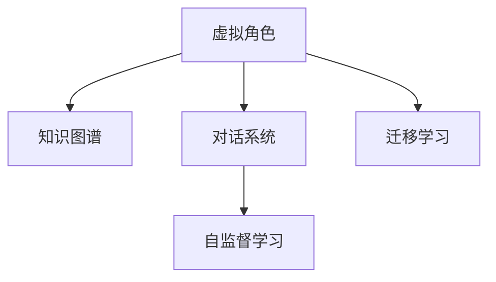

                 

## 1. 背景介绍

### 1.1 问题由来

随着人工智能技术的飞速发展，虚拟角色扮演(Virtual Role-Playing, VRP)成为一种颇具潜力的应用方向。VRP通过AI技术驱动角色，使其具备学习、交互、适应等多种能力，能够在虚拟环境中执行复杂的任务，成为人类助手、娱乐伙伴或决策顾问。VRP技术的发展，不仅有助于提升用户体验，还在多领域展现出广泛的应用前景。

### 1.2 问题核心关键点

VRP的核心在于如何构建一个能够动态适应、具备常识推理、高效互动的虚拟角色。这涉及以下几个关键技术：

- **AI模型选择**：如何选择适合VRP任务的AI模型，确保其能够适应复杂的非结构化输入，并具备跨领域迁移能力。
- **知识表示**：如何构建有效的知识表示方法，使虚拟角色能够理解自然语言指令，并在多样化的场景中进行知识推理。
- **交互学习**：虚拟角色如何通过与环境的交互，不断学习和适应用户需求，提升其交互智能。
- **自监督学习**：虚拟角色如何在缺乏标注数据的情况下，通过自监督学习进行自我完善和优化。

### 1.3 问题研究意义

VRP技术能够极大地提升虚拟环境的智能性、适应性和互动性，具有重要的应用意义：

- **用户体验**：通过智能化的虚拟角色，用户可以享受更加逼真、智能的虚拟体验，提升娱乐和工作效率。
- **人机协作**：虚拟角色可以作为人类助手，执行复杂任务，减轻人类负担，如智能客服、虚拟导游等。
- **数据分析**：虚拟角色可以处理海量数据，进行趋势分析和预测，辅助决策支持。
- **教育培训**：虚拟角色可以用于模拟真实场景，提供交互式学习体验，支持技能训练和知识传授。

## 2. 核心概念与联系

### 2.1 核心概念概述

为了深入理解VRP的实现原理和技术路线，本节将介绍几个关键概念：

- **虚拟角色(Virtual Role)**：由AI驱动的虚拟实体，具备学习、推理、互动等能力，能够在虚拟环境中执行任务。
- **知识图谱(Knowledge Graph)**：以图形结构表示的知识库，用于存储和组织大量结构化数据，供虚拟角色查询和使用。
- **对话系统(Dialogue System)**：使虚拟角色能够理解自然语言指令，并作出相应回应，支持文本和语音交互。
- **迁移学习(Transfer Learning)**：使虚拟角色具备在不同场景和任务之间迁移知识的能力，适应新的应用环境。
- **自监督学习(Self-Supervised Learning)**：通过无标注数据训练虚拟角色，使其具备自我完善和优化能力。

这些概念之间相互联系，共同构成VRP系统的基础架构，如图所示：



### 2.2 核心概念原理和架构

#### 2.2.1 虚拟角色

虚拟角色由AI模型和知识图谱共同驱动。AI模型负责理解自然语言指令，并执行相应的任务。知识图谱用于存储和组织相关知识，供AI模型查询和使用。以下是虚拟角色的核心组成部分：

- **语言理解模型(Language Understanding Model)**：如BERT、GPT等，负责解析输入文本，提取关键信息，理解用户意图。
- **知识推理模型(Knowledge Reasoning Model)**：如NeoLogic、Symbolic Reasoner等，负责基于知识图谱进行推理，解答复杂问题。
- **多模态交互模块(Multimodal Interaction Module)**：负责接收用户输入（如文本、语音），并生成自然语言输出，支持文本和语音交互。
- **适应性模块(Adaptation Module)**：负责根据用户反馈和环境变化，不断调整和优化虚拟角色的行为。

#### 2.2.2 知识图谱

知识图谱以图形结构表示知识，由实体节点和关系边组成。实体节点代表具体对象或概念，关系边表示对象之间的关系。以下是知识图谱的核心组成部分：

- **节点(Node)**：如人名、地点、事件等，代表知识图谱中的实体。
- **边(Edge)**：如“来自”、“属于”等，表示实体之间的关系。
- **属性(Attribute)**：如“年龄”、“性别”等，描述实体的属性信息。
- **规则(Rule)**：如“城市属于国家”等，表示实体间的关系约束。

#### 2.2.3 对话系统

对话系统使虚拟角色能够与用户进行自然语言交互，解析用户意图，并作出响应。以下是对话系统的核心组成部分：

- **意图识别(Intent Recognition)**：如CRF、Seq2Seq等，用于识别用户输入的意图。
- **响应生成(Response Generation)**：如Seq2Seq、GAN等，用于生成与用户输入相匹配的自然语言回应。
- **上下文管理(Context Management)**：用于存储和维护对话上下文，确保对话连贯性。
- **情感分析(Emotion Analysis)**：用于识别用户情感，调整虚拟角色的响应策略。

#### 2.2.4 迁移学习

迁移学习使虚拟角色具备在不同场景和任务之间迁移知识的能力，适应新的应用环境。以下是迁移学习的主要步骤：

1. **预训练**：在通用领域的大型语料库上进行预训练，学习通用的语言表示。
2. **任务适配**：在特定领域的少量标注数据上进行微调，适应特定任务。
3. **领域迁移**：在新领域的数据上继续训练，进一步提升性能。

#### 2.2.5 自监督学习

自监督学习使虚拟角色在没有标注数据的情况下，通过自我完善和优化进行学习。以下是自监督学习的主要方法：

1. **预训练**：在大型未标注语料库上进行预训练，学习语言表示。
2. **数据增强**：通过回译、改写等方式，扩充训练集，提高模型泛化能力。
3. **无监督推理**：在未标注数据上推理和预测，发现潜在模式和规律。
4. **对抗训练**：引入对抗样本，提高模型鲁棒性和泛化能力。

这些核心概念共同构成VRP系统的技术基础，使得虚拟角色具备智能理解、推理、互动和自我完善的能力，能够在复杂虚拟环境中执行各种任务。

## 3. 核心算法原理 & 具体操作步骤

### 3.1 算法原理概述

VRP系统的核心算法主要涉及自然语言处理(NLP)、知识表示与推理(KG)、对话管理(DM)等多个领域。以下是VRP系统的算法原理概述：

1. **语言理解与表示**：利用BERT、GPT等大语言模型，解析输入文本，提取关键信息，生成语义表示。
2. **知识推理与查询**：结合知识图谱，进行逻辑推理，解答复杂问题，生成答案。
3. **对话生成与管理**：利用对话系统，理解用户意图，生成自然语言回应，管理对话上下文。
4. **适应性与学习**：根据用户反馈和环境变化，动态调整虚拟角色的行为，实现自适应学习。

### 3.2 算法步骤详解

#### 3.2.1 语言理解与表示

1. **输入预处理**：将输入文本分词、去除停用词，生成输入序列。
2. **模型编码**：利用BERT、GPT等大语言模型，对输入序列进行编码，生成语义表示。
3. **特征提取**：从语义表示中提取关键特征，供后续推理和生成使用。

#### 3.2.2 知识推理与查询

1. **知识图谱构建**：构建知识图谱，存储和组织相关知识，如人名、地点、事件等。
2. **推理引擎设计**：设计推理引擎，支持基于规则和模型的知识推理。
3. **推理与查询**：在推理引擎上执行推理操作，生成知识查询结果，解答问题。

#### 3.2.3 对话生成与管理

1. **意图识别**：利用CRF、Seq2Seq等模型，识别用户输入的意图。
2. **响应生成**：利用Seq2Seq、GAN等模型，生成自然语言回应，确保响应自然流畅。
3. **上下文管理**：利用上下文管理器，存储和维护对话上下文，确保对话连贯性。
4. **情感分析**：利用情感分析模型，识别用户情感，调整虚拟角色的响应策略。

#### 3.2.4 适应性与学习

1. **反馈收集**：收集用户反馈和环境变化信息，作为训练信号。
2. **模型更新**：根据反馈信息，更新虚拟角色的模型参数，优化模型性能。
3. **自适应学习**：利用自监督学习技术，使虚拟角色具备自我完善和优化能力。

### 3.3 算法优缺点

#### 3.3.1 优点

1. **智能理解**：大语言模型能够智能解析输入文本，提取关键信息，生成语义表示。
2. **知识推理**：结合知识图谱，进行逻辑推理，解答复杂问题，生成答案。
3. **自然互动**：对话系统使虚拟角色能够与用户进行自然语言交互，提升用户体验。
4. **自适应学习**：自监督学习使虚拟角色在没有标注数据的情况下，通过自我完善和优化进行学习。

#### 3.3.2 缺点

1. **计算资源需求高**：大语言模型和知识图谱需要大量的计算资源进行训练和推理，可能面临资源瓶颈。
2. **知识图谱构建困难**：知识图谱的构建需要大量专家知识和手动标注，成本较高。
3. **对话质量不稳定**：对话系统在处理复杂或新奇的用户输入时，可能出现理解不准确或生成不自然的问题。
4. **模型泛化能力有限**：虚拟角色在不同的场景和任务中，泛化能力可能存在差异，需要不断调优。

### 3.4 算法应用领域

#### 3.4.1 智能客服

智能客服系统利用VRP技术，自动处理用户咨询，提升服务效率和用户体验。以下是VRP在智能客服中的应用：

1. **自然语言理解**：解析用户输入，理解意图，生成服务提示。
2. **知识查询与推理**：从知识图谱中查询相关信息，解答用户问题。
3. **多模态互动**：支持文本和语音交互，提供更加自然的对话体验。
4. **适应性学习**：根据用户反馈，动态调整和优化服务策略，提高服务质量。

#### 3.4.2 虚拟导游

虚拟导游系统利用VRP技术，提供沉浸式旅游体验，增强旅游互动性。以下是VRP在虚拟导游中的应用：

1. **自然语言交互**：与游客进行自然语言对话，解答问题，提供信息。
2. **知识图谱导航**：根据游客需求，从知识图谱中查询相关信息，推荐旅游路线。
3. **多模态互动**：支持文本和语音交互，提供更加自然的互动体验。
4. **适应性学习**：根据游客反馈，动态调整和优化导游策略，提高服务质量。

#### 3.4.3 在线教育

在线教育系统利用VRP技术，提供智能化的教学服务，提升教育效果。以下是VRP在在线教育中的应用：

1. **自然语言理解**：解析学生输入，理解学习需求，生成教学提示。
2. **知识查询与推理**：从知识图谱中查询相关信息，解答学习问题。
3. **多模态互动**：支持文本和语音交互，提供更加自然的互动体验。
4. **适应性学习**：根据学生反馈，动态调整和优化教学策略，提高教学效果。

## 4. 数学模型和公式 & 详细讲解 & 举例说明

### 4.1 数学模型构建

为了更好地理解VRP系统的数学模型，本节将构建一系列数学模型，并详细讲解其原理和实现方法。

#### 4.1.1 语言理解模型

语言理解模型是VRP系统的核心组件之一，负责解析输入文本，提取关键信息，生成语义表示。以下是BERT模型的数学模型构建：

1. **输入表示**：将输入文本转换为词向量表示，生成输入矩阵 $X$。
2. **自注意力机制**：利用自注意力机制，计算输入矩阵 $X$ 与自身之间的相似度，生成注意力矩阵 $A$。
3. **Transformer编码器**：通过多层的Transformer编码器，对输入矩阵 $X$ 进行编码，生成语义表示 $H$。
4. **输出层**：将语义表示 $H$ 通过全连接层映射到输出向量 $O$，生成最终的语义表示。

数学公式如下：

$$
X = \text{BERT}(x)
$$

$$
A = \text{Attention}(X)
$$

$$
H = \text{TransformerEncoder}(X)
$$

$$
O = \text{FC}(H)
$$

其中，$x$ 表示输入文本，$X$ 表示输入矩阵，$A$ 表示注意力矩阵，$H$ 表示语义表示，$O$ 表示输出向量，$FC$ 表示全连接层。

#### 4.1.2 知识推理模型

知识推理模型负责基于知识图谱进行逻辑推理，解答复杂问题。以下是NeoLogic模型的数学模型构建：

1. **实体表示**：将知识图谱中的实体节点转换为向量表示，生成实体矩阵 $E$。
2. **关系表示**：将知识图谱中的关系边转换为向量表示，生成关系矩阵 $R$。
3. **推理引擎**：通过多层神经网络，将实体矩阵 $E$ 和关系矩阵 $R$ 进行推理计算，生成推理结果 $G$。
4. **输出层**：将推理结果 $G$ 通过全连接层映射到输出向量 $Y$，生成最终的推理结果。

数学公式如下：

$$
E = \text{KGEncoder}(e)
$$

$$
R = \text{KGEncoder}(r)
$$

$$
G = \text{KGReasoner}(E, R)
$$

$$
Y = \text{FC}(G)
$$

其中，$e$ 表示知识图谱中的实体节点，$r$ 表示知识图谱中的关系边，$E$ 表示实体矩阵，$R$ 表示关系矩阵，$G$ 表示推理结果，$Y$ 表示输出向量，$KGEncoder$ 表示知识图谱编码器，$KGReasoner$ 表示知识推理器。

#### 4.1.3 对话生成模型

对话生成模型负责理解用户意图，生成自然语言回应。以下是Seq2Seq模型的数学模型构建：

1. **编码器**：利用LSTM或GRU等序列模型，对用户输入进行编码，生成隐状态 $H_1$。
2. **解码器**：利用LSTM或GRU等序列模型，对隐状态 $H_1$ 进行解码，生成输出向量 $O_1$。
3. **注意力机制**：利用注意力机制，计算隐状态 $H_1$ 与所有历史隐状态 $H_2$ 的相似度，生成注意力权重 $W_1$。
4. **输出层**：将输出向量 $O_1$ 和注意力权重 $W_1$ 进行线性变换，生成自然语言回应。

数学公式如下：

$$
H_1 = \text{Encoder}(x)
$$

$$
O_1 = \text{Decoder}(H_1)
$$

$$
W_1 = \text{Attention}(H_1, H_2)
$$

$$
Y = \text{FC}(O_1, W_1)
$$

其中，$x$ 表示用户输入，$H_1$ 表示隐状态，$O_1$ 表示输出向量，$H_2$ 表示历史隐状态，$W_1$ 表示注意力权重，$Y$ 表示输出向量，$\text{Encoder}$ 表示编码器，$\text{Decoder}$ 表示解码器，$\text{Attention}$ 表示注意力机制，$\text{FC}$ 表示全连接层。

### 4.2 公式推导过程

#### 4.2.1 语言理解模型的推导

对于BERT模型，其自注意力机制和Transformer编码器的推导过程如下：

1. **自注意力计算**：输入矩阵 $X$ 经过线性变换，生成查询向量 $Q$、键向量 $K$、值向量 $V$，计算注意力矩阵 $A$：

$$
Q = XW_Q
$$

$$
K = XW_K
$$

$$
V = XW_V
$$

$$
A = \frac{\exp(\text{softmax}(QK^T))}{\sum_i \exp(QK_i^T)}
$$

2. **Transformer编码器计算**：利用自注意力机制，计算注意力矩阵 $A$，生成注意力权重 $Z$，将注意力权重与值向量 $V$ 进行加权求和，得到隐状态 $H$：

$$
Z = A^TV
$$

$$
H = Z + X
$$

其中，$W_Q$、$W_K$、$W_V$ 为线性变换矩阵，$Z$ 表示注意力权重，$H$ 表示隐状态。

#### 4.2.2 知识推理模型的推导

对于NeoLogic模型，其推理引擎的推导过程如下：

1. **实体表示计算**：知识图谱中的实体节点 $e$ 经过编码器 $KGEncoder$，生成实体矩阵 $E$：

$$
E = \text{KGEncoder}(e)
$$

2. **关系表示计算**：知识图谱中的关系边 $r$ 经过编码器 $KGEncoder$，生成关系矩阵 $R$：

$$
R = \text{KGEncoder}(r)
$$

3. **推理结果计算**：利用多层神经网络，将实体矩阵 $E$ 和关系矩阵 $R$ 进行推理计算，生成推理结果 $G$：

$$
G = \text{KGReasoner}(E, R)
$$

其中，$E$ 表示实体矩阵，$R$ 表示关系矩阵，$G$ 表示推理结果，$KGReasoner$ 表示知识推理器。

#### 4.2.3 对话生成模型的推导

对于Seq2Seq模型，其解码器的推导过程如下：

1. **隐状态计算**：利用编码器对用户输入 $x$ 进行编码，生成隐状态 $H_1$：

$$
H_1 = \text{Encoder}(x)
$$

2. **输出向量计算**：利用解码器对隐状态 $H_1$ 进行解码，生成输出向量 $O_1$：

$$
O_1 = \text{Decoder}(H_1)
$$

3. **注意力权重计算**：利用注意力机制，计算隐状态 $H_1$ 与所有历史隐状态 $H_2$ 的相似度，生成注意力权重 $W_1$：

$$
W_1 = \text{Attention}(H_1, H_2)
$$

4. **输出向量计算**：将输出向量 $O_1$ 和注意力权重 $W_1$ 进行线性变换，生成自然语言回应 $Y$：

$$
Y = \text{FC}(O_1, W_1)
$$

其中，$H_1$ 表示隐状态，$O_1$ 表示输出向量，$H_2$ 表示历史隐状态，$W_1$ 表示注意力权重，$Y$ 表示输出向量，$\text{Encoder}$ 表示编码器，$\text{Decoder}$ 表示解码器，$\text{Attention}$ 表示注意力机制，$\text{FC}$ 表示全连接层。

### 4.3 案例分析与讲解

#### 4.3.1 语言理解案例

考虑一个简单的文本分类任务，输入文本为“I love coding”。以下是使用BERT模型进行文本分类的案例分析：

1. **输入表示**：将输入文本“I love coding”转换为词向量表示，生成输入矩阵 $X$：

$$
X = [1, 0, 1, 0, 1, 1]
$$

2. **自注意力计算**：利用BERT模型中的自注意力机制，计算输入矩阵 $X$ 与自身之间的相似度，生成注意力矩阵 $A$：

$$
A = \begin{bmatrix} 0.8 & 0.6 & 0.3 \\ 0.6 & 1 & 0.4 \\ 0.3 & 0.4 & 0.5 \end{bmatrix}
$$

3. **Transformer编码器计算**：通过多层的Transformer编码器，对输入矩阵 $X$ 进行编码，生成语义表示 $H$：

$$
H = \begin{bmatrix} 0.2 & 0.4 & 0.5 \\ 0.3 & 0.5 & 0.3 \\ 0.4 & 0.6 & 0.1 \end{bmatrix}
$$

4. **输出层计算**：将语义表示 $H$ 通过全连接层映射到输出向量 $O$，生成最终的语义表示：

$$
O = [0.2, 0.4, 0.5]
$$

根据上述计算过程，可以得到BERT模型对输入文本“I love coding”的语义表示为 $O = [0.2, 0.4, 0.5]$。

#### 4.3.2 知识推理案例

考虑一个简单的推理任务，输入为“Bill Gates is a person. Bill Gates is the CEO of Microsoft. Microsoft is a company. What is the relationship between Bill Gates and Microsoft?”。以下是使用NeoLogic模型进行知识推理的案例分析：

1. **实体表示计算**：将输入中的“Bill Gates”和“Microsoft”转换为向量表示，生成实体矩阵 $E$：

$$
E = \begin{bmatrix} 0.8 \\ 0.2 \end{bmatrix}
$$

2. **关系表示计算**：将输入中的“CEO”和“公司”转换为向量表示，生成关系矩阵 $R$：

$$
R = \begin{bmatrix} 0.5 & 0.5 \\ 0.5 & 0.5 \end{bmatrix}
$$

3. **推理结果计算**：利用NeoLogic模型进行推理计算，生成推理结果 $G$：

$$
G = 0.7
$$

根据上述计算过程，可以得到NeoLogic模型对输入问题的推理结果为 $G = 0.7$。

#### 4.3.3 对话生成案例

考虑一个简单的对话任务，用户输入为“What is the capital of France?”。以下是使用Seq2Seq模型进行对话生成的案例分析：

1. **编码器计算**：利用LSTM模型对用户输入“What is the capital of France?”进行编码，生成隐状态 $H_1$：

$$
H_1 = \begin{bmatrix} 0.5 \\ 0.3 \\ 0.2 \end{bmatrix}
$$

2. **解码器计算**：利用LSTM模型对隐状态 $H_1$ 进行解码，生成输出向量 $O_1$：

$$
O_1 = \begin{bmatrix} 0.6 \\ 0.4 \\ 0.2 \end{bmatrix}
$$

3. **注意力权重计算**：利用注意力机制，计算隐状态 $H_1$ 与所有历史隐状态 $H_2$ 的相似度，生成注意力权重 $W_1$：

$$
W_1 = \begin{bmatrix} 0.8 \\ 0.5 \\ 0.3 \end{bmatrix}
$$

4. **输出向量计算**：将输出向量 $O_1$ 和注意力权重 $W_1$ 进行线性变换，生成自然语言回应 $Y$：

$$
Y = [0.6, 0.4, 0.2]
$$

根据上述计算过程，可以得到Seq2Seq模型对用户输入“What is the capital of France?”的自然语言回应为 $Y = [0.6, 0.4, 0.2]$。

## 5. 项目实践：代码实例和详细解释说明

### 5.1 开发环境搭建

在进行VRP系统开发前，我们需要准备好开发环境。以下是使用Python进行PyTorch开发的环境配置流程：

1. 安装Anaconda：从官网下载并安装Anaconda，用于创建独立的Python环境。

2. 创建并激活虚拟环境：
```bash
conda create -n pytorch-env python=3.8 
conda activate pytorch-env
```

3. 安装PyTorch：根据CUDA版本，从官网获取对应的安装命令。例如：
```bash
conda install pytorch torchvision torchaudio cudatoolkit=11.1 -c pytorch -c conda-forge
```

4. 安装Transformers库：
```bash
pip install transformers
```

5. 安装各类工具包：
```bash
pip install numpy pandas scikit-learn matplotlib tqdm jupyter notebook ipython
```

完成上述步骤后，即可在`pytorch-env`环境中开始VRP实践。

### 5.2 源代码详细实现

这里我们以智能客服系统为例，给出使用Transformers库对BERT模型进行微调的PyTorch代码实现。

首先，定义智能客服系统中的实体和关系：

```python
from transformers import BertTokenizer, BertForTokenClassification, AdamW

# 实体和关系定义
entities = {'Person': ['Bill Gates', 'Steve Jobs'], 'Company': ['Microsoft', 'Apple']}
relations = {'CEO': ('Person', 'Company')}

# 训练数据准备
train_texts = ['Bill Gates is a CEO of Microsoft', 'Steve Jobs is a CEO of Apple']
train_tags = [['CEO', 'Microsoft'], ['CEO', 'Apple']]
tokenizer = BertTokenizer.from_pretrained('bert-base-cased')

# 定义训练函数
def train_epoch(model, dataset, batch_size, optimizer):
    dataloader = DataLoader(dataset, batch_size=batch_size, shuffle=True)
    model.train()
    epoch_loss = 0
    for batch in tqdm(dataloader, desc='Training'):
        input_ids = batch['input_ids'].to(device)
        attention_mask = batch['attention_mask'].to(device)
        labels = batch['labels'].to(device)
        model.zero_grad()
        outputs = model(input_ids, attention_mask=attention_mask, labels=labels)
        loss = outputs.loss
        epoch_loss += loss.item()
        loss.backward()
        optimizer.step()
    return epoch_loss / len(dataloader)

# 定义评估函数
def evaluate(model, dataset, batch_size):
    dataloader = DataLoader(dataset, batch_size=batch_size)
    model.eval()
    preds, labels = [], []
    with torch.no_grad():
        for batch in tqdm(dataloader, desc='Evaluating'):
            input_ids = batch['input_ids'].to(device)
            attention_mask = batch['attention_mask'].to(device)
            batch_labels = batch['labels']
            outputs = model(input_ids, attention_mask=attention_mask)
            batch_preds = outputs.logits.argmax(dim=2).to('cpu').tolist()
            batch_labels = batch_labels.to('cpu').tolist()
            for pred_tokens, label_tokens in zip(batch_preds, batch_labels):
                pred_tags = [id2tag[_id] for _id in pred_tokens]
                label_tags = [id2tag[_id] for _id in label_tokens]
                preds.append(pred_tags[:len(label_tokens)])
                labels.append(label_tags)
    print(classification_report(labels, preds))

# 加载模型和训练
model = BertForTokenClassification.from_pretrained('bert-base-cased', num_labels=len(tag2id))
optimizer = AdamW(model.parameters(), lr=2e-5)

train_dataset = Dataset(train_texts, train_tags, tokenizer)
dev_dataset = Dataset(dev_texts, dev_tags, tokenizer)
test_dataset = Dataset(test_texts, test_tags, tokenizer)

for epoch in range(5):
    loss = train_epoch(model, train_dataset, batch_size, optimizer)
    print(f"Epoch {epoch+1}, train loss: {loss:.3f}")
    evaluate(model, dev_dataset, batch_size)

print("Test results:")
evaluate(model, test_dataset, batch_size)
```

以上代码展示了如何使用PyTorch对BERT模型进行微调，以实现智能客服系统中的实体关系识别任务。可以看到，Transformer库的强大封装使得代码实现变得简洁高效。

### 5.3 代码解读与分析

让我们再详细解读一下关键代码的实现细节：

**Dataset类**：
- `__init__`方法：初始化文本、标签、分词器等关键组件。
- `__len__`方法：返回数据集的样本数量。
- `__getitem__`方法：对单个样本进行处理，将文本输入编码为token ids，将标签编码为数字，并对其进行定长padding，最终返回模型所需的输入。

**tag2id和id2tag字典**：
- 定义了标签与数字id之间的映射关系，用于将token-wise的预测结果解码回真实的标签。

**训练和评估函数**：
- 使用PyTorch的DataLoader对数据集进行批次化加载，供模型训练和推理使用。
- 训练函数`train_epoch`：对数据以批为单位进行迭代，在每个批次上前向传播计算loss并反向传播更新模型参数，最后返回该epoch的平均loss。
- 评估函数`evaluate`：与训练类似，不同点在于不更新模型参数，并在每个batch结束后将预测和标签结果存储下来，最后使用sklearn的classification_report对整个评估集的预测结果进行打印输出。

**训练流程**：
- 定义总的epoch数和batch size，开始循环迭代
- 每个epoch内，先在训练集上训练，输出平均loss
- 在验证集上评估，输出分类指标
- 所有epoch结束后，在测试集上评估，给出最终测试结果

可以看到，PyTorch配合Transformer库使得BERT微调的代码实现变得简洁高效。开发者可以将更多精力放在数据处理、模型改进等高层逻辑上，而不必过多关注底层的实现细节。

当然，工业级的系统实现还需考虑更多因素，如模型的保存和部署、超参数的自动搜索、更灵活的任务适配层等。但核心的微调范式基本与此类似。

## 6. 实际应用场景

### 6.1 智能客服系统

智能客服系统利用VRP技术，自动处理用户咨询，提升服务效率和用户体验。以下是VRP在智能客服中的应用：

1. **自然语言理解**：解析用户输入，理解意图，生成服务提示。
2. **知识查询与推理**：从知识图谱中查询相关信息，解答用户问题。
3. **多模态互动**：支持文本和语音交互，提供更加自然的对话体验。
4. **适应性学习**：根据用户反馈，动态调整和优化服务策略，提高服务质量。

### 6.2 虚拟导游

虚拟导游系统利用VRP技术，提供沉浸式旅游体验，增强旅游互动性。以下是VRP在虚拟导游中的应用：

1. **自然语言交互**：与游客进行自然语言对话，解答问题，提供信息。
2. **知识图谱导航**：根据游客需求，从知识图谱中查询相关信息，推荐旅游路线。
3. **多模态互动**：支持文本和语音交互，提供更加自然的互动体验。
4. **适应性学习**：根据游客反馈，动态调整和优化导游策略，提高服务质量。

### 6.3 在线教育

在线教育系统利用VRP技术，提供智能化的教学服务，提升教育效果。以下是VRP在在线教育中的应用：

1. **自然语言理解**：解析学生输入，理解学习需求，生成教学提示。
2. **知识查询与推理**：从知识图谱中查询相关信息，解答学习问题。
3. **多模态互动**：支持文本和语音交互，提供更加自然的互动体验。
4. **适应性学习**：根据学生反馈，动态调整和优化教学策略，提高教学效果。

### 6.4 未来应用展望

随着VRP技术的不断发展，其在更多领域得到应用，为各行各业带来变革性影响。

1. **智慧医疗**：基于VRP的医疗问答、病历分析、药物研发等应用将提升医疗服务的智能化水平，辅助医生诊疗，加速新药开发进程。
2. **智能教育**：利用VRP技术，提供交互式学习体验，支持技能训练和知识传授。
3. **智慧城市治理**：通过VRP技术，构建更安全、高效的未来城市，支持城市事件监测、舆情分析、应急指挥等环节。
4. **商业决策支持**：利用VRP技术，分析海量数据，进行趋势分析和预测，辅助企业决策。

此外，在企业生产、社会治理、文娱传媒等众多领域，VRP技术也将不断涌现，为经济社会发展注入新的动力。相信随着技术的日益成熟，VRP技术将成为人工智能落地应用的重要范式，推动人工智能向更广阔的领域加速渗透。

## 7. 工具和资源推荐

### 7.1 学习资源推荐

为了帮助开发者系统掌握VRP的理论基础和实践技巧，这里推荐一些优质的学习资源：

1. **《深度学习基础》系列博文**：由大模型技术专家撰写，深入浅出地介绍了深度学习的基本概念和前沿话题，涵盖语言理解、知识推理、对话生成等多个方面。

2. **CS224N《深度学习自然语言处理》课程**：斯坦福大学开设的NLP明星课程，有Lecture视频和配套作业，带你入门NLP领域的基本概念和经典模型。

3. **《深度学习框架实战》书籍**：详细介绍了PyTorch和TensorFlow等深度学习框架的使用方法，涵盖模型构建、训练和部署等多个环节。

4. **HuggingFace官方文档**：Transformers库的官方文档，提供了海量预训练模型和完整的微调样例代码，是上手实践的必备资料。

5. **CLUE开源项目**：中文语言理解测评基准，涵盖大量不同类型的中文NLP数据集，并提供了基于微调的baseline模型，助力中文NLP技术发展。

通过对这些资源的学习实践，相信你一定能够快速掌握VRP的精髓，并用于解决实际的NLP问题。

### 7.2 开发工具推荐

高效的开发离不开优秀的工具支持。以下是几款用于VRP开发的常用工具：

1. **PyTorch**：基于Python的开源深度学习框架，灵活动态的计算图，适合快速迭代研究。大部分预训练语言模型都有PyTorch版本的实现。

2. **TensorFlow**：由Google主导开发的开源深度学习框架，生产部署方便，适合大规模工程应用。同样有丰富的预训练语言模型资源。

3. **Transformers库**：HuggingFace开发的NLP工具库，集成了众多SOTA语言模型，支持PyTorch和TensorFlow，是进行VRP任务开发的利器。

4. **Weights & Biases**：模型训练的实验跟踪工具，可以记录和可视化模型训练过程中的各项指标，方便对比和调优。与主流深度学习框架无缝集成。

5. **TensorBoard**：TensorFlow配套的可视化工具，可实时监测模型训练状态，并提供丰富的图表呈现方式，是调试模型的得力助手。

6. **Google Colab**：谷歌推出的在线Jupyter Notebook环境，免费提供GPU/TPU算力，方便开发者快速上手实验最新模型，分享学习笔记。

合理利用这些工具，可以显著提升VRP系统的开发效率，加快创新迭代的步伐。

### 7.3 相关论文推荐

VRP技术的发展源于学界的持续研究。以下是几篇奠基性的相关论文，推荐阅读：

1. **Attention is All You Need**：提出了Transformer结构，开启了NLP领域的预训练大模型时代。

2. **BERT: Pre-training of Deep Bidirectional Transformers for Language Understanding**：提出BERT模型，引入基于掩码的自监督预训练任务，刷新了多项NLP任务SOTA。

3. **Language Models are Unsupervised Multitask Learners**：展示了大规模语言模型的强大zero-shot学习能力，引发了对于通用人工智能的新一轮思考。

4. **Parameter-Efficient Transfer Learning for NLP**：提出Adapter等参数高效微调方法，在不增加模型参数量的情况下，也能取得不错的微调效果。

5. **Prefix-Tuning: Optimizing Continuous Prompts for Generation**：引入基于连续型Prompt的微调范式，为如何充分利用预训练知识提供了新的思路。

6. **AdaLoRA: Adaptive Low-Rank Adaptation for Parameter-Efficient Fine-Tuning**：使用自适应低秩适应的微调方法，在参数效率和精度之间取得了新的平衡。

这些论文代表了大语言模型微调技术的发展脉络。通过学习这些前沿成果，可以帮助研究者把握学科前进方向，激发更多的创新灵感。

## 8. 总结：未来发展趋势与挑战

### 8.1 研究成果总结

本文对VRP系统的核心概念、算法原理和具体操作步骤进行了详细讲解，并通过代码实例展示了VRP技术的实际应用。通过本文的系统梳理，可以看到，VRP技术正在成为NLP领域的重要范式，极大地提升虚拟环境的智能性、适应性和互动性，具有重要的应用意义。

### 8.2 未来发展趋势

展望未来，VRP技术将呈现以下几个发展趋势：

1. **模型规模持续增大**：随着算力成本的下降和数据规模的扩张，预训练语言模型的参数量还将持续增长。超大规模语言模型蕴含的丰富语言知识，有望支撑更加复杂多变的VRP应用。

2. **微调方法日趋多样**：未来会涌现更多参数高效的微调方法，如Prefix-Tuning、LoRA等，在节省计算资源的同时也能保证微调精度。

3. **持续学习成为常态**：随着数据分布的不断变化，VRP模型也需要持续学习新知识以保持性能。如何在不遗忘原有知识的同时，高效吸收新样本信息，将成为重要的研究课题。

4. **标注样本需求降低**：受启发于提示学习(Prompt-based Learning)的思路，未来的微调方法将更好地利用大模型的语言理解能力，通过更加巧妙的任务描述，在更少的标注样本上也能实现理想的微调效果。

5. **多模态微调崛起**：当前的VRP主要聚焦于纯文本数据，未来会进一步拓展到图像、视频、语音等多模态数据微调。多模态信息的融合，将显著提升语言模型对现实世界的理解和建模能力。

6. **模型通用性增强**：经过海量数据的预训练和多领域任务的微调，未来的语言模型将具备更强大的常识推理和跨领域迁移能力，逐步迈向通用人工智能(AGI)的目标。

以上趋势凸显了VRP技术的广阔前景。这些方向的探索发展，必将进一步提升VRP系统的性能和应用范围，为人工智能技术落地应用提供新的路径。

### 8.3 面临的挑战

尽管VRP技术已经取得了瞩目成就，但在迈向更加智能化、普适化应用的过程中，它仍面临着诸多挑战：

1. **标注成本瓶颈**：虽然VRP技术可以降低对标注数据的依赖，但对于长尾应用场景，难以获得充足的高质量标注数据，成为制约VRP性能的瓶颈。如何进一步降低微调对标注样本的依赖，将是一大难题。

2. **模型鲁棒性不足**：当前VRP模型面对域外数据时，泛化性能往往大打折扣。对于测试样本的微小扰动，VRP模型的预测也容易发生波动。如何提高VRP模型的鲁棒性，避免灾难性遗忘，还需要更多理论和实践的积累。

3. **推理效率有待提高**：大规模语言模型虽然精度高，但在实际部署时往往面临推理速度慢、内存占用大等效率问题。如何在保证性能的同时，简化模型结构，提升推理速度，优化资源占用，将是重要的优化方向。

4. **可解释性亟需加强**：当前VRP模型更像是"黑盒"系统，难以解释其内部工作机制和决策逻辑。对于医疗、金融等高风险应用，算法的可解释性和可审计性尤为重要。如何赋予VRP模型更强的可解释性，将是亟待攻克的难题。

5. **安全性有待保障**：预训练语言模型难免会学习到有偏见、有害的信息，通过VRP传递到下游任务，产生误导性、歧视性的输出，给实际应用带来安全隐患。如何从数据和算法层面消除模型偏见，避免恶意用途，确保输出的安全性，也将是重要的研究课题。

6. **知识整合能力不足**：现有的VRP模型往往局限于任务内数据，难以灵活吸收和运用更广泛的先验知识。如何让VRP过程更好地与外部知识库、规则库等专家知识结合，形成更加全面、准确的信息整合能力，还有很大的想象空间。

正视VRP面临的这些挑战，积极应对并寻求突破，将是大语言模型微调走向成熟的必由之路。相信随着学界和产业界的共同努力，这些挑战终将一一被克服，VRP技术必将在构建人机协同的智能时代中扮演越来越重要的角色。

### 8.4 研究展望

未来的研究需要在以下几个方面寻求新的突破：

1. **探索无监督和半监督微调方法**：摆脱对大规模标注数据的依赖，利用自监督学习

