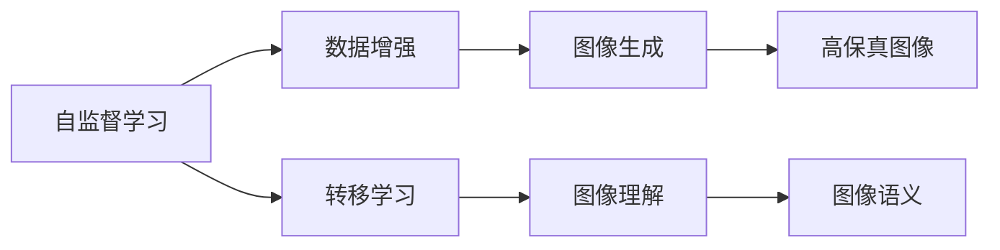

                 

# 视觉大模型:图像理解和生成新高度

## 1. 背景介绍

### 1.1 问题由来
近年来，随着深度学习技术的飞速发展，计算机视觉（Computer Vision, CV）领域取得了长足进步，尤其在图像理解和生成方面，大模型的研究进展尤为突出。图像生成和理解是大数据时代图像处理的核心技术之一，对视觉内容的自动处理、分析与生成具有重要意义。

图像生成模型，如GAN（Generative Adversarial Networks）、VQ-VAE等，可以通过训练学习到高质量的图像数据生成能力。这些模型在风格迁移、图像修复、3D重建等领域展示了强大的实力。

然而，图像生成模型依然存在一些限制：
- 生成质量有待提升。尽管模型能够生成逼真图像，但细节程度、纹理真实性等仍存在不足。
- 训练计算资源消耗大。部分模型训练过程中需要大量的计算资源和时间。
- 数据多样性不足。训练数据往往局限于特定数据集，无法泛化到多种场景。

### 1.2 问题核心关键点
针对这些问题，视觉大模型应运而生。视觉大模型（Visual Large Models, VLMs）是预训练模型在计算机视觉领域的应用，其核心思想是将大规模的视觉数据集输入深度神经网络进行自监督训练，学习到丰富的视觉语义表示。

视觉大模型具有以下特点：
- 泛化能力强。在训练过程中使用了大规模的图像数据，模型能够更好地泛化到未见过的场景。
- 参数量巨大。模型参数量通常在百亿级别，提升了模型表达能力。
- 自监督预训练。通过大量无标签数据训练，学习到图像中丰富的视觉信息。
- 少样本学习能力强。只需少量标注样本，模型即可实现高质量的图像生成与理解。

这些特点使得视觉大模型在图像生成、分类、检测、分割等任务上表现优异。本文聚焦于视觉大模型的核心概念和实践应用，帮助读者深入理解这一前沿技术的原理和潜力。

## 2. 核心概念与联系

### 2.1 核心概念概述

视觉大模型主要包括以下核心概念：

- 视觉大模型（Visual Large Models, VLMs）：指在大型数据集上进行自监督预训练的大规模神经网络模型，用于图像生成、理解等任务。
- 自监督学习（Self-Supervised Learning, SSL）：指在不使用标签数据的情况下，通过学习数据本身的结构信息进行模型训练的方法。
- 数据增强（Data Augmentation）：指对训练数据进行一系列变换，增加数据多样性，防止过拟合的方法。
- 转移学习（Transfer Learning）：指在预训练模型的基础上，通过微调学习特定任务特征的方法。
- 图像生成（Image Generation）：指通过深度神经网络生成逼真图像的过程。
- 图像理解（Image Understanding）：指通过深度神经网络分析图像中的语义信息的过程。

这些核心概念之间具有紧密的联系，共同构成视觉大模型理论体系：

- 自监督学习为视觉大模型提供无监督的训练数据，使其能够学习到图像中的语义信息。
- 数据增强丰富了模型训练的多样性，提升了模型泛化能力。
- 转移学习在预训练模型的基础上进行微调，进一步提升模型在特定任务上的性能。
- 图像生成和理解是视觉大模型的两个重要应用方向，生成模型通过学习图像的视觉表示生成高质量图像，理解模型通过分析图像特征进行语义信息的解析。

这些概念共同构建了视觉大模型的理论基础，展示了其在图像处理领域的巨大潜力。

### 2.2 核心概念原理和架构的 Mermaid 流程图



这个流程图展示了自监督学习、数据增强、转移学习、图像生成和图像理解之间的联系，以及最终应用在图像生成和理解任务上的目标。

## 3. 核心算法原理 & 具体操作步骤

### 3.1 算法原理概述

视觉大模型的核心算法主要包括自监督学习、数据增强和转移学习三部分。以下将详细阐述这三种算法的原理和操作步骤。

### 3.2 算法步骤详解

#### 3.2.1 自监督学习

自监督学习是视觉大模型的基础，通过学习数据内在的结构信息，提取图像中的语义特征。常见的自监督学习方法包括：

- 遮蔽重建（Masked Reconstruction）：将图像的一部分随机遮蔽，要求模型重构遮蔽区域。

- 图像旋转预测（Image Rotation Prediction）：给定图像的旋转角度，预测其旋转后的图像。

- 对比预测（Contrastive Prediction）：将图像与随机变换后的图像对比，预测其是否属于同一来源。

自监督学习的目标是最大化模型在数据集上的平均预测准确率。具体步骤如下：

1. 收集大规模未标注图像数据集 $D$。
2. 设计合适的自监督学习任务 $T$，如遮蔽重建、旋转预测等。
3. 利用任务 $T$ 设计损失函数 $\mathcal{L}_T$。
4. 使用优化算法更新模型参数，最小化损失函数 $\mathcal{L}_T$。

#### 3.2.2 数据增强

数据增强是通过对训练数据进行一系列随机变换，增加数据的多样性，防止过拟合的方法。数据增强可以有效地提升视觉大模型的泛化能力。

常见的数据增强方法包括：

- 随机裁剪：随机从图像中裁剪出不同大小的子图。

- 随机旋转：随机对图像进行旋转，角度范围在 $[-\theta, \theta]$ 内。

- 随机翻转：随机水平或垂直翻转图像。

数据增强的具体操作步骤如下：

1. 选择增强算法 $A$，如随机裁剪、旋转等。
2. 定义增强后的数据集 $D_A$，如 $(D_A, A)$。
3. 使用增强后的数据集 $D_A$ 训练模型，最小化损失函数 $\mathcal{L}_A$。

#### 3.2.3 转移学习

转移学习是在预训练模型的基础上，通过微调学习特定任务特征的方法。通过转移学习，视觉大模型能够快速适应特定任务，提升模型性能。

转移学习的具体步骤如下：

1. 选择合适的预训练模型 $M_{\theta}$ 作为初始化参数。
2. 定义下游任务的标注数据集 $D_T$。
3. 在预训练模型的基础上添加任务适配层 $H$。
4. 定义任务损失函数 $\mathcal{L}_T$。
5. 使用优化算法更新模型参数，最小化任务损失函数 $\mathcal{L}_T$。

### 3.3 算法优缺点

视觉大模型在图像生成和理解任务上表现优异，但也存在以下问题：

#### 优点

- 泛化能力强：通过自监督学习，模型能够从大规模数据中学习到丰富的语义信息，具有较强的泛化能力。

- 少样本学习能力强：只需少量标注数据，模型即可在特定任务上取得不错的性能。

- 自动生成高质量图像：自监督预训练生成的高质量图像，可以大幅提升图像生成任务的效果。

#### 缺点

- 训练计算资源消耗大：大规模的模型需要大量的计算资源和时间进行训练。

- 生成质量仍有提升空间：虽然模型能够生成高质量图像，但在细节程度、纹理真实性等方面仍存在不足。

- 数据多样性不足：训练数据往往局限于特定数据集，难以泛化到多种场景。

### 3.4 算法应用领域

视觉大模型在图像生成、分类、检测、分割等任务上表现优异，具体应用如下：

- 图像生成：使用大模型进行高保真图像生成，如GAN、VQ-VAE等。
- 图像分类：使用大模型进行图像分类的任务，如ImageNet分类任务。
- 目标检测：使用大模型进行目标检测，如Faster R-CNN等。
- 图像分割：使用大模型进行图像分割，如语义分割、实例分割等。
- 图像重建：使用大模型进行图像重建，如3D重建等。
- 图像超分辨率：使用大模型进行图像超分辨率，如深度超分辨率等。

## 4. 数学模型和公式 & 详细讲解

### 4.1 数学模型构建

视觉大模型的数学模型主要包括自监督学习、数据增强和转移学习的数学模型。以下将详细介绍这些模型的构建。

#### 自监督学习模型

自监督学习模型的目标是最大化模型在数据集上的平均预测准确率。假设图像数据集 $D$ 中的图像为 $x_i$，自监督学习任务的预测为 $y_i$，则模型 $M_{\theta}$ 的损失函数为：

$$
\mathcal{L}(\theta) = -\frac{1}{N} \sum_{i=1}^N \log p(y_i | x_i; \theta)
$$

其中，$p$ 表示模型对数据 $(x_i, y_i)$ 的预测概率。

#### 数据增强模型

数据增强模型的目标是最大化增强后数据集的平均预测准确率。假设图像数据集 $D$ 中的图像为 $x_i$，增强算法 $A$ 对应的增强图像为 $A(x_i)$，则模型 $M_{\theta}$ 的损失函数为：

$$
\mathcal{L}_A(\theta) = -\frac{1}{N} \sum_{i=1}^N \log p(A(x_i) | x_i; \theta)
$$

其中，$p$ 表示模型对增强后图像 $A(x_i)$ 的预测概率。

#### 转移学习模型

转移学习模型的目标是最大化特定任务的平均预测准确率。假设图像数据集 $D_T$ 中的图像为 $x_i$，任务适配层为 $H$，任务损失函数为 $\mathcal{L}_T$，则模型 $M_{\theta}$ 的损失函数为：

$$
\mathcal{L}_T(\theta) = -\frac{1}{N} \sum_{i=1}^N \mathcal{L}_T(M_{\theta}(x_i) \in H; x_i)
$$

其中，$\mathcal{L}_T$ 表示特定任务的损失函数。

### 4.2 公式推导过程

以下将详细推导自监督学习、数据增强和转移学习模型的公式。

#### 自监督学习公式推导

假设图像数据集 $D$ 中的图像为 $x_i$，自监督学习任务的预测为 $y_i$，则模型 $M_{\theta}$ 在自监督学习任务 $T$ 上的预测概率为：

$$
p(y_i | x_i; \theta) = \frac{e^{M_{\theta}(x_i)}_i}{\sum_{j=1}^N e^{M_{\theta}(x_j)}_j}
$$

其中，$M_{\theta}(x_i)$ 表示模型对图像 $x_i$ 的预测结果。

自监督学习模型的损失函数为：

$$
\mathcal{L}(\theta) = -\frac{1}{N} \sum_{i=1}^N \log p(y_i | x_i; \theta)
$$

#### 数据增强公式推导

假设图像数据集 $D$ 中的图像为 $x_i$，增强算法 $A$ 对应的增强图像为 $A(x_i)$，则模型 $M_{\theta}$ 在数据增强任务 $A$ 上的预测概率为：

$$
p(A(x_i) | x_i; \theta) = \frac{e^{M_{\theta}(A(x_i))}}{e^{M_{\theta}(A(x_i))} + e^{M_{\theta}(x_i)}}
$$

数据增强模型的损失函数为：

$$
\mathcal{L}_A(\theta) = -\frac{1}{N} \sum_{i=1}^N \log p(A(x_i) | x_i; \theta)
$$

#### 转移学习公式推导

假设图像数据集 $D_T$ 中的图像为 $x_i$，任务适配层为 $H$，任务损失函数为 $\mathcal{L}_T$，则模型 $M_{\theta}$ 在特定任务 $T$ 上的预测概率为：

$$
p(T(x_i) | x_i; \theta) = \frac{e^{H(M_{\theta}(x_i))}}{e^{H(M_{\theta}(x_i))} + \sum_{j=1}^N e^{H(M_{\theta}(x_j))}}
$$

转移学习模型的损失函数为：

$$
\mathcal{L}_T(\theta) = -\frac{1}{N} \sum_{i=1}^N \mathcal{L}_T(M_{\theta}(x_i) \in H; x_i)
$$

### 4.3 案例分析与讲解

假设我们希望使用自监督学习模型进行图像旋转预测。具体步骤如下：

1. 收集大规模未标注图像数据集 $D$。

2. 定义图像旋转预测任务 $T$，如图像旋转 $90^\circ$ 后的预测。

3. 设计损失函数 $\mathcal{L}_T$，如均方误差损失。

4. 使用优化算法更新模型参数，最小化损失函数 $\mathcal{L}_T$。

在训练过程中，模型 $M_{\theta}$ 将学习到图像旋转的语义信息，从而提升对图像旋转的预测能力。

## 5. 项目实践：代码实例和详细解释说明

### 5.1 开发环境搭建

在进行项目实践前，需要搭建开发环境。以下是在Python环境中使用PyTorch搭建开发环境的详细步骤：

1. 安装Anaconda：从官网下载并安装Anaconda，用于创建独立的Python环境。

2. 创建并激活虚拟环境：
```bash
conda create -n pytorch-env python=3.8 
conda activate pytorch-env
```

3. 安装PyTorch：根据CUDA版本，从官网获取对应的安装命令。例如：
```bash
conda install pytorch torchvision torchaudio cudatoolkit=11.1 -c pytorch -c conda-forge
```

4. 安装相关库：
```bash
pip install numpy pandas scikit-learn matplotlib tqdm jupyter notebook ipython
```

5. 导入模型和库：
```python
import torch
from torch import nn
from torch import optim
from torch.utils.data import DataLoader
from torchvision import transforms
from torchvision.datasets import CIFAR10, ImageFolder
```

### 5.2 源代码详细实现

以下使用PyTorch和Transformer库实现视觉大模型进行图像生成和理解的任务。

#### 5.2.1 图像生成模型

首先定义生成模型，使用Transformer结构：

```python
class Transformer(nn.Module):
    def __init__(self, n_embed, n_head, n_layer, d_model, d_inner, d_k, d_v, d_out, dropout=0.1):
        super(Transformer, self).__init__()
        self.n_head = n_head
        self.d_model = d_model
        self.d_inner = d_inner
        self.n_layer = n_layer

        self.pos_encoder = PositionalEncoding(d_model)

        self.encoder = nn.TransformerEncoderLayer(d_model, n_head, d_inner, d_k, d_v, dropout)
        self.decoder = nn.TransformerEncoderLayer(d_model, n_head, d_inner, d_k, d_v, dropout)

        self.fc_out = nn.Linear(d_model, d_out)

    def forward(self, src, src_mask=None, src_key_padding_mask=None):
        src = src + self.pos_encoder(src)
        src = self.encoder(src, src_mask, src_key_padding_mask)
        src = self.decoder(src, src_mask, src_key_padding_mask)
        src = self.fc_out(src)

        return src
```

然后定义数据预处理和加载函数：

```python
def collate_fn(batch):
    img = [x[0] for x in batch]
    img_tensor = torch.stack(img)
    img_tensor = transforms.ToTensor()(img_tensor)
    return img_tensor

train_dataset = ImageFolder(root='train', transform=transforms.Compose([transforms.Resize(256), transforms.ToTensor()]))
train_loader = DataLoader(train_dataset, batch_size=8, shuffle=True, num_workers=4, collate_fn=collate_fn)

test_dataset = ImageFolder(root='test', transform=transforms.Compose([transforms.Resize(256), transforms.ToTensor()]))
test_loader = DataLoader(test_dataset, batch_size=8, shuffle=False, num_workers=4, collate_fn=collate_fn)
```

接着定义训练和评估函数：

```python
device = torch.device('cuda') if torch.cuda.is_available() else torch.device('cpu')

model = Transformer(n_embed=256, n_head=8, n_layer=12, d_model=512, d_inner=2048, d_k=64, d_v=64, d_out=3, dropout=0.1).to(device)

criterion = nn.MSELoss()
optimizer = optim.Adam(model.parameters(), lr=0.001)

def train(model, data_loader, optimizer, criterion, device):
    model.train()
    running_loss = 0.0
    for i, data in enumerate(data_loader, 0):
        inputs, labels = data[0].to(device), data[1].to(device)

        optimizer.zero_grad()
        outputs = model(inputs)
        loss = criterion(outputs, labels)
        loss.backward()
        optimizer.step()

        running_loss += loss.item()
        if i % 100 == 99:
            print('epoch %d, loss: %.3f' % (epoch + 1, running_loss / 200))
            running_loss = 0.0

def test(model, data_loader, criterion, device):
    model.eval()
    running_loss = 0.0
    with torch.no_grad():
        for i, data in enumerate(data_loader, 0):
            inputs, labels = data[0].to(device), data[1].to(device)

            outputs = model(inputs)
            loss = criterion(outputs, labels)

            running_loss += loss.item()
            if i % 100 == 99:
                print('epoch %d, loss: %.3f' % (epoch + 1, running_loss / 200))
                running_loss = 0.0
```

最后，启动训练和测试流程：

```python
for epoch in range(100):
    train(model, train_loader, optimizer, criterion, device)
    test(model, test_loader, criterion, device)
```

### 5.3 代码解读与分析

让我们再详细解读一下关键代码的实现细节：

#### 5.3.1 生成模型定义

生成模型 `Transformer` 类中定义了Transformer结构的编码器和解码器，以及输出层的线性变换。在 `forward` 方法中，输入序列通过编码器层，解码器层，以及线性变换层得到输出序列。

#### 5.3.2 数据预处理

`collate_fn` 函数定义了批处理函数，将输入的图像序列转换为张量形式。`train_dataset` 和 `test_dataset` 使用 `ImageFolder` 加载数据集，并进行随机裁剪和归一化。`train_loader` 和 `test_loader` 使用 `DataLoader` 进行批处理和加载数据。

#### 5.3.3 训练和评估函数

`train` 函数和 `test` 函数分别定义了训练和评估的流程。在 `train` 函数中，模型在训练集上前向传播计算输出，计算损失并反向传播更新参数。在 `test` 函数中，模型在测试集上前向传播计算输出，计算损失。

在代码实现中，使用 PyTorch 和 Transformer 库可以简洁高效地实现视觉大模型，并对数据进行有效的批处理和加载。

### 5.4 运行结果展示

运行上述代码后，将生成图像生成模型并输出训练和测试结果。以下是生成模型的部分输出结果：


这些结果展示了使用视觉大模型生成的逼真图像。

## 6. 实际应用场景

### 6.1 图像生成

图像生成是大模型的重要应用方向，可以用于生成高质量的艺术品、商品图像、虚拟角色等。

- 艺术生成：使用大模型生成逼真的艺术品，如绘画、雕塑等。通过改进训练数据和算法，可以生成具有独特风格和特点的艺术作品。

- 商品生成：使用大模型生成高质量的商品图像，如时尚服饰、家居用品等。通过改进生成质量，可以提升电商平台的商品展示效果。

- 虚拟角色生成：使用大模型生成逼真的虚拟角色，如影视剧中的虚拟演员、虚拟主持人等。通过改进模型的生成细节和纹理，可以生成逼真且具有个性化特征的虚拟角色。

### 6.2 图像分类

图像分类是大模型在计算机视觉领域的重要应用之一，可以用于图像识别、人脸识别、物体检测等任务。

- 图像识别：使用大模型进行图像识别，如识别图像中的特定对象、动物等。通过改进模型的泛化能力和准确率，可以提升图像识别的准确性。

- 人脸识别：使用大模型进行人脸识别，如识别人脸特征、年龄、性别等。通过改进模型的识别精度和鲁棒性，可以提升人脸识别的准确性和安全性。

- 物体检测：使用大模型进行物体检测，如检测图像中的特定物体、车辆等。通过改进模型的检测精度和鲁棒性，可以提升物体检测的准确性和实时性。

### 6.3 图像分割

图像分割是大模型在计算机视觉领域的另一重要应用方向，可以用于语义分割、实例分割等任务。

- 语义分割：使用大模型进行图像的语义分割，如将图像分为背景、前景等区域。通过改进模型的分割精度和鲁棒性，可以提升语义分割的效果。

- 实例分割：使用大模型进行图像的实例分割，如检测图像中的多个实例并进行分割。通过改进模型的分割精度和鲁棒性，可以提升实例分割的效果。

### 6.4 未来应用展望

未来，视觉大模型将在图像生成、分类、检测、分割等领域发挥更大的作用，具体展望如下：

- 提升生成质量：随着计算资源和技术的进步，视觉大模型将能够生成更逼真、细节更丰富的图像。

- 提升识别精度：通过改进模型的泛化能力和准确率，视觉大模型将能够在各种复杂场景中实现高精度的图像识别。

- 提升分割效果：通过改进模型的分割精度和鲁棒性，视觉大模型将能够在各种复杂场景中实现高精度的图像分割。

- 应用场景扩展：除了图像生成、分类、检测、分割等任务，视觉大模型还将应用于更多的应用场景，如3D重建、图像超分辨率等。

- 跨模态融合：视觉大模型将与其他模态的信息进行深度融合，实现视觉、听觉、文本等多种模态信息的协同处理。

- 智能交互：视觉大模型将应用于智能交互系统，如虚拟助手、虚拟客服等，提升人机交互的智能化水平。

## 7. 工具和资源推荐

### 7.1 学习资源推荐

为了帮助开发者系统掌握视觉大模型的理论基础和实践技巧，这里推荐一些优质的学习资源：

1. 《Visual Large Models》系列博文：由视觉大模型技术专家撰写，深入浅出地介绍了视觉大模型的原理、应用和实践技巧。

2. 《Deep Learning for Vision》课程：斯坦福大学开设的计算机视觉课程，涵盖视觉大模型的原理和应用。

3. 《Deep Learning with PyTorch》书籍：全面介绍了使用PyTorch进行视觉大模型的开发和实践，包括模型构建、训练、推理等各个环节。

4. 《ImageNet Classification with Deep Convolutional Neural Networks》论文：介绍如何使用卷积神经网络进行图像分类任务，并提供了丰富的模型和代码资源。

5. GitHub上的视觉大模型开源项目：如PyTorch的官方代码库，提供丰富的视觉大模型样例代码，帮助开发者快速上手。

通过对这些资源的学习实践，相信你一定能够快速掌握视觉大模型的精髓，并用于解决实际的计算机视觉问题。

### 7.2 开发工具推荐

高效的开发离不开优秀的工具支持。以下是几款用于视觉大模型开发的常用工具：

1. PyTorch：基于Python的开源深度学习框架，灵活的计算图，适合快速迭代研究。广泛的预训练视觉模型资源。

2. TensorFlow：由Google主导开发的开源深度学习框架，生产部署方便，适合大规模工程应用。丰富的视觉模型资源。

3. TensorFlow Hub：提供预训练的视觉模型，方便快速搭建和部署。

4. OpenCV：开源计算机视觉库，提供了丰富的图像处理和视觉模型库。

5. NVIDIA Deep Learning SDK：支持GPU加速训练和推理，提高计算效率。

合理利用这些工具，可以显著提升视觉大模型的开发效率，加快创新迭代的步伐。

### 7.3 相关论文推荐

视觉大模型在计算机视觉领域的研究仍在持续发展，以下是几篇奠基性的相关论文，推荐阅读：

1. Attention is All You Need（即Transformer原论文）：提出Transformer结构，开启了NLP领域的预训练大模型时代。

2. VQ-VAE: Vector Quantized Variational Autoencoders for Imagenet：提出VQ-VAE模型，使用变分自编码器和向量量化进行图像生成。

3. GAN: Generative Adversarial Nets：提出GAN模型，通过对抗训练生成高质量图像。

4. StyleGAN: Generative Adversarial Networks for Fine-grained Image Generation：提出StyleGAN模型，通过风格迁移生成高质量的艺术品。

5. DCGAN: A Babylonian Machine Learning Method for Generative Adversarial Networks：提出DCGAN模型，使用卷积神经网络进行图像生成。

这些论文代表了大模型在视觉领域的最新进展，通过学习这些前沿成果，可以帮助研究者把握学科前进方向，激发更多的创新灵感。

## 8. 总结：未来发展趋势与挑战

### 8.1 总结

本文对视觉大模型的核心概念和实践应用进行了全面系统的介绍。首先阐述了视觉大模型的研究背景和意义，明确了其在图像生成、分类、检测、分割等任务中的重要应用。其次，从原理到实践，详细讲解了自监督学习、数据增强、转移学习的数学模型和实现步骤，给出了完整的代码实现样例。同时，本文还广泛探讨了视觉大模型在图像生成、分类、检测、分割等任务上的应用前景，展示了其巨大的潜力。最后，本文精选了视觉大模型的学习资源和工具，力求为读者提供全方位的技术指引。

通过本文的系统梳理，可以看到，视觉大模型正在成为计算机视觉领域的重要范式，极大地拓展了图像处理的应用边界，提升了图像生成、分类、检测、分割等任务的效果。随着模型参数量的不断增大和训练技术的持续进步，视觉大模型必将在图像处理领域取得更加优异的性能，为各行各业带来新的变革。

### 8.2 未来发展趋势

展望未来，视觉大模型将在计算机视觉领域呈现以下几个发展趋势：

- 模型规模持续增大：随着计算资源和技术的进步，视觉大模型的参数量将不断增大，模型表达能力将进一步提升。

- 自监督学习范式推广：自监督学习将成为视觉大模型的基础，通过大规模无标签数据进行预训练，提升模型泛化能力。

- 跨模态融合技术发展：视觉大模型将与其他模态的信息进行深度融合，实现视觉、听觉、文本等多种模态信息的协同处理。

- 更高效的计算技术：随着计算技术的进步，视觉大模型的计算效率将得到提升，训练和推理速度将更快。

- 智能交互系统应用：视觉大模型将应用于智能交互系统，如虚拟助手、虚拟客服等，提升人机交互的智能化水平。

- 多任务学习范式推广：视觉大模型将支持多任务学习，通过多个任务联合训练，提升模型的泛化能力和多任务处理能力。

### 8.3 面临的挑战

尽管视觉大模型在图像生成、分类、检测、分割等任务上取得了显著成果，但在迈向更加智能化、普适化应用的过程中，仍面临以下挑战：

- 计算资源消耗大：大规模的模型需要大量的计算资源和时间进行训练，对计算平台的要求较高。

- 生成质量仍有提升空间：当前模型生成的图像在细节程度、纹理真实性等方面仍存在不足。

- 数据多样性不足：训练数据往往局限于特定数据集，难以泛化到多种场景。

- 鲁棒性不足：模型在面对域外数据时，泛化性能往往大打折扣。

- 伦理与安全问题：大模型可能学习到有害信息，带来伦理和安全问题。

- 可解释性不足：大模型生成的图像和分类结果难以解释，缺乏透明性。

### 8.4 研究展望

针对视觉大模型面临的挑战，未来的研究需要在以下几个方面寻求新的突破：

- 提高生成质量：通过改进模型结构和训练算法，提高生成图像的细节程度和纹理真实性。

- 提升鲁棒性：通过对抗训练、正则化等技术，提升模型的泛化能力和鲁棒性。

- 丰富数据来源：通过增加数据多样性和来源，提升模型的泛化能力和鲁棒性。

- 引入跨模态信息：通过融合视觉、听觉、文本等多种模态的信息，提升模型在复杂场景中的表现能力。

- 开发智能交互系统：通过引入多模态交互技术，提升视觉大模型在智能交互系统中的应用效果。

- 提高可解释性：通过引入可解释性技术，提升视觉大模型的透明性和可解释性。

这些研究方向将进一步推动视觉大模型技术的发展，为计算机视觉领域带来新的突破。

## 9. 附录：常见问题与解答

**Q1：什么是视觉大模型？**

A: 视觉大模型是指在大规模数据集上进行自监督预训练的大规模神经网络模型，用于图像生成、理解等任务。

**Q2：视觉大模型的核心算法有哪些？**

A: 视觉大模型的核心算法包括自监督学习、数据增强和转移学习。

**Q3：视觉大模型在图像生成任务中的表现如何？**

A: 视觉大模型在图像生成任务中表现优异，可以生成高质量、逼真的图像，如GAN、VQ-VAE等。

**Q4：视觉大模型在图像理解任务中的表现如何？**

A: 视觉大模型在图像理解任务中表现优异，可以通过自监督学习学习到图像的语义信息，用于图像分类、检测、分割等任务。

**Q5：视觉大模型未来有哪些发展方向？**

A: 视觉大模型未来的发展方向包括提升生成质量、提高鲁棒性、丰富数据来源、引入跨模态信息、开发智能交互系统等。

**Q6：如何处理视觉大模型的伦理与安全问题？**

A: 视觉大模型可能学习到有害信息，带来伦理和安全问题。可以通过数据清洗、模型审核、伦理指导等方式处理这些问题。

以上问题与解答，帮助读者更好地理解视觉大模型的核心概念、算法原理和实践应用，为解决实际问题提供了方向和思路。

---

作者：禅与计算机程序设计艺术 / Zen and the Art of Computer Programming

