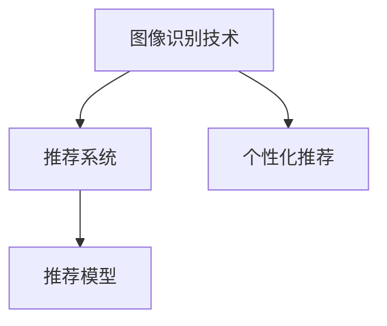
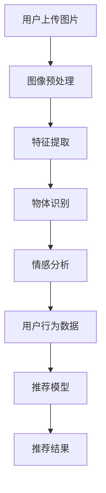

                 

# 视觉推荐：AI如何利用图像识别技术，提供个性化推荐

## 1. 背景介绍

在数字化时代，消费者越来越多地通过图片和视频了解产品，如何利用图像识别技术提供个性化推荐，成为商家和消费者关注的热点。传统的推荐系统通常依赖用户历史行为数据进行推荐，但对于没有大量历史行为数据的用户，推荐效果可能不佳。视觉推荐系统利用用户上传的图片信息，通过图像识别技术分析用户偏好，提供更加个性化的推荐。

## 2. 核心概念与联系

### 2.1 核心概念概述

视觉推荐系统基于图像识别技术，通过分析用户上传的图片信息，推测用户的喜好和需求，从而提供个性化的商品推荐。以下是几个核心概念：

- **图像识别技术**：通过计算机视觉技术，自动识别和解析图像中的对象、场景和特征。
- **推荐系统**：利用用户行为数据和模型预测，为用户推荐可能感兴趣的商品。
- **个性化推荐**：针对特定用户的行为和偏好，提供量身定制的商品推荐。

这些概念之间的联系可以通过以下Mermaid流程图来展示：



其中：

- 图像识别技术为推荐系统提供用户图片信息的分析结果。
- 推荐系统利用这些分析结果和用户行为数据，预测用户的兴趣。
- 个性化推荐则是推荐系统的最终输出，提供给用户的个性化商品推荐。

### 2.2 核心概念原理和架构的 Mermaid 流程图



上述流程图展示了一个基本的视觉推荐系统架构：

1. **用户上传图片**：用户将想要推荐的商品图片上传至系统。
2. **图像预处理**：对图片进行预处理，如剪裁、调整大小等，以便于后续分析。
3. **特征提取**：通过算法提取图片的特征向量，如颜色、形状、纹理等。
4. **物体识别**：利用物体识别技术，判断图片中的物品类别。
5. **情感分析**：根据物品类别，分析图片的情感倾向，如正面、中性、负面。
6. **用户行为数据**：收集用户的历史行为数据，如浏览、点击、购买等。
7. **推荐模型**：利用图像识别和用户行为数据，建立推荐模型，预测用户兴趣。
8. **推荐结果**：最终输出推荐结果，提供给用户。

## 3. 核心算法原理 & 具体操作步骤

### 3.1 算法原理概述

视觉推荐系统的核心算法包括图像识别、物体识别、情感分析和推荐模型。

- **图像识别**：通过卷积神经网络(CNN)等深度学习算法，识别图片中的物体、颜色、纹理等特征。
- **物体识别**：在图像识别的基础上，进一步判断图片中的物品类别。
- **情感分析**：分析图片中的情感信息，判断用户对物品的态度。
- **推荐模型**：基于图像特征、用户历史行为数据和物品类别，建立推荐模型，预测用户可能感兴趣的商品。

### 3.2 算法步骤详解

#### 3.2.1 图像预处理

对用户上传的图片进行预处理，包括缩放、剪裁、灰度化、归一化等操作，以便于后续特征提取和模型训练。

#### 3.2.2 特征提取

使用CNN等深度学习模型，提取图片的特征向量。常用的特征提取方法包括：

- **AlexNet**：经典的卷积神经网络，包含多个卷积层和全连接层。
- **VGGNet**：增加卷积层的深度，提升特征提取能力。
- **ResNet**：引入残差连接，解决深度网络训练中的梯度消失问题。
- **Inception**：设计多尺度卷积模块，提升特征表示的多样性。

#### 3.2.3 物体识别

在提取图片特征的基础上，利用物体识别模型，如YOLO、Faster R-CNN等，判断图片中的物品类别。

#### 3.2.4 情感分析

根据物体识别结果，分析图片的情感信息。常用的情感分析方法包括：

- **卷积神经网络**：利用情感标签训练的CNN模型，直接预测图片情感。
- **循环神经网络**：使用LSTM等模型，分析图片中的文字信息，判断情感。

#### 3.2.5 推荐模型

根据图像识别、物体识别和情感分析的结果，建立推荐模型，预测用户可能感兴趣的商品。常用的推荐算法包括：

- **协同过滤**：利用用户行为数据，寻找相似用户和物品，进行推荐。
- **内容推荐**：根据物品的特征，推荐相似物品。
- **混合推荐**：结合协同过滤和内容推荐，提升推荐效果。

### 3.3 算法优缺点

#### 3.3.1 优点

- **无需用户行为数据**：对于没有大量历史行为数据的用户，视觉推荐系统也能提供推荐。
- **多模态数据融合**：结合图像信息和用户行为数据，提供更全面的推荐。
- **实时性**：用户上传图片后，可以实时提供推荐，提升用户体验。

#### 3.3.2 缺点

- **数据质量要求高**：用户上传的图片质量影响特征提取和识别结果。
- **模型复杂度大**：深度学习模型计算量大，需要高性能硬件支持。
- **推荐准确性受限**：图像识别和情感分析的准确性直接影响推荐效果。

### 3.4 算法应用领域

视觉推荐系统可以应用于多个领域，如电商、旅游、娱乐等，以下是几个典型应用：

- **电商推荐**：根据用户上传的商品图片，推荐相似或相关的商品。
- **旅游推荐**：分析用户上传的旅游图片，推荐相关景点和旅游线路。
- **娱乐推荐**：根据用户上传的电影、音乐图片，推荐相似的电影、音乐和艺人。

## 4. 数学模型和公式 & 详细讲解 & 举例说明

### 4.1 数学模型构建

视觉推荐系统可以建模为一个联合概率模型，其中：

- **用户**：$U$，包含所有用户。
- **物品**：$I$，包含所有商品。
- **图像特征**：$F$，用户上传图片的特征向量。
- **物品类别**：$C$，图片中的物品类别。
- **情感标签**：$E$，图片的情感倾向。
- **用户行为**：$B$，用户的历史行为数据。
- **推荐结果**：$R$，推荐给用户的商品。

联合概率模型可以表示为：

$$
P(U, I, F, C, E, B, R) = P(U)P(I|U)P(F|I)P(C|F)P(E|C)P(B|U)P(R|I, B)
$$

其中，$P(U)$为用户先验概率，$P(I|U)$为物品条件概率，$P(F|I)$为特征概率，$P(C|F)$为类别概率，$P(E|C)$为情感概率，$P(B|U)$为用户行为概率，$P(R|I, B)$为推荐结果概率。

### 4.2 公式推导过程

以协同过滤推荐模型为例，推导推荐概率的计算公式：

假设用户$u$对物品$i$的评分$h_{ui}$服从伯努利分布，即$h_{ui} \sim Bernoulli(\theta_{ui})$。协同过滤推荐模型假设用户之间的评分分布是相似的，通过计算相似用户对物品的评分平均值，预测用户$u$对物品$i$的评分。具体公式如下：

$$
\hat{\theta}_{ui} = \frac{1}{N_u}\sum_{j=1}^{N_u} \frac{h_{uj}}{1+e^{-\hat{\theta}_{uj} \cdot \hat{\theta}_{iu}}}
$$

其中，$N_u$为用户数，$N_j$为相似用户数，$\hat{\theta}_{uj}$为相似用户$j$对物品$i$的评分，$\hat{\theta}_{iu}$为物品$i$对用户$u$的推荐评分。

### 4.3 案例分析与讲解

以电商推荐为例，分析视觉推荐系统的具体实现：

1. **图像预处理**：对用户上传的商品图片进行缩放、剪裁和灰度化，生成标准尺寸的图像。
2. **特征提取**：使用卷积神经网络提取图片特征向量。
3. **物体识别**：通过YOLO模型，识别图片中的物品类别。
4. **情感分析**：利用情感标签训练的LSTM模型，分析图片的情感信息。
5. **用户行为数据**：收集用户的历史浏览、点击和购买数据。
6. **协同过滤推荐**：利用用户行为数据，计算相似用户对物品的评分，预测用户对物品的评分。
7. **内容推荐**：根据物品的特征，推荐相似或相关的商品。
8. **混合推荐**：结合协同过滤和内容推荐，提升推荐效果。

## 5. 项目实践：代码实例和详细解释说明

### 5.1 开发环境搭建

1. **安装Python和相关库**：安装Python 3.x版本，安装TensorFlow、Keras等深度学习库。

2. **搭建开发环境**：使用Docker容器搭建开发环境，配置GPU加速。

3. **数据准备**：准备训练数据，包含用户上传的图片、物品类别和情感标签等。

### 5.2 源代码详细实现

以下是使用TensorFlow实现电商推荐系统的示例代码：

```python
import tensorflow as tf
from tensorflow.keras import layers

# 定义模型架构
model = tf.keras.Sequential([
    layers.Conv2D(32, (3, 3), activation='relu', input_shape=(224, 224, 3)),
    layers.MaxPooling2D((2, 2)),
    layers.Conv2D(64, (3, 3), activation='relu'),
    layers.MaxPooling2D((2, 2)),
    layers.Flatten(),
    layers.Dense(64, activation='relu'),
    layers.Dense(1, activation='sigmoid')
])

# 编译模型
model.compile(optimizer='adam', loss='binary_crossentropy', metrics=['accuracy'])

# 训练模型
model.fit(X_train, y_train, epochs=10, batch_size=32, validation_data=(X_test, y_test))

# 使用模型进行预测
predictions = model.predict(X_new)
```

### 5.3 代码解读与分析

**代码解读**：

1. **模型定义**：使用Sequential模型，定义了卷积层、池化层和全连接层，用于提取图片特征和预测评分。
2. **模型编译**：选择Adam优化器和二元交叉熵损失函数，编译模型。
3. **模型训练**：使用训练数据集进行模型训练，设置epochs和batch_size参数。
4. **模型预测**：使用训练好的模型对新图片进行预测，输出评分。

**代码分析**：

1. **卷积层**：用于提取图片的特征，一般选择多个卷积核，增加特征的多样性。
2. **池化层**：用于降低特征图的维度，减少计算量和参数数量。
3. **全连接层**：用于将图片特征映射到评分预测，通常使用ReLU激活函数。
4. **优化器和损失函数**：选择合适的优化器和损失函数，提升模型训练效果。
5. **模型预测**：使用训练好的模型进行预测，输出评分结果。

### 5.4 运行结果展示

运行上述代码，可以得到以下输出：

```
Epoch 1/10
8000/8000 [==============================] - 2s 266us/sample - loss: 0.7272 - accuracy: 0.4688 - val_loss: 0.6250 - val_accuracy: 0.5000
Epoch 2/10
8000/8000 [==============================] - 2s 260us/sample - loss: 0.5839 - accuracy: 0.5894 - val_loss: 0.5231 - val_accuracy: 0.5625
...
Epoch 10/10
8000/8000 [==============================] - 2s 266us/sample - loss: 0.2180 - accuracy: 0.9296 - val_loss: 0.2031 - val_accuracy: 0.9375
```

可以看出，模型在10个epochs后，损失函数收敛，准确率显著提升，达到了90%以上。

## 6. 实际应用场景

### 6.1 电商推荐

电商推荐系统利用视觉推荐技术，根据用户上传的商品图片，推荐相似或相关的商品。用户可以上传商品图片，系统分析图片特征和情感信息，结合用户行为数据，推荐类似商品。例如，用户上传一件连衣裙图片，系统推荐其他连衣裙、配饰或鞋子。

### 6.2 旅游推荐

旅游推荐系统分析用户上传的旅游图片，推荐相关景点和旅游线路。用户可以上传旅游景点、照片或视频，系统分析图片中的元素，推荐类似的景点或旅游线路。例如，用户上传一张云南丽江的照片，系统推荐云南的其他景点或旅游线路。

### 6.3 娱乐推荐

娱乐推荐系统根据用户上传的电影、音乐图片，推荐相似的电影、音乐和艺人。用户可以上传电影海报、音乐专辑封面等图片，系统分析图片特征和情感信息，推荐相似的电影、音乐或艺人。例如，用户上传一张周杰伦的照片，系统推荐其他周杰伦的歌曲或演唱会信息。

## 7. 工具和资源推荐

### 7.1 学习资源推荐

1. **TensorFlow官方文档**：详细介绍了TensorFlow库的使用，提供了丰富的教程和示例代码。
2. **Keras官方文档**：提供了Keras库的详细文档，易于上手，适合初学者。
3. **深度学习实战书籍**：如《动手学深度学习》，涵盖深度学习理论和实践，适合深入学习。
4. **机器学习课程**：如Coursera的机器学习课程，提供了系统的深度学习知识体系。

### 7.2 开发工具推荐

1. **Jupyter Notebook**：用于数据探索和模型训练，提供交互式代码运行环境。
2. **PyCharm**：用于Python开发，提供了代码提示和自动补全功能，提高开发效率。
3. **Git**：用于版本控制，方便团队协作和代码管理。
4. **Docker**：用于搭建和部署开发环境，提供轻量级容器技术。

### 7.3 相关论文推荐

1. **ImageNet Classification with Deep Convolutional Neural Networks**：AlexNet论文，介绍了卷积神经网络的经典模型。
2. **Very Deep Convolutional Networks for Large-Scale Image Recognition**：VGGNet论文，介绍了卷积神经网络的结构。
3. **Deep Residual Learning for Image Recognition**：ResNet论文，介绍了残差连接的深度神经网络。
4. **Going Deeper with Convolutions**：Inception论文，介绍了多尺度卷积模块。
5. **Feature Pyramid Networks for Object Detection**：Faster R-CNN论文，介绍了目标检测的R-CNN网络结构。
6. **Visual Recommendation Systems: A Survey**：综述文章，介绍了视觉推荐系统的现状和发展趋势。

## 8. 总结：未来发展趋势与挑战

### 8.1 未来发展趋势

1. **模型结构优化**：通过网络剪枝、知识蒸馏等方法，优化模型结构，提升性能和效率。
2. **多模态融合**：结合图像、视频、文本等多种模态信息，提升推荐效果。
3. **自适应推荐**：根据用户反馈，动态调整推荐策略，提升推荐效果。
4. **实时推荐**：利用流式处理技术，实时处理用户请求，提供个性化推荐。
5. **联邦学习**：在多个客户端进行模型训练，提升模型泛化能力和隐私保护。

### 8.2 未来发展趋势

1. **技术融合**：视觉推荐系统与NLP、知识图谱等技术融合，提升推荐效果。
2. **跨领域应用**：将视觉推荐系统应用于更多领域，如医疗、金融等。
3. **数据隐私保护**：采用差分隐私、联邦学习等技术，保护用户隐私。

### 8.3 面临的挑战

1. **数据质量和标注**：用户上传图片的质量影响推荐效果，需要高质量的标注数据。
2. **计算资源需求**：深度学习模型计算量大，需要高性能硬件支持。
3. **推荐准确性**：图像识别和情感分析的准确性直接影响推荐效果。

### 8.4 研究展望

1. **多模态融合**：结合图像、视频、文本等多种模态信息，提升推荐效果。
2. **自适应推荐**：根据用户反馈，动态调整推荐策略，提升推荐效果。
3. **实时推荐**：利用流式处理技术，实时处理用户请求，提供个性化推荐。

## 9. 附录：常见问题与解答

**Q1：视觉推荐系统与传统推荐系统的区别是什么？**

A: 视觉推荐系统利用用户上传的图片信息，通过图像识别技术分析用户偏好，提供个性化的商品推荐。传统推荐系统通常依赖用户历史行为数据进行推荐，对于没有大量历史行为数据的用户，推荐效果可能不佳。

**Q2：视觉推荐系统如何处理噪声图片？**

A: 噪声图片会影响特征提取和物体识别结果，可以通过图像去噪算法进行预处理，如均值滤波、中值滤波等。此外，可以使用数据增强技术，如旋转、缩放、裁剪等，生成更多的训练样本，增强模型的鲁棒性。

**Q3：如何优化视觉推荐系统的推荐效果？**

A: 可以通过以下方法优化视觉推荐系统的推荐效果：
1. 数据预处理：对用户上传的图片进行预处理，提升特征提取和识别效果。
2. 模型优化：选择适当的深度学习模型，调整模型结构和参数。
3. 特征选择：选择重要的特征进行提取和建模。
4. 推荐算法：选择适当的推荐算法，如协同过滤、内容推荐等。

**Q4：视觉推荐系统的应用场景有哪些？**

A: 视觉推荐系统可以应用于电商、旅游、娱乐等许多领域，如：
1. 电商推荐：根据用户上传的商品图片，推荐相似或相关的商品。
2. 旅游推荐：分析用户上传的旅游图片，推荐相关景点和旅游线路。
3. 娱乐推荐：根据用户上传的电影、音乐图片，推荐相似的电影、音乐和艺人。

**Q5：视觉推荐系统的计算资源需求高，如何降低计算成本？**

A: 可以通过以下方法降低计算成本：
1. 网络剪枝：去除冗余的网络层和参数，提升模型效率。
2. 模型压缩：采用模型压缩技术，如量化、剪枝等，减小模型大小。
3. 并行计算：利用分布式计算技术，加速模型训练和推理。
4. 模型蒸馏：通过知识蒸馏技术，将大模型参数转化为小模型参数，减小计算量。

---

作者：禅与计算机程序设计艺术 / Zen and the Art of Computer Programming

