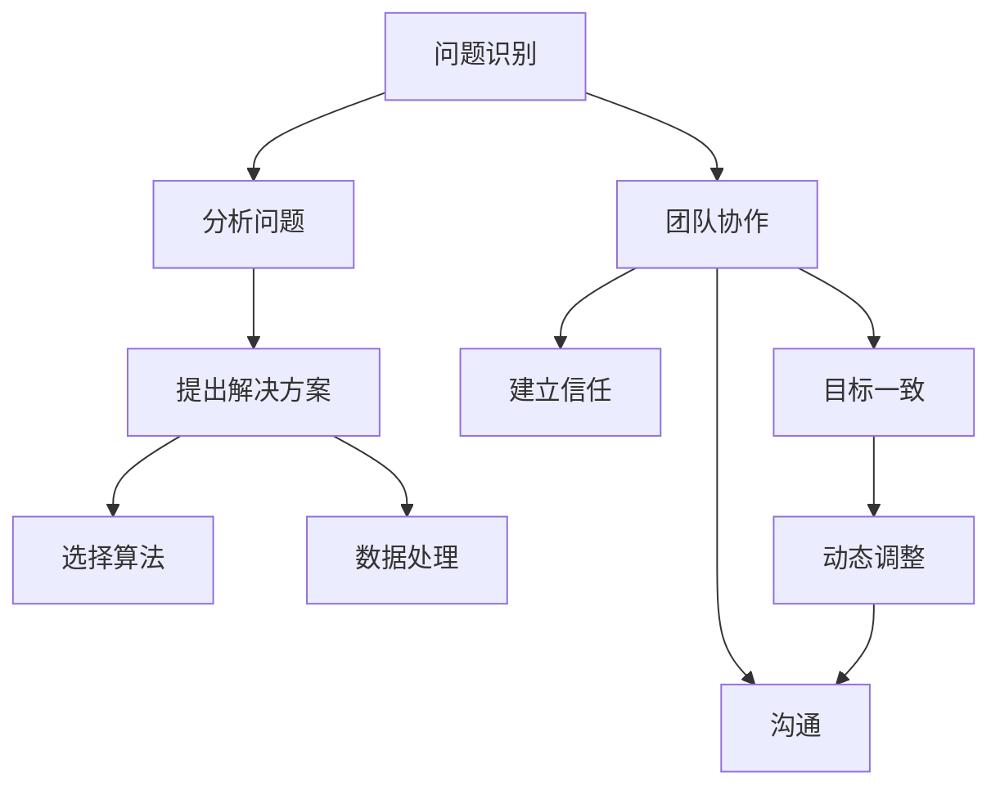

                 

# 解决问题与建立牢固关系的方法

在技术领域，尤其是在人工智能(AI)和数据科学领域，解决问题与建立牢固关系是实现成功项目和高效团队合作的关键。本文将深入探讨这些核心主题，提供清晰的原理和实用的操作步骤，以及它们在实际应用中的优势和局限性。

## 1. 背景介绍

### 1.1 问题由来

在现代软件开发和人工智能项目中，面临的挑战不断变化，从复杂的技术问题到团队合作的人际关系问题，都需要有效的解决方案。例如，在机器学习项目中，数据清洗、模型选择和超参数调整都是常见的技术挑战。而在团队协作中，沟通不足、目标不一致和团队动态变化等问题则会影响项目进度和质量。

### 1.2 问题核心关键点

问题解决的第一步是明确问题类型和范围。问题可以分成技术性问题和人际关系问题。技术性问题通常涉及算法选择、数据处理、系统设计和实现。人际关系问题则关乎沟通、信任和协作等软技能。解决这些问题需要结合技术手段和人际交往技巧。

## 2. 核心概念与联系

### 2.1 核心概念概述

- **问题解决(Problem Solving)**：识别问题、分析问题、提出解决方案并实施的过程。
- **团队协作(Team Collaboration)**：多个人共同工作，通过沟通、分工和合作完成任务。
- **算法选择(Algorithm Selection)**：选择适合具体问题的算法或方法。
- **数据处理(Data Processing)**：清洗、转换和准备数据以供模型训练。
- **沟通(Communication)**：分享信息和意见，确保团队成员理解目标和方法。
- **信任(Trust)**：团队成员间建立互信关系，促进合作。
- **目标一致(Goal Alignment)**：确保团队成员对项目目标有共同理解。
- **动态调整(Dynamic Adjustment)**：根据项目进展和反馈不断调整计划和方法。

### 2.2 核心概念原理和架构的 Mermaid 流程图



这个流程图展示了问题解决和团队协作的核心步骤及其相互关系。问题识别和团队协作是基础，分析和解决方案的提出是关键，算法选择和数据处理是技术支撑，沟通、信任和目标一致则是人际关系维度的保障。动态调整确保项目能够适应变化，不断优化。

## 3. 核心算法原理 & 具体操作步骤

### 3.1 算法原理概述

问题解决的算法包括但不限于搜索、优化、分类、聚类等。在AI领域，常用的算法包括决策树、支持向量机、神经网络等。这些算法通过学习训练数据，找到最优的决策边界或模型参数。

### 3.2 算法步骤详解

以决策树算法为例，步骤如下：

1. **数据准备**：收集和清洗数据，将其分为训练集和测试集。
2. **特征选择**：选择最相关的特征，减少噪声。
3. **模型训练**：使用训练集训练决策树模型。
4. **模型评估**：在测试集上评估模型性能，如准确率和召回率。
5. **模型优化**：根据评估结果调整模型参数。

### 3.3 算法优缺点

**优点**：
- 决策树易于解释和理解。
- 可以处理非线性关系。
- 对于缺失数据和异常值有一定的鲁棒性。

**缺点**：
- 容易过拟合，特别是树较深时。
- 对噪声敏感。
- 对于大型数据集，训练时间较长。

### 3.4 算法应用领域

决策树算法广泛用于医疗诊断、金融预测、图像分类等领域。例如，在医疗诊断中，可以通过患者症状选择最可能的原因；在金融预测中，可以通过历史交易数据预测股票价格。

## 4. 数学模型和公式 & 详细讲解 & 举例说明

### 4.1 数学模型构建

决策树模型可以表示为树形结构，每个节点代表一个特征，每个分支代表一个特征值，叶节点代表一个类别或数值。树的构建过程是通过递归地选择最优特征，将数据集分为更小的子集。

### 4.2 公式推导过程

决策树使用的信息增益公式为：

$$
IG(D, A) = -\sum_{a \in \mathcal{A}} \frac{|D_a|}{|D|} \log_2 \frac{|D_a|}{|D|}
$$

其中，$D$ 是数据集，$A$ 是特征集，$D_a$ 是特征 $a$ 取特定值的子集，$|D|$ 是数据集大小，$|D_a|$ 是特征 $a$ 取特定值的子集大小。信息增益最大的特征用于划分数据集。

### 4.3 案例分析与讲解

假设有一个包含多个属性的数据集，如年龄、性别、血压等，用于预测心脏病风险。通过计算每个属性的信息增益，选择最相关的属性构建决策树。例如，如果年龄的信息增益最大，那么第一层将根据年龄将数据集分为不同年龄段，然后对每个年龄段继续使用信息增益最大的特征划分，直到达到预设的停止条件。

## 5. 项目实践：代码实例和详细解释说明

### 5.1 开发环境搭建

1. **安装Python**：从官网下载并安装最新版本的Python。
2. **安装机器学习库**：使用pip安装scikit-learn、numpy等库。
3. **准备数据集**：收集并准备用于训练和测试的数据集。
4. **配置环境变量**：设置Python路径和依赖库路径。

### 5.2 源代码详细实现

以下是一个使用scikit-learn库构建决策树的示例代码：

```python
from sklearn import datasets
from sklearn.tree import DecisionTreeClassifier
from sklearn.model_selection import train_test_split
from sklearn.metrics import accuracy_score

# 加载数据集
iris = datasets.load_iris()
X = iris.data
y = iris.target

# 数据集划分
X_train, X_test, y_train, y_test = train_test_split(X, y, test_size=0.3, random_state=42)

# 创建决策树模型
clf = DecisionTreeClassifier()

# 训练模型
clf.fit(X_train, y_train)

# 测试模型
y_pred = clf.predict(X_test)

# 计算准确率
acc = accuracy_score(y_test, y_pred)
print("Accuracy:", acc)
```

### 5.3 代码解读与分析

- **数据加载**：使用sklearn库中的函数加载iris数据集。
- **数据划分**：将数据集分为训练集和测试集。
- **模型创建**：创建决策树分类器。
- **模型训练**：使用训练集数据训练模型。
- **模型测试**：使用测试集数据测试模型，并计算准确率。

### 5.4 运行结果展示

运行上述代码，输出准确率结果。如果准确率较高，说明模型训练效果较好。

## 6. 实际应用场景

### 6.1 医疗诊断系统

在医疗诊断系统中，决策树可以用于根据患者症状和检查结果预测可能的疾病。例如，如果患者有胸痛、心电图异常等症状，模型可以预测为心肌梗死。

### 6.2 金融预测系统

在金融预测系统中，决策树可以用于预测股票价格、客户信用评分等。例如，根据历史交易数据，模型可以预测某个股票在未来一周内的涨跌。

### 6.3 推荐系统

在推荐系统中，决策树可以用于根据用户的历史行为和属性预测其对某个商品的兴趣。例如，根据用户的浏览历史和年龄，模型可以推荐其可能感兴趣的商品。

### 6.4 未来应用展望

未来的决策树模型可能采用更多的机器学习技术，如集成学习、深度学习等，以提高模型的预测精度和鲁棒性。同时，通过多模态数据的融合，决策树可以更好地处理复杂问题，如图像分类和文本分类。

## 7. 工具和资源推荐

### 7.1 学习资源推荐

1. **《机器学习实战》**：适合初学者学习机器学习基础，包括数据处理、算法选择和模型评估等。
2. **《Python数据科学手册》**：详细介绍Python在数据科学中的应用，包括数据清洗、分析和可视化等。
3. **Coursera机器学习课程**：由斯坦福大学Andrew Ng教授主讲的机器学习课程，涵盖机器学习的基本概念和常用算法。

### 7.2 开发工具推荐

1. **Jupyter Notebook**：开源的交互式笔记本，支持Python代码的编写和执行。
2. **Anaconda**：Python的数据科学发行版，包含多个科学计算库。
3. **TensorBoard**：用于可视化机器学习模型的训练过程和结果。

### 7.3 相关论文推荐

1. **决策树算法的研究与实现**：论文介绍了决策树的算法原理和实现方法，适合深入理解决策树的工作机制。
2. **集成学习方法**：论文探讨了集成学习的思想和应用，适合学习如何将多个模型组合成更强的预测模型。
3. **深度学习在决策树中的应用**：论文研究了深度学习在决策树中的融合，适合学习如何将复杂问题转化为更高效的模型。

## 8. 总结：未来发展趋势与挑战

### 8.1 研究成果总结

决策树算法在数据科学和AI领域具有重要的应用价值，通过分析数据特征和结构，可以高效地解决问题。随着技术的不断进步，决策树算法也在不断优化和扩展，如引入集成学习和深度学习等技术，以适应更复杂的问题。

### 8.2 未来发展趋势

1. **自动化决策树构建**：通过自动化技术，减少人工干预，提高模型构建效率。
2. **多模态数据融合**：结合图像、文本和语音等多模态数据，提升决策树的预测能力。
3. **模型解释性增强**：通过可视化工具和可解释性算法，提高决策树的透明度和可理解性。
4. **分布式训练**：利用分布式计算资源，加速模型训练和优化过程。

### 8.3 面临的挑战

1. **过拟合问题**：模型在训练数据上表现良好，但在测试数据上表现较差。
2. **模型解释性不足**：决策树的输出结果难以解释，影响用户信任。
3. **数据质量和多样性**：数据质量差或数据多样性不足，影响模型的泛化能力。

### 8.4 研究展望

未来的研究应集中在以下几个方面：
1. **自动化决策树构建**：开发自动化决策树构建工具，减少人工干预，提高效率。
2. **模型解释性增强**：研究模型解释性算法，提高决策树的可理解性。
3. **多模态数据融合**：结合多模态数据，提升决策树的预测能力。
4. **分布式训练**：利用分布式计算资源，加速模型训练和优化过程。

## 9. 附录：常见问题与解答

**Q1: 决策树算法有哪些优点和缺点？**

A: **优点**：
- 易于理解和解释。
- 可以处理非线性关系。
- 对于缺失数据和异常值有一定的鲁棒性。

**Q2: 如何避免决策树算法的过拟合问题？**

A: 可以通过以下方法避免过拟合：
- 增加数据量，提高模型泛化能力。
- 使用剪枝算法，减少模型复杂度。
- 使用集成学习方法，如随机森林和梯度提升树。

**Q3: 如何提高决策树的预测准确率？**

A: 可以通过以下方法提高预测准确率：
- 选择更相关的特征，减少噪声。
- 使用集成学习方法，如随机森林和梯度提升树。
- 调整模型参数，如决策树深度和叶节点大小。

**Q4: 如何解释决策树的输出结果？**

A: 可以使用以下方法解释决策树的输出结果：
- 绘制决策树图，直观展示决策过程。
- 使用可解释性算法，如LIME和SHAP，解释模型预测结果。

**Q5: 决策树算法在实际应用中有哪些应用场景？**

A: 决策树算法在实际应用中有很多应用场景，如：
- 医疗诊断：根据症状和检查结果预测可能的疾病。
- 金融预测：根据历史交易数据预测股票价格和客户信用评分。
- 推荐系统：根据用户的历史行为和属性推荐商品。

---

作者：禅与计算机程序设计艺术 / Zen and the Art of Computer Programming

