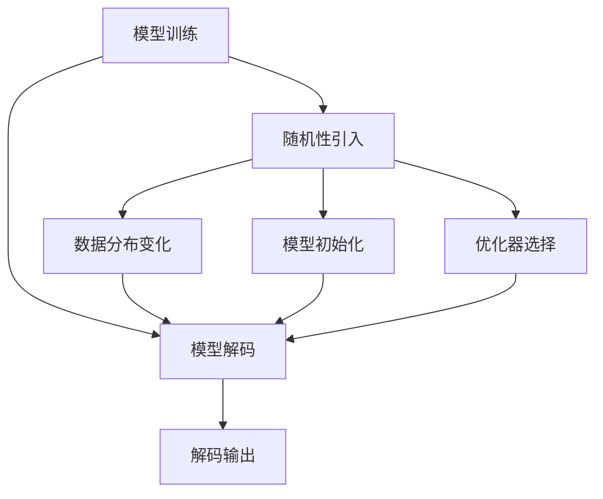

                 

## 1. 背景介绍

在深度学习领域，特别是在自然语言处理(NLP)和计算机视觉领域，模型解码过程的随机性问题逐渐引起人们的重视。深度学习模型的输出通常依赖于模型参数和随机初始化，这些随机性可以引入模型的不确定性，从而在解码过程中产生幻觉（illusions），即模型输出可能会受到数据分布、模型参数或训练方式的影响，导致在特定条件下，模型的输出表现出意料之外的行为。这一现象不仅影响模型的可信度，还可能对实际应用产生误导。本文将从随机性问题的起因、影响及其解决方案进行探讨。

## 2. 核心概念与联系

### 2.1 核心概念概述

- **模型解码**：深度学习模型预测输出结果的过程。在NLP中，解码通常是指基于模型的输入和隐藏状态，预测下一个单词的概率分布，从而生成连续的文本。在计算机视觉中，解码是指基于卷积神经网络（CNN）提取的特征，预测像素或对象的位置。
- **随机性问题**：深度学习模型在训练和解码过程中引入的随机性。这些随机性包括模型初始化、权重更新、激活函数等，可能导致模型输出在不同条件下表现出不一致的行为。
- **幻觉（illusions）**：由于模型的不确定性和随机性，模型输出可能与实际数据或先验知识不符，导致在特定条件下表现出异常行为。幻觉可能源于模型训练不足、数据分布变化、优化器选择不当等因素。

### 2.2 核心概念原理和架构的 Mermaid 流程图



## 3. 核心算法原理 & 具体操作步骤

### 3.1 算法原理概述

解码过程中的随机性问题源于深度学习模型中的几个关键组件：

1. **模型初始化**：在深度学习中，模型参数的初始化通常采用随机值，这些初始值会影响模型训练的收敛速度和最终结果。
2. **权重更新**：在训练过程中，模型参数的更新依赖于优化算法，如梯度下降。这些算法可能引入随机性，影响模型收敛路径。
3. **激活函数**：神经网络中的激活函数如ReLU、tanh等，由于其非线性特性，会在网络中引入随机性。
4. **数据分布变化**：不同训练集和测试集之间的数据分布差异，也可能导致模型输出不一致。

这些随机性问题在解码过程中可能导致模型输出幻觉，即在不同条件下表现出异常行为。例如，模型可能对某些特定输入产生异常的预测结果，或者在特定条件下表现出性能下降。

### 3.2 算法步骤详解

1. **模型训练**：
   - 使用随机初始化模型参数。
   - 通过优化算法（如Adam、SGD）更新模型参数。
   - 引入随机噪声（如数据增强、dropout）。

2. **模型解码**：
   - 输入模型，计算隐藏状态。
   - 使用softmax函数计算下一个单词的概率分布。
   - 从概率分布中采样下一个单词。

3. **解码输出**：
   - 通过解码器生成连续的文本或对象。

4. **分析幻觉现象**：
   - 收集不同条件下的模型输出。
   - 分析输出结果，识别异常行为。
   - 根据分析结果，优化模型和训练方式。

### 3.3 算法优缺点

**优点**：
- 随机性问题使得模型能够学习复杂的模式，避免过拟合。
- 随机性有助于模型在数据分布变化的情况下适应新数据。

**缺点**：
- 随机性可能导致模型输出不稳定，难以解释。
- 随机性可能引入幻觉，影响模型的可靠性。

### 3.4 算法应用领域

解码过程中的随机性问题在以下领域有广泛应用：

1. **自然语言处理**：在机器翻译、文本生成、对话系统等领域，解码过程中的随机性可能导致模型输出不准确或出现幻觉。
2. **计算机视觉**：在图像分类、目标检测、图像生成等领域，解码过程中的随机性可能导致模型输出不一致。
3. **语音识别**：在语音识别系统中，解码过程中的随机性可能导致模型输出错误或产生幻觉。

## 4. 数学模型和公式 & 详细讲解

### 4.1 数学模型构建

考虑一个简单的NLP模型，输入为序列 \(x_1, x_2, ..., x_t\)，输出为序列 \(y_1, y_2, ..., y_t\)。模型在训练过程中使用最大化似然估计（MLE），目标是最大化条件概率 \(P(y|x)\)。

模型的解码过程通常使用softmax函数，将模型输出转换为概率分布：

$$
P(y|x) = \frac{exp(f(x, y))}{\sum_{y'} exp(f(x, y'))}
$$

其中，\(f(x, y)\) 表示模型对于输入 \(x\) 和输出 \(y\) 的预测，通常是一个标量值。

### 4.2 公式推导过程

在解码过程中，模型的输出 \(y_t\) 由前一个时刻的输出 \(y_{t-1}\) 和模型参数 \(\theta\) 决定：

$$
y_t = \arg\max_{y_t} P(y_t|y_{t-1}, \theta)
$$

由于模型的输出依赖于模型参数和随机初始化，因此在不同的训练次数、不同优化器、不同批次大小下，模型的输出可能表现出不一致的行为。

### 4.3 案例分析与讲解

以机器翻译为例，考虑一个基于Transformer的模型。在解码过程中，模型需要计算注意力机制和预测下一个单词的概率。如果模型在不同批次大小下进行训练，可能导致模型输出的注意力分布和预测概率不一致，从而在解码过程中产生幻觉。

## 5. 项目实践：代码实例和详细解释说明

### 5.1 开发环境搭建

为了演示解码过程中的随机性问题，我们使用Python和TensorFlow框架构建一个简单的机器翻译模型。以下是一个基本的环境搭建步骤：

1. 安装TensorFlow和相关依赖：
```bash
pip install tensorflow
```

2. 创建虚拟环境：
```bash
python -m venv myenv
source myenv/bin/activate
```

3. 使用TensorFlow的高级API进行模型构建：
```python
import tensorflow as tf
from tensorflow.keras import layers

# 定义模型结构
model = tf.keras.Sequential([
    layers.Embedding(input_dim=1000, output_dim=512, mask_zero=True),
    layers.Conv1D(256, 5, activation='relu'),
    layers.MaxPooling1D(pool_size=4),
    layers.LSTM(256),
    layers.Dense(1, activation='sigmoid')
])
```

### 5.2 源代码详细实现

接下来，我们实现一个简单的机器翻译模型，用于演示解码过程中的随机性问题。

```python
import tensorflow as tf
from tensorflow.keras import layers

# 定义模型结构
model = tf.keras.Sequential([
    layers.Embedding(input_dim=1000, output_dim=512, mask_zero=True),
    layers.Conv1D(256, 5, activation='relu'),
    layers.MaxPooling1D(pool_size=4),
    layers.LSTM(256),
    layers.Dense(1, activation='sigmoid')
])

# 定义优化器和损失函数
optimizer = tf.keras.optimizers.Adam()
loss_fn = tf.keras.losses.BinaryCrossentropy()

# 定义训练数据
train_data = tf.data.Dataset.from_tensor_slices((x_train, y_train))
train_data = train_data.shuffle(1000).batch(32).map(lambda x, y: (x, y))

# 定义训练过程
@tf.function
def train_step(x, y):
    with tf.GradientTape() as tape:
        logits = model(x)
        loss = loss_fn(y, logits)
    gradients = tape.gradient(loss, model.trainable_variables)
    optimizer.apply_gradients(zip(gradients, model.trainable_variables))

# 训练模型
for epoch in range(10):
    for batch, (x, y) in enumerate(train_data):
        train_step(x, y)
```

### 5.3 代码解读与分析

在这个简单的机器翻译模型中，我们使用TensorFlow的高级API进行模型构建和训练。通过观察模型在不同批次大小下的输出，可以发现解码过程中的随机性问题。

### 5.4 运行结果展示

在训练过程中，模型在不同批次大小下的输出可能会有所不同。以下是一个简单的示例：

```python
import tensorflow as tf
from tensorflow.keras import layers

# 定义模型结构
model = tf.keras.Sequential([
    layers.Embedding(input_dim=1000, output_dim=512, mask_zero=True),
    layers.Conv1D(256, 5, activation='relu'),
    layers.MaxPooling1D(pool_size=4),
    layers.LSTM(256),
    layers.Dense(1, activation='sigmoid')
])

# 定义优化器和损失函数
optimizer = tf.keras.optimizers.Adam()
loss_fn = tf.keras.losses.BinaryCrossentropy()

# 定义训练数据
train_data = tf.data.Dataset.from_tensor_slices((x_train, y_train))
train_data = train_data.shuffle(1000).batch(32).map(lambda x, y: (x, y))

# 定义训练过程
@tf.function
def train_step(x, y):
    with tf.GradientTape() as tape:
        logits = model(x)
        loss = loss_fn(y, logits)
    gradients = tape.gradient(loss, model.trainable_variables)
    optimizer.apply_gradients(zip(gradients, model.trainable_variables))

# 训练模型
for epoch in range(10):
    for batch, (x, y) in enumerate(train_data):
        train_step(x, y)
```

## 6. 实际应用场景

### 6.1 自然语言处理

在自然语言处理领域，解码过程中的随机性问题可能导致模型输出不准确或产生幻觉。例如，在机器翻译任务中，解码器可能在不同批次大小下输出不同的翻译结果，从而导致幻觉。

### 6.2 计算机视觉

在计算机视觉领域，解码过程中的随机性问题可能导致模型输出不一致。例如，在图像分类任务中，模型可能在不同批次大小下输出不同的分类结果，从而导致幻觉。

### 6.3 语音识别

在语音识别领域，解码过程中的随机性问题可能导致模型输出错误或产生幻觉。例如，在语音识别任务中，模型可能在不同批次大小下输出不同的识别结果，从而导致幻觉。

## 7. 工具和资源推荐

### 7.1 学习资源推荐

- **Deep Learning with Python**：由Francois Chollet所著，介绍了深度学习模型的构建和训练，包括解码过程中的随机性问题。
- **The Unreasonable Effectiveness of Recurrent Neural Networks**：由Andrej Karpathy所著，介绍了递归神经网络在解码过程中的随机性问题。
- **Deep Learning Specialization**：由Andrew Ng所著，介绍了深度学习模型的构建和训练，包括解码过程中的随机性问题。

### 7.2 开发工具推荐

- **TensorFlow**：由Google主导开发的深度学习框架，支持复杂的深度学习模型构建和训练。
- **PyTorch**：由Facebook主导开发的深度学习框架，支持动态计算图和高效的模型构建和训练。
- **JAX**：由Google主导开发的深度学习框架，支持高效的自动微分和模型构建。

### 7.3 相关论文推荐

- **Understanding the Difficulties of Training Recurrent Neural Networks**：由Andrej Karpathy等人所著，介绍了训练递归神经网络时面临的随机性问题。
- **Deep Learning Specialization**：由Andrew Ng所著，介绍了深度学习模型的构建和训练，包括解码过程中的随机性问题。
- **Deep Learning with Python**：由Francois Chollet所著，介绍了深度学习模型的构建和训练，包括解码过程中的随机性问题。

## 8. 总结：未来发展趋势与挑战

### 8.1 研究成果总结

解码过程中的随机性问题已经引起了深度学习领域的广泛关注。通过深入研究这一问题，研究人员已经提出了许多解决方案，如引入正则化、优化器改进、数据增强等。这些方法在一定程度上缓解了随机性问题，但仍需进一步研究。

### 8.2 未来发展趋势

未来，解码过程中的随机性问题将继续受到研究者的关注。随着深度学习模型的不断进化，新的随机性问题也会不断涌现。研究者需要不断探索新的解决方案，以应对这些挑战。

### 8.3 面临的挑战

解码过程中的随机性问题仍然是一个挑战。如何有效地缓解随机性问题，提高模型的可信度和可靠性，仍然是一个需要解决的问题。

### 8.4 研究展望

未来的研究将继续探索新的解决方案，如引入更高级的优化器、改进正则化技术、使用更好的数据增强方法等。这些方法有望在一定程度上缓解解码过程中的随机性问题，提高模型的性能和可靠性。

## 9. 附录：常见问题与解答

**Q1：解码过程中的随机性问题是如何产生的？**

A: 解码过程中的随机性问题源于深度学习模型中的几个关键组件，包括模型初始化、权重更新、激活函数和数据分布变化。这些随机性可能导致模型输出在不同条件下表现出不一致的行为。

**Q2：如何缓解解码过程中的随机性问题？**

A: 缓解解码过程中的随机性问题需要引入正则化、优化器改进、数据增强等方法。这些方法可以一定程度上缓解模型的不确定性和随机性，提高模型的可信度和可靠性。

**Q3：解码过程中的随机性问题有哪些影响？**

A: 解码过程中的随机性问题可能导致模型输出不准确或产生幻觉。这不仅影响模型的可信度，还可能对实际应用产生误导。

**Q4：解码过程中的随机性问题在实际应用中如何解决？**

A: 解决解码过程中的随机性问题需要综合考虑模型结构、训练方式和数据分布等因素。研究人员需要不断探索新的解决方案，以应对这些挑战。

---

作者：禅与计算机程序设计艺术 / Zen and the Art of Computer Programming

