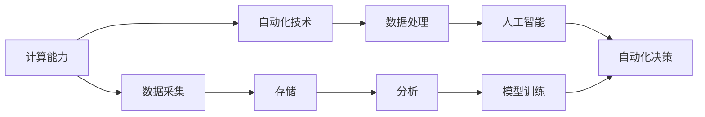

                 

## 1. 背景介绍

在过去几十年中，计算技术和自动化技术不断革新，推动了社会的进步和生产力的提升。无论是制造业中的自动化生产线，还是金融、医疗等领域的计算模型，计算和自动化技术的结合已经成为推动社会进步的关键驱动力。然而，计算和自动化技术的结合并非一蹴而就，而是随着技术的发展和应用场景的变化，不断深化和扩展的过程。本文将探讨计算和自动化技术的结合，分析其在各个领域的应用，以及未来发展的趋势和挑战。

### 1.1 问题由来

计算和自动化技术的结合可以追溯到上世纪中期，最初的自动化生产线、计算尺和电子计算器等设备使得生产过程更加高效和精确。随着计算机技术的发展，特别是高性能计算、大数据和人工智能技术的崛起，计算和自动化技术的结合变得更加紧密和复杂。计算和自动化技术的结合，不仅推动了各个行业的生产效率，也推动了新兴技术如无人驾驶、智能制造等的发展。然而，这种结合并非没有挑战，随着技术的不断进步，计算和自动化技术的结合也面临着新的问题和挑战。

### 1.2 问题核心关键点

计算和自动化技术的结合是一个复杂的过程，涉及到计算能力、自动化技术、数据处理和人工智能等多个方面。以下是计算和自动化技术结合的核心关键点：

- **计算能力**：高性能计算是自动化技术的基础，提供了数据处理和决策支持的能力。
- **自动化技术**：通过机器人、自动化设备和控制系统，自动化技术实现了生产过程的自动化。
- **数据处理**：数据是计算和自动化技术结合的纽带，提供了自动化决策的基础。
- **人工智能**：人工智能技术，如机器学习和深度学习，使得自动化决策更加精准和高效。

这些关键点相互作用，共同推动了计算和自动化技术的结合。在接下来的内容中，我们将详细介绍这些关键点，并探讨其在各个领域的应用。

## 2. 核心概念与联系

### 2.1 核心概念概述

为了更好地理解计算和自动化技术的结合，我们先介绍几个核心概念：

- **计算能力**：指的是计算机的处理速度、存储能力和计算精度等技术指标，是自动化技术的基础。
- **自动化技术**：指的是通过设备、软件和算法，实现生产过程的自动化，提高生产效率和产品质量。
- **数据处理**：指的是对数据进行采集、存储、处理和分析的过程，是计算和自动化技术的核心。
- **人工智能**：指的是通过机器学习和深度学习等技术，实现自动化决策和智能控制。

这些概念之间相互关联，共同构成了计算和自动化技术的结合。

### 2.2 核心概念原理和架构的 Mermaid 流程图



这个流程图展示了计算和自动化技术的结合过程。首先，通过计算能力对数据进行采集、存储和分析，然后利用人工智能技术进行模型训练和决策，最终通过自动化技术实现生产过程的自动化。

## 3. 核心算法原理 & 具体操作步骤

### 3.1 算法原理概述

计算和自动化技术的结合涉及多个算法和原理，包括计算能力优化、自动化技术实现和数据处理与分析等。以下将详细介绍这些算法和原理：

#### 3.1.1 计算能力优化

计算能力是自动化技术的基础，优化的计算能力能够提高自动化系统的响应速度和效率。常用的计算能力优化算法包括：

- **并行计算**：通过多核、分布式计算等技术，实现并行处理，提高计算效率。
- **GPU加速**：使用GPU进行计算，提高计算速度和性能。
- **量化和稀疏化**：通过降低计算精度和减少计算量，提高计算效率和存储效率。

#### 3.1.2 自动化技术实现

自动化技术是通过设备、软件和算法实现生产过程的自动化。常用的自动化技术包括：

- **机器人技术**：通过机械臂、机器人等设备，实现生产过程的自动化。
- **自动化控制系统**：通过传感器、PLC等设备，实现生产过程的自动控制和监控。
- **智能制造**：通过物联网、云计算和大数据等技术，实现生产过程的智能化和自动化。

#### 3.1.3 数据处理与分析

数据处理与分析是计算和自动化技术的核心，通过数据处理和分析，可以实现自动化决策。常用的数据处理和分析算法包括：

- **数据采集与存储**：通过传感器、数据库等设备，实现数据的采集和存储。
- **数据清洗与预处理**：通过清洗和预处理，提高数据质量。
- **数据分析与建模**：通过统计分析、机器学习和深度学习等技术，实现数据的分析和建模。

### 3.2 算法步骤详解

以下是一个详细的计算和自动化技术结合的算法步骤：

1. **数据采集与存储**：通过传感器、数据库等设备，实现数据的采集和存储。
2. **数据清洗与预处理**：通过清洗和预处理，提高数据质量。
3. **数据分析与建模**：通过统计分析、机器学习和深度学习等技术，实现数据的分析和建模。
4. **模型训练与优化**：通过模型训练和优化，提高模型的预测和决策能力。
5. **自动化决策与控制**：通过自动化控制系统，实现生产过程的自动化决策和控制。

### 3.3 算法优缺点

计算和自动化技术的结合带来了诸多优点，但也存在一些缺点：

#### 3.3.1 优点

- **提高生产效率**：通过自动化技术，实现生产过程的自动化，提高生产效率和产品质量。
- **降低成本**：通过计算能力优化，降低计算和存储成本，提高生产效率。
- **提高决策精度**：通过数据分析和建模，提高决策的精度和可靠性。

#### 3.3.2 缺点

- **数据质量问题**：数据采集和存储中的数据质量问题，会影响计算和自动化技术的效果。
- **技术复杂性**：计算和自动化技术的结合涉及多个技术环节，技术复杂性较高。
- **安全性问题**：计算和自动化技术的结合，涉及大量敏感数据和自动化决策，安全性问题需要特别注意。

### 3.4 算法应用领域

计算和自动化技术的结合在各个领域都有广泛的应用，以下是几个典型的应用领域：

#### 3.4.1 制造业

制造业是计算和自动化技术结合的重要领域，通过计算和自动化技术的结合，实现生产过程的自动化和智能化。常用的技术包括：

- **智能制造**：通过物联网、云计算和大数据等技术，实现生产过程的智能化和自动化。
- **机器人技术**：通过机械臂、机器人等设备，实现生产过程的自动化。
- **自动化控制系统**：通过传感器、PLC等设备，实现生产过程的自动控制和监控。

#### 3.4.2 金融业

金融业是计算和自动化技术结合的另一个重要领域，通过计算和自动化技术的结合，实现金融决策和风险控制。常用的技术包括：

- **高频交易**：通过计算能力优化和自动化控制系统，实现高频交易和自动化交易。
- **风险管理**：通过数据分析和建模，实现风险评估和管理。
- **智能投顾**：通过机器学习和深度学习技术，实现智能投顾和决策支持。

#### 3.4.3 医疗业

医疗业是计算和自动化技术结合的另一个重要领域，通过计算和自动化技术的结合，实现医疗决策和智能化医疗。常用的技术包括：

- **医学影像分析**：通过计算能力优化和自动化控制系统，实现医学影像的自动分析和诊断。
- **智能医疗设备**：通过机器人技术和自动化控制系统，实现医疗设备的智能化和自动化。
- **健康管理**：通过数据分析和建模，实现健康管理和疾病预防。

## 4. 数学模型和公式 & 详细讲解 & 举例说明

### 4.1 数学模型构建

在计算和自动化技术的结合中，数学模型是实现自动化决策的基础。以下是一个简化的数学模型：

假设有一个生产过程，生产效率为 $f(x)$，其中 $x$ 是生产参数。通过计算和自动化技术的结合，可以实现生产过程的自动化控制和优化，具体模型如下：

$$
y = f(x) + \epsilon
$$

其中，$\epsilon$ 是随机噪声，表示自动化系统中的不确定性。

### 4.2 公式推导过程

根据上述数学模型，可以进行如下推导：

1. **数据采集与存储**：通过传感器采集生产参数 $x$，存储在数据库中。
2. **数据清洗与预处理**：对采集的数据进行清洗和预处理，去除噪声和异常值。
3. **数据分析与建模**：通过统计分析、机器学习和深度学习等技术，建立模型 $f(x)$。
4. **模型训练与优化**：通过模型训练和优化，提高模型的预测和决策能力。
5. **自动化决策与控制**：通过自动化控制系统，实现生产过程的自动化决策和控制。

### 4.3 案例分析与讲解

以制造业中的智能制造为例，通过计算和自动化技术的结合，实现生产过程的自动化和智能化。具体步骤如下：

1. **数据采集与存储**：通过传感器采集生产参数 $x$，存储在数据库中。
2. **数据清洗与预处理**：对采集的数据进行清洗和预处理，去除噪声和异常值。
3. **数据分析与建模**：通过统计分析、机器学习和深度学习等技术，建立模型 $f(x)$，如神经网络模型。
4. **模型训练与优化**：通过模型训练和优化，提高模型的预测和决策能力，如使用梯度下降算法。
5. **自动化决策与控制**：通过自动化控制系统，实现生产过程的自动化决策和控制，如自动调整生产参数。

## 5. 项目实践：代码实例和详细解释说明

### 5.1 开发环境搭建

在计算和自动化技术的结合中，开发环境搭建是实现项目的关键步骤。以下是一个简化的开发环境搭建过程：

1. **安装Python环境**：安装Python 3.8及以上版本，并安装相关依赖包。
2. **安装计算能力优化工具**：安装如NumPy、Pandas、SciPy等计算能力优化工具。
3. **安装自动化技术工具**：安装如Robot Operating System (ROS)、OpenCV等自动化技术工具。
4. **安装数据处理和分析工具**：安装如TensorFlow、PyTorch等数据处理和分析工具。

### 5.2 源代码详细实现

以下是一个简化的计算和自动化技术结合的源代码实现：

```python
import numpy as np
import pandas as pd
import tensorflow as tf
import rospkg

# 数据采集与存储
def data_acquisition():
    # 使用传感器采集数据
    # ...
    # 存储数据到数据库
    # ...

# 数据清洗与预处理
def data_preprocessing(data):
    # 数据清洗
    # ...
    # 数据预处理
    # ...

# 数据分析与建模
def data_analysis(data):
    # 统计分析
    # ...
    # 机器学习建模
    # ...

# 模型训练与优化
def model_training(data):
    # 模型训练
    # ...
    # 模型优化
    # ...

# 自动化决策与控制
def automated_decision(data):
    # 自动化决策
    # ...
    # 自动化控制
    # ...

# 主函数
def main():
    # 数据采集与存储
    data = data_acquisition()
    # 数据清洗与预处理
    data = data_preprocessing(data)
    # 数据分析与建模
    model = data_analysis(data)
    # 模型训练与优化
    model = model_training(model)
    # 自动化决策与控制
    automated_decision(model)

if __name__ == "__main__":
    main()
```

### 5.3 代码解读与分析

以上代码实现了计算和自动化技术结合的整个过程。以下是代码的详细解读和分析：

- **数据采集与存储**：通过传感器采集数据，并存储到数据库中。
- **数据清洗与预处理**：对采集的数据进行清洗和预处理，去除噪声和异常值。
- **数据分析与建模**：通过统计分析和机器学习建模，建立模型。
- **模型训练与优化**：通过模型训练和优化，提高模型的预测和决策能力。
- **自动化决策与控制**：通过自动化控制系统，实现生产过程的自动化决策和控制。

## 6. 实际应用场景

计算和自动化技术的结合在各个领域都有广泛的应用，以下是几个典型的应用场景：

### 6.1 智能制造

在制造业中，通过计算和自动化技术的结合，实现生产过程的自动化和智能化。智能制造技术包括：

- **物联网技术**：通过物联网设备，实现生产过程的自动化和智能化。
- **大数据分析**：通过大数据分析，实现生产过程的优化和决策。
- **智能机器人**：通过智能机器人，实现生产过程的自动化和灵活性。

### 6.2 智能交通

在交通领域，通过计算和自动化技术的结合，实现交通管理和智能驾驶。智能交通技术包括：

- **智能交通系统**：通过智能交通系统，实现交通管理和智能化。
- **自动驾驶**：通过计算和自动化技术，实现自动驾驶和车辆控制。
- **数据分析**：通过数据分析，实现交通流量预测和管理。

### 6.3 智能农业

在农业领域，通过计算和自动化技术的结合，实现农业生产和智能化。智能农业技术包括：

- **智能设备**：通过智能设备，实现农业生产的自动化和智能化。
- **数据分析**：通过数据分析，实现农业生产优化和决策。
- **智能机器人**：通过智能机器人，实现农业生产的自动化和灵活性。

## 7. 工具和资源推荐

### 7.1 学习资源推荐

以下是一些学习资源推荐，帮助开发者深入理解计算和自动化技术的结合：

1. **《深度学习》课程**：斯坦福大学开设的深度学习课程，涵盖深度学习的基础理论和实际应用。
2. **《计算能力优化》教程**：介绍计算能力优化的技术方法和工具。
3. **《自动化技术》书籍**：介绍自动化技术的基础和应用。
4. **《数据处理与分析》书籍**：介绍数据处理和分析的技术方法和工具。
5. **《智能制造》书籍**：介绍智能制造的基础和应用。

### 7.2 开发工具推荐

以下是一些开发工具推荐，帮助开发者实现计算和自动化技术的结合：

1. **PyTorch**：深度学习框架，支持多种计算和自动化技术结合的应用。
2. **TensorFlow**：深度学习框架，支持多种计算和自动化技术结合的应用。
3. **ROS**：机器人操作系统，支持机器人技术的实现和应用。
4. **OpenCV**：计算机视觉库，支持图像处理和分析的应用。
5. **NumPy**：数学库，支持科学计算和数据处理的应用。

### 7.3 相关论文推荐

以下是一些相关论文推荐，帮助开发者深入理解计算和自动化技术的结合：

1. **《计算能力优化技术》**：介绍计算能力优化的技术方法和工具。
2. **《自动化技术应用》**：介绍自动化技术的基础和应用。
3. **《数据处理与分析》**：介绍数据处理和分析的技术方法和工具。
4. **《智能制造》**：介绍智能制造的基础和应用。
5. **《智能交通》**：介绍智能交通的基础和应用。

## 8. 总结：未来发展趋势与挑战

### 8.1 研究成果总结

计算和自动化技术的结合，在各个领域都有广泛的应用。以下是对当前研究成果的总结：

- **计算能力优化**：通过并行计算、GPU加速和量化等技术，提高计算能力。
- **自动化技术实现**：通过机器人技术、自动化控制系统等，实现生产过程的自动化。
- **数据处理与分析**：通过统计分析、机器学习和深度学习等技术，实现数据的分析和建模。
- **人工智能技术**：通过机器学习和深度学习等技术，实现自动化决策和智能控制。

### 8.2 未来发展趋势

未来，计算和自动化技术的结合将呈现以下几个趋势：

1. **智能化**：计算和自动化技术的结合将更加智能化，实现更高级的自动化和智能化。
2. **自动化**：自动化技术将更加普及，实现生产过程的全自动化。
3. **实时化**：计算和自动化技术的结合将更加实时化，实现实时决策和控制。
4. **协同化**：计算和自动化技术的结合将更加协同化，实现多设备、多系统的协同工作。

### 8.3 面临的挑战

计算和自动化技术的结合在发展过程中，也面临一些挑战：

1. **数据质量问题**：数据采集和存储中的数据质量问题，会影响计算和自动化技术的效果。
2. **技术复杂性**：计算和自动化技术的结合涉及多个技术环节，技术复杂性较高。
3. **安全性问题**：计算和自动化技术的结合，涉及大量敏感数据和自动化决策，安全性问题需要特别注意。
4. **资源消耗问题**：计算和自动化技术的结合，涉及大量计算和存储资源，资源消耗较大。

### 8.4 研究展望

未来，计算和自动化技术的结合需要在以下几个方面进行探索：

1. **计算能力优化**：探索新的计算能力优化技术，如量子计算、光子计算等，提高计算效率。
2. **自动化技术实现**：探索新的自动化技术，如无人驾驶、智能家居等，实现更高级的自动化。
3. **数据处理与分析**：探索新的数据处理和分析技术，如深度强化学习、联邦学习等，提高数据分析的效率和精度。
4. **人工智能技术**：探索新的人工智能技术，如神经网络、深度学习等，实现更高级的自动化决策和智能控制。

## 9. 附录：常见问题与解答

### Q1：计算和自动化技术的结合有哪些优缺点？

**A1**：计算和自动化技术的结合有以下优点：

- **提高生产效率**：通过自动化技术，实现生产过程的自动化，提高生产效率和产品质量。
- **降低成本**：通过计算能力优化，降低计算和存储成本，提高生产效率。
- **提高决策精度**：通过数据分析和建模，提高决策的精度和可靠性。

然而，计算和自动化技术的结合也存在一些缺点：

- **数据质量问题**：数据采集和存储中的数据质量问题，会影响计算和自动化技术的效果。
- **技术复杂性**：计算和自动化技术的结合涉及多个技术环节，技术复杂性较高。
- **安全性问题**：计算和自动化技术的结合，涉及大量敏感数据和自动化决策，安全性问题需要特别注意。

### Q2：计算和自动化技术的结合在各个领域有哪些应用？

**A2**：计算和自动化技术的结合在各个领域都有广泛的应用，以下是几个典型的应用：

- **制造业**：通过计算和自动化技术的结合，实现生产过程的自动化和智能化，如智能制造、机器人技术等。
- **金融业**：通过计算和自动化技术的结合，实现金融决策和风险控制，如高频交易、智能投顾等。
- **医疗业**：通过计算和自动化技术的结合，实现医疗决策和智能化医疗，如医学影像分析、智能医疗设备等。
- **交通领域**：通过计算和自动化技术的结合，实现交通管理和智能驾驶，如智能交通系统、自动驾驶等。
- **农业领域**：通过计算和自动化技术的结合，实现农业生产和智能化，如智能设备、数据分析等。

### Q3：计算和自动化技术的结合的未来趋势是什么？

**A3**：计算和自动化技术的结合的未来趋势如下：

1. **智能化**：计算和自动化技术的结合将更加智能化，实现更高级的自动化和智能化。
2. **自动化**：自动化技术将更加普及，实现生产过程的全自动化。
3. **实时化**：计算和自动化技术的结合将更加实时化，实现实时决策和控制。
4. **协同化**：计算和自动化技术的结合将更加协同化，实现多设备、多系统的协同工作。

### Q4：计算和自动化技术的结合面临哪些挑战？

**A4**：计算和自动化技术的结合在发展过程中，也面临一些挑战：

1. **数据质量问题**：数据采集和存储中的数据质量问题，会影响计算和自动化技术的效果。
2. **技术复杂性**：计算和自动化技术的结合涉及多个技术环节，技术复杂性较高。
3. **安全性问题**：计算和自动化技术的结合，涉及大量敏感数据和自动化决策，安全性问题需要特别注意。
4. **资源消耗问题**：计算和自动化技术的结合，涉及大量计算和存储资源，资源消耗较大。

### Q5：计算和自动化技术的结合的未来研究展望是什么？

**A5**：计算和自动化技术的结合的未来研究展望如下：

1. **计算能力优化**：探索新的计算能力优化技术，如量子计算、光子计算等，提高计算效率。
2. **自动化技术实现**：探索新的自动化技术，如无人驾驶、智能家居等，实现更高级的自动化。
3. **数据处理与分析**：探索新的数据处理和分析技术，如深度强化学习、联邦学习等，提高数据分析的效率和精度。
4. **人工智能技术**：探索新的人工智能技术，如神经网络、深度学习等，实现更高级的自动化决策和智能控制。

---

作者：禅与计算机程序设计艺术 / Zen and the Art of Computer Programming

