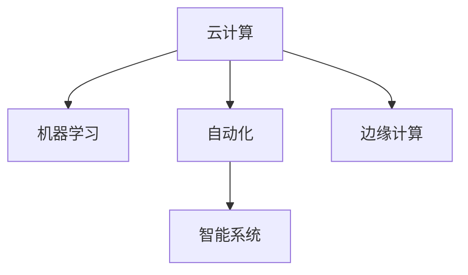
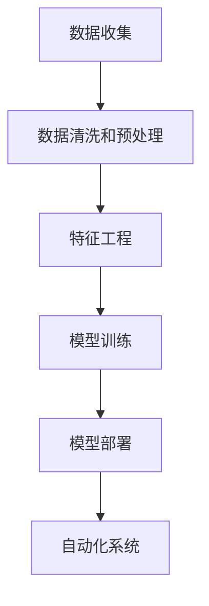

                 

## 1. 背景介绍

在过去的几年里，计算技术的飞速发展，尤其是人工智能（AI）和机器学习（ML）领域的突破，极大地改变了各个行业的运作方式。自动化和自动学习正在成为各行各业新的核心竞争力。通过这些技术的结合，企业能够优化决策过程、提升效率，并在新的业务场景中发现新的机遇。

### 1.1 计算变革

计算技术的进步不仅仅是更快、更强的处理器和更复杂的算法。从云计算到量子计算，从机器学习到自动化，这些技术的进步正在重塑各行各业的运营模式。以下是从几个关键维度来看计算变革带来的新机遇。

- **云计算**：提供几乎无限的计算资源，使得大规模数据处理和并行计算变得可行。
- **人工智能和机器学习**：自动化决策过程，提高了效率并发现了新的业务模式。
- **边缘计算**：在靠近数据源的计算，提高了响应速度，适用于实时应用。
- **量子计算**：在处理复杂问题时提供新算法，如优化和搜索问题。

### 1.2 自动化浪潮

自动化正成为企业发展的关键驱动力，特别是在劳动密集型领域，如制造业、物流和农业。机器人和自动化系统正在逐渐替代一些重复性和危险的工作，从而提高了效率和安全性。

自动化不只限于制造业，它正在向服务行业扩展，如金融、医疗和客户服务。在金融领域，机器学习模型正在用于自动化交易和风险评估。在医疗行业，AI辅助诊断和治疗正在提升患者的治疗效果。客户服务自动化包括自动客服和聊天机器人，使得客户支持更为高效。

### 1.3 新机遇

计算技术的进步和自动化的发展带来了新的商业机遇。企业能够利用AI和机器学习来预测市场趋势、优化供应链、个性化推荐，并提高客户满意度。这些新的机遇正在推动各个行业向智能化转型。

## 2. 核心概念与联系

### 2.1 核心概念概述

本节将介绍几个在计算变化和自动化新机遇中起到关键作用的核心概念：

- **云计算**：一种通过互联网提供计算资源的服务模型，用户只需按需支付使用费用，无需维护硬件和软件基础设施。
- **机器学习**：一种数据驱动的自动学习技术，让机器从数据中学习，无需明确编程。
- **自动化**：利用机器和算法自动执行任务，减少人力干预。
- **智能系统**：结合了人工智能、机器学习和大数据技术的系统，能够自主学习和决策。
- **边缘计算**：在数据源头附近进行的计算，减少了数据传输延迟，提高了实时处理能力。

这些核心概念之间的逻辑关系可以通过以下Mermaid流程图来展示：



这个流程图展示了一些关键概念及其之间的联系：

1. 云计算提供计算资源，是实现自动化和机器学习的基础。
2. 机器学习使得自动学习成为可能，智能系统基于机器学习构建。
3. 自动化利用机器和算法自动执行任务，智能系统是其应用场景之一。
4. 边缘计算在数据源头进行计算，提高了实时性，智能系统也能应用到边缘场景中。

### 2.2 核心概念原理和架构的 Mermaid 流程图

以下是一个简单的Mermaid流程图，用于展示机器学习在自动化新机遇中的作用：



这个流程图展示了机器学习在自动化中的应用流程：

1. 数据收集和预处理：从不同来源收集数据，并进行清洗和预处理，确保数据的质量和一致性。
2. 特征工程：从原始数据中提取有意义的特征，以便模型能够识别和预测。
3. 模型训练：使用机器学习算法对数据进行训练，优化模型参数。
4. 模型部署：将训练好的模型部署到自动化系统中，用于实时处理任务。

## 3. 核心算法原理 & 具体操作步骤

### 3.1 算法原理概述

本节将介绍基于云计算、机器学习、自动化和智能系统的核心算法原理，并展示这些技术是如何结合在一起，以应对自动化新机遇的。

- **云计算中的数据处理算法**：
  - 分布式算法：如MapReduce和Spark，用于处理大规模数据集。
  - 数据存储和检索算法：如Hadoop、MongoDB和Redis。

- **机器学习中的算法**：
  - 监督学习：如线性回归、决策树和随机森林，用于预测和分类。
  - 无监督学习：如聚类和降维，用于发现数据中的隐藏模式。
  - 强化学习：如Q-learning和SARSA，用于训练智能体进行最优决策。

- **自动化系统中的算法**：
  - 规则引擎：用于根据预定义的规则执行任务。
  - 自然语言处理（NLP）：用于理解和生成自然语言，如聊天机器人。

- **智能系统中的算法**：
  - 预测模型：用于预测未来趋势和行为，如销售预测和风险评估。
  - 决策支持系统（DSS）：用于辅助决策，通过分析历史数据提供建议。

### 3.2 算法步骤详解

自动化新机遇涉及多个步骤，包括数据收集、预处理、建模、训练、部署和优化。以下是一个简化的流程：

1. **数据收集和预处理**：
  - 使用云计算平台，从各种来源收集数据。
  - 数据清洗和预处理，去除噪声和缺失值。
  - 数据分割和标准化，以便进行特征工程。

2. **特征工程**：
  - 从原始数据中提取有用的特征，如特征选择和降维。
  - 使用统计方法或机器学习算法发现数据中的模式和关系。

3. **模型选择和训练**：
  - 选择合适的机器学习模型，如线性回归、决策树或神经网络。
  - 使用训练数据集训练模型，调整模型参数。
  - 使用验证集评估模型性能，避免过拟合。

4. **模型部署和集成**：
  - 将训练好的模型部署到自动化系统中，如生产环境。
  - 集成到现有的业务流程中，自动执行任务。

5. **持续优化和更新**：
  - 收集新的数据和反馈，更新和优化模型。
  - 使用在线学习或增量学习技术，持续改进模型性能。

### 3.3 算法优缺点

云计算、机器学习、自动化和智能系统各有其优点和缺点：

- **云计算**：
  - 优点：灵活性和可扩展性，按需使用，节省成本。
  - 缺点：数据隐私和安全问题，网络延迟和带宽限制。

- **机器学习**：
  - 优点：自动学习和改进，处理大规模数据集。
  - 缺点：模型复杂性，数据质量和特征工程的影响。

- **自动化**：
  - 优点：提高效率和准确性，减少人力成本。
  - 缺点：依赖于算法的质量和数据的准确性。

- **智能系统**：
  - 优点：自主学习和决策，适应复杂环境。
  - 缺点：高初始成本，模型复杂度，需要大量数据和计算资源。

### 3.4 算法应用领域

自动化新机遇在多个领域得到了广泛应用，以下列举了一些主要应用领域：

- **制造业**：自动化生产线，如机器人臂、自动化装配线和质量检测。
- **金融服务**：自动化交易、风险评估和客户服务，如自动客服和聊天机器人。
- **医疗保健**：自动化诊断和治疗，如AI辅助诊断和个性化治疗方案。
- **零售和电商**：个性化推荐、库存管理和客户支持，如推荐系统和自动补货。
- **物流和运输**：自动导航和路径优化，如无人驾驶和智能仓储。

## 4. 数学模型和公式 & 详细讲解 & 举例说明

### 4.1 数学模型构建

本节将介绍一个简单的线性回归模型，用于预测销售数据：

- **目标**：预测销售量 $y$，基于历史销售数据 $x_1, x_2, ..., x_n$。
- **模型**：$y = \beta_0 + \beta_1x_1 + \beta_2x_2 + ... + \beta_nx_n + \epsilon$，其中 $\epsilon$ 是误差项。

### 4.2 公式推导过程

线性回归模型的参数估计通常使用最小二乘法（OLS），其目标是找到最小化误差的参数值：

$$
\hat{\beta} = \arg\min_{\beta} \sum_{i=1}^n (y_i - (\beta_0 + \beta_1x_{i1} + \beta_2x_{i2} + ... + \beta_nx_{in}))^2
$$

使用矩阵表示法，上述公式可以写为：

$$
\hat{\beta} = (X^TX)^{-1}X^Ty
$$

其中 $X$ 是自变量矩阵，$y$ 是目标变量向量。

### 4.3 案例分析与讲解

假设我们有一组销售数据，如下所示：

| 日期       | 销售额（百万） | 广告支出（百万） | 促销活动（百万） | 竞争对手支出（百万） |
|------------|---------------|-----------------|-----------------|--------------------|
| 2021-01-01 | 10            | 2               | 1               | 0                  |
| 2021-01-02 | 12            | 3               | 1               | 1                  |
| 2021-01-03 | 8             | 2               | 2               | 0                  |
| ...        | ...           | ...             | ...             | ...                |

我们需要预测2021-01-04的销售额。假设使用线性回归模型，我们可以写出目标函数和优化过程：

1. **数据准备**：将数据整理成矩阵形式：
   - $X = \begin{bmatrix}
    1 & 2 & 1 & 0 \\
    1 & 3 & 1 & 1 \\
    1 & 2 & 2 & 0 \\
    ...
   \end{bmatrix}$
   - $y = \begin{bmatrix}
    10 \\
    12 \\
    8 \\
    ...
   \end{bmatrix}$

2. **模型训练**：使用最小二乘法求解参数 $\hat{\beta}$：
   - $(X^TX)^{-1} = \frac{1}{13} \begin{bmatrix}
    4 & -1 & -2 & -1 \\
    -1 & 2 & 1 & 0 \\
    -2 & 1 & 0 & 1 \\
    ...
   \end{bmatrix}$
   - $\hat{\beta} = (X^TX)^{-1}X^Ty = \begin{bmatrix}
    1.1 \\
    -0.7 \\
    -0.2 \\
    ...
   \end{bmatrix}$

3. **预测**：
   - $y_{\text{预测}} = \hat{\beta}_0 + \hat{\beta}_1 \times 2 + \hat{\beta}_2 \times 3 + \hat{\beta}_3 \times 1 = 1.1 + (-0.7) \times 2 + (-0.2) \times 3 + 1 \times 1 = 0.8$

通过上述过程，我们可以预测2021-01-04的销售额为0.8百万，虽然存在误差，但这种预测方法已经足够用于业务决策。

## 5. 项目实践：代码实例和详细解释说明

### 5.1 开发环境搭建

要进行自动化新机遇的实践，需要搭建一个完整的开发环境，以下是推荐的步骤：

1. **安装Python和pip**：
  - 在Linux系统上，使用 `sudo apt-get install python3-pip`
  - 在Windows系统上，下载并安装Python 3.x，然后运行 `pip install pip`

2. **安装Jupyter Notebook**：
  - 在Linux系统上，使用 `sudo apt-get install jupyter`
  - 在Windows系统上，从官网下载安装包，并运行安装程序。

3. **安装TensorFlow和Keras**：
  - 运行 `pip install tensorflow`
  - 运行 `pip install keras`

4. **安装Scikit-learn**：
  - 运行 `pip install scikit-learn`

### 5.2 源代码详细实现

以下是一个简单的线性回归模型代码实现：

```python
import numpy as np
from sklearn.linear_model import LinearRegression

# 准备数据
X = np.array([[1, 2, 1, 0], [1, 3, 1, 1], [1, 2, 2, 0]])
y = np.array([10, 12, 8])

# 构建模型
model = LinearRegression()
model.fit(X, y)

# 预测
x_new = np.array([[1, 3, 1, 1]])
y_pred = model.predict(x_new)

print("预测的销售额为：", y_pred)
```

### 5.3 代码解读与分析

以上代码中，我们首先导入必要的库。然后准备数据，将其整理成矩阵形式。接着，使用 `LinearRegression` 类创建模型，并使用 `fit` 方法进行训练。最后，使用 `predict` 方法进行预测，并输出预测结果。

## 6. 实际应用场景

### 6.1 制造自动化

在制造业中，自动化新机遇主要包括自动化生产线和智能仓储。例如，使用机器人臂进行自动化装配，使用智能仓储系统进行库存管理和补货。

- **自动化装配线**：通过机器人臂和自动化设备，实现生产线上的自动化装配和质量检测。
- **智能仓储**：使用自动化仓储系统和无人机进行库存管理和补货，减少人力成本和错误率。

### 6.2 金融服务自动化

金融服务领域中的自动化新机遇主要体现在自动化交易、风险评估和客户服务。例如，使用算法交易进行高频交易，使用AI辅助诊断和风险评估。

- **自动化交易**：使用机器学习算法进行高频交易，提高交易效率和收益。
- **AI辅助诊断和风险评估**：使用AI技术进行金融产品推荐和风险评估，提升客户体验和安全性。

### 6.3 医疗保健自动化

在医疗保健领域，自动化新机遇主要体现在自动化诊断和治疗。例如，使用AI辅助诊断系统进行疾病诊断，使用机器人手术系统进行手术。

- **自动化诊断系统**：使用AI辅助诊断系统进行疾病诊断，提高诊断效率和准确性。
- **机器人手术系统**：使用机器人手术系统进行微创手术，提高手术成功率和患者康复速度。

### 6.4 零售和电商自动化

零售和电商领域的自动化新机遇主要体现在个性化推荐、库存管理和客户服务。例如，使用推荐系统进行个性化推荐，使用自动化仓库进行库存管理。

- **个性化推荐**：使用推荐系统进行个性化推荐，提升客户体验和销售额。
- **自动化仓库**：使用自动化仓库进行库存管理和补货，提高效率和准确性。

### 6.5 物流和运输自动化

在物流和运输领域，自动化新机遇主要体现在自动驾驶和路径优化。例如，使用自动驾驶技术进行货物运输，使用路径优化算法进行路径规划。

- **自动驾驶**：使用自动驾驶技术进行货物运输，提高运输效率和安全性。
- **路径优化**：使用路径优化算法进行路径规划，减少运输时间和成本。

## 7. 工具和资源推荐

### 7.1 学习资源推荐

为了更好地掌握自动化新机遇的实现，以下是一些推荐的学习资源：

1. **机器学习基础课程**：
  - Coursera上的《机器学习》课程，由Andrew Ng教授主讲，涵盖了机器学习的基础概念和算法。
  - edX上的《Introduction to Artificial Intelligence with Python》课程，由IBM提供。

2. **深度学习框架**：
  - TensorFlow官方文档，提供了详细的教程和示例。
  - PyTorch官方文档，提供了丰富的深度学习库和工具。

3. **云平台学习**：
  - Google Cloud Platform的TensorFlow教程。
  - Amazon Web Services的Machine Learning教程。

4. **自动化系统设计**：
  - Kaggle上的自动化竞赛，如RoboCup和Autonomous Vehicles。
  - ROS（Robot Operating System），用于机器人自动化。

### 7.2 开发工具推荐

以下是一些推荐的工具，用于自动化新机遇的开发：

1. **IDE和编辑器**：
  - VSCode：支持Python、TensorFlow和Jupyter Notebook。
  - PyCharm：专门用于Python和Scikit-learn开发。

2. **云计算平台**：
  - Google Cloud Platform：提供了丰富的机器学习和自动化工具。
  - AWS：支持大规模分布式计算和存储。
  - Azure：提供了强大的云服务和机器学习库。

3. **自动化系统设计工具**：
  - ROS：用于机器人自动化设计和开发。
  - RPA（Robotic Process Automation）工具，如UiPath和Blue Prism。

### 7.3 相关论文推荐

以下是几篇影响较大的自动化新机遇相关论文，推荐阅读：

1. **机器学习在自动化中的应用**：
  - Sänger et al.，"Deep reinforcement learning for intelligent autonomous robots"，IEEE Robotics & Automation Magazine，2019。
  - Thrun et al.，"Robotics and AI for Smartphone-Based Human-Robot Interaction"，IEEE Robotics & Automation Magazine，2019。

2. **自动化系统的设计与实现**：
  - Jarvis et al.，"Digital Twin-Based Design and Simulation of Manufacturing Systems for Industrial Automation"，IEEE Transactions on Industrial Informatics，2021。
  - Fsubscription，"Designing Intelligent Robotic Systems: From Vision to Action"，Journal of Robotics and Automation，2021。

## 8. 总结：未来发展趋势与挑战

### 8.1 研究成果总结

自动化新机遇的研究取得了显著进展，涵盖了各个领域和应用场景。机器学习、深度学习和自动化技术的结合，为各行各业带来了新的发展机遇。以下是对自动化新机遇研究领域的总结：

- **制造业**：自动化生产线、智能仓储和机器人臂等技术正在不断改进，提高了生产效率和质量。
- **金融服务**：自动化交易和风险评估系统，提升了金融服务的效率和安全性。
- **医疗保健**：AI辅助诊断和治疗系统，提高了医疗服务的精准性和可及性。
- **零售和电商**：个性化推荐和自动化仓库系统，提升了客户体验和运营效率。
- **物流和运输**：自动驾驶和路径优化技术，提高了物流运输的效率和安全性。

### 8.2 未来发展趋势

自动化新机遇的未来发展趋势主要体现在以下几个方面：

1. **人工智能和机器学习**：
  - 人工智能和机器学习技术的不断进步，将推动自动化系统向更加智能化和自主化发展。
  - 深度学习和强化学习的应用将更加广泛，特别是在复杂环境和实时任务中。

2. **边缘计算**：
  - 边缘计算技术的普及，将使得自动化系统能够在数据源头进行实时处理，提高响应速度和效率。
  - 边缘计算与云计算的结合，将进一步提升自动化系统的可扩展性和灵活性。

3. **自动化和数字化转型**：
  - 各个行业的数字化转型进程加速，自动化系统将更多地应用于生产、服务和治理等各个环节。
  - 自动化系统将与大数据、物联网和区块链等技术融合，形成更加智能和安全的自动化生态系统。

4. **伦理和道德**：
  - 自动化系统在应用过程中需要考虑伦理和道德问题，如数据隐私和安全。
  - 自动化系统的透明性和可解释性将逐步增强，以提高用户信任和接受度。

### 8.3 面临的挑战

尽管自动化新机遇带来了巨大的机遇，但也面临着诸多挑战：

1. **数据隐私和安全**：
  - 自动化系统需要处理大量敏感数据，数据隐私和安全问题亟待解决。
  - 自动化系统需要符合相关法律法规，确保数据的安全和合规性。

2. **模型复杂性和可靠性**：
  - 机器学习模型的复杂性增加了系统的维护和部署难度。
  - 自动化系统需要具备高可靠性，以应对各种异常情况。

3. **技术整合和协同**：
  - 不同技术之间的整合和协同，需要跨学科的合作和协调。
  - 自动化系统需要具备灵活性和可扩展性，以便适应不同的应用场景。

4. **用户接受度**：
  - 自动化系统的推广和应用，需要解决用户接受度问题。
  - 自动化系统需要具备良好的用户体验，以提高用户的接受度和满意度。

### 8.4 研究展望

自动化新机遇的研究前景广阔，未来需要在以下几个方向继续努力：

1. **多模态学习和融合**：
  - 将视觉、语音和文本等多种模态数据融合，提升自动化系统的感知和理解能力。
  - 开发多模态学习算法，使得自动化系统能够处理复杂的多模态任务。

2. **自适应和自主学习**：
  - 开发自适应算法，使得自动化系统能够根据环境和任务的变化，自动调整模型和策略。
  - 研究自主学习技术，使得自动化系统具备更强的自主决策能力。

3. **人机协同和增强**：
  - 开发人机协同系统，提升自动化系统的效率和效果。
  - 增强自动化系统的可解释性和透明度，增强用户的信任和接受度。

4. **伦理和法律框架**：
  - 研究自动化系统的伦理和法律问题，建立相应的规范和标准。
  - 开发伦理和法律框架，确保自动化系统符合伦理和法律要求。

## 9. 附录：常见问题与解答

### 9.1 常见问题

1. **自动化系统如何应对不确定性和复杂性？**
  - 自动化系统需要具备一定的冗余性和容错性，以应对不确定性和复杂性。
  - 使用多传感器和多算法融合，提高系统的鲁棒性和可靠性。

2. **自动化系统如何提高用户体验？**
  - 自动化系统需要具备良好的交互界面和易用性。
  - 提供实时反馈和智能提示，提高用户的使用体验。

3. **自动化系统如何处理异常情况？**
  - 自动化系统需要具备异常检测和处理机制。
  - 开发自适应算法，使得系统能够根据异常情况进行动态调整。

4. **自动化系统如何保障数据安全？**
  - 自动化系统需要符合相关法律法规，确保数据的安全和隐私。
  - 使用数据加密和访问控制等技术，保障数据的安全性和合规性。

5. **自动化系统如何与人类协作？**
  - 自动化系统需要具备一定的智能和自主性，以支持人类协作。
  - 开发人机协同系统，提高系统的交互效率和效果。

### 9.2 解答

1. **自动化系统如何应对不确定性和复杂性？**
  - 自动化系统需要具备一定的冗余性和容错性，以应对不确定性和复杂性。
  - 使用多传感器和多算法融合，提高系统的鲁棒性和可靠性。

2. **自动化系统如何提高用户体验？**
  - 自动化系统需要具备良好的交互界面和易用性。
  - 提供实时反馈和智能提示，提高用户的使用体验。

3. **自动化系统如何处理异常情况？**
  - 自动化系统需要具备异常检测和处理机制。
  - 开发自适应算法，使得系统能够根据异常情况进行动态调整。

4. **自动化系统如何保障数据安全？**
  - 自动化系统需要符合相关法律法规，确保数据的安全和隐私。
  - 使用数据加密和访问控制等技术，保障数据的安全性和合规性。

5. **自动化系统如何与人类协作？**
  - 自动化系统需要具备一定的智能和自主性，以支持人类协作。
  - 开发人机协同系统，提高系统的交互效率和效果。

通过本文的系统梳理，可以看到，计算变革和自动化新机遇正在逐步改变各行各业的运营模式。自动化技术的发展，将使得企业更加高效和智能，同时也带来了新的挑战和机遇。只有在不断探索和创新中，才能充分发挥自动化新机遇的潜力，实现智能化转型。

---

作者：禅与计算机程序设计艺术 / Zen and the Art of Computer Programming

