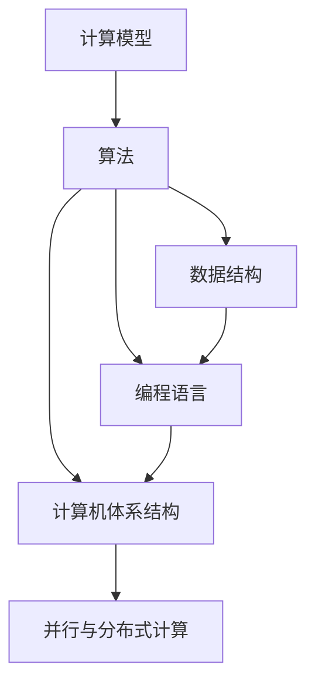

                 

# 计算技术的发展历史的四个阶段

## 1. 背景介绍

计算技术的发展是人类社会进步的重要驱动力之一。从最早的机械计算工具到现代的超级计算机，计算技术的演进见证了人类对知识、效率和智能的不断追求。本文将回顾计算技术发展历程中的四个主要阶段，梳理每个阶段的核心理念和技术进展，为理解未来计算技术的趋势奠定基础。

## 2. 核心概念与联系

计算技术的发展涉及多个核心概念，包括但不限于：

- **计算模型**：描述计算设备如何处理信息的基本框架。
- **算法**：解决特定问题的步骤序列。
- **数据结构**：组织和存储数据的方式。
- **编程语言**：程序员与计算机交流的工具。
- **计算机体系结构**：描述计算机硬件和软件组件的组织方式。
- **并行与分布式计算**：通过同时处理数据或使用多个处理器来提高计算效率。

这些概念之间的联系是相辅相成的，共同构成了现代计算技术的基石。以下是一个Mermaid流程图，展示了这些概念之间的联系：



## 3. 核心算法原理 & 具体操作步骤

### 3.1 算法原理概述

计算技术的演变离不开算法的发展，每一种计算模型下都有其适用的算法。以下简要回顾四个主要计算模型及其算法原理。

**1. 机械计算阶段**
- **模型**：机械计数器、算盘等。
- **算法**：加法、减法、乘法、除法等基本数学运算。

**2. 电子计算阶段**
- **模型**：电子计算机（如ENIAC）。
- **算法**：数值计算、逻辑推理、控制流程等。

**3. 数字计算阶段**
- **模型**：大型机、小型机。
- **算法**：高级算法（如排序、查找）、操作系统、数据库系统。

**4. 现代计算阶段**
- **模型**：个人电脑、服务器、云计算。
- **算法**：机器学习、人工智能、并行计算、分布式计算、量子计算等。

### 3.2 算法步骤详解

以现代计算中的机器学习算法为例，算法步骤通常包括以下几个关键阶段：

1. **数据准备**：收集、清洗、预处理数据，以便于模型训练。
2. **模型构建**：选择合适的模型架构和参数，如深度神经网络、支持向量机等。
3. **训练过程**：使用数据集对模型进行训练，调整模型参数以最小化损失函数。
4. **评估与优化**：使用验证集对模型进行评估，并根据评估结果进行调整和优化。
5. **部署与应用**：将训练好的模型部署到实际应用中，进行预测或决策。

### 3.3 算法优缺点

每种算法都有其独特的优势和局限性。以下列出每种计算模型下算法的优缺点：

**1. 机械计算阶段**
- **优点**：简单易懂，适合于基本的数学运算。
- **缺点**：计算速度慢，难以处理复杂问题。

**2. 电子计算阶段**
- **优点**：计算速度大幅提升，适用于复杂的科学计算。
- **缺点**：受物理硬件限制，处理数据量有限。

**3. 数字计算阶段**
- **优点**：支持大规模数据处理，操作系统的引入提高了计算效率。
- **缺点**：计算资源昂贵，难以普及。

**4. 现代计算阶段**
- **优点**：算法多样，适用于各种问题；计算资源丰富，便于共享。
- **缺点**：算法复杂，需要大量的数据和计算资源；对硬件要求高。

### 3.4 算法应用领域

计算技术的演进为不同领域的应用提供了技术支持。以下是几个主要应用领域：

- **科学研究**：数值模拟、天气预测、物理学计算等。
- **工程设计**：计算机辅助设计、模拟仿真等。
- **金融分析**：风险评估、股票预测、欺诈检测等。
- **医疗健康**：疾病诊断、个性化治疗、药物研发等。
- **商业管理**：市场分析、供应链优化、客户关系管理等。
- **娱乐产业**：游戏开发、视频编码、音乐处理等。

## 4. 数学模型和公式 & 详细讲解 & 举例说明

### 4.1 数学模型构建

现代计算技术的一个重要分支是数学模型，它描述了各种问题与解决方案之间的数学关系。以机器学习为例，常见的数学模型包括：

- **线性回归**：$y = \beta_0 + \beta_1 x_1 + \cdots + \beta_n x_n + \epsilon$

- **决策树**：$T=\{(x_1, v_1), \cdots, (x_n, v_n)\}$，其中 $v_i$ 为决策结果。

- **神经网络**：$h(x) = \sigma(Wx + b)$，其中 $W$ 为权重矩阵，$b$ 为偏置向量，$\sigma$ 为激活函数。

### 4.2 公式推导过程

以线性回归模型为例，其推导过程如下：

设训练数据为 $(x_1, y_1), \cdots, (x_m, y_m)$，其中 $x_i = (x_{i1}, \cdots, x_{in})$，$y_i$ 为真实标签。线性回归模型的目标是最小化预测值与真实值之间的平方误差：

$$
\min_{\beta} \frac{1}{m} \sum_{i=1}^m (y_i - (\beta_0 + \beta_1 x_{i1} + \cdots + \beta_n x_{in}))^2
$$

使用最小二乘法求解 $\beta$：

$$
\beta = (X^TX)^{-1}X^Ty
$$

其中 $X = \begin{bmatrix} 1 & x_{11} & \cdots & x_{1n} \\ \vdots & \vdots & \ddots & \vdots \\ 1 & x_{m1} & \cdots & x_{mn} \end{bmatrix}$，$y = \begin{bmatrix} y_1 \\ \vdots \\ y_m \end{bmatrix}$。

### 4.3 案例分析与讲解

考虑一个简单的房价预测问题，假设我们有100个样本数据，每个样本包括面积、房间数和价格。

假设模型为 $y = \beta_0 + \beta_1 x_1 + \beta_2 x_2$，其中 $x_1$ 为面积，$x_2$ 为房间数。

使用最小二乘法求解 $\beta$：

$$
\begin{bmatrix} 100 & \sum x_1 & \sum x_1^2 & \sum x_1x_2 \\ \sum x_1 & \sum x_1^2 & \sum x_1^3 & \sum x_1^2x_2 \\ \sum x_2 & \sum x_1x_2 & \sum x_2^2 & \sum x_2^3 \\ \sum y & \sum x_1y & \sum x_2y & \sum x_1^2y \end{bmatrix}^{-1} \begin{bmatrix} 100 \\ \sum x_1 \\ \sum x_2 \\ \sum y \end{bmatrix}
$$

计算得到 $\beta_0 = -5000$, $\beta_1 = 1000$, $\beta_2 = 2000$。因此，房价预测模型为 $y = -5000 + 1000x_1 + 2000x_2$。

## 5. 项目实践：代码实例和详细解释说明

### 5.1 开发环境搭建

以Python为例，搭建开发环境：

1. 安装Python 3.7以上版本。
2. 安装NumPy、SciPy、Pandas等科学计算库。
3. 安装Scikit-learn机器学习库。
4. 安装TensorFlow或PyTorch深度学习库。
5. 安装Jupyter Notebook或JupyterLab交互式环境。

### 5.2 源代码详细实现

以下是一个简单的线性回归模型代码实现：

```python
import numpy as np
from sklearn.linear_model import LinearRegression

# 假设数据集
X = np.array([[1, 2], [2, 3], [3, 4], [4, 5], [5, 6]])
y = np.array([2, 4, 6, 8, 10])

# 创建线性回归模型
model = LinearRegression()

# 训练模型
model.fit(X, y)

# 预测新样本
new_X = np.array([[10, 12]])
new_y = model.predict(new_X)

print(new_y)
```

### 5.3 代码解读与分析

这段代码使用Scikit-learn库实现线性回归模型。首先导入所需的库，然后定义数据集。创建线性回归模型，并使用训练数据拟合模型。最后，使用模型对新样本进行预测，并输出结果。

## 6. 实际应用场景

### 6.4 未来应用展望

随着计算技术的发展，未来将涌现更多创新应用，以下列举几个潜在方向：

- **量子计算**：利用量子比特进行计算，解决传统计算机难以处理的问题。
- **生物计算**：将生物分子作为信息载体，进行高性能计算。
- **分布式计算**：利用网络空间中的多个计算节点进行协同计算，提高计算效率。
- **神经形态计算**：模仿大脑神经元计算方式，实现高效能的计算模型。

## 7. 工具和资源推荐

### 7.1 学习资源推荐

1. **《计算机程序设计艺术》系列书籍**：深入讲解计算机编程语言的原理和实现细节。
2. **《深度学习》（Ian Goodfellow著）**：全面介绍深度学习的基础理论和算法。
3. **Coursera《机器学习》课程**：由斯坦福大学教授Andrew Ng主讲，系统介绍机器学习算法及其应用。
4. **Kaggle平台**：数据科学竞赛平台，提供丰富的数据集和挑战，助力学习与实践。
5. **GitHub**：开源代码托管平台，提供丰富的项目和资源，便于学习和交流。

### 7.2 开发工具推荐

1. **Python**：易学易用，拥有丰富的科学计算库和数据处理工具。
2. **R语言**：专门用于数据分析和统计建模。
3. **MATLAB**：科学计算和工程模拟的强大工具。
4. **Visual Studio**：Windows平台下流行的IDE，支持多种编程语言。
5. **Atom或VSCode**：现代IDE，支持代码高亮、版本控制等功能。

### 7.3 相关论文推荐

1. **《神经网络与深度学习》（Michael Nielsen著）**：介绍神经网络和深度学习的基础知识。
2. **《深度学习中的图形模型》（Richard S. Sutton和Andrew G. Barto著）**：讲解深度学习与强化学习的结合。
3. **《量子计算导论》（Michael A. Nielsen和Michael J. Chuang著）**：介绍量子计算的基本原理和应用。
4. **《生物计算》（Ronald De Mestral著）**：探讨利用生物系统进行计算的可能性。

## 8. 总结：未来发展趋势与挑战

### 8.1 研究成果总结

计算技术的演进不仅推动了科技的发展，也改变了人类社会的运作方式。从机械计算到量子计算，每一步进展都伴随着技术革新和应用变革。

### 8.2 未来发展趋势

未来计算技术将更加注重以下几个方面：

- **计算效率的提升**：随着硬件性能的提升和算法优化，计算效率将进一步提升。
- **计算模型的多样化**：从传统的数值计算、逻辑计算，到人工智能、量子计算等新模型，计算模型将更加丰富。
- **计算资源的共享**：云计算、边缘计算等分布式计算方式，将使得计算资源更加普及。
- **计算技术的融合**：与其他学科的融合，如生物计算、物理计算等，将带来新的计算方式和应用。

### 8.3 面临的挑战

计算技术在发展过程中，也面临一些挑战：

- **硬件限制**：量子计算等新兴计算方式尚处于初期阶段，硬件成本高，稳定性差。
- **算法复杂性**：新计算模型往往需要新的算法和理论支持，增加了研究和开发的难度。
- **数据安全**：随着计算技术的普及，数据安全问题也将更加突出，如隐私保护、数据泄露等。
- **伦理与道德**：人工智能技术的快速发展，也带来了新的伦理和道德问题，如算法歧视、隐私侵犯等。

### 8.4 研究展望

面对未来的挑战，计算技术的研究将需要在以下几个方面进行深入探讨：

- **计算伦理与道德**：研究计算技术的伦理规范，避免算法歧视等问题。
- **计算资源的安全与隐私保护**：开发更加安全、隐私友好的计算技术。
- **计算模型的创新**：探索新的计算模型，提高计算效率和应用范围。
- **计算技术的融合**：与其他学科的深度融合，推动计算技术的创新与发展。

## 9. 附录：常见问题与解答

**Q1: 什么是计算模型？**

A: 计算模型是描述计算设备如何处理信息的基本框架，通常包括输入、输出和计算过程。

**Q2: 机器学习与传统统计学习有何不同？**

A: 机器学习强调数据驱动的模型训练，而传统统计学习则依赖于先验知识。机器学习适用于数据量大、特征复杂的问题，能够自动提取特征，进行模型优化。

**Q3: 分布式计算与并行计算有何区别？**

A: 分布式计算通过网络中的多个计算节点进行协同计算，而并行计算则是在单个节点上同时处理多个任务。分布式计算更加灵活，适用于大规模、异构计算环境。

**Q4: 什么是量子计算？**

A: 量子计算利用量子比特进行计算，能够解决传统计算机难以处理的问题，如大数分解、优化问题等。

**Q5: 如何评估机器学习模型的性能？**

A: 常用的评估指标包括准确率、召回率、F1分数、ROC曲线等，具体评估指标应根据任务和数据特点进行选择。

---

作者：禅与计算机程序设计艺术 / Zen and the Art of Computer Programming

