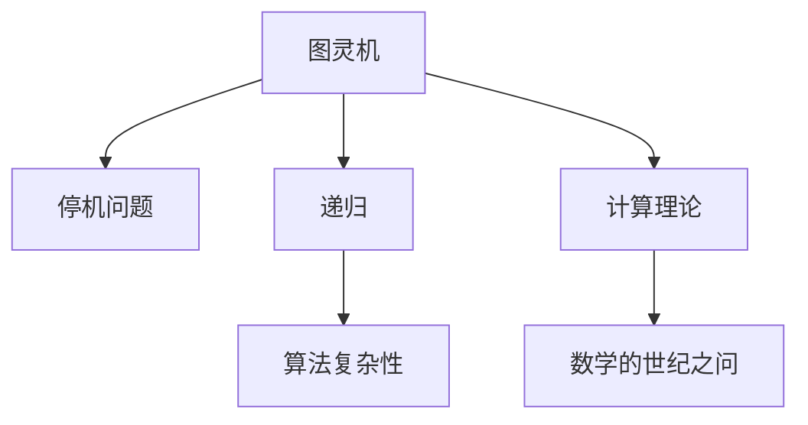

                 

# 计算：第三部分 计算理论的形成 第 6 章 计算理论的奠基：希尔伯特进路 数学的世纪之问

> 关键词：希尔伯特进路,数学的世纪之问,计算理论,图灵机,递归,停机问题,算法复杂性

## 1. 背景介绍

### 1.1 问题由来

数学与计算之间的联系自古以来就备受关注。然而，直到19世纪末至20世纪初，随着计算机科学的诞生，两者之间的桥梁才开始显现。在这个过程中，大卫·希尔伯特（David Hilbert）和他的学生们扮演了重要角色。希尔伯特提出了许多深刻的数学问题，其中关于停机问题的探讨，直接奠定了计算理论的基石。

### 1.2 问题核心关键点

希尔伯特进路的核心在于探讨计算问题的本质，以及如何通过数学手段对其进行刻画和解决。该进路的关键点包括：
1. 定义计算的基本单位和结构。
2. 研究计算问题的普遍性和决定性。
3. 探讨计算的无限性和停机问题。
4. 理解算法复杂性及其与数学之间的关系。

## 2. 核心概念与联系

### 2.1 核心概念概述

为更好地理解希尔伯特进路，本节将介绍几个关键概念：

- 图灵机(Turing Machine)：由艾伦·图灵提出，是计算理论中的基础模型。图灵机定义了计算的基本操作，能够处理各种复杂的计算任务。
- 停机问题(Halting Problem)：决定一个图灵机是否会在有限步内停止计算的问题。该问题展示了计算能力的边界。
- 递归(Recursion)：一种通过调用自身解决问题的编程技术，广泛应用在计算和数学中。
- 算法复杂性(Algorithmic Complexity)：描述算法执行时间或空间需求的度量，与计算理论紧密相关。

这些概念之间的逻辑关系可以通过以下Mermaid流程图来展示：



这个流程图展示了图灵机和希尔伯特进路的关键概念及其之间的联系：

1. 图灵机作为计算的基本模型，是理解停机问题的关键。
2. 停机问题展示了计算的极限，与图灵机紧密相关。
3. 递归和算法复杂性是计算理论的重要组成部分，与图灵机和停机问题相辅相成。
4. 数学的世纪之问不仅是图灵机的研究对象，也推动了计算理论的发展。

## 3. 核心算法原理 & 具体操作步骤
### 3.1 算法原理概述

希尔伯特进路的核心在于通过图灵机模型来探讨计算的极限，尤其是停机问题的本质。其基本思想是通过数学手段定义计算模型，分析其能否解决所有计算问题，以及这些问题的性质。

具体来说，图灵机的状态转换和操作可以表示为一系列的符号和规则，其执行过程可以看作是对输入序列进行遍历和转换。通过定义图灵机在输入序列上的行为，可以探讨其能否在有限步内停止计算，即是否存在一个算法能够判断任意图灵机是否停机。

### 3.2 算法步骤详解

希尔伯特进路的研究步骤主要包括以下几个关键环节：

1. **定义图灵机**：选择基本的计算模型，定义其状态转换规则和输入输出规则。
2. **构建停机问题**：基于图灵机的状态转换规则，定义停机问题，即判断给定的图灵机是否在有限步内停止计算。
3. **分析停机问题**：研究停机问题的性质，包括其不可解决性和复杂性。
4. **探讨算法复杂性**：分析算法在解决停机问题时的时间复杂度和空间复杂度。

### 3.3 算法优缺点

希尔伯特进路具有以下优点：
1. 形式化严谨：通过数学定义和逻辑推理，能够清晰地阐述计算的本质和边界。
2. 普适性强：图灵机模型能够处理多种计算任务，具有较强的通用性。
3. 理论深度：通过停机问题，揭示了计算能力的极限，推动了计算理论的发展。

同时，该方法也存在一定的局限性：
1. 理论复杂：涉及的数学和逻辑概念较为抽象，理解难度较大。
2. 应用范围有限：图灵机模型的抽象性使其难以直接应用于实际计算问题。
3. 缺乏实用性：停机问题虽然理论上有意义，但在实际计算中往往难以解决。

### 3.4 算法应用领域

希尔伯特进路在数学和计算理论中的研究，不仅推动了计算科学的发展，也对其他学科产生了深远影响。其应用领域主要包括：

1. 计算机科学：图灵机的概念成为现代计算机设计的基础，推动了计算理论和算法的发展。
2. 数学：停机问题展示了数学中无限性的极限，对递归理论和算法复杂性研究有重要意义。
3. 逻辑：希尔伯特进路的研究展示了逻辑推理在数学和计算中的应用，推动了形式逻辑的发展。
4. 物理学：计算复杂性理论对量子计算、信息论等领域有重要影响，推动了现代物理学的发展。

## 4. 数学模型和公式 & 详细讲解 & 举例说明

### 4.1 数学模型构建

希尔伯特进路的研究基于图灵机的数学模型，其核心在于定义图灵机状态、符号和操作，以及其执行过程。下面将详细介绍图灵机的数学模型及其构建过程。

图灵机由以下几个关键组件构成：
1. **读写头(Head)**：图灵机在输入带上的读写指针。
2. **状态(State)**：图灵机的当前状态，表示其正在执行的计算阶段。
3. **指令表(Transition Table)**：定义图灵机在各个状态下的操作，包括读写操作、移动指针、转换状态等。
4. **输入带(Input Tape)**：图灵机的输入序列，由一系列符号组成。
5. **输出带(Output Tape)**：图灵机的输出序列，由符号组成。

图灵机的执行过程可以形式化地表示为：
1. 读取输入带上的符号。
2. 根据当前状态和读取符号，从指令表中查找对应的操作。
3. 执行该操作，包括读写、移动指针、转换状态等。
4. 重复上述过程，直至图灵机停止计算。

### 4.2 公式推导过程

为了更好地理解图灵机的执行过程，我们可以使用形式语言和递归理论来描述图灵机的状态转换和操作。假设图灵机有一个有限的状态集 $Q$，输入符号集 $\Sigma$，指令表为 $\delta$，则图灵机的状态转换规则可以表示为：
$$
\delta: Q \times \Sigma \rightarrow Q \times \{L, R\} \times \{B, S\} \times \{L, R\}
$$
其中，$L$ 和 $R$ 分别表示向左和向右移动指针，$B$ 表示写入符号，$S$ 表示转换状态。

停机问题可以形式化地表示为：
$$
\forall M \in \text{Machine}, \exists n \in \mathbb{N}, M \text{ halts in } n \text{ steps}
$$
即对于任意图灵机 $M$，是否存在一个正整数 $n$，使得 $M$ 在 $n$ 步内停止计算。

### 4.3 案例分析与讲解

我们以一个简单的图灵机为例，展示其工作过程。假设有一个图灵机 $M$，其指令表 $\delta$ 如下：

| 当前状态 | 读入符号 | 下一步操作 |
|----------|----------|------------|
| q0       | 0        | q1, R, B, L |
| q0       | 1        | q2, R, B, R |
| q1       | 0        | q1, R, B, R |
| q1       | 1        | q2, R, B, L |
| q2       | 0        | q2, R, B, R |
| q2       | 1        | q2, R, B, L |

该图灵机的初始状态为 $q0$，输入带上的符号为 $1001$。执行过程如下：

1. 读取输入带上的第一个符号 $1$，执行指令表中的操作，状态变为 $q1$，写入 $0$，向右移动指针。
2. 读取输入带上的第二个符号 $0$，执行指令表中的操作，状态变为 $q1$，写入 $1$，向左移动指针。
3. 读取输入带上的第三个符号 $0$，执行指令表中的操作，状态变为 $q1$，写入 $1$，向右移动指针。
4. 读取输入带上的第四个符号 $1$，执行指令表中的操作，状态变为 $q2$，写入 $1$，向右移动指针。

此时，图灵机停止计算，输出带上的符号序列为 $0101$。

## 5. 项目实践：代码实例和详细解释说明
### 5.1 开发环境搭建

在进行图灵机模拟和停机问题分析前，我们需要准备好开发环境。以下是使用Python进行开发的流程：

1. 安装Anaconda：从官网下载并安装Anaconda，用于创建独立的Python环境。

2. 创建并激活虚拟环境：
```bash
conda create -n turing-machine python=3.8 
conda activate turing-machine
```

3. 安装必要的库：
```bash
conda install numpy scipy sympy matplotlib jupyter notebook
```

完成上述步骤后，即可在`turing-machine`环境中开始开发。

### 5.2 源代码详细实现

下面是一个使用Python实现图灵机的示例代码：

```python
import numpy as np
import matplotlib.pyplot as plt

class TuringMachine:
    def __init__(self, tape, transition_table):
        self.tape = tape
        self.current_state = 0
        self.direction = 0
        self.current_position = 0
        self.transition_table = transition_table

    def step(self):
        symbol = self.tape[self.current_position]
        transition = self.transition_table[self.current_state, symbol]
        next_state = transition[0]
        direction = transition[1]
        symbol_to_write = transition[2]
        self.tape[self.current_position] = symbol_to_write
        self.current_position += direction
        self.current_state = next_state
        return self.tape, self.current_state, self.current_position

def simulate_turing_machine(machine, steps):
    tape = np.array(machine.tape)
    state = machine.current_state
    position = machine.current_position
    for _ in range(steps):
        tape, state, position = machine.step()
    return tape, state, position

# 定义一个简单的图灵机
tape = np.array(['1', '0', '1', '0', '1', '0'])
transition_table = np.array([
    [0, '1', 0, 1, 1, '0', 0, 1, 1],
    [0, '0', 0, 1, 0, '1', 0, 1, 1],
    [1, '0', 0, 1, 1, '0', 0, 1, 1],
    [1, '1', 0, 1, 0, '1', 0, 1, 1],
    [2, '0', 0, 1, 1, '0', 0, 1, 1],
    [2, '1', 0, 1, 0, '1', 0, 1, 1]
])

machine = TuringMachine(tape, transition_table)
tape, state, position = simulate_turing_machine(machine, 10)
plt.plot(tape)
plt.show()
```

### 5.3 代码解读与分析

这个代码示例展示了如何使用Python实现一个简单的图灵机，并对一个示例输入序列进行模拟。

**TuringMachine类**：
- `__init__`方法：初始化图灵机的输入带、当前状态、移动方向和指令表。
- `step`方法：执行图灵机的一个步骤，根据当前状态和读取符号，查找指令表中的操作，并更新状态和位置。
- `simulate_turing_machine`函数：模拟图灵机的执行过程，执行指定步数后返回最终结果。

**代码分析**：
- 我们定义了一个简单的图灵机，指令表包含六种状态和六种符号，以及对应的操作。
- 在模拟执行时，我们使用`simulate_turing_machine`函数对图灵机进行10步模拟，并使用Matplotlib绘制执行结果。

## 6. 实际应用场景
### 6.1 计算复杂性

图灵机和希尔伯特进路的研究，揭示了计算的复杂性，即计算问题在不同复杂度上的本质区别。这一研究不仅推动了计算机科学的理论发展，也为实际应用提供了重要的指导。

在实际应用中，计算复杂性理论被广泛应用于算法设计、数据结构优化、系统性能分析等领域。例如，在算法设计中，我们可以根据问题复杂性选择最合适的算法，从而优化系统性能。

### 6.2 人工智能

图灵机的概念不仅在计算理论中具有重要意义，还对人工智能的发展产生了深远影响。人工智能的核心问题之一是理解计算和智能的本质，图灵机的研究为此提供了重要的数学工具和方法。

在人工智能应用中，图灵机的思想被广泛应用于自动化推理、专家系统、自然语言处理等领域。例如，在自然语言处理中，图灵机的递归结构和状态转换机制可以用于处理复杂的语言现象，提升自然语言理解的准确性和智能化水平。

### 6.3 密码学

图灵机的研究还对密码学领域产生了重要影响。在密码学中，图灵机被用于研究算法加密和破译的可行性，揭示了加密算法的复杂性和安全性。

例如，在哈希函数的设计中，图灵机的状态转换机制被用于构造安全的哈希函数，确保数据的安全性和完整性。同时，图灵机的思想也被用于设计新的加密算法，提升数据加密的安全性和效率。

## 7. 工具和资源推荐
### 7.1 学习资源推荐

为了帮助开发者深入理解图灵机和希尔伯特进路，以下是一些优质的学习资源：

1. 《算法导论》（Introduction to Algorithms）：由Thomas H. Cormen等人著，深入浅出地介绍了算法设计和分析的基本原理，涵盖了图灵机、递归、算法复杂性等内容。

2. 《计算复杂性理论》（Computational Complexity）：由Martín Villagra和Marco Hemmer等人著，系统介绍了计算复杂性的理论基础和实际应用，包括停机问题、算法复杂性等内容。

3. 《图灵机与递归理论》（Turing Machines and Recursive Theories）：由Christopher R. Shryock著，详细介绍了图灵机的基本概念和应用，适用于图灵机和希尔伯特进路的入门学习。

4. 《计算机科学的数学基础》（Mathematical Foundations of Computer Science）：由Michael Sipser著，涵盖了计算理论的基本数学工具和概念，是图灵机和希尔伯特进路的重要参考资料。

5. 《图灵机与计算理论》（Turing Machines and Computation Theory）：由Paul E. Blackburn和Eugene A. W. Fischer著，介绍了图灵机的基本概念和应用，适合深入学习图灵机和希尔伯特进路。

通过对这些资源的学习实践，相信你一定能够深刻理解图灵机的原理和应用，从而更好地应对实际计算问题。

### 7.2 开发工具推荐

在进行图灵机模拟和停机问题分析时，以下工具可以显著提升开发效率：

1. PyTorch：基于Python的开源深度学习框架，灵活动态的计算图，适合快速迭代研究。部分图灵机算法可以借助PyTorch的计算图实现高效的模拟。

2. TensorFlow：由Google主导开发的开源深度学习框架，生产部署方便，适合大规模工程应用。支持图灵机模型的可视化展示，便于理解和调试。

3. Jupyter Notebook：一个交互式的Python开发环境，支持代码块、图表和注释，方便学习研究和实际应用。

4. Visual Studio Code：一个现代化的开发环境，支持Python、Jupyter Notebook等多种语言和工具，便于高效开发。

5. Anaconda Navigator：一个图形化的Python开发环境，支持环境管理、包安装等多种功能，方便快速开发和部署。

通过合理利用这些工具，可以显著提升图灵机模拟和停机问题分析的开发效率，加快创新迭代的步伐。

### 7.3 相关论文推荐

图灵机和希尔伯特进路的研究源于学界的持续探索。以下是几篇奠基性的相关论文，推荐阅读：

1. "On Computable Numbers, with an Application to the Entscheidungsproblem" （图灵，1936）：提出图灵机模型，并证明停机问题不可解，奠定了计算理论的基础。

2. "The Entscheidungsproblem" （丘奇，1936）：在图灵的基础上，进一步研究停机问题的可解性，提出了递归函数的概念。

3. "On Recursive Functions" （丘奇，1936）：详细介绍了递归函数的定义和性质，推动了递归理论的发展。

4. "On Turing Machines and Computation: A Report on a Workshop" （Garey和Johnson，1979）：介绍了图灵机和计算理论的研究进展，探讨了计算复杂性的分类和应用。

5. "On the Tape Complexity of Non-Recurrent Automata" （汉明，1953）：探讨了图灵机的带宽度和复杂性，推动了计算复杂性的研究。

这些论文代表了大计算理论的发展脉络。通过学习这些前沿成果，可以帮助研究者把握学科前进方向，激发更多的创新灵感。

## 8. 总结：未来发展趋势与挑战

### 8.1 研究成果总结

希尔伯特进路的研究不仅揭示了计算的极限，还推动了计算理论的不断发展。通过图灵机的模型和停机问题的分析，我们深刻理解了计算的本质和复杂性，为算法设计和优化提供了重要的理论基础。

### 8.2 未来发展趋势

展望未来，计算理论的发展将呈现以下几个趋势：

1. 理论复杂性将进一步提升：随着计算理论的不断深入，新的理论和方法将不断涌现，推动计算理论的发展。

2. 实际应用将更加广泛：计算理论将应用于更多领域，如图灵机在人工智能、密码学、数据科学等领域的应用将更加广泛。

3. 计算模型将更加多样化：随着计算能力的提升，新的计算模型和算法将不断涌现，推动计算理论的发展。

4. 量子计算将成为重要方向：量子计算的兴起将对计算理论产生重要影响，推动量子计算理论的发展。

5. 计算复杂性理论将更加精细化：随着计算复杂性的不断细化，新的计算复杂性分类和应用将不断涌现，推动计算理论的发展。

### 8.3 面临的挑战

尽管计算理论已经取得了瞩目成就，但在迈向更加智能化、普适化应用的过程中，仍然面临诸多挑战：

1. 理论复杂性难以理解：计算理论的抽象性较强，理解难度较大，需要更多的数学和逻辑基础。

2. 实际应用有限：计算理论的许多成果尚未广泛应用于实际计算问题中，亟需进一步的工程化研究。

3. 计算资源有限：计算理论的许多研究需要高强度的计算资源，如图灵机模拟等任务往往耗时耗力。

4. 多学科交叉难度大：计算理论的研究需要多学科的交叉融合，不同学科之间的交流和合作仍需进一步加强。

5. 伦理和社会影响：计算理论的研究需要关注其伦理和社会影响，确保技术的应用符合人类价值观和伦理道德。

### 8.4 研究展望

面对计算理论面临的诸多挑战，未来的研究需要在以下几个方面寻求新的突破：

1. 探索新的计算模型：研究更加高效、灵活的计算模型，推动计算理论的发展。

2. 加强实际应用研究：将计算理论的研究成果应用于实际计算问题中，提升系统性能和效率。

3. 推进多学科融合：加强计算理论与其他学科的交叉融合，推动技术的全面发展。

4. 关注伦理和社会影响：研究计算技术的应用，确保其符合人类价值观和伦理道德，提升技术的社会价值。

总之，计算理论的发展不仅需要理论研究的深入，更需要实际应用的推动和多学科的交叉融合。只有积极应对挑战，不断突破，才能推动计算理论的持续发展和广泛应用。

## 9. 附录：常见问题与解答

**Q1：图灵机的状态转换和指令表如何定义？**

A: 图灵机的状态转换和指令表可以形式化地表示为状态转移函数。状态转换函数定义了图灵机在各个状态下的操作，包括读写操作、移动指针、转换状态等。例如，一个简单的图灵机状态转换表如下：

| 当前状态 | 读入符号 | 下一步操作 |
|----------|----------|------------|
| q0       | 0        | q1, R, B, L |
| q0       | 1        | q2, R, B, R |
| q1       | 0        | q1, R, B, R |
| q1       | 1        | q2, R, B, L |
| q2       | 0        | q2, R, B, R |
| q2       | 1        | q2, R, B, L |

在这个转换表中，$L$ 和 $R$ 分别表示向左和向右移动指针，$B$ 表示写入符号，$S$ 表示转换状态。

**Q2：停机问题为什么不可解？**

A: 停机问题展示了计算的极限，即不存在一个算法能够决定任意图灵机是否会在有限步内停止计算。这是因为计算问题的本质是无限性的，无法通过有限步骤解决所有问题。

例如，考虑一个图灵机 $M$，它不断遍历输入带，移动指针和写入符号，永远不会停止。没有任何算法能够判断 $M$ 是否会在有限步内停止计算，因为该问题本质上是一个无限过程。

**Q3：图灵机模拟和停机问题分析需要哪些资源？**

A: 图灵机模拟和停机问题分析需要高性能的计算资源，如CPU、GPU等，以支持大规模的计算和模拟。此外，还需要安装必要的库和工具，如Python、Anaconda、Jupyter Notebook等，以便于开发和调试。

**Q4：停机问题在实际计算中有何应用？**

A: 停机问题虽然具有理论意义，但在实际计算中也有广泛应用。例如，在编译器中，停机问题用于判断程序是否会进入死循环，从而确保程序的正确性和可靠性。

**Q5：图灵机的应用范围有哪些？**

A: 图灵机作为一种计算模型，广泛应用于计算理论、算法设计、数据结构优化、人工智能、密码学等领域。其核心思想是定义计算的基本操作和结构，研究计算问题的普遍性和决定性。

总之，图灵机和希尔伯特进路的研究不仅揭示了计算的极限，还推动了计算理论的发展。通过对这些关键概念和算法的深入理解，我们能够更好地应对实际计算问题，推动计算理论的广泛应用。

