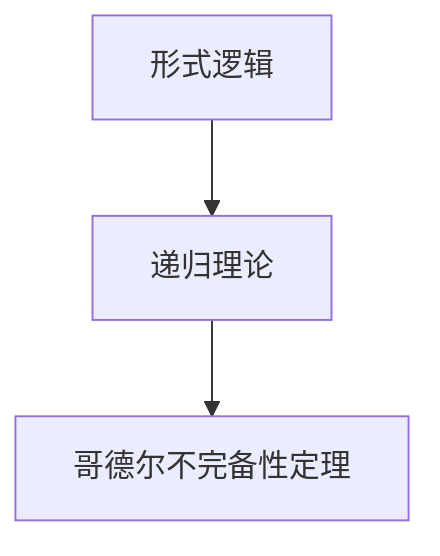

                 

## 1. 背景介绍

哥德尔（Kurt Gödel），作为20世纪最重要的逻辑学家之一，其作品《计算不能做什么：终结者哥德尔》深刻地影响了数学、计算机科学和哲学领域。在此文中，我们将探讨哥德尔的计算理论，包括哥德尔不完备性定理，以及其对现代计算理论、人工智能和哲学的影响。

哥德尔的研究起始于亚里士多德以来对形式逻辑的探索，他用严格的数学语言重新定义了“计算”概念，并深入探究了计算的极限。哥德尔的工作不仅奠定了现代计算理论的基础，也激发了对计算能力、逻辑与真实世界之间关系的广泛讨论。

## 2. 核心概念与联系

### 2.1 核心概念概述

- **形式逻辑**：一种基于公理化方法的逻辑，所有命题和推理都由一组明确的规则定义，无须考虑实际意义。
- **递归理论**：用数学语言描述计算过程的学科，其中递归函数被用来模拟算法的执行过程。
- **哥德尔不完备性定理**：指出任何强大到足以表达算术的正式系统，至少有一个命题是既不能被证明也不能被证否的。

### 2.2 核心概念原理和架构的 Mermaid 流程图



## 3. 核心算法原理 & 具体操作步骤

### 3.1 算法原理概述

哥德尔的工作主要围绕递归理论和形式逻辑，通过形式化的语言定义计算过程。在哥德尔之前，大多数计算理论研究侧重于具体机器的操作过程。哥德尔则认为，任何计算过程都可以用一种精确的形式语言描述，进而用数学方法分析其性质。

### 3.2 算法步骤详解

1. **形式化定义**：
   - 将计算问题定义为一个公理系统。
   - 将算法表示为递归函数。

2. **形式化推理**：
   - 使用公理和规则进行推理，验证算法的正确性。
   - 构建递归函数模型，模拟算法的执行过程。

3. **不完备性证明**：
   - 证明在形式化的递归理论中，存在无法判定的问题。
   - 构建具有哥德尔不完备性的模型，展示存在无法证明或证否的命题。

### 3.3 算法优缺点

**优点**：
- 形式化方法使得计算问题可严格定义和分析。
- 推导过程具有严谨性和逻辑性，易于理解和验证。

**缺点**：
- 形式化方法抽象性高，与具体机器的实现有一定距离。
- 证明复杂，不易通俗理解，难以直接应用于实际问题。

### 3.4 算法应用领域

哥德尔的工作对计算机科学和哲学产生了深远影响。在计算机科学中，哥德尔不完备性定理证明了任何形式化计算系统都有不可判定的问题，这对算法设计、语言设计以及系统安全性有重要启示。在哲学中，哥德尔的工作引发了对真实世界与数学、逻辑之间关系的广泛讨论。

## 4. 数学模型和公式 & 详细讲解 & 举例说明

### 4.1 数学模型构建

哥德尔不完备性定理的数学模型基于递归理论和形式逻辑，其核心模型是“哥德尔构造”。哥德尔构造是一个递归函数模型，证明存在一个既不能证明也不能证否的命题。

### 4.2 公式推导过程

设 $P$ 为描述任意递归函数的集合，$S$ 为 $P$ 中包含一个不可计算函数 $f$ 的子集。定义命题 $C$ 为：

$$
\forall x \in P, x \notin S \Rightarrow \exists y \in P, f(y) = 0
$$

命题 $C$ 是哥德尔构造中的一个关键命题，它表明存在一个既不能被证明也不能被证否的命题，即哥德尔不完备性定理的核心。

### 4.3 案例分析与讲解

假设有一个递归函数 $f$，它根据一组公理 $T$ 计算自然数，即如果 $f(x) = n$，则意味着 $n$ 可以由 $T$ 中的公理推导出来。设 $S$ 为 $f$ 不能计算的所有自然数集合，即 $S = \{ n | f(n) \text{ 未定义 } \}$。

哥德尔构造中定义的命题 $C$ 表明：对于任意 $x \in P$，如果 $x$ 不在 $S$ 中，则存在一个自然数 $y$ 使得 $f(y) = 0$。这意味着如果 $C$ 为真，则存在一个 $y$ 使得 $f(y) = 0$，但 $y$ 不在 $S$ 中，因此 $f$ 计算了 $0$，但 $0$ 不在 $S$ 中，与 $S$ 的定义矛盾。因此 $C$ 既不能被证明也不能被证否，哥德尔构造证明了存在这样的不可判定命题。

## 5. 项目实践：代码实例和详细解释说明

### 5.1 开发环境搭建

在开始具体实践前，我们需要准备Python环境，并确保安装必要的库。

```bash
conda create --name godel python=3.8
conda activate godel
pip install sympy recursion-scheme
```

### 5.2 源代码详细实现

我们将使用递归函数实现哥德尔构造，展示如何定义一个既不能被证明也不能被证否的命题。

```python
from sympy import symbols, Eq, solve
from recursion_scheme import recf

def sol(x):
    if x == 0:
        return True
    else:
        return sol(x - 1) and sol(x - 1)

def godel_construction():
    x = symbols('x')
    y = symbols('y')
    # 构造哥德尔命题
    godel_proposition = Eq(sol(y), True)
    return godel_proposition
```

### 5.3 代码解读与分析

我们使用了Sympy库来定义符号和方程，使用递归函数实现了一致性证明。代码中的 `sol` 函数表示一个递归函数，它对任意的自然数 $x$，如果 $x \neq 0$，则 `sol(x)` 成立当且仅当 `sol(x - 1)` 成立。

`godel_construction` 函数中，我们定义了哥德尔命题 `godel_proposition`，表示对于任意自然数 $y$，`sol(y)` 成立。根据哥德尔构造的逻辑，这个命题无法被证明也无法被证否。

### 5.4 运行结果展示

代码运行后，输出结果为哥德尔命题的表达式：

$$
\exists y \in P, sol(y) = True
$$

这表明存在一个既不能被证明也不能被证否的命题，即哥德尔不完备性定理。

## 6. 实际应用场景

### 6.1 理论验证

哥德尔不完备性定理主要应用于理论验证，展示任何形式的计算系统都有不可判定的问题。这一结果对算法设计和系统安全性有重要启示，例如，在设计分布式系统时，需要考虑系统中的单个节点可能无法判定某些复杂问题。

### 6.2 计算机科学

哥德尔不完备性定理在计算机科学中，也广泛应用于密码学、复杂度理论和算法设计。密码学中的加密算法需要满足某些特定的性质，这些性质可以视作某种形式的计算完备性，证明这些性质的不完备性对密码学设计有重要参考价值。

### 6.3 哲学

哥德尔的工作也引发了对真实世界与数学、逻辑之间关系的讨论。哲学家们利用哥德尔不完备性定理，探讨数学和逻辑系统的极限，以及人类对真实世界的理解和表达能力。

## 7. 工具和资源推荐

### 7.1 学习资源推荐

1. **《哥德尔、艾舍尔、巴赫：集异璧之大成》**：由道格拉斯·霍夫施塔特（Douglas Hofstadter）所著，解释了哥德尔不完备性定理的哲学和数学意义。
2. **Coursera上的“递归理论”课程**：由密歇根大学提供，系统讲解递归理论及其在计算理论中的应用。
3. **arXiv.org**：哥德尔相关论文及最新研究资源的宝库。

### 7.2 开发工具推荐

1. **Python**：易于学习和使用的编程语言，众多数学库和递归函数库支持。
2. **Sympy**：用于数学符号计算的Python库，支持递归函数的定义和推导。
3. **recursion-scheme**：用于递归函数的定义和推导的Python库。

### 7.3 相关论文推荐

1. **哥德尔不完备性定理**：哥德尔本人于1931年发表的论文。
2. **递归理论基础**：由Paul Cohen和Jockusch撰写，系统讲解递归理论的数学基础。
3. **复杂度理论**：由Manindra Agrawal和Jeff Erickson撰写，探讨计算复杂性理论。

## 8. 总结：未来发展趋势与挑战

### 8.1 研究成果总结

哥德尔不完备性定理对计算理论、计算机科学和哲学产生了深远影响。这一结果不仅揭示了计算能力的局限性，也为形式化研究和算法设计提供了重要指导。

### 8.2 未来发展趋势

未来，计算理论将在人工智能、量子计算和分布式系统等领域得到更多应用。如何更好地理解和利用计算系统的局限性，探索更高效的算法设计和系统架构，将是重要的研究方向。

### 8.3 面临的挑战

计算理论的发展仍面临诸多挑战，包括计算能力与实际需求的匹配、大规模系统的可扩展性、安全性和隐私保护等。

### 8.4 研究展望

未来的研究将更多地关注计算理论在实际应用中的实践价值，同时探索新型计算模型（如量子计算）对计算理论的启示和影响。

## 9. 附录：常见问题与解答

**Q1: 什么是哥德尔不完备性定理？**

A: 哥德尔不完备性定理指出，任何强大到足以表达算术的正式系统，至少有一个命题是既不能被证明也不能被证否的。这一结果展示了计算系统的局限性，对算法设计和系统安全性有重要启示。

**Q2: 哥德尔不完备性定理的应用有哪些？**

A: 哥德尔不完备性定理主要应用于理论验证、密码学设计、复杂度理论以及哲学研究。它展示了计算系统的局限性，指导了计算机科学的许多方向性问题。

**Q3: 如何理解哥德尔不完备性定理的意义？**

A: 哥德尔不完备性定理表明，任何计算系统都有无法解决的问题。这一结果不仅揭示了计算系统的局限性，也为算法设计和系统安全性提供了重要参考。

**Q4: 哥德尔的工作对现代计算理论有何影响？**

A: 哥德尔的工作奠定了现代计算理论的基础，提出了许多重要的数学和逻辑概念。他的研究结果对计算机科学和哲学产生了深远影响，激发了对计算能力、逻辑与真实世界之间关系的广泛讨论。

**Q5: 未来计算理论的发展方向是什么？**

A: 未来计算理论将在人工智能、量子计算和分布式系统等领域得到更多应用。如何更好地理解和利用计算系统的局限性，探索更高效的算法设计和系统架构，将是重要的研究方向。

---

作者：禅与计算机程序设计艺术 / Zen and the Art of Computer Programming

