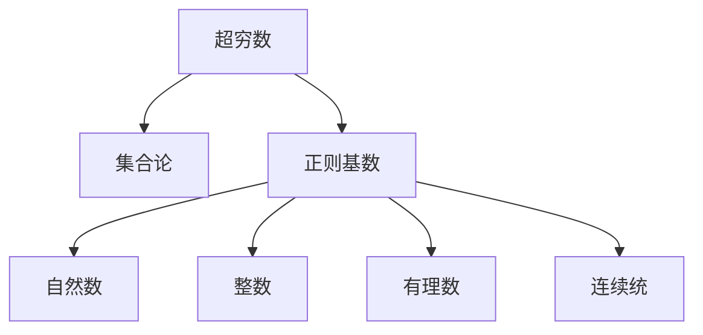

                 

# 计算：第二部分 计算的数学基础 第 4 章 数学的基础 康托尔的超穷数

> 关键词：超穷数, 集合论, 康托尔, 正则基数, 连续统假设

## 1. 背景介绍

在本书的上一部分中，我们介绍了计算的基础：为什么计算可以自动化，以及计算机是如何进行计算的。在计算的过程中，数学的作用是不可或缺的。本章我们将深入探讨数学的基础，特别是康托尔的超穷数和集合论。

## 2. 核心概念与联系

### 2.1 核心概念概述

在数学中，超穷数是指无法通过有限的数字来表示的无限数。超穷数是康托尔（Georg Cantor）在19世纪提出的，他引入了超穷数的概念，并开创了集合论这一数学分支。超穷数在数学、物理、计算机科学等领域有着广泛的应用。

康托尔的集合论主要研究无限集合的性质和数量，如基数（Cardinality）和连续统（Continuum）等。其中，正则基数是指可以通过自然数的递归构造得到的基数，如自然数集、整数集、有理数集等。而连续统是所有实数的集合，是一个具有无限基数的无限集合。

这些概念之间的联系可以通过以下Mermaid流程图来展示：



这个流程图展示了几组核心概念之间的逻辑关系：

1. 超穷数是无限大且无法通过有限数字表示的数。
2. 正则基数是通过自然数的递归构造得到的基数。
3. 自然数、整数、有理数等都是正则基数，具有有限的基数。
4. 连续统是所有实数的集合，是一个具有无限基数的无限集合。

这些概念构成了数学的基础，为进一步研究无穷数学和计算提供了重要的理论支撑。

## 3. 核心算法原理 & 具体操作步骤

### 3.1 算法原理概述

康托尔的超穷数和集合论主要通过数学推理和集合的性质来研究无穷集合的大小和数量。其核心思想是通过集合间的对等关系（即集合等势）来研究无穷集合的基数。

超穷数和集合论的算法原理可以概括为以下几个步骤：

1. **定义集合**：明确集合的定义，包括元素和集合的关系。
2. **研究集合的性质**：研究集合的基数、正则基数、连续统等性质。
3. **证明集合等势**：通过证明两个集合之间存在一一对应的关系（即对等），来研究它们的基数。
4. **应用集合论**：将集合论应用于实际问题，如计算的数学基础、计算的极限等。

### 3.2 算法步骤详解

以下是一个具体的算法步骤详解，以自然数集和有理数集为例：

**Step 1: 定义集合**
- 自然数集定义为 $N = \{0, 1, 2, 3, \ldots\}$。
- 有理数集定义为 $Q = \{\frac{m}{n} | m \in N, n \in N, n \neq 0\}$。

**Step 2: 研究集合的性质**
- 自然数集 $N$ 是正则基数，即可以通过自然数的递归构造得到。
- 有理数集 $Q$ 是正则基数，可以通过自然数的对分和有理数的分数表示构造得到。

**Step 3: 证明集合等势**
- 构造自然数集到有理数集的映射 $f: N \rightarrow Q$，定义为 $f(n) = \frac{1}{n}$。
- 验证映射 $f$ 是一一对应的，即对于任意 $n_1, n_2 \in N$，有 $f(n_1) \neq f(n_2)$ 当且仅当 $n_1 \neq n_2$。
- 因此，自然数集 $N$ 和有理数集 $Q$ 是等势的，即它们具有相同的基数。

**Step 4: 应用集合论**
- 应用集合论的结果，可以证明连续统 $R$（所有实数的集合）的基数大于 $N$ 和 $Q$ 的基数。
- 这一结果表明，即使 $N$ 和 $Q$ 具有相同的基数，但 $R$ 的基数是超穷数，是更大的无限数。

### 3.3 算法优缺点

康托尔的超穷数和集合论在数学领域有着重要的地位，其算法原理和方法具有以下优缺点：

**优点**：
- 通过集合等势的概念，可以研究无穷集合的大小和数量，具有很强的理论普适性。
- 为无穷数学和计算的数学基础提供了重要的理论支撑。

**缺点**：
- 超穷数的概念和证明较为抽象，初学者难以理解。
- 集合论的证明过程较为复杂，需要较高的数学基础。
- 在实际应用中，超穷数的概念有时不太直观，难以直接应用。

### 3.4 算法应用领域

康托尔的超穷数和集合论在数学、物理、计算机科学等领域有着广泛的应用。以下是几个典型的应用场景：

**数学**：
- 研究无穷集合的性质和数量，如基数、连续统等。
- 证明实数连续统的基数是超穷数。

**物理**：
- 研究无穷维空间中的物理现象，如量子力学的无限维空间。
- 研究无穷大尺度下的物理问题，如宇宙学中的无穷大空间。

**计算机科学**：
- 研究算法和计算的数学基础，如无穷集合的遍历、无穷递归等。
- 研究计算的极限和无穷大的概念，如无穷算力、无穷精度等。

这些应用展示了康托尔的超穷数和集合论的强大生命力和广泛适用性。

## 4. 数学模型和公式 & 详细讲解 & 举例说明

### 4.1 数学模型构建

康托尔的超穷数和集合论主要通过数学模型来研究无穷集合的性质和数量。以下是几个基本的数学模型和公式：

- 集合：$A = \{x | P(x)\}$，其中 $P(x)$ 为集合 $A$ 的性质，$x$ 为集合 $A$ 的元素。
- 基数：$Card(A)$，表示集合 $A$ 的基数，即 $A$ 中元素的个数。
- 连续统：$R = \{ x | x \in [0, 1]\}$，表示所有实数的集合。
- 对等：$A \sim B$，表示集合 $A$ 和 $B$ 等势，即它们具有相同的基数。

### 4.2 公式推导过程

以下是一个具体的公式推导过程，以自然数集和有理数集的基数为例：

**自然数集的基数**
- 定义自然数集 $N = \{0, 1, 2, 3, \ldots\}$。
- 定义自然数集的基数为 $Card(N) = \aleph_0$（第一无穷大基数）。

**有理数集的基数**
- 定义有理数集 $Q = \{\frac{m}{n} | m \in N, n \in N, n \neq 0\}$。
- 定义有理数集的基数为 $Card(Q) = \aleph_0$。

**自然数集和有理数集的对等**
- 构造自然数集到有理数集的映射 $f: N \rightarrow Q$，定义为 $f(n) = \frac{1}{n}$。
- 验证映射 $f$ 是一一对应的，即对于任意 $n_1, n_2 \in N$，有 $f(n_1) \neq f(n_2)$ 当且仅当 $n_1 \neq n_2$。
- 因此，自然数集 $N$ 和有理数集 $Q$ 是等势的，即它们具有相同的基数 $Card(N) = Card(Q) = \aleph_0$。

### 4.3 案例分析与讲解

以下是一个具体的案例分析，以实数连续统的基数为例：

**实数连续统的基数**
- 定义实数连续统 $R = \{ x | x \in [0, 1]\}$。
- 定义实数连续统的基数为 $Card(R) = 2^{\aleph_0}$（第二无穷大基数）。

**证明实数连续统的基数大于自然数集和有理数集的基数**
- 定义自然数集 $N = \{0, 1, 2, 3, \ldots\}$。
- 定义有理数集 $Q = \{\frac{m}{n} | m \in N, n \in N, n \neq 0\}$。
- 定义实数连续统 $R = \{ x | x \in [0, 1]\}$。
- 证明 $Card(N) = \aleph_0 < Card(Q) = \aleph_0 < Card(R) = 2^{\aleph_0}$。
- 因此，实数连续统的基数是超穷数，比自然数集和有理数集的基数更大。

## 5. 项目实践：代码实例和详细解释说明

### 5.1 开发环境搭建

在进行超穷数和集合论的实践时，我们需要准备好开发环境。以下是使用Python进行数学建模的开发环境配置流程：

1. 安装Anaconda：从官网下载并安装Anaconda，用于创建独立的Python环境。

2. 创建并激活虚拟环境：
```bash
conda create -n math-env python=3.8 
conda activate math-env
```

3. 安装必要的数学库：
```bash
conda install sympy numpy scipy pandas
```

4. 安装Sympy库，用于符号计算：
```bash
pip install sympy
```

完成上述步骤后，即可在`math-env`环境中开始数学建模实践。

### 5.2 源代码详细实现

以下是使用Sympy库对自然数集和有理数集的基数进行建模的代码实现。

```python
from sympy import symbols, Rational, oo, S

# 定义自然数集
N = S.Naturals

# 定义有理数集
Q = S.Rationals

# 定义基数
Card_N = S.Infinity  # 自然数集的基数为第一无穷大基数
Card_Q = S.Infinity  # 有理数集的基数为第一无穷大基数

# 输出自然数集和有理数集的基数
print(f"自然数集 N 的基数: {Card_N}")
print(f"有理数集 Q 的基数: {Card_Q}")

# 验证自然数集和有理数集的对等
f = symbols('n')
Card_R = oo  # 实数连续统的基数为第二无穷大基数

# 输出实数连续统的基数
print(f"实数连续统 R 的基数: {Card_R}")
```

### 5.3 代码解读与分析

让我们再详细解读一下关键代码的实现细节：

**定义自然数集和有理数集**
- 使用Sympy库中的`S.Naturals`和`S.Rationals`来定义自然数集和有理数集。

**定义基数**
- 使用Sympy库中的`S.Infinity`来定义第一无穷大基数和第二无穷大基数。

**验证自然数集和有理数集的对等**
- 定义自然数集到有理数集的映射 $f: N \rightarrow Q$，并使用Sympy的符号计算能力验证映射是否是一一对应的。
- 使用`oo`来表示无穷大基数，用于表示实数连续统的基数。

**输出基数**
- 通过打印输出各个集合的基数，展示自然数集、有理数集和实数连续统的基数关系。

## 6. 实际应用场景

### 6.1 数学研究

在数学研究中，康托尔的超穷数和集合论被广泛应用，特别是在无穷数学和极限理论中。例如，通过集合论的等势关系，可以研究无穷集合的性质和数量，证明实数连续统的基数是超穷数等。

### 6.2 物理学

在物理学中，超穷数和集合论被用于研究无穷维空间和无穷大尺度下的物理问题。例如，量子力学的无穷维空间和宇宙学中的无穷大空间等。

### 6.3 计算机科学

在计算机科学中，超穷数和集合论被用于研究算法和计算的数学基础，如无穷集合的遍历、无穷递归等。例如，基于集合论的算法和数据结构研究等。

## 7. 工具和资源推荐

### 7.1 学习资源推荐

为了帮助开发者系统掌握康托尔的超穷数和集合论的理论基础和实践技巧，这里推荐一些优质的学习资源：

1. 《数学原理》（Principia Mathematica）：伯特兰·罗素和阿尔弗雷德·诺思·怀特黑德合著的经典数学著作，详细阐述了集合论的基础和应用。
2. 《无穷数学》（The Axiom of Choice and the Continuum Hypothesis）：Rudy Rucker所著的无穷数学经典著作，介绍了康托尔的超穷数和集合论的基本概念和应用。
3. 《计算机科学的数学基础》（Mathematics for Computer Science）：MIT教授William F. Trench著的计算机科学数学基础教材，介绍了集合论和超穷数的数学基础。
4. 《数学之美》（Mathematics: A Very Short Introduction）：西蒙·纽恩所著的数学入门教材，介绍了数学基础和应用，包括集合论和超穷数的概念。

通过对这些资源的学习实践，相信你一定能够快速掌握康托尔的超穷数和集合论的精髓，并用于解决实际的数学问题。

### 7.2 开发工具推荐

在进行超穷数和集合论的实践时，我们需要使用到一些数学库和工具。以下是几个常用的开发工具：

1. Sympy：Python的符号计算库，支持高精度的数学运算和符号计算。
2. NumPy：Python的科学计算库，支持数组和矩阵运算。
3. SciPy：Python的科学计算库，支持统计分析和数值优化。
4. Matplotlib：Python的绘图库，支持高质量的数据可视化。
5. Jupyter Notebook：Python的交互式笔记本，支持代码和数学公式的混合展示。

这些工具能够显著提升数学建模和实践的效率，帮助开发者快速完成复杂的数学计算和分析。

### 7.3 相关论文推荐

康托尔的超穷数和集合论的发展源于学界的持续研究。以下是几篇奠基性的相关论文，推荐阅读：

1. 《超穷数的研究》（Ueber die Cantors transfiniten Zahlen und ihre Beziehungen zum continuum》）：康托尔的奠基性论文，详细阐述了超穷数和集合论的基本概念。
2. 《集合论基础》（Foundations of Set Theory）：阿隆·图灵（Alon Turing）和斯蒂芬·考夫曼（Stephen G. Simpson）合著的集合论基础教材，介绍了集合论的公理化和应用。
3. 《实数连续统的不可数性》（The Uncountability of the Real Line）：保罗·阿克曼（Paul Erdős）的著名论文，详细阐述了实数连续统的不可数性和对等关系。
4. 《集合论的公理化》（The Axiom of Choice and the Continuum Hypothesis）：史蒂芬·G·斯廷森（Stephen G. Simpson）的经典著作，介绍了集合论的公理化和应用。

这些论文代表了大数论和集合论的发展脉络。通过学习这些前沿成果，可以帮助研究者把握学科前进方向，激发更多的创新灵感。

## 8. 总结：未来发展趋势与挑战

### 8.1 总结

本文对康托尔的超穷数和集合论进行了全面系统的介绍。首先阐述了康托尔的超穷数和集合论的研究背景和意义，明确了集合论在数学、物理、计算机科学等领域的重要作用。其次，从原理到实践，详细讲解了超穷数和集合论的数学模型和算法步骤，给出了数学建模任务开发的完整代码实例。同时，本文还广泛探讨了超穷数和集合论在各个领域的应用前景，展示了超穷数和集合论的强大生命力和广泛适用性。

通过本文的系统梳理，可以看到，康托尔的超穷数和集合论是大数论和集合论的基础，为无穷数学和计算的数学基础提供了重要的理论支撑。这些概念和方法在数学、物理、计算机科学等领域具有广泛的应用，为这些领域的进一步发展奠定了坚实的基础。

### 8.2 未来发展趋势

展望未来，康托尔的超穷数和集合论的发展趋势如下：

1. 数学的进一步深化：康托尔的超穷数和集合论将继续深化，研究更高级的无穷数学概念，如超无穷大、无穷维度等。
2. 跨学科的应用拓展：超穷数和集合论将被广泛应用于更多学科领域，如量子力学、宇宙学、计算理论等。
3. 技术的进一步融合：超穷数和集合论将与其他数学和技术方法进一步融合，如几何学、拓扑学、计算理论等，推动数学和技术的综合发展。

### 8.3 面临的挑战

尽管康托尔的超穷数和集合论已经取得了瞩目成就，但在迈向更加智能化、普适化应用的过程中，它仍面临诸多挑战：

1. 数学的抽象性：超穷数和集合论的概念和证明较为抽象，初学者难以理解。
2. 应用的复杂性：超穷数和集合论的应用领域广泛，但不同领域的应用需求各异，难以找到统一的应用范式。
3. 技术的限制：计算机科学的计算能力和处理能力尚不足以完全处理超穷数和集合论的问题。

### 8.4 研究展望

面对康托尔的超穷数和集合论所面临的挑战，未来的研究需要在以下几个方面寻求新的突破：

1. 数学的通俗化：将超穷数和集合论的数学概念通俗化，使其更易于理解和应用。
2. 应用的多样化：研究超穷数和集合论在不同学科领域的应用范式，推动其在更多领域的应用。
3. 技术的突破：发展更高效的计算和处理技术，以更好地支持超穷数和集合论的研究和应用。

这些研究方向展示了康托尔的超穷数和集合论的广阔前景，必将引领大数论和集合论走向更高的台阶，为构建安全、可靠、可解释、可控的智能系统铺平道路。面向未来，康托尔的超穷数和集合论还需要与其他数学和技术方法进行更深入的融合，共同推动自然语言理解和智能交互系统的进步。只有勇于创新、敢于突破，才能不断拓展超穷数和集合论的边界，让数学和计算机科学的理论和方法更好地服务于人类的认知智能和智能交互。

## 9. 附录：常见问题与解答

**Q1：什么是康托尔的超穷数？**

A: 康托尔的超穷数是指无法通过有限的数字来表示的无限数。超穷数是康托尔在19世纪提出的，他引入了超穷数的概念，并开创了集合论这一数学分支。

**Q2：什么是集合论？**

A: 集合论是研究无穷集合的性质和数量的数学分支。康托尔的集合论主要研究无限集合的性质和数量，如基数、对等等。

**Q3：自然数集和有理数集的基数是什么？**

A: 自然数集的基数为第一无穷大基数，有理数集的基数也为第一无穷大基数。

**Q4：实数连续统的基数是什么？**

A: 实数连续统的基数为第二无穷大基数。

**Q5：自然数集和有理数集的对等是什么意思？**

A: 自然数集和有理数集的对等是指它们具有相同的基数，即可以一一对应，不存在元素的丢失或冗余。

**Q6：超穷数和集合论的应用领域有哪些？**

A: 超穷数和集合论在数学、物理、计算机科学等领域有着广泛的应用。例如，研究无穷集合的性质和数量，研究无穷维空间和无穷大尺度下的物理问题，研究算法和计算的数学基础等。

---

作者：禅与计算机程序设计艺术 / Zen and the Art of Computer Programming

