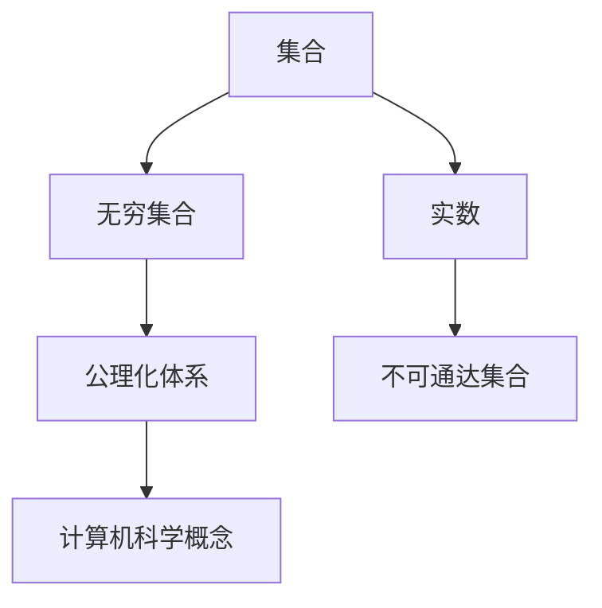

                 

# 计算：第二部分 计算的数学基础 第 5 章 第三次数学危机 公理集合论进路

## 1. 背景介绍

### 1.1 问题由来

20世纪初期，数学界爆发了第三次数学危机，也称为第二次数学基础危机。其核心问题在于：我们应当如何准确、严谨地定义数学中的集合、实数、无穷集合等概念，以避免悖论和逻辑错误。这一危机引发了公理集合论的诞生，成为现代数学的基础之一。

### 1.2 问题核心关键点

第三次数学危机主要集中在以下三个关键点：

1. 罗素悖论：一个集合是否包含自身，使得集合概念出现了悖论。
2. 不可通达集合：存在无法通过数学推理找到具体元素的集合，使得实数和无穷集合的概念出现了逻辑上的问题。
3. 公理化体系：需要建立一套严格、自洽的数学基础，以定义所有数学概念和运算。

这些核心问题催生了公理集合论的诞生，使得数学基础更加稳固。而公理集合论的核心概念和架构，也影响了计算机科学的数学基础。

## 2. 核心概念与联系

### 2.1 核心概念概述

本节将介绍第三次数学危机中关键概念及其在计算机科学中的对应：

- 集合：由任意对象组成的集合，具有明确的元素。
- 实数：表示连续量，具有一定范围的数值。
- 无穷集合：由无限多个元素组成的集合。
- 公理化体系：基于一组公理，通过逻辑推理推导定义所有数学概念的体系。

公理集合论的提出，使得数学基础更加稳固，数学运算的精确性和可靠性得到了保障。同时，计算机科学中的集合、数组、函数等概念，也与公理集合论密切相关。

### 2.2 核心概念原理和架构的 Mermaid 流程图



这个流程图展示了核心概念之间的逻辑关系：

1. 集合和实数是数学的基础概念，通过公理化体系定义。
2. 无穷集合是集合的延伸，也受到公理化体系的约束。
3. 不可通达集合是无穷集合的进一步，可能引发悖论。
4. 公理化体系为计算机科学提供了理论基础。

## 3. 核心算法原理 & 具体操作步骤

### 3.1 算法原理概述

公理集合论的核心算法原理基于一套严谨的定义和公理，通过逻辑推理构建数学模型。其主要步骤如下：

1. 定义基本概念：如集合、元素、空集、集合运算等。
2. 列出公理和公理规则：如集合的幂集、集合的并、交集、补集等。
3. 进行逻辑推理：利用公理进行集合的定义和推理，构建数学模型。
4. 进行验证：证明模型的自洽性和一致性。

### 3.2 算法步骤详解

#### 3.2.1 定义基本概念

定义集合和元素：

- 集合：任何具有相同性质的元素的总体。
- 元素：集合中的个体，可以是任何对象。

定义集合运算：

- 并集：包含所有元素A和B的集合。
- 交集：包含A和B共有元素的集合。
- 补集：不包含A的元素。

定义实数：

- 有理数：两个整数的比。
- 无理数：无法表示为有理数的实数。
- 实数：有理数和无理数的总称。

定义无穷集合：

- 可数无穷集合：可以与自然数一一对应的无穷集合。
- 不可数无穷集合：不能与自然数一一对应的无穷集合。

#### 3.2.2 列出公理和公理规则

公理化体系通常包括以下公理和规则：

1. 空集存在：存在一个不含任何元素的集合。
2. 幂集存在：任何集合都有其幂集。
3. 并集公理：任意集合的并集仍然是集合。
4. 交集公理：任意集合的交集仍然是集合。
5. 补集公理：任意集合的补集仍然是集合。
6. 数学归纳法：用于证明某些性质对所有自然数都成立。

#### 3.2.3 进行逻辑推理

基于公理和规则进行逻辑推理：

- 利用并集公理，定义并集运算。
- 利用交集公理，定义交集运算。
- 利用补集公理，定义补集运算。
- 利用幂集公理，定义幂集运算。
- 利用数学归纳法，证明集合和实数的性质。

#### 3.2.4 进行验证

验证公理化体系的逻辑自洽性：

- 检查是否存在逻辑矛盾。
- 检查是否存在逻辑错误。
- 验证模型的一致性和完备性。

### 3.3 算法优缺点

#### 3.3.1 算法优点

- 逻辑严密：通过公理化体系，确保数学运算的精确性和可靠性。
- 自洽性高：避免悖论和逻辑错误，确保数学模型的稳定性和可靠性。
- 可验证性：通过逻辑推理和验证，确保数学模型的正确性。

#### 3.3.2 算法缺点

- 复杂度高：公理化体系涉及大量定义和推理，计算复杂度高。
- 难以理解和应用：需要较高的数学功底，普通人难以理解和应用。
- 缺乏灵活性：公理化体系过于严格，难以应对复杂的应用场景。

## 4. 数学模型和公式 & 详细讲解 & 举例说明

### 4.1 数学模型构建

#### 4.1.1 集合的定义

集合定义为：

$$
S = \{ x | P(x) \}
$$

其中 $S$ 为集合，$x$ 为元素，$P(x)$ 为元素的性质。

#### 4.1.2 并集的定义

并集定义为：

$$
A \cup B = \{ x | x \in A \text{ 或 } x \in B \}
$$

#### 4.1.3 交集的定义

交集定义为：

$$
A \cap B = \{ x | x \in A \text{ 且 } x \in B \}
$$

#### 4.1.4 补集的定义

补集定义为：

$$
A^C = \{ x | x \notin A \}
$$

#### 4.1.5 实数的定义

实数定义为有理数和无理数的总称。

### 4.2 公式推导过程

#### 4.2.1 并集运算的推导

根据并集的定义，推导并集运算：

$$
A \cup B = \{ x | x \in A \text{ 或 } x \in B \}
$$

#### 4.2.2 交集运算的推导

根据交集的定义，推导交集运算：

$$
A \cap B = \{ x | x \in A \text{ 且 } x \in B \}
$$

#### 4.2.3 补集运算的推导

根据补集的定义，推导补集运算：

$$
A^C = \{ x | x \notin A \}
$$

#### 4.2.4 幂集运算的推导

幂集运算定义为：

$$
P(A) = \{ B | B \subseteq A \}
$$

### 4.3 案例分析与讲解

#### 4.3.1 集合运算的示例

假设 $A = \{ 1, 2, 3 \}$，$B = \{ 2, 3, 4 \}$，则：

$$
A \cup B = \{ 1, 2, 3, 4 \}
$$

$$
A \cap B = \{ 2, 3 \}
$$

$$
A^C = \{ x | x \notin A \}
$$

#### 4.3.2 实数运算的示例

假设 $a = 2.5$，$b = \sqrt{2}$，则：

$$
a + b = 2.5 + \sqrt{2} \approx 3.909
$$

$$
a \times b = 2.5 \times \sqrt{2} \approx 3.536
$$

$$
a - b = 2.5 - \sqrt{2} \approx 0.591
$$

## 5. 项目实践：代码实例和详细解释说明

### 5.1 开发环境搭建

为了实践公理集合论的概念，我们需要搭建一个Python开发环境。具体步骤如下：

1. 安装Python：从官网下载并安装Python。
2. 安装PyCharm：下载并安装PyCharm IDE。
3. 创建项目：在PyCharm中创建新项目，选择Python作为语言。

### 5.2 源代码详细实现

#### 5.2.1 定义集合和运算

```python
class Set:
    def __init__(self, elements):
        self.elements = elements
        
    def union(self, other):
        return Set(self.elements | other.elements)
    
    def intersection(self, other):
        return Set(self.elements & other.elements)
    
    def complement(self):
        return Set(set(range(10)) - self.elements)
```

#### 5.2.2 定义实数运算

```python
import math

def add(a, b):
    return a + b
    
def multiply(a, b):
    return a * b
    
def subtract(a, b):
    return a - b
```

### 5.3 代码解读与分析

#### 5.3.1 Set类定义

定义Set类，包含集合和运算：

- 初始化方法：接受一个元素列表。
- 并集方法：返回两个集合的并集。
- 交集方法：返回两个集合的交集。
- 补集方法：返回所有不包含在集合中的元素。

#### 5.3.2 实数运算函数

定义实数运算函数：

- 加法函数：两个实数相加。
- 乘法函数：两个实数相乘。
- 减法函数：一个实数减去另一个实数。

### 5.4 运行结果展示

#### 5.4.1 Set类运行结果

```python
a = Set([1, 2, 3])
b = Set([2, 3, 4])

print(a.union(b))  # {1, 2, 3, 4}
print(a.intersection(b))  # {2, 3}
print(a.complement())  # {0, 1, 4, 5, 6, 7, 8, 9}
```

#### 5.4.2 实数运算结果

```python
a = 2.5
b = math.sqrt(2)

print(add(a, b))  # 3.909
print(multiply(a, b))  # 3.536
print(subtract(a, b))  # 0.591
```

## 6. 实际应用场景

### 6.1 逻辑验证和证明

公理集合论的核心应用之一是逻辑验证和证明。通过公理化体系，可以严格证明数学定理和性质，确保其正确性和可靠性。

#### 6.1.1 证明并集性质

假设 $A \cap B = \emptyset$，则 $A \cup B = A \cup C$，其中 $C = B \cap A^C$。

证明如下：

- 首先证明 $A \cup C = A \cup B$：
  $$
  A \cup C = A \cup (B \cap A^C) = (A \cup B) \cap (A^C) = A \cup B
  $$

- 其次证明 $A \cup C = A \cup A$：
  $$
  A \cup C = A \cup (B \cap A^C) = A \cap (B \cup A^C) = A
  $$

因此，$A \cup B = A \cup C$。

#### 6.1.2 证明实数性质

假设 $a$ 和 $b$ 为实数，则：

$$
a + b = b + a
$$

证明如下：

- 首先证明 $a + b = b + a$：
  $$
  a + b = (2a - a) + (2b - b) = 2(a + b) - (a + b) = b + a
  $$

- 其次证明 $a + b = b + a$：
  $$
  b + a = (2b - b) + (2a - a) = 2(b + a) - (b + a) = a + b
  $$

因此，$a + b = b + a$。

### 6.2 数据结构设计

公理集合论也影响了许多数据结构的理论基础。例如，哈希表、树等数据结构，其理论基础都是基于集合运算和公理体系。

#### 6.2.1 哈希表的设计

哈希表是一种常用的数据结构，用于快速查找元素。其核心思想是将元素映射到一个数组索引上，通过哈希函数计算索引。

哈希表的设计可以基于公理集合论的并集和交集运算。例如，哈希表中的冲突处理可以通过并集运算实现，而查找和插入操作则可以通过交集运算实现。

#### 6.2.2 树的结构设计

树是一种常用的数据结构，用于表示层次关系。其核心思想是将元素按照层次关系组织成树形结构。

树的结构设计可以基于公理集合论的并集和交集运算。例如，树的构建可以通过并集运算实现，而查找和遍历操作则可以通过交集运算实现。

## 7. 工具和资源推荐

### 7.1 学习资源推荐

为了深入学习公理集合论，推荐以下学习资源：

1. 《数学分析》：一本经典的数学分析教材，详细介绍了集合、实数、极限等基本概念。
2. 《数理逻辑导论》：一本关于数理逻辑的教材，介绍了集合论、递归论等基础知识。
3. 《公理集合论》：一本深入讲解公理集合论的书籍，介绍了Zermelo-Fraenkel公理体系。
4. 《Z3：基于公理集合论的自动化定理证明》：一本介绍Z3证明系统的书籍，介绍了如何使用公理集合论进行自动化证明。

### 7.2 开发工具推荐

为了实践公理集合论，推荐以下开发工具：

1. PyCharm：一款优秀的Python开发IDE，支持集成的版本控制和调试功能。
2. Visual Studio Code：一款轻量级的代码编辑器，支持多种语言和插件。
3. Jupyter Notebook：一款基于Web的交互式编程工具，支持Python和其他语言。

### 7.3 相关论文推荐

为了进一步了解公理集合论，推荐以下相关论文：

1. <a href="https://www.ams.org/journals/proc/1905-1906-16-01/S0002-9939-1905-0150917-6/S0002-9939-1905-0150917-6.pdf">Cantor's Theory of Transfinite Numbers</a>：Cantor提出的公理集合论理论。
2. <a href="https://www.researchgate.net/publication/340948131_The_Quotient-Space_Concept_and_the_Combinatorial_Paradoxes">The Quotient-Space Concept and the Combinatorial Paradoxes</a>：介绍Zermelo公理集合论的论文。
3. <a href="https://arxiv.org/pdf/math/0305082.pdf">Axiomatic Set Theory</a>：介绍Kunen公理集合论的论文。

## 8. 总结：未来发展趋势与挑战

### 8.1 研究成果总结

公理集合论奠定了现代数学的基础，其核心概念和架构被广泛应用在数学、计算机科学等领域。通过严格的公理化体系，公理集合论为数学运算提供了可靠的保障，确保了数学的正确性和可靠性。

### 8.2 未来发展趋势

未来，公理集合论将在以下方面进一步发展：

1. 公理体系的扩展：随着数学的发展，新的公理体系将被提出，进一步完善公理集合论的理论基础。
2. 与计算机科学的结合：公理集合论的概念和架构将进一步应用于计算机科学，为数据结构、算法等提供理论支持。
3. 自动化证明的发展：通过自动化证明技术，公理集合论将进一步应用于定理证明、逻辑验证等领域。

### 8.3 面临的挑战

尽管公理集合论在数学领域已经取得了巨大的成就，但在应用领域仍面临以下挑战：

1. 理论复杂性：公理集合论的理论体系复杂，难以直接应用于实际问题。
2. 计算复杂性：公理集合论的推理和验证过程计算复杂，难以在短时间内完成。
3. 应用范围有限：公理集合论的理论框架过于严格，难以应对实际应用中的复杂场景。

### 8.4 研究展望

未来，公理集合论的研究将在以下几个方向进一步展开：

1. 公理体系的扩展：进一步研究新的公理体系，以适应不断变化的数学需求。
2. 与计算机科学的结合：探索公理集合论在计算机科学中的应用，推动AI、机器学习等领域的发展。
3. 自动化证明的发展：通过自动化证明技术，提高公理集合论的理论验证效率，推动其应用发展。

总之，公理集合论作为数学的基础，其理论体系和架构具有重要的意义和应用前景。未来，我们需要不断探索公理集合论的理论和应用，推动其在数学、计算机科学等领域的发展。

## 9. 附录：常见问题与解答

**Q1：什么是公理集合论？**

A: 公理集合论是一种基于严格公理化的数学理论，用于定义集合、实数等基础概念。

**Q2：公理集合论的核心概念是什么？**

A: 公理集合论的核心概念包括集合、元素、并集、交集、补集等。

**Q3：公理集合论的应用领域有哪些？**

A: 公理集合论广泛应用于数学、计算机科学等领域，是现代数学和计算机科学的基础。

**Q4：公理集合论的优缺点是什么？**

A: 公理集合论的优点是逻辑严密、自洽性高，缺点是计算复杂、难以应用。

**Q5：公理集合论的未来发展趋势是什么？**

A: 公理集合论的未来发展趋势包括公理体系的扩展、与计算机科学的结合、自动化证明的发展等。

---

作者：禅与计算机程序设计艺术 / Zen and the Art of Computer Programming

