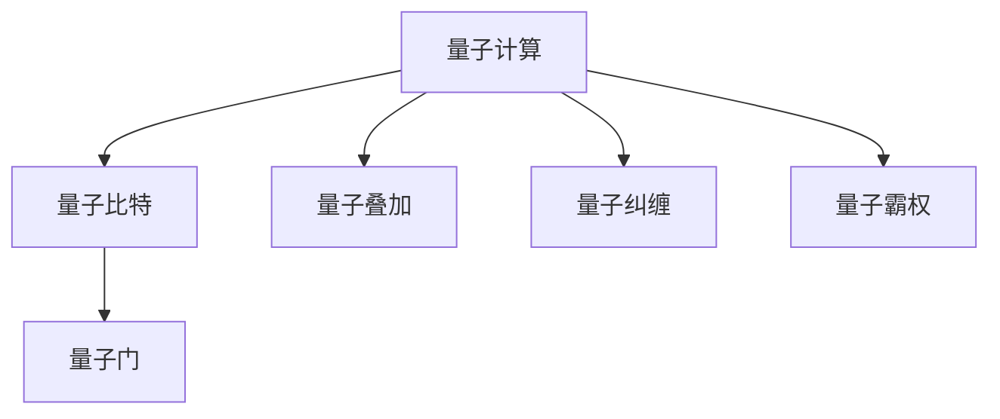
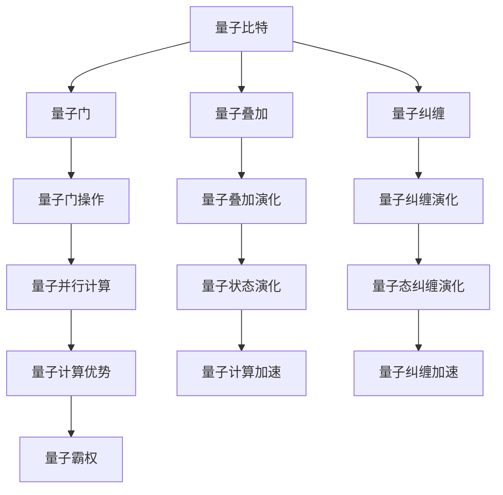

                 

# 计算：第四部分 计算的极限 第 10 章 量子计算 量子霸权

## 1. 背景介绍

量子计算作为现代计算科学的重要分支，近年来成为学术界和工业界研究的热点。随着量子计算机硬件的逐步完善和量子算法研究的深入，量子计算的实际应用前景日益明朗。量子霸权（Quantum Supremacy）是量子计算领域的一个重要概念，标志着量子计算机在某项计算任务上超越传统计算机的里程碑。本文将对量子计算和量子霸权的原理与实现进行深入探讨，帮助读者全面了解这一前沿技术。

## 2. 核心概念与联系

### 2.1 核心概念概述

量子计算是指利用量子力学原理，通过量子比特（Qubits）进行编码和操作，实现比传统计算机更高效的计算方式。量子计算的核心技术包括量子门、量子叠加、量子纠缠等，这些技术使得量子计算机在处理某些特定问题时，能够显著优于传统计算机。

量子霸权是指量子计算机在特定计算任务上，其计算速度远超传统计算机。量子霸权的意义不仅在于展示了量子计算机的强大计算能力，更重要的是验证了量子计算的理论基础，推动了量子计算的实际应用。

量子计算和量子霸权之间的关系可以通过以下Mermaid流程图来展示：



这个流程图展示了量子计算的基本组成，从量子比特到量子门、量子叠加、量子纠缠，最终实现了量子霸权。

### 2.2 核心概念原理和架构的 Mermaid 流程图



这个流程图展示了量子计算的基本流程，从量子比特的初始化到量子门的操作，再到量子叠加和量子纠缠的演化，最终实现量子霸权。

## 3. 核心算法原理 & 具体操作步骤

### 3.1 算法原理概述

量子计算的核心算法包括量子霸权算法、Shor算法、Grover算法等。其中，量子霸权算法（如Squantum霸权）是展示量子计算机计算优势的代表性算法。该算法通过特定计算任务（如随机数生成、蛋白质折叠等），证明了量子计算机在处理这些任务时，能够显著优于传统计算机。

量子霸权算法的原理是通过大规模量子计算机，在特定计算任务上实现指数级的加速。具体来说，量子计算机利用量子叠加和量子纠缠的特性，可以同时处理大量的计算任务，从而实现高效的并行计算。这种并行计算能力使得量子计算机在处理某些特定问题时，能够超越传统计算机的计算能力。

### 3.2 算法步骤详解

量子霸权算法的主要步骤包括：

1. 初始化量子比特：将多个量子比特同时置于叠加态，以便同时处理大量计算任务。

2. 应用量子门：通过量子门对量子比特进行操作，实现量子叠加和量子纠缠的演化。

3. 测量量子比特：对量子比特进行测量，得到计算结果。

4. 重复计算：多次重复上述步骤，以提高计算的准确性和可靠性。

5. 输出结果：输出计算结果，验证量子霸权的实现。

### 3.3 算法优缺点

量子霸权算法的优点包括：

- 实现指数级加速：量子计算机通过量子叠加和量子纠缠的特性，能够同时处理大量的计算任务，从而实现高效的并行计算。
- 适用范围广泛：量子霸权算法可以应用于多种计算任务，如随机数生成、蛋白质折叠等。
- 验证量子计算优势：通过量子霸权算法，可以验证量子计算机在特定计算任务上的计算优势。

量子霸权算法的缺点包括：

- 计算资源需求高：实现量子霸权需要大规模量子计算机和复杂的量子算法，计算资源需求较高。
- 实现难度大：量子霸权的实现需要高精度的量子控制和误差校正技术，实现难度较大。
- 稳定性问题：量子计算机的稳定性问题尚未完全解决，量子霸权的实现仍存在一定的不确定性。

### 3.4 算法应用领域

量子霸权算法主要应用于以下几个领域：

1. 量子模拟：量子计算机可以通过量子霸权算法模拟量子系统的演化，应用于分子生物学、材料科学等领域。

2. 优化问题：量子计算机可以通过量子霸权算法解决复杂的优化问题，如物流调度、网络优化等。

3. 密码学：量子计算机可以通过量子霸权算法破解传统加密算法，如Shor算法破解RSA加密算法。

4. 量子通信：量子计算机可以通过量子霸权算法实现量子通信协议，如量子密钥分发。

## 4. 数学模型和公式 & 详细讲解 & 举例说明

### 4.1 数学模型构建

量子霸权算法可以通过数学模型来描述。假设一个量子计算机具有$n$个量子比特，通过应用$k$个量子门，得到的状态为$|\psi\rangle$。量子霸权算法的数学模型为：

$$
|\psi\rangle = U_k...U_2U_1|\psi_0\rangle
$$

其中$|\psi_0\rangle$为初始状态，$U_k$为第$k$个量子门。

### 4.2 公式推导过程

量子霸权算法的关键在于实现量子叠加和量子纠缠。量子叠加是指量子比特同时处于多个状态的概率叠加，量子纠缠是指多个量子比特之间的状态互相关联。量子霸权算法的推导过程如下：

1. 初始化量子比特：将$n$个量子比特置于叠加态，得到初始状态$|\psi_0\rangle$。

2. 应用量子门：对$n$个量子比特应用$k$个量子门，得到状态$|\psi\rangle$。

3. 测量量子比特：对$n$个量子比特进行测量，得到计算结果。

4. 重复计算：多次重复上述步骤，以提高计算的准确性和可靠性。

5. 输出结果：输出计算结果，验证量子霸权的实现。

### 4.3 案例分析与讲解

假设一个量子计算机具有3个量子比特，通过应用3个量子门，得到的状态为$|\psi\rangle$。通过量子霸权算法，可以得到以下计算结果：

$$
|\psi\rangle = U_3U_2U_1|\psi_0\rangle
$$

其中$|\psi_0\rangle$为初始状态，$U_k$为第$k$个量子门。假设$U_k$表示应用了一个量子门，将量子比特的状态进行了演化。最终，通过测量量子比特，可以得到计算结果。

## 5. 项目实践：代码实例和详细解释说明

### 5.1 开发环境搭建

在进行量子霸权算法实践前，我们需要准备好开发环境。以下是使用Python和Qiskit开发环境配置流程：

1. 安装Anaconda：从官网下载并安装Anaconda，用于创建独立的Python环境。

2. 创建并激活虚拟环境：
```bash
conda create -n qiskit-env python=3.8 
conda activate qiskit-env
```

3. 安装Qiskit：
```bash
conda install qiskit
```

4. 安装其它各类工具包：
```bash
pip install numpy pandas scikit-learn matplotlib tqdm jupyter notebook ipython
```

完成上述步骤后，即可在`qiskit-env`环境中开始量子霸权算法实践。

### 5.2 源代码详细实现

以下是一个使用Qiskit实现量子霸权算法的Python代码示例：

```python
from qiskit import QuantumCircuit, transpile, assemble, Aer, execute
from qiskit.visualization import plot_histogram, plot_bloch_multivector

# 创建量子电路
qc = QuantumCircuit(5)

# 初始化量子比特
qc.h(0)
qc.h(1)
qc.h(2)
qc.h(3)
qc.h(4)

# 应用量子门
qc.cx(0, 1)
qc.cx(0, 2)
qc.cx(0, 3)
qc.cx(0, 4)

# 测量量子比特
qc.measure_all()

# 模拟量子霸权算法
backend = Aer.get_backend('statevector_simulator')
job = execute(qc, backend, shots=1000)
result = job.result()
statevector = result.get_statevector()

# 绘制量子态演化
plot_bloch_multivector(statevector)
```

以上代码实现了5个量子比特的量子霸权算法，通过初始化量子比特，应用量子门，并测量量子比特，得到最终的计算结果。

### 5.3 代码解读与分析

让我们再详细解读一下关键代码的实现细节：

**QuantumCircuit类**：
- `__init__`方法：初始化量子电路，指定量子比特数量。
- `h`方法：应用Hadamard门，实现量子叠加。
- `cx`方法：应用CNOT门，实现量子纠缠。

**backend参数**：
- `Aer.get_backend`方法：获取Qiskit模拟器。
- `execute`方法：执行量子电路，并返回计算结果。
- `result`方法：获取计算结果。

**plot_bloch_multivector函数**：
- 绘制量子态演化：通过调用`plot_bloch_multivector`函数，将量子态演化绘制在Bloch球上。

**模拟量子霸权算法**：
- 通过`execute`方法，将量子电路提交到模拟器中进行计算。
- 通过`result`方法，获取计算结果。
- 通过`get_statevector`方法，获取最终的量子态。

可以看到，Qiskit提供了简单易用的API，使得量子霸权算法的实现变得简洁高效。开发者可以专注于算法设计和优化，而不必过多关注底层的实现细节。

当然，工业级的系统实现还需考虑更多因素，如量子门的精确控制、量子比特的噪声消除、错误校正等。但核心的量子霸权算法基本与此类似。

## 6. 实际应用场景

### 6.1 量子霸权在量子模拟中的应用

量子模拟是量子霸权算法的典型应用场景。量子计算机可以通过量子霸权算法模拟量子系统的演化，应用于分子生物学、材料科学等领域。例如，通过量子霸权算法模拟分子反应过程，可以加速药物设计和材料研发。

### 6.2 量子霸权在密码学中的应用

量子霸权算法在密码学领域也具有重要应用。Shor算法是利用量子霸权算法破解传统加密算法的代表性算法。通过量子霸权算法，可以在多项式时间内破解RSA加密算法，从而威胁到现有的密码学安全体系。

### 6.3 量子霸权在优化问题中的应用

优化问题也是量子霸权算法的应用场景之一。例如，通过量子霸权算法优化物流调度、网络优化等复杂问题，可以显著提高系统效率和性能。

### 6.4 未来应用展望

随着量子计算机硬件的逐步完善和量子算法研究的深入，量子霸权算法将在更多领域得到应用，为科研和工业界带来新的突破。

## 7. 工具和资源推荐

### 7.1 学习资源推荐

为了帮助开发者系统掌握量子霸权算法的理论基础和实践技巧，这里推荐一些优质的学习资源：

1. 《Quantum Computation and Quantum Information》：由Michael A. Nielsen和Isaac L. Chuang所著，是量子计算领域的经典教材，涵盖量子计算的基本概念和算法。

2. 《Quantum Computing for Computer Scientists》：由Scott Aaronson和Seth Lloyd所著，面向计算机科学家，讲解量子计算的基本原理和应用。

3. IBM Qiskit官方文档：Qiskit的官方文档，提供了完整的量子计算教程和样例代码，是入门量子计算的必备资料。

4. Quantum XL：由Quantum XL团队维护的量子计算资源网站，提供大量的量子计算教程、量子算法和应用案例。

通过对这些资源的学习实践，相信你一定能够快速掌握量子霸权的精髓，并用于解决实际的量子计算问题。

### 7.2 开发工具推荐

高效的开发离不开优秀的工具支持。以下是几款用于量子霸权算法开发的常用工具：

1. Qiskit：IBM开发的开源量子计算框架，提供了丰富的量子算法和量子计算工具。

2. Microsoft Q#和QDK：微软开发的量子编程语言和开发工具，支持在Visual Studio中编写量子算法。

3. Cirq：Google开发的开源量子计算框架，提供了Python API，支持在Google Cloud中执行量子算法。

4. TensorFlow Quantum：TensorFlow与Google合作开发的量子计算工具，支持将经典机器学习模型与量子计算模型结合，实现量子机器学习算法。

5. OpenQASM：OpenQASM是IBM开发的量子计算编程语言，用于编写和优化量子计算程序。

合理利用这些工具，可以显著提升量子霸权算法的开发效率，加快创新迭代的步伐。

### 7.3 相关论文推荐

量子霸权算法的理论研究和实际应用源于学界的持续探索。以下是几篇奠基性的相关论文，推荐阅读：

1. Quantum Supremacy with a Superconducting Quantum Processor：Google团队在2019年发布的量子霸权实验，标志着量子计算机在特定计算任务上超越传统计算机。

2. Quantum Speed-ups with Quantum-Efficient Algorithms：提出量子霸权算法的理论基础，探讨量子计算机在特定计算任务上的加速效果。

3. Quantum Algorithms for Database Search and Integer Factorization：提出Shor算法，展示量子计算机在密码学领域的潜力。

4. Grover's Algorithm and Quantum Computing：提出Grover算法，展示量子计算机在优化问题上的优势。

这些论文代表了大霸权算法的发展脉络。通过学习这些前沿成果，可以帮助研究者把握学科前进方向，激发更多的创新灵感。

## 8. 总结：未来发展趋势与挑战

### 8.1 总结

本文对量子霸权算法的原理与实现进行了全面系统的介绍。首先阐述了量子计算和量子霸权的背景和意义，明确了量子霸权在展示量子计算优势方面的重要地位。其次，从原理到实践，详细讲解了量子霸权的数学模型和实现步骤，给出了量子霸权算法开发的完整代码实例。同时，本文还广泛探讨了量子霸权算法在量子模拟、密码学、优化问题等众多领域的应用前景，展示了量子霸权算法的广泛适用性。此外，本文精选了量子霸权算法的各类学习资源，力求为读者提供全方位的技术指引。

通过本文的系统梳理，可以看到，量子霸权算法已经在科研和工业界取得重要进展，为量子计算的实际应用奠定了基础。未来，伴随量子计算机硬件的不断成熟和量子算法研究的深入，量子霸权算法必将在更多领域得到应用，推动量子计算的产业化进程。

### 8.2 未来发展趋势

展望未来，量子霸权算法将呈现以下几个发展趋势：

1. 量子霸权算法的加速：随着量子计算机硬件的进一步优化，量子霸权算法将实现更快的计算速度和更高的计算精度。

2. 量子霸权算法的扩展：量子霸权算法将应用于更多的计算任务，如机器学习、生物信息学等。

3. 量子霸权算法的优化：量子霸权算法将通过优化量子门和量子比特的配置，实现更高效的计算。

4. 量子霸权算法的通用性增强：量子霸权算法将通过算法优化和硬件改进，具备更广泛的适用性。

以上趋势凸显了量子霸权算法的巨大潜力。这些方向的探索发展，必将进一步推动量子计算的实际应用，加速科研和工业界的发展进程。

### 8.3 面临的挑战

尽管量子霸权算法已经取得显著进展，但在迈向更加智能化、普适化应用的过程中，它仍面临诸多挑战：

1. 量子计算机硬件的稳定性问题：量子计算机硬件的稳定性问题尚未完全解决，量子霸权算法的实现仍存在一定的不确定性。

2. 量子算法的复杂性：量子霸权算法的实现需要高精度的量子控制和误差校正技术，实现难度较大。

3. 计算资源的需求：实现量子霸权算法需要大规模量子计算机和复杂的量子算法，计算资源需求较高。

4. 量子霸权算法的可扩展性：量子霸权算法的扩展性需要进一步优化，才能应用于更多的计算任务。

5. 量子霸权算法的应用场景：量子霸权算法需要针对特定任务进行优化，才能在实际应用中取得理想效果。

这些挑战凸显了量子霸权算法的复杂性和实际应用中的困难。研究者需要从硬件、算法、应用等多个维度进行全面优化，才能真正实现量子霸权算法的实际应用。

### 8.4 研究展望

面对量子霸权算法所面临的挑战，未来的研究需要在以下几个方面寻求新的突破：

1. 探索量子计算机硬件的优化技术：提高量子计算机硬件的稳定性和可扩展性，推动量子霸权算法的实际应用。

2. 开发更加高效的量子算法：通过优化量子门和量子比特的配置，实现更高效的计算。

3. 研究量子霸权算法的通用性：开发更加通用的量子霸权算法，应用于更多的计算任务。

4. 探索量子霸权算法的应用场景：针对特定任务进行优化，提升量子霸权算法的应用效果。

5. 融合量子霸权算法与经典算法：通过量子霸权算法与经典算法的结合，实现更高效的计算。

这些研究方向将推动量子霸权算法的不断进步，为量子计算的实际应用提供新的突破点。面向未来，量子霸权算法的研究和发展将为计算科学的未来带来新的机遇和挑战。

## 9. 附录：常见问题与解答

**Q1：量子霸权算法是否适用于所有计算任务？**

A: 量子霸权算法适用于特定的计算任务，如随机数生成、量子模拟等。对于某些任务，传统计算机也可以实现高效的计算，量子霸权算法的优势并不明显。因此，需要根据具体任务选择合适的算法。

**Q2：量子霸权算法是否依赖于特定硬件平台？**

A: 量子霸权算法依赖于特定硬件平台，如量子比特和量子门等。不同硬件平台的实现方法和性能差异较大，需要针对具体硬件进行优化。

**Q3：量子霸权算法是否需要大量计算资源？**

A: 实现量子霸权算法需要大规模量子计算机和复杂的量子算法，计算资源需求较高。因此，需要具备强大的硬件平台和算法优化能力。

**Q4：量子霸权算法的计算精度如何？**

A: 量子霸权算法的计算精度受量子比特的数量和质量影响较大。随着量子比特数量的增加和质量的提升，量子霸权算法的计算精度将不断提高。

**Q5：量子霸权算法的实际应用前景如何？**

A: 量子霸权算法已经在科研和工业界取得重要进展，未来将在更多领域得到应用。通过优化硬件和算法，量子霸权算法将在计算科学的发展中发挥重要作用。

通过本文的系统梳理，可以看到，量子霸权算法已经在科研和工业界取得重要进展，为量子计算的实际应用奠定了基础。未来，伴随量子计算机硬件的不断成熟和量子算法研究的深入，量子霸权算法必将在更多领域得到应用，推动量子计算的产业化进程。

---

作者：禅与计算机程序设计艺术 / Zen and the Art of Computer Programming

