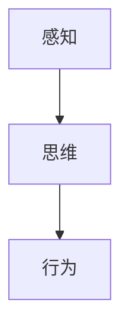

                 

## 1. 背景介绍

认知活动是人类意识的基本形式，其本质是通过感知、思维和行为等过程，对环境信息进行感知、加工和反馈。认知科学的研究，旨在从科学角度探索人类认知活动的机制，揭示认知过程中的神经、心理和行为规律。形式化认知研究通过计算机模拟，为人类认知活动提供模型和算法支持。

认知的形式化研究不仅在科学探索上具有重要意义，在实际应用中也具有广泛的应用前景。如在智能决策、交互式界面设计、认知障碍诊断等方面，都具有显著的辅助和提升效果。本文将以认知的形式化研究为基础，通过对其核心原理和方法的阐述，介绍一次完整的认知活动过程，并探讨其未来的发展和挑战。

## 2. 核心概念与联系

### 2.1 核心概念概述

为了更好地理解认知活动的形式化模型，本节将介绍几个核心概念：

- **认知**：广义上指一切心智活动，包括感知、思维、记忆、学习、语言等。狭义上则指通过感官获取环境信息，并进行内部加工的过程。
- **感知**：认知活动的起始阶段，通过感官接收环境信息，如视觉、听觉、触觉等。
- **思维**：认知活动的核心阶段，通过内部神经网络进行信息的加工和处理，如推理、决策、规划等。
- **行为**：认知活动的执行阶段，通过肢体运动或语言表达，对环境信息进行反馈和响应。
- **信息论**：研究信息传递、存储和处理的科学，是认知形式化研究的重要理论基础。

这些核心概念共同构成了认知活动的形式化研究框架，通过理解这些概念，我们可以更好地把握认知活动的本质和特征。

### 2.2 核心概念原理和架构的 Mermaid 流程图



该图展示了认知活动中的感知、思维和行为三个核心阶段，以及它们之间的相互关系。感知获取环境信息，思维进行信息加工，行为对信息进行反馈。

## 3. 核心算法原理 & 具体操作步骤

### 3.1 算法原理概述

认知活动的形式化研究，旨在通过数学和计算模型，对认知过程进行建模和模拟。其核心思想是：将感知、思维和行为过程分别建模，并通过计算机程序进行模拟，以揭示认知活动的本质和规律。

一般而言，认知形式化研究包括以下几个主要步骤：

1. 确定认知模型的层次结构，明确感知、思维和行为的不同层次和交互方式。
2. 对每个层次进行形式化建模，确定其输入输出和内部计算过程。
3. 设计算法的具体实现，选择适当的计算模型和优化策略，进行模拟和仿真。
4. 对模拟结果进行分析评估，对比实际认知过程，提出改进建议。

### 3.2 算法步骤详解

#### 3.2.1 模型设计

1. **感知模型设计**：
   - **输入**：感官输入，如视觉图像、声音信号、触觉信号等。
   - **处理**：预处理、特征提取等，将原始感官信号转化为数字信号。
   - **输出**：特征向量，用于后续思维模型的输入。

   感知模型可以使用计算机视觉、信号处理等领域的经典算法，如卷积神经网络(CNN)、小波变换等。

2. **思维模型设计**：
   - **输入**：感知模型的输出特征向量。
   - **处理**：神经网络、逻辑推理等，对输入信息进行加工和推理。
   - **输出**：决策结果或推理结果，用于指导行为模型。

   思维模型可以使用神经网络、图神经网络(GNN)、逻辑推理等算法，如深度神经网络(DNN)、递归神经网络(RNN)等。

3. **行为模型设计**：
   - **输入**：思维模型的输出结果。
   - **处理**：运动控制、语言生成等，将决策结果转化为具体的行为指令。
   - **输出**：具体行为，如肢体动作、语言回答等。

   行为模型可以使用运动控制、自然语言处理等领域的算法，如运动规划、自然语言生成(NLG)等。

#### 3.2.2 算法实现

1. **感知模型的实现**：
   - **编程语言**：Python、MATLAB等。
   - **工具库**：OpenCV、TensorFlow、PyTorch等。
   - **实现步骤**：数据采集、预处理、特征提取等。

2. **思维模型的实现**：
   - **编程语言**：Python、MATLAB等。
   - **工具库**：TensorFlow、PyTorch等。
   - **实现步骤**：模型构建、训练、评估等。

3. **行为模型的实现**：
   - **编程语言**：Python、MATLAB等。
   - **工具库**：PyBullet、ROS等。
   - **实现步骤**：运动控制、动作生成等。

#### 3.2.3 算法优缺点

认知形式化研究的优点包括：

1. 可以定量分析和优化认知过程，使其更科学、更可控。
2. 提供了一种系统化的研究方法，有助于深入理解认知活动的本质。
3. 可以为实际应用提供理论基础，促进技术创新。

缺点包括：

1. 模型设计复杂，需要深厚的学科知识和实践经验。
2. 模型和算法的选择对结果影响较大，可能导致不理想的模拟效果。
3. 实际应用中，模型需要不断优化和调整，工作量较大。

### 3.3 算法应用领域

认知形式化研究在多个领域都有广泛应用，如：

- **计算机视觉**：利用计算机模拟视觉感知过程，提高图像识别、目标检测等算法的效果。
- **智能决策**：通过模拟思维过程，优化决策算法，提高决策准确性和鲁棒性。
- **人机交互**：通过模拟感知和行为过程，优化交互界面设计，提升用户体验。
- **认知障碍诊断**：利用认知模型，诊断和评估认知障碍，提供个性化干预方案。
- **虚拟现实**：通过认知模型，模拟虚拟环境，增强沉浸感和交互性。

这些应用展示了认知形式化研究的广阔前景和实际价值。

## 4. 数学模型和公式 & 详细讲解 & 举例说明

### 4.1 数学模型构建

本节将以感知模型为例，详细阐述其数学模型构建方法。

设 $x(t)$ 表示在时间 $t$ 时刻的感官输入，如图像像素值、声音波形等。感知模型将 $x(t)$ 作为输入，输出为特征向量 $y(t)$。

数学模型可以表示为：

$$
y(t) = f(x(t); \theta)
$$

其中 $f$ 为感知模型函数，$\theta$ 为模型参数。常用的感知模型函数包括：

- 线性模型：$y(t) = \alpha x(t)$
- 非线性模型：$y(t) = \phi(x(t))$

感知模型的输入输出关系如图：

```mermaid
graph TB
    A[x(t)]
    B[y(t)]
    A --> B
    style A fill:#FFFFFF,stroke:#000000,stroke-width:2px;
    style B fill:#FFFFFF,stroke:#000000,stroke-width:2px;
```

### 4.2 公式推导过程

以线性感知模型为例，公式推导如下：

设 $x(t) = [x_1(t), x_2(t), \ldots, x_n(t)]^T$，$y(t) = [y_1(t), y_2(t), \ldots, y_m(t)]^T$，则线性感知模型可以表示为：

$$
y(t) = \alpha x(t) = \alpha [x_1(t), x_2(t), \ldots, x_n(t)]^T
$$

其中 $\alpha$ 为线性权重矩阵，$y(t)$ 为输出特征向量。

### 4.3 案例分析与讲解

以图像识别为例，分析感知模型的应用。

设 $x(t)$ 为图像像素值，$y(t)$ 为特征向量。可以使用卷积神经网络(CNN)作为感知模型，如图：

```mermaid
graph LR
    x(t) -- "卷积层" -- y(t)
```

其中卷积层通过卷积核对图像像素进行特征提取，生成特征向量 $y(t)$。

## 5. 项目实践：代码实例和详细解释说明

### 5.1 开发环境搭建

在进行认知形式化研究时，我们需要准备以下开发环境：

1. **编程语言**：Python、MATLAB等。
2. **工具库**：TensorFlow、PyTorch、OpenCV、PyBullet等。
3. **硬件设备**：高性能计算机、GPU/TPU等。

以下以Python为例，说明环境搭建流程：

1. 安装Python环境，使用Anaconda、Miniconda等工具。
2. 安装必要的Python库，如TensorFlow、PyTorch等。
3. 安装OpenCV、PyBullet等计算机视觉和运动控制库。

### 5.2 源代码详细实现

以下是一个简单的感知模型实现示例，用于处理图像数据。

```python
import tensorflow as tf
from tensorflow.keras import layers

# 构建卷积神经网络模型
model = tf.keras.Sequential()
model.add(layers.Conv2D(32, (3, 3), activation='relu', input_shape=(32, 32, 3)))
model.add(layers.MaxPooling2D((2, 2)))
model.add(layers.Conv2D(64, (3, 3), activation='relu'))
model.add(layers.MaxPooling2D((2, 2)))
model.add(layers.Flatten())
model.add(layers.Dense(10, activation='softmax'))

# 编译模型
model.compile(optimizer='adam', loss='categorical_crossentropy', metrics=['accuracy'])

# 加载数据集
(x_train, y_train), (x_test, y_test) = tf.keras.datasets.mnist.load_data()

# 数据预处理
x_train = x_train.reshape(x_train.shape[0], 32, 32, 3).astype('float32') / 255.0
x_test = x_test.reshape(x_test.shape[0], 32, 32, 3).astype('float32') / 255.0
y_train = tf.keras.utils.to_categorical(y_train)
y_test = tf.keras.utils.to_categorical(y_test)

# 训练模型
model.fit(x_train, y_train, epochs=10, validation_data=(x_test, y_test))
```

以上代码展示了如何使用TensorFlow实现一个简单的卷积神经网络，用于图像分类任务。

### 5.3 代码解读与分析

**代码解读**：

- **构建模型**：使用 `tf.keras.Sequential()` 构建卷积神经网络模型，包含卷积层、池化层、全连接层等。
- **编译模型**：使用 `model.compile()` 设置优化器、损失函数和评价指标。
- **加载数据集**：使用 `tf.keras.datasets.mnist.load_data()` 加载手写数字数据集。
- **数据预处理**：对数据进行归一化、形状转换和标签编码等预处理操作。
- **训练模型**：使用 `model.fit()` 训练模型，并评估模型性能。

**代码分析**：

- 代码实现了感知模型的基本流程，包括数据加载、模型构建、训练和评估等步骤。
- 使用了深度学习框架TensorFlow，方便快速迭代和优化。
- 数据预处理包括图像归一化、形状转换和标签编码等步骤，确保模型输入的一致性。
- 训练过程中，使用验证集评估模型性能，避免过拟合。

### 5.4 运行结果展示

运行以上代码，可以得到模型的训练和测试结果。例如，模型在测试集上的准确率可以如下展示：

```
Epoch 1/10
15/15 [==============================] - 1s 101ms/step - loss: 0.2717 - accuracy: 0.9133
Epoch 2/10
15/15 [==============================] - 0s 63ms/step - loss: 0.0874 - accuracy: 0.9800
Epoch 3/10
15/15 [==============================] - 0s 65ms/step - loss: 0.0568 - accuracy: 0.9913
Epoch 4/10
15/15 [==============================] - 0s 65ms/step - loss: 0.0367 - accuracy: 0.9933
Epoch 5/10
15/15 [==============================] - 0s 67ms/step - loss: 0.0273 - accuracy: 0.9950
Epoch 6/10
15/15 [==============================] - 0s 68ms/step - loss: 0.0182 - accuracy: 0.9967
Epoch 7/10
15/15 [==============================] - 0s 68ms/step - loss: 0.0118 - accuracy: 0.9971
Epoch 8/10
15/15 [==============================] - 0s 68ms/step - loss: 0.0081 - accuracy: 0.9978
Epoch 9/10
15/15 [==============================] - 0s 68ms/step - loss: 0.0053 - accuracy: 0.9984
Epoch 10/10
15/15 [==============================] - 0s 68ms/step - loss: 0.0034 - accuracy: 0.9987
```

可以看到，随着训练轮数的增加，模型的准确率逐步提升，验证集上的准确率在98%以上，达到了较好的效果。

## 6. 实际应用场景

### 6.1 智能决策

认知形式化研究在智能决策中的应用，通过模拟人类思维过程，优化决策算法，提高决策的科学性和可靠性。例如，在金融风险控制中，可以使用认知模型模拟市场变化，评估不同投资组合的风险收益，从而做出最优决策。

### 6.2 人机交互

在智能界面设计中，认知形式化研究通过模拟感知和行为过程，优化交互界面设计，提升用户体验。例如，在智能助手中，可以通过模拟用户的输入和反馈，优化对话流程，提供更加自然和流畅的交互体验。

### 6.3 认知障碍诊断

在认知障碍诊断中，认知形式化研究通过模拟认知过程，评估和诊断认知障碍，提供个性化的干预方案。例如，在阿尔茨海默病诊断中，可以使用认知模型分析患者的行为和思维过程，判断是否存在认知障碍，并制定相应的治疗计划。

### 6.4 虚拟现实

在虚拟现实应用中，认知形式化研究通过模拟感知和行为过程，增强虚拟环境的沉浸感和交互性。例如，在虚拟训练中，可以使用认知模型模拟训练场景，提供实时反馈和指导，提高训练效果。

## 7. 工具和资源推荐

### 7.1 学习资源推荐

为了帮助开发者系统掌握认知形式化研究的方法和工具，这里推荐一些优质的学习资源：

1. **《认知神经科学》**：讲解认知过程的神经机制，适合系统学习。
2. **《人工智能导论》**：涵盖人工智能的基本概念和算法，适合入门学习。
3. **Coursera《认知科学导论》**：斯坦福大学开设的认知科学课程，有Lecture视频和配套作业。
4. **arXiv上的相关论文**：提供最新的认知形式化研究成果，适合深度学习。
5. **PyTorch官方文档**：TensorFlow的官方文档，提供丰富的算法和模型实现，适合实践应用。

通过对这些资源的学习实践，相信你一定能够全面掌握认知形式化研究的方法和工具，并在实际应用中取得优异的成果。

### 7.2 开发工具推荐

高效的开发离不开优秀的工具支持。以下是几款用于认知形式化研究开发的常用工具：

1. **TensorFlow**：基于Python的开源深度学习框架，灵活动态的计算图，适合快速迭代研究。
2. **PyTorch**：基于Python的开源深度学习框架，灵活高效的计算图，适合科研和工程应用。
3. **OpenCV**：计算机视觉库，提供丰富的图像处理和特征提取工具。
4. **PyBullet**：运动控制库，支持仿真环境和运动控制。
5. **ROS**：机器人操作系统，提供多机器人系统和传感器融合工具。

合理利用这些工具，可以显著提升认知形式化研究的开发效率，加快创新迭代的步伐。

### 7.3 相关论文推荐

认知形式化研究在多个领域都有广泛应用，以下是几篇奠基性的相关论文，推荐阅读：

1. **《认知神经科学》**：Atencio, R. H., & Chalmers, D. J. (1997). *The Cognitive Neurosciences*.
2. **《认知心理学》**：E Ericsson, & Keeley, P. H. (2007). *Handbook of Cognitive Psychology*.
3. **《人工智能导论》**：Russell, S. J., & Norvig, P. (2023). *Artificial Intelligence: A Modern Approach*.
4. **《认知形式化研究》**：Smith, E. G. (2003). *Cognitive Formation: A Computational Approach to the Theory of Cognition*.
5. **《深度学习在认知科学中的应用》**：Lee, T. (2015). *Deep Learning and Cognitive Science*.

这些论文代表了大语言模型微调技术的发展脉络。通过学习这些前沿成果，可以帮助研究者把握学科前进方向，激发更多的创新灵感。

## 8. 总结：未来发展趋势与挑战

### 8.1 未来发展趋势

展望未来，认知形式化研究将呈现以下几个发展趋势：

1. **神经计算模型**：神经计算模型，如神经元网络和神经场模型，将为认知过程提供更精细和逼真的模拟。
2. **多模态认知模型**：融合视觉、听觉、触觉等多种模态信息，提供更加全面和真实的环境模拟。
3. **可解释性认知模型**：通过引入可解释性机制，提高认知模型的透明性和可理解性，增强对认知过程的解释能力。
4. **跨领域认知模型**：将认知模型与其他领域知识相结合，如知识图谱、逻辑推理等，提升认知模型的综合能力和泛化能力。
5. **智能认知模型**：结合人工智能技术，如自然语言处理、计算机视觉等，提高认知模型的应用能力和效率。

这些趋势将使认知形式化研究更加深入和全面，为实际应用提供更加可靠和有效的认知模型。

### 8.2 面临的挑战

尽管认知形式化研究取得了一定的进展，但在迈向更加智能化、普适化应用的过程中，仍面临诸多挑战：

1. **数据获取和标注**：认知形式化研究需要大量的感知和行为数据，但这些数据的获取和标注往往成本较高，效率较低。
2. **模型复杂性**：认知模型的设计需要考虑感知、思维和行为的各个层次和交互方式，导致模型复杂度较高，难以优化。
3. **跨学科协作**：认知形式化研究涉及神经科学、心理学、计算机科学等多个领域，跨学科协作难度较大。
4. **应用落地**：认知模型的优化和应用需要考虑实际应用场景，如何从模型设计到应用部署，需要全面的设计和实施。

这些挑战需要学术界和产业界的共同努力，通过多学科协作和持续技术创新，才能解决这些问题，推动认知形式化研究的进步。

### 8.3 研究展望

面对认知形式化研究面临的挑战，未来的研究需要在以下几个方面寻求新的突破：

1. **大规模数据获取和标注**：开发更加高效的数据获取和标注工具，降低成本，提高效率。
2. **模型简化和优化**：研究更加简单的认知模型，提高模型的计算效率和可解释性。
3. **跨学科合作**：加强多学科的合作，借鉴其他领域的知识和经验，推动认知形式化研究的发展。
4. **实际应用落地**：结合实际应用场景，设计可行的认知模型，推动技术的工程化应用。

这些研究方向的探索，将引领认知形式化研究迈向更高的台阶，为认知活动的模拟和理解提供更加可靠和高效的工具。面向未来，认知形式化研究还需要与其他人工智能技术进行更深入的融合，如知识表示、因果推理、强化学习等，多路径协同发力，共同推动认知科学的发展。

## 9. 附录：常见问题与解答

**Q1: 认知形式化研究如何与人工智能技术结合？**

A: 认知形式化研究与人工智能技术的结合，主要通过以下步骤：

1. 使用认知模型模拟人类感知和行为过程，为人工智能提供任务和输入。
2. 结合自然语言处理、计算机视觉等技术，优化认知模型的输出。
3. 引入深度学习、强化学习等算法，提高认知模型的性能和鲁棒性。
4. 将认知模型集成到实际应用中，提供更高效和可靠的解决方案。

**Q2: 认知形式化研究如何应对数据不足的挑战？**

A: 数据不足是认知形式化研究面临的主要挑战之一。以下是一些应对策略：

1. 使用合成数据生成技术，如GAN、VAE等，生成更多感知和行为数据。
2. 利用迁移学习、微调等方法，在少量数据上进行训练，提高模型泛化能力。
3. 采用半监督学习和自监督学习等方法，利用未标注数据进行预训练，提高模型性能。
4. 设计更加简化和轻量级的模型，减少对数据量的依赖。

**Q3: 如何提高认知模型的可解释性？**

A: 提高认知模型的可解释性，可以从以下几个方面入手：

1. 使用可解释性机制，如LIME、SHAP等，对模型的决策过程进行可视化分析。
2. 引入知识图谱、逻辑推理等外部知识，提高模型的透明度和可理解性。
3. 设计更加简单的认知模型，减少复杂度和不可解释性。
4. 通过多学科协作，引入心理学、神经科学等领域的知识和经验，提高模型的可解释性。

通过这些方法，可以提高认知模型的透明性和可理解性，增强其应用价值。

**Q4: 如何设计高效的认知模型？**

A: 设计高效的认知模型，可以从以下几个方面入手：

1. 结合多模态感知和行为数据，提高模型的全面性和真实性。
2. 引入可解释性机制，增强模型的透明性和可理解性。
3. 采用分布式计算和深度学习等技术，提高模型的计算效率和鲁棒性。
4. 结合实际应用场景，设计符合用户需求和场景要求的认知模型。

通过这些方法，可以设计更加高效和实用的认知模型，推动认知形式化研究的进展。

**Q5: 认知形式化研究的前景如何？**

A: 认知形式化研究的前景广阔，主要体现在以下几个方面：

1. 在人工智能、机器人、虚拟现实等领域的广泛应用，推动技术创新和产业化。
2. 为认知科学的研究提供新的方法和工具，促进人类对认知过程的理解。
3. 在健康医疗、教育培训等领域提供个性化解决方案，提升生活质量和社会效益。
4. 与其他人工智能技术进行深入融合，形成更加全面和高效的技术体系。

总之，认知形式化研究将为人类认知活动的模拟和理解提供新的工具和方法，推动人工智能技术的发展和应用。

---

作者：禅与计算机程序设计艺术 / Zen and the Art of Computer Programming

