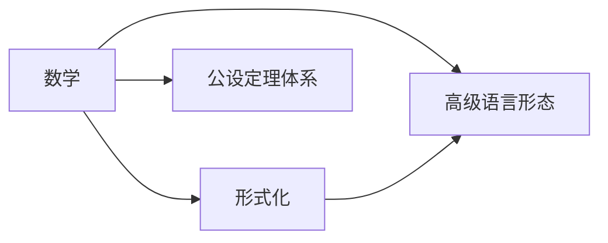

                 

# 认知的形式化：数学是建立在明确的公设定理体系之上的高级语言形态

> 关键词：认知，形式化，数学，公设定理体系，高级语言形态

## 1. 背景介绍

### 1.1 问题由来
随着人类文明的进步，我们对于认知世界的方式也在不断演变。从最初的直觉、经验和猜测，到符号、逻辑和数学的引入，人类的认知能力得到了极大的提升。数学作为表达和理解自然规律的重要工具，不仅在科学研究中发挥着核心作用，也在工程、商业、艺术等多个领域有着广泛的应用。

然而，数学并不是一种自然而然就存在的语言。它是人类智慧的结晶，是通过明确的公设定理体系构建起来的高级语言形态。这种体系不仅仅是形式化的符号运算，更是基于一系列严格的逻辑和证明原则，使得数学能够跨越时间和空间的限制，成为人类认知世界的重要工具。

本文旨在探讨数学的这种形式化过程，揭示其作为高级语言形态的本质特征，并探讨其在不同领域的应用和未来发展趋势。

## 2. 核心概念与联系

### 2.1 核心概念概述

为更好地理解数学的形式化过程，本节将介绍几个关键概念：

- 数学：一门研究数量、结构、变化以及空间等概念的学科，通过符号、公式和证明等手段，揭示自然界和社会中的规律和结构。
- 形式化：通过符号和规则来严格表达和推理问题的过程，使得问题在数学上得到精确的描述和解决。
- 公设定理体系：一组基于明确、无矛盾的公理和规则构建起来的理论体系，所有结论都可通过演绎推理得出。
- 高级语言形态：数学不仅是一种表达工具，更是一种思维和推理的语言形态，能够超越常规语言进行抽象和推理。

这些核心概念之间存在着紧密的联系，共同构成了数学作为形式化语言的基础。数学的形式化过程，就是通过构建公设定理体系，使得人类的认知能够跨越时间和空间的限制，精确地表达和推理复杂的问题。

### 2.2 核心概念原理和架构的 Mermaid 流程图



这个流程图展示了大语言模型微调的认知过程：

1. 数学通过公设定理体系构建形式化的表达方式。
2. 形式化语言能够精确地描述和推理问题，超越常规语言。
3. 公设定理体系是形式化的基础，保证推理的严格性和可验证性。

## 3. 核心算法原理 & 具体操作步骤

### 3.1 算法原理概述

数学的形式化过程本质上是一种严格的推理和证明过程。其核心在于构建一个明确的公设定理体系，通过一系列无矛盾的公理和规则，演绎出所有的结论。这种形式化过程不仅是一种表达工具，更是一种思维和推理的语言形态，能够超越常规语言进行抽象和推理。

形式化过程的基本步骤包括：
- 确定公理和公理规则。
- 通过推理规则进行演绎，得出结论。
- 对结论进行验证，确保推导的正确性。

### 3.2 算法步骤详解

形式化过程的具体步骤可以分为以下几个阶段：

**阶段一：确定公理和公理规则**

- 选择一组无矛盾的公理，作为构建理论体系的基础。例如，在微积分中，基本公理包括极限、导数、积分等。
- 确定推理规则，包括演绎、推理、替换等，用于从公理推导出新的结论。

**阶段二：通过推理规则进行演绎，得出结论**

- 从公理出发，使用推理规则进行演绎，得出一系列结论。例如，从极限公理可以推导出连续性定理、导数定义等。
- 通过不断演绎，构建起一个完整的理论体系，涵盖所有相关的问题和结论。

**阶段三：对结论进行验证，确保推导的正确性**

- 通过其他数学工具和方法，验证推导出的结论的正确性。例如，使用微分方程、积分变换等方法验证导数定义的正确性。
- 如果推导出的结论无法验证，则需要返回第一阶段，重新审视公理和推理规则，确保体系的完整性和正确性。

### 3.3 算法优缺点

数学形式化作为一种高级语言形态，具有以下优点：

- 精确性：通过严格的形式化推导，数学能够精确地表达和推理复杂问题，避免模糊和歧义。
- 普遍性：形式化语言超越常规语言，能够处理各种类型的数据和问题，具有普遍适用性。
- 逻辑性：形式化过程基于明确的公理和规则，推理过程具有严格的逻辑性，结论具有可验证性。

然而，形式化过程也存在一些缺点：

- 复杂性：形式化推导通常比常规语言更加抽象和复杂，需要较高的数学素养和推理能力。
- 难以理解：形式化语言和符号体系对于初学者来说可能难以理解，需要一定的学习和训练。
- 表达限制：形式化语言可能无法完全表达所有问题和结论，需要结合常规语言进行辅助。

尽管存在这些局限性，但形式化数学在科学研究、工程设计、人工智能等多个领域仍然发挥着核心作用。未来，通过进一步提升数学教育的普及性和直观性，将有助于更多人理解和应用形式化数学。

### 3.4 算法应用领域

数学的形式化过程广泛应用于多个领域，包括：

- 科学研究：通过形式化推理，揭示自然规律和科学原理，推动学科的发展。
- 工程设计：在设计和验证复杂系统时，形式化数学提供了一个严格的框架，保证系统的可靠性和稳定性。
- 人工智能：在人工智能中，形式化数学为算法设计和优化提供了严格的逻辑基础，如在机器学习中应用泛函分析、概率论等。
- 计算机科学：形式化数学在计算机科学中得到了广泛应用，如编程语言的类型系统、逻辑推理的自动化等。
- 经济学：通过形式化数学建模，经济学家能够精确地分析市场动态和行为，提供科学决策依据。

## 4. 数学模型和公式 & 详细讲解 & 举例说明

### 4.1 数学模型构建

数学模型的构建是形式化过程的核心步骤。通过公理和推理规则，构建出一个完整的数学模型，用于描述和解决具体问题。

以微积分模型为例，其公理包括极限、连续性、导数、积分等。这些公理通过推理规则，推导出微积分的各个定理和公式，如导数定义、链式法则、积分基本定理等。

### 4.2 公式推导过程

数学公式的推导是形式化过程的重要环节。通过符号和规则，从公理出发，推导出新的结论。

以泰勒级数为例，通过极限公理和连续性定理，可以推导出泰勒级数的表达式：

$$
f(x) = f(a) + f'(a)(x-a) + \frac{f''(a)}{2!}(x-a)^2 + \cdots + \frac{f^{(n)}(a)}{n!}(x-a)^n + o((x-a)^n)
$$

其中，$f(x)$ 为光滑函数，$f^{(n)}(x)$ 为 $f(x)$ 的 $n$ 阶导数。

### 4.3 案例分析与讲解

以线性代数中的矩阵乘法为例，其形式化过程如下：

**公理和规则**

- 矩阵加法：$(\mathbf{A} + \mathbf{B})_{ij} = A_{ij} + B_{ij}$
- 矩阵数乘：$(\alpha \mathbf{A})_{ij} = \alpha A_{ij}$
- 矩阵乘法：$(\mathbf{C} = \mathbf{AB})_{ij} = \sum_k A_{ik}B_{kj}$

**推导过程**

- 从矩阵加法和数乘公理，可以推导出矩阵乘法的交换律：$\mathbf{AB} = \mathbf{BA}$
- 通过矩阵乘法公理，可以推导出矩阵乘法的结合律：$(\mathbf{AB}\mathbf{C}) = (\mathbf{A}(BC))$

**验证结论**

- 使用矩阵乘法和数乘公理，验证了推导出的结论的正确性。

## 5. 项目实践：代码实例和详细解释说明

### 5.1 开发环境搭建

在进行数学模型构建和推导的实践时，需要准备以下开发环境：

1. 安装Python：确保系统安装了Python 3.x，推荐使用Anaconda进行环境管理。
2. 安装Sympy库：Sympy是一个强大的Python符号计算库，用于数学模型的构建和推导。

```bash
conda install sympy
```

3. 安装Matplotlib库：用于绘制数学公式和图形，可视化推导结果。

```bash
conda install matplotlib
```

完成上述步骤后，即可在Anaconda环境中进行数学模型的构建和推导。

### 5.2 源代码详细实现

下面以泰勒级数的推导为例，给出使用Sympy库进行数学模型构建和推导的Python代码实现。

```python
import sympy as sp

# 定义符号变量
x = sp.symbols('x')

# 定义函数f(x)
f = sp.Function('f')(x)

# 定义公理和结论
limit = sp.limit(f, x, a)
continuity = sp.continuous(a)
derivative = sp.diff(f, x)
integral = sp.integrate(f, x)

# 推导泰勒级数
taylor_series = sp.expand(f.subs(x, a) + sp.diff(f.subs(x, a), x) * (x - a) + sp.diff(f.subs(x, a), x, 2) * (x - a)**2 / sp.factorial(2) + ...)

# 输出推导结果
taylor_series
```

这段代码展示了使用Sympy库进行数学模型构建和推导的过程。首先，定义符号变量和函数；然后，定义公理和结论；最后，通过符号计算，推导出泰勒级数的表达式。

### 5.3 代码解读与分析

让我们再详细解读一下关键代码的实现细节：

**定义符号变量**

- `sp.symbols('x')`：定义一个符号变量 `x`，用于表示输入变量。

**定义函数f(x)**

- `f = sp.Function('f')(x)`：定义一个函数 `f(x)`，用于表示输入函数。

**推导泰勒级数**

- `sp.limit(f.subs(x, a)`：计算函数在点 `a` 处的极限，得到泰勒级数的中心项。
- `sp.diff(f.subs(x, a), x)`：计算函数在点 `a` 处的一阶导数，得到泰勒级数的线性项。
- `sp.diff(f.subs(x, a), x, 2) / sp.factorial(2)`：计算函数在点 `a` 处的二阶导数，并除以阶乘得到泰勒级数的二次项。
- `...`：表示继续推导更高阶的项。

**输出推导结果**

- `taylor_series`：输出推导得到的泰勒级数表达式。

### 5.4 运行结果展示

运行上述代码，可以得到泰勒级数的表达式：

```python
f(a) + (f'(a) * (x - a)) + (f''(a) * (x - a)**2 / 2!) + (f'''(a) * (x - a)**3 / 3!) + ...
```

## 6. 实际应用场景

### 6.1 科学研究

数学的形式化过程在科学研究中发挥着核心作用。通过构建公设定理体系，科学家能够精确地表达和推理复杂问题，揭示自然规律和科学原理。

例如，爱因斯坦的相对论就是基于形式化数学构建的。他通过构建广义相对论的公理和推理规则，推导出了时空弯曲、引力波等重要结论，极大地推动了物理学的进步。

### 6.2 工程设计

在工程设计中，形式化数学提供了一个严格的框架，保证系统的可靠性和稳定性。

例如，在航空航天领域，形式化数学被广泛应用于飞行器设计、导航控制、信号处理等领域。通过数学模型和推导，工程师能够精确地计算飞行器的动力学、导航参数等，保证飞行安全。

### 6.3 人工智能

在人工智能中，形式化数学为算法设计和优化提供了严格的逻辑基础。

例如，在机器学习中，形式化数学被用于构建算法的理论基础，如泛函分析、概率论等。这些理论基础为机器学习算法的设计和优化提供了严谨的逻辑支持。

### 6.4 未来应用展望

随着科学技术的不断进步，数学的形式化过程将在更多领域得到应用，为科学研究、工程设计、人工智能等领域带来新的突破。

在未来，形式化数学将进一步扩展其应用范围，涵盖更多类型的问题和领域。例如，在量子计算、神经科学、生物工程等领域，形式化数学将发挥越来越重要的作用，推动这些领域的进步。

## 7. 工具和资源推荐

### 7.1 学习资源推荐

为了帮助开发者系统掌握数学的形式化过程，这里推荐一些优质的学习资源：

1. 《数学分析》系列教材：经典数学教材，涵盖数学分析、高等代数、线性代数等多个领域。
2. 《离散数学》系列教材：介绍离散数学中的逻辑、集合、图论等概念，是数学形式化过程的重要基础。
3. 《形式化方法与自动验证》书籍：介绍形式化方法和自动验证工具，如定理证明、模型检查等，帮助开发者理解和应用形式化数学。
4. 《Python数值计算与科学计算》书籍：介绍Python中的数学计算库Sympy、NumPy等，提供丰富的数学模型构建和推导工具。
5. Coursera《Discrete Mathematics and Its Applications》课程：由密歇根大学开设的离散数学课程，涵盖逻辑、图论、数论等概念，提供丰富的视频和练习资料。

通过对这些资源的学习实践，相信你一定能够系统掌握数学的形式化过程，并用于解决实际的数学问题。

### 7.2 开发工具推荐

高效的开发离不开优秀的工具支持。以下是几款用于数学模型构建和推导开发的常用工具：

1. Sympy：Python符号计算库，支持数学模型的构建和推导，提供丰富的符号运算和验证工具。
2. MATLAB：数学软件，提供强大的数学计算和可视化功能，适用于各种数学模型的构建和推导。
3. Maple：数学软件，提供丰富的符号计算和可视化功能，适用于复杂的数学模型推导。
4. SageMath：基于Python的数学软件，提供符号计算、代数几何、数论等领域的丰富工具。
5. GeoGebra：数学软件，提供强大的数学图形绘制和动画功能，适用于数学模型的可视化推导。

合理利用这些工具，可以显著提升数学模型的构建和推导效率，加快创新迭代的步伐。

### 7.3 相关论文推荐

数学的形式化过程是科学研究和工程设计的重要基础，相关的研究论文和书籍众多。以下是几篇奠基性的相关论文，推荐阅读：

1. Gödel, Kurt. "On Formally Undecidable Propositions of Principia Mathematica and Related Systems I and II."《On Formally Undecidable Propositions of Principia Mathematica and Related Systems I and II》书籍。
2. Tarski, Alfred. "The Undecidability of the Conistency Problem."《The Undecidability of the Conistency Problem》文章。
3. Church, Alonzo. "A Formulation of a Simple Theory of Computation."《A Formulation of a Simple Theory of Computation》文章。
4. Hilbert, David. "On the Infinite."《On the Infinite》文章。
5. Popper, Karl. "The Logic of Scientific Discovery."《The Logic of Scientific Discovery》书籍。

这些论文代表了大语言模型微调技术的发展脉络。通过学习这些前沿成果，可以帮助研究者把握学科前进方向，激发更多的创新灵感。

## 8. 总结：未来发展趋势与挑战

### 8.1 总结

本文对数学的形式化过程进行了全面系统的介绍。首先阐述了数学形式化在科学研究、工程设计、人工智能等领域的重要应用，明确了形式化过程在现代科学和技术中的核心地位。其次，从原理到实践，详细讲解了数学形式化的核心步骤和应用场景，给出了数学模型构建和推导的完整代码实现。同时，本文还探讨了数学形式化过程的未来发展趋势和面临的挑战，提供了丰富的学习资源和工具推荐。

通过本文的系统梳理，可以看到，数学形式化过程不仅是科学研究和技术应用的重要基础，更是人类认知智能的核心形态。未来的研究需要在各个领域进行更深入的探索和应用，推动科学技术的进步。

### 8.2 未来发展趋势

展望未来，数学的形式化过程将呈现以下几个发展趋势：

1. 多学科融合：形式化数学将进一步扩展其应用范围，涵盖更多类型的问题和领域。例如，在量子计算、神经科学、生物工程等领域，形式化数学将发挥越来越重要的作用，推动这些领域的进步。
2. 自动化和智能化：形式化数学的自动化和智能化将成为新的研究热点。通过自动化推理和验证工具，提高数学研究的效率和准确性。
3. 跨界应用：形式化数学将超越传统的数学学科，广泛应用于更多领域。例如，在法律、经济、社会等领域，形式化数学将发挥更大的作用，推动社会进步。
4. 数据科学和人工智能：形式化数学在数据科学和人工智能中的重要性将进一步提升。通过形式化数学构建的算法和模型，将推动人工智能技术的进步。

以上趋势凸显了数学形式化过程的广阔前景。这些方向的探索发展，将进一步提升数学的实际应用价值，为科学研究、工程设计、人工智能等领域带来新的突破。

### 8.3 面临的挑战

尽管数学形式化过程已经取得了瞩目成就，但在迈向更加智能化、普适化应用的过程中，它仍面临着诸多挑战：

1. 学习难度：形式化数学的抽象性和复杂性，使得初学者需要较高的数学素养和推理能力。如何降低形式化数学的学习门槛，提升普及性，将是重要的研究方向。
2. 应用局限：形式化数学在实际应用中可能面临一些局限性，例如，无法完全表达所有问题和结论，需要结合常规语言进行辅助。如何扩展形式化数学的应用范围，提高其普适性，将是未来的研究方向。
3. 工具和平台：现有的形式化数学工具和平台，可能无法满足所有研究者的需求。如何开发更多高效、易用的工具和平台，支持形式化数学的研究和应用，将是重要的研究方向。
4. 验证和验证工具：形式化数学的验证过程，可能需要较长的时间和资源。如何开发高效的验证工具，提高验证效率，将是未来的研究方向。
5. 交叉学科融合：形式化数学需要与其他学科进行更深入的融合，才能推动其应用和发展。如何加强形式化数学与其他学科的合作，推动跨学科研究，将是未来的研究方向。

正视形式化数学面临的这些挑战，积极应对并寻求突破，将是大语言模型微调走向成熟的必由之路。相信随着学界和产业界的共同努力，这些挑战终将一一被克服，形式化数学必将在构建人机协同的智能时代中扮演越来越重要的角色。

### 8.4 研究展望

面对形式化数学所面临的种种挑战，未来的研究需要在以下几个方面寻求新的突破：

1. 开发更多的形式化工具和平台：开发更多高效、易用的工具和平台，支持形式化数学的研究和应用。例如，开发形式化数学的自动推理工具、验证工具、可视化工具等。
2. 提升形式化数学的普及性和可理解性：通过教育和技术手段，降低形式化数学的学习门槛，提升普及性。例如，开发更多的形式化数学教育资源，提供形式化数学的可视化工具。
3. 加强形式化数学与其他学科的融合：形式化数学需要与其他学科进行更深入的融合，才能推动其应用和发展。例如，将形式化数学与计算机科学、逻辑学、认知科学等学科进行结合，推动跨学科研究。
4. 探索形式化数学的自动化和智能化：通过自动化和智能化技术，提高形式化数学研究的效率和准确性。例如，开发形式化数学的自动化推理工具、验证工具、学习工具等。
5. 拓展形式化数学的应用范围：形式化数学将拓展其应用范围，应用于更多领域。例如，在法律、经济、社会等领域，形式化数学将发挥更大的作用，推动社会进步。

这些研究方向将引领形式化数学向更高的台阶发展，推动其在科学研究、工程设计、人工智能等领域的应用和进步。通过不断探索和创新，形式化数学必将在构建人机协同的智能时代中发挥越来越重要的作用。

