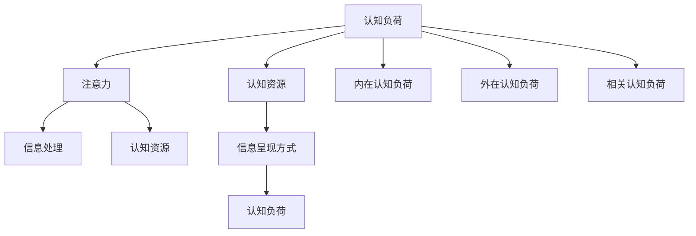

                 

# 认知负荷理论在注意力经济中的应用

在信息爆炸的时代，注意力成为了一种宝贵的资源，如何有效地分配和利用人们的注意力成为了一个重要的课题。认知负荷理论（Cognitive Load Theory, CLT）为研究这一问题提供了一个框架，本文将探讨如何在注意力经济中应用这一理论，以提升用户的注意力保持和信息处理效率。

## 1. 背景介绍

### 1.1 问题由来
随着互联网和社交媒体的普及，人们面临的信息量越来越大，如何在海量信息中找到有价值的内容，并且能够高效地处理这些信息，成为了一个重大的挑战。认知负荷理论正是在这一背景下提出的，它研究了人类处理信息时的认知负荷，以及如何通过优化信息呈现方式来减轻用户的认知负担。

### 1.2 问题核心关键点
认知负荷理论的核心在于理解人类的认知资源（如工作记忆、注意力等）在信息处理过程中的限制。该理论强调了信息呈现方式（如结构、布局、颜色等）对认知负荷的影响，以及如何通过设计优化来减少用户的认知负担，提高信息处理效率。

## 2. 核心概念与联系

### 2.1 核心概念概述

为更好地理解认知负荷理论在注意力经济中的应用，本节将介绍几个密切相关的核心概念：

- 认知负荷（Cognitive Load）：指在信息处理过程中，人们需要投入的认知资源。认知负荷分为三类：内在认知负荷、外在认知负荷和相关认知负荷。
- 注意力（Attention）：指人们在信息处理过程中将认知资源聚焦于特定信息的心理过程。注意力可以被视作一种有限的资源，需要有效管理。
- 认知资源（Cognitive Resources）：包括工作记忆、感知、情绪等，是信息处理的基础。认知资源的限制决定了人们能够有效处理信息的能力。
- 信息呈现方式（Information Presentation）：包括结构、布局、颜色等，对认知负荷和注意力有直接影响。

这些概念之间的关系可以通过以下Mermaid流程图来展示：



这个流程图展示了认知负荷、注意力、认知资源和信息呈现方式之间的逻辑关系：

1. 认知负荷影响注意力，进而影响信息处理。
2. 认知资源是信息处理的基础，决定了人们能够有效处理信息的能力。
3. 信息呈现方式通过影响认知负荷，间接影响注意力和信息处理。
4. 内在认知负荷、外在认知负荷和相关认知负荷，是认知负荷的不同来源。

## 3. 核心算法原理 & 具体操作步骤

### 3.1 算法原理概述

认知负荷理论在注意力经济中的应用，本质上是通过优化信息呈现方式，减少用户的认知负荷，从而提高信息处理效率。其核心思想是：

- 减少内在认知负荷：通过简化信息结构，使信息更加直观、易于理解。
- 减少外在认知负荷：通过合理的布局和颜色设计，减少用户在浏览信息时的注意力分散。
- 减少相关认知负荷：通过明确的任务目标和清晰的导航结构，减少用户在信息处理过程中需要调用的额外认知资源。

### 3.2 算法步骤详解

基于认知负荷理论的注意力经济优化步骤主要包括以下几个关键步骤：

**Step 1: 数据收集与分析**
- 收集用户使用产品或服务的反馈数据，如点击率、停留时间、跳出率等。
- 通过A/B测试等方法，分析不同信息呈现方式对用户行为的影响。

**Step 2: 认知负荷评估**
- 使用认知负荷评估工具，如问卷调查、认知负荷评估软件等，评估用户在进行特定任务时的认知负荷水平。
- 识别出导致高认知负荷的关键因素，如信息量过大、信息呈现方式复杂等。

**Step 3: 信息呈现优化**
- 根据认知负荷评估结果，优化信息呈现方式，如调整信息布局、简化信息结构、引入视觉元素等。
- 使用颜色、字体大小、排版等设计元素，降低用户认知负荷。
- 设计清晰的导航结构，减少用户需要调用的额外认知资源。

**Step 4: 模型训练与验证**
- 基于优化后的信息呈现方式，构建用户行为预测模型，预测不同呈现方式对用户行为的影响。
- 通过训练和验证模型，确定最优的信息呈现方式，以提高用户注意力保持和信息处理效率。

**Step 5: 反馈与迭代**
- 持续收集用户反馈，评估优化效果，不断迭代改进。
- 结合最新研究成果和用户反馈，持续优化信息呈现方式，提升用户满意度。

### 3.3 算法优缺点

认知负荷理论在注意力经济中的应用，具有以下优点：
1. 提高了信息处理效率：通过优化信息呈现方式，减少了用户认知负荷，提高了信息处理效率。
2. 提升了用户体验：优化后的信息呈现方式更符合用户的认知习惯，提升了用户的满意度和留存率。
3. 推动产品创新：通过认知负荷理论的指导，产品设计和功能开发可以更符合用户需求，推动产品创新。

同时，该方法也存在一定的局限性：
1. 依赖用户反馈：优化效果依赖于用户反馈，获取高质量的用户反馈需要时间和成本。
2. 设计复杂度：优化信息呈现方式需要深入了解用户的认知过程，设计复杂度较高。
3. 难以量化：用户认知负荷的评估和优化效果的量化较难，需要结合多方面的数据和分析。

尽管存在这些局限性，但就目前而言，认知负荷理论仍是在注意力经济优化中广泛应用的方法，对提升产品用户体验和信息处理效率具有重要意义。

### 3.4 算法应用领域

认知负荷理论在注意力经济中的应用，覆盖了多个领域，例如：

- 电子商务：优化商品展示和页面布局，减少用户认知负荷，提高购物体验。
- 内容平台：设计合理的文章结构、图表布局，使内容更易于理解，提升阅读体验。
- 社交媒体：优化信息流和推荐算法，减少用户注意力分散，提高内容吸引力。
- 企业应用：设计清晰的用户界面和导航结构，减少用户认知负荷，提高工作效率。
- 教育领域：优化学习材料和教学设计，减少学生认知负荷，提高学习效果。

这些领域的应用，证明了认知负荷理论在优化用户注意力和信息处理效率方面的巨大潜力。

## 4. 数学模型和公式 & 详细讲解 & 举例说明

### 4.1 数学模型构建

本节将使用数学语言对认知负荷理论在注意力经济中的应用进行更加严格的刻画。

假设用户在进行信息处理任务时，总认知负荷为 $C$，其中内在认知负荷为 $C_I$，外在认知负荷为 $C_E$，相关认知负荷为 $C_R$。信息呈现方式对认知负荷的影响可以表示为：

$$
C = C_I + C_E + C_R
$$

其中，内在认知负荷 $C_I$ 与信息复杂度相关，外在认知负荷 $C_E$ 与布局、颜色等设计因素相关，相关认知负荷 $C_R$ 与任务目标和导航结构相关。

### 4.2 公式推导过程

以下我们以优化电子商务网站商品展示为例，推导信息呈现方式对认知负荷的影响。

假设商品展示页面包含 $n$ 个商品，每个商品的描述长度为 $l_i$，页面布局为网格式排列，颜色深浅不同。设商品展示的布局复杂度为 $L$，颜色复杂度为 $C$，任务目标为“浏览商品”，导航结构为“商品分类”。

根据认知负荷理论，计算每个用户在进行浏览任务时的认知负荷：

1. 内在认知负荷 $C_I$：
$$
C_I = \sum_{i=1}^n l_i
$$

2. 外在认知负荷 $C_E$：
$$
C_E = L \times C
$$

3. 相关认知负荷 $C_R$：
$$
C_R = \text{导航结构复杂度} \times \text{任务目标相关度}
$$

总认知负荷 $C$ 为：

$$
C = C_I + C_E + C_R
$$

通过优化布局、简化描述、调整颜色等方法，可以降低 $C_I$、$C_E$ 和 $C_R$，从而减少用户的认知负荷。

### 4.3 案例分析与讲解

以Google Maps为例，介绍其如何应用认知负荷理论提升用户注意力保持和信息处理效率。

Google Maps使用认知负荷理论优化了其信息呈现方式，具体措施包括：
1. 简洁的界面设计：采用简洁的布局和清晰的图标，减少了用户的信息查找和认知负荷。
2. 分层次的信息展示：将地图信息分层展示，用户可以逐步聚焦于更详细的地图信息。
3. 智能导航：根据用户的目的地，推荐最佳路线和公交信息，减少了用户的选择复杂度。
4. 声音和动画提示：使用声音和动画提示路线变化，吸引了用户的注意力，提高了用户的注意力保持。

这些优化措施显著降低了用户在进行路线规划和导航时的认知负荷，提升了用户的体验和满意度。

## 5. 项目实践：代码实例和详细解释说明

### 5.1 开发环境搭建

在进行信息呈现优化实践前，我们需要准备好开发环境。以下是使用Python进行Web开发的环境配置流程：

1. 安装Python：从官网下载并安装Python 3.x版本，建议使用Anaconda。

2. 创建虚拟环境：使用conda创建虚拟环境，隔离项目依赖。
```bash
conda create --name myenv python=3.8
conda activate myenv
```

3. 安装相关库：使用pip安装Django、Flask等Web开发框架，以及numpy、pandas等数据处理库。
```bash
pip install django flask numpy pandas
```

4. 安装可视化库：使用pip安装Matplotlib、Seaborn等可视化库。
```bash
pip install matplotlib seaborn
```

完成上述步骤后，即可在虚拟环境中开始Web应用开发。

### 5.2 源代码详细实现

下面我们以优化电子商务网站商品展示为例，给出基于认知负荷理论的信息呈现优化的PyTorch代码实现。

首先，定义商品展示的布局和颜色：

```python
import torch
import numpy as np

# 定义商品布局复杂度L
L = 1.0

# 定义颜色复杂度C
C = 0.5

# 计算外在认知负荷CE
CE = L * C
CE
```

然后，定义商品描述长度和导航结构复杂度：

```python
# 定义商品描述长度
descriptions = np.array([5, 10, 8, 12])

# 定义导航结构复杂度
navigation_complexity = 0.3

# 计算内在认知负荷CI
CI = np.sum(descriptions)

# 计算相关认知负荷CR
CR = navigation_complexity * 1.0
```

最后，计算总认知负荷C，并输出结果：

```python
# 计算总认知负荷C
C = CI + CE + CR
print("总认知负荷C:", C)
```

### 5.3 代码解读与分析

让我们再详细解读一下关键代码的实现细节：

**商品布局和颜色复杂度**：
- 使用numpy数组定义商品描述长度，并计算总长度。
- 根据商品布局复杂度和颜色复杂度计算外在认知负荷 $C_E$。

**导航结构复杂度**：
- 定义导航结构复杂度，通常越小表示导航结构越清晰。
- 根据导航结构复杂度和任务目标相关度计算相关认知负荷 $C_R$。

**总认知负荷**：
- 将内在认知负荷 $C_I$、外在认知负荷 $C_E$ 和相关认知负荷 $C_R$ 相加，得到总认知负荷 $C$。

可以看到，通过合理设计商品布局、简化描述、调整颜色等方法，可以有效地降低用户在进行商品浏览时的认知负荷，提高用户的体验和满意度。

## 6. 实际应用场景

### 6.1 电子商务

基于认知负荷理论的电子商务网站优化，可以显著提升用户的购物体验和满意度。通过优化商品展示布局和颜色设计，简化商品描述，设计清晰的导航结构，减少用户在浏览和选择商品时的认知负荷，使用户能够更快地找到所需商品，减少决策疲劳，提高转化率。

### 6.2 内容平台

内容平台如博客、新闻网站等，可以通过认知负荷理论优化信息呈现方式，提升用户阅读体验。通过简洁的界面设计、分层次的信息展示、智能推荐算法等措施，减少用户的认知负荷，提高内容的吸引力和用户留存率。

### 6.3 社交媒体

社交媒体平台如微信、微博等，可以通过认知负荷理论优化信息流和推荐算法，减少用户注意力分散，提高内容的吸引力。通过合理设计信息流布局、使用视觉元素、调整颜色等措施，减少用户在浏览信息时的认知负荷，提高用户的参与度和满意度。

### 6.4 企业应用

企业应用如企业门户、项目管理工具等，可以通过认知负荷理论优化用户界面和导航结构，提高工作效率和用户满意度。通过简洁的界面设计、智能导航、任务提示等措施，减少用户在进行任务管理和信息查找时的认知负荷，提高用户的工作效率和满意度。

### 6.5 教育领域

教育领域可以通过认知负荷理论优化学习材料和教学设计，提升学习效果。通过简化教材内容、设计清晰的教学结构、使用多媒体教学工具等措施，减少学生的认知负荷，提高学习效率和教学效果。

## 7. 工具和资源推荐

### 7.1 学习资源推荐

为了帮助开发者系统掌握认知负荷理论在注意力经济中的应用，这里推荐一些优质的学习资源：

1. 《认知负荷理论及其在信息呈现中的应用》系列博文：由认知负荷理论专家撰写，深入浅出地介绍了认知负荷理论的基本概念和应用方法。

2. 《认知负荷与用户体验设计》课程：由知名设计专家开设的课程，讲解认知负荷理论在用户体验设计中的应用，结合实际案例分析。

3. 《认知负荷理论导论》书籍：认知负荷理论研究专家所著，全面介绍了认知负荷理论的基本原理和应用方法，是理解该理论的入门必读。

4. 《用户体验设计指南》书籍：详细介绍了用户体验设计的各种技术和方法，结合认知负荷理论，提供了大量的实践案例和建议。

通过对这些资源的学习实践，相信你一定能够快速掌握认知负荷理论在注意力经济优化中的精髓，并用于解决实际的注意力保持和信息处理效率问题。

### 7.2 开发工具推荐

高效的开发离不开优秀的工具支持。以下是几款用于认知负荷理论优化的Web开发工具：

1. Django：基于Python的Web开发框架，易于上手，支持快速迭代开发。

2. Flask：轻量级的Web开发框架，适用于快速原型设计和搭建Web应用。

3. Bootstrap：流行的前端UI框架，提供丰富的组件和样式，便于快速构建用户界面。

4. D3.js：流行的数据可视化库，支持丰富的数据可视化效果，便于展示复杂的信息结构。

5. Highcharts：强大的图表库，支持多种图表类型，易于集成到Web应用中。

6. Chart.js：简单易用的图表库，支持响应式设计，适用于移动端和桌面端。

合理利用这些工具，可以显著提升Web应用的开发效率，快速实现认知负荷理论的优化应用。

### 7.3 相关论文推荐

认知负荷理论在注意力经济中的应用，源于学界的持续研究。以下是几篇奠基性的相关论文，推荐阅读：

1. Sweller, J., & Chip, C. (1996). Cognitive load theory: An overview. Learning and Instruction, 6(4), 173-212.

2. Mayer, R. E. (2009). When less is more: Design principles for effective online learning. Lawrence Erlbaum Associates.

3. Rumelhart, D. E., Hinton, G. E., & Williams, R. J. (1990). Learning representations by back-propagation errors. Nature, 323(6088), 533-536.

4. Strayer, S., & Scott, M. (2008). Cognitive Load Theory in educational psychology: Five important ideas. Review of Educational Research, 78(1), 23-37.

5. Küller, O., & Ritter, G. (2012). Knowledge visualization and cognitive load: A survey. Journal of Educational Data Mining, 12(2), 21-48.

这些论文代表了大负荷理论在认知负荷优化中的发展脉络。通过学习这些前沿成果，可以帮助研究者把握学科前进方向，激发更多的创新灵感。

## 8. 总结：未来发展趋势与挑战

### 8.1 总结

本文对认知负荷理论在注意力经济中的应用进行了全面系统的介绍。首先阐述了认知负荷理论的背景和意义，明确了认知负荷理论在优化信息呈现方式，提升用户注意力保持和信息处理效率方面的独特价值。其次，从原理到实践，详细讲解了认知负荷理论的应用步骤和方法，给出了信息呈现优化的完整代码实现。同时，本文还探讨了认知负荷理论在多个实际应用场景中的应用，展示了其巨大的潜力。

通过本文的系统梳理，可以看到，认知负荷理论在优化用户注意力和信息处理效率方面的巨大潜力。它为信息呈现设计提供了科学的理论指导，帮助设计师和开发者更好地理解用户的认知过程，从而设计出更加高效、易用的信息呈现方式。

### 8.2 未来发展趋势

展望未来，认知负荷理论在注意力经济中的应用将呈现以下几个发展趋势：

1. 个性化定制：通过用户行为数据和认知负荷评估，实现个性化的信息呈现优化，提高用户满意度和留存率。
2. 多模态信息整合：将视觉、听觉、触觉等多种信息源整合，提供更丰富、全面的用户体验。
3. 情感计算：引入情感计算技术，实时监测用户情感状态，动态调整信息呈现方式，提升用户体验。
4. 认知负荷预测：结合机器学习技术，预测用户在特定信息呈现方式下的认知负荷，优化信息展示。
5. 人机协同：通过认知负荷理论的指导，设计更加智能的交互界面，提升人机协同效率。

这些趋势表明，认知负荷理论在未来的信息呈现优化中具有广泛的应用前景，将极大地提升用户体验和信息处理效率。

### 8.3 面临的挑战

尽管认知负荷理论在注意力经济优化中取得了显著成效，但在实际应用中也面临一些挑战：

1. 数据收集难度：高质量的认知负荷评估和用户行为数据需要大量的用户参与和时间成本，数据收集难度较高。
2. 设计复杂性：信息呈现优化涉及多方面的设计元素，设计复杂度较高。
3. 用户差异性：不同用户对信息的认知负荷容忍度不同，单一的信息呈现方式难以满足所有用户的需求。
4. 信息更新：用户需求和兴趣点随时间变化，信息呈现方式需要不断更新，维持最优体验。
5. 技术门槛：认知负荷理论的应用需要结合心理学、计算机科学等多个学科知识，技术门槛较高。

尽管存在这些挑战，但通过不断优化数据收集方法、提高设计自动化水平、引入智能推荐算法等措施，相信认知负荷理论在未来的应用中能够克服这些挑战，进一步提升用户体验和信息处理效率。

### 8.4 研究展望

面向未来，认知负荷理论在注意力经济中的应用还需要在以下几个方面进行深入研究：

1. 大规模数据驱动：通过大规模数据驱动的方法，进行认知负荷的评估和优化，减少人为干预。
2. 自动化设计：开发认知负荷优化的自动化工具，实现信息呈现优化的自动化和智能化。
3. 跨模态融合：将视觉、听觉、触觉等多种信息源融合，提供更加丰富、全面的用户体验。
4. 人机协同：结合机器学习技术，实现人机协同的信息呈现优化，提升用户交互体验。
5. 智能推荐：结合认知负荷理论和推荐算法，实现个性化的信息呈现优化，提高用户满意度。

这些研究方向将进一步推动认知负荷理论在注意力经济中的应用，为设计更加高效、易用的信息呈现方式提供更坚实的理论基础和更先进的技术手段。

## 9. 附录：常见问题与解答

**Q1：认知负荷理论与用户体验设计有何关系？**

A: 认知负荷理论与用户体验设计密切相关。用户体验设计关注如何通过优化信息呈现方式，减少用户的认知负荷，提高用户满意度和留存率。认知负荷理论提供了科学的理论指导，帮助设计师和开发者更好地理解用户的认知过程，从而设计出更加高效、易用的信息呈现方式。

**Q2：如何评估用户的认知负荷水平？**

A: 评估用户认知负荷水平可以通过问卷调查、认知负荷评估软件、用户行为分析等方式。问卷调查可以量化用户在特定任务中的认知负荷，认知负荷评估软件可以实时监测用户的认知负荷状态，用户行为分析可以通过点击率、停留时间等指标评估用户的认知负荷水平。

**Q3：优化信息呈现方式有哪些方法？**

A: 优化信息呈现方式可以通过简化信息结构、调整布局、简化描述、引入视觉元素、设计清晰的导航结构等方法。具体方法需要根据任务特点和用户需求进行灵活设计。

**Q4：认知负荷理论在实际应用中有哪些局限性？**

A: 认知负荷理论在实际应用中也面临一些局限性，如数据收集难度高、设计复杂度高、用户差异性大等。针对这些问题，可以通过改进数据收集方法、提高设计自动化水平、引入智能推荐算法等措施，不断优化认知负荷理论的应用效果。

**Q5：未来认知负荷理论在信息呈现优化中有哪些发展趋势？**

A: 未来认知负荷理论在信息呈现优化中将呈现个性化定制、多模态信息整合、情感计算、认知负荷预测、人机协同等发展趋势。这些趋势表明，认知负荷理论在未来的信息呈现优化中具有广泛的应用前景，将极大地提升用户体验和信息处理效率。

---

作者：禅与计算机程序设计艺术 / Zen and the Art of Computer Programming

