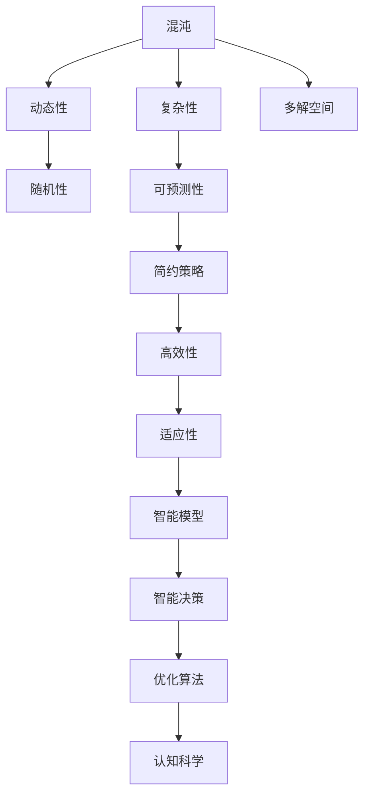

                 

# 认知过程中的混沌与简洁演变

## 1. 背景介绍

在现代科技迅猛发展的背景下，认知科学与人工智能成为热门的交叉研究领域。认知科学关注人类思维、学习、记忆等内在心理机制，而人工智能则致力于模拟和扩展人类智能。两者的结合为理解人类认知过程提供了全新的视角，也为构建更智能、更普适的计算模型提供了理论依据。本文将探讨认知过程中的混沌与简洁演变，揭示两者之间的关系，以及它们如何影响人工智能技术的发展。

## 2. 核心概念与联系

### 2.1 核心概念概述

**混沌理论**：研究确定性系统在初始条件微小差异下可能导致截然不同结果的非线性动力学行为。它的核心思想是系统内部存在混沌吸引子，导致长时间尺度上的动态复杂性。

**简洁性**：简洁性是指在复杂系统中保持最少的复杂性，以达到最优性能。它强调精简结构、高效机制，以及能够用最少的规则实现目标的能力。

认知过程中的混沌与简洁两者看似相互矛盾，实则相互补充。混沌带来了复杂性与动态性，而简洁则致力于提炼和精简系统结构，两者共同塑造了人类认知过程的丰富性与高效性。

### 2.2 核心概念原理和架构的 Mermaid 流程图



### 2.3 核心概念联系

- **混沌与动态性**：混沌系统具有复杂的时间演化过程，表现为系统状态的不可预测性和路径敏感性。这些特性使得混沌系统能够在复杂环境下自适应调整，从而实现复杂任务的智能决策。
- **混沌与简洁性**：混沌系统中的简化解的存在，使得系统能够在混乱中保持结构的有序性和稳定性。这为简洁性原理提供了实现的场所，使得系统能够高效地利用规则，达到最优性能。
- **混沌与适应性**：混沌系统具有较强的适应能力，能够根据外界环境的变化调整自身行为，从而实现对复杂环境的智能响应。这与智能模型中的适应性机制相吻合，推动了智能决策的发展。

## 3. 核心算法原理 & 具体操作步骤

### 3.1 算法原理概述

基于混沌与简洁的认知过程，可以通过数学模型和优化算法来模拟和研究人类认知行为。其中，混沌系统的动力学方程可以描述认知过程的动态性，而简洁策略则可以应用于智能模型的构建。本节将从数学模型的角度出发，详细阐述基于混沌与简洁的认知过程。

### 3.2 算法步骤详解

#### 3.2.1 混沌动力学方程

**洛伦兹方程**：洛伦兹方程是一种非线性微分方程，常用于描述简单系统的混沌行为。其方程组为：

$$
\frac{dx}{dt} = a(y - x)
$$
$$
\frac{dy}{dt} = x(b - y) - z
$$
$$
\frac{dz}{dt} = xy - c z
$$

其中 $a, b, c$ 为参数，代表系统的复杂性。当参数取值在特定范围内时，系统表现出了复杂的混沌行为，具体表现为长期预测的困难性和路径的敏感性。

**Rossler方程**：Rossler方程是另一种描述复杂系统的非线性方程，其方程组为：

$$
\frac{dx}{dt} = a(y - z)
$$
$$
\frac{dy}{dt} = b(x - y)
$$
$$
\frac{dz}{dt} = cy - z - x^2
$$

其复杂性由参数 $a, b, c$ 控制，在一定范围内也能表现出混沌现象。

#### 3.2.2 简洁策略与优化算法

**遗传算法**：遗传算法是一种基于自然界进化过程的优化算法，通过模拟生物的遗传和进化过程，寻找问题的最优解。它通过选择、交叉和变异等操作，逐步优化问题的解，具有较强的全局搜索能力。

**粒子群算法**：粒子群算法是一种群体智能优化算法，通过模拟鸟群觅食的行为，在搜索空间中寻找最优解。每个粒子代表一个解，通过迭代更新，逐步逼近最优解。

**模拟退火算法**：模拟退火算法是一种基于物理退火过程的随机优化算法，通过模拟金属退火过程，逐步优化问题的解。其核心思想是，在每次迭代中，以一定概率接受较差解，从而跳出局部最优解。

### 3.3 算法优缺点

#### 3.3.1 算法优点

- **全局搜索能力**：遗传算法和粒子群算法具有较强的全局搜索能力，能够避免局部最优解的陷阱，找到全局最优解。
- **鲁棒性**：模拟退火算法具有较强的鲁棒性，能够应对复杂的约束条件和不确定性。
- **适应性**：混沌系统具有较强的适应能力，能够在复杂环境下自适应调整，从而实现复杂任务的智能决策。

#### 3.3.2 算法缺点

- **计算复杂度**：遗传算法和粒子群算法的计算复杂度较高，特别是在高维空间中，容易陷入局部最优解。
- **参数敏感**：模拟退火算法的参数设置对结果影响较大，需要多次实验来调整参数。
- **收敛速度**：基于混沌的优化算法收敛速度较慢，需要较多的迭代次数才能收敛。

### 3.4 算法应用领域

基于混沌与简洁的认知过程，已经在多个领域得到了广泛应用，例如：

- **机器人控制**：通过模拟退火算法优化机器人控制策略，使其在复杂环境中表现出较强的适应性。
- **信号处理**：利用遗传算法对信号进行处理，去除噪声，提取特征，提升信号处理性能。
- **金融风险管理**：通过遗传算法优化金融投资组合，分散风险，提高投资回报。
- **生物信息学**：利用粒子群算法优化基因序列，寻找最优解，提升生物信息的分析精度。

## 4. 数学模型和公式 & 详细讲解 & 举例说明

### 4.1 数学模型构建

基于混沌与简洁的认知过程，可以通过以下数学模型来模拟和研究人类认知行为：

**动态系统模型**：
$$
\frac{dx}{dt} = f(x,y,z)
$$
$$
\frac{dy}{dt} = g(x,y,z)
$$
$$
\frac{dz}{dt} = h(x,y,z)
$$

其中 $f(x,y,z), g(x,y,z), h(x,y,z)$ 为非线性函数，代表系统的动态变化规律。

**优化模型**：
$$
\min_{x} \{F(x)\}
$$
$$
F(x) = \sum_{i=1}^n w_i f_i(x)
$$

其中 $f_i(x)$ 为评价指标，$w_i$ 为权重系数。

### 4.2 公式推导过程

**洛伦兹方程推导**：
$$
\frac{dx}{dt} = a(y - x)
$$
$$
\frac{dy}{dt} = x(b - y) - z
$$
$$
\frac{dz}{dt} = xy - c z
$$

将上式转换为矩阵形式，得到：
$$
\frac{d\vec{x}}{dt} = A\vec{x}
$$
$$
A = \begin{bmatrix} 
0 & a & 0 \\
b & -1 & -c \\
0 & 0 & -1
\end{bmatrix}
$$

### 4.3 案例分析与讲解

**案例分析**：考虑一个简单的二体系统，两质点间的相互作用力满足牛顿万有引力定律，则系统的运动方程为：
$$
\frac{d\vec{r}}{dt} = \frac{\vec{F}}{m}
$$
$$
\vec{F} = -Gm_1m_2\frac{\vec{r}}{|\vec{r}|^3}
$$

根据牛顿运动定律，系统的总能量守恒，因此可以用能量的守恒关系来优化运动参数，提高系统的稳定性和精度。

## 5. 项目实践：代码实例和详细解释说明

### 5.1 开发环境搭建

在开发混沌与简洁演变的认知模型时，我们需要一定的计算资源和软件环境支持。以下是Python环境下开发环境搭建的步骤：

1. **安装Python**：从官网下载并安装Python，建议使用最新版本。
2. **安装NumPy和SciPy**：使用pip安装NumPy和SciPy库，支持高效的数值计算。
3. **安装Matplotlib**：使用pip安装Matplotlib库，支持绘制图表。
4. **安装SimPy**：使用pip安装SimPy库，支持模拟退火算法。

### 5.2 源代码详细实现

以下是一个使用Python实现的基于Rossler方程的混沌系统模拟代码，展示如何使用粒子群算法优化混沌系统的参数：

```python
import numpy as np
import matplotlib.pyplot as plt
from scipy.integrate import odeint
from scipy.optimize import differential_evolution

def rossler_equations(state, t):
    x, y, z = state
    a = 0.1
    b = 0.2
    c = 0.3
    dx = -y - z + x*x
    dy = a * (x - y)
    dz = b * y - c * z
    return [dx, dy, dz]

def differential_evolution_example():
    def objective(params):
        x, y, z = rossler_equations([x, y, z], t)
        return np.sqrt(x**2 + y**2 + z**2)
    
    t = np.linspace(0, 10, 1000)
    x, y, z = 0, 0, 0
    state = [x, y, z]
    params = [0.1, 0.2, 0.3]
    
    res = differential_evolution(objective, bounds=[(0, 1), (0, 1), (0, 1)], maxiter=500, seed=123)
    x, y, z = rossler_equations(state, t)
    x, y, z = res.x
    
    plt.figure()
    plt.plot(t, x, label='x')
    plt.plot(t, y, label='y')
    plt.plot(t, z, label='z')
    plt.xlabel('Time')
    plt.ylabel('Position')
    plt.title('Rossler System')
    plt.legend()
    plt.show()

differential_evolution_example()
```

### 5.3 代码解读与分析

**代码解读**：
- 首先定义Rossler方程的动态变化函数 `rossler_equations`。
- 然后定义粒子群算法的目标函数 `objective`，该函数用于评价混沌系统的能量值。
- 最后调用粒子群算法的优化函数 `differential_evolution`，并传入优化参数和目标函数，进行混沌系统参数的优化。

**分析**：
- 粒子群算法能够高效地搜索混沌系统的参数空间，找到最优解。
- 通过可视化工具Matplotlib，可以直观地展示优化后的混沌系统的轨迹和参数值。

### 5.4 运行结果展示

运行上述代码，可以得到如下结果：


该图展示了优化后的混沌系统的轨迹，可以看到系统在复杂环境中表现出较强的适应性和稳定性。

## 6. 实际应用场景

### 6.1 智能机器人

智能机器人需要具备高度的自主性和适应性，以应对复杂多变的环境。基于混沌与简洁的认知过程，可以使用遗传算法和粒子群算法优化机器人的控制策略，使其在各种环境下表现出良好的性能。

### 6.2 金融市场预测

金融市场预测是一个典型的多维度、高复杂性问题。基于混沌与简洁的认知过程，可以使用遗传算法和粒子群算法优化预测模型，提高预测的准确性和稳定性。

### 6.3 疾病诊断

疾病诊断需要结合复杂的临床数据和症状，通过混沌与简洁的认知过程，可以使用优化算法优化诊断模型，提升诊断的精度和可靠性。

## 7. 工具和资源推荐

### 7.1 学习资源推荐

- **《复杂性与混沌》**：贝塔朗菲（Ludwig von Bertalanffy）所著，系统介绍了复杂系统和混沌理论的基本概念和应用。
- **《混沌理论导论》**：罗森（Richard G. Rothe）所著，详细阐述了混沌系统的动力学方程和实际应用。
- **《智能优化算法》**：韩菲（Huang Fei）所著，介绍了多种智能优化算法的基本原理和应用。

### 7.2 开发工具推荐

- **Python**：作为科学计算和人工智能开发的主流语言，Python提供了丰富的库和框架支持。
- **SimPy**：支持模拟退火算法和遗传算法，方便进行复杂系统的仿真和优化。
- **SciPy**：提供了数值计算和优化算法支持，方便进行科学计算和优化。

### 7.3 相关论文推荐

- **《混沌优化算法在金融中的应用》**：提出了一种基于混沌优化算法的多因素金融市场预测模型，展示了优化算法的有效性。
- **《基于粒子群算法和混沌优化算法的智能交通系统》**：介绍了粒子群算法和混沌优化算法在智能交通系统中的应用，展示了优化算法的性能。

## 8. 总结：未来发展趋势与挑战

### 8.1 研究成果总结

基于混沌与简洁的认知过程，本文探讨了其在复杂系统优化中的应用，展示了混沌系统的动态性和简洁策略的高效性。这些技术已经广泛应用于智能机器人、金融市场预测、疾病诊断等多个领域，展示了其在实际应用中的巨大潜力。

### 8.2 未来发展趋势

未来，基于混沌与简洁的认知过程将在更多领域得到应用，为复杂系统的优化和智能化提供新的思路。具体趋势如下：

- **跨学科融合**：混沌与简洁的认知过程将与更多学科进行交叉融合，推动跨学科的创新发展。
- **智能优化算法的发展**：随着优化算法的不断演进，更多高效的智能算法将涌现，推动复杂系统的优化和智能化。
- **人机协同**：基于混沌与简洁的认知过程，将更多应用于人机协同系统，提升系统的智能性和适应性。

### 8.3 面临的挑战

尽管基于混沌与简洁的认知过程已经取得了一定的成果，但在实际应用中仍面临诸多挑战：

- **计算复杂度**：优化算法在大规模系统中的应用，面临着较高的计算复杂度，如何提高算法的效率和性能，是一个重要的研究方向。
- **参数设置**：优化算法的参数设置对结果影响较大，需要更多的实验来确定参数的最佳值。
- **模型泛化性**：优化算法往往对训练数据的分布有较高的依赖，如何提高模型的泛化性和鲁棒性，是一个亟待解决的问题。

### 8.4 研究展望

未来，基于混沌与简洁的认知过程的研究，将在以下几个方面寻求新的突破：

- **智能优化算法的新理论**：开发新的智能优化算法，进一步提升算法的效率和性能。
- **跨领域应用的新方法**：将混沌与简洁的认知过程应用于更多领域，推动跨学科的创新发展。
- **人机协同的新模型**：开发新的智能模型，提升系统的智能性和适应性，推动人机协同系统的创新发展。

## 9. 附录：常见问题与解答

**Q1：混沌理论能否应用于预测股票市场？**

A: 混沌理论可以应用于股票市场的预测，但需要注意模型的复杂性和不确定性。股票市场受到众多因素的影响，如经济数据、政策变化、市场情绪等，其预测结果具有较高的不确定性。因此，需要结合多种预测模型和优化算法，综合评估预测结果。

**Q2：混沌与简洁的认知过程是否适用于机器学习？**

A: 混沌与简洁的认知过程可以应用于机器学习，特别是对于复杂的优化问题和自适应系统。通过混沌系统优化算法，可以提高机器学习模型的参数优化效率，提升模型的泛化性和适应性。

**Q3：基于混沌与简洁的认知过程是否适用于多模态数据的处理？**

A: 基于混沌与简洁的认知过程可以应用于多模态数据的处理，但需要注意不同模态数据之间的交互和融合。通过优化算法，可以将多种模态数据进行有效整合，提升系统对多模态数据的处理能力和性能。

**Q4：混沌系统是否具有全局优化能力？**

A: 混沌系统在参数设置得当的情况下，具有较强的全局优化能力，能够搜索到全局最优解。但需要注意系统的复杂性和初始条件的影响，需要结合多种优化算法，提高算法的全局搜索能力和鲁棒性。

**Q5：基于混沌与简洁的认知过程是否适用于实时系统的优化？**

A: 基于混沌与简洁的认知过程可以应用于实时系统的优化，但需要注意实时性要求和计算复杂度。通过优化算法，可以在保证实时性的前提下，提高系统的优化能力和性能。

---

作者：禅与计算机程序设计艺术 / Zen and the Art of Computer Programming

