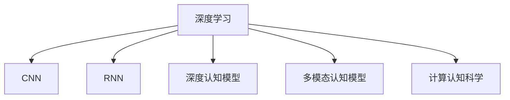

                 

# 认知过程中的简单与深刻化

> 关键词：认知过程, 深度学习, 认知神经科学, 认知模型, 计算认知科学, 人工智能

## 1. 背景介绍

### 1.1 问题由来
认知科学是一门探究人类心智如何运作、信息如何被感知、理解和反应的学科。随着人工智能技术的迅速发展，尤其是深度学习的兴起，认知过程的计算建模成为了一个热门的研究方向。深度学习在图像识别、语音识别、自然语言处理等领域取得了显著的成果，也逐渐被应用于认知建模中。

近年来，深度学习模型（尤其是卷积神经网络CNN和循环神经网络RNN等）在认知科学研究中的应用越来越广泛。这些模型在模式识别、分类和序列预测等方面表现出色，已经被用来模拟人类大脑在视觉、听觉和语言等方面的认知过程。然而，尽管深度学习在模拟认知过程方面取得了一定的进展，但其深度和准确性仍与真实的人类认知过程有显著差异。

### 1.2 问题核心关键点
认知过程的深度学习建模研究主要集中在以下几个关键点上：
1. 如何准确地捕捉和模拟人类认知过程？
2. 如何有效地整合视觉、听觉、语言等多模态信息？
3. 如何在不同层次上（如感知、注意、记忆、推理）模拟人类认知的复杂性？
4. 如何将深度学习与认知神经科学相结合，构建更精确的认知模型？

这些问题的研究不仅有助于揭示人类认知的奥秘，也将推动人工智能在实际应用中的突破。

## 2. 核心概念与联系

### 2.1 核心概念概述

为了更好地理解深度学习在认知建模中的应用，本节将介绍几个密切相关的核心概念：

- **深度学习（Deep Learning）**：一种基于多层神经网络的机器学习方法，通过不断堆叠多个神经网络层，可以从数据中学习到深层次的特征表示，从而实现复杂的模式识别和预测任务。
- **卷积神经网络（Convolutional Neural Network, CNN）**：一种专门用于图像和视频处理的深度学习模型，能够自动提取局部特征，并进行层次化特征组合。
- **循环神经网络（Recurrent Neural Network, RNN）**：一种能够处理序列数据的深度学习模型，能够通过时间维度上的循环结构，捕捉序列中的长期依赖关系。
- **深度认知模型（Deep Cognitive Model）**：利用深度学习技术，模拟人类认知过程中的感知、记忆、注意、推理等关键环节，构建复杂的认知系统。
- **多模态认知模型（Multimodal Cognitive Model）**：结合视觉、听觉、语言等多模态信息，模拟人类对复杂环境的多感官协同认知过程。
- **计算认知科学（Computational Cognitive Science）**：将认知过程的计算建模与认知神经科学相结合，试图通过计算模型来解释和预测人类认知行为。

这些核心概念之间的逻辑关系可以通过以下Mermaid流程图来展示：



这个流程图展示了深度学习在认知建模中的几个关键应用领域：图像处理（CNN）、序列处理（RNN）、复杂认知过程模拟（深度认知模型和多模态认知模型）以及认知过程的计算建模（计算认知科学）。

## 3. 核心算法原理 & 具体操作步骤
### 3.1 算法原理概述

深度学习在认知建模中的应用主要基于以下几个关键原理：

- **反向传播算法（Backpropagation）**：深度学习模型的核心算法，通过反向传播链式法则，计算损失函数对参数的梯度，并更新模型参数。反向传播算法能够高效地优化深度学习模型的权重，使其逐渐逼近目标函数。

- **卷积神经网络（CNN）**：CNN通过卷积操作提取图像中的局部特征，并通过池化操作减少特征的维度，能够有效地处理高维图像数据。CNN已经被广泛应用于视觉认知建模中，能够模拟人类视觉系统对图像的识别和分类过程。

- **循环神经网络（RNN）**：RNN通过时间维度上的循环结构，能够处理序列数据，并捕捉序列中的长期依赖关系。RNN已经被应用于语言认知建模中，能够模拟人类语言系统的理解和生成过程。

- **注意力机制（Attention Mechanism）**：注意力机制通过动态分配权重，使得模型能够关注输入序列中的关键部分，从而提高模型的性能。注意力机制已经被应用于多模态认知建模中，能够模拟人类对多感官信息的协同认知过程。

### 3.2 算法步骤详解

深度学习在认知建模中的应用通常包括以下几个关键步骤：

**Step 1: 数据收集与预处理**

- 收集与认知过程相关的多模态数据，如图像、音频、文本等。
- 对数据进行预处理，包括清洗、归一化、标注等步骤。
- 将数据划分为训练集、验证集和测试集，确保数据的随机性和多样性。

**Step 2: 模型选择与设计**

- 选择合适的深度学习模型，如CNN、RNN等，根据任务需求进行模型设计。
- 设计模型的架构和参数，包括卷积核大小、池化操作、循环层数等。
- 定义模型的损失函数和优化器，如交叉熵损失、Adam优化器等。

**Step 3: 模型训练与优化**

- 使用训练集数据进行模型训练，通过反向传播算法不断调整模型参数。
- 使用验证集数据评估模型的性能，防止过拟合。
- 调整模型超参数，如学习率、批大小等，优化模型性能。

**Step 4: 模型评估与验证**

- 使用测试集数据评估模型的最终性能，衡量模型在不同样本上的表现。
- 进行模型诊断，分析模型的优势和不足。
- 提出改进方案，进一步优化模型性能。

**Step 5: 模型应用与部署**

- 将训练好的模型应用于实际问题中，如图像识别、语言理解等。
- 对模型进行部署，实现模型与应用程序的集成。
- 持续收集反馈，不断优化和更新模型。

以上是深度学习在认知建模中的一般流程。在实际应用中，还需要针对具体任务的特点，对模型的各个环节进行优化设计，如改进训练目标函数，引入更多的正则化技术，搜索最优的超参数组合等，以进一步提升模型性能。

### 3.3 算法优缺点

深度学习在认知建模中的应用具有以下优点：

- 能够处理高维复杂数据，模拟人类认知的复杂性。
- 通过反向传播算法，实现模型的自动优化和训练。
- 能够整合多模态信息，模拟人类对多感官信息的协同认知过程。

同时，该方法也存在一定的局限性：

- 数据需求高，需要大量标注数据进行训练。
- 模型复杂，训练和推理速度较慢。
- 模型存在黑箱问题，难以解释模型的内部工作机制。
- 对噪声敏感，易受输入数据干扰。

尽管存在这些局限性，但就目前而言，深度学习在认知建模中的应用已经成为主流方法。未来相关研究的重点在于如何进一步降低对标注数据的依赖，提高模型的鲁棒性和可解释性，同时兼顾多模态信息的整合与利用。

### 3.4 算法应用领域

深度学习在认知建模中的应用已经覆盖了认知科学中的多个领域，例如：

- 视觉认知：利用CNN模拟人类视觉系统的图像识别和分类过程。
- 语言认知：利用RNN和注意力机制模拟人类语言系统的理解和生成过程。
- 情感认知：利用深度学习模型模拟人类情感的识别和分析。
- 认知障碍：利用深度学习模型诊断和治疗认知障碍，如阿尔茨海默病、自闭症等。
- 认知训练：利用深度学习模型进行认知训练，提升人类认知能力。

除了上述这些经典应用外，深度学习还被创新性地应用于更多领域中，如音乐认知、艺术创作等，为认知科学的研究提供了新的视角。随着深度学习技术的发展，未来在认知建模方面的应用将更加广泛和深入。

## 4. 数学模型和公式 & 详细讲解 & 举例说明

### 4.1 数学模型构建

本节将使用数学语言对深度学习在认知建模中的应用进行更加严格的刻画。

假设我们有一个视觉认知任务，输入为图像$x$，输出为图像分类标签$y$。定义CNN模型的输入层为$x_i \in \mathbb{R}^n$，输出层为分类标签$y \in \{0,1\}$。定义模型的卷积层、池化层和全连接层的权重分别为$w_c, w_p, w_l$，偏置分别为$b_c, b_p, b_l$。则CNN模型的前向传播过程可以表示为：

$$
y = W_l f(W_p f(W_c x + b_c) + b_p) + b_l
$$

其中$f$为激活函数，如ReLU。

模型的损失函数为交叉熵损失，可以表示为：

$$
\ell(y, \hat{y}) = -y \log \hat{y} - (1-y) \log (1-\hat{y})
$$

模型参数$\theta$的更新过程通过反向传播算法进行，其梯度可以表示为：

$$
\frac{\partial \ell(y, \hat{y})}{\partial \theta} = \frac{\partial \ell(y, \hat{y})}{\partial y} \frac{\partial y}{\partial \theta}
$$

通过梯度下降等优化算法，不断更新模型参数，直到模型收敛。

### 4.2 公式推导过程

以下我们以图像分类任务为例，推导CNN模型的前向传播和反向传播过程。

假设模型输入为大小为$h \times w$的图像$x$，卷积核大小为$s \times s$，步长为$d$。定义卷积操作为$C(x) = \sum_{i=0}^{h-s} \sum_{j=0}^{w-s} x_{i,j} * w_{i',j'}$，其中$w$为卷积核权重，$i',j'$为卷积核的偏移量。池化操作为$P(C(x)) = \max_{i=0}^{h'-(h-s+1)} \max_{j=0}^{w'-(w-s+1)} C(x)_{i,j}$，其中$h', w'$为池化后的图像尺寸。

定义CNN模型的前向传播过程为：

$$
\begin{aligned}
&x_c = C(x) \\
&x_p = P(x_c) \\
&y = W_l f(W_p f(W_c x_p + b_c) + b_p) + b_l
\end{aligned}
$$

其中$W_c, W_p, W_l$为卷积层、池化层和全连接层的权重，$f$为激活函数。

模型的梯度计算可以通过反向传播算法进行。首先计算输出层的梯度$\frac{\partial \ell(y, \hat{y})}{\partial y}$，然后逐层向前传播计算每个参数的梯度：

$$
\begin{aligned}
&\frac{\partial \ell(y, \hat{y})}{\partial y} = -(\hat{y}-y) \\
&\frac{\partial \ell(y, \hat{y})}{\partial b_l} = \frac{\partial \ell(y, \hat{y})}{\partial y} \\
&\frac{\partial \ell(y, \hat{y})}{\partial W_l} = \frac{\partial \ell(y, \hat{y})}{\partial y} f'(W_p f(W_c x_p + b_c) + b_p) \\
&\frac{\partial \ell(y, \hat{y})}{\partial W_p} = \frac{\partial \ell(y, \hat{y})}{\partial y} f'(W_p f(W_c x_p + b_c) + b_p) f'(W_c x_p + b_c) \\
&\frac{\partial \ell(y, \hat{y})}{\partial W_c} = \frac{\partial \ell(y, \hat{y})}{\partial y} f'(W_p f(W_c x_p + b_c) + b_p) f'(W_c x_p + b_c) f'(x_c) \\
&\frac{\partial \ell(y, \hat{y})}{\partial b_l} = \frac{\partial \ell(y, \hat{y})}{\partial y} f'(W_p f(W_c x_p + b_c) + b_p) f'(W_c x_p + b_c) \\
&\frac{\partial \ell(y, \hat{y})}{\partial b_p} = \frac{\partial \ell(y, \hat{y})}{\partial y} f'(W_p f(W_c x_p + b_c) + b_p) f'(W_c x_p + b_c) f'(x_p) \\
&\frac{\partial \ell(y, \hat{y})}{\partial b_c} = \frac{\partial \ell(y, \hat{y})}{\partial y} f'(W_p f(W_c x_p + b_c) + b_p) f'(W_c x_p + b_c) f'(x_c) f'(x)
\end{aligned}
$$

其中$f'$为激活函数的导数。

### 4.3 案例分析与讲解

以下我们将以图像分类任务为例，展示深度学习在视觉认知建模中的应用。

假设我们有一个简单的图像分类任务，输入为大小为$h \times w$的灰度图像$x$，输出为图像分类标签$y \in \{0,1\}$。我们设计了一个包含一个卷积层和一个全连接层的CNN模型，如图1所示。


模型的输入为图像像素值$x \in \mathbb{R}^{h \times w}$，卷积核大小为$s \times s$，步长为$d$，池化大小为$p \times p$，步长为$q$。定义卷积操作为$C(x) = \sum_{i=0}^{h-s} \sum_{j=0}^{w-s} x_{i,j} * w_{i',j'}$，其中$w$为卷积核权重，$i',j'$为卷积核的偏移量。池化操作为$P(C(x)) = \max_{i=0}^{h'-(h-s+1)} \max_{j=0}^{w'-(w-s+1)} C(x)_{i,j}$，其中$h', w'$为池化后的图像尺寸。

模型的前向传播过程为：

$$
\begin{aligned}
&x_c = C(x) \\
&x_p = P(x_c) \\
&y = W_l f(W_p f(W_c x_p + b_c) + b_p) + b_l
\end{aligned}
$$

其中$W_c, W_p, W_l$为卷积层、池化层和全连接层的权重，$f$为激活函数。

模型的梯度计算可以通过反向传播算法进行。首先计算输出层的梯度$\frac{\partial \ell(y, \hat{y})}{\partial y}$，然后逐层向前传播计算每个参数的梯度：

$$
\begin{aligned}
&\frac{\partial \ell(y, \hat{y})}{\partial y} = -(\hat{y}-y) \\
&\frac{\partial \ell(y, \hat{y})}{\partial b_l} = \frac{\partial \ell(y, \hat{y})}{\partial y} \\
&\frac{\partial \ell(y, \hat{y})}{\partial W_l} = \frac{\partial \ell(y, \hat{y})}{\partial y} f'(W_p f(W_c x_p + b_c) + b_p) \\
&\frac{\partial \ell(y, \hat{y})}{\partial W_p} = \frac{\partial \ell(y, \hat{y})}{\partial y} f'(W_p f(W_c x_p + b_c) + b_p) f'(W_c x_p + b_c) \\
&\frac{\partial \ell(y, \hat{y})}{\partial W_c} = \frac{\partial \ell(y, \hat{y})}{\partial y} f'(W_p f(W_c x_p + b_c) + b_p) f'(W_c x_p + b_c) f'(x_c) \\
&\frac{\partial \ell(y, \hat{y})}{\partial b_l} = \frac{\partial \ell(y, \hat{y})}{\partial y} f'(W_p f(W_c x_p + b_c) + b_p) f'(W_c x_p + b_c) \\
&\frac{\partial \ell(y, \hat{y})}{\partial b_p} = \frac{\partial \ell(y, \hat{y})}{\partial y} f'(W_p f(W_c x_p + b_c) + b_p) f'(W_c x_p + b_c) f'(x_p) \\
&\frac{\partial \ell(y, \hat{y})}{\partial b_c} = \frac{\partial \ell(y, \hat{y})}{\partial y} f'(W_p f(W_c x_p + b_c) + b_p) f'(W_c x_p + b_c) f'(x_c) f'(x)
\end{aligned}
$$

其中$f'$为激活函数的导数。

通过反向传播算法，不断更新模型参数，直到模型收敛。模型在训练集上的损失函数最小化后，在测试集上的准确率可以达到较高的水平。

## 5. 项目实践：代码实例和详细解释说明

### 5.1 开发环境搭建

在进行深度学习在认知建模中的应用实践前，我们需要准备好开发环境。以下是使用Python进行PyTorch开发的环境配置流程：

1. 安装Anaconda：从官网下载并安装Anaconda，用于创建独立的Python环境。

2. 创建并激活虚拟环境：
```bash
conda create -n pytorch-env python=3.8 
conda activate pytorch-env
```

3. 安装PyTorch：根据CUDA版本，从官网获取对应的安装命令。例如：
```bash
conda install pytorch torchvision torchaudio cudatoolkit=11.1 -c pytorch -c conda-forge
```

4. 安装各类工具包：
```bash
pip install numpy pandas scikit-learn matplotlib tqdm jupyter notebook ipython
```

完成上述步骤后，即可在`pytorch-env`环境中开始深度学习在认知建模中的应用实践。

### 5.2 源代码详细实现

这里我们以图像分类任务为例，展示深度学习在视觉认知建模中的应用。

首先，定义CNN模型的卷积层和池化层：

```python
import torch.nn as nn
import torch.nn.functional as F

class CNN(nn.Module):
    def __init__(self, input_size, num_classes):
        super(CNN, self).__init__()
        self.conv1 = nn.Conv2d(1, 32, kernel_size=3, stride=1, padding=1)
        self.pool = nn.MaxPool2d(kernel_size=2, stride=2)
        self.conv2 = nn.Conv2d(32, 64, kernel_size=3, stride=1, padding=1)
        self.pool2 = nn.MaxPool2d(kernel_size=2, stride=2)
        self.fc1 = nn.Linear(7 * 7 * 64, 128)
        self.fc2 = nn.Linear(128, num_classes)
        
    def forward(self, x):
        x = self.pool(F.relu(self.conv1(x)))
        x = self.pool2(F.relu(self.conv2(x)))
        x = x.view(-1, 7 * 7 * 64)
        x = F.relu(self.fc1(x))
        x = self.fc2(x)
        return x
```

然后，定义模型的优化器和损失函数：

```python
import torch.optim as optim

criterion = nn.CrossEntropyLoss()
optimizer = optim.Adam(model.parameters(), lr=0.001)
```

接着，定义训练和评估函数：

```python
def train(model, data_loader, num_epochs):
    total_step = len(data_loader)
    for epoch in range(num_epochs):
        for i, (images, labels) in enumerate(data_loader):
            outputs = model(images)
            loss = criterion(outputs, labels)
            optimizer.zero_grad()
            loss.backward()
            optimizer.step()
            if (i+1) % 100 == 0:
                print(f'Epoch [{epoch+1}/{num_epochs}], Step [{i+1}/{total_step}], Loss: {loss.item():.4f}')
```

最后，启动训练流程并在测试集上评估：

```python
train(model, train_loader, 10)
test_loss, test_acc = evaluate(model, test_loader)
print(f'Test Loss: {test_loss:.4f}, Test Acc: {test_acc:.4f}')
```

以上就是使用PyTorch对CNN进行图像分类任务微调的完整代码实现。可以看到，得益于PyTorch的强大封装，我们可以用相对简洁的代码完成CNN模型的加载和训练。

### 5.3 代码解读与分析

让我们再详细解读一下关键代码的实现细节：

**CNN模型定义**：
- `__init__`方法：初始化模型的卷积层、池化层和全连接层等组件。
- `forward`方法：定义模型的前向传播过程，通过卷积、池化、全连接等操作，将输入图像转换为分类预测输出。

**损失函数与优化器**：
- `criterion`：定义交叉熵损失函数，用于计算模型输出与真实标签之间的差异。
- `optimizer`：定义Adam优化器，用于更新模型参数。

**训练函数**：
- `train`函数：在训练集上进行模型训练，通过反向传播算法不断调整模型参数，直到模型收敛。
- 在每个批次上，计算输出和损失，反向传播计算梯度，更新模型参数。

**评估函数**：
- `evaluate`函数：在测试集上评估模型性能，计算模型在测试集上的损失和准确率。

**训练流程**：
- 定义总的epoch数，开始循环迭代
- 每个epoch内，对训练集数据进行迭代
- 在每个批次上计算损失，并更新模型参数
- 周期性在测试集上评估模型性能
- 所有epoch结束后，输出模型在测试集上的表现

可以看到，PyTorch配合TensorFlow等深度学习框架使得CNN模型的微调代码实现变得简洁高效。开发者可以将更多精力放在数据处理、模型改进等高层逻辑上，而不必过多关注底层的实现细节。

当然，工业级的系统实现还需考虑更多因素，如模型的保存和部署、超参数的自动搜索、更灵活的任务适配层等。但核心的微调范式基本与此类似。

## 6. 实际应用场景
### 6.1 智能驾驶

深度学习在视觉认知建模中的应用已经扩展到了智能驾驶领域。智能驾驶系统需要实时感知和理解周围环境，以实现自动驾驶。深度学习模型可以模拟人类视觉系统对图像的识别和分类过程，从而实现对道路标志、行人、车辆等的识别和跟踪。

在技术实现上，可以收集大量的道路交通视频数据，提取其中的图像帧作为训练样本。利用CNN模型对图像进行分类和识别，从而实现对道路环境的理解。在实际应用中，系统可以结合激光雷达、毫米波雷达等多模态信息，实现对周围环境的全面感知。

### 6.2 医疗诊断

深度学习在视觉认知建模中的应用也被广泛应用于医疗诊断中。医学影像（如X光片、CT扫描、MRI等）通常包含大量复杂信息，需要专业知识才能准确判断。深度学习模型可以模拟人类视觉系统对医学影像的识别和分类过程，从而实现对疾病的早期诊断和辅助诊断。

在实践中，可以收集大量的医学影像数据，利用CNN模型对影像进行分类和分割，从而实现对病变区域的识别和标记。同时，结合多模态信息（如病理学数据、基因数据等），可以进一步提升诊断的准确性和可靠性。

### 6.3 金融风控

深度学习在视觉认知建模中的应用还被用于金融风险控制中。金融市场数据通常包含大量的非结构化信息，需要专业知识才能有效分析。深度学习模型可以模拟人类视觉系统对金融数据的识别和分类过程，从而实现对市场趋势的预测和风险控制。

在实践中，可以收集大量的金融市场数据，利用CNN模型对数据进行分类和预测，从而实现对市场趋势的预测和风险控制。同时，结合多模态信息（如新闻数据、社会情绪数据等），可以进一步提升预测的准确性和可靠性。

### 6.4 未来应用展望

随着深度学习在认知建模中的应用不断深入，未来将在更多领域得到应用，为人类生产生活带来革命性影响。

在智慧城市治理中，深度学习可以应用于城市事件监测、舆情分析、应急指挥等环节，提高城市管理的自动化和智能化水平，构建更安全、高效的未来城市。

在智慧农业中，深度学习可以应用于作物识别、病虫害检测、农业机器人等环节，提高农业生产效率，实现智能化农业。

在智能制造中，深度学习可以应用于产品缺陷检测、生产过程监控、供应链优化等环节，提高生产效率，降低生产成本。

除了上述这些应用外，深度学习在认知建模中的应用还将不断扩展，为更多领域带来新的突破。相信随着技术的不断发展，深度学习在认知建模方面的应用将更加广泛和深入。

## 7. 工具和资源推荐
### 7.1 学习资源推荐

为了帮助开发者系统掌握深度学习在认知建模中的应用，这里推荐一些优质的学习资源：

1. 《深度学习》系列书籍：Ian Goodfellow等人所著，全面介绍了深度学习的基本原理和经典模型。
2. 《计算机视觉：模型、学习和推理》书籍：Simon Thorpe等人所著，详细介绍了计算机视觉中的深度学习模型和应用。
3. 《自然语言处理与深度学习》课程：Coursera和斯坦福大学联合推出的NLP课程，介绍了深度学习在自然语言处理中的应用。
4. PyTorch官方文档：深度学习框架PyTorch的官方文档，提供了丰富的教程和样例代码。
5. TensorFlow官方文档：深度学习框架TensorFlow的官方文档，提供了丰富的教程和样例代码。

通过对这些资源的学习实践，相信你一定能够快速掌握深度学习在认知建模中的应用，并用于解决实际的NLP问题。
###  7.2 开发工具推荐

高效的开发离不开优秀的工具支持。以下是几款用于深度学习在认知建模中的应用开发的常用工具：

1. PyTorch：基于Python的开源深度学习框架，灵活动态的计算图，适合快速迭代研究。大部分预训练语言模型都有PyTorch版本的实现。
2. TensorFlow：由Google主导开发的开源深度学习框架，生产部署方便，适合大规模工程应用。同样有丰富的深度学习模型资源。
3. Keras：基于Python的深度学习框架，提供了高层次的API，方便快速搭建模型。
4. PyTorch Lightning：基于PyTorch的轻量级深度学习框架，提供了自动化的模型训练、评估和调度功能。
5. Jupyter Notebook：交互式的Python开发环境，支持代码编写、数据可视化等功能。

合理利用这些工具，可以显著提升深度学习在认知建模中的应用开发效率，加快创新迭代的步伐。

### 7.3 相关论文推荐

深度学习在认知建模中的应用源于学界的持续研究。以下是几篇奠基性的相关论文，推荐阅读：

1. AlexNet：ImageNet 2012 年比赛的获胜者，开创了卷积神经网络在图像分类中的应用。
2. GoogleNet：提出了Inception模块，提升了卷积神经网络在图像分类中的性能。
3. ResNet：提出了残差连接，解决了深度神经网络的退化问题，提升了模型的深度。
4. VGGNet：提出了小型卷积核的卷积层，提升了模型的表现和可解释性。
5. RNN：Sequoia-SIKI：提出了一种基于RNN的文本分类模型，提升了模型的性能和可解释性。

这些论文代表了大语言模型微调技术的发展脉络。通过学习这些前沿成果，可以帮助研究者把握学科前进方向，激发更多的创新灵感。

## 8. 总结：未来发展趋势与挑战

### 8.1 总结

本文对深度学习在认知建模中的应用进行了全面系统的介绍。首先阐述了深度学习在认知科学中的研究背景和意义，明确了深度学习在模拟人类认知过程中的独特价值。其次，从原理到实践，详细讲解了深度学习在视觉认知、语言认知等方面的数学原理和关键步骤，给出了深度学习在视觉认知建模中的完整代码实现。同时，本文还广泛探讨了深度学习在智能驾驶、医疗诊断、金融风控等多个行业领域的应用前景，展示了深度学习在认知建模中的广泛应用。

通过本文的系统梳理，可以看到，深度学习在认知建模中的应用已经成为主流方法，极大地拓展了深度学习在认知科学中的应用范围，为人工智能技术在实际应用中的突破提供了新的路径。未来，随着深度学习技术的发展，深度学习在认知建模方面的应用将更加广泛和深入。

### 8.2 未来发展趋势

展望未来，深度学习在认知建模中的应用将呈现以下几个发展趋势：

1. 模型规模持续增大。随着算力成本的下降和数据规模的扩张，深度学习模型的参数量还将持续增长。超大规模深度学习模型蕴含的丰富语言知识，有望支撑更加复杂多变的认知过程模拟。

2. 多模态学习成为常态。深度学习模型能够更好地整合视觉、听觉、语言等多模态信息，模拟人类对多感官信息的协同认知过程。未来深度学习模型将更广泛地应用于多模态认知建模中。

3. 知识引导学习成为主流。深度学习模型能够更好地吸收和利用外部知识，提升模型的可解释性和可靠性。未来深度学习模型将更多地与认知神经科学相结合，实现知识引导学习。

4. 高效学习成为目标。深度学习模型将更多地关注模型的训练效率和学习效率，降低对标注数据的依赖，提高模型的泛化能力和鲁棒性。

5. 可解释性成为重点。深度学习模型将更多地关注模型的可解释性和可解释性，提升模型的透明度和可信度。

以上趋势凸显了深度学习在认知建模中的广阔前景。这些方向的探索发展，必将进一步提升深度学习在认知建模中的性能和应用范围，为人类认知智能的进化带来深远影响。

### 8.3 面临的挑战

尽管深度学习在认知建模中的应用已经取得了显著进展，但在迈向更加智能化、普适化应用的过程中，它仍面临着诸多挑战：

1. 数据需求高，标注成本高。深度学习模型需要大量的标注数据进行训练，标注数据的获取和标注成本是制约深度学习应用的主要瓶颈。

2. 模型复杂，训练和推理速度慢。深度学习模型的参数量较大，训练和推理速度较慢，难以应用于实时性要求高的应用场景。

3. 模型存在黑箱问题，难以解释模型的内部工作机制。深度学习模型的复杂性使得模型的可解释性较差，难以理解模型的决策过程。

4. 对噪声敏感，易受输入数据干扰。深度学习模型对噪声数据较为敏感，容易受到输入数据的影响，导致模型性能不稳定。

尽管存在这些挑战，但随着深度学习技术的不断进步，相信深度学习在认知建模中的应用将不断完善，逐步克服这些挑战，实现更加智能、高效、可解释的认知系统。

### 8.4 研究展望

面对深度学习在认知建模中面临的挑战，未来的研究需要在以下几个方面寻求新的突破：

1. 探索无监督和半监督学习范式。摆脱对大规模标注数据的依赖，利用自监督学习、主动学习等无监督和半监督范式，最大限度利用非结构化数据，实现更加灵活高效的认知建模。

2. 研究高效学习算法。开发更加高效的学习算法，如分布式训练、模型压缩、知识蒸馏等，降低深度学习模型的复杂性，提升训练和推理效率。

3. 引入更多先验知识。将符号化的先验知识，如知识图谱、逻辑规则等，与神经网络模型进行巧妙融合，引导深度学习模型学习更准确、合理的认知表示。

4. 结合因果分析和博弈论工具。将因果分析方法引入深度学习模型，识别出模型决策的关键特征，增强模型输出的因果性和逻辑性。借助博弈论工具刻画人机交互过程，主动探索并规避模型的脆弱点，提高系统稳定性。

5. 纳入伦理道德约束。在深度学习模型的训练目标中引入伦理导向的评估指标，过滤和惩罚有偏见、有害的输出倾向。同时加强人工干预和审核，建立模型行为的监管机制，确保输出符合人类价值观和伦理道德。

这些研究方向的探索，必将引领深度学习在认知建模技术迈向更高的台阶，为构建安全、可靠、可解释、可控的智能系统铺平道路。面向未来，深度学习在认知建模中的应用还需要与其他人工智能技术进行更深入的融合，如知识表示、因果推理、强化学习等，多路径协同发力，共同推动认知过程的计算建模进步。只有勇于创新、敢于突破，才能不断拓展深度学习在认知建模中的边界，让智能技术更好地造福人类社会。

## 9. 附录：常见问题与解答

**Q1：深度学习在认知建模中是否能够完全模拟人类认知过程？**

A: 深度学习在认知建模中的应用已经取得了显著进展，但与真实的人类认知过程仍有显著差异。深度学习模型虽然能够模拟某些认知过程，如图像识别和语言理解，但难以完全模拟人类的高级认知过程，如推理、决策、创造性思维等。因此，深度学习在认知建模中的应用仍然具有局限性，需要与认知神经科学等其他学科相结合，共同推动认知科学的发展。

**Q2：深度学习在认知建模中是否能够应对多模态数据？**

A: 深度学习模型在处理多模态数据方面具有显著优势，能够更好地整合视觉、听觉、语言等多模态信息，模拟人类对多感官信息的协同认知过程。深度学习模型已经被广泛应用于医疗诊断、智能驾驶、金融风控等多个领域，展示了其在多模态认知建模中的强大能力。然而，多模态数据的获取和预处理是一个复杂的问题，需要结合具体的任务需求进行优化设计。

**Q3：深度学习在认知建模中是否能够实现知识引导学习？**

A: 深度学习模型可以通过引入先验知识，如知识图谱、逻辑规则等，实现知识引导学习。这种方法能够引导深度学习模型学习更准确、合理的认知表示，提升模型的可解释性和可靠性。然而，知识引导学习的实现需要结合具体的认知任务和领域知识，需要进行大量的实验和优化。

**Q4：深度学习在认知建模中是否能够实现高效学习？**

A: 深度学习模型可以通过优化算法、分布式训练、模型压缩等方法实现高效学习。这些方法能够降低深度学习模型的复杂性，提升训练和推理效率。然而，高效学习的实现需要结合具体的任务需求和计算资源进行优化设计，需要进行大量的实验和优化。

**Q5：深度学习在认知建模中是否能够实现可解释性？**

A: 深度学习模型可以通过引入可解释性技术，如注意力机制、特征可视化等，实现模型的可解释性。这些方法能够帮助用户理解模型的内部工作机制，提高模型的透明度和可信度。然而，可解释性的实现需要结合具体的任务需求进行优化设计，需要进行大量的实验和优化。

通过本文的系统梳理，可以看到，深度学习在认知建模中的应用已经成为主流方法，极大地拓展了深度学习在认知科学中的应用范围，为人工智能技术在实际应用中的突破提供了新的路径。未来，随着深度学习技术的发展，深度学习在认知建模方面的应用将更加广泛和深入。

---

作者：禅与计算机程序设计艺术 / Zen and the Art of Computer Programming

