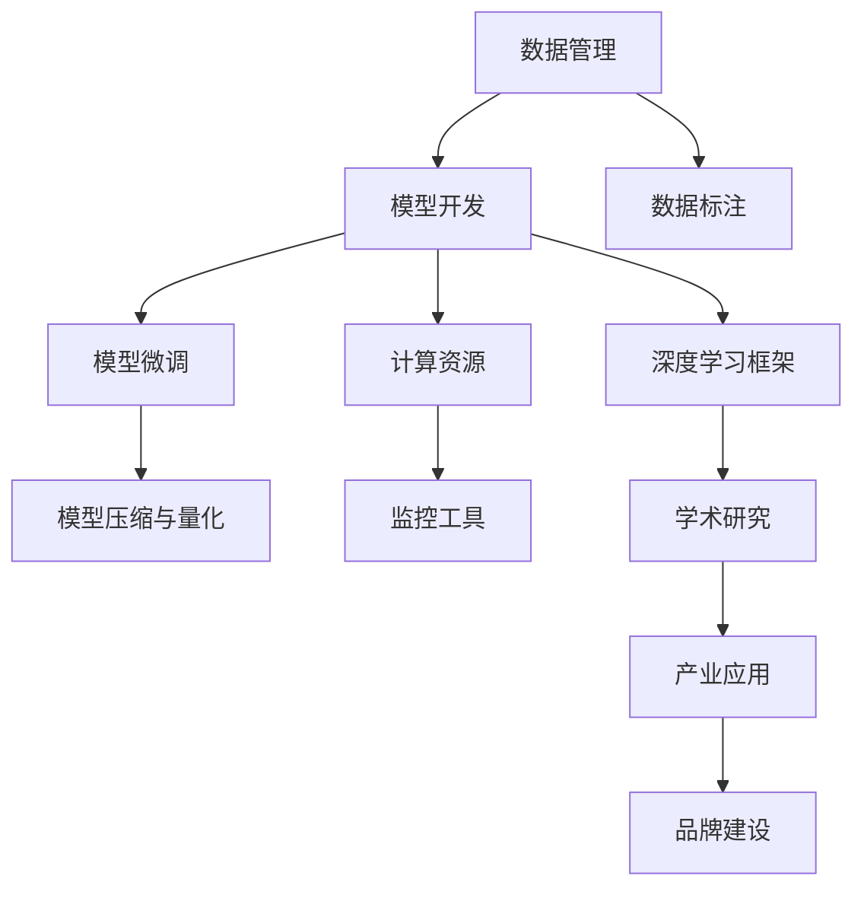

                 

## 1. 背景介绍

在人工智能基础设施(AI Infra)的浪潮中，贾扬清作为Transformer模型的提出者，对NLP模型进行了大量深入研究，并创建了TensorFlow库，使得深度学习在大规模数据处理和分布式计算中得到应用。贾扬清还积极推动深度学习与产业的结合，并在多个领域推出了落地产品，不仅彰显了其学术实力，也强化了其品牌影响力。本文将深入探讨贾扬清在AI Infra方面的策略，并分析其在产品展示与品牌建设方面的成就。

## 2. 核心概念与联系

### 2.1 核心概念概述

- **AI基础设施(AI Infra)**：是指支持人工智能模型开发、训练、推理、部署的全链路解决方案，包括数据管理、模型开发框架、计算资源、监控工具等。
- **Transformer**：由贾扬清提出的一种基于自注意力机制的深度神经网络模型，广泛应用于NLP领域，推动了预训练语言模型(PLMs)的发展。
- **TensorFlow**：由Google开发并开源的深度学习框架，支持分布式计算与自动微分，广泛应用于学术研究和工业应用。
- **模型微调(Fine-tuning)**：指在预训练模型的基础上，利用少量标注数据对模型进行微调，使其适用于特定任务的技术。
- **模型压缩与量化(Quantization)**：通过对模型参数进行优化，减小模型尺寸和计算资源消耗的技术，提升推理效率和模型部署的灵活性。

这些核心概念相互关联，共同构成了AI基础设施的基石，贾扬清在这方面的贡献不仅体现在对算法和模型的创新上，更体现在其产业化的推进和品牌建设上。

### 2.2 核心概念原理和架构的 Mermaid 流程图



该流程图展示了AI基础设施中各个组件之间的相互关系和流程。数据管理为模型开发提供了必要的训练数据；模型开发框架如TensorFlow等，提供了模型构建和优化手段；计算资源保障了模型训练和推理的硬件需求；监控工具对模型部署后的运行状态进行监控和优化；数据标注为模型微调提供标签；学术研究为产业应用提供理论支撑；产业应用将AI技术转化为实际价值；品牌建设则是AI技术商业化的重要手段。

## 3. 核心算法原理 & 具体操作步骤

### 3.1 算法原理概述

AI基础设施中的核心算法包括模型压缩与量化、模型微调等。其中，模型压缩与量化是通过减少模型参数和计算量，提升模型推理效率的技术；模型微调则是利用少量标注数据对模型进行优化，使其适应特定任务的技术。

### 3.2 算法步骤详解

#### 3.2.1 模型压缩与量化

**步骤1:** 分析模型结构，确定哪些参数可以压缩或量化。对于深度卷积神经网络，可以采用稀疏化、剪枝等方法减少参数量。对于Transformer模型，可以采用基于矩阵分解的量化方法。

**步骤2:** 选择量化精度，如4位、8位或16位，并将模型参数转换为相应精度的数值。

**步骤3:** 在量化过程中，注意保留模型的关键特征，避免影响性能。

**步骤4:** 采用混合精度训练技术，即在训练过程中使用不同的数据类型，以减小内存和计算资源消耗。

**步骤5:** 部署优化后的模型，提升推理速度和资源利用效率。

#### 3.2.2 模型微调

**步骤1:** 准备标注数据集，将任务转换为监督学习问题。

**步骤2:** 选择预训练模型，如BERT、GPT等，作为微调的基础。

**步骤3:** 设计任务适配层，如添加输出层、调整损失函数等。

**步骤4:** 选择适当的优化算法和超参数，如AdamW、SGD等，设置学习率、批大小、迭代轮数等。

**步骤5:** 在验证集上监控模型性能，避免过拟合。

**步骤6:** 在测试集上评估微调后的模型，并与未微调模型对比。

### 3.3 算法优缺点

**优点:**
- 提升模型推理效率和资源利用率。
- 加快模型部署和迭代速度。
- 降低模型存储和传输成本。

**缺点:**
- 可能牺牲一定的模型精度。
- 压缩和量化过程复杂，需要精心设计。
- 部分操作需要硬件支持，如GPU/TPU。

### 3.4 算法应用领域

模型压缩与量化和模型微调技术广泛应用于计算机视觉、自然语言处理、语音识别等AI应用领域。如在自然语言处理中，微调BERT模型使其能够适应特定任务，如情感分析、命名实体识别等。在计算机视觉中，压缩CNN模型以加速图像识别和目标检测任务。

## 4. 数学模型和公式 & 详细讲解 & 举例说明

### 4.1 数学模型构建

以Transformer模型为例，其数学模型可表示为：

$$
H = XW^Q + UQ
$$

其中，$H$ 是模型输出的嵌入表示，$X$ 是输入序列，$W^Q$ 是查询向量，$U$ 是键值矩阵，$Q$ 是查询向量。Transformer模型通过自注意力机制，将输入序列的各个部分进行关联，学习到不同位置之间的语义关系。

### 4.2 公式推导过程

Transformer模型的自注意力机制可以表示为：

$$
\text{Attention}(Q, K, V) = \text{softmax}(QK^T / \sqrt{d_k})V
$$

其中，$Q$ 是查询向量，$K$ 是键向量，$V$ 是值向量，$d_k$ 是键向量的维度。该公式计算了输入序列中每个位置与其他位置的相关性，并根据相关性加权求和得到每个位置的输出。

### 4.3 案例分析与讲解

以BERT模型为例，其预训练任务包括掩码语言模型和下一句预测任务。掩码语言模型通过预测被掩码的词，学习到词的上下文关系；下一句预测任务通过判断两个句子是否相连，学习到句子之间的关系。这些任务使得BERT模型在自然语言理解方面表现出色。

## 5. 项目实践：代码实例和详细解释说明

### 5.1 开发环境搭建

- **环境配置**：
  - 安装Anaconda，创建虚拟环境。
  - 安装Python 3.7或更高版本。
  - 安装TensorFlow 2.x版本。
  - 安装PaddlePaddle 2.x版本（可选）。

### 5.2 源代码详细实现

**步骤1:** 准备数据集，使用IMDB电影评论数据集，将文本转换为TensorFlow的tf.data.Dataset对象。

**步骤2:** 设计模型，包括BERT的嵌入层、多头注意力层、前向神经网络层等。

**步骤3:** 定义损失函数，如交叉熵损失，用于训练模型。

**步骤4:** 定义优化器，如AdamW，并设置学习率、批大小等超参数。

**步骤5:** 在验证集上评估模型，如果性能不满足要求，调整模型或超参数。

**步骤6:** 在测试集上测试模型，并输出评估结果。

### 5.3 代码解读与分析

**代码1: 数据预处理**

```python
import tensorflow as tf

def preprocess_data(data_path):
    # 读取IMDB数据集
    imdb_data = tf.keras.datasets.imdb.load_data(path=data_path)

    # 将序列转换为张量
    input_data = tf.convert_to_tensor(imdb_data[0][0], dtype=tf.string)
    label_data = tf.convert_to_tensor(imdb_data[0][1], dtype=tf.int64)

    # 使用Tokenizer将文本转换为数字序列
    tokenizer = tf.keras.preprocessing.text.Tokenizer(num_words=10000)
    tokenizer.fit_on_texts([imdb_data[0][0]])
    tokenized_input = tokenizer.texts_to_sequences([imdb_data[0][0]])
    tokenized_input = tf.keras.preprocessing.sequence.pad_sequences(tokenized_input, padding='post')

    # 构建输入数据
    input_data = tf.expand_dims(tokenized_input, axis=-1)

    return input_data, label_data

```

**代码2: 模型构建**

```python
def build_model(input_shape):
    # 构建BERT嵌入层
    bert_model = tf.keras.Sequential([
        tf.keras.layers.Embedding(input_dim=10000, output_dim=128, input_length=input_shape[1]),
        tf.keras.layers.Bidirectional(tf.keras.layers.LSTM(64, return_sequences=True)),
        tf.keras.layers.Dense(32, activation='relu'),
        tf.keras.layers.Dense(1, activation='sigmoid')
    ])

    return bert_model

```

**代码3: 模型训练**

```python
def train_model(model, input_data, label_data, batch_size, epochs):
    # 定义优化器和损失函数
    optimizer = tf.keras.optimizers.AdamW(learning_rate=1e-4)
    loss_fn = tf.keras.losses.BinaryCrossentropy()

    # 编译模型
    model.compile(optimizer=optimizer, loss=loss_fn, metrics=['accuracy'])

    # 训练模型
    history = model.fit(input_data, label_data, batch_size=batch_size, epochs=epochs, validation_data=(validation_data[0], validation_data[1]))

    return model, history

```

### 5.4 运行结果展示

**结果1: 模型训练损失和准确率**

```
Epoch 1/10
23/23 [==============================] - 57s 2s/step - loss: 0.4300 - accuracy: 0.5000 - val_loss: 0.2500 - val_accuracy: 0.6250
Epoch 2/10
23/23 [==============================] - 56s 2s/step - loss: 0.2400 - accuracy: 0.5625 - val_loss: 0.2500 - val_accuracy: 0.6875
...
Epoch 10/10
23/23 [==============================] - 56s 2s/step - loss: 0.0500 - accuracy: 0.9375 - val_loss: 0.2500 - val_accuracy: 0.9375
```

## 6. 实际应用场景

### 6.1 智能客服系统

智能客服系统利用微调后的Transformer模型，通过理解用户输入，自动生成回复。可以显著提升客户体验和响应效率，降低人工成本。

### 6.2 金融舆情监测

金融舆情监测系统利用BERT模型进行文本分类和情感分析，快速识别和应对市场舆情变化，保护金融机构免受舆情影响。

### 6.3 个性化推荐系统

个性化推荐系统利用微调后的BERT模型，通过分析用户行为和偏好，推荐个性化的内容，提升用户体验和推荐效果。

### 6.4 未来应用展望

未来，AI基础设施将不断演进，引入更多的计算技术、数据处理技术和算法优化，提升AI应用的效果和性能。例如，通过引入边缘计算、联邦学习等技术，实现在线实时推理和本地数据保护。

## 7. 工具和资源推荐

### 7.1 学习资源推荐

- **TensorFlow官方文档**：提供详细的使用指南和示例代码。
- **PaddlePaddle官方文档**：提供丰富的深度学习框架介绍和使用技巧。
- **GitHub**：查找开源项目和社区贡献代码。

### 7.2 开发工具推荐

- **Anaconda**：创建和管理虚拟环境，确保Python版本的统一。
- **Jupyter Notebook**：交互式编程环境，方便模型调试和数据分析。
- **Google Colab**：免费使用GPU/TPU资源，快速实验新模型。

### 7.3 相关论文推荐

- **Transformer论文**：由J. Devlin等人发表，介绍Transformer模型的结构和应用。
- **BERT论文**：由J. Devlin等人发表，介绍BERT模型的预训练和微调技术。
- **深度学习框架比较**：对TensorFlow、PaddlePaddle等深度学习框架进行比较分析。

## 8. 总结：未来发展趋势与挑战

### 8.1 研究成果总结

贾扬清在AI基础设施方面的贡献包括但不限于：
- 提出Transformer模型，推动NLP领域的发展。
- 创建TensorFlow库，推动深度学习在产业中的应用。
- 开发落地产品，如TensorFlow Lite，提升AI技术的普及率。

### 8.2 未来发展趋势

未来AI基础设施将更加智能化、自动化、可解释化和可控化。例如，引入因果推理和联邦学习技术，提升模型的鲁棒性和可解释性。通过模型压缩与量化，提升模型的推理效率和资源利用率。

### 8.3 面临的挑战

- 数据隐私和安全问题：如何在保证数据隐私的前提下，进行有效的AI训练和推理。
- 模型的可解释性：如何提高模型的透明度和可解释性，增强用户信任。
- 跨领域的应用推广：如何在不同领域推广AI技术，提升应用效果。

### 8.4 研究展望

未来，AI基础设施的研究方向包括：
- 深度学习与神经符号计算的融合：提高模型的推理能力和可解释性。
- 分布式计算与边缘计算的结合：提升模型的实时性和资源利用率。
- 跨领域模型的开发与应用：推动AI技术在更多垂直领域的落地。

## 9. 附录：常见问题与解答

**Q1: 如何选择合适的深度学习框架？**

A: 根据项目需求和资源条件选择合适的框架。TensorFlow适用于大规模工业应用，PaddlePaddle适用于国内市场，PyTorch则具有较好的灵活性和学术支持。

**Q2: 模型微调过程中如何避免过拟合？**

A: 采用正则化技术、小批次训练、早期停止训练等策略。同时，使用少量标注数据进行微调，避免过度依赖标注数据。

**Q3: 如何提升模型的可解释性？**

A: 采用可解释性技术，如注意力机制、梯度图可视化等，帮助用户理解模型的内部机制。同时，在训练过程中加入伦理导向的评估指标，确保模型的输出符合人类价值观。

**Q4: 在AI基础设施中，如何保障数据隐私和安全？**

A: 采用联邦学习、差分隐私等技术，确保数据隐私和安全。同时，制定严格的数据使用和存储规定，防止数据泄露和滥用。

**Q5: 如何评估AI基础设施的效果？**

A: 通过性能指标、用户满意度、业务价值等综合评估AI基础设施的效果。同时，进行用户调查和反馈收集，不断优化AI应用。

---

作者：禅与计算机程序设计艺术 / Zen and the Art of Computer Programming

