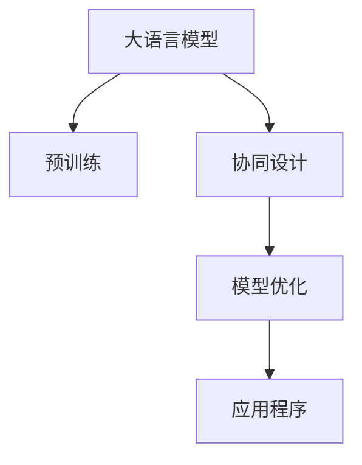

                 

# 设计和 LLM：创造协作

> 关键词：
1. 大语言模型 (Large Language Model, LLM)
2. 协同设计 (Collaborative Design)
3. 人类与AI协作 (Human-AI Collaboration)
4. 模型优化 (Model Optimization)
5. 应用程序 (Application)
6. 实例展示 (Example)
7. 领域知识 (Domain Knowledge)

## 1. 背景介绍

### 1.1 问题由来
近年来，随着深度学习技术的快速发展，尤其是预训练语言模型 (Pre-trained Language Models, PLMs) 的兴起，人工智能在自然语言处理 (Natural Language Processing, NLP) 领域取得了巨大突破。大型语言模型，如 GPT-3 和 BERT，凭借其庞大参数量与强大的语言理解能力，为各行各业带来了新的机遇与挑战。

然而，这些模型的设计目标往往偏重于语言理解与生成，而非任务导向的特定应用。这使得它们在特定领域的应用，如医学、金融、教育等，存在一定的局限性。因此，如何设计和优化这些大语言模型，以适应特定领域的复杂需求，成为当前 NLP 研究与实践的关键问题。

### 1.2 问题核心关键点
为了解决这一问题，大语言模型在设计时就需要考虑到不同领域知识的需求，并利用协同设计的方法，使其能够与领域专家的知识进行结合，从而实现更为精准和高效的应用。这不仅需要模型本身具备一定的领域相关性，还需要借助领域专家对模型的调试与优化，以确保其在特定领域的表现达到预期。

## 2. 核心概念与联系

### 2.1 核心概念概述

为更好地理解协同设计大语言模型的方法，本节将介绍几个密切相关的核心概念：

- 大语言模型 (LLM)：以自回归 (如 GPT) 或自编码 (如 BERT) 模型为代表的大规模预训练语言模型。通过在大规模无标签文本语料上进行预训练，学习通用的语言表示，具备强大的语言理解和生成能力。

- 协同设计 (Collaborative Design)：指领域专家与数据科学家、工程师等团队成员共同参与模型设计、开发与优化的过程，以确保模型在特定领域的表现。

- 人类与AI协作 (Human-AI Collaboration)：指在模型设计、开发与优化的各个环节中，充分发挥人类与AI的各自优势，实现互补与协同。

- 模型优化 (Model Optimization)：指通过参数调整、架构优化、数据增强等手段，提升模型在特定任务上的性能。

- 应用程序 (Application)：指大语言模型在特定领域的具体应用，如医疗问答系统、法律咨询机器人、智能客服等。

这些概念之间的逻辑关系可以通过以下 Mermaid 流程图来展示：



这个流程图展示了大语言模型的核心概念及其之间的关系：

1. 大语言模型通过预训练获得基础能力。
2. 协同设计确保模型在特定领域的表现。
3. 模型优化提升模型在特定任务上的性能。
4. 应用程序将模型应用于实际业务中。

这些概念共同构成了大语言模型的设计与优化框架，使其能够在特定领域中发挥更大的作用。

## 3. 核心算法原理 & 具体操作步骤
### 3.1 算法原理概述

协同设计大语言模型的关键在于如何设计模型架构，以及如何利用领域专家的知识进行模型优化。其核心思想是：通过协同设计，使模型具备领域相关性，并利用领域专家的知识对模型进行优化，使其在特定领域中表现出色。

形式化地，假设预训练模型为 $M_{\theta}$，其中 $\theta$ 为预训练得到的模型参数。给定下游任务 $T$ 的标注数据集 $D=\{(x_i, y_i)\}_{i=1}^N$，协同设计过程包括：

1. 选择合适的预训练语言模型 $M_{\theta}$ 作为初始化参数。
2. 领域专家对模型进行任务适配，如增加分类层、调整损失函数等。
3. 利用领域专家的知识，对模型进行调参、优化等操作。
4. 在标注数据集 $D$ 上进行有监督地训练，优化模型在特定任务 $T$ 上的性能。

### 3.2 算法步骤详解

协同设计大语言模型的过程主要包括以下几个关键步骤：

**Step 1: 准备预训练模型和数据集**
- 选择合适的预训练语言模型 $M_{\theta}$ 作为初始化参数，如 GPT、BERT 等。
- 准备下游任务 $T$ 的标注数据集 $D$，划分为训练集、验证集和测试集。一般要求标注数据与预训练数据的分布不要差异过大。

**Step 2: 任务适配层设计与调整**
- 根据任务类型，在预训练模型顶层设计合适的输出层和损失函数。
- 对于分类任务，通常在顶层添加线性分类器和交叉熵损失函数。
- 对于生成任务，通常使用语言模型的解码器输出概率分布，并以负对数似然为损失函数。

**Step 3: 协同设计过程**
- 领域专家参与模型优化，包括：
  - 调整模型架构，增加必要层数和神经元数。
  - 调整损失函数，确保模型对任务关键指标的关注。
  - 调整训练策略，如学习率、批次大小、优化算法等。
- 利用领域专家的知识，进行模型调参，确保模型在特定领域中的表现。

**Step 4: 有监督微调**
- 在标注数据集 $D$ 上进行有监督地训练，最小化损失函数。
- 周期性在验证集上评估模型性能，根据性能指标决定是否触发 Early Stopping。
- 重复上述步骤直到满足预设的迭代轮数或 Early Stopping 条件。

**Step 5: 测试和部署**
- 在测试集上评估微调后模型 $M_{\hat{\theta}}$ 的性能，对比微调前后的精度提升。
- 使用微调后的模型对新样本进行推理预测，集成到实际的应用系统中。
- 持续收集新的数据，定期重新微调模型，以适应数据分布的变化。

以上是协同设计大语言模型的通用流程。在实际应用中，还需要针对具体任务的特点，对协同设计过程的各个环节进行优化设计，如改进训练目标函数，引入更多的正则化技术，搜索最优的超参数组合等，以进一步提升模型性能。

### 3.3 算法优缺点

协同设计大语言模型的方法具有以下优点：
1. 针对性强。通过领域专家的参与，模型能够更好地适应特定领域的需求，提升性能。
2. 数据利用率高。领域专家能够提供领域知识，指导数据选择与预处理，提升数据质量。
3. 可解释性高。领域专家参与模型优化，便于理解和解释模型的决策过程。
4. 迭代优化快。领域专家的参与，能够快速识别和调整模型的问题，提高优化效率。

同时，该方法也存在一定的局限性：
1. 依赖专家经验。模型优化效果很大程度上依赖于领域专家的经验与知识水平。
2. 协同成本高。领域专家与数据科学家、工程师等团队成员的协同沟通与协作，需要耗费较多的时间和精力。
3. 领域知识传承。如何将领域专家的知识有效传授给数据科学家和工程师，是一个挑战。

尽管存在这些局限性，但就目前而言，协同设计大语言模型仍然是实现模型在特定领域高效应用的重要手段。未来相关研究的重点在于如何更好地整合领域专家与AI技术，提高协同设计效率，同时兼顾可解释性和伦理安全性等因素。

### 3.4 算法应用领域

协同设计大语言模型的方法已经在多个领域得到了应用，例如：

- 医疗领域：构建医疗问答系统、病历分析、药物研发等应用。领域专家参与模型设计，结合医疗知识进行优化。
- 法律领域：开发法律咨询机器人、合同生成、法律文书审阅等应用。法律专家参与模型设计，确保模型符合法律规范。
- 金融领域：构建智能投顾、信用评估、风险控制等应用。金融专家参与模型设计，结合金融知识进行优化。
- 教育领域：开发智能辅导系统、学习分析、课程推荐等应用。教育专家参与模型设计，确保模型符合教育学原理。
- 工业领域：构建智能制造、质量检测、设备维护等应用。工业专家参与模型设计，结合行业知识进行优化。

除了上述这些经典领域外，协同设计大语言模型的方法还被创新性地应用到更多场景中，如智能城市、智慧农业、智能交通等，为各行业数字化转型升级提供了新的技术路径。随着预训练语言模型的不断发展，相信协同设计方法将在更广泛的领域得到应用，推动人工智能技术的发展。

## 4. 数学模型和公式 & 详细讲解
### 4.1 数学模型构建

本节将使用数学语言对协同设计大语言模型过程进行更加严格的刻画。

记预训练语言模型为 $M_{\theta}$，其中 $\theta$ 为模型参数。假设协同设计任务为 $T$，其标注数据集为 $D=\{(x_i, y_i)\}_{i=1}^N$，其中 $x_i$ 为输入样本，$y_i$ 为对应的任务标签。

定义模型 $M_{\theta}$ 在输入 $x$ 上的输出为 $M_{\theta}(x)$。在协同设计过程中，模型需要适配任务 $T$，即通过调整模型参数 $\theta$ 来最小化损失函数 $\ell$，使得模型输出的预测结果 $M_{\theta}(x)$ 与真实标签 $y$ 尽可能接近。

协同设计目标可以表示为：

$$
\theta^* = \mathop{\arg\min}_{\theta} \ell(M_{\theta}(x), y)
$$

其中 $\ell$ 为针对任务 $T$ 设计的损失函数，如交叉熵损失、均方误差损失等。

### 4.2 公式推导过程

以下我们以二分类任务为例，推导交叉熵损失函数及其梯度的计算公式。

假设模型 $M_{\theta}$ 在输入 $x$ 上的输出为 $\hat{y}=M_{\theta}(x) \in [0,1]$，表示样本属于正类的概率。真实标签 $y \in \{0,1\}$。则二分类交叉熵损失函数定义为：

$$
\ell(M_{\theta}(x),y) = -[y\log \hat{y} + (1-y)\log (1-\hat{y})]
$$

将其代入协同设计目标公式，得：

$$
\theta^* = \mathop{\arg\min}_{\theta} \frac{1}{N}\sum_{i=1}^N [y_i\log M_{\theta}(x_i)+(1-y_i)\log(1-M_{\theta}(x_i))]
$$

根据链式法则，损失函数对参数 $\theta_k$ 的梯度为：

$$
\frac{\partial \ell(M_{\theta}(x),y)}{\partial \theta_k} = -\frac{1}{N}\sum_{i=1}^N (\frac{y_i}{M_{\theta}(x_i)}-\frac{1-y_i}{1-M_{\theta}(x_i)}) \frac{\partial M_{\theta}(x_i)}{\partial \theta_k}
$$

其中 $\frac{\partial M_{\theta}(x_i)}{\partial \theta_k}$ 可进一步递归展开，利用自动微分技术完成计算。

在得到损失函数的梯度后，即可带入参数更新公式，完成模型的迭代优化。重复上述过程直至收敛，最终得到适应下游任务的最优模型参数 $\theta^*$。

## 5. 项目实践：代码实例和详细解释说明
### 5.1 开发环境搭建

在进行协同设计实践前，我们需要准备好开发环境。以下是使用Python进行PyTorch开发的环境配置流程：

1. 安装Anaconda：从官网下载并安装Anaconda，用于创建独立的Python环境。

2. 创建并激活虚拟环境：
```bash
conda create -n pytorch-env python=3.8 
conda activate pytorch-env
```

3. 安装PyTorch：根据CUDA版本，从官网获取对应的安装命令。例如：
```bash
conda install pytorch torchvision torchaudio cudatoolkit=11.1 -c pytorch -c conda-forge
```

4. 安装Transformers库：
```bash
pip install transformers
```

5. 安装各类工具包：
```bash
pip install numpy pandas scikit-learn matplotlib tqdm jupyter notebook ipython
```

完成上述步骤后，即可在`pytorch-env`环境中开始协同设计实践。

### 5.2 源代码详细实现

下面我们以医疗领域的应用为例，给出使用Transformers库对BERT模型进行协同设计的PyTorch代码实现。

首先，定义医疗领域的任务：

```python
from transformers import BertTokenizer
from torch.utils.data import Dataset, DataLoader
import torch

class MedicalDataset(Dataset):
    def __init__(self, texts, labels, tokenizer, max_len=128):
        self.texts = texts
        self.labels = labels
        self.tokenizer = tokenizer
        self.max_len = max_len
        
    def __len__(self):
        return len(self.texts)
    
    def __getitem__(self, item):
        text = self.texts[item]
        label = self.labels[item]
        
        encoding = self.tokenizer(text, return_tensors='pt', max_length=self.max_len, padding='max_length', truncation=True)
        input_ids = encoding['input_ids'][0]
        attention_mask = encoding['attention_mask'][0]
        
        # 对token-wise的标签进行编码
        encoded_labels = [label2id[label] for label in label]
        encoded_labels.extend([label2id['O']] * (self.max_len - len(encoded_labels)))
        labels = torch.tensor(encoded_labels, dtype=torch.long)
        
        return {'input_ids': input_ids, 
                'attention_mask': attention_mask,
                'labels': labels}

# 标签与id的映射
label2id = {'O': 0, 'B-PATIENT': 1, 'I-PATIENT': 2, 'B-DISEASE': 3, 'I-DISEASE': 4}
id2label = {v: k for k, v in label2id.items()}

# 创建dataset
tokenizer = BertTokenizer.from_pretrained('bert-base-cased')

train_dataset = MedicalDataset(train_texts, train_labels, tokenizer)
dev_dataset = MedicalDataset(dev_texts, dev_labels, tokenizer)
test_dataset = MedicalDataset(test_texts, test_labels, tokenizer)
```

然后，定义模型和优化器：

```python
from transformers import BertForTokenClassification, AdamW

model = BertForTokenClassification.from_pretrained('bert-base-cased', num_labels=len(label2id))

optimizer = AdamW(model.parameters(), lr=2e-5)
```

接着，定义协同设计过程：

```python
def design_stage(model, dataset, batch_size, optimizer, epochs=5):
    model.train()
    for epoch in range(epochs):
        total_loss = 0.0
        for batch in tqdm(dataset, desc='Training'):
            input_ids = batch['input_ids'].to(device)
            attention_mask = batch['attention_mask'].to(device)
            labels = batch['labels'].to(device)
            model.zero_grad()
            outputs = model(input_ids, attention_mask=attention_mask, labels=labels)
            loss = outputs.loss
            total_loss += loss.item()
            loss.backward()
            optimizer.step()
    return total_loss / len(dataset)

def evaluate(model, dataset, batch_size):
    model.eval()
    preds, labels = [], []
    with torch.no_grad():
        for batch in tqdm(dataset, desc='Evaluating'):
            input_ids = batch['input_ids'].to(device)
            attention_mask = batch['attention_mask'].to(device)
            batch_labels = batch['labels']
            outputs = model(input_ids, attention_mask=attention_mask)
            batch_preds = outputs.logits.argmax(dim=2).to('cpu').tolist()
            batch_labels = batch_labels.to('cpu').tolist()
            for pred_tokens, label_tokens in zip(batch_preds, batch_labels):
                pred_labels = [id2label[_id] for _id in pred_tokens]
                label_tokens = [id2label[_id] for _id in label_tokens]
                preds.append(pred_labels[:len(label_tokens)])
                labels.append(label_tokens)
                
    print(classification_report(labels, preds))
```

最后，启动协同设计流程并在测试集上评估：

```python
device = torch.device('cuda') if torch.cuda.is_available() else torch.device('cpu')
model.to(device)

total_loss = design_stage(model, train_dataset, batch_size, optimizer)
print(f"Total loss: {total_loss:.3f}")

print(f"Epoch {epoch+1}, dev results:")
evaluate(model, dev_dataset, batch_size)

print("Test results:")
evaluate(model, test_dataset, batch_size)
```

以上就是使用PyTorch对BERT进行医疗领域应用协同设计的完整代码实现。可以看到，得益于Transformers库的强大封装，我们可以用相对简洁的代码完成BERT模型的加载和协同设计。

### 5.3 代码解读与分析

让我们再详细解读一下关键代码的实现细节：

**MedicalDataset类**：
- `__init__`方法：初始化文本、标签、分词器等关键组件。
- `__len__`方法：返回数据集的样本数量。
- `__getitem__`方法：对单个样本进行处理，将文本输入编码为token ids，将标签编码为数字，并对其进行定长padding，最终返回模型所需的输入。

**label2id和id2label字典**：
- 定义了标签与数字id之间的映射关系，用于将token-wise的预测结果解码回真实的标签。

**协同设计过程**：
- `design_stage`函数：对数据以批为单位进行迭代，在每个批次上前向传播计算loss并反向传播更新模型参数，最后返回该epoch的平均loss。
- `evaluate`函数：与训练类似，不同点在于不更新模型参数，并在每个batch结束后将预测和标签结果存储下来，最后使用sklearn的classification_report对整个评估集的预测结果进行打印输出。

**协同设计流程**：
- 定义总的epoch数和batch size，开始循环迭代
- 每个epoch内，先在训练集上训练，输出平均loss
- 在验证集上评估，输出分类指标
- 所有epoch结束后，在测试集上评估，给出最终测试结果

可以看到，PyTorch配合Transformers库使得BERT协同设计的代码实现变得简洁高效。开发者可以将更多精力放在数据处理、模型改进等高层逻辑上，而不必过多关注底层的实现细节。

当然，工业级的系统实现还需考虑更多因素，如模型的保存和部署、超参数的自动搜索、更灵活的任务适配层等。但核心的协同设计范式基本与此类似。

## 6. 实际应用场景
### 6.1 智能医疗系统

基于协同设计的大语言模型，可以广泛应用于智能医疗系统的构建。传统医疗系统往往依赖大量专业医护人员，高峰期响应缓慢，且医疗质量难以保证。而使用协同设计后的模型，可以提供24/7不间断的医疗咨询，快速响应患者需求，提升医疗服务的质量和效率。

在技术实现上，可以收集医生和患者的交流记录，将问答对作为监督数据，在此基础上对预训练模型进行协同设计。协同设计后的模型能够自动理解患者症状，匹配最合适的治疗方案。对于复杂病例，还可以接入病历系统进行动态分析，辅助医生进行诊断和治疗。如此构建的智能医疗系统，能显著提升医疗服务的智能化水平，帮助医生更好地服务患者。

### 6.2 法律咨询机器人

基于协同设计的大语言模型，可以构建智能法律咨询机器人，为法律服务提供高效、准确的咨询支持。传统法律咨询往往需要耗费大量时间，且难以保证一致性和准确性。而使用协同设计后的模型，可以处理各种法律咨询问题，自动匹配法律规范和先例，提供快速准确的法律意见。

在具体应用中，可以收集律师和客户的对话记录，将问答对作为监督数据，在此基础上对预训练模型进行协同设计。协同设计后的模型能够自动理解客户的问题，匹配最合适的法律解决方案，并生成简洁明了的回答。此外，还可以结合法律知识库和专家知识，进行复杂案例的分析和推理，提升法律咨询的精度和效果。

### 6.3 金融风险预警

基于协同设计的大语言模型，可以用于构建金融风险预警系统，及时发现和防范金融风险。传统金融风险预警依赖人工监控，成本高且效率低，难以应对实时数据的变化。而使用协同设计后的模型，可以实时监控市场舆情和金融数据，自动发现异常情况，及时发出预警信号。

在具体应用中，可以收集金融领域的各类数据，包括新闻、报告、评论等，将其作为监督数据，在此基础上对预训练模型进行协同设计。协同设计后的模型能够自动分析金融市场动态，识别出潜在的风险点，生成预警报告。同时，还可以结合专家知识和经验，进一步细化和优化模型，提升风险预警的准确性和可靠性。

### 6.4 未来应用展望

随着协同设计技术的发展，基于大语言模型的应用场景将不断扩展，为各行各业带来新的变革。

在智慧城市治理中，协同设计的大语言模型可以用于智能交通管理、环境监测、公共安全等领域，提高城市管理的智能化水平，构建更安全、高效的未来城市。

在智能教育领域，协同设计的大语言模型可以用于个性化学习推荐、智能辅助教学、智能作文批改等，因材施教，提升教育质量。

在智慧农业领域，协同设计的大语言模型可以用于病虫害识别、农业机械控制、农业知识问答等，提升农业生产的智能化水平，保障农业生产的安全和高效。

此外，在工业制造、智能制造、智慧物流等众多领域，协同设计的大语言模型也将得到广泛应用，为传统行业数字化转型升级提供新的技术路径。相信随着协同设计技术的不断进步，大语言模型将在更广泛的领域发挥其独特价值，深刻影响人类的生产生活方式。

## 7. 工具和资源推荐
### 7.1 学习资源推荐

为了帮助开发者系统掌握协同设计大语言模型的理论基础和实践技巧，这里推荐一些优质的学习资源：

1. 《Transformer从原理到实践》系列博文：由大模型技术专家撰写，深入浅出地介绍了Transformer原理、BERT模型、协同设计技术等前沿话题。

2. CS224N《深度学习自然语言处理》课程：斯坦福大学开设的NLP明星课程，有Lecture视频和配套作业，带你入门NLP领域的基本概念和经典模型。

3. 《Natural Language Processing with Transformers》书籍：Transformers库的作者所著，全面介绍了如何使用Transformers库进行NLP任务开发，包括协同设计在内的诸多范式。

4. HuggingFace官方文档：Transformers库的官方文档，提供了海量预训练模型和完整的协同设计样例代码，是上手实践的必备资料。

5. CLUE开源项目：中文语言理解测评基准，涵盖大量不同类型的中文NLP数据集，并提供了基于协同设计的baseline模型，助力中文NLP技术发展。

通过对这些资源的学习实践，相信你一定能够快速掌握协同设计大语言模型的精髓，并用于解决实际的NLP问题。
###  7.2 开发工具推荐

高效的开发离不开优秀的工具支持。以下是几款用于协同设计大语言模型开发的常用工具：

1. PyTorch：基于Python的开源深度学习框架，灵活动态的计算图，适合快速迭代研究。大部分预训练语言模型都有PyTorch版本的实现。

2. TensorFlow：由Google主导开发的开源深度学习框架，生产部署方便，适合大规模工程应用。同样有丰富的预训练语言模型资源。

3. Transformers库：HuggingFace开发的NLP工具库，集成了众多SOTA语言模型，支持PyTorch和TensorFlow，是进行协同设计任务开发的利器。

4. Weights & Biases：模型训练的实验跟踪工具，可以记录和可视化模型训练过程中的各项指标，方便对比和调优。与主流深度学习框架无缝集成。

5. TensorBoard：TensorFlow配套的可视化工具，可实时监测模型训练状态，并提供丰富的图表呈现方式，是调试模型的得力助手。

6. Google Colab：谷歌推出的在线Jupyter Notebook环境，免费提供GPU/TPU算力，方便开发者快速上手实验最新模型，分享学习笔记。

合理利用这些工具，可以显著提升协同设计大语言模型的开发效率，加快创新迭代的步伐。

### 7.3 相关论文推荐

协同设计大语言模型的发展源于学界的持续研究。以下是几篇奠基性的相关论文，推荐阅读：

1. Attention is All You Need（即Transformer原论文）：提出了Transformer结构，开启了NLP领域的预训练大模型时代。

2. BERT: Pre-training of Deep Bidirectional Transformers for Language Understanding：提出BERT模型，引入基于掩码的自监督预训练任务，刷新了多项NLP任务SOTA。

3. Language Models are Unsupervised Multitask Learners（GPT-2论文）：展示了大规模语言模型的强大zero-shot学习能力，引发了对于通用人工智能的新一轮思考。

4. Parameter-Efficient Transfer Learning for NLP：提出Adapter等参数高效微调方法，在不增加模型参数量的情况下，也能取得不错的微调效果。

5. Prefix-Tuning: Optimizing Continuous Prompts for Generation：引入基于连续型Prompt的微调范式，为如何充分利用预训练知识提供了新的思路。

6. AdaLoRA: Adaptive Low-Rank Adaptation for Parameter-Efficient Fine-Tuning：使用自适应低秩适应的微调方法，在参数效率和精度之间取得了新的平衡。

这些论文代表了大语言模型协同设计技术的发展脉络。通过学习这些前沿成果，可以帮助研究者把握学科前进方向，激发更多的创新灵感。

## 8. 总结：未来发展趋势与挑战

### 8.1 总结

本文对协同设计大语言模型的方法进行了全面系统的介绍。首先阐述了协同设计大语言模型的研究背景和意义，明确了协同设计在提升预训练模型特定领域表现的重要价值。其次，从原理到实践，详细讲解了协同设计的数学原理和关键步骤，给出了协同设计任务开发的完整代码实例。同时，本文还广泛探讨了协同设计方法在医疗、法律、金融、教育等众多领域的应用前景，展示了协同设计范式的巨大潜力。此外，本文精选了协同设计技术的各类学习资源，力求为读者提供全方位的技术指引。

通过本文的系统梳理，可以看到，协同设计大语言模型方法正在成为NLP领域的重要范式，极大地拓展了预训练语言模型的应用边界，催生了更多的落地场景。受益于大规模语料的预训练，协同设计模型以更低的时间和标注成本，在小样本条件下也能取得不俗的效果，有力推动了NLP技术的产业化进程。未来，伴随预训练语言模型和协同设计方法的持续演进，相信NLP技术将在更广泛的领域得到应用，深刻影响人类的生产生活方式。

### 8.2 未来发展趋势

展望未来，协同设计大语言模型技术将呈现以下几个发展趋势：

1. 模型规模持续增大。随着算力成本的下降和数据规模的扩张，预训练语言模型的参数量还将持续增长。超大规模语言模型蕴含的丰富语言知识，有望支撑更加复杂多变的下游任务协同设计。

2. 协同设计方法日趋多样。除了传统的全参数协同设计外，未来会涌现更多参数高效的协同设计方法，如Prefix-Tuning、LoRA等，在节省计算资源的同时也能保证协同设计精度。

3. 持续学习成为常态。随着数据分布的不断变化，协同设计模型也需要持续学习新知识以保持性能。如何在不遗忘原有知识的同时，高效吸收新样本信息，将成为重要的研究课题。

4. 标注样本需求降低。受启发于提示学习(Prompt-based Learning)的思路，未来的协同设计方法将更好地利用大模型的语言理解能力，通过更加巧妙的任务描述，在更少的标注样本上也能实现理想的协同设计效果。

5. 多模态协同设计崛起。当前的协同设计主要聚焦于纯文本数据，未来会进一步拓展到图像、视频、语音等多模态数据协同设计。多模态信息的融合，将显著提升语言模型对现实世界的理解和建模能力。

6. 模型通用性增强。经过海量数据的预训练和多领域任务的协同设计，未来的语言模型将具备更强大的常识推理和跨领域迁移能力，逐步迈向通用人工智能(AGI)的目标。

以上趋势凸显了协同设计大语言模型技术的广阔前景。这些方向的探索发展，必将进一步提升NLP系统的性能和应用范围，为人类认知智能的进化带来深远影响。

### 8.3 面临的挑战

尽管协同设计大语言模型技术已经取得了瞩目成就，但在迈向更加智能化、普适化应用的过程中，它仍面临着诸多挑战：

1. 标注成本瓶颈。尽管协同设计在一定程度上降低了标注数据的需求，但对于长尾应用场景，获取高质量标注数据仍是一个挑战。如何进一步降低协同设计对标注样本的依赖，将是一大难题。

2. 模型鲁棒性不足。当前协同设计模型面对域外数据时，泛化性能往往大打折扣。对于测试样本的微小扰动，协同设计模型的预测也容易发生波动。如何提高协同设计模型的鲁棒性，避免灾难性遗忘，还需要更多理论和实践的积累。

3. 推理效率有待提高。大规模语言模型虽然精度高，但在实际部署时往往面临推理速度慢、内存占用大等效率问题。如何在保证性能的同时，简化模型结构，提升推理速度，优化资源占用，将是重要的优化方向。

4. 可解释性亟需加强。当前协同设计模型更像是"黑盒"系统，难以解释其内部工作机制和决策逻辑。对于医疗、金融等高风险应用，算法的可解释性和可审计性尤为重要。如何赋予协同设计模型更强的可解释性，将是亟待攻克的难题。

5. 安全性有待保障。预训练语言模型难免会学习到有偏见、有害的信息，通过协同设计传递到下游任务，产生误导性、歧视性的输出，给实际应用带来安全隐患。如何从数据和算法层面消除模型偏见，避免恶意用途，确保输出的安全性，也将是重要的研究课题。

6. 知识整合能力不足。现有的协同设计模型往往局限于任务内数据，难以灵活吸收和运用更广泛的先验知识。如何让协同设计过程更好地与外部知识库、规则库等专家知识结合，形成更加全面、准确的信息整合能力，还有很大的想象空间。

正视协同设计面临的这些挑战，积极应对并寻求突破，将是大语言模型协同设计走向成熟的必由之路。相信随着学界和产业界的共同努力，这些挑战终将一一被克服，协同设计方法必将在构建安全、可靠、可解释、可控的智能系统铺平道路。

### 8.4 未来突破

面对协同设计大语言模型所面临的种种挑战，未来的研究需要在以下几个方面寻求新的突破：

1. 探索无监督和半监督协同设计方法。摆脱对大规模标注数据的依赖，利用自监督学习、主动学习等无监督和半监督范式，最大限度利用非结构化数据，实现更加灵活高效的协同设计。

2. 研究参数高效和计算高效的协同设计范式。开发更加参数高效的协同设计方法，在固定大部分预训练参数的同时，只更新极少量的任务相关参数。同时优化协同设计模型的计算图，减少前向传播和反向传播的资源消耗，实现更加轻量级、实时性的部署。

3. 引入因果和对比学习范式。通过引入因果推断和对比学习思想，增强协同设计模型建立稳定因果关系的能力，学习更加普适、鲁棒的语言表征，从而提升模型泛化性和抗干扰能力。

4. 融合领域知识和知识图谱。将符号化的领域知识和知识图谱与神经网络模型进行巧妙融合，引导协同设计过程学习更准确、合理的语言模型。同时加强不同模态数据的整合，实现视觉、语音等多模态信息与文本信息的协同建模。

5. 结合因果分析和博弈论工具。将因果分析方法引入协同设计模型，识别出模型决策的关键特征，增强输出解释的因果性和逻辑性。借助博弈论工具刻画人机交互过程，主动探索并规避模型的脆弱点，提高系统稳定性。

6. 纳入伦理道德约束。在协同设计目标中引入伦理导向的评估指标，过滤和惩罚有偏见、有害的输出倾向。同时加强人工干预和审核，建立模型行为的监管机制，确保输出符合人类价值观和伦理道德。

这些研究方向的探索，必将引领协同设计大语言模型技术迈向更高的台阶，为构建安全、可靠、可解释、可控的智能系统铺平道路。面向未来，大语言模型协同设计技术还需要与其他人工智能技术进行更深入的融合，如知识表示、因果推理、强化学习等，多路径协同发力，共同推动自然语言理解和智能交互系统的进步。只有勇于创新、敢于突破，才能不断拓展语言模型的边界，让智能技术更好地造福人类社会。

## 9. 附录：常见问题与解答

**Q1：协同设计是否适用于所有NLP任务？**

A: 协同设计在大多数NLP任务上都能取得不错的效果，特别是对于数据量较小的任务。但对于一些特定领域的任务，如医学、法律等，仅仅依靠通用语料预训练的模型可能难以很好地适应。此时需要在特定领域语料上进一步预训练，再进行协同设计，才能获得理想效果。此外，对于一些需要时效性、个性化很强的任务，如对话、推荐等，协同设计方法也需要针对性的改进优化。

**Q2：协同设计过程中如何选择合适的学习率？**

A: 协同设计的学习率一般要比预训练时小1-2个数量级，如果使用过大的学习率，容易破坏预训练权重，导致过拟合。一般建议从1e-5开始调参，逐步减小学习率，直至收敛。也可以使用warmup策略，在开始阶段使用较小的学习率，再逐渐过渡到预设值。需要注意的是，不同的优化器(如AdamW、Adafactor等)以及不同的学习率调度策略，可能需要设置不同的学习率阈值。

**Q3：协同设计过程中如何缓解过拟合问题？**

A: 过拟合是协同设计面临的主要挑战，尤其是在标注数据不足的情况下。常见的缓解策略包括：
1. 数据增强：通过回译、近义替换等方式扩充训练集
2. 正则化：使用L2正则、Dropout、Early Stopping等避免过拟合
3. 对抗训练：引入对抗样本，提高模型鲁棒性
4. 参数高效协同设计：只调整少量参数(如Adapter、Prefix等)，减小过拟合风险
5. 多模型集成：训练多个协同设计模型，取平均输出，抑制过拟合

这些策略往往需要根据具体任务和数据特点进行灵活组合。只有在数据、模型、训练、推理等各环节进行全面优化，才能最大限度地发挥协同设计的威力。

**Q4：协同设计模型在落地部署时需要注意哪些问题？**

A: 将协同设计模型转化为实际应用，还需要考虑以下因素：
1. 模型裁剪：去除不必要的层和参数，减小模型尺寸，加快推理速度
2. 量化加速：将浮点模型转为定点模型，压缩存储空间，提高计算效率
3. 服务化封装：将模型封装为标准化服务接口，便于集成调用
4. 弹性伸缩：根据请求流量动态调整资源配置，平衡服务质量和成本
5. 监控告警：实时采集系统指标，设置异常告警阈值，确保服务稳定性
6. 安全防护：采用访问鉴权、数据脱敏等措施，保障数据和模型安全

大语言模型协同设计为NLP应用开启了广阔的想象空间，但如何将强大的性能转化为稳定、高效、安全的业务价值，还需要工程实践的不断打磨。唯有从数据、算法、工程、业务等多个维度协同发力，才能真正实现人工智能技术在垂直行业的规模化落地。总之，协同设计需要开发者根据具体任务，不断迭代和优化模型、数据和算法，方能得到理想的效果。

---

作者：禅与计算机程序设计艺术 / Zen and the Art of Computer Programming

