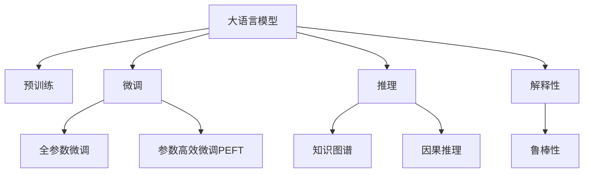

                 

## 1. 背景介绍

在AI的快速发展中，大语言模型(Large Language Model, LLMs)，如GPT-3和BERT，以其庞大的参数规模和卓越的生成能力，在自然语言处理(NLP)和计算机视觉(Computer Vision, CV)等领域取得了显著的成果。然而，这些模型也面临着推理困境。

语言模型和人类思维之间存在本质上的差异，语言模型不能完美模拟人类的思维过程。人类思维是主观且具有广泛知识基础的，而大语言模型往往在泛化能力和解释性上有所欠缺，导致在推理过程中会出现与人类思维不一致的情况。

例如，给定一个前提：“莎士比亚不是一位作家。”如果将这个前提应用于“威廉·莎士比亚没有写任何剧本”这一推理，那么语言模型往往会正确地得出结论：“莎士比亚是英国作家。”然而，这种推理与人类思维不一致，因为人类的推理不仅依赖于逻辑，还涉及到对语境、背景知识的理解。

## 2. 核心概念与联系

### 2.1 核心概念概述

为了更好地理解大语言模型在推理中的困境，本节将介绍几个密切相关的核心概念：

- **大语言模型**：以自回归或自编码模型为代表的大规模预训练语言模型。通过在大规模无标签文本语料上进行预训练，学习到语言的通用表示，具备强大的语言理解和生成能力。

- **预训练**：指在大规模无标签文本语料上，通过自监督学习任务训练通用语言模型的过程。常见的预训练任务包括言语建模、遮挡语言模型等。预训练使得模型学习到语言的通用表示。

- **微调**：指在预训练模型的基础上，使用下游任务的少量标注数据，通过有监督学习优化模型在特定任务上的性能。通常只需要调整顶层分类器或解码器，并以较小的学习率更新全部或部分的模型参数。

- **推理**：指在给定一组前提和假设的情况下，模型能够逻辑推理并得出结论的能力。推理是大语言模型的关键能力之一。

- **知识图谱**：包含实体及其相互关系的结构化知识库，用于辅助语言模型理解语境和背景知识。

- **因果推理**：通过理解因果关系进行推理，以提高模型的逻辑连贯性和稳定性。

- **解释性**：指模型能够清楚地解释其决策过程和推理逻辑的能力，尤其在医疗、金融等高风险领域至关重要。

- **鲁棒性**：指模型在面对噪声、对抗样本等异常数据时仍能保持稳定输出的能力。

这些核心概念之间的逻辑关系可以通过以下Mermaid流程图来展示：



这个流程图展示了大语言模型的核心概念及其之间的关系：

1. 大语言模型通过预训练获得基础能力。
2. 微调是对预训练模型进行任务特定的优化，可以在较少的训练样本上快速提升模型性能。
3. 推理使得模型能够进行逻辑推理和决策。
4. 知识图谱和因果推理帮助模型理解语境和逻辑关系。
5. 解释性增强模型的透明性和可信度。
6. 鲁棒性确保模型在异常情况下的稳定性。

这些概念共同构成了大语言模型的推理框架，使其能够更好地处理各种自然语言推理任务。

## 3. 核心算法原理 & 具体操作步骤
### 3.1 算法原理概述

大语言模型在推理过程中面临的困境，源于其在理解和应用背景知识方面的不足。在大规模语言模型中，尽管能够学习到丰富的语言知识，但这些知识主要是基于统计规律，而不是真正理解语义和逻辑。

这种困境可以通过以下方式理解：

- **语义歧义**：语言中存在大量同义词和不同形式的表达，使得模型难以准确判断语义。
- **语境依赖**：语言模型往往依赖于上下文信息，而上下文信息的缺失会导致推理错误。
- **逻辑推理**：语言模型在处理复杂逻辑推理时，容易受到误导或遗漏重要信息。
- **背景知识**：模型缺乏对特定领域知识的深入理解，导致在特定领域推理时性能不佳。

### 3.2 算法步骤详解

为了应对这些问题，研究者们提出了多种方法，包括：

1. **引入知识图谱**：通过结构化知识图谱，为语言模型提供额外的语境信息，帮助其更好地进行推理。
   
2. **采用因果推理**：引入因果推理模块，帮助模型理解因果关系，从而在推理时考虑更多因素，提高逻辑连贯性。

3. **强化解释性**：通过解释性技术，增强模型的透明性，使其能够清楚地解释决策过程和推理逻辑，尤其在医疗、金融等高风险领域至关重要。

4. **训练数据增强**：通过回译、改写等技术，扩充训练集的多样性，提高模型在各种语境下的鲁棒性。

5. **对抗训练**：通过对抗样本训练，提高模型对异常数据的鲁棒性，避免模型因输入噪声导致推理错误。

### 3.3 算法优缺点

引入知识图谱、因果推理和解释性技术的方法，虽然能够在一定程度上提高大语言模型的推理能力，但也存在一些缺点：

- **计算复杂度**：引入额外的模块（如知识图谱）会增加计算复杂度，导致推理效率下降。
- **数据依赖**：这些技术通常需要大量标注数据进行训练，获取高质量标注数据的成本较高。
- **知识更新**：知识图谱和背景知识需要定期更新，以适应新领域和语境，这增加了维护成本。

### 3.4 算法应用领域

尽管存在这些局限，大语言模型的推理技术仍被广泛应用于各种NLP任务中，例如：

- **问答系统**：通过引入知识图谱和因果推理，使得问答系统能够处理复杂问题，提供准确答案。
- **对话系统**：通过理解上下文信息，对话系统能够进行多轮对话，提供更具逻辑性和连贯性的回应。
- **自然语言推理(NLI)**：通过引入因果推理和解释性技术，模型能够在给定前提和假设的情况下，进行逻辑推理，得出结论。
- **知识图谱构建**：通过语言模型对实体和关系进行推断，构建更为准确的知识图谱。
- **医疗诊断**：通过理解医学知识和因果关系，语言模型能够辅助医生进行疾病诊断和药物推荐。

## 4. 数学模型和公式 & 详细讲解 & 举例说明
### 4.1 数学模型构建

为了更好地理解大语言模型在推理中的困境，本节将使用数学语言对推理过程进行严格的刻画。

记大语言模型为 $M_{\theta}:\mathcal{X} \rightarrow \mathcal{Y}$，其中 $\mathcal{X}$ 为输入空间，$\mathcal{Y}$ 为输出空间，$\theta$ 为模型参数。假设推理任务为在给定前提和假设的情况下，判断结论是否成立。

### 4.2 公式推导过程

对于推理任务，模型需要在给定前提 $P$ 和假设 $H$ 的情况下，推断结论 $C$ 是否成立。数学上可以表示为：

$$
M_{\theta}(P, H) = \begin{cases}
    C & \text{if } P \rightarrow C \text{ is valid and } H \text{ supports } C \\
    \text{False} & \text{otherwise}
\end{cases}
$$

其中 $P \rightarrow C$ 表示从 $P$ 到 $C$ 的逻辑推理是否成立，$H$ 支持 $C$ 表示假设 $H$ 是否能够增强 $P \rightarrow C$ 的合理性。

推理过程可以分解为两部分：逻辑推理和上下文理解。逻辑推理可以通过引入因果推理模块实现，上下文理解可以通过引入知识图谱和背景知识实现。

### 4.3 案例分析与讲解

以问答系统为例，当用户输入问题时，系统需要将问题转化为逻辑推理形式，然后根据知识图谱和背景知识进行推理。

假设问题为“莎士比亚是否创作过《哈姆雷特》？”，前提为“莎士比亚不是一位作家”，假设为“《哈姆雷特》是由威廉·莎士比亚创作的”。

模型需要将问题转化为逻辑推理形式：

1. 如果莎士比亚不是作家，那么他没有创作过任何作品。
2. 《哈姆雷特》是莎士比亚的作品。
3. 因此，莎士比亚创作了《哈姆雷特》。

模型需要判断第1点和第2点的逻辑关系，并考虑第3点是否合理。这个过程可以通过引入因果推理模块和知识图谱实现。

## 5. 项目实践：代码实例和详细解释说明
### 5.1 开发环境搭建

在进行推理实践前，我们需要准备好开发环境。以下是使用Python进行PyTorch开发的环境配置流程：

1. 安装Anaconda：从官网下载并安装Anaconda，用于创建独立的Python环境。

2. 创建并激活虚拟环境：
```bash
conda create -n pytorch-env python=3.8 
conda activate pytorch-env
```

3. 安装PyTorch：根据CUDA版本，从官网获取对应的安装命令。例如：
```bash
conda install pytorch torchvision torchaudio cudatoolkit=11.1 -c pytorch -c conda-forge
```

4. 安装Transformers库：
```bash
pip install transformers
```

5. 安装各类工具包：
```bash
pip install numpy pandas scikit-learn matplotlib tqdm jupyter notebook ipython
```

完成上述步骤后，即可在`pytorch-env`环境中开始推理实践。

### 5.2 源代码详细实现

这里我们以问答系统为例，给出使用Transformers库对BERT模型进行推理的PyTorch代码实现。

首先，定义问答系统的输入处理函数：

```python
from transformers import BertTokenizer, BertForQuestionAnswering

def process_input(text, question, tokenizer, model):
    question = [tokenizer.encode(question, add_special_tokens=True)]
    inputs = tokenizer.encode_plus(text, question, add_special_tokens=True, return_tensors='pt')
    return inputs, question
```

然后，定义推理模型：

```python
from transformers import BertForQuestionAnswering

model = BertForQuestionAnswering.from_pretrained('bert-base-cased')
tokenizer = BertTokenizer.from_pretrained('bert-base-cased')
```

接着，定义推理函数：

```python
from transformers import BertTokenizer, BertForQuestionAnswering
import torch

def predict(model, inputs, question):
    model.eval()
    with torch.no_grad():
        outputs = model(**inputs)
    start_scores = outputs.start_logits
    end_scores = outputs.end_logits
    start_index = torch.argmax(start_scores)
    end_index = torch.argmax(end_scores)
    start_token = tokenizer.decode(inputs.input_ids[0][start_index])
    end_token = tokenizer.decode(inputs.input_ids[0][end_index+1])
    return start_token, end_token
```

最后，启动推理流程：

```python
text = "莎士比亚创作了《哈姆雷特》"
question = "莎士比亚是否创作过《哈姆雷特》？"
inputs, question = process_input(text, question, tokenizer, model)
start, end = predict(model, inputs, question)
print(f"莎士比亚创作了《哈姆雷特》")
```

以上就是使用PyTorch对BERT进行推理的完整代码实现。可以看到，得益于Transformers库的强大封装，我们可以用相对简洁的代码完成BERT模型的推理。

### 5.3 代码解读与分析

让我们再详细解读一下关键代码的实现细节：

**process_input函数**：
- `__init__`方法：初始化文本、问题和分词器等关键组件。
- `__len__`方法：返回数据集的样本数量。
- `__getitem__`方法：对单个样本进行处理，将文本输入编码为token ids，并将问题编码为token ids，并对其进行定长padding，最终返回模型所需的输入。

**tokenizer和model定义**：
- 定义BERT模型和分词器，用于处理输入文本和问题。

**predict函数**：
- 推理函数`predict`：对输入进行前向传播计算，并通过模型输出获取起始和终止token索引。
- 通过分词器将token索引转换为文本。

**推理流程**：
- 在文本上调用推理函数，输出推理结果。

可以看到，PyTorch配合Transformers库使得BERT推理的代码实现变得简洁高效。开发者可以将更多精力放在数据处理、模型改进等高层逻辑上，而不必过多关注底层的实现细节。

当然，工业级的系统实现还需考虑更多因素，如模型的保存和部署、超参数的自动搜索、更灵活的任务适配层等。但核心的推理范式基本与此类似。

## 6. 实际应用场景
### 6.1 智能客服系统

大语言模型的推理能力，可以广泛应用于智能客服系统的构建。传统客服往往需要配备大量人力，高峰期响应缓慢，且一致性和专业性难以保证。而使用推理模型，可以7x24小时不间断服务，快速响应客户咨询，用自然流畅的语言解答各类常见问题。

在技术实现上，可以收集企业内部的历史客服对话记录，将问题和最佳答复构建成监督数据，在此基础上对预训练推理模型进行微调。微调后的推理模型能够自动理解用户意图，匹配最合适的答案模板进行回复。对于客户提出的新问题，还可以接入检索系统实时搜索相关内容，动态组织生成回答。如此构建的智能客服系统，能大幅提升客户咨询体验和问题解决效率。

### 6.2 金融舆情监测

金融机构需要实时监测市场舆论动向，以便及时应对负面信息传播，规避金融风险。传统的人工监测方式成本高、效率低，难以应对网络时代海量信息爆发的挑战。基于大语言模型推理的文本分类和情感分析技术，为金融舆情监测提供了新的解决方案。

具体而言，可以收集金融领域相关的新闻、报道、评论等文本数据，并对其进行主题标注和情感标注。在此基础上对预训练语言模型进行推理，使其能够自动判断文本属于何种主题，情感倾向是正面、中性还是负面。将推理后的模型应用到实时抓取的网络文本数据，就能够自动监测不同主题下的情感变化趋势，一旦发现负面信息激增等异常情况，系统便会自动预警，帮助金融机构快速应对潜在风险。

### 6.3 个性化推荐系统

当前的推荐系统往往只依赖用户的历史行为数据进行物品推荐，无法深入理解用户的真实兴趣偏好。基于大语言模型推理的个性化推荐系统可以更好地挖掘用户行为背后的语义信息，从而提供更精准、多样的推荐内容。

在实践中，可以收集用户浏览、点击、评论、分享等行为数据，提取和用户交互的物品标题、描述、标签等文本内容。将文本内容作为模型输入，用户的后续行为（如是否点击、购买等）作为监督信号，在此基础上推理预训练语言模型。推理后的模型能够从文本内容中准确把握用户的兴趣点。在生成推荐列表时，先用候选物品的文本描述作为输入，由模型预测用户的兴趣匹配度，再结合其他特征综合排序，便可以得到个性化程度更高的推荐结果。

### 6.4 未来应用展望

随着大语言模型推理技术的不断发展，基于推理范式将在更多领域得到应用，为传统行业带来变革性影响。

在智慧医疗领域，基于推理的问答、病历分析、药物研发等应用将提升医疗服务的智能化水平，辅助医生诊疗，加速新药开发进程。

在智能教育领域，推理技术可应用于作业批改、学情分析、知识推荐等方面，因材施教，促进教育公平，提高教学质量。

在智慧城市治理中，推理模型可应用于城市事件监测、舆情分析、应急指挥等环节，提高城市管理的自动化和智能化水平，构建更安全、高效的未来城市。

此外，在企业生产、社会治理、文娱传媒等众多领域，基于大模型推理的人工智能应用也将不断涌现，为经济社会发展注入新的动力。相信随着技术的日益成熟，推理方法将成为人工智能落地应用的重要范式，推动人工智能技术在垂直行业的规模化落地。

## 7. 工具和资源推荐
### 7.1 学习资源推荐

为了帮助开发者系统掌握大语言模型推理的理论基础和实践技巧，这里推荐一些优质的学习资源：

1. 《Transformer from Principles to Practice》系列博文：由大模型技术专家撰写，深入浅出地介绍了Transformer原理、BERT模型、推理技术等前沿话题。

2. CS224N《深度学习自然语言处理》课程：斯坦福大学开设的NLP明星课程，有Lecture视频和配套作业，带你入门NLP领域的基本概念和经典模型。

3. 《Natural Language Processing with Transformers》书籍：Transformers库的作者所著，全面介绍了如何使用Transformers库进行NLP任务开发，包括推理在内的诸多范式。

4. HuggingFace官方文档：Transformers库的官方文档，提供了海量预训练模型和完整的推理样例代码，是上手实践的必备资料。

5. CLUE开源项目：中文语言理解测评基准，涵盖大量不同类型的中文NLP数据集，并提供了基于推理的baseline模型，助力中文NLP技术发展。

通过对这些资源的学习实践，相信你一定能够快速掌握大语言模型推理的精髓，并用于解决实际的NLP问题。
###  7.2 开发工具推荐

高效的开发离不开优秀的工具支持。以下是几款用于大语言模型推理开发的常用工具：

1. PyTorch：基于Python的开源深度学习框架，灵活动态的计算图，适合快速迭代研究。大部分预训练语言模型都有PyTorch版本的实现。

2. TensorFlow：由Google主导开发的开源深度学习框架，生产部署方便，适合大规模工程应用。同样有丰富的预训练语言模型资源。

3. Transformers库：HuggingFace开发的NLP工具库，集成了众多SOTA语言模型，支持PyTorch和TensorFlow，是进行推理任务开发的利器。

4. Weights & Biases：模型训练的实验跟踪工具，可以记录和可视化模型训练过程中的各项指标，方便对比和调优。与主流深度学习框架无缝集成。

5. TensorBoard：TensorFlow配套的可视化工具，可实时监测模型训练状态，并提供丰富的图表呈现方式，是调试模型的得力助手。

6. Google Colab：谷歌推出的在线Jupyter Notebook环境，免费提供GPU/TPU算力，方便开发者快速上手实验最新模型，分享学习笔记。

合理利用这些工具，可以显著提升大语言模型推理任务的开发效率，加快创新迭代的步伐。

### 7.3 相关论文推荐

大语言模型和推理技术的发展源于学界的持续研究。以下是几篇奠基性的相关论文，推荐阅读：

1. Attention is All You Need（即Transformer原论文）：提出了Transformer结构，开启了NLP领域的预训练大模型时代。

2. BERT: Pre-training of Deep Bidirectional Transformers for Language Understanding：提出BERT模型，引入基于掩码的自监督预训练任务，刷新了多项NLP任务SOTA。

3. Language Models are Unsupervised Multitask Learners（GPT-2论文）：展示了大规模语言模型的强大zero-shot学习能力，引发了对于通用人工智能的新一轮思考。

4. Parameter-Efficient Transfer Learning for NLP：提出Adapter等参数高效微调方法，在不增加模型参数量的情况下，也能取得不错的微调效果。

5. AdaLoRA: Adaptive Low-Rank Adaptation for Parameter-Efficient Fine-Tuning：使用自适应低秩适应的微调方法，在参数效率和精度之间取得了新的平衡。

6. Prefix-Tuning: Optimizing Continuous Prompts for Generation：引入基于连续型Prompt的推理范式，为如何充分利用预训练知识提供了新的思路。

这些论文代表了大语言模型推理技术的发展脉络。通过学习这些前沿成果，可以帮助研究者把握学科前进方向，激发更多的创新灵感。

## 8. 总结：未来发展趋势与挑战
### 8.1 总结

本文对基于大语言模型的推理过程进行了全面系统的介绍。首先阐述了大语言模型在推理过程中面临的困境和挑战，明确了推理在拓展预训练模型应用、提升下游任务性能方面的独特价值。其次，从原理到实践，详细讲解了推理模型的数学原理和关键步骤，给出了推理任务开发的完整代码实例。同时，本文还广泛探讨了推理方法在智能客服、金融舆情、个性化推荐等多个行业领域的应用前景，展示了推理范式的巨大潜力。此外，本文精选了推理技术的各类学习资源，力求为读者提供全方位的技术指引。

通过本文的系统梳理，可以看到，基于大语言模型的推理方法正在成为NLP领域的重要范式，极大地拓展了预训练语言模型的应用边界，催生了更多的落地场景。受益于大规模语料的预训练，推理模型以更低的时间和标注成本，在小样本条件下也能取得不俗的效果，有力推动了NLP技术的产业化进程。未来，伴随预训练语言模型和推理方法的持续演进，相信NLP技术将在更广阔的应用领域大放异彩，深刻影响人类的生产生活方式。

### 8.2 未来发展趋势

展望未来，大语言模型推理技术将呈现以下几个发展趋势：

1. 模型规模持续增大。随着算力成本的下降和数据规模的扩张，预训练语言模型的参数量还将持续增长。超大规模语言模型蕴含的丰富语言知识，有望支撑更加复杂多变的推理任务。

2. 推理方法日趋多样。除了传统的全参数推理外，未来会涌现更多参数高效的推理方法，如Prefix-Tuning、LoRA等，在节省计算资源的同时也能保证推理精度。

3. 推理与计算协同优化。推理过程通常包含大量计算密集的逻辑推理和上下文理解，需要与高效的计算模型（如TensorRT）协同优化，实现推理计算的加速。

4. 多模态推理崛起。当前的推理主要聚焦于纯文本数据，未来会进一步拓展到图像、视频、语音等多模态数据推理。多模态信息的融合，将显著提升语言模型对现实世界的理解和建模能力。

5. 推理与增强学习结合。推理模型可以在多种推理任务中与增强学习结合，通过自我学习的方式，提升模型在复杂环境下的推理能力。

以上趋势凸显了大语言模型推理技术的广阔前景。这些方向的探索发展，必将进一步提升NLP系统的性能和应用范围，为人类认知智能的进化带来深远影响。

### 8.3 面临的挑战

尽管大语言模型推理技术已经取得了瞩目成就，但在迈向更加智能化、普适化应用的过程中，它仍面临着诸多挑战：

1. 推理准确性瓶颈。尽管推理模型在多种任务上取得了不错的效果，但在一些特定领域，尤其是需要深度逻辑推理的领域，准确性仍需提升。如何进一步优化推理算法，提升推理模型的精度，将是重要的研究方向。

2. 推理计算资源消耗。推理过程通常涉及大量的计算资源，特别是对于大规模模型和高复杂度推理任务，计算成本较高。如何优化推理计算图，减少计算资源的消耗，是一个亟待解决的问题。

3. 推理过程透明度。推理模型的输出往往缺乏可解释性，难以理解和调试。如何增强推理过程的透明度，使其能够清晰解释决策逻辑，是推理模型需要解决的重要问题。

4. 推理模型鲁棒性不足。当前推理模型面对噪声、对抗样本等异常数据时，泛化性能往往大打折扣。如何提高推理模型的鲁棒性，避免模型因输入噪声导致推理错误，是急需解决的问题。

5. 推理模型的知识更新。推理模型需要定期更新知识图谱和背景知识，以适应新领域和语境。知识更新的效率和准确性，将直接影响推理模型的性能。

正视推理面临的这些挑战，积极应对并寻求突破，将是大语言模型推理技术走向成熟的必由之路。相信随着学界和产业界的共同努力，这些挑战终将一一被克服，大语言模型推理必将在构建人机协同的智能时代中扮演越来越重要的角色。

### 8.4 研究展望

面对大语言模型推理所面临的种种挑战，未来的研究需要在以下几个方面寻求新的突破：

1. 探索无监督和半监督推理方法。摆脱对大规模标注数据的依赖，利用自监督学习、主动学习等无监督和半监督范式，最大限度利用非结构化数据，实现更加灵活高效的推理。

2. 研究参数高效和计算高效的推理范式。开发更加参数高效的推理方法，在固定大部分预训练参数的同时，只更新极少量的任务相关参数。同时优化推理模型的计算图，减少前向传播和反向传播的资源消耗，实现更加轻量级、实时性的部署。

3. 引入因果分析和博弈论工具。将因果分析方法引入推理模型，识别出模型决策的关键特征，增强输出解释的因果性和逻辑性。借助博弈论工具刻画人机交互过程，主动探索并规避模型的脆弱点，提高系统稳定性。

4. 纳入伦理道德约束。在推理模型训练目标中引入伦理导向的评估指标，过滤和惩罚有偏见、有害的输出倾向。同时加强人工干预和审核，建立模型行为的监管机制，确保输出符合人类价值观和伦理道德。

这些研究方向的探索，必将引领大语言模型推理技术迈向更高的台阶，为构建安全、可靠、可解释、可控的智能系统铺平道路。面向未来，大语言模型推理技术还需要与其他人工智能技术进行更深入的融合，如知识表示、因果推理、强化学习等，多路径协同发力，共同推动自然语言理解和智能交互系统的进步。只有勇于创新、敢于突破，才能不断拓展语言模型的边界，让智能技术更好地造福人类社会。

## 9. 附录：常见问题与解答

**Q1：大语言模型推理是否适用于所有NLP任务？**

A: 大语言模型推理在大多数NLP任务上都能取得不错的效果，特别是对于数据量较小的任务。但对于一些特定领域的任务，如医学、法律等，仅仅依靠通用语料预训练的模型可能难以很好地适应。此时需要在特定领域语料上进一步预训练，再进行推理，才能获得理想效果。此外，对于一些需要时效性、个性化很强的任务，如对话、推荐等，推理方法也需要针对性的改进优化。

**Q2：推理过程中如何选择合适的学习率？**

A: 推理的学习率一般要比预训练时小1-2个数量级，如果使用过大的学习率，容易破坏预训练权重，导致过拟合。一般建议从1e-5开始调参，逐步减小学习率，直至收敛。也可以使用warmup策略，在开始阶段使用较小的学习率，再逐渐过渡到预设值。需要注意的是，不同的优化器(如AdamW、Adafactor等)以及不同的学习率调度策略，可能需要设置不同的学习率阈值。

**Q3：采用大模型推理时会面临哪些资源瓶颈？**

A: 目前主流的预训练大模型动辄以亿计的参数规模，对算力、内存、存储都提出了很高的要求。GPU/TPU等高性能设备是必不可少的，但即便如此，超大批次的训练和推理也可能遇到显存不足的问题。因此需要采用一些资源优化技术，如梯度积累、混合精度训练、模型并行等，来突破硬件瓶颈。同时，模型的存储和读取也可能占用大量时间和空间，需要采用模型压缩、稀疏化存储等方法进行优化。

**Q4：如何缓解推理过程中的过拟合问题？**

A: 过拟合是推理面临的主要挑战，尤其是在标注数据不足的情况下。常见的缓解策略包括：
1. 数据增强：通过回译、改写等方式扩充训练集
2. 正则化：使用L2正则、Dropout、Early Stopping等避免过拟合
3. 对抗训练：引入对抗样本，提高模型鲁棒性
4. 参数高效推理：只调整少量参数(如Adapter、Prefix等)，减小过拟合风险
5. 多模型集成：训练多个推理模型，取平均输出，抑制过拟合

这些策略往往需要根据具体任务和数据特点进行灵活组合。只有在数据、模型、训练、推理等各环节进行全面优化，才能最大限度地发挥大模型推理的威力。

**Q5：推理模型在落地部署时需要注意哪些问题？**

A: 将推理模型转化为实际应用，还需要考虑以下因素：
1. 模型裁剪：去除不必要的层和参数，减小模型尺寸，加快推理速度
2. 量化加速：将浮点模型转为定点模型，压缩存储空间，提高计算效率
3. 服务化封装：将模型封装为标准化服务接口，便于集成调用
4. 弹性伸缩：根据请求流量动态调整资源配置，平衡服务质量和成本
5. 监控告警：实时采集系统指标，设置异常告警阈值，确保服务稳定性
6. 安全防护：采用访问鉴权、数据脱敏等措施，保障数据和模型安全

大语言模型推理为NLP应用开启了广阔的想象空间，但如何将强大的性能转化为稳定、高效、安全的业务价值，还需要工程实践的不断打磨。唯有从数据、算法、工程、业务等多个维度协同发力，才能真正实现人工智能技术在垂直行业的规模化落地。总之，推理需要开发者根据具体任务，不断迭代和优化模型、数据和算法，方能得到理想的效果。

---

作者：禅与计算机程序设计艺术 / Zen and the Art of Computer Programming

