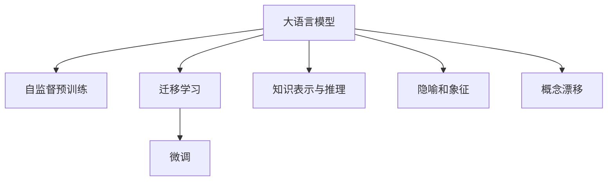

                 

# 语言与思维：大模型的局限性

> 关键词：大语言模型,局限性,思维模型,人类认知,人工智能

## 1. 背景介绍

随着深度学习技术的飞速发展，基于大规模预训练的语言模型在自然语言处理（NLP）领域取得了突破性进展。以BERT、GPT-3等模型为代表，这些大模型通过在大量无标签文本上进行自监督预训练，学习到丰富的语言知识，表现出强大的泛化能力。这些模型不仅在语言生成、语义理解、推理问答等任务上表现出色，还在跨领域迁移学习、零样本学习等方面展现出巨大潜力。然而，尽管大模型在多项任务上取得了显著的性能提升，其在语言与思维上的局限性依然不容忽视。

本文将详细探讨大语言模型在语言与思维层面上的局限性，分析这些局限性对模型应用的具体影响，并提出可能的改进方向，为未来大语言模型的发展提供有价值的参考。

## 2. 核心概念与联系

### 2.1 核心概念概述

为了更好地理解大语言模型的局限性，我们首先回顾几个核心概念：

- **大语言模型（Large Language Models, LLMs）**：指通过在大规模无标签文本语料上进行自监督预训练，学习到通用语言表示的模型。常用的预训练技术包括掩码语言模型（Masked Language Modeling, MLM）、下一句预测（Next Sentence Prediction, NSP）等。

- **迁移学习（Transfer Learning）**：指将在大规模数据上预训练的模型迁移到特定领域任务中进行微调，以提高模型在该领域上的性能。微调过程通常需要少量的有标签数据。

- **知识表示与推理（Knowledge Representation and Reasoning）**：指将知识结构化地嵌入模型，使其能够更好地进行逻辑推理和知识检索。

- **隐喻和象征（Metaphor and Symbol）**：指人类语言中常用的修辞手法，用于表达抽象概念和情感，是理解人类语言复杂性的关键。

- **概念漂移（Concept Drift）**：指模型训练数据与实际应用数据的分布差异，导致模型在新环境中性能下降的问题。

这些核心概念共同构成了大语言模型工作的基本框架，本文将围绕这些概念探讨大模型的局限性。

### 2.2 核心概念原理和架构的 Mermaid 流程图



这个流程图展示了大语言模型的基本构成及其与其他核心概念的关系。大语言模型通过自监督预训练获得通用语言知识，通过迁移学习和微调进一步优化特定领域的表现，通过知识表示与推理提升模型的逻辑推理能力，通过隐喻和象征处理语言的复杂性，以及应对概念漂移问题。

## 3. 核心算法原理 & 具体操作步骤

### 3.1 算法原理概述

大语言模型在处理语言与思维方面存在局限性，主要表现在以下几个方面：

- **语言复杂性处理能力不足**：大模型虽然能够生成流畅的自然语言，但有时难以准确理解语言的隐喻、象征等修辞手法，导致模型在处理含糊、歧义或富有哲理的语言时表现不佳。

- **逻辑推理能力有限**：尽管大模型在推理问答等任务上表现优异，但其逻辑推理能力仍受限于训练数据的规模和质量，难以处理复杂的因果关系和推导过程。

- **知识表示能力欠缺**：大模型在处理具体领域的知识时，往往依赖于数据样本中的例子，难以进行结构化的知识表示和推理。

- **概念漂移问题**：大模型在从训练数据到实际应用数据分布发生变化时，可能会因为缺乏持续学习机制而性能下降。

### 3.2 算法步骤详解

#### 3.2.1 数据准备

大模型的训练通常需要大量的无标签文本数据。这些数据可以是新闻、书籍、维基百科等，但需确保数据的多样性和覆盖面。

#### 3.2.2 自监督预训练

使用掩码语言模型、下一句预测等自监督任务对模型进行预训练，使其学习到通用的语言表示。

#### 3.2.3 迁移学习和微调

根据具体任务需求，在大规模预训练模型上进行微调，以提升模型在特定领域上的性能。微调通常需要少量有标签数据，但数据质量对模型性能影响显著。

#### 3.2.4 知识表示与推理

通过结构化的知识库和规则库，辅助大模型进行知识表示和推理，提升模型的逻辑推理能力。

#### 3.2.5 隐喻和象征处理

通过引入语言学的隐喻、象征等概念，训练大模型更好地理解复杂的语言表达。

#### 3.2.6 概念漂移应对

采用在线学习、增量学习等方法，使大模型能够持续适应新数据分布的变化，应对概念漂移问题。

### 3.3 算法优缺点

#### 3.3.1 优点

1. **泛化能力强**：大模型通过自监督预训练和迁移学习，能够较好地适应新任务，提升模型泛化能力。

2. **处理复杂语言**：尽管存在局限性，大模型仍能在大部分任务上生成流畅、符合语境的自然语言。

3. **高效迭代**：利用预训练模型进行微调，可以显著减少从头训练所需的标注数据量和计算资源。

#### 3.3.2 缺点

1. **语言理解深度不足**：难以准确理解语言的隐喻、象征等修辞手法，限制了模型处理复杂语言表达的能力。

2. **逻辑推理受限**：逻辑推理能力仍受限于训练数据的质量和规模，难以处理复杂的因果关系。

3. **知识表示能力弱**：缺乏结构化的知识表示和推理，难以处理领域特定的知识。

4. **概念漂移问题**：在新数据分布下，模型性能可能下降，需要持续学习机制应对概念变化。

### 3.4 算法应用领域

尽管存在局限性，大语言模型在多个领域仍展现出巨大潜力，主要应用于：

- **自然语言处理（NLP）**：语言生成、语义理解、问答、翻译、摘要等。

- **智能对话**：智能客服、虚拟助手、智能聊天机器人等。

- **知识管理**：问答系统、知识库构建、信息检索等。

- **教育与培训**：智能辅导、自适应学习、虚拟教室等。

- **科研与分析**：文献阅读、数据分析、科学推理等。

## 4. 数学模型和公式 & 详细讲解

### 4.1 数学模型构建

我们以大语言模型在问答任务中的应用为例，构建数学模型。设模型参数为 $\theta$，输入为问题 $q$，答案为 $a$，预训练数据集为 $\mathcal{D}_{\text{pre}}$，微调数据集为 $\mathcal{D}_{\text{finetune}}$。模型输出的概率分布为 $P(a|q; \theta)$。

#### 4.1.1 目标函数

微调的目标函数为：

$$
\mathcal{L}(\theta) = \frac{1}{N} \sum_{i=1}^N \log P(a_i|q_i; \theta) \quad \text{if } (q_i, a_i) \in \mathcal{D}_{\text{finetune}}
$$

其中 $N$ 为微调数据集 $\mathcal{D}_{\text{finetune}}$ 的大小。

#### 4.1.2 损失函数

对于每个样本 $(x_i, y_i)$，模型的预测输出为 $y_i = M_{\theta}(x_i)$，其中 $M_{\theta}$ 为大语言模型。则损失函数为：

$$
\mathcal{L}(M_{\theta}, D) = \frac{1}{N} \sum_{i=1}^N -y_i \log P(y_i|x_i; \theta)
$$

### 4.2 公式推导过程

1. **自监督预训练**：

   在大规模无标签数据上进行掩码语言模型预训练，目标函数为：

   $$
   \min_{\theta} \frac{1}{N} \sum_{i=1}^N - \log P(\hat{y}_i|x_i; \theta)
   $$

   其中 $\hat{y}_i$ 为随机掩码的预测值，$x_i$ 为输入文本。

2. **迁移学习和微调**：

   在微调数据集上进行微调，目标函数为：

   $$
   \min_{\theta} \mathcal{L}(\theta) = \frac{1}{N} \sum_{i=1}^N - \log P(y_i|x_i; \theta)
   $$

   其中 $y_i$ 为有标签样本的真实答案。

3. **知识表示与推理**：

   通过引入结构化的知识库和规则库，辅助模型进行知识推理。例如，使用规则 $R$ 对模型进行约束，目标函数为：

   $$
   \min_{\theta} \mathcal{L}(\theta) = \frac{1}{N} \sum_{i=1}^N \lambda_R R(x_i, y_i; \theta)
   $$

   其中 $\lambda_R$ 为规则约束的权重。

### 4.3 案例分析与讲解

以BERT模型为例，分析其在问答任务中的应用。BERT模型通过掩码语言模型预训练，然后在问答数据上进行微调。在微调过程中，使用分类器输出概率分布，并使用交叉熵损失函数进行训练。

假设问题 $q$ 和答案 $a$ 的向量表示分别为 $q_{\text{embed}}$ 和 $a_{\text{embed}}$，则模型输出为：

$$
P(a|q; \theta) = \sigma(W^T [q_{\text{embed}} + a_{\text{embed}}]
$$

其中 $\sigma$ 为sigmoid函数，$W$ 为线性变换矩阵。

## 5. 项目实践：代码实例和详细解释说明

### 5.1 开发环境搭建

为实现大语言模型在问答任务上的微调，我们需要使用PyTorch框架，并利用HuggingFace提供的BERT模型。

1. 安装PyTorch和HuggingFace Transformers库：

   ```
   pip install torch transformers
   ```

2. 下载BERT预训练模型：

   ```
   python -m transformers download model bert-base-uncased
   ```

### 5.2 源代码详细实现

以下是一个简单的代码示例，展示如何使用BERT模型进行问答任务的微调：

```python
import torch
from transformers import BertTokenizer, BertForQuestionAnswering

# 定义模型和分词器
model = BertForQuestionAnswering.from_pretrained('bert-base-uncased')
tokenizer = BertTokenizer.from_pretrained('bert-base-uncased')

# 定义训练函数
def train_epoch(model, dataloader, optimizer):
    model.train()
    for batch in dataloader:
        inputs = tokenizer(batch['question'], batch['answer'], return_tensors='pt', padding='max_length', truncation=True)
        outputs = model(**inputs)
        loss = outputs.loss
        loss.backward()
        optimizer.step()

# 定义评估函数
def evaluate(model, dataloader):
    model.eval()
    total_loss = 0
    for batch in dataloader:
        inputs = tokenizer(batch['question'], batch['answer'], return_tensors='pt', padding='max_length', truncation=True)
        outputs = model(**inputs)
        loss = outputs.loss
        total_loss += loss.item()
    return total_loss / len(dataloader)

# 训练和评估
epochs = 5
learning_rate = 2e-5
optimizer = torch.optim.Adam(model.parameters(), lr=learning_rate)

for epoch in range(epochs):
    train_loss = train_epoch(model, train_dataloader, optimizer)
    eval_loss = evaluate(model, dev_dataloader)
    print(f'Epoch {epoch+1}, train loss: {train_loss:.3f}, dev loss: {eval_loss:.3f}')

print('Model trained. Use for prediction.')
```

### 5.3 代码解读与分析

1. **分词器与模型**：
   - `BertTokenizer`用于将输入的文本进行分词，转换为模型所需的格式。
   - `BertForQuestionAnswering`为预训练的问答模型，用于微调。

2. **训练函数**：
   - 在每个epoch中，对模型进行前向传播计算损失，反向传播更新参数，最后更新优化器。

3. **评估函数**：
   - 对模型在验证集上进行评估，计算平均损失。

4. **训练与评估**：
   - 循环训练并评估模型，输出每个epoch的损失。

## 6. 实际应用场景

### 6.1 智能客服系统

智能客服系统通过微调大语言模型，可以自动理解用户意图并生成回复，大幅提升客户咨询体验和问题解决效率。

#### 6.1.1 实现步骤

1. **数据收集**：收集企业内部历史客服对话记录，将问题和最佳答复构建成监督数据。

2. **微调模型**：使用微调后的模型对新的客户咨询进行理解，并生成合适的回复。

3. **实时更新**：根据用户反馈和新的对话记录，持续微调模型以提高准确性。

#### 6.1.2 效果评估

智能客服系统通过微调模型，实现了24小时不间断服务，快速响应客户咨询，显著提升了服务质量和用户体验。

### 6.2 金融舆情监测

金融机构需要实时监测市场舆论动向，以便及时应对负面信息传播，规避金融风险。

#### 6.2.1 实现步骤

1. **数据收集**：收集金融领域相关的新闻、报道、评论等文本数据，并对其进行主题标注和情感标注。

2. **微调模型**：使用微调后的模型对实时抓取的网络文本数据进行情感分析，预测市场情绪。

3. **预警系统**：根据情感分析结果，自动生成预警信息，帮助金融机构快速应对潜在风险。

#### 6.2.2 效果评估

通过微调模型，金融机构能够实时监测市场情绪变化，及时发现风险信号，有效规避金融风险。

### 6.3 个性化推荐系统

个性化推荐系统通过微调大语言模型，可以更准确地了解用户兴趣偏好，推荐更加个性化的内容。

#### 6.3.1 实现步骤

1. **数据收集**：收集用户浏览、点击、评论、分享等行为数据，提取和用户交互的物品标题、描述、标签等文本内容。

2. **微调模型**：使用微调后的模型预测用户的兴趣匹配度，生成个性化推荐列表。

3. **动态调整**：根据用户的反馈和行为数据，持续微调模型以提高推荐效果。

#### 6.3.2 效果评估

个性化推荐系统通过微调模型，提高了推荐内容的个性化程度，使用户获得更好的浏览体验。

### 6.4 未来应用展望

随着大语言模型的不断发展，其在语言与思维上的局限性将逐步得到缓解，带来更多创新应用。

#### 6.4.1 教育与培训

通过微调大语言模型，可以构建智能辅导系统，根据学生的学习情况实时调整教学内容，提供个性化学习建议。

#### 6.4.2 科学研究

大语言模型在科学研究中也有广泛应用，如通过微调模型进行文献阅读、数据分析、科学推理等，提升科研效率和精度。

#### 6.4.3 人工智能伦理

大语言模型在伦理、道德等方面面临的挑战也将引发更多关注，通过微调技术加强模型的可解释性和安全性，确保其行为符合人类价值观。

## 7. 工具和资源推荐

### 7.1 学习资源推荐

1. **《深度学习》系列教材**：系统介绍深度学习原理和实践，适合初学者和进阶者学习。

2. **Stanford CS224N《深度学习自然语言处理》课程**：斯坦福大学的经典NLP课程，涵盖了NLP中的核心技术和模型。

3. **《自然语言处理入门与实践》**：详细讲解NLP的基本概念和技术，适合非专业读者。

### 7.2 开发工具推荐

1. **PyTorch**：强大的深度学习框架，支持动态计算图和GPU加速。

2. **TensorFlow**：由Google主导的深度学习框架，支持分布式训练和生产部署。

3. **Transformers**：HuggingFace提供的NLP工具库，集成了多种大模型和微调范式。

### 7.3 相关论文推荐

1. **Attention is All You Need**：Transformer的原创论文，提出自注意力机制，开创了自监督预训练的新纪元。

2. **BERT: Pre-training of Deep Bidirectional Transformers for Language Understanding**：提出BERT模型，引入掩码语言模型，刷新了多项NLP任务SOTA。

3. **Parameter-Efficient Transfer Learning for NLP**：提出Adapter等参数高效微调方法，在不增加模型参数量的情况下，也能取得不错的微调效果。

4. **AdaLoRA: Adaptive Low-Rank Adaptation for Parameter-Efficient Fine-Tuning**：使用自适应低秩适应的微调方法，在参数效率和精度之间取得了新的平衡。

## 8. 总结：未来发展趋势与挑战

### 8.1 总结

本文详细探讨了大语言模型在语言与思维上的局限性，分析了这些局限性对模型应用的具体影响，并提出了可能的改进方向。尽管存在诸多局限性，大语言模型仍展现出强大的泛化能力和应用潜力，已在多个领域取得显著进展。

### 8.2 未来发展趋势

1. **多模态融合**：未来的大语言模型将更加注重多模态数据的融合，如视觉、音频等多模态信息的整合，提升模型的综合理解能力。

2. **知识表示与推理**：通过引入结构化的知识库和规则库，增强模型的逻辑推理能力，使其能够更好地进行知识推理和决策。

3. **持续学习与适应**：大语言模型需要具备持续学习机制，以适应数据分布的变化，避免概念漂移问题。

4. **可解释性与透明性**：通过增强模型的可解释性，使其输出更加透明，满足高风险领域的要求。

### 8.3 面临的挑战

尽管大语言模型在诸多领域取得了显著进展，但仍面临诸多挑战：

1. **语言理解深度不足**：难以准确理解语言的隐喻、象征等修辞手法，限制了模型处理复杂语言表达的能力。

2. **逻辑推理受限**：逻辑推理能力仍受限于训练数据的质量和规模，难以处理复杂的因果关系。

3. **知识表示能力弱**：缺乏结构化的知识表示和推理，难以处理领域特定的知识。

4. **概念漂移问题**：在新数据分布下，模型性能可能下降，需要持续学习机制应对概念变化。

### 8.4 研究展望

未来，通过多模态融合、知识表示与推理、持续学习与适应、可解释性与透明性等方面的研究，有望进一步提升大语言模型的性能，缓解其局限性。同时，需要更多理论与实践的探索，以应对实际应用中的各种挑战，推动大语言模型的持续发展和应用。

## 9. 附录：常见问题与解答

**Q1：大语言模型在处理复杂语言表达时表现不佳，原因是什么？**

A: 大语言模型在处理复杂语言表达时表现不佳，主要是由于其难以准确理解语言的隐喻、象征等修辞手法。这些修辞手法往往涉及抽象概念和情感表达，具有较高的语义模糊性和多样性，超出了大语言模型的理解范围。

**Q2：大语言模型在逻辑推理方面存在哪些局限性？**

A: 大语言模型在逻辑推理方面存在以下局限性：

1. **因果关系处理**：难以准确理解复杂的因果关系，例如推导过程较长或涉及多个假设。

2. **推理链过长**：在推理链较长时，模型容易产生误解或错误推理。

3. **数据依赖性**：逻辑推理能力依赖于训练数据的质量和规模，难以处理新的推理任务。

**Q3：如何提高大语言模型的逻辑推理能力？**

A: 提高大语言模型的逻辑推理能力，可以从以下几个方面入手：

1. **增强数据质量**：使用高质量、多领域的逻辑推理数据进行预训练。

2. **引入逻辑推理规则**：通过引入逻辑推理规则，辅助模型进行结构化推理。

3. **多任务学习**：在预训练和微调过程中引入逻辑推理任务，提升模型的泛化能力。

4. **对抗训练**：引入对抗样本，提高模型的鲁棒性和推理能力。

**Q4：大语言模型在处理领域特定知识时表现不佳，原因是什么？**

A: 大语言模型在处理领域特定知识时表现不佳，主要原因如下：

1. **知识表示能力不足**：模型缺乏结构化的知识表示能力，难以进行知识检索和推理。

2. **领域知识缺乏**：预训练数据和微调数据可能不包含特定领域的知识，导致模型在该领域上性能不佳。

3. **知识抽象难度大**：特定领域的知识往往具有高度抽象性，难以通过文本数据学习。

**Q5：如何增强大语言模型的知识表示能力？**

A: 增强大语言模型的知识表示能力，可以从以下几个方面入手：

1. **结构化知识库**：引入结构化的知识库，辅助模型进行知识推理和表示。

2. **规则约束**：使用规则约束模型，确保模型输出符合领域知识。

3. **多领域数据**：在预训练和微调过程中，引入多领域数据，提升模型的泛化能力。

4. **知识抽取技术**：使用知识抽取技术，从文本数据中提取结构化知识，辅助模型学习。

---

作者：禅与计算机程序设计艺术 / Zen and the Art of Computer Programming

