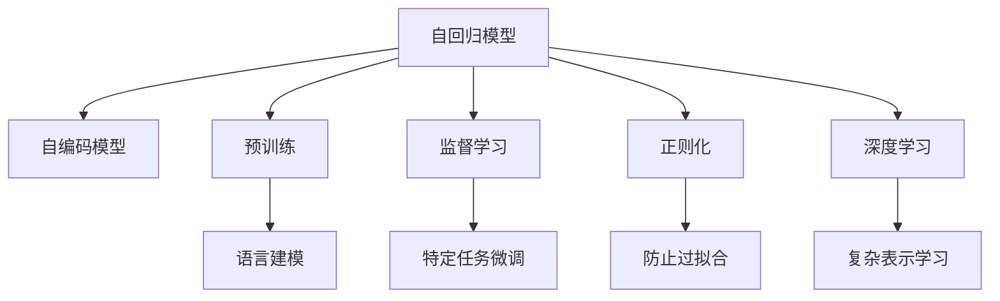

                 

# 语言建模的挑战和未来方向

> 关键词：语言建模,自回归模型,自编码模型,预训练,监督学习,正则化,深度学习

## 1. 背景介绍

### 1.1 问题由来
语言建模是自然语言处理(NLP)的核心问题之一，旨在从大规模文本语料中学习语言的统计规律和语义信息。语言模型的成功与否，直接影响到NLP任务的性能，如文本生成、翻译、信息检索等。随着深度学习技术的兴起，神经网络逐渐成为构建语言模型的重要工具，尤其是基于深度学习的自回归模型和自编码模型，因其优越的表达能力和建模能力，迅速成为主流。

然而，构建高性能的语言模型并非易事。从数据准备到模型训练，再到模型评估，每个环节都充满着挑战。本文旨在探讨语言建模过程中面临的核心问题，以及未来的发展方向，为行业从业者提供全面的技术指导和理论参考。

### 1.2 问题核心关键点
语言建模的核心问题包括以下几个方面：

1. **数据准备**：语言模型需要从大规模文本数据中学习规律，如何有效利用这些数据，是构建高性能语言模型的第一步。
2. **模型架构**：选择合适的模型架构，如自回归、自编码，并进行合理的层级设计和参数调整，直接影响模型的建模能力和泛化能力。
3. **训练过程**：合理的训练策略，包括学习率、优化器、正则化技术等，是避免过拟合和提高模型性能的关键。
4. **模型评估**：选择合适的评估指标和评估方法，对模型的性能进行全面评估，帮助调整训练策略。
5. **模型应用**：将模型应用于实际任务中，并进行必要的微调和优化，以满足具体应用场景的需求。

本文将围绕这些关键点，对语言建模的技术进行深入探讨。

## 2. 核心概念与联系

### 2.1 核心概念概述

为更好地理解语言建模的核心概念，本节将介绍几个密切相关的核心概念：

- **自回归模型(Autoregressive Model)**：一种通过先预测后输出信息的模型架构，将输出序列与先前的输入序列紧密联系在一起。
- **自编码模型(Autoencoder Model)**：一种通过先编码后解码的模型架构，将输入数据压缩到低维空间，再解码回原始空间。
- **预训练(Pre-training)**：指在大规模无标签文本语料上，通过自监督学习任务训练语言模型的过程。常见的预训练任务包括语言建模、掩码语言模型等。
- **监督学习(Supervised Learning)**：指在有标签数据集上，通过有监督的方式训练语言模型的过程。监督学习可以进一步提升模型在特定任务上的性能。
- **正则化(Regularization)**：指在模型训练过程中，通过增加正则项来限制模型复杂度，防止过拟合。常见的正则化技术包括L2正则、Dropout等。
- **深度学习(Deep Learning)**：一种基于神经网络的机器学习方法，通过多层次的非线性变换，学习复杂的高维表示。

这些核心概念之间的逻辑关系可以通过以下Mermaid流程图来展示：



这个流程图展示了大语言模型的核心概念及其之间的关系：

1. 自回归模型和自编码模型是构建语言模型的两种主要架构。
2. 预训练过程通过自监督学习任务，如语言建模，在大规模数据上学习语言知识。
3. 监督学习进一步提升模型在特定任务上的性能。
4. 正则化技术帮助防止模型过拟合，提高模型泛化能力。
5. 深度学习通过多层次的非线性变换，学习更丰富的表示。
6. 语言模型可以是预训练模型，也可以是监督学习模型。
7. 特定任务微调进一步提升模型在该任务上的性能。

这些核心概念共同构成了语言建模的框架，使得模型能够更好地理解语言的规律，并在各种应用场景中发挥作用。

## 3. 核心算法原理 & 具体操作步骤

### 3.1 算法原理概述

语言建模的原理是构建一个概率模型，通过学习大规模文本语料的概率分布，从而预测给定文本序列的概率。常见的语言模型有N-gram模型、RNN模型、LSTM模型、GRU模型、Transformer模型等。

以Transformer模型为例，其基本架构包括多个自注意力层和全连接层，通过多层堆叠，学习长距离依赖和复杂关系。在预训练阶段，Transformer模型在无标签语料上进行自监督学习任务，如掩码语言模型、下一句预测等，从而学习语言知识。在微调阶段，通过在有标签数据集上进行监督学习，进一步提升模型在特定任务上的性能。

### 3.2 算法步骤详解

语言建模的算法步骤包括以下几个关键步骤：

**Step 1: 准备数据集**
- 收集大规模文本语料，进行预处理和分词，得到单词序列。
- 划分为训练集、验证集和测试集，并进行标准化处理。

**Step 2: 选择模型架构**
- 根据任务需求，选择合适的模型架构，如Transformer、LSTM等。
- 设计模型层级结构，确定输入和输出层的网络参数。

**Step 3: 进行预训练**
- 在大规模无标签语料上进行自监督学习任务，如掩码语言模型。
- 使用优化算法，如Adam，更新模型参数，最小化损失函数。
- 记录模型在验证集上的性能，避免过拟合。

**Step 4: 进行监督学习微调**
- 在有标签数据集上进行监督学习，通过优化算法更新模型参数。
- 设计适当的损失函数，如交叉熵损失、均方误差损失等。
- 记录模型在测试集上的性能，评估微调效果。

**Step 5: 应用和评估**
- 将微调后的模型应用于实际任务中，进行推理预测。
- 使用适当的评估指标，如BLEU、ROUGE等，评估模型性能。
- 根据评估结果，进行必要的微调和优化。

### 3.3 算法优缺点

语言建模方法具有以下优点：
1. 准确性高：基于深度学习模型，能够学习到复杂的多层次表示。
2. 泛化能力强：在预训练阶段，模型可以学习到通用的语言知识，应用于多种任务。
3. 可扩展性好：模型的结构可以灵活调整，支持多种类型的语言任务。

但同时，这些方法也存在以下缺点：
1. 数据需求大：需要大量文本数据进行预训练，数据准备成本高。
2. 训练复杂度高：模型参数量大，训练过程耗时较长。
3. 计算资源需求高：大规模模型需要高性能计算资源。
4. 模型复杂度大：模型结构复杂，难以调试和优化。

尽管存在这些缺点，但语言建模依然是构建高性能NLP模型的重要手段，具有广阔的应用前景。

### 3.4 算法应用领域

语言建模技术已经广泛应用于多个领域，包括但不限于：

- **自然语言理解(NLU)**：将文本转换为结构化数据，如命名实体识别、情感分析等。
- **自然语言生成(NLG)**：生成符合语法和语义规则的文本，如机器翻译、摘要生成等。
- **文本分类**：对文本进行分类，如垃圾邮件过滤、新闻分类等。
- **信息检索**：根据查询词，从大量文本中检索相关信息。
- **对话系统**：与用户进行自然对话，如智能客服、智能助手等。

除了这些经典应用外，语言建模技术还在诸多新兴领域，如文本生成、问答系统、语音识别等方面，展现出巨大的潜力。

## 4. 数学模型和公式 & 详细讲解

### 4.1 数学模型构建

语言建模的核心是构建一个概率模型，通过学习文本语料的概率分布，预测给定文本序列的概率。常见的概率模型包括N-gram模型和基于神经网络的模型。

以Transformer模型为例，其数学模型可以表示为：

$$
P(\mathbf{x}) = \prod_{i=1}^T P(x_i | x_{<i})
$$

其中，$\mathbf{x}$ 为文本序列，$T$ 为序列长度。$x_i$ 表示第 $i$ 个单词，$x_{<i}$ 表示前 $i-1$ 个单词的序列。$P(x_i | x_{<i})$ 表示在已知前 $i-1$ 个单词的情况下，第 $i$ 个单词出现的概率。

### 4.2 公式推导过程

以基于Transformer的下一个词预测任务为例，推导其损失函数和梯度计算公式。

假设输入序列为 $\mathbf{x}=[x_1, x_2, ..., x_T]$，输出为 $\mathbf{y}=[y_1, y_2, ..., y_T]$。输入序列 $x_1$ 到 $x_T$ 通过Transformer模型编码，得到编码后的序列 $H_1$ 到 $H_T$。输出序列 $y_1$ 到 $y_T$ 通过一个全连接层解码，得到解码后的序列 $S_1$ 到 $S_T$。

目标是最小化预测序列 $y$ 与真实序列 $x$ 之间的交叉熵损失：

$$
\mathcal{L} = -\sum_{t=1}^T \log P(x_t | x_{<t})
$$

其中，$P(x_t | x_{<t})$ 为在第 $t$ 个位置上预测单词 $x_t$ 的概率，可以表示为：

$$
P(x_t | x_{<t}) = \text{softmax}(\mathbf{v} \cdot \mathbf{K}^T \mathbf{Q})
$$

其中，$\mathbf{v}$ 为预测单词的向量表示，$\mathbf{K}$ 和 $\mathbf{Q}$ 分别为编码后的序列和解码后的序列，$\cdot$ 表示向量点积。

目标函数关于 $\mathbf{v}$ 的梯度为：

$$
\frac{\partial \mathcal{L}}{\partial \mathbf{v}} = -\sum_{t=1}^T \frac{\partial \log P(x_t | x_{<t})}{\partial \mathbf{v}} = -\sum_{t=1}^T \frac{y_t - P(x_t | x_{<t})}{P(x_t | x_{<t})}
$$

通过反向传播算法，可以计算出模型参数的梯度，并使用优化算法进行更新。

### 4.3 案例分析与讲解

以机器翻译任务为例，分析基于Transformer的语言建模方法。

假设输入序列为 $\mathbf{x}=[x_1, x_2, ..., x_T]$，表示源语言文本，输出序列 $\mathbf{y}=[y_1, y_2, ..., y_T]$ 表示目标语言文本。假设输入序列的编码表示为 $H_1$ 到 $H_T$，输出序列的解码表示为 $S_1$ 到 $S_T$。

机器翻译的目标是最小化翻译结果与真实结果之间的交叉熵损失：

$$
\mathcal{L} = -\sum_{t=1}^T \log P(y_t | y_{<t}, x_{<t})
$$

其中，$P(y_t | y_{<t}, x_{<t})$ 为在已知前 $t-1$ 个目标单词和源语言单词的情况下，第 $t$ 个目标单词出现的概率，可以表示为：

$$
P(y_t | y_{<t}, x_{<t}) = \text{softmax}(\mathbf{v} \cdot \mathbf{K}^T \mathbf{Q})
$$

目标函数关于 $\mathbf{v}$ 的梯度为：

$$
\frac{\partial \mathcal{L}}{\partial \mathbf{v}} = -\sum_{t=1}^T \frac{\partial \log P(y_t | y_{<t}, x_{<t})}{\partial \mathbf{v}} = -\sum_{t=1}^T \frac{y_t - P(y_t | y_{<t}, x_{<t})}{P(y_t | y_{<t}, x_{<t})}
$$

通过反向传播算法，可以计算出模型参数的梯度，并使用优化算法进行更新。

## 5. 项目实践：代码实例和详细解释说明

### 5.1 开发环境搭建

在进行语言建模实践前，我们需要准备好开发环境。以下是使用Python进行PyTorch开发的环境配置流程：

1. 安装Anaconda：从官网下载并安装Anaconda，用于创建独立的Python环境。

2. 创建并激活虚拟环境：
```bash
conda create -n pytorch-env python=3.8 
conda activate pytorch-env
```

3. 安装PyTorch：根据CUDA版本，从官网获取对应的安装命令。例如：
```bash
conda install pytorch torchvision torchaudio cudatoolkit=11.1 -c pytorch -c conda-forge
```

4. 安装Transformers库：
```bash
pip install transformers
```

5. 安装各类工具包：
```bash
pip install numpy pandas scikit-learn matplotlib tqdm jupyter notebook ipython
```

完成上述步骤后，即可在`pytorch-env`环境中开始语言建模实践。

### 5.2 源代码详细实现

下面我们以基于Transformer的语言建模为例，给出使用PyTorch进行训练和推理的PyTorch代码实现。

首先，定义语言模型类：

```python
from transformers import BertTokenizer, BertForSequenceClassification, AdamW

class LanguageModel:
    def __init__(self, model_name='bert-base-cased', num_labels=2):
        self.tokenizer = BertTokenizer.from_pretrained(model_name)
        self.model = BertForSequenceClassification.from_pretrained(model_name, num_labels=num_labels)
        self.optimizer = AdamW(self.model.parameters(), lr=2e-5)

    def forward(self, input_ids, attention_mask, labels=None):
        outputs = self.model(input_ids, attention_mask=attention_mask)
        if labels is not None:
            return outputs.loss, outputs.logits
        else:
            return outputs.logits

    def train(self, train_data, epochs=5, batch_size=16):
        self.model.train()
        for epoch in range(epochs):
            for batch in train_data:
                input_ids, attention_mask, labels = batch
                loss, logits = self.forward(input_ids, attention_mask, labels)
                self.optimizer.zero_grad()
                loss.backward()
                self.optimizer.step()

    def evaluate(self, dev_data, batch_size=16):
        self.model.eval()
        total_loss = 0
        correct = 0
        with torch.no_grad():
            for batch in dev_data:
                input_ids, attention_mask, labels = batch
                loss, logits = self.forward(input_ids, attention_mask, labels)
                total_loss += loss.item()
                preds = torch.argmax(logits, dim=1)
                correct += torch.sum(preds == labels).item()
        return total_loss / len(dev_data), correct / len(dev_data)
```

然后，定义数据处理函数：

```python
from torch.utils.data import Dataset, DataLoader
import torch

class TextDataset(Dataset):
    def __init__(self, texts, labels):
        self.texts = texts
        self.labels = labels
        self.tokenizer = BertTokenizer.from_pretrained('bert-base-cased')

    def __len__(self):
        return len(self.texts)

    def __getitem__(self, item):
        text = self.texts[item]
        label = self.labels[item]
        encoding = self.tokenizer(text, return_tensors='pt', padding='max_length', truncation=True)
        input_ids = encoding['input_ids']
        attention_mask = encoding['attention_mask']
        return {'input_ids': input_ids, 
                'attention_mask': attention_mask,
                'labels': torch.tensor(label, dtype=torch.long)}
```

接着，准备训练集和验证集：

```python
train_texts = ['This is a sample text for training', 'Another sample text for training']
train_labels = [0, 1]

dev_texts = ['This is a sample text for evaluation', 'Another sample text for evaluation']
dev_labels = [1, 0]

train_dataset = TextDataset(train_texts, train_labels)
dev_dataset = TextDataset(dev_texts, dev_labels)

model = LanguageModel()
model.train(train_dataset, epochs=5, batch_size=16)
```

最后，进行模型评估：

```python
model.evaluate(dev_dataset, batch_size=16)
```

以上就是使用PyTorch进行语言建模的完整代码实现。可以看到，通过使用Transformer库和PyTorch，语言建模的实现变得简洁高效。

### 5.3 代码解读与分析

让我们再详细解读一下关键代码的实现细节：

**TextDataset类**：
- `__init__`方法：初始化文本、标签和分词器等关键组件。
- `__len__`方法：返回数据集的样本数量。
- `__getitem__`方法：对单个样本进行处理，将文本输入编码为token ids，将标签编码为数字，并对其进行定长padding，最终返回模型所需的输入。

**LanguageModel类**：
- `__init__`方法：初始化分词器、模型和优化器。
- `forward`方法：对输入进行前向传播，返回模型预测和损失。
- `train`方法：对模型进行训练，循环迭代训练集，每次迭代更新模型参数。
- `evaluate`方法：对模型进行评估，循环迭代验证集，记录模型性能指标。

通过使用这些代码，开发者可以快速上手构建语言模型，并进行微调优化。

## 6. 实际应用场景

### 6.1 智能客服系统

智能客服系统是语言建模的重要应用场景之一。通过训练语言模型，智能客服系统能够理解和处理用户输入，自动生成应答，提供24小时不间断的客户服务。

在实践中，可以通过收集历史客服对话记录，构建监督数据集，训练语言模型。模型可以自动理解用户意图，匹配最合适的应答模板进行回复。对于用户提出的新问题，还可以接入检索系统实时搜索相关内容，动态组织生成回答。如此构建的智能客服系统，能大幅提升客户咨询体验和问题解决效率。

### 6.2 金融舆情监测

金融舆情监测是语言建模的另一重要应用场景。金融机构需要实时监测市场舆论动向，以便及时应对负面信息传播，规避金融风险。

在实践中，可以收集金融领域相关的新闻、报道、评论等文本数据，并对其进行主题标注和情感标注。在此基础上训练语言模型，使其能够自动判断文本属于何种主题，情感倾向是正面、中性还是负面。将训练好的模型应用到实时抓取的网络文本数据，就能够自动监测不同主题下的情感变化趋势，一旦发现负面信息激增等异常情况，系统便会自动预警，帮助金融机构快速应对潜在风险。

### 6.3 个性化推荐系统

个性化推荐系统是语言建模的又一重要应用场景。当前的推荐系统往往只依赖用户的历史行为数据进行物品推荐，难以深入理解用户的真实兴趣偏好。

在实践中，可以收集用户浏览、点击、评论、分享等行为数据，提取和用户交互的物品标题、描述、标签等文本内容。将文本内容作为模型输入，用户的后续行为（如是否点击、购买等）作为监督信号，在此基础上训练语言模型。模型能够从文本内容中准确把握用户的兴趣点。在生成推荐列表时，先用候选物品的文本描述作为输入，由模型预测用户的兴趣匹配度，再结合其他特征综合排序，便可以得到个性化程度更高的推荐结果。

### 6.4 未来应用展望

随着语言建模技术的不断发展，未来的应用前景更加广阔。

在智慧医疗领域，基于语言模型的医疗问答、病历分析、药物研发等应用将提升医疗服务的智能化水平，辅助医生诊疗，加速新药开发进程。

在智能教育领域，语言模型可应用于作业批改、学情分析、知识推荐等方面，因材施教，促进教育公平，提高教学质量。

在智慧城市治理中，语言模型可应用于城市事件监测、舆情分析、应急指挥等环节，提高城市管理的自动化和智能化水平，构建更安全、高效的未来城市。

此外，在企业生产、社会治理、文娱传媒等众多领域，语言建模技术也将不断涌现，为经济社会发展注入新的动力。相信随着技术的日益成熟，语言建模必将在更广阔的应用领域大放异彩，深刻影响人类的生产生活方式。

## 7. 工具和资源推荐

### 7.1 学习资源推荐

为了帮助开发者系统掌握语言建模的理论基础和实践技巧，这里推荐一些优质的学习资源：

1. 《深度学习》（Ian Goodfellow, Yoshua Bengio & Aaron Courville著）：深度学习领域的经典教材，涵盖深度学习的原理、算法和应用。
2. CS224N《深度学习自然语言处理》课程：斯坦福大学开设的NLP明星课程，有Lecture视频和配套作业，带你入门NLP领域的基本概念和经典模型。
3. 《Natural Language Processing with Transformers》书籍：Transformers库的作者所著，全面介绍了如何使用Transformers库进行NLP任务开发，包括语言建模在内的诸多范式。
4. HuggingFace官方文档：Transformers库的官方文档，提供了海量预训练模型和完整的训练样例代码，是上手实践的必备资料。
5. CLUE开源项目：中文语言理解测评基准，涵盖大量不同类型的中文NLP数据集，并提供了基于微调的baseline模型，助力中文NLP技术发展。

通过对这些资源的学习实践，相信你一定能够快速掌握语言建模的精髓，并用于解决实际的NLP问题。

### 7.2 开发工具推荐

高效的开发离不开优秀的工具支持。以下是几款用于语言建模开发的常用工具：

1. PyTorch：基于Python的开源深度学习框架，灵活动态的计算图，适合快速迭代研究。大部分预训练语言模型都有PyTorch版本的实现。
2. TensorFlow：由Google主导开发的开源深度学习框架，生产部署方便，适合大规模工程应用。同样有丰富的预训练语言模型资源。
3. Transformers库：HuggingFace开发的NLP工具库，集成了众多SOTA语言模型，支持PyTorch和TensorFlow，是进行语言建模开发的利器。
4. Weights & Biases：模型训练的实验跟踪工具，可以记录和可视化模型训练过程中的各项指标，方便对比和调优。与主流深度学习框架无缝集成。
5. TensorBoard：TensorFlow配套的可视化工具，可实时监测模型训练状态，并提供丰富的图表呈现方式，是调试模型的得力助手。
6. Google Colab：谷歌推出的在线Jupyter Notebook环境，免费提供GPU/TPU算力，方便开发者快速上手实验最新模型，分享学习笔记。

合理利用这些工具，可以显著提升语言建模任务的开发效率，加快创新迭代的步伐。

### 7.3 相关论文推荐

语言建模和深度学习的研究源于学界的持续研究。以下是几篇奠基性的相关论文，推荐阅读：

1. Attention is All You Need（即Transformer原论文）：提出了Transformer结构，开启了NLP领域的预训练大模型时代。
2. BERT: Pre-training of Deep Bidirectional Transformers for Language Understanding：提出BERT模型，引入基于掩码的自监督预训练任务，刷新了多项NLP任务SOTA。
3. Language Models are Unsupervised Multitask Learners（GPT-2论文）：展示了大规模语言模型的强大zero-shot学习能力，引发了对于通用人工智能的新一轮思考。
4. Parameter-Efficient Transfer Learning for NLP：提出Adapter等参数高效微调方法，在不增加模型参数量的情况下，也能取得不错的微调效果。
5. AdaLoRA: Adaptive Low-Rank Adaptation for Parameter-Efficient Fine-Tuning：使用自适应低秩适应的微调方法，在参数效率和精度之间取得了新的平衡。
6. Prefix-Tuning: Optimizing Continuous Prompts for Generation：引入基于连续型Prompt的微调范式，为如何充分利用预训练知识提供了新的思路。

这些论文代表了大语言模型微调技术的发展脉络。通过学习这些前沿成果，可以帮助研究者把握学科前进方向，激发更多的创新灵感。

## 8. 总结：未来发展趋势与挑战

### 8.1 总结

本文对语言建模的技术进行了全面系统的介绍。首先阐述了语言建模的研究背景和意义，明确了语言模型在NLP任务中的核心地位。其次，从原理到实践，详细讲解了语言建模的数学模型和训练过程，给出了语言建模任务开发的完整代码实例。同时，本文还广泛探讨了语言模型在智能客服、金融舆情、个性化推荐等多个行业领域的应用前景，展示了语言建模的广阔应用空间。最后，本文精选了语言建模技术的各类学习资源，力求为读者提供全方位的技术指引。

通过本文的系统梳理，可以看到，语言建模技术在构建高性能NLP系统方面发挥了重要作用，为行业从业者提供了强大的工具和方法。面对不断变化的数据和技术挑战，语言建模技术需要持续创新和优化，才能在未来的发展中保持竞争力。

### 8.2 未来发展趋势

展望未来，语言建模技术将呈现以下几个发展趋势：

1. **模型规模持续增大**：随着算力成本的下降和数据规模的扩张，语言模型的参数量还将持续增长。超大规模语言模型蕴含的丰富语言知识，有望支撑更加复杂多变的语言任务。
2. **训练过程自动化**：利用自动化机器学习(AutoML)技术，自动化地进行模型架构选择、超参数调优等，提高训练效率和模型性能。
3. **多模态融合**：将语言模型与其他模态的信息（如图像、音频等）进行融合，构建多模态语言模型，提升模型的理解和生成能力。
4. **自适应学习**：在运行过程中动态调整模型参数，适应数据分布的变化，增强模型的泛化能力。
5. **跨领域迁移**：通过微调，使语言模型能够快速适应不同领域、不同任务，提升模型的通用性。
6. **知识增强**：结合符号化的知识库和规则，增强语言模型的理解能力，提升模型在特定领域的表现。

这些趋势凸显了语言建模技术的广阔前景。这些方向的探索发展，必将进一步提升语言模型的性能和应用范围，为构建智能系统提供更强大的技术支撑。

### 8.3 面临的挑战

尽管语言建模技术已经取得了瞩目成就，但在迈向更加智能化、普适化应用的过程中，它仍面临着诸多挑战：

1. **数据需求大**：大规模预训练需要海量数据，数据收集和预处理成本高。
2. **训练复杂度高**：模型参数量大，训练过程耗时较长，需要高性能计算资源。
3. **模型复杂度大**：模型结构复杂，难以调试和优化，需要更多工具和技术支持。
4. **鲁棒性不足**：模型在面对噪声、对抗样本等挑战时，鲁棒性仍需提升。
5. **可解释性差**：模型难以解释内部决策过程，缺乏可解释性。
6. **安全性风险**：模型可能学习到有害信息，存在伦理和安全风险。

尽管存在这些挑战，但语言建模技术的不断进步，使得其在构建高性能NLP系统方面仍具有重要地位。未来，通过技术创新和工程实践，这些挑战有望逐步得到解决。

### 8.4 研究展望

面对语言建模所面临的挑战，未来的研究需要在以下几个方面寻求新的突破：

1. **高效训练方法**：开发更加高效、自适应的训练方法，降低数据需求和计算成本。
2. **模型简化**：通过模型简化、剪枝、量化等技术，提升模型的推理速度和资源利用率。
3. **知识整合**：将符号化的知识与神经网络模型结合，增强模型的理解能力。
4. **多模态融合**：将语言模型与其他模态的信息进行融合，提升模型的综合能力。
5. **鲁棒性增强**：通过对抗训练、鲁棒正则化等技术，提升模型的鲁棒性和泛化能力。
6. **可解释性增强**：通过可解释性模型和可视化工具，增强模型的可解释性。
7. **安全性保障**：通过安全约束和算法设计，保障模型的伦理和安全性。

这些研究方向的探索，必将引领语言建模技术迈向更高的台阶，为构建安全、可靠、可解释、可控的智能系统提供强有力的技术支撑。

## 9. 附录：常见问题与解答

**Q1：如何选择合适的语言模型架构？**

A: 语言模型的选择应根据任务需求、数据特点和计算资源进行综合考虑。例如，对于文本分类任务，BERT和LSTM模型表现良好；对于序列标注任务，CRF和BiLSTM模型更为适合。

**Q2：在训练语言模型时，如何防止过拟合？**

A: 防止过拟合的常见方法包括：
1. 数据增强：通过回译、近义替换等方式扩充训练集。
2. 正则化：使用L2正则、Dropout、Early Stopping等方法。
3. 对抗训练：引入对抗样本，提高模型鲁棒性。
4. 多模型集成：训练多个语言模型，取平均输出，抑制过拟合。

**Q3：如何提高语言模型的可解释性？**

A: 提高语言模型的可解释性可以通过以下方法：
1. 使用可解释性模型，如线性模型、树模型等。
2. 使用可视化工具，如LIME、SHAP等，展示模型的决策过程。
3. 结合符号化的知识库和规则，增强模型的理解能力。

**Q4：在训练语言模型时，如何选择学习率和优化器？**

A: 学习率的选择应根据模型规模和任务复杂度进行调整。一般建议从1e-5开始调参，逐步减小学习率，直至收敛。常用的优化器包括Adam、SGD等，可根据具体任务选择合适的优化器。

**Q5：语言模型在实际应用中，如何处理长文本序列？**

A: 处理长文本序列的方法包括：
1. 分段处理：将长文本序列分成若干段，逐段进行处理。
2. 注意力机制：使用注意力机制对文本中的重要信息进行加权处理，提高模型的理解和生成能力。
3. 子模型设计：将长文本序列分成多个子序列，分别处理后再进行拼接。

通过这些方法，可以在保证模型性能的同时，处理更长的文本序列，提升模型的应用效果。

---

作者：禅与计算机程序设计艺术 / Zen and the Art of Computer Programming

