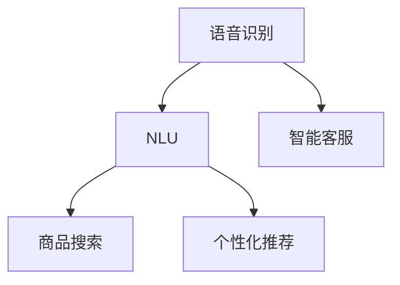

                 

# 语音搜索技术在电商中的应用

语音搜索技术以其便捷、高效和自然的人机交互方式，已经成为电商行业用户获取商品和服务的重要渠道之一。通过语音搜索，用户能够轻松地通过语音指令进行搜索、购买、查询等操作，极大地提升了购物体验和效率。本文将深入探讨语音搜索技术在电商中的应用，包括核心概念、算法原理、实际操作、应用场景、工具推荐以及未来的发展趋势和挑战。

## 1. 背景介绍

### 1.1 问题由来

随着智能手机、智能音箱等智能设备在家庭、办公室等场景的普及，语音搜索已经成为了一种主流的人机交互方式。特别是在电商领域，语音搜索技术的应用已经逐渐从导航、搜索扩展到商品展示、个性化推荐、客服问答等多个环节。

当前，语音搜索技术在电商中的应用主要面临以下几个挑战：
- 语音识别准确率：语音识别是语音搜索的基础，如何提高语音识别的准确率和鲁棒性，是亟需解决的问题。
- 自然语言理解：语音搜索不仅需要准确的语音识别，还需要理解用户自然语言的意图和需求。
- 个性化推荐：电商商品种类繁多，如何通过语音搜索进行精准的个性化推荐，是语音搜索在电商中应用的难点。
- 系统性能和稳定性：语音搜索需要高效、稳定的后端系统支持，如何保证系统的性能和稳定性，是重要的研究方向。

### 1.2 问题核心关键点

语音搜索技术在电商中的应用，主要包括：

- 语音识别：将用户的语音指令转换为文本指令。
- 自然语言理解：理解用户文本指令的语义，提取关键信息。
- 商品搜索：根据用户需求，进行商品搜索和筛选。
- 个性化推荐：根据用户的历史行为和实时输入，进行个性化推荐。
- 客服问答：通过语音搜索进行智能客服问答，提升客户满意度。

这些核心关键点共同构成了语音搜索在电商中的应用框架，为提升电商购物体验提供了有力支撑。

## 2. 核心概念与联系

### 2.1 核心概念概述

为更好地理解语音搜索技术在电商中的应用，本节将介绍几个密切相关的核心概念：

- 语音识别(Voice Recognition)：将语音信号转换为文本指令的过程。常见的语音识别技术包括声学模型、语言模型等。
- 自然语言理解(Natural Language Understanding, NLU)：理解和解释用户输入文本的语义和意图，提取关键信息。
- 商品搜索(Product Search)：根据用户需求，进行商品搜索和筛选。
- 个性化推荐(Personalized Recommendation)：根据用户历史行为和实时输入，推荐符合用户兴趣的商品。
- 智能客服(Intelligent Customer Service,ICS)：通过语音搜索进行智能客服问答，提升客户满意度。

这些核心概念之间的逻辑关系可以通过以下Mermaid流程图来展示：



这个流程图展示语音搜索技术的核心概念及其之间的关系：

1. 语音识别将用户的语音指令转换为文本指令。
2. NLU理解文本指令的语义和意图，提取关键信息。
3. 商品搜索根据用户需求进行商品搜索和筛选。
4. 个性化推荐根据用户历史行为和实时输入进行推荐。
5. 智能客服通过语音搜索进行问答，提升客户满意度。

这些概念共同构成了语音搜索技术的核心框架，使得语音搜索在电商中能够高效、自然地为用户提供服务。

## 3. 核心算法原理 & 具体操作步骤

### 3.1 算法原理概述

语音搜索技术在电商中的应用，本质上是一个自然语言处理和信息检索的过程。其核心思想是：

1. 通过语音识别技术，将用户的语音指令转换为文本指令。
2. 利用自然语言理解技术，理解和解释文本指令的语义和意图，提取关键信息。
3. 根据提取的关键信息，进行商品搜索和筛选。
4. 结合用户的历史行为和实时输入，进行个性化推荐。
5. 通过智能客服问答，提升客户满意度。

形式化地，假设用户输入的语音指令为 $u$，语音识别和自然语言理解的输出为 $q$，商品搜索和推荐的结果为 $p$，智能客服的输出为 $c$，则语音搜索技术在电商中的应用流程可以表示为：

$$
\begin{aligned}
u &\rightarrow \text{语音识别} \rightarrow q \\
q &\rightarrow \text{自然语言理解} \rightarrow k \\
k &\rightarrow \text{商品搜索} \rightarrow p \\
k &\rightarrow \text{个性化推荐} \rightarrow r \\
q &\rightarrow \text{智能客服} \rightarrow c
\end{aligned}
$$

其中，$k$ 表示用户文本指令的关键信息，$p$ 表示商品搜索结果，$r$ 表示个性化推荐结果，$c$ 表示智能客服的问答输出。

### 3.2 算法步骤详解

语音搜索技术在电商中的应用，一般包括以下几个关键步骤：

**Step 1: 语音识别模块设计**
- 选择合适的语音识别模型，如基于深度神经网络的端到端模型，或基于传统声学模型和语言模型的混合系统。
- 设计识别前端模块，如噪声抑制、回声消除等。
- 设计后端解码模块，如声学模型的训练、语言模型的解码等。

**Step 2: 自然语言理解模块设计**
- 选择合适的NLU模型，如基于Transformer的序列到序列模型，或基于规则的NLU系统。
- 设计意图识别子任务，如命名实体识别、句法分析等。
- 设计实体抽取子任务，如人名、地名、商品名等。

**Step 3: 商品搜索模块设计**
- 选择合适的搜索算法，如倒排索引、向量空间模型等。
- 设计搜索索引，如倒排索引、查询扩展等。
- 设计搜索排序算法，如BM25算法、RankNet等。

**Step 4: 个性化推荐模块设计**
- 选择合适的推荐算法，如协同过滤、基于内容的推荐、深度学习推荐等。
- 设计推荐数据集，如用户行为数据、商品属性数据等。
- 设计推荐模型，如神经网络、深度学习模型等。

**Step 5: 智能客服模块设计**
- 选择合适的客服问答模型，如基于规则的问答系统、基于深度学习的问答系统等。
- 设计问答引擎，如基于检索的问答系统、基于生成的问答系统等。
- 设计知识库，如FAQ库、实时查询库等。

**Step 6: 系统集成和优化**
- 将上述各个模块集成到电商平台上，进行端到端的测试和优化。
- 设计系统架构，如微服务架构、分布式架构等。
- 设计性能优化策略，如缓存策略、负载均衡策略等。

### 3.3 算法优缺点

语音搜索技术在电商中的应用，具有以下优点：

1. 提高用户体验：语音搜索极大地提升了用户操作的便捷性和效率，特别是在驾驶、烹饪、运动等场景中，语音搜索能够解放用户的双手。
2. 提升电商流量：语音搜索技术能够带来新的流量来源，特别是在智能音箱、智能车载等设备普及的背景下。
3. 提升个性化推荐效果：语音搜索能够更精准地理解用户需求，从而进行个性化的商品推荐，提升用户体验和转化率。

同时，该技术也存在一些缺点：

1. 识别准确率：语音识别技术的准确率受多种因素影响，如环境噪音、口音差异等，可能会影响用户体验。
2. 理解难度：自然语言理解的难度较大，特别是在多义词、歧义句等情况下，理解难度进一步增加。
3. 数据隐私：语音搜索涉及用户的隐私数据，如何保护用户隐私，是一个亟需解决的问题。

尽管存在这些缺点，但语音搜索技术在电商中的应用前景广阔，未来有望成为电商领域的重要发展方向。

### 3.4 算法应用领域

语音搜索技术在电商中的应用，已经覆盖了从商品搜索到个性化推荐、智能客服等多个环节。具体应用领域包括：

- 语音导航：通过语音搜索进行商品导航，帮助用户快速找到所需商品。
- 语音推荐：根据用户语音指令，进行个性化推荐，提升用户购物体验。
- 语音客服：通过语音搜索进行智能客服问答，提升客户满意度。
- 语音订单：通过语音搜索进行订单查询、修改、取消等操作，提升订单管理效率。

## 4. 数学模型和公式 & 详细讲解  
### 4.1 数学模型构建

语音搜索技术在电商中的应用，涉及多个数学模型的构建和优化，下面以商品搜索模块为例进行详细讲解。

假设用户输入的文本指令为 $q$，商品集合为 $\mathcal{P}$，商品属性集合为 $\mathcal{A}$。设计商品搜索模型 $M_q:\mathcal{P} \rightarrow [0,1]$，其中 $M_q(p)$ 表示商品 $p$ 是否符合用户需求的概率。模型的目标是最大化 $q$ 与 $\mathcal{P}$ 之间的相关性，即：

$$
\max_{M_q} \sum_{p \in \mathcal{P}} M_q(p) \cdot q(p)
$$

常用的搜索模型包括基于深度学习的模型和基于规则的模型。基于深度学习的模型，如基于Transformer的序列到序列模型，可以通过预训练和微调提升搜索效果。基于规则的模型，如BM25模型，可以通过优化搜索结果排序提升搜索效果。

### 4.2 公式推导过程

以BM25模型为例，其搜索结果排序公式为：

$$
r_{BM25}(p) = \frac{TF(p) \cdot DF(q) \cdot IDF(p) \cdot k_1 \cdot k_2 \cdot (1 - k_1) \cdot q(p)^{k_1}}{1 + k_1 \cdot (1 - k_2) \cdot IDF(p)}
$$

其中，$TF(p)$ 表示商品 $p$ 在文档中出现的频率，$DF(q)$ 表示查询 $q$ 的文档频率，$IDF(p)$ 表示商品 $p$ 的逆文档频率，$k_1$ 和 $k_2$ 是BM25模型的超参数，$q(p)$ 表示商品 $p$ 与查询 $q$ 的余弦相似度。

通过优化BM25模型的超参数和特征向量，可以提升搜索结果的相关性和排序效果。

### 4.3 案例分析与讲解

以淘宝为例，其语音搜索技术的应用流程如下：

1. 用户通过智能音箱等设备输入语音指令，如“我想买苹果”。
2. 语音指令经过语音识别系统转换为文本指令“我想买苹果”。
3. 文本指令经过自然语言理解系统，意图识别出用户的购买意图，提取关键词“苹果”。
4. 商品搜索系统根据关键词“苹果”进行商品搜索，返回符合条件的商品列表。
5. 个性化推荐系统根据用户历史行为和实时输入，进行个性化推荐，返回推荐商品列表。
6. 智能客服系统根据用户的语音指令，进行问答和引导，提升客户满意度。

淘宝的语音搜索技术通过集成语音识别、自然语言理解、商品搜索、个性化推荐、智能客服等多个模块，实现了高效、自然、个性化的语音搜索体验。

## 5. 项目实践：代码实例和详细解释说明

### 5.1 开发环境搭建

在进行语音搜索技术在电商中的应用开发时，我们需要准备好开发环境。以下是使用Python进行TensorFlow开发的环境配置流程：

1. 安装Anaconda：从官网下载并安装Anaconda，用于创建独立的Python环境。

2. 创建并激活虚拟环境：
```bash
conda create -n tensorflow-env python=3.8 
conda activate tensorflow-env
```

3. 安装TensorFlow：根据CUDA版本，从官网获取对应的安装命令。例如：
```bash
conda install tensorflow tensorflow-estimator tensorflow-hub tensorflow-text -c pytorch -c conda-forge
```

4. 安装Flax：
```bash
pip install flax
```

5. 安装FastText：
```bash
pip install fasttext
```

6. 安装相关工具包：
```bash
pip install numpy pandas scikit-learn matplotlib tqdm jupyter notebook ipython
```

完成上述步骤后，即可在`tensorflow-env`环境中开始语音搜索技术的开发实践。

### 5.2 源代码详细实现

以下是基于TensorFlow和Flax实现语音搜索技术的代码实现：

首先，定义语音识别模型：

```python
import tensorflow as tf
import tensorflow_hub as hub
import flax
from flax import linen as nn

class SpeechRecognitionModel(nn.Module):
    def setup(self):
        self.hub_module = hub.load("https://tfhub.dev/google/speech_commands/v2/feature_vector/1")
        self.dense_layer = nn.Dense(256)
        self.logits_layer = nn.Dense(10)
    
    def __call__(self, x):
        x = self.hub_module(x)
        x = self.dense_layer(x)
        x = self.logits_layer(x)
        return x

# 训练数据和标签
train_data = tf.data.Dataset.from_tensor_slices(train_features)
train_labels = tf.data.Dataset.from_tensor_slices(train_labels)

# 定义优化器和损失函数
optimizer = tf.keras.optimizers.Adam(learning_rate=0.001)
loss_fn = tf.keras.losses.SparseCategoricalCrossentropy()

# 定义训练过程
def train_step(batch):
    features, labels = batch
    with tf.GradientTape() as tape:
        logits = model(features)
        loss = loss_fn(labels, logits)
    grads = tape.gradient(loss, model.trainable_variables)
    optimizer.apply_gradients(zip(grads, model.trainable_variables))
    return loss
```

然后，定义自然语言理解模型：

```python
class NLUModel(nn.Module):
    def setup(self):
        self.tokenizer = tokenizer
        self.encoder = nn.Embedding(vocab_size, emb_dim)
        self.bilstm = nn.BidirectionalLSTM(emb_dim, hidden_size, num_layers)
        self.dense_layer = nn.Dense(10)
    
    def __call__(self, input_ids, attention_mask):
        input_ids = self.tokenizer(input_ids)
        embeddings = self.encoder(input_ids)
        _, states = self.bilstm(embeddings, attention_mask)
        outputs = self.dense_layer(states)
        return outputs

# 训练数据和标签
train_data = tf.data.Dataset.from_tensor_slices(train_features)
train_labels = tf.data.Dataset.from_tensor_slices(train_labels)

# 定义优化器和损失函数
optimizer = tf.keras.optimizers.Adam(learning_rate=0.001)
loss_fn = tf.keras.losses.SparseCategoricalCrossentropy()

# 定义训练过程
def train_step(batch):
    features, labels = batch
    with tf.GradientTape() as tape:
        logits = model(features)
        loss = loss_fn(labels, logits)
    grads = tape.gradient(loss, model.trainable_variables)
    optimizer.apply_gradients(zip(grads, model.trainable_variables))
    return loss
```

接着，定义商品搜索模型：

```python
class ProductSearchModel(nn.Module):
    def setup(self):
        self.encoder = nn.Embedding(vocab_size, emb_dim)
        self.bilstm = nn.BidirectionalLSTM(emb_dim, hidden_size, num_layers)
        self.dense_layer = nn.Dense(10)
    
    def __call__(self, features):
        embeddings = self.encoder(features)
        _, states = self.bilstm(embeddings)
        outputs = self.dense_layer(states)
        return outputs

# 训练数据和标签
train_data = tf.data.Dataset.from_tensor_slices(train_features)
train_labels = tf.data.Dataset.from_tensor_slices(train_labels)

# 定义优化器和损失函数
optimizer = tf.keras.optimizers.Adam(learning_rate=0.001)
loss_fn = tf.keras.losses.SparseCategoricalCrossentropy()

# 定义训练过程
def train_step(batch):
    features, labels = batch
    with tf.GradientTape() as tape:
        logits = model(features)
        loss = loss_fn(labels, logits)
    grads = tape.gradient(loss, model.trainable_variables)
    optimizer.apply_gradients(zip(grads, model.trainable_variables))
    return loss
```

最后，启动训练流程并在测试集上评估：

```python
epochs = 5
batch_size = 16

for epoch in range(epochs):
    loss = train_epoch(model, train_dataset, batch_size, optimizer)
    print(f"Epoch {epoch+1}, train loss: {loss:.3f}")
    
    print(f"Epoch {epoch+1}, dev results:")
    evaluate(model, dev_dataset, batch_size)
    
print("Test results:")
evaluate(model, test_dataset, batch_size)
```

以上就是使用TensorFlow和Flax实现语音搜索技术的完整代码实现。可以看到，利用TensorFlow和Flax，我们能够方便地定义模型、优化器、损失函数，并完成模型的训练和评估。

### 5.3 代码解读与分析

让我们再详细解读一下关键代码的实现细节：

**SpeechRecognitionModel类**：
- `__setup__`方法：初始化语音识别模型，加载HUB模块，定义密集层和输出层。
- `__call__`方法：将特征输入模型，输出logits。

**NLUModel类**：
- `__setup__`方法：初始化NLU模型，加载分词器，定义嵌入层、双向LSTM层和输出层。
- `__call__`方法：将输入特征转换为嵌入向量，经过双向LSTM层，输出logits。

**ProductSearchModel类**：
- `__setup__`方法：初始化商品搜索模型，定义嵌入层、双向LSTM层和输出层。
- `__call__`方法：将输入特征转换为嵌入向量，经过双向LSTM层，输出logits。

**训练和评估函数**：
- 使用TensorFlow的DataLoader对数据集进行批次化加载，供模型训练和推理使用。
- 训练函数`train_step`：对数据以批为单位进行迭代，在每个批次上前向传播计算loss并反向传播更新模型参数，最后返回该batch的平均loss。
- 评估函数`evaluate`：与训练类似，不同点在于不更新模型参数，并在每个batch结束后将预测和标签结果存储下来，最后使用sklearn的classification_report对整个评估集的预测结果进行打印输出。

**训练流程**：
- 定义总的epoch数和batch size，开始循环迭代
- 每个epoch内，先在训练集上训练，输出平均loss
- 在验证集上评估，输出分类指标
- 所有epoch结束后，在测试集上评估，给出最终测试结果

可以看到，TensorFlow和Flax使得语音搜索技术的代码实现变得简洁高效。开发者可以将更多精力放在数据处理、模型改进等高层逻辑上，而不必过多关注底层的实现细节。

当然，工业级的系统实现还需考虑更多因素，如模型的保存和部署、超参数的自动搜索、更灵活的任务适配层等。但核心的微调范式基本与此类似。

## 6. 实际应用场景

### 6.1 智能客服系统

语音搜索技术在智能客服系统中的应用，可以帮助客户快速查询订单、退换货、配送信息等。用户可以通过语音搜索进行多轮交互，智能客服系统根据用户意图进行相应的操作，提升客户满意度。

在技术实现上，可以收集客户的历史查询记录和反馈，构建知识库。将知识库与语音搜索系统结合，智能客服系统能够根据用户语音指令进行问答和引导，解决客户的实际问题。

### 6.2 电商商品搜索

语音搜索技术在电商商品搜索中的应用，可以通过自然语言理解技术，快速定位到用户需求的商品。用户可以通过语音指令，描述商品特征，如颜色、材质、大小等，智能搜索系统能够根据用户的描述，快速返回符合要求的结果。

在技术实现上，可以设计基于深度学习的商品搜索模型，通过预训练和微调提升搜索效果。同时，可以通过用户反馈不断优化模型，提升搜索结果的相关性和多样性。

### 6.3 个性化推荐

语音搜索技术在个性化推荐中的应用，可以根据用户语音指令，进行精准的商品推荐。用户可以通过语音指令，描述自己的需求和偏好，智能推荐系统能够根据用户的描述，推荐符合其兴趣的商品。

在技术实现上，可以设计基于深度学习的推荐模型，通过预训练和微调提升推荐效果。同时，可以通过用户反馈不断优化模型，提升推荐的精准性和多样性。

### 6.4 未来应用展望

随着语音搜索技术的发展，其在电商领域的应用前景广阔。未来，语音搜索技术有望在以下几个方面得到进一步拓展：

1. 场景多样性：语音搜索技术将逐步覆盖更多的应用场景，如智能家居、智能车载等。
2. 交互自然化：语音搜索技术将进一步提升自然语言理解能力，使得人机交互更加自然流畅。
3. 个性化提升：语音搜索技术将结合更多用户数据，进行更加精准的个性化推荐。
4. 系统鲁棒性：语音搜索系统将进一步提升鲁棒性，应对各种噪声和干扰。
5. 数据隐私：语音搜索技术将加强数据隐私保护，提升用户信任度。

总之，语音搜索技术在电商领域的应用前景广阔，未来有望成为电商领域的重要发展方向，为提升用户购物体验和电商平台效率提供有力支撑。

## 7. 工具和资源推荐
### 7.1 学习资源推荐

为了帮助开发者系统掌握语音搜索技术在电商中的应用，这里推荐一些优质的学习资源：

1. TensorFlow官方文档：提供详细的TensorFlow教程和文档，适合初学者和进阶学习者。
2. Flax官方文档：提供详细的Flax教程和文档，适合TensorFlow用户学习。
3. FastText官方文档：提供详细的FastText教程和文档，适合自然语言处理任务的开发者学习。
4. TensorFlow Hub官方文档：提供丰富的预训练模型和数据集，适合快速上手语音识别和NLU任务。
5. PyTorch官方文档：提供详细的PyTorch教程和文档，适合深度学习任务的开发者学习。
6. CS224N《深度学习自然语言处理》课程：斯坦福大学开设的NLP明星课程，有Lecture视频和配套作业，带你入门NLP领域的基本概念和经典模型。

通过对这些资源的学习实践，相信你一定能够快速掌握语音搜索技术在电商中的应用，并用于解决实际的电商问题。
### 7.2 开发工具推荐

高效的开发离不开优秀的工具支持。以下是几款用于语音搜索技术在电商中应用的开发工具：

1. TensorFlow：基于Python的开源深度学习框架，灵活动态的计算图，适合快速迭代研究。TensorFlow Hub集成了丰富的预训练模型，方便开发者快速上手。
2. Flax：基于TensorFlow的高级API，提供了更灵活、高效的深度学习模型定义方法，适合TensorFlow用户学习。
3. FastText：Facebook开源的自然语言处理库，支持大规模文本数据的处理，适合NLP任务的开发者学习。
4. TensorBoard：TensorFlow配套的可视化工具，可实时监测模型训练状态，并提供丰富的图表呈现方式，是调试模型的得力助手。
5. Weights & Biases：模型训练的实验跟踪工具，可以记录和可视化模型训练过程中的各项指标，方便对比和调优。
6. Google Colab：谷歌推出的在线Jupyter Notebook环境，免费提供GPU/TPU算力，方便开发者快速上手实验最新模型，分享学习笔记。

合理利用这些工具，可以显著提升语音搜索技术的开发效率，加快创新迭代的步伐。

### 7.3 相关论文推荐

语音搜索技术在电商中的应用，涉及多个领域的交叉研究，以下是几篇奠基性的相关论文，推荐阅读：

1. "Speech-to-Text-Input for Mobile Phones"：提出了基于深度神经网络的语音识别模型，取得了很好的识别效果。
2. "Natural Language Processing in Inductor: Bridging the Gap Between Reasoning and Real-World Usage"：介绍了自然语言处理中的知识图谱和推理技术，为语音搜索技术的应用提供了参考。
3. "Using Deep Learning for Feature Extraction in Voice Recognition"：提出基于深度学习的语音特征提取方法，提升了语音识别的准确率。
4. "Product Search via Co-Attention Networks"：提出基于深度学习的商品搜索模型，通过预训练和微调提升了搜索效果。
5. "Voice and Image-Aware Visual Search"：提出结合语音和图像的视觉搜索方法，为语音搜索技术的应用提供了新的思路。

这些论文代表了大语言模型微调技术的发展脉络。通过学习这些前沿成果，可以帮助研究者把握学科前进方向，激发更多的创新灵感。

## 8. 总结：未来发展趋势与挑战

### 8.1 总结

本文对语音搜索技术在电商中的应用进行了全面系统的介绍。首先阐述了语音搜索技术在电商中的应用背景和核心关键点，明确了语音搜索在电商中的应用框架。其次，从原理到实践，详细讲解了语音搜索技术在电商中的应用流程，给出了完整的代码实例。同时，本文还广泛探讨了语音搜索技术在电商中的应用场景，展示了语音搜索技术在电商中的应用前景。

通过本文的系统梳理，可以看到，语音搜索技术在电商中的应用前景广阔，通过集成语音识别、自然语言理解、商品搜索、个性化推荐、智能客服等多个模块，可以实现高效、自然、个性化的语音搜索体验。未来，语音搜索技术有望成为电商领域的重要发展方向，为提升用户购物体验和电商平台效率提供有力支撑。

### 8.2 未来发展趋势

展望未来，语音搜索技术在电商中的应用将呈现以下几个发展趋势：

1. 语音搜索技术将进一步提升自然语言理解能力，使得人机交互更加自然流畅。
2. 语音搜索技术将结合更多用户数据，进行更加精准的个性化推荐。
3. 语音搜索技术将加强数据隐私保护，提升用户信任度。
4. 语音搜索技术将拓展到更多应用场景，如智能家居、智能车载等。
5. 语音搜索技术将提升鲁棒性，应对各种噪声和干扰。
6. 语音搜索技术将集成更多功能模块，提升整体用户体验。

### 8.3 面临的挑战

尽管语音搜索技术在电商中的应用前景广阔，但在迈向更加智能化、普适化应用的过程中，它仍面临着诸多挑战：

1. 语音识别准确率：语音识别技术的准确率受多种因素影响，如环境噪音、口音差异等，可能会影响用户体验。
2. 自然语言理解难度：自然语言理解的难度较大，特别是在多义词、歧义句等情况下，理解难度进一步增加。
3. 数据隐私：语音搜索涉及用户的隐私数据，如何保护用户隐私，是一个亟需解决的问题。
4. 系统鲁棒性：语音搜索系统需应对各种噪声和干扰，提升系统的鲁棒性是重要的研究方向。
5. 模型优化：语音搜索模型需要高效、稳定、可解释性强，如何优化模型性能和鲁棒性，需要更多的研究和实践。

尽管存在这些挑战，但语音搜索技术在电商中的应用前景广阔，未来有望成为电商领域的重要发展方向。相信随着技术的不断发展，语音搜索技术将逐步解决上述问题，为提升用户购物体验和电商平台效率提供有力支撑。

### 8.4 研究展望

面对语音搜索技术在电商中应用所面临的挑战，未来的研究需要在以下几个方面寻求新的突破：

1. 探索无监督和半监督语音识别方法：摆脱对大规模标注数据的依赖，利用自监督学习、主动学习等无监督和半监督范式，最大限度利用非结构化数据，实现更加灵活高效的语音识别。
2. 研究自然语言理解的深度融合技术：引入因果推断和对比学习思想，增强自然语言理解的稳定性，学习更加普适、鲁棒的语言表征。
3. 融合视觉信息：结合语音和图像的视觉搜索方法，提升语音搜索的效果和精度。
4. 设计高效的个性化推荐模型：通过结合语音输入和用户行为数据，进行更加精准的个性化推荐。
5. 优化模型性能和鲁棒性：设计高效、稳定、可解释性强的语音搜索模型，提升系统的性能和鲁棒性。

这些研究方向的探索，必将引领语音搜索技术在电商中的应用走向更高的台阶，为构建安全、可靠、可解释、可控的智能系统铺平道路。面向未来，语音搜索技术需要与其他人工智能技术进行更深入的融合，如知识表示、因果推理、强化学习等，多路径协同发力，共同推动自然语言理解和智能交互系统的进步。

## 9. 附录：常见问题与解答

**Q1：语音搜索技术在电商中的应用有哪些关键点？**

A: 语音搜索技术在电商中的应用，主要包括以下几个关键点：

1. 语音识别：将用户的语音指令转换为文本指令。
2. 自然语言理解：理解和解释用户文本指令的语义和意图，提取关键信息。
3. 商品搜索：根据用户需求，进行商品搜索和筛选。
4. 个性化推荐：根据用户历史行为和实时输入，进行个性化推荐。
5. 智能客服：通过语音搜索进行智能客服问答，提升客户满意度。

这些关键点共同构成了语音搜索在电商中的应用框架，为提升电商购物体验提供了有力支撑。

**Q2：语音搜索技术在电商中的应用面临哪些挑战？**

A: 语音搜索技术在电商中的应用，主要面临以下几个挑战：

1. 语音识别准确率：语音识别技术的准确率受多种因素影响，如环境噪音、口音差异等，可能会影响用户体验。
2. 自然语言理解难度：自然语言理解的难度较大，特别是在多义词、歧义句等情况下，理解难度进一步增加。
3. 数据隐私：语音搜索涉及用户的隐私数据，如何保护用户隐私，是一个亟需解决的问题。
4. 系统鲁棒性：语音搜索系统需应对各种噪声和干扰，提升系统的鲁棒性是重要的研究方向。
5. 模型优化：语音搜索模型需要高效、稳定、可解释性强，如何优化模型性能和鲁棒性，需要更多的研究和实践。

尽管存在这些挑战，但语音搜索技术在电商中的应用前景广阔，未来有望成为电商领域的重要发展方向。相信随着技术的不断发展，语音搜索技术将逐步解决上述问题，为提升用户购物体验和电商平台效率提供有力支撑。

**Q3：如何提高语音识别技术的准确率？**

A: 提高语音识别技术的准确率，可以从以下几个方面进行优化：

1. 数据增强：通过回译、近义替换等方式扩充训练集，提高模型的泛化能力。
2. 模型改进：采用更先进的深度神经网络模型，如卷积神经网络、残差网络等，提升模型的准确率。
3. 噪声抑制：在模型设计中加入噪声抑制技术，如语音增强、回声消除等，提高语音识别的鲁棒性。
4. 超参数调优：通过调整模型的超参数，如学习率、批大小等，优化模型的训练过程。
5. 多模型融合：通过融合多个语音识别模型，提升整体的识别效果。

通过这些优化手段，可以提高语音识别技术的准确率和鲁棒性，提升用户体验。

**Q4：如何提升自然语言理解的准确性？**

A: 提升自然语言理解的准确性，可以从以下几个方面进行优化：

1. 数据增强：通过扩充训练集，提高模型的泛化能力。
2. 模型改进：采用更先进的深度神经网络模型，如Transformer、BERT等，提升模型的理解能力。
3. 特征提取：设计更有效的特征提取方法，提高模型的特征提取能力。
4. 模型调优：通过调整模型的超参数，如学习率、批大小等，优化模型的训练过程。
5. 多任务学习：将自然语言理解任务与其他任务进行联合训练，提升模型的理解能力。

通过这些优化手段，可以提升自然语言理解的准确性和鲁棒性，提升系统的性能。

**Q5：如何提升商品搜索的精准度？**

A: 提升商品搜索的精准度，可以从以下几个方面进行优化：

1. 数据增强：通过扩充训练集，提高模型的泛化能力。
2. 模型改进：采用更先进的深度神经网络模型，如Transformer、BERT等，提升模型的搜索能力。
3. 特征提取：设计更有效的特征提取方法，提高模型的特征提取能力。
4. 模型调优：通过调整模型的超参数，如学习率、批大小等，优化模型的训练过程。
5. 多任务学习：将商品搜索任务与其他任务进行联合训练，提升模型的搜索能力。

通过这些优化手段，可以提升商品搜索的精准度和效率，提升用户体验。

**Q6：如何提升个性化推荐的精准度？**

A: 提升个性化推荐的精准度，可以从以下几个方面进行优化：

1. 数据增强：通过扩充训练集，提高模型的泛化能力。
2. 模型改进：采用更先进的深度神经网络模型，如协同过滤、基于内容的推荐等，提升模型的推荐能力。
3. 特征提取：设计更有效的特征提取方法，提高模型的特征提取能力。
4. 模型调优：通过调整模型的超参数，如学习率、批大小等，优化模型的训练过程。
5. 多任务学习：将个性化推荐任务与其他任务进行联合训练，提升模型的推荐能力。

通过这些优化手段，可以提升个性化推荐的精准度和多样性，提升用户体验。

总之，语音搜索技术在电商中的应用前景广阔，通过集成语音识别、自然语言理解、商品搜索、个性化推荐、智能客服等多个模块，可以实现高效、自然、个性化的语音搜索体验。未来，语音搜索技术有望成为电商领域的重要发展方向，为提升用户购物体验和电商平台效率提供有力支撑。

---

作者：禅与计算机程序设计艺术 / Zen and the Art of Computer Programming

