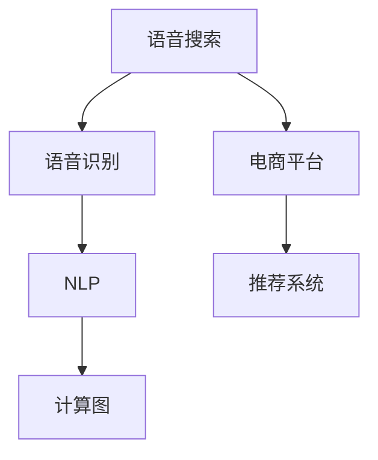

                 

# 语音搜索技术在电商领域的应用：挑战与机遇

> 关键词：语音搜索、电商平台、自然语言处理、计算图、语音识别、声音特征、电商推荐系统

## 1. 背景介绍

### 1.1 问题由来

随着科技的不断进步，语音搜索技术逐渐成为了一种流行和便捷的交互方式。消费者越来越倾向于使用语音助手来进行日常任务，如购物、查询、娱乐等。语音搜索技术不仅提高了用户体验的便利性，还能帮助商家在电商平台上更精准地获取用户需求，从而提高转化率和销售额。然而，语音搜索技术在电商领域的应用仍面临诸多挑战，包括数据处理、语音识别、语义理解等方面的技术瓶颈。

### 1.2 问题核心关键点

语音搜索技术在电商领域的应用需要解决以下关键问题：
- 如何高效处理海量音频数据，提取有用信息？
- 如何提升语音识别系统的准确率和鲁棒性？
- 如何实现自然语言处理(NLP)，理解用户语音指令？
- 如何设计高效电商推荐系统，提供个性化推荐？
- 如何处理多语言和方言，提升全球电商市场的竞争力？
- 如何确保数据隐私和安全，遵守相关法律法规？

这些核心问题构成了语音搜索技术在电商领域应用的主要挑战，同时也为相关研究提供了广阔的探索空间。

## 2. 核心概念与联系

### 2.1 核心概念概述

为更好地理解语音搜索技术在电商领域的应用，本节将介绍几个密切相关的核心概念：

- 语音搜索(Voice Search)：通过语音识别和自然语言处理技术，使语音输入成为获取信息的主要方式。
- 电商平台(E-commerce Platform)：提供线上购物、交易等功能的综合性平台。
- 自然语言处理(Natural Language Processing, NLP)：研究如何让计算机理解、处理和生成自然语言的技术。
- 计算图(Computational Graph)：一种用于表示计算流程和模型结构的数据结构，常见的有神经网络、图神经网络等。
- 语音识别(Speech Recognition)：将人类语音转换为文本的过程，是语音搜索的基础。
- 声音特征(Acoustic Feature)：语音信号中用于描述语音信息的特征，如MFCC、梅尔频率倒谱系数。
- 电商推荐系统(E-commerce Recommendation System)：基于用户行为、历史偏好等数据，推荐商品或服务的技术。

这些核心概念之间的逻辑关系可以通过以下Mermaid流程图来展示：



这个流程图展示了大语言模型的核心概念及其之间的关系：

1. 语音搜索将语音信号转换为文本。
2. 语音识别将语音转换为文字，输入到NLP系统中。
3. NLP系统处理文本信息，理解用户意图。
4. 计算图表示模型结构，构建NLP和推荐系统。
5. 电商平台与推荐系统结合，为用户提供个性化商品推荐。

这些概念共同构成了语音搜索技术在电商领域的应用框架，使其能够高效地获取用户需求，提升用户体验和电商平台的转化率。

## 3. 核心算法原理 & 具体操作步骤
### 3.1 算法原理概述

语音搜索技术在电商领域的应用核心在于语音识别和自然语言处理的结合。其核心思想是：通过语音识别将用户的语音指令转换为文本，然后利用自然语言处理技术理解用户的意图，最后将意图转化为电商推荐系统可执行的指令，从而实现个性化的商品推荐。

### 3.2 算法步骤详解

语音搜索技术在电商领域的应用一般包括以下几个关键步骤：

**Step 1: 语音信号预处理**
- 将用户语音信号进行预处理，如去除噪音、特征提取等。
- 常见特征提取方法包括Mel-frequency Cepstral Coefficients (MFCC)、LPC (Linear Predictive Coding)、Log Mel Spectrogram等。

**Step 2: 语音识别**
- 使用深度神经网络模型对预处理后的语音信号进行识别，将其转换为文本。
- 常用的语音识别模型包括RNN、CNN、Transformer等。

**Step 3: 自然语言处理**
- 对识别得到的文本进行分词、词性标注、命名实体识别等处理，构建文本语义表示。
- 常见的NLP技术包括Word2Vec、GloVe、BERT等。

**Step 4: 电商推荐系统**
- 根据NLP处理得到的语义表示，构建电商推荐模型，推荐商品或服务。
- 推荐模型包括协同过滤、基于内容的推荐、深度学习等。

**Step 5: 用户反馈收集**
- 收集用户对推荐结果的反馈，进一步优化推荐算法。
- 常见的反馈方式包括点击率、转化率、评价等。

### 3.3 算法优缺点

语音搜索技术在电商领域的应用有以下优点：
- 提升了用户体验。语音搜索相比传统的文本输入，更加直观、便捷，尤其是在驾驶、烹饪等不便进行文本输入的场景中，优势明显。
- 提高了电商平台的转化率。语音搜索能够更自然地获取用户需求，减少了搜索过程中的中间环节，从而提升了用户购物体验和转化率。
- 扩展了电商市场的用户群体。语音搜索技术让更多听力障碍者、老年人、非中文母语用户等得以使用电商平台，扩大了电商市场的潜在用户。
- 个性化推荐能力更强。语音搜索技术能够通过语音分析用户的说话习惯、口音、情绪等特征，进行更加精准和个性化的推荐。

同时，该方法也存在一定的局限性：
- 语音识别准确率有待提升。当前语音识别技术在嘈杂环境、口音较重等情况下的识别准确率仍有限，需要进一步优化。
- 数据隐私和安全问题。语音搜索技术需要处理大量的语音数据，如何确保数据隐私和安全，避免数据泄露和滥用，是一个重要的问题。
- 系统构建复杂度高。语音搜索技术涉及多个领域，从语音信号处理到推荐系统，构建完整的系统结构较为复杂，需要多学科知识的整合。
- 实时性要求高。语音搜索需要实时处理用户的语音输入，对系统响应速度和计算效率有较高要求。

尽管存在这些局限性，但语音搜索技术在电商领域的应用前景仍然广阔，未来相关研究的重点在于如何进一步提高语音识别的准确率，提升系统的实时性和鲁棒性，同时确保数据隐私和安全。

### 3.4 算法应用领域

语音搜索技术在电商领域的应用已经逐步渗透到各个环节，包括但不限于：

- 智能客服：利用语音搜索技术，用户可以通过语音助手与客服进行交流，快速获取商品信息和解决购物问题。
- 语音导航：用户可以通过语音搜索指定商品，系统根据语音指令自动导航至商品页面。
- 个性化推荐：基于用户的语音特点和偏好，语音搜索技术可以提供更加精准和个性化的商品推荐。
- 语音支付：语音搜索技术可以用于语音支付，提升支付的便捷性和安全性。
- 客服分析：电商平台可以通过语音搜索技术分析客服对话，了解用户需求和反馈，优化服务质量。

除了以上场景，语音搜索技术还在电商物流、仓储管理、市场调研等领域得到应用，为电商平台的运营提供了更高效、更便捷的服务方式。

## 4. 数学模型和公式 & 详细讲解 & 举例说明

### 4.1 数学模型构建

语音搜索技术在电商领域的应用涉及到语音识别、自然语言处理和推荐系统等多个环节。以下将分别构建这些部分的数学模型。

**语音识别模型**：
假设输入语音信号为 $x_t$，语音识别模型 $f_\theta$ 将 $x_t$ 转换为文本 $y_t$，模型参数为 $\theta$。模型可以表示为：

$$
y_t = f_\theta(x_t)
$$

**自然语言处理模型**：
假设输入文本为 $z_t$，自然语言处理模型 $g_\phi$ 将 $z_t$ 转换为语义表示 $u_t$，模型参数为 $\phi$。模型可以表示为：

$$
u_t = g_\phi(z_t)
$$

**推荐系统模型**：
假设输入语义表示为 $v_t$，推荐系统模型 $h_{\psi}$ 将 $v_t$ 转换为推荐结果 $w_t$，模型参数为 $\psi$。模型可以表示为：

$$
w_t = h_{\psi}(v_t)
$$

### 4.2 公式推导过程

**语音识别模型推导**：
假设语音信号 $x_t$ 由基音频率 $p_t$ 和共振峰频率 $q_t$ 决定，即 $x_t = \sin(p_t)\sin(q_t)$。对于MFCC特征提取，其计算公式为：

$$
mfcc_t = \log\left(\frac{1}{N} \sum_{n=1}^{N} \left| \frac{e^{-n\pi i t/N}}{e^{-p_t/n} + e^{-p_t/(n-1)}} \right|^2\right)
$$

**自然语言处理模型推导**：
假设输入文本 $z_t$ 由单词 $w_{t,1}, w_{t,2}, \ldots, w_{t,k}$ 组成，其中 $k$ 为词汇表大小。自然语言处理模型 $g_\phi$ 将文本 $z_t$ 转换为语义表示 $u_t$，公式如下：

$$
u_t = \sum_{i=1}^{k} w_{t,i} v_{t,i}
$$

其中 $v_{t,i}$ 为单词 $w_{t,i}$ 的向量表示。

**推荐系统模型推导**：
假设推荐系统模型 $h_{\psi}$ 为神经网络模型，其结构如图1所示：


推荐系统模型 $h_{\psi}$ 的输出为推荐结果 $w_t$，公式如下：

$$
w_t = h_{\psi}(v_t) = \sigma(\beta^T h_{\psi}^\top(v_t))
$$

其中 $\sigma$ 为激活函数，$\beta$ 为输出层权重矩阵。

### 4.3 案例分析与讲解

假设用户通过语音助手搜索商品“电子书阅读器”。语音助手首先进行语音信号预处理，提取MFCC特征，然后通过语音识别模型转换为文本“电子书阅读器”。接着，自然语言处理模型将文本转换为语义表示，识别出“电子书”和“阅读器”两个词汇。最后，推荐系统模型根据语义表示，结合用户历史行为和商品数据，推荐相关的电子书阅读器商品。

在这个过程中，语音搜索技术通过多个环节的协同工作，实现了从语音输入到个性化商品推荐的全流程自动化，提升了用户的购物体验和电商平台的转化率。

## 5. 项目实践：代码实例和详细解释说明

### 5.1 开发环境搭建

在进行语音搜索技术在电商领域应用的实践前，我们需要准备好开发环境。以下是使用Python进行TensorFlow开发的环境配置流程：

1. 安装Anaconda：从官网下载并安装Anaconda，用于创建独立的Python环境。

2. 创建并激活虚拟环境：
```bash
conda create -n voice_search_env python=3.8 
conda activate voice_search_env
```

3. 安装TensorFlow：根据CUDA版本，从官网获取对应的安装命令。例如：
```bash
conda install tensorflow -c tensorflow -c conda-forge
```

4. 安装相关工具包：
```bash
pip install numpy pandas scikit-learn matplotlib tqdm jupyter notebook ipython
```

完成上述步骤后，即可在`voice_search_env`环境中开始实践。

### 5.2 源代码详细实现

下面以“智能客服”为例，给出使用TensorFlow进行语音搜索技术在电商领域应用的完整代码实现。

首先，定义智能客服的类：

```python
import tensorflow as tf
from tensorflow.keras.layers import Input, Dense, LSTM, Dropout, Embedding

class CustomerService(tf.keras.Model):
    def __init__(self, input_dim, embedding_dim, lstm_units, output_dim):
        super(CustomerService, self).__init__()
        self.embedding = Embedding(input_dim, embedding_dim, input_length=max_len)
        self.lstm = LSTM(lstm_units)
        self.dropout = Dropout(0.2)
        self.dense = Dense(output_dim, activation='softmax')
        
    def call(self, x):
        x = self.embedding(x)
        x = self.lstm(x)
        x = self.dropout(x)
        x = self.dense(x)
        return x
```

然后，定义训练和评估函数：

```python
def train_model(model, train_dataset, epochs, batch_size):
    model.compile(optimizer='adam', loss='categorical_crossentropy', metrics=['accuracy'])
    model.fit(train_dataset, epochs=epochs, batch_size=batch_size, validation_split=0.2)
    
def evaluate_model(model, test_dataset, batch_size):
    test_loss, test_acc = model.evaluate(test_dataset, batch_size=batch_size)
    print(f'Test Loss: {test_loss:.4f}')
    print(f'Test Accuracy: {test_acc:.4f}')
```

最后，启动训练流程并在测试集上评估：

```python
max_len = 50
input_dim = 10000
embedding_dim = 64
lstm_units = 128
output_dim = 10
batch_size = 32
epochs = 10

# 构建模型
model = CustomerService(input_dim, embedding_dim, lstm_units, output_dim)

# 准备数据集
train_dataset = ...
test_dataset = ...

# 训练模型
train_model(model, train_dataset, epochs, batch_size)

# 评估模型
evaluate_model(model, test_dataset, batch_size)
```

以上就是使用TensorFlow进行智能客服语音搜索技术在电商领域应用的完整代码实现。可以看到，TensorFlow提供了丰富的神经网络层和优化器，使得模型构建和训练过程非常便捷。

### 5.3 代码解读与分析

让我们再详细解读一下关键代码的实现细节：

**CustomerService类**：
- `__init__`方法：初始化模型的各个组件，包括嵌入层、LSTM层、Dropout层和全连接层。
- `call`方法：实现模型的前向传播过程，将输入转换为模型输出。

**训练和评估函数**：
- 使用TensorFlow的编译方法对模型进行编译，指定优化器、损失函数和评估指标。
- 使用`fit`方法训练模型，指定训练集、训练轮数和批量大小。
- 使用`evaluate`方法评估模型，指定测试集和批量大小，输出测试损失和准确率。

**训练流程**：
- 定义最大长度`max_len`、输入维度`input_dim`、嵌入维度`embedding_dim`、LSTM单元数`lstm_units`、输出维度`output_dim`、批量大小`batch_size`和训练轮数`epochs`。
- 构建智能客服模型，调用`CustomerService`类。
- 准备训练集和测试集。
- 使用`train_model`函数训练模型。
- 使用`evaluate_model`函数评估模型。

通过以上代码，我们可以看到TensorFlow提供了非常灵活和高效的工具，使得语音搜索技术在电商领域的应用实现变得简单。开发者可以根据实际需求，通过调整模型结构和超参数，快速迭代优化。

## 6. 实际应用场景

### 6.1 智能客服系统

智能客服系统通过语音搜索技术，能够提供7x24小时不间断的服务，提升客户咨询体验和问题解决效率。在实践中，语音助手可以通过语音识别获取用户的意图和需求，快速调取后台知识库中的答案，提供准确的客户服务。用户可以自然流畅地与智能客服对话，解决各种常见问题，无需等待人工客服，大大提高了客户满意度。

### 6.2 语音导航系统

语音导航系统通过语音搜索技术，能够根据用户的语音指令，智能推荐商品，引导用户前往目标页面。例如，用户可以语音询问“手机怎么买”，系统会根据语音识别结果，推荐手机品牌、型号、颜色等信息，并提供相关商品的购买链接。用户可以轻松点击链接，完成购买流程，大大提升了购物的便捷性。

### 6.3 个性化推荐系统

个性化推荐系统通过语音搜索技术，能够根据用户的说话特点和偏好，提供更加精准和个性化的商品推荐。例如，用户可以语音询问“有什么好看的书”，系统会根据语音识别结果，分析用户的兴趣和偏好，推荐相关的图书信息。用户可以快速获取感兴趣的商品，提高购物体验。

### 6.4 未来应用展望

随着语音搜索技术在电商领域的应用不断深入，未来将会出现更多创新和突破，为电商平台的运营带来新的机遇：

1. 语音搜索技术将更广泛地应用于多场景。语音助手可以渗透到更多的生活场景中，如智能家居、智慧医疗、智能交通等，提升用户的生活质量和便利性。

2. 语音搜索技术将推动语音识别和自然语言处理技术的不断进步。未来的语音搜索技术将更加智能化、自然化，提升用户体验和语音识别的准确率。

3. 语音搜索技术将与人工智能技术进一步融合。未来的语音搜索技术将结合图像识别、情感分析等技术，实现更全面、智能的电商推荐系统。

4. 语音搜索技术将助力电商平台的全球化拓展。多语言、多方言的语音搜索技术，将有助于电商平台的全球市场拓展，提升国际竞争力。

## 7. 工具和资源推荐

### 7.1 学习资源推荐

为了帮助开发者系统掌握语音搜索技术在电商领域的应用，这里推荐一些优质的学习资源：

1. 《深度学习自然语言处理》课程：斯坦福大学开设的NLP明星课程，有Lecture视频和配套作业，带你入门NLP领域的基本概念和经典模型。

2. 《语音识别与深度学习》书籍：该书详细介绍了语音识别的原理和深度学习模型的应用，是语音搜索技术学习的重要参考书籍。

3. 《TensorFlow实战》书籍：该书介绍了TensorFlow框架的多种应用场景，包括语音搜索技术在电商领域的应用，是TensorFlow学习的好帮手。

4. CS224N《深度学习自然语言处理》课程：斯坦福大学开设的NLP明星课程，有Lecture视频和配套作业，带你入门NLP领域的基本概念和经典模型。

5. Google语音识别API：提供高质量的语音识别服务，支持多种语言和方言，是语音搜索技术的重要工具。

通过对这些资源的学习实践，相信你一定能够快速掌握语音搜索技术在电商领域的应用精髓，并用于解决实际的NLP问题。

### 7.2 开发工具推荐

高效的开发离不开优秀的工具支持。以下是几款用于语音搜索技术在电商领域应用的常用工具：

1. TensorFlow：基于Python的开源深度学习框架，灵活动态的计算图，适合快速迭代研究。大多数语音搜索模型都有TensorFlow版本的实现。

2. PyTorch：基于Python的开源深度学习框架，提供灵活的动态计算图和高效的GPU支持，是语音搜索技术开发的强大工具。

3. Kaldi：开源的语音识别系统，提供高质量的语音识别服务，支持多种语音识别模型和数据集。

4. Weights & Biases：模型训练的实验跟踪工具，可以记录和可视化模型训练过程中的各项指标，方便对比和调优。与主流深度学习框架无缝集成。

5. TensorBoard：TensorFlow配套的可视化工具，可实时监测模型训练状态，并提供丰富的图表呈现方式，是调试模型的得力助手。

6. Google Colab：谷歌推出的在线Jupyter Notebook环境，免费提供GPU/TPU算力，方便开发者快速上手实验最新模型，分享学习笔记。

合理利用这些工具，可以显著提升语音搜索技术在电商领域的应用开发效率，加快创新迭代的步伐。

### 7.3 相关论文推荐

语音搜索技术在电商领域的应用源于学界的持续研究。以下是几篇奠基性的相关论文，推荐阅读：

1. Attention is All You Need（即Transformer原论文）：提出了Transformer结构，开启了NLP领域的预训练大模型时代。

2. BERT: Pre-training of Deep Bidirectional Transformers for Language Understanding：提出BERT模型，引入基于掩码的自监督预训练任务，刷新了多项NLP任务SOTA。

3. Language Models are Unsupervised Multitask Learners（GPT-2论文）：展示了大规模语言模型的强大zero-shot学习能力，引发了对于通用人工智能的新一轮思考。

4. Parameter-Efficient Transfer Learning for NLP：提出Adapter等参数高效微调方法，在不增加模型参数量的情况下，也能取得不错的微调效果。

5. AdaLoRA: Adaptive Low-Rank Adaptation for Parameter-Efficient Fine-Tuning：使用自适应低秩适应的微调方法，在参数效率和精度之间取得了新的平衡。

这些论文代表了大语言模型微调技术的发展脉络。通过学习这些前沿成果，可以帮助研究者把握学科前进方向，激发更多的创新灵感。

## 8. 总结：未来发展趋势与挑战

### 8.1 总结

本文对语音搜索技术在电商领域的应用进行了全面系统的介绍。首先阐述了语音搜索技术在电商领域的应用背景和意义，明确了语音搜索在提升用户体验、提高电商转化率等方面的独特价值。其次，从原理到实践，详细讲解了语音搜索技术在电商领域应用的数学模型和关键步骤，给出了语音搜索技术在电商领域应用的完整代码实现。同时，本文还广泛探讨了语音搜索技术在智能客服、语音导航、个性化推荐等多个电商场景的应用前景，展示了语音搜索技术的巨大潜力。此外，本文精选了语音搜索技术的各类学习资源，力求为读者提供全方位的技术指引。

通过本文的系统梳理，可以看到，语音搜索技术在电商领域的应用已经逐步渗透到各个环节，提升了用户的购物体验和电商平台的运营效率。未来，随着语音搜索技术的不断进步，其在电商领域的应用将更加广泛和深入，为电商平台的创新和迭代带来新的契机。

### 8.2 未来发展趋势

展望未来，语音搜索技术在电商领域的应用将呈现以下几个发展趋势：

1. 语音搜索技术将更广泛地应用于多场景。语音助手可以渗透到更多的生活场景中，提升用户的生活质量和便利性。

2. 语音搜索技术将推动语音识别和自然语言处理技术的不断进步。未来的语音搜索技术将更加智能化、自然化，提升用户体验和语音识别的准确率。

3. 语音搜索技术将与人工智能技术进一步融合。未来的语音搜索技术将结合图像识别、情感分析等技术，实现更全面、智能的电商推荐系统。

4. 语音搜索技术将助力电商平台的全球化拓展。多语言、多方言的语音搜索技术，将有助于电商平台的全球市场拓展，提升国际竞争力。

以上趋势凸显了语音搜索技术在电商领域应用的前景广阔。这些方向的探索发展，必将进一步提升用户的购物体验和电商平台的运营效率。

### 8.3 面临的挑战

尽管语音搜索技术在电商领域的应用已经取得了显著进展，但在迈向更加智能化、普适化应用的过程中，它仍面临诸多挑战：

1. 数据处理瓶颈。语音搜索技术需要处理大量的语音数据，如何高效地进行数据处理和特征提取，是一个重要的问题。

2. 语音识别准确率有待提升。当前语音识别技术在嘈杂环境、口音较重等情况下的识别准确率仍有限，需要进一步优化。

3. 数据隐私和安全问题。语音搜索技术需要处理大量的语音数据，如何确保数据隐私和安全，避免数据泄露和滥用，是一个重要的问题。

4. 系统构建复杂度高。语音搜索技术涉及多个领域，从语音信号处理到推荐系统，构建完整的系统结构较为复杂，需要多学科知识的整合。

5. 实时性要求高。语音搜索技术需要实时处理用户的语音输入，对系统响应速度和计算效率有较高要求。

尽管存在这些挑战，但语音搜索技术在电商领域的应用前景仍然广阔，未来相关研究的重点在于如何进一步提高语音识别的准确率，提升系统的实时性和鲁棒性，同时确保数据隐私和安全。

### 8.4 研究展望

面对语音搜索技术在电商领域面临的种种挑战，未来的研究需要在以下几个方面寻求新的突破：

1. 探索无监督和半监督语音识别方法。摆脱对大规模标注数据的依赖，利用自监督学习、主动学习等无监督和半监督范式，最大限度利用非结构化数据，实现更加灵活高效的语音搜索。

2. 研究参数高效和计算高效的语音搜索范式。开发更加参数高效的语音搜索方法，在固定大部分预训练参数的同时，只更新极少量的任务相关参数。同时优化语音搜索模型的计算图，减少前向传播和反向传播的资源消耗，实现更加轻量级、实时性的部署。

3. 引入更多先验知识。将符号化的先验知识，如知识图谱、逻辑规则等，与神经网络模型进行巧妙融合，引导语音搜索过程学习更准确、合理的语音模型。同时加强不同模态数据的整合，实现视觉、语音等多模态信息与文本信息的协同建模。

4. 结合因果分析和博弈论工具。将因果分析方法引入语音搜索模型，识别出模型决策的关键特征，增强输出解释的因果性和逻辑性。借助博弈论工具刻画人机交互过程，主动探索并规避模型的脆弱点，提高系统稳定性。

5. 纳入伦理道德约束。在语音搜索模型训练目标中引入伦理导向的评估指标，过滤和惩罚有害的输出倾向。同时加强人工干预和审核，建立模型行为的监管机制，确保输出符合人类价值观和伦理道德。

这些研究方向的探索，必将引领语音搜索技术在电商领域的应用迈向更高的台阶，为构建安全、可靠、可解释、可控的智能系统铺平道路。面向未来，语音搜索技术还需要与其他人工智能技术进行更深入的融合，如知识表示、因果推理、强化学习等，多路径协同发力，共同推动语音搜索技术在电商领域的应用创新和发展。

## 9. 附录：常见问题与解答

**Q1：语音搜索技术在电商领域的应用有哪些优势？**

A: 语音搜索技术在电商领域的应用具有以下优势：
- 提升了用户体验。语音搜索相比传统的文本输入，更加直观、便捷，尤其是在驾驶、烹饪等不便进行文本输入的场景中，优势明显。
- 提高了电商平台的转化率。语音搜索能够更自然地获取用户需求，减少了搜索过程中的中间环节，从而提升了用户购物体验和转化率。
- 扩展了电商市场的用户群体。语音搜索技术让更多听力障碍者、老年人、非中文母语用户等得以使用电商平台，扩大了电商市场的潜在用户。
- 个性化推荐能力更强。语音搜索技术能够通过语音分析用户的说话习惯、口音、情绪等特征，进行更加精准和个性化的推荐。

**Q2：如何提高语音搜索系统的实时性和鲁棒性？**

A: 提高语音搜索系统的实时性和鲁棒性，可以从以下几个方面进行优化：
1. 使用高效的数据处理算法。例如，采用GPU加速数据处理，减少计算延迟。
2. 优化语音识别模型。引入注意力机制、Transformer等深度学习模型，提高语音识别的准确率和鲁棒性。
3. 采用分布式训练和推理。将模型训练和推理任务分布到多台机器上，提高系统的并发处理能力。
4. 引入噪声抑制和回声消除技术。对输入语音进行预处理，减少噪音和回声对语音识别的影响。

**Q3：如何确保语音搜索技术的隐私和安全？**

A: 确保语音搜索技术的隐私和安全，可以从以下几个方面进行考虑：
1. 采用数据加密技术。对用户语音数据进行加密存储和传输，防止数据泄露。
2. 设定访问权限。根据用户的身份和角色，设定不同的访问权限，防止数据滥用。
3. 匿名化处理。将用户语音数据进行匿名化处理，去除个人敏感信息。
4. 合规性审查。严格遵守相关法律法规，如GDPR、CCPA等，确保数据隐私和安全。

**Q4：语音搜索技术在电商领域的应用前景如何？**

A: 语音搜索技术在电商领域的应用前景广阔，主要体现在以下几个方面：
1. 提升用户体验。语音搜索技术能够提供更加自然、便捷的交互方式，提升用户的购物体验。
2. 提高电商平台的转化率。语音搜索技术能够快速响应用户需求，减少搜索过程中的中间环节，从而提升转化率。
3. 扩展电商市场的用户群体。语音搜索技术让更多听力障碍者、老年人、非中文母语用户等得以使用电商平台，扩大了电商市场的潜在用户。
4. 推动电商平台的全球化拓展。多语言、多方言的语音搜索技术，将有助于电商平台的全球市场拓展，提升国际竞争力。

**Q5：如何设计高效的电商推荐系统？**

A: 设计高效的电商推荐系统，可以从以下几个方面进行优化：
1. 引入多模态数据融合技术。将用户的语音、文本、图像等多模态数据进行融合，提高推荐系统的全面性和准确性。
2. 采用协同过滤和内容推荐算法。结合用户历史行为和商品属性，推荐相关商品。
3. 引入深度学习模型。例如，使用深度神经网络模型，根据用户语音特点和偏好，进行个性化推荐。
4. 结合强化学习算法。通过用户反馈数据，不断优化推荐算法，提高推荐效果。

通过以上回答，希望能帮助你对语音搜索技术在电商领域的应用有一个更全面、深入的理解。

---

作者：禅与计算机程序设计艺术 / Zen and the Art of Computer Programming

