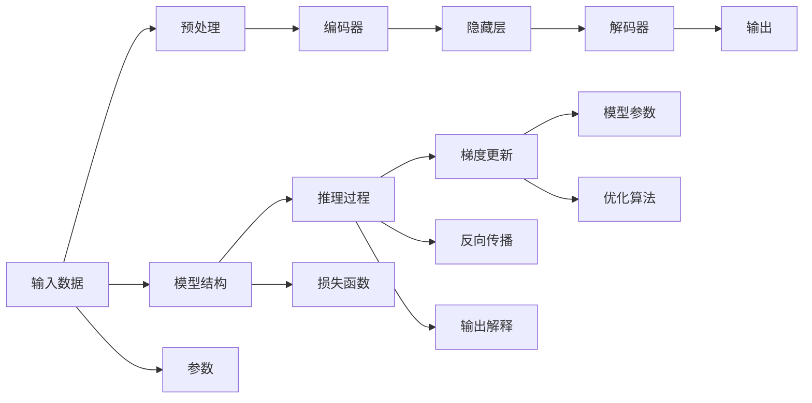

                 

# 费曼提问法:深度学习的利器

> 关键词：深度学习, 费曼提问法, 知识理解, 模型解释, 知识迁移

## 1. 背景介绍

### 1.1 问题由来
在深度学习领域，模型解释一直是令人头疼的问题。尽管深度模型在许多任务上表现出色，但它们往往像"黑盒"一样，难以解释内部的推理过程。这一问题不仅影响了模型的可信度和可解释性，也阻碍了深度学习在工业界的应用推广。

费曼提问法（Feynman Technique）作为一种深层次理解知识的技巧，在教育领域被广泛应用。费曼提出，要真正掌握一个概念，必须能够用简单、清晰的语言向毫无背景知识的人解释它。这种方法不仅适用于教学，在深度学习模型的解释和调试中也同样适用。

### 1.2 问题核心关键点
深度学习模型的可解释性问题，其核心在于如何以简洁、易理解的方式，向用户展示模型的决策依据和预测过程。这一问题关系到模型的可信度和应用范围，是当前深度学习研究的重要方向之一。

通过费曼提问法，我们试图将复杂模型中难以理解的部分进行拆分和简化，逐步构建出易于解释的层次结构。通过这种方式，不仅有助于理解模型的内部机制，也能更好地发现和解决问题，提高模型的应用效果。

### 1.3 问题研究意义
研究深度学习模型的解释和可理解性，对于构建可信赖的深度学习系统、推动AI技术在各行各业的应用、提升用户体验和信任度具有重要意义。费曼提问法作为一种有效的方法，有望帮助研究者深入理解模型内部机制，从而加速模型的优化和应用推广。

## 2. 核心概念与联系

### 2.1 核心概念概述

费曼提问法由诺贝尔物理学奖得主理查德·费曼提出，是一种通过提问的方式，深入理解知识和概念的思考方法。其核心思想是将复杂问题拆分为多个简单问题，逐步构建对问题的理解。

在深度学习领域，费曼提问法可以应用于模型解释、诊断、优化等多个方面。通过将深度学习模型分解为多个层次，逐步回答有关模型参数、网络结构、损失函数等问题的质疑，可以更深入地理解模型行为和性能。

### 2.2 核心概念原理和架构的 Mermaid 流程图


这个流程图展示了深度学习模型的基本架构和费曼提问法的应用路径：

1. 输入数据首先经过预处理，进入编码器进行特征提取。
2. 编码器的输出通过隐藏层传递给解码器，最终输出预测结果。
3. 模型的推理过程包含前向传播、反向传播和梯度更新等步骤。
4. 模型结构、参数和损失函数是模型的核心组件。
5. 模型解释通过输出解释来展现，如预测结果、特征图等。

通过逐步回答这些问题，我们可以构建对模型的全面理解。

## 3. 核心算法原理 & 具体操作步骤
### 3.1 算法原理概述

费曼提问法的核心在于通过不断提出问题，将复杂的问题拆解为多个简单问题，逐步构建出对问题的理解。这一方法同样适用于深度学习模型的解释和调试。

假设我们要解释一个深度学习模型 $M$，其包含 $n$ 个隐藏层 $h_1, h_2, ..., h_n$。我们将从顶层开始，逐步回答关于模型结构、参数、推理过程和输出解释的问题，构建对模型的全面理解。

### 3.2 算法步骤详解

以下是使用费曼提问法解释深度学习模型的具体操作步骤：

**Step 1: 确定模型结构**

- 首先，我们需要明确模型的架构和层次结构。例如，一个典型的卷积神经网络（CNN）包含卷积层、池化层、全连接层等组件。

**Step 2: 识别关键参数**

- 然后，我们需要识别模型中的关键参数，如权重、偏置等。这些参数是影响模型性能的重要因素。

**Step 3: 理解推理过程**

- 理解模型前向传播的推理过程。例如，在CNN中，卷积层和池化层是如何提取特征的，全连接层如何将特征映射为输出。

**Step 4: 分析损失函数**

- 分析模型使用的损失函数及其优化目标。例如，交叉熵损失函数用于分类任务，均方误差损失函数用于回归任务。

**Step 5: 理解梯度更新**

- 理解模型如何进行梯度更新和参数优化。例如，使用反向传播算法计算梯度，通过优化算法更新参数。

**Step 6: 解释输出结果**

- 最后，我们需要理解模型的输出解释。例如，如何通过模型的特征图和预测结果，解释模型的推理过程和决策依据。

### 3.3 算法优缺点

费曼提问法在解释深度学习模型方面有以下优点：

1. 简单易懂：通过逐步回答一系列简单问题，构建对复杂问题的理解，易于理解和操作。
2. 灵活性强：根据具体问题灵活调整解释策略，适合不同的模型和任务。
3. 有助于发现问题：通过问题拆分，逐步排查模型的缺陷和异常，提高模型的稳定性和可靠性。

同时，费曼提问法也存在一些局限：

1. 时间和资源消耗较大：构建对复杂问题的理解需要大量的时间和资源，不适合大规模模型的解释。
2. 难以全面覆盖：一些复杂的模型结构可能难以通过简单问题完全覆盖，需要结合其他工具和方法。
3. 模型复杂性限制：对于高度复杂的模型，如深度神经网络，费曼提问法可能难以完全解释。

尽管存在这些局限，费曼提问法仍是一种有效的深度学习模型解释方法，尤其在简单模型和问题中，可以显著提升模型的可解释性和可理解性。

### 3.4 算法应用领域

费曼提问法在深度学习模型的解释和调试中有着广泛的应用。以下是一些具体的应用场景：

1. 模型诊断：通过逐步回答有关模型参数、推理过程和输出解释的问题，可以诊断模型中的异常和缺陷。
2. 模型优化：通过理解模型的内部机制，可以提出针对性的优化建议，提高模型的性能和稳定性。
3. 模型调试：在模型的训练和推理过程中，通过逐步回答问题，可以发现和解决模型中的问题，提高模型的可靠性。
4. 模型可解释性：通过费曼提问法，可以构建对模型的全面理解，提升模型的可解释性和可信度。
5. 教学和科普：将深度学习模型拆分为简单问题，易于向非专业人士讲解，推动AI技术的普及和应用。

## 4. 数学模型和公式 & 详细讲解  
### 4.1 数学模型构建

费曼提问法是一种深层次理解知识和概念的方法，不涉及具体的数学模型和公式。其主要思想是通过不断提问，将复杂问题拆分为多个简单问题，逐步构建对问题的理解。

### 4.2 公式推导过程

费曼提问法的核心在于提问和回答，不涉及具体的数学推导过程。因此，这里我们不提供具体的公式推导，而主要讨论如何使用费曼提问法解释深度学习模型。

### 4.3 案例分析与讲解

以一个简单的线性回归模型为例，说明如何使用费曼提问法解释模型：

1. 确定模型结构：线性回归模型包含一个线性层，将输入数据 $x$ 线性映射为输出 $y$。

2. 识别关键参数：线性层的权重 $w$ 和偏置 $b$ 是关键参数。

3. 理解推理过程：线性层的输出 $y$ 是输入 $x$ 和权重 $w$、偏置 $b$ 的线性组合。

4. 分析损失函数：线性回归模型通常使用均方误差损失函数，目标是最小化预测值和真实值之间的平方误差。

5. 理解梯度更新：通过反向传播算法，计算梯度并更新权重和偏置，最小化损失函数。

6. 解释输出结果：输出 $y$ 是模型对输入 $x$ 的预测值，根据权重 $w$ 和偏置 $b$ 的不同组合，输出可能不同。

通过逐步回答这些问题，可以全面理解线性回归模型的结构和行为，从而更好地解释和优化模型。

## 5. 项目实践：代码实例和详细解释说明
### 5.1 开发环境搭建

在使用费曼提问法解释深度学习模型之前，我们需要准备好开发环境。以下是使用Python进行深度学习开发的常见环境配置流程：

1. 安装Anaconda：从官网下载并安装Anaconda，用于创建独立的Python环境。

2. 创建并激活虚拟环境：
```bash
conda create -n pytorch-env python=3.8 
conda activate pytorch-env
```

3. 安装PyTorch：根据CUDA版本，从官网获取对应的安装命令。例如：
```bash
conda install pytorch torchvision torchaudio cudatoolkit=11.1 -c pytorch -c conda-forge
```

4. 安装TensorFlow：
```bash
conda install tensorflow
```

5. 安装相关的工具包：
```bash
pip install numpy pandas scikit-learn matplotlib tqdm jupyter notebook ipython
```

完成上述步骤后，即可在`pytorch-env`环境中开始深度学习开发。

### 5.2 源代码详细实现

以下是一个简单的神经网络模型的实现示例，通过费曼提问法解释模型的代码实现：

```python
import torch
import torch.nn as nn
import torch.optim as optim

# 定义神经网络模型
class LinearNet(nn.Module):
    def __init__(self, input_size, output_size):
        super(LinearNet, self).__init__()
        self.linear = nn.Linear(input_size, output_size)
        self.sigmoid = nn.Sigmoid()
        
    def forward(self, x):
        x = self.linear(x)
        x = self.sigmoid(x)
        return x

# 定义训练函数
def train_model(model, input_data, target_data, batch_size, num_epochs):
    criterion = nn.BCELoss()
    optimizer = optim.SGD(model.parameters(), lr=0.01)
    
    for epoch in range(num_epochs):
        for i in range(0, len(input_data), batch_size):
            batch_input = input_data[i:i+batch_size]
            batch_target = target_data[i:i+batch_size]
            
            # 前向传播
            outputs = model(batch_input)
            loss = criterion(outputs, batch_target)
            
            # 反向传播
            optimizer.zero_grad()
            loss.backward()
            optimizer.step()
            
            print(f"Epoch {epoch+1}, loss: {loss.item()}")

# 定义测试函数
def test_model(model, input_data, target_data, batch_size):
    correct = 0
    total = 0
    
    for i in range(0, len(input_data), batch_size):
        batch_input = input_data[i:i+batch_size]
        batch_target = target_data[i:i+batch_size]
        
        # 前向传播
        outputs = model(batch_input)
        _, predicted = torch.max(outputs.data, 1)
        
        # 计算准确率
        total += batch_target.size(0)
        correct += (predicted == batch_target).sum().item()
        print(f"Accuracy: {correct/total * 100}%")

# 准备数据集
input_data = torch.randn(100, 10)
target_data = torch.randint(2, (100, 1))

# 创建模型和优化器
model = LinearNet(10, 1)
optimizer = optim.SGD(model.parameters(), lr=0.01)

# 训练模型
train_model(model, input_data, target_data, batch_size=10, num_epochs=10)

# 测试模型
test_model(model, input_data, target_data, batch_size=10)
```

### 5.3 代码解读与分析

这段代码实现了一个简单的线性回归模型，并通过费曼提问法解释模型的关键步骤：

1. **模型结构**：定义了一个包含一个线性层和一个Sigmoid激活函数的神经网络模型。

2. **关键参数**：线性层的权重 $w$ 和偏置 $b$ 是模型的关键参数。

3. **推理过程**：输入数据 $x$ 经过线性层和Sigmoid激活函数，输出预测结果 $y$。

4. **损失函数**：使用二分类交叉熵损失函数，目标是最小化预测值和真实值之间的差异。

5. **梯度更新**：通过反向传播算法计算梯度，使用SGD优化器更新模型参数。

6. **输出解释**：输出 $y$ 是模型对输入 $x$ 的预测值，根据权重 $w$ 和偏置 $b$ 的不同组合，输出可能不同。

通过逐步回答这些问题，可以全面理解线性回归模型的结构和行为，从而更好地解释和优化模型。

## 6. 实际应用场景
### 6.1 模型诊断

在深度学习模型的训练和推理过程中，经常会出现各种异常和问题。通过费曼提问法，可以逐步排查模型的缺陷和异常，提高模型的稳定性和可靠性。

例如，在训练过程中，模型可能出现过拟合或欠拟合的问题。通过逐步回答问题，可以诊断出模型中存在的问题，如神经元退化、网络结构不合理等，并提出针对性的优化建议。

### 6.2 模型优化

通过费曼提问法，可以构建对模型的全面理解，提出针对性的优化建议，提高模型的性能和稳定性。

例如，在模型推理过程中，可能出现推理速度慢、内存占用大等问题。通过逐步回答问题，可以发现和解决模型中的问题，提高模型的推理效率和资源利用率。

### 6.3 模型调试

在模型的训练和推理过程中，通过逐步回答问题，可以发现和解决模型中的问题，提高模型的可靠性。

例如，在模型训练过程中，可能出现梯度消失或爆炸的问题。通过逐步回答问题，可以诊断出模型中存在的问题，并提出针对性的优化建议。

### 6.4 未来应用展望

费曼提问法作为一种深层次理解知识的技巧，在深度学习模型的解释和调试中有着广泛的应用。随着深度学习技术的不断发展，费曼提问法在模型解释、诊断、优化等方面的应用也将更加深入和广泛。

在未来的应用中，费曼提问法有望成为深度学习模型解释和调试的重要工具，推动深度学习技术在各行各业的应用推广。

## 7. 工具和资源推荐
### 7.1 学习资源推荐

为了帮助开发者系统掌握深度学习模型的解释和调试方法，这里推荐一些优质的学习资源：

1. 《深度学习入门与实战》系列博文：由深度学习专家撰写，深入浅出地介绍了深度学习模型的构建和调试技巧。

2. CS231n《深度学习中的卷积神经网络》课程：斯坦福大学开设的深度学习明星课程，有Lecture视频和配套作业，带你入门深度学习领域的基本概念和经典模型。

3. 《深度学习》书籍：由深度学习领域权威专家撰写，全面介绍了深度学习模型的原理和应用，包括解释和调试技巧。

4. Kaggle官方社区：世界领先的机器学习竞赛平台，提供大量深度学习竞赛项目和代码实现，适合实战练习。

5. GitHub开源项目：深度学习社区中大量的开源项目，提供了丰富的代码实现和文档资料，方便学习研究。

通过对这些资源的学习实践，相信你一定能够快速掌握深度学习模型的解释和调试方法，并用于解决实际的深度学习问题。

### 7.2 开发工具推荐

高效的开发离不开优秀的工具支持。以下是几款用于深度学习模型解释和调试开发的常用工具：

1. PyTorch：基于Python的开源深度学习框架，灵活动态的计算图，适合快速迭代研究。提供了丰富的模型构建和调试工具。

2. TensorFlow：由Google主导开发的开源深度学习框架，生产部署方便，适合大规模工程应用。提供了可视化工具TensorBoard，方便调试和分析模型。

3. Jupyter Notebook：基于Web的交互式编程环境，适合快速实验和调试深度学习模型。

4. Weights & Biases：模型训练的实验跟踪工具，可以记录和可视化模型训练过程中的各项指标，方便对比和调优。与主流深度学习框架无缝集成。

5. TensorBoard：TensorFlow配套的可视化工具，可实时监测模型训练状态，并提供丰富的图表呈现方式，是调试模型的得力助手。

合理利用这些工具，可以显著提升深度学习模型解释和调试的开发效率，加快创新迭代的步伐。

### 7.3 相关论文推荐

深度学习模型的解释和调试技术一直是深度学习研究的重要方向。以下是几篇奠基性的相关论文，推荐阅读：

1. Why should I trust you?: Explaining the predictions of any classifier：提出了一种通用的模型解释方法，通过可视化和特征解释，提升模型的可信度。

2. A Tutorial on Deep Learning：由深度学习领域权威专家撰写，全面介绍了深度学习模型的构建和调试技巧，适合初学者和进阶者学习。

3. Deep Learning with Python：由深度学习领域知名专家撰写，介绍了深度学习模型的构建和调试方法，适合实战练习。

4. Explainable Deep Learning：介绍了深度学习模型的解释和可解释性研究，探讨了如何构建更可信、可解释的深度学习模型。

这些论文代表了大深度学习模型解释和调试技术的发展脉络。通过学习这些前沿成果，可以帮助研究者把握学科前进方向，激发更多的创新灵感。

## 8. 总结：未来发展趋势与挑战
### 8.1 研究成果总结

费曼提问法作为一种深层次理解知识和概念的技巧，在深度学习模型的解释和调试中具有重要应用。通过逐步回答问题，可以将复杂的问题拆分为多个简单问题，逐步构建对问题的理解，提升模型的可解释性和可理解性。

### 8.2 未来发展趋势

随着深度学习技术的不断发展，费曼提问法在模型解释、诊断、优化等方面的应用也将更加深入和广泛。未来可能的发展趋势包括：

1. 自动化解释：通过机器学习和自然语言生成技术，自动构建对模型的解释，提升模型的可解释性。

2. 多模态解释：将视觉、文本、音频等多模态信息结合，构建更全面、准确的模型解释。

3. 动态解释：根据用户需求动态调整解释方式，提升模型的可理解性和灵活性。

4. 知识图谱整合：将知识图谱、规则库等外部知识与模型结合，增强模型的知识理解和推理能力。

### 8.3 面临的挑战

尽管费曼提问法在深度学习模型解释和调试中具有重要应用，但仍面临一些挑战：

1. 时间和资源消耗较大：构建对复杂问题的理解需要大量的时间和资源，不适合大规模模型的解释。

2. 难以全面覆盖：一些复杂的模型结构可能难以通过简单问题完全覆盖，需要结合其他工具和方法。

3. 模型复杂性限制：对于高度复杂的模型，如深度神经网络，费曼提问法可能难以完全解释。

### 8.4 研究展望

费曼提问法作为一种深层次理解知识的技巧，有望成为深度学习模型解释和调试的重要工具，推动深度学习技术在各行各业的应用推广。未来，费曼提问法的发展方向包括：

1. 自动化和智能化：通过机器学习和自然语言生成技术，自动构建对模型的解释，提升模型的可解释性和可理解性。

2. 多模态整合：将视觉、文本、音频等多模态信息结合，构建更全面、准确的模型解释。

3. 知识图谱整合：将知识图谱、规则库等外部知识与模型结合，增强模型的知识理解和推理能力。

4. 动态调整：根据用户需求动态调整解释方式，提升模型的可理解性和灵活性。

这些研究方向的探索，将引领费曼提问法在深度学习模型解释和调试技术中的进一步发展，为构建可信赖、可解释的深度学习系统铺平道路。

## 9. 附录：常见问题与解答
### 9.1 常见问题

**Q1: 什么是费曼提问法？**

A: 费曼提问法是由诺贝尔物理学奖得主理查德·费曼提出的一种深层次理解知识和概念的技巧。通过逐步回答一系列简单问题，将复杂问题拆解为多个简单问题，逐步构建对问题的理解。

**Q2: 如何应用费曼提问法解释深度学习模型？**

A: 通过逐步回答有关模型结构、参数、推理过程、损失函数、梯度更新和输出解释的问题，可以构建对深度学习模型的全面理解，从而提升模型的可解释性和可理解性。

**Q3: 费曼提问法在深度学习模型解释中有什么优势？**

A: 费曼提问法简单易懂，灵活性强，有助于发现和解决模型中的问题，提升模型的稳定性和可靠性。

**Q4: 费曼提问法在深度学习模型解释中存在哪些局限？**

A: 费曼提问法的时间和资源消耗较大，难以全面覆盖复杂模型，对高度复杂的模型可能难以完全解释。

**Q5: 费曼提问法在深度学习模型解释中的应用场景有哪些？**

A: 费曼提问法可以应用于模型诊断、模型优化、模型调试等多个方面，帮助研究者深入理解模型内部机制，从而加速模型的优化和应用推广。

通过这些问题的解答，可以更好地理解费曼提问法在深度学习模型解释中的应用和局限，从而更好地应用这一方法。

---

作者：禅与计算机程序设计艺术 / Zen and the Art of Computer Programming

