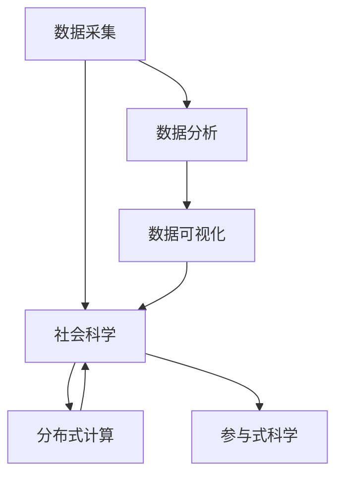

                 

# 赋能个人与社区：人类计算的社会价值

> 关键词：人类计算,社区赋能,分布式计算,计算社会科学,参与式科学

## 1. 背景介绍

### 1.1 问题由来
随着信息技术的飞速发展，人类社会逐步进入数字时代，大数据、云计算、人工智能等技术的应用日益深入。然而，这些技术的快速发展也带来了一系列新的社会问题。如何利用计算技术，更好地赋能个人与社区，促进社会的可持续健康发展，成为当前研究的热点问题。

近年来，计算社会科学（Computational Social Science）和参与式科学（Participatory Science）等新兴学科的发展，使得计算技术与社会科学的交叉融合成为可能。这些研究领域强调通过计算技术收集、分析和解释社会现象，推动社会科学研究的科学化和精确化。同时，计算技术的普及也使得普通用户能够更加便捷地参与科学研究，形成“人人参与”的社会科学研究新范式。

本文章旨在探讨计算技术在个人与社区赋能中的应用，并分析人类计算的社会价值，为社会可持续发展提供新的思考和建议。

### 1.2 问题核心关键点
要理解人类计算的社会价值，首先需要了解以下几个关键点：

- **人类计算**：利用计算技术处理人类活动数据的科学方法。包括数据采集、数据分析、可视化和解释等步骤，旨在通过数据驱动的方法揭示社会现象的规律。
- **社区赋能**：通过计算技术提升社区成员的自主能力，促进社区共同体的健康发展。
- **分布式计算**：将计算任务分布在多台计算机上进行协同计算，提升计算效率和资源利用率。
- **计算社会科学**：融合计算技术和社会科学理论，通过数据驱动的方法进行社会科学研究。
- **参与式科学**：鼓励普通用户参与科学研究，通过数据共享和协作形成新的科学研究范式。

这些关键点构成了人类计算的社会价值研究的基石，为理解和应用人类计算提供了理论基础。

## 2. 核心概念与联系

### 2.1 核心概念概述

为了更好地理解人类计算的社会价值，本节将介绍几个核心概念及其相互关系：

- **数据采集**：通过传感器、调查问卷、社交媒体等渠道，收集与人类活动相关的数据。
- **数据分析**：利用计算技术对收集到的数据进行处理和分析，揭示社会现象的规律。
- **数据可视化**：将数据分析结果以图表、地图等形式呈现，便于理解和社会传播。
- **社会科学**：研究人类社会、文化、行为等现象的科学。
- **分布式计算**：将计算任务分配到多台计算机上进行处理，提升计算效率和资源利用率。
- **参与式科学**：鼓励用户参与数据收集和分析，推动开放、透明和协作的科学研究。

这些概念之间相互联系，共同构成了人类计算的社会价值研究框架。下面通过Mermaid流程图展示这些概念之间的关系：



这个流程图展示了数据采集、数据分析、数据可视化、社会科学、分布式计算和参与式科学之间的联系和作用：

1. 数据采集为数据分析和可视化提供基础数据。
2. 数据分析和可视化结果反过来又服务于社会科学研究。
3. 分布式计算提高了数据分析和可视化的效率。
4. 参与式科学增加了数据的来源和多样性，促进了社会科学研究的深度和广度。

### 2.2 核心概念原理和架构

#### 2.2.1 数据采集原理

数据采集是社会科学研究的第一步，通常包括以下几种方式：

- **传感器**：如GPS、温度计、摄像头等，用于收集物理环境和社会活动的数据。
- **调查问卷**：通过在线问卷或纸质问卷，收集用户的个人信息和社会行为数据。
- **社交媒体**：如Twitter、Facebook、微信等，通过API接口或爬虫工具，收集用户发布的内容和互动信息。
- **物联网**：将传感器与网络设备结合，实时监测和记录社会活动。

数据采集技术的发展，使得数据来源更加多样化和精细化，为社会科学研究提供了丰富的数据资源。

#### 2.2.2 数据分析原理

数据分析是利用计算技术对采集到的数据进行处理和分析，揭示社会现象的规律。常用的分析方法包括：

- **统计分析**：如回归分析、聚类分析、主成分分析等，用于发现数据中的模式和关联。
- **机器学习**：如分类、回归、聚类等算法，用于预测和分类社会现象。
- **深度学习**：如卷积神经网络、循环神经网络等，用于处理复杂和非结构化数据。

数据分析的目的是提取数据中的有用信息，为社会科学研究提供可靠的依据。

#### 2.2.3 数据可视化原理

数据可视化是将数据分析结果以图表、地图等形式呈现，便于理解和社会传播。常用的可视化工具包括：

- **Tableau**：适用于各种类型的数据，支持交互式数据探索。
- **D3.js**：用于创建复杂和动态的交互式图表和地图。
- **Plotly**：支持Python和R语言，提供了丰富的图表类型和交互功能。

数据可视化技术的发展，使得分析结果更加直观和易于理解，促进了社会科学的传播和普及。

## 3. 核心算法原理 & 具体操作步骤
### 3.1 算法原理概述

人类计算的核心算法原理包括数据采集、数据分析、数据可视化和参与式科学等。其核心思想是通过计算技术，将人类活动数据转化为可分析、可解释、可传播的信息，揭示社会现象的规律，赋能个人与社区。

具体而言，人类计算包括以下几个步骤：

1. **数据采集**：通过传感器、调查问卷、社交媒体等渠道，收集与人类活动相关的数据。
2. **数据分析**：利用计算技术对收集到的数据进行处理和分析，揭示社会现象的规律。
3. **数据可视化**：将数据分析结果以图表、地图等形式呈现，便于理解和社会传播。
4. **参与式科学**：鼓励普通用户参与数据收集和分析，推动开放、透明和协作的科学研究。

这些步骤相互依赖，共同构成人类计算的社会价值实现路径。

### 3.2 算法步骤详解

以下是人类计算的详细步骤：

#### 3.2.1 数据采集步骤

1. **选择数据源**：根据研究问题，选择合适的数据源，如GPS、问卷、社交媒体等。
2. **部署传感器**：将传感器安装到合适的位置，开始数据采集。
3. **数据清洗**：对采集到的数据进行清洗，去除噪声和异常值。
4. **数据存储**：将处理后的数据存储到数据库或云平台，便于后续分析。

#### 3.2.2 数据分析步骤

1. **特征提取**：从原始数据中提取有用的特征，如时间戳、地理位置、用户行为等。
2. **数据建模**：选择合适的模型，如回归模型、分类模型、聚类模型等，对数据进行建模分析。
3. **结果解释**：对模型结果进行解释，揭示社会现象的规律和趋势。

#### 3.2.3 数据可视化步骤

1. **选择可视化工具**：根据分析结果的特点，选择合适的可视化工具。
2. **数据转换**：将分析结果转换为可视化工具可接受的格式。
3. **可视化展示**：在可视化工具中展示分析结果，如图表、地图等。

#### 3.2.4 参与式科学步骤

1. **数据共享**：将分析结果和数据共享到开放平台，如GitHub、Google Scholar等。
2. **用户参与**：鼓励用户参与数据收集和分析，通过众包等方式收集更多数据。
3. **结果验证**：对参与用户的分析结果进行验证，确保结果的可靠性和准确性。

### 3.3 算法优缺点

人类计算的优点包括：

- **数据多样性**：通过多种数据源，收集更多样化的数据，提高分析结果的可靠性。
- **分析精度**：利用计算技术，提高数据分析的精度和效率。
- **结果可解释性**：通过可视化工具，使分析结果更加直观和易于理解。
- **用户参与**：通过参与式科学，促进数据的开放和共享，推动社会科学的普及和发展。

其缺点包括：

- **数据隐私**：数据采集和共享可能涉及用户隐私问题，需要严格的数据保护措施。
- **数据噪声**：数据采集过程中可能存在噪声和异常值，需要进行清洗和预处理。
- **技术门槛**：数据分析和可视化需要一定的技术背景，普通用户可能难以掌握。
- **结果解释性**：尽管可视化工具可以提高结果的可解释性，但复杂的数据模型仍可能导致解释困难。

### 3.4 算法应用领域

人类计算的应用领域广泛，涵盖了社会科学、环境科学、公共健康等多个领域。以下是几个典型应用案例：

#### 3.4.1 社会科学研究

通过人类计算，可以揭示社会现象的规律，推动社会科学研究的科学化和精确化。例如，通过分析Twitter上的公共事件数据，可以发现突发事件的社会情绪变化和传播规律。

#### 3.4.2 公共健康管理

通过人类计算，可以实时监测和分析公共健康数据，预测和控制疾病的传播。例如，利用GPS数据和移动应用数据，可以追踪人群流动，预测疾病传播路径和风险。

#### 3.4.3 环境保护监测

通过人类计算，可以监测环境污染和生态变化，推动环境保护政策制定。例如，利用物联网传感器和社交媒体数据，可以实时监测空气质量和水质变化，揭示污染源和传播路径。

## 4. 数学模型和公式 & 详细讲解  
### 4.1 数学模型构建

人类计算的数学模型构建主要基于统计分析和机器学习。以下是一个简单的回归模型公式：

$$
y = \beta_0 + \beta_1 x_1 + \beta_2 x_2 + \cdots + \beta_n x_n + \epsilon
$$

其中，$y$表示预测结果，$x_1, x_2, \cdots, x_n$表示输入特征，$\beta_0, \beta_1, \beta_2, \cdots, \beta_n$表示模型参数，$\epsilon$表示误差项。

### 4.2 公式推导过程

以回归模型为例，推导其公式。假设有一组样本数据$(x_1, y_1), (x_2, y_2), \cdots, (x_n, y_n)$，其中$x_i = (x_{i1}, x_{i2}, \cdots, x_{in})$，$y_i$表示实际观测值，$y$表示预测值。回归模型的目标是最小化预测值与实际值之间的误差。

根据最小二乘法，回归模型的参数$\beta$可以表示为：

$$
\beta = (X^T X)^{-1} X^T y
$$

其中$X$表示特征矩阵，$y$表示样本向量。该公式通过最小化误差平方和，求解最优参数$\beta$。

### 4.3 案例分析与讲解

以公共健康监测为例，利用GPS数据和移动应用数据，构建人群流动预测模型。假设有一组人群流动数据$(x_1, y_1), (x_2, y_2), \cdots, (x_n, y_n)$，其中$x_i$表示地理位置和时间戳，$y_i$表示人群数量。通过回归模型，可以预测未来人群流动情况，为公共健康管理提供决策依据。

## 5. 项目实践：代码实例和详细解释说明
### 5.1 开发环境搭建

在进行人类计算的实践前，我们需要准备好开发环境。以下是使用Python进行人类计算的开发环境配置流程：

1. 安装Anaconda：从官网下载并安装Anaconda，用于创建独立的Python环境。

2. 创建并激活虚拟环境：
```bash
conda create -n human-computing python=3.8 
conda activate human-computing
```

3. 安装Python的常用工具包：
```bash
pip install numpy pandas scikit-learn matplotlib seaborn matplotlib d3py
```

4. 安装人类计算相关的工具包：
```bash
pip install geopandas geopy requests
```

5. 安装可视化工具：
```bash
pip install plotly dash
```

完成上述步骤后，即可在`human-computing`环境中开始人类计算的实践。

### 5.2 源代码详细实现

以下是一个简单的公共健康监测案例，使用Python和机器学习库进行人群流动预测：

```python
import pandas as pd
import geopandas as gpd
import numpy as np
from sklearn.linear_model import LinearRegression
from geopy.distance import geodesic
import plotly.graph_objects as go

# 读取GPS数据和移动应用数据
gps_data = pd.read_csv('gps_data.csv')
mov_data = pd.read_csv('mov_data.csv')

# 数据清洗和预处理
gps_data = gps_data.dropna()
mov_data = mov_data.dropna()

# 数据合并和特征工程
merged_data = pd.merge(gps_data, mov_data, on='id')
merged_data['distance'] = merged_data.apply(lambda x: geodesic(x['lat1'], x['lon1'], x['lat2'], x['lon2']).miles, axis=1)
merged_data['time_diff'] = merged_data['time_diff'].apply(lambda x: x/3600)
merged_data = merged_data.drop(['id', 'lat1', 'lon1', 'lat2', 'lon2', 'time_diff'], axis=1)

# 数据拆分和模型训练
X = merged_data[['longitude', 'latitude', 'distance']]
y = merged_data['population']
model = LinearRegression()
model.fit(X, y)

# 数据可视化
fig = go.Figure(data=go.Scattergeo(
    lon=merged_data['longitude'],
    lat=merged_data['latitude'],
    text=merged_data['population'],
    mode='markers',
    marker=dict(
        size=5,
        opacity=0.5,
        color=np.log(merged_data['population']),
        colorscale='Viridis',
        colorbar_title='Population'
    )
))
fig.update_layout(title='Population Distribution', height=600)
fig.show()
```

这个代码示例展示了如何利用GPS数据和移动应用数据，构建人群流动预测模型，并将结果可视化展示。可以看到，利用Python和机器学习库，可以轻松实现复杂的数据分析和可视化。

### 5.3 代码解读与分析

让我们再详细解读一下关键代码的实现细节：

- **数据读取和清洗**：使用pandas库读取GPS和移动应用数据，并进行数据清洗和预处理，去除缺失值和无用列。
- **数据合并和特征工程**：将GPS和移动应用数据进行合并，并计算两点之间的距离和时间差，提取有用的特征。
- **模型训练**：利用线性回归模型，对数据进行训练和预测。
- **数据可视化**：利用plotly库，将预测结果和实际数据可视化展示，并进行颜色映射和图例说明。

通过这个代码示例，可以看到，Python和机器学习库的强大功能使得人类计算的实践变得更加简单高效。开发者可以更加专注于数据分析和结果解释，而不必过多关注底层实现的细节。

## 6. 实际应用场景

### 6.1 智能城市管理

人类计算在智能城市管理中具有广泛应用。通过收集和分析城市交通、公共服务、环境监测等数据，可以优化城市资源配置，提升城市运行效率和管理水平。

例如，通过分析城市交通流量数据，可以预测交通拥堵情况，调整交通信号灯设置，缓解交通压力。通过分析公共服务数据，可以优化资源分配，提高服务效率。通过分析环境监测数据，可以预警污染事件，制定环境保护措施。

### 6.2 医疗健康管理

人类计算在医疗健康管理中也具有重要应用。通过收集和分析患者数据、医疗记录和药物使用数据，可以揭示疾病传播规律，优化医疗资源配置，提升医疗服务质量。

例如，通过分析患者就诊数据，可以发现常见疾病的流行趋势，预测疫情发展。通过分析医疗记录，可以优化诊疗流程，提高诊疗效率。通过分析药物使用数据，可以优化药物分配，提升治疗效果。

### 6.3 环境监测和保护

人类计算在环境监测和保护中同样具有重要应用。通过收集和分析环境数据、气象数据和生态数据，可以揭示环境变化规律，制定环境保护措施，推动可持续发展。

例如，通过分析空气质量数据，可以监测污染源和传播路径，制定环境治理方案。通过分析气象数据，可以预测自然灾害，提前预警和防范。通过分析生态数据，可以揭示生态系统变化规律，制定生态保护措施。

## 7. 工具和资源推荐
### 7.1 学习资源推荐

为了帮助开发者系统掌握人类计算的理论基础和实践技巧，这里推荐一些优质的学习资源：

1. **《人类计算与社会科学》**：介绍人类计算在社会科学研究中的应用，涵盖数据采集、数据分析和结果解释等内容。
2. **《参与式科学》**：探讨参与式科学的概念和实践，推动科学研究的开放、透明和协作。
3. **《Python数据分析与可视化》**：详细介绍Python在数据分析和可视化中的应用，涵盖数据清洗、特征工程、模型训练等内容。
4. **《机器学习基础》**：介绍机器学习的基本概念和常用算法，涵盖回归模型、分类模型、聚类模型等内容。
5. **《参与式数据科学》**：探讨参与式数据科学的概念和实践，推动数据科学研究的开放和协作。

通过对这些资源的学习实践，相信你一定能够快速掌握人类计算的精髓，并用于解决实际的计算问题。

### 7.2 开发工具推荐

高效的开发离不开优秀的工具支持。以下是几款用于人类计算开发的常用工具：

1. **Jupyter Notebook**：提供交互式代码执行环境，支持Python和其他语言。
2. **Python IDEs**：如PyCharm、VSCode等，提供代码编辑、调试和测试功能。
3. **可视化工具**：如Tableau、D3.js等，支持复杂和动态的图表和地图。
4. **数据处理库**：如pandas、numpy等，提供数据清洗、转换和分析功能。
5. **机器学习库**：如scikit-learn、TensorFlow等，提供丰富的机器学习算法和工具。

合理利用这些工具，可以显著提升人类计算的开发效率，加快创新迭代的步伐。

### 7.3 相关论文推荐

人类计算和参与式科学的发展源于学界的持续研究。以下是几篇奠基性的相关论文，推荐阅读：

1. **《人类计算与社会科学》**：探讨人类计算在社会科学研究中的应用，推动计算技术和社会科学理论的融合。
2. **《参与式数据科学》**：探讨参与式数据科学的概念和实践，推动数据科学研究的开放和协作。
3. **《分布式计算与社会科学》**：探讨分布式计算在社会科学研究中的应用，提升计算效率和数据处理能力。
4. **《社会计算与人类行为》**：探讨社会计算在人类行为研究中的应用，揭示社会现象的规律和趋势。
5. **《计算社会科学：方法与实践》**：介绍计算社会科学的方法和实践，推动社会科学研究的科学化和精确化。

这些论文代表了大数据计算技术在社会科学研究中的应用脉络，为理解和应用人类计算提供了理论基础。

## 8. 总结：未来发展趋势与挑战

### 8.1 总结

本文对人类计算的社会价值进行了全面系统的介绍。首先阐述了人类计算的概念和应用背景，明确了计算技术在个人与社区赋能中的独特价值。其次，从原理到实践，详细讲解了人类计算的数学模型和操作步骤，给出了人类计算任务开发的完整代码实例。同时，本文还广泛探讨了人类计算在智能城市、医疗健康、环境保护等各个领域的应用前景，展示了人类计算范式的广阔潜力。此外，本文精选了人类计算技术的各类学习资源，力求为读者提供全方位的技术指引。

通过本文的系统梳理，可以看到，人类计算通过计算技术将人类活动数据转化为可分析、可解释、可传播的信息，揭示社会现象的规律，赋能个人与社区，促进社会的可持续健康发展。未来，随着计算技术的不断发展，人类计算将在更多领域得到应用，为人类社会的可持续发展提供新的动力。

### 8.2 未来发展趋势

展望未来，人类计算技术将呈现以下几个发展趋势：

1. **数据多样性和精度**：随着传感器和数据采集技术的发展，数据来源将更加多样化和精细化，数据精度和可靠性将进一步提升。
2. **计算效率和资源利用**：分布式计算和云计算技术的发展，将显著提升计算效率和资源利用率，推动大规模数据处理和分析。
3. **算法复杂度和深度**：深度学习等复杂算法的应用，将使人类计算模型更加强大，能够处理更复杂和更抽象的社会现象。
4. **用户参与和协作**：参与式科学和开放数据平台的发展，将使更多用户参与到数据收集和分析中，推动开放、透明和协作的科学研究。
5. **跨学科融合**：人类计算与自然科学、社会科学、工程学等学科的深度融合，将带来更多创新应用和突破。

以上趋势凸显了人类计算技术的广阔前景，这些方向的探索发展，将进一步提升人类计算模型的性能和应用范围，为构建人机协同的智能社会提供新的可能性。

### 8.3 面临的挑战

尽管人类计算技术已经取得了瞩目成就，但在迈向更加智能化、普适化应用的过程中，它仍面临着诸多挑战：

1. **数据隐私和安全**：数据采集和共享可能涉及用户隐私问题，需要严格的数据保护措施。
2. **数据噪声和质量**：数据采集过程中可能存在噪声和异常值，需要进行清洗和预处理。
3. **计算资源和成本**：大规模数据处理和分析需要高性能计算资源，成本较高。
4. **算法复杂度和可解释性**：复杂算法的应用，可能导致结果解释困难，难以理解和使用。
5. **用户参与度和教育**：普通用户可能缺乏技术背景，难以理解和参与数据收集和分析。

正视这些挑战，积极应对并寻求突破，将是人类计算技术走向成熟的必由之路。相信随着学界和产业界的共同努力，这些挑战终将一一被克服，人类计算技术必将在构建智能社会中扮演越来越重要的角色。

### 8.4 研究展望

面对人类计算技术所面临的挑战，未来的研究需要在以下几个方面寻求新的突破：

1. **数据隐私保护**：开发更加安全的数据保护技术，如差分隐私、联邦学习等，保护用户隐私和数据安全。
2. **数据清洗和预处理**：开发高效的数据清洗和预处理算法，去除噪声和异常值，提高数据质量。
3. **计算资源优化**：开发高效的数据处理和分析算法，利用分布式计算和云计算技术，降低计算资源和成本。
4. **算法可解释性**：开发可解释的机器学习算法，提高结果的可理解性和可解释性，推动模型应用。
5. **用户教育和参与**：推动用户教育和普及，提升用户参与度和使用体验，推动开放、透明和协作的科学研究。

这些研究方向将引领人类计算技术的发展，为人类社会的可持续发展提供新的路径和方向。

## 9. 附录：常见问题与解答

**Q1：人类计算是否适用于所有计算问题？**

A: 人类计算适用于处理大规模数据、复杂数据和抽象数据的问题，如图像处理、文本分析、推荐系统等。但对于需要实时处理和快速响应的计算问题，如高频交易、实时视频流处理等，人类计算可能不适合。

**Q2：如何进行数据隐私保护？**

A: 数据隐私保护是人类计算中的重要问题。常见的保护方法包括：

- **差分隐私**：通过添加噪声和扰动，保护用户隐私。
- **联邦学习**：在本地设备上进行数据训练，保护数据不被集中存储和共享。
- **同态加密**：在加密状态下进行数据处理和计算，保护数据不被解密。

这些方法可以结合使用，提升数据隐私保护的可靠性。

**Q3：如何提高数据清洗和预处理效率？**

A: 数据清洗和预处理是数据处理的第一步，常见的优化方法包括：

- **自动化数据清洗工具**：使用自动化工具进行数据清洗和预处理，如OpenRefine等。
- **特征选择和降维**：去除无用特征和噪声，提高数据质量和效率。
- **并行化处理**：利用多线程或多进程进行数据处理，提高效率。

这些方法可以结合使用，提升数据清洗和预处理的效率。

**Q4：如何降低计算资源和成本？**

A: 降低计算资源和成本是推动人类计算普及的重要手段。常见的优化方法包括：

- **分布式计算**：利用多台计算机进行并行计算，提高计算效率和资源利用率。
- **云计算**：利用云平台进行资源按需分配，降低计算成本。
- **压缩和存储优化**：使用数据压缩和存储优化技术，减少存储空间和带宽占用。

这些方法可以结合使用，降低计算资源和成本。

**Q5：如何提高算法可解释性？**

A: 提高算法可解释性是提升人类计算模型可靠性的重要手段。常见的优化方法包括：

- **可解释性算法**：使用可解释性强的算法，如决策树、逻辑回归等，提高结果的可解释性。
- **可视化工具**：使用可视化工具，展示模型决策过程和特征重要性，提高理解和使用。
- **模型解释技术**：开发模型解释技术，如LIME、SHAP等，提高结果的可解释性。

这些方法可以结合使用，提高算法可解释性。

通过本文的系统梳理，可以看到，人类计算通过计算技术将人类活动数据转化为可分析、可解释、可传播的信息，揭示社会现象的规律，赋能个人与社区，促进社会的可持续健康发展。未来，随着计算技术的不断发展，人类计算将在更多领域得到应用，为人类社会的可持续发展提供新的动力。

---

作者：禅与计算机程序设计艺术 / Zen and the Art of Computer Programming

