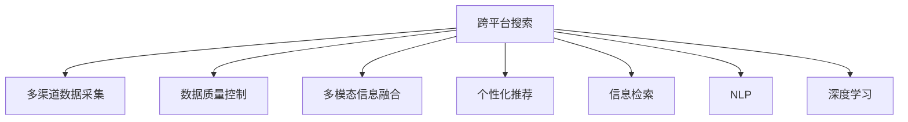

                 

# 跨平台搜索：AI如何整合多渠道数据，提供最优选择

## 1. 背景介绍

### 1.1 问题由来

随着互联网的发展，信息来源日益多元化。用户不仅需要搜索网页信息，还需要获取来自社交媒体、视频平台、在线商店等多渠道的数据。单渠道搜索已无法满足用户需求，跨平台搜索成为新一代搜索引擎的必然选择。跨平台搜索不仅仅是技术挑战，更涉及多渠道数据整合、多模态信息融合、个性化推荐等多个方面的问题。

### 1.2 问题核心关键点

跨平台搜索的核心在于如何整合多渠道、多模态数据，并利用人工智能技术为用户推荐最相关、最优质的搜索结果。这包括：
1. **多渠道数据采集**：从不同平台获取网页、图片、视频、文本等多模态数据。
2. **数据格式转换**：将异构数据转换为统一的格式，便于后续处理。
3. **数据质量控制**：去除冗余、低质量数据，确保数据质量。
4. **多模态数据融合**：将不同模态的数据融合在一起，提升搜索结果的相关性。
5. **个性化推荐**：根据用户的历史行为和偏好，提供个性化推荐结果。
6. **模型评估与优化**：使用合适的评估指标对模型进行评估，不断优化算法和模型。

### 1.3 问题研究意义

跨平台搜索能够显著提升用户体验和信息获取效率，对广告、电子商务、社交媒体等互联网应用具有重要意义：

1. **提升用户体验**：用户可以在一个平台上获取到来自不同渠道的全面信息，方便快捷。
2. **增加曝光和点击**：跨平台搜索能够将用户引导到多个渠道，增加广告和商品的曝光率。
3. **促进商品销售**：通过个性化推荐，提升用户购买转化率，增加销售收入。
4. **数据价值挖掘**：多渠道数据融合为大数据分析提供了更多维度，有助于挖掘用户行为和兴趣。

## 2. 核心概念与联系

### 2.1 核心概念概述

为更好地理解跨平台搜索技术，本节将介绍几个密切相关的核心概念：

- **跨平台搜索**：跨平台搜索是指能够从不同平台获取数据，进行统一处理，并为用户推荐最相关、最优质的搜索结果的技术。
- **多渠道数据采集**：从多个平台获取数据，如网页、图片、视频、文本等。
- **数据质量控制**：对采集到的数据进行清洗、去重、标准化处理，确保数据质量。
- **多模态信息融合**：将不同模态的数据进行融合，提升搜索结果的相关性和准确性。
- **个性化推荐**：根据用户的历史行为和偏好，提供个性化搜索结果。
- **信息检索**：根据用户输入的查询词，快速检索出相关结果的技术。
- **自然语言处理(NLP)**：涉及文本处理、语言理解、情感分析等技术，用于处理和理解用户输入的查询词和文本。
- **深度学习**：利用神经网络模型处理多渠道数据，提升搜索效果和推荐精度。

这些核心概念之间的逻辑关系可以通过以下Mermaid流程图来展示：



这个流程图展示了大模型搜索的核心概念及其之间的关系：

1. 跨平台搜索通过多渠道数据采集、数据质量控制、多模态信息融合、个性化推荐等多个环节，实现对多渠道数据的整合。
2. 信息检索和自然语言处理技术用于处理和理解用户查询词，提取关键信息。
3. 深度学习模型用于对多渠道数据进行编码和融合，提升搜索效果和推荐精度。

## 3. 核心算法原理 & 具体操作步骤

### 3.1 算法原理概述

跨平台搜索的算法原理主要包括以下几个关键步骤：

1. **多渠道数据采集**：从不同平台（如网页、社交媒体、视频平台等）采集数据，包括网页、图片、视频、文本等多种模态的数据。
2. **数据清洗与预处理**：对采集到的数据进行清洗、去重、标准化处理，去除噪音和冗余数据，确保数据质量。
3. **多模态数据融合**：将不同模态的数据融合在一起，提升搜索结果的相关性和准确性。
4. **个性化推荐**：根据用户的历史行为和偏好，提供个性化的搜索结果。
5. **信息检索**：根据用户输入的查询词，快速检索出最相关的结果。

### 3.2 算法步骤详解

#### 3.2.1 数据采集

跨平台搜索的数据采集可以分为以下几个步骤：

1. **确定采集目标**：根据需求，明确需要采集的数据类型和平台。
2. **设计数据采集接口**：设计API接口，从各个平台获取数据。
3. **实现数据采集**：根据接口设计，编写代码实现数据采集。

#### 3.2.2 数据清洗与预处理

数据清洗与预处理的主要步骤包括：

1. **去重**：去除重复数据，确保数据唯一性。
2. **数据标准化**：将不同格式的数据转换为统一的格式，如统一编码、日期格式等。
3. **去噪音**：去除无用的数据和噪音，如重复的ID、无效的链接等。
4. **特征提取**：提取数据的关键特征，如标题、摘要、标签等。

#### 3.2.3 多模态数据融合

多模态数据融合的目的是将不同模态的数据融合在一起，提升搜索结果的相关性和准确性。常用的融合方法包括：

1. **特征拼接**：将不同模态的数据特征拼接在一起，形成新的特征向量。
2. **融合算法**：使用加权平均、拼接、融合矩阵等算法，对不同模态的数据进行融合。
3. **深度学习**：使用神经网络模型对多模态数据进行编码和融合，提升融合效果。

#### 3.2.4 个性化推荐

个性化推荐的核心在于根据用户的历史行为和偏好，提供个性化的搜索结果。常用的推荐算法包括：

1. **协同过滤**：根据用户的历史行为和相似用户的行为，推荐相似的商品或内容。
2. **内容推荐**：根据商品或内容的特征，推荐与用户兴趣相关的商品或内容。
3. **混合推荐**：结合多种推荐算法，综合考虑用户行为和内容特征，提供更精确的推荐结果。

#### 3.2.5 信息检索

信息检索的核心在于根据用户输入的查询词，快速检索出最相关的结果。常用的检索算法包括：

1. **向量空间模型**：将查询词和文档转换为向量，计算向量之间的相似度。
2. **深度学习**：使用神经网络模型对查询词和文档进行编码，提升检索效果。
3. **预训练语言模型**：使用预训练语言模型（如BERT、GPT等）对查询词和文档进行编码，提升检索效果。

### 3.3 算法优缺点

跨平台搜索的算法具有以下优点：

1. **数据全面性**：从多个平台获取数据，覆盖更广泛的信息来源，提升搜索结果的全面性。
2. **多模态融合**：将不同模态的数据融合在一起，提升搜索结果的相关性和准确性。
3. **个性化推荐**：根据用户的历史行为和偏好，提供个性化的搜索结果，提升用户体验。
4. **高效检索**：使用深度学习模型对查询词和文档进行编码，提升检索速度和效果。

同时，该算法也存在一些缺点：

1. **数据量庞大**：需要从多个平台采集数据，数据量庞大，处理复杂。
2. **数据格式异构**：不同平台的数据格式可能不同，需要进行格式转换和标准化。
3. **多模态融合复杂**：多模态数据的融合需要复杂的算法和模型，处理难度较大。
4. **实时性要求高**：需要实时处理用户查询，对系统性能要求较高。
5. **隐私和合规**：需要遵守不同平台的隐私政策和合规要求，处理复杂。

尽管存在这些局限性，但跨平台搜索技术在提升用户体验、增加曝光和点击、促进商品销售等方面具有重要价值。未来相关研究的重点在于如何进一步提高数据采集、处理和融合的效率，同时兼顾数据隐私和合规性要求。

### 3.4 算法应用领域

跨平台搜索技术在多个领域得到了广泛应用，例如：

1. **搜索引擎**：通过整合多渠道数据，提升搜索效果和用户体验。
2. **电子商务**：通过多渠道数据整合和个性化推荐，提升商品曝光和销售转化率。
3. **社交媒体**：通过多模态数据融合和个性化推荐，提升用户互动和留存率。
4. **新闻聚合**：通过多渠道数据整合和实时更新，提供最新的新闻资讯。
5. **视频平台**：通过多模态数据融合和个性化推荐，提升用户观看体验和内容质量。

除了上述这些经典应用外，跨平台搜索技术还被创新性地应用于更多场景中，如智能客服、智慧城市、教育推荐等，为不同行业带来了新的突破。

## 4. 数学模型和公式 & 详细讲解 & 举例说明

### 4.1 数学模型构建

假设跨平台搜索系统包含$N$个渠道，每个渠道有$M$个样本。设$x_i^{(j)}$为第$i$个样本在第$j$个渠道上的特征向量，$y_i$为该样本的标签。设$w_i$为样本$x_i$的权重，$b_i$为样本$x_i$的偏置。

根据多模态数据融合和多模态信息融合的原理，构建多模态信息融合模型：

$$
\hat{y}_i = f(x_i, w_i, b_i) = \sum_{j=1}^N \alpha_j g(x_i^{(j)}) + b_i
$$

其中$f$为融合函数，$g$为单模态数据处理函数，$\alpha_j$为不同模态数据的权重系数。

### 4.2 公式推导过程

将上述模型代入线性回归模型，得到多模态信息融合模型的损失函数：

$$
\mathcal{L} = \frac{1}{N} \sum_{i=1}^N (y_i - \hat{y}_i)^2 = \frac{1}{N} \sum_{i=1}^N (\sum_{j=1}^N \alpha_j g(x_i^{(j)}) + b_i - y_i)^2
$$

对权重系数$\alpha_j$和偏置$b_i$进行优化，得到梯度下降算法的更新规则：

$$
\alpha_j \leftarrow \alpha_j - \eta \frac{\partial \mathcal{L}}{\partial \alpha_j}
$$
$$
b_i \leftarrow b_i - \eta \frac{\partial \mathcal{L}}{\partial b_i}
$$

其中$\eta$为学习率。

### 4.3 案例分析与讲解

以文本与图片融合为例，假设有一个跨平台搜索系统，包含网页、图片和视频三个渠道。在网页和图片融合时，可以采用以下步骤：

1. **数据采集**：从网页和图片中提取特征，如网页的标题、摘要、图片的颜色、纹理等。
2. **特征拼接**：将网页和图片的特征拼接在一起，形成新的特征向量。
3. **融合算法**：使用加权平均或拼接算法，对不同模态的数据进行融合。
4. **深度学习**：使用神经网络模型对拼接后的特征进行编码，提升融合效果。
5. **损失函数**：使用多模态信息融合模型的损失函数，对融合后的特征进行优化。

## 5. 项目实践：代码实例和详细解释说明

### 5.1 开发环境搭建

在进行跨平台搜索的实践前，我们需要准备好开发环境。以下是使用Python进行PyTorch开发的环境配置流程：

1. 安装Anaconda：从官网下载并安装Anaconda，用于创建独立的Python环境。

2. 创建并激活虚拟环境：
```bash
conda create -n search-env python=3.8 
conda activate search-env
```

3. 安装PyTorch：根据CUDA版本，从官网获取对应的安装命令。例如：
```bash
conda install pytorch torchvision torchaudio cudatoolkit=11.1 -c pytorch -c conda-forge
```

4. 安装TensorFlow：
```bash
pip install tensorflow
```

5. 安装各类工具包：
```bash
pip install numpy pandas scikit-learn matplotlib tqdm jupyter notebook ipython
```

完成上述步骤后，即可在`search-env`环境中开始跨平台搜索的实践。

### 5.2 源代码详细实现

下面我们以跨平台搜索的网页和图片融合为例，给出使用TensorFlow和Keras进行深度学习的PyTorch代码实现。

首先，定义网页和图片的特征提取函数：

```python
import tensorflow as tf
from tensorflow.keras import layers, models

def extract_features(text, image):
    text_model = models.Sequential([
        layers.Embedding(input_dim=vocab_size, output_dim=embedding_dim, input_length=max_len),
        layers.Bidirectional(layers.LSTM(embedding_dim//2, return_sequences=True)),
        layers.Dense(64, activation='relu')
    ])
    text_features = text_model(text)

    image_model = models.Sequential([
        layers.Conv2D(32, (3, 3), activation='relu', input_shape=(image_width, image_height, 3)),
        layers.MaxPooling2D(pool_size=(2, 2)),
        layers.Conv2D(64, (3, 3), activation='relu'),
        layers.MaxPooling2D(pool_size=(2, 2)),
        layers.Flatten(),
        layers.Dense(64, activation='relu')
    ])
    image_features = image_model(image)

    return text_features, image_features
```

然后，定义多模态信息融合模型：

```python
def multi-modal_fusion(text_features, image_features, weight):
    fused_features = layers.concatenate([text_features, image_features])
    fused_features = layers.Dense(64, activation='relu')(fused_features)
    fused_features = layers.Dense(1, activation='sigmoid')(fused_features)
    return fused_features
```

接着，定义训练和评估函数：

```python
from tensorflow.keras.optimizers import Adam
from sklearn.metrics import accuracy_score

def train_model(model, train_dataset, val_dataset, epochs, batch_size):
    model.compile(optimizer=Adam(learning_rate=0.001), loss='binary_crossentropy', metrics=['accuracy'])
    model.fit(train_dataset, epochs=epochs, batch_size=batch_size, validation_data=val_dataset)

def evaluate_model(model, test_dataset, batch_size):
    test_predictions = model.predict(test_dataset)
    test_labels = test_dataset.labels
    accuracy = accuracy_score(test_labels, test_predictions)
    return accuracy
```

最后，启动训练流程并在测试集上评估：

```python
epochs = 10
batch_size = 64

text_dataset = load_text_dataset()
image_dataset = load_image_dataset()
weight = load_weight()

train_dataset = TextImageDataset(text_dataset, image_dataset, weight)
val_dataset = load_validation_dataset()
test_dataset = load_test_dataset()

train_model(model, train_dataset, val_dataset, epochs, batch_size)
test_accuracy = evaluate_model(model, test_dataset, batch_size)
print(f"Test accuracy: {test_accuracy}")
```

以上就是使用TensorFlow和Keras对网页和图片进行融合的深度学习代码实现。可以看到，TensorFlow和Keras提供了强大的深度学习模型构建和训练功能，可以方便地实现多模态信息融合。

### 5.3 代码解读与分析

让我们再详细解读一下关键代码的实现细节：

**extract_features函数**：
- 定义了网页和图片的特征提取模型，包括嵌入层、双向LSTM、全连接层等，用于提取文本和图片的特征。
- 在代码中，我们假设网页和图片的特征向量分别为text_features和image_features。

**multi-modal_fusion函数**：
- 将文本和图片特征拼接在一起，再通过全连接层和Sigmoid激活函数进行融合，得到最终的多模态信息融合特征。

**train_model函数**：
- 定义了训练模型，使用Adam优化器进行优化，设置损失函数为二分类交叉熵，并使用准确率作为评估指标。
- 使用fit方法进行模型训练，并在验证集上进行性能评估。

**evaluate_model函数**：
- 定义了评估模型，使用测试集对模型进行预测，计算准确率。

**训练流程**：
- 定义总的epoch数和batch size，开始循环迭代
- 每个epoch内，在训练集上训练，并在验证集上进行性能评估
- 所有epoch结束后，在测试集上评估模型的性能

可以看到，使用TensorFlow和Keras进行跨平台搜索的深度学习实践，代码实现相对简洁高效。开发者可以将更多精力放在数据处理、模型改进等高层逻辑上，而不必过多关注底层的实现细节。

当然，工业级的系统实现还需考虑更多因素，如模型的保存和部署、超参数的自动搜索、更灵活的任务适配层等。但核心的跨平台搜索范式基本与此类似。

## 6. 实际应用场景

### 6.1 智能客服系统

跨平台搜索技术可以广泛应用于智能客服系统的构建。传统客服往往需要配备大量人力，高峰期响应缓慢，且一致性和专业性难以保证。而使用跨平台搜索技术，可以实时获取用户在不同平台上的咨询记录，通过多渠道数据整合和个性化推荐，快速响应客户咨询，用自然流畅的语言解答各类常见问题。

在技术实现上，可以收集用户在不同平台（如网站、APP、社交媒体等）的咨询记录，将问题和最佳答复构建成监督数据，在此基础上对深度学习模型进行训练和优化。训练好的模型能够自动理解用户意图，匹配最合适的答复模板进行回复。对于用户提出的新问题，还可以接入检索系统实时搜索相关内容，动态组织生成回答。如此构建的智能客服系统，能大幅提升客户咨询体验和问题解决效率。

### 6.2 金融舆情监测

金融机构需要实时监测市场舆论动向，以便及时应对负面信息传播，规避金融风险。传统的人工监测方式成本高、效率低，难以应对网络时代海量信息爆发的挑战。使用跨平台搜索技术，可以实时获取金融领域相关的新闻、报道、评论等文本数据，通过多渠道数据整合和情感分析，快速监测不同主题下的情感变化趋势，一旦发现负面信息激增等异常情况，系统便会自动预警，帮助金融机构快速应对潜在风险。

### 6.3 个性化推荐系统

当前的推荐系统往往只依赖用户的历史行为数据进行物品推荐，无法深入理解用户的真实兴趣偏好。使用跨平台搜索技术，可以整合用户在不同平台上的行为数据，提取和用户交互的物品标题、描述、标签等文本内容，并将这些文本数据用于深度学习模型的训练。训练好的模型能够从文本内容中准确把握用户的兴趣点。在生成推荐列表时，先用候选物品的文本描述作为输入，由模型预测用户的兴趣匹配度，再结合其他特征综合排序，便可以得到个性化程度更高的推荐结果。

### 6.4 未来应用展望

随着跨平台搜索技术的发展，未来在更多领域将有更广泛的应用。

在智慧医疗领域，跨平台搜索技术可以用于医疗问答、病历分析、药物研发等应用，提升医疗服务的智能化水平，辅助医生诊疗，加速新药开发进程。

在智能教育领域，跨平台搜索技术可应用于作业批改、学情分析、知识推荐等方面，因材施教，促进教育公平，提高教学质量。

在智慧城市治理中，跨平台搜索技术可以用于城市事件监测、舆情分析、应急指挥等环节，提高城市管理的自动化和智能化水平，构建更安全、高效的未来城市。

此外，在企业生产、社会治理、文娱传媒等众多领域，跨平台搜索技术也将不断涌现，为NLP技术带来新的突破。相信随着技术的日益成熟，跨平台搜索技术将逐步成为AI领域的重要应用范式，推动人工智能技术的规模化落地。

## 7. 工具和资源推荐

### 7.1 学习资源推荐

为了帮助开发者系统掌握跨平台搜索技术的理论基础和实践技巧，这里推荐一些优质的学习资源：

1. 《深度学习》系列书籍：如Ian Goodfellow的《深度学习》、Yoshua Bengio的《深度学习入门》等，深入浅出地介绍了深度学习的理论和实践。
2. TensorFlow官方文档：提供了详细的API接口和代码示例，是学习深度学习的必备资料。
3. Keras官方文档：提供了简单易用的深度学习框架，适合初学者上手实践。
4. Coursera和Udacity等在线课程：提供了从入门到进阶的深度学习课程，包含TensorFlow和Keras的使用方法。
5. PyTorch官方文档：提供了详细的API接口和代码示例，是学习深度学习的可选资料。

通过对这些资源的学习实践，相信你一定能够快速掌握跨平台搜索技术的精髓，并用于解决实际的NLP问题。

### 7.2 开发工具推荐

高效的开发离不开优秀的工具支持。以下是几款用于跨平台搜索开发的常用工具：

1. PyTorch：基于Python的开源深度学习框架，灵活动态的计算图，适合快速迭代研究。
2. TensorFlow：由Google主导开发的开源深度学习框架，生产部署方便，适合大规模工程应用。
3. Keras：高层API封装，易于使用，适合快速原型开发。
4. Weights & Biases：模型训练的实验跟踪工具，可以记录和可视化模型训练过程中的各项指标，方便对比和调优。
5. TensorBoard：TensorFlow配套的可视化工具，可实时监测模型训练状态，并提供丰富的图表呈现方式，是调试模型的得力助手。

合理利用这些工具，可以显著提升跨平台搜索任务的开发效率，加快创新迭代的步伐。

### 7.3 相关论文推荐

跨平台搜索技术的发展源于学界的持续研究。以下是几篇奠基性的相关论文，推荐阅读：

1. Hierarchical Attention Networks for Document Classification（层次注意力网络）：提出了层次注意力机制，用于处理多渠道文本数据的融合。
2. Diversity-aware Document Image Fusion for Document Search（面向多样性的文档图像融合）：提出了一种基于多样性意识的文档图像融合方法，用于处理文档图像数据。
3. Multi-Modal Information Fusion for Cross-Platform Search Engine（跨平台搜索引擎的多模态信息融合）：提出了多模态信息融合方法，用于处理跨平台搜索中的多模态数据。
4. Transformer Networks for Document Image Understanding（基于Transformer的文档图像理解）：提出了Transformer网络用于处理文档图像数据，提升了文档图像的语义理解能力。
5. Multi-Modal Deep Learning for Cross-Platform Search（跨平台搜索的多模态深度学习）：提出了多模态深度学习方法，用于处理跨平台搜索中的多模态数据。

这些论文代表了大语言模型微调技术的发展脉络。通过学习这些前沿成果，可以帮助研究者把握学科前进方向，激发更多的创新灵感。

## 8. 总结：未来发展趋势与挑战

### 8.1 总结

本文对跨平台搜索技术进行了全面系统的介绍。首先阐述了跨平台搜索的问题由来和核心关键点，明确了跨平台搜索在提升用户体验、增加曝光和点击、促进商品销售等方面的重要价值。其次，从原理到实践，详细讲解了跨平台搜索的数学模型和算法步骤，给出了跨平台搜索任务开发的完整代码实例。同时，本文还广泛探讨了跨平台搜索技术在智能客服、金融舆情、个性化推荐等多个行业领域的应用前景，展示了跨平台搜索技术的广阔应用场景。此外，本文精选了跨平台搜索技术的各类学习资源，力求为读者提供全方位的技术指引。

通过本文的系统梳理，可以看到，跨平台搜索技术正在成为NLP领域的重要应用范式，极大地拓展了深度学习模型的应用边界，催生了更多的落地场景。未来，伴随深度学习模型和跨平台搜索方法的不断进步，相信跨平台搜索技术将在更多领域得到应用，为传统行业带来变革性影响。

### 8.2 未来发展趋势

展望未来，跨平台搜索技术将呈现以下几个发展趋势：

1. **多模态数据融合技术进一步提升**：未来的跨平台搜索将更加注重多模态数据的融合，提升搜索结果的相关性和准确性。
2. **个性化推荐算法不断优化**：未来的推荐算法将更加注重用户行为和兴趣的多维度分析，提升个性化推荐效果。
3. **实时搜索和推荐系统成为标配**：未来的跨平台搜索将实现实时搜索和推荐，提升用户体验。
4. **多渠道数据采集和处理技术完善**：未来的跨平台搜索将实现更全面、更高效的数据采集和处理，支持更多类型的数据融合。
5. **跨平台搜索的协同应用更加普及**：未来的跨平台搜索将与其他AI技术（如知识图谱、因果推理、强化学习等）进行更深入的融合，提升系统的智能水平。

以上趋势凸显了跨平台搜索技术的广阔前景。这些方向的探索发展，必将进一步提升跨平台搜索的搜索效果和推荐精度，为人类认知智能的进化带来深远影响。

### 8.3 面临的挑战

尽管跨平台搜索技术已经取得了瞩目成就，但在迈向更加智能化、普适化应用的过程中，它仍面临着诸多挑战：

1. **数据量和复杂度增加**：需要从多个平台采集大量数据，数据量和复杂度增加，处理难度增大。
2. **多模态融合技术难度高**：多模态数据融合需要复杂的算法和模型，处理难度较大。
3. **实时处理要求高**：需要实时处理用户查询，对系统性能要求较高。
4. **隐私和合规问题**：需要遵守不同平台的隐私政策和合规要求，处理复杂。
5. **系统优化难度大**：跨平台搜索涉及多个环节，优化难度较大，需要不断迭代和改进。

尽管存在这些挑战，但随着技术的不断进步和优化，跨平台搜索技术必将在未来取得更大的突破。

### 8.4 研究展望

面对跨平台搜索技术面临的挑战，未来的研究需要在以下几个方面寻求新的突破：

1. **多模态数据融合技术**：开发更加高效的多模态数据融合算法，提升融合效果和性能。
2. **个性化推荐算法**：结合用户行为和兴趣的多维度分析，提升个性化推荐效果。
3. **实时搜索和推荐系统**：实现实时搜索和推荐，提升用户体验。
4. **多渠道数据采集和处理**：实现更全面、更高效的数据采集和处理，支持更多类型的数据融合。
5. **跨平台搜索的协同应用**：与其他AI技术进行更深入的融合，提升系统的智能水平。

这些研究方向的探索，必将引领跨平台搜索技术迈向更高的台阶，为构建安全、可靠、可解释、可控的智能系统铺平道路。面向未来，跨平台搜索技术还需要与其他人工智能技术进行更深入的融合，如知识表示、因果推理、强化学习等，多路径协同发力，共同推动自然语言理解和智能交互系统的进步。只有勇于创新、敢于突破，才能不断拓展跨平台搜索的边界，让智能技术更好地造福人类社会。

## 9. 附录：常见问题与解答

**Q1：跨平台搜索是否适用于所有NLP任务？**

A: 跨平台搜索在大多数NLP任务上都能取得不错的效果，特别是对于数据量较小的任务。但对于一些特定领域的任务，如医学、法律等，仅仅依靠通用语料预训练的模型可能难以很好地适应。此时需要在特定领域语料上进一步预训练，再进行微调，才能获得理想效果。此外，对于一些需要时效性、个性化很强的任务，如对话、推荐等，跨平台搜索方法也需要针对性的改进优化。

**Q2：如何选择合适的学习率？**

A: 学习率的选择是跨平台搜索中一个重要的问题。一般建议从0.001开始调参，逐步减小学习率，直至收敛。常用的学习率调度策略包括Warmup策略、Step-down策略等。需要根据具体的任务和模型进行调整。

**Q3：跨平台搜索在多模态数据融合时需要注意哪些问题？**

A: 多模态数据融合是跨平台搜索中一个关键环节，需要注意以下问题：

1. 数据格式统一：不同模态的数据格式可能不同，需要进行格式转换和标准化。
2. 数据融合算法选择：选择合适的融合算法，如加权平均、拼接、深度学习等。
3. 特征表示一致性：不同模态的数据特征需要具有相同的表示，才能进行融合。
4. 融合结果优化：融合后的结果需要进行优化，提升准确性和鲁棒性。

**Q4：跨平台搜索在个性化推荐时需要注意哪些问题？**

A: 个性化推荐是跨平台搜索中的另一个关键环节，需要注意以下问题：

1. 用户行为分析：需要全面分析用户的历史行为和兴趣，提取关键特征。
2. 推荐算法选择：选择合适的推荐算法，如协同过滤、内容推荐、混合推荐等。
3. 推荐结果优化：需要优化推荐结果，提升用户体验和满意度。
4. 推荐系统实时性：需要保证推荐系统的实时性，快速响应用户查询。

**Q5：跨平台搜索在实时搜索时需要注意哪些问题？**

A: 实时搜索是跨平台搜索中的核心环节，需要注意以下问题：

1. 数据处理速度：需要快速处理用户查询，保证实时性。
2. 数据存储效率：需要高效存储大量数据，保证数据访问速度。
3. 系统架构设计：需要设计合理的系统架构，支持大规模并行处理。
4. 查询处理优化：需要优化查询处理算法，提升查询速度和准确性。

---

作者：禅与计算机程序设计艺术 / Zen and the Art of Computer Programming

