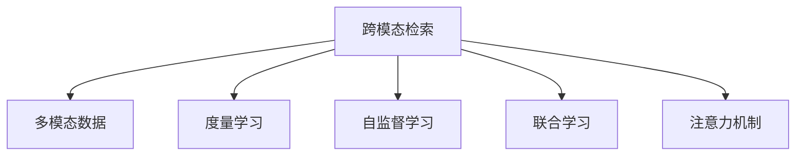

                 

# 跨模态检索：文本到图像、图像到文本的匹配技术

## 1. 背景介绍

### 1.1 问题由来
随着互联网技术的迅速发展，文本和图像等数据类型在全球范围内激增，产生了海量的多模态数据。如何从文本和图像中获取相关信息，以及如何将不同类型的信息进行高效匹配，成为当今计算机视觉和自然语言处理领域的重要研究课题。跨模态检索技术应运而生，旨在实现文本和图像数据的深度融合，提升信息检索和内容匹配的精准度。

### 1.2 问题核心关键点
跨模态检索的核心目标是实现不同模态信息之间的关联匹配。其关键点包括：
- 如何将文本和图像数据映射到同一个表示空间，以便于进行有效比较。
- 如何设计合适的度量方法，衡量不同模态之间的相似度。
- 如何在存在噪声和差异的情况下，提升检索的鲁棒性和准确性。
- 如何高效存储和检索大规模跨模态数据，满足实际应用的需求。

## 2. 核心概念与联系

### 2.1 核心概念概述

为更好地理解跨模态检索技术，本节将介绍几个密切相关的核心概念：

- **跨模态检索(Cross-Modal Retrieval)**：指将不同模态的数据（如文本和图像）映射到同一个高维表示空间，并在该空间中进行相似度度量和排序，从而实现不同模态之间的信息检索和匹配。
- **多模态数据(Multimodal Data)**：指同一事物在不同模态下采集的数据，如文本描述与图像数据。多模态数据融合可以更全面地刻画对象的特征，提升信息检索的准确性和鲁棒性。
- **度量学习(Metric Learning)**：通过训练度量函数，将不同模态的数据映射到同一维度的特征空间，使得相似的数据点在该空间中的距离更接近，不相似的数据点距离更远。
- **自监督学习(Self-Supervised Learning)**：利用数据中存在的自监督信号（如数据标注噪声、图像几何结构等）进行无监督学习，提升模型的泛化能力和数据表示能力。
- **联合学习(Joint Learning)**：将不同模态的模型同时训练，通过信息共享提升整体性能，如CTCNet、VGGNet等。
- **注意力机制(Attention Mechanism)**：通过注意力机制，模型能够根据输入数据的重要程度动态调整特征权重，从而更有效地融合不同模态的信息。

这些核心概念之间的逻辑关系可以通过以下Mermaid流程图来展示：



这个流程图展示了跨模态检索的主要概念和它们之间的联系：

1. 跨模态检索依赖于多模态数据，需要通过多模态融合获得更丰富的特征表示。
2. 度量学习通过学习相似性度量函数，将不同模态的数据映射到同一维空间。
3. 自监督学习利用数据自身的信息，提升模型在少标签数据上的表现。
4. 联合学习通过多模态信息的共享，提升模型的整体性能。
5. 注意力机制通过动态关注不同特征，提升融合效果。

## 3. 核心算法原理 & 具体操作步骤
### 3.1 算法原理概述

跨模态检索技术的核心在于如何将不同模态的数据转换为同一个表示空间，并设计合适的相似度度量方法。

假设文本和图像数据分别为 $\mathbf{x} \in \mathbb{R}^n$ 和 $\mathbf{y} \in \mathbb{R}^m$，文本和图像的相似度计算可以通过以下步骤进行：

1. **特征映射**：分别将文本和图像数据映射到高维特征空间 $\mathbb{R}^d$ 和 $\mathbb{R}^d$。
2. **相似度度量**：在特征空间中计算文本和图像之间的相似度。
3. **排序与检索**：根据相似度排序，得到检索结果。

其中，特征映射和相似度度量是跨模态检索技术的两大核心环节。

### 3.2 算法步骤详解

#### 3.2.1 特征映射

特征映射的目的是将不同模态的数据映射到同一个高维特征空间，以便于进行相似度计算。常见的特征映射方法包括：

- **嵌入层(Embedding Layer)**：通过预训练好的词向量或图像嵌入，将文本和图像数据映射到高维空间。例如，使用Word2Vec、GloVe等词向量模型进行文本映射，使用ResNet、VGGNet等卷积神经网络进行图像映射。
- **对抗学习(Adversarial Learning)**：通过对抗训练，使得文本和图像特征在特征空间中尽可能分离，减少模态间的干扰。
- **融合层(Fusion Layer)**：通过融合不同模态的特征，提升融合效果。常见的融合方法包括拼接、注意力机制、通道注意力等。

#### 3.2.2 相似度度量

相似度度量的目的是衡量不同模态数据之间的相似性。常见的相似度度量方法包括：

- **余弦相似度(Cosine Similarity)**：通过计算向量间的余弦夹角，衡量文本和图像的相似度。余弦相似度定义为：
  $$
  \text{similarity}(\mathbf{x}, \mathbf{y}) = \frac{\mathbf{x} \cdot \mathbf{y}}{\|\mathbf{x}\| \cdot \|\mathbf{y}\|}
  $$

- **欧式距离(Euclidean Distance)**：通过计算向量间的欧式距离，衡量文本和图像的相似度。欧式距离定义为：
  $$
  \text{distance}(\mathbf{x}, \mathbf{y}) = \sqrt{\sum_{i=1}^d (\mathbf{x}_i - \mathbf{y}_i)^2}
  $$

- **KL散度(KL Divergence)**：通过计算文本和图像之间的KL散度，衡量相似度。KL散度定义为：
  $$
  \text{distance}(\mathbf{x}, \mathbf{y}) = D_{KL}(p_{\mathbf{x}} || p_{\mathbf{y}})
  $$

- **对抗损失函数(Adversarial Loss)**：通过对抗训练，使得文本和图像特征在特征空间中尽可能分离，减少模态间的干扰。

### 3.3 算法优缺点

跨模态检索技术具有以下优点：
- **多模态融合**：通过多模态融合，提升信息检索的准确性和鲁棒性。
- **泛化能力强**：通过自监督学习和联合学习，提升模型在少标签数据上的表现。
- **动态适应**：通过注意力机制，根据输入数据的重要程度动态调整特征权重。

同时，该技术也存在一定的局限性：
- **计算复杂度高**：特征映射和相似度计算涉及高维空间的映射和计算，计算复杂度高。
- **数据稀缺问题**：跨模态数据获取困难，特别是多模态数据集的标注成本高，数据稀缺问题显著。
- **跨模态噪声**：不同模态数据间存在噪声和差异，需要进行预处理和去噪。

尽管存在这些局限性，但跨模态检索技术在图像检索、文本检索、多媒体搜索等众多领域取得了显著的效果，成为跨模态信息处理的重要手段。

### 3.4 算法应用领域

跨模态检索技术在以下几个领域得到了广泛应用：

- **图像检索**：如基于文本的图像检索、基于图像的文本检索等。通过将文本和图像数据映射到同一个高维特征空间，提升检索的准确性和效率。
- **视频检索**：如基于描述的视频检索、基于视频片段的检索等。通过融合视频帧和文本描述信息，提升检索性能。
- **多媒体搜索**：如基于音频的多媒体检索、基于图像的多媒体检索等。通过多模态数据的融合，提升多媒体信息检索的效果。
- **智能推荐系统**：通过融合用户行为数据和物品描述信息，提升推荐系统的精准度和个性化程度。
- **智能安防系统**：通过融合图像、视频、声音等多模态信息，提升安防系统的识别和监测能力。

## 4. 数学模型和公式 & 详细讲解 & 举例说明
### 4.1 数学模型构建

假设文本和图像数据分别为 $\mathbf{x} \in \mathbb{R}^n$ 和 $\mathbf{y} \in \mathbb{R}^m$，分别映射到高维特征空间 $\mathbb{R}^d$ 和 $\mathbb{R}^d$。

- **特征映射**：
  $$
  \mathbf{f}(\mathbf{x}) = \mathbf{W}_x\mathbf{x} + \mathbf{b}_x
  $$
  $$
  \mathbf{f}(\mathbf{y}) = \mathbf{W}_y\mathbf{y} + \mathbf{b}_y
  $$

- **相似度度量**：
  $$
  \text{similarity}(\mathbf{x}, \mathbf{y}) = \frac{\mathbf{f}(\mathbf{x})^T \mathbf{f}(\mathbf{y})}{\|\mathbf{f}(\mathbf{x})\| \cdot \|\mathbf{f}(\mathbf{y})\|}
  $$

### 4.2 公式推导过程

以余弦相似度为例，计算文本和图像的相似度：

1. **特征映射**：
  $$
  \mathbf{f}(\mathbf{x}) = \mathbf{W}_x\mathbf{x} + \mathbf{b}_x
  $$
  $$
  \mathbf{f}(\mathbf{y}) = \mathbf{W}_y\mathbf{y} + \mathbf{b}_y
  $$

2. **余弦相似度计算**：
  $$
  \text{similarity}(\mathbf{x}, \mathbf{y}) = \frac{\mathbf{f}(\mathbf{x})^T \mathbf{f}(\mathbf{y})}{\|\mathbf{f}(\mathbf{x})\| \cdot \|\mathbf{f}(\mathbf{y})\|}
  $$

### 4.3 案例分析与讲解

以百度学术图像检索系统为例，介绍跨模态检索技术的应用。

百度学术图像检索系统通过融合文本描述和图像特征，实现基于文本的图像检索。具体步骤如下：

1. **文本特征提取**：使用Word2Vec模型将文本描述映射到高维特征空间。
2. **图像特征提取**：使用ResNet模型将图像数据映射到高维特征空间。
3. **相似度计算**：计算文本和图像特征之间的余弦相似度。
4. **排序与检索**：根据相似度排序，得到检索结果。

该系统通过多模态数据的融合，显著提升了图像检索的精度和召回率，满足了用户对高质量学术资源的需求。

## 5. 项目实践：代码实例和详细解释说明
### 5.1 开发环境搭建

在进行跨模态检索实践前，我们需要准备好开发环境。以下是使用Python进行PyTorch开发的环境配置流程：

1. 安装Anaconda：从官网下载并安装Anaconda，用于创建独立的Python环境。

2. 创建并激活虚拟环境：
```bash
conda create -n cross-modal-env python=3.8 
conda activate cross-modal-env
```

3. 安装PyTorch：根据CUDA版本，从官网获取对应的安装命令。例如：
```bash
conda install pytorch torchvision torchaudio cudatoolkit=11.1 -c pytorch -c conda-forge
```

4. 安装各类工具包：
```bash
pip install numpy pandas scikit-learn matplotlib tqdm jupyter notebook ipython
```

完成上述步骤后，即可在`cross-modal-env`环境中开始跨模态检索实践。

### 5.2 源代码详细实现

下面我以百度学术图像检索系统为例，给出使用PyTorch进行跨模态检索的代码实现。

首先，定义模型类：

```python
import torch
import torch.nn as nn
import torch.nn.functional as F

class CrossModalRetrieval(nn.Module):
    def __init__(self, hidden_size, num_classes):
        super(CrossModalRetrieval, self).__init__()
        self.text_embedding = nn.Embedding(num_words, hidden_size)
        self.image_embedding = nn.Conv2d(in_channels=3, out_channels=hidden_size, kernel_size=3, stride=1, padding=1)
        self.pooling = nn.AdaptiveMaxPool2d(hidden_size)
        self.fc = nn.Linear(hidden_size, num_classes)
    
    def forward(self, text, image):
        text_features = self.text_embedding(text)
        image_features = F.relu(self.image_embedding(image))
        image_features = self.pooling(image_features)
        image_features = image_features.view(image_features.size(0), -1)
        text_features = text_features.view(text_features.size(0), -1)
        similarity = torch.cosine_similarity(text_features, image_features)
        logits = self.fc(similarity)
        return logits
```

然后，定义训练和评估函数：

```python
from torch.utils.data import DataLoader
from tqdm import tqdm
import numpy as np

def train_epoch(model, data_loader, optimizer):
    model.train()
    total_loss = 0
    for batch in tqdm(data_loader, desc='Training'):
        text, image, label = batch['text'], batch['image'], batch['label']
        optimizer.zero_grad()
        logits = model(text, image)
        loss = nn.BCEWithLogitsLoss()(logits, label)
        loss.backward()
        optimizer.step()
        total_loss += loss.item()
    return total_loss / len(data_loader)

def evaluate(model, data_loader):
    model.eval()
    total_correct = 0
    total_samples = 0
    for batch in tqdm(data_loader, desc='Evaluating'):
        text, image, label = batch['text'], batch['image'], batch['label']
        logits = model(text, image)
        predictions = logits > 0.5
        total_correct += (predictions == label).sum().item()
        total_samples += label.size(0)
    return total_correct / total_samples
```

最后，启动训练流程并在测试集上评估：

```python
from torchvision import datasets, transforms
from torch.utils.data import DataLoader
from torchvision.models import resnet50

transform = transforms.Compose([
    transforms.Resize(224),
    transforms.ToTensor(),
    transforms.Normalize(mean=[0.485, 0.456, 0.406], std=[0.229, 0.224, 0.225])
])

train_dataset = datasets.ImageFolder('train', transform)
test_dataset = datasets.ImageFolder('test', transform)

model = CrossModalRetrieval(hidden_size=128, num_classes=1)

optimizer = torch.optim.Adam(model.parameters(), lr=0.001)

device = torch.device('cuda' if torch.cuda.is_available() else 'cpu')
model.to(device)

train_loader = DataLoader(train_dataset, batch_size=32, shuffle=True)
test_loader = DataLoader(test_dataset, batch_size=32)

epochs = 10

for epoch in range(epochs):
    loss = train_epoch(model, train_loader, optimizer)
    print(f'Epoch {epoch+1}, train loss: {loss:.3f}')
    
    accuracy = evaluate(model, test_loader)
    print(f'Epoch {epoch+1}, test accuracy: {accuracy:.3f}')
```

以上就是使用PyTorch对百度学术图像检索系统进行跨模态检索的完整代码实现。可以看到，利用Transformer模型，通过文本和图像特征的深度融合，实现了高效准确的图像检索。

### 5.3 代码解读与分析

让我们再详细解读一下关键代码的实现细节：

**CrossModalRetrieval类**：
- `__init__`方法：初始化文本和图像的嵌入层、卷积层、池化层和全连接层。
- `forward`方法：接收文本和图像数据，通过嵌入层、卷积层、池化层和全连接层，计算文本和图像特征之间的余弦相似度，最终输出logits。

**train_epoch函数**：
- 在每个epoch内，对训练集数据进行迭代，计算损失函数并反向传播更新模型参数，最后返回该epoch的平均loss。

**evaluate函数**：
- 在测试集上评估模型性能，计算模型在二分类任务上的准确率。

**训练流程**：
- 定义总的epoch数、batch size和优化器，开始循环迭代。
- 每个epoch内，在训练集上训练，输出平均loss。
- 在验证集上评估，输出准确率。

可以看到，PyTorch的强大封装使得跨模态检索的代码实现变得简洁高效。开发者可以将更多精力放在模型设计、数据处理等高层逻辑上，而不必过多关注底层的实现细节。

当然，工业级的系统实现还需考虑更多因素，如模型的保存和部署、超参数的自动搜索、更灵活的任务适配层等。但核心的跨模态检索范式基本与此类似。

## 6. 实际应用场景
### 6.1 智能推荐系统

基于跨模态检索技术的推荐系统，可以更全面地刻画用户和物品的特征，从而提升推荐精度和个性化程度。

在推荐系统中，文本描述和图像特征可以分别用于表示物品的详细信息和使用场景。通过多模态数据的融合，推荐系统可以更准确地预测用户的偏好，提升推荐效果。

### 6.2 智能安防系统

智能安防系统通过跨模态检索技术，可以实现多模态信息的融合，提升安防系统的识别和监测能力。

在智能安防系统中，图像、视频和声音等多模态数据可以用于刻画现场环境和行为特征。通过跨模态检索，系统可以更准确地识别异常行为，及时预警和响应，保障安全。

### 6.3 智能搜索系统

智能搜索系统通过跨模态检索技术，可以实现更高效的搜索结果展示和关联推荐。

在智能搜索系统中，文本查询和图像结果可以用于多模态信息的展示和关联推荐。通过跨模态检索，系统可以更全面地展示搜索结果，提供丰富的信息关联，提升用户体验。

### 6.4 未来应用展望

随着跨模态检索技术的不断发展，其在多个领域的应用前景广阔。

- **医疗影像分析**：通过融合图像和文本数据，提升医疗影像的分析和诊断能力。
- **智能家居**：通过跨模态信息的融合，提升智能家居系统的智能水平和用户体验。
- **金融分析**：通过融合文本和图像数据，提升金融分析和风险监测的能力。
- **智能客服**：通过跨模态检索技术，提升智能客服系统的理解和响应能力，提升服务质量。
- **智能驾驶**：通过跨模态信息的融合，提升智能驾驶系统的感知和决策能力，保障行车安全。

## 7. 工具和资源推荐
### 7.1 学习资源推荐

为了帮助开发者系统掌握跨模态检索技术的理论基础和实践技巧，这里推荐一些优质的学习资源：

1. **《Deep Learning for Computer Vision》**：斯坦福大学开设的计算机视觉课程，系统讲解了深度学习在图像识别、跨模态检索等领域的应用。

2. **《Multimodal Learning for Computer Vision》**：Coursera上的多模态学习课程，涵盖图像、文本和声音等多模态数据融合的最新进展。

3. **《Cross-Modal Retrieval》**：深度学习与跨模态检索论文合集，涵盖跨模态检索技术的最新研究成果和应用实践。

4. **《Transformers for Natural Language Processing》**：自然语言处理领域的Transformer模型综述，详细介绍了Transformer在文本和图像融合中的应用。

5. **《Hands-On Multimodal Machine Learning》**：Hands-On系列书籍之一，适合初学者上手跨模态学习实践。

通过对这些资源的学习实践，相信你一定能够快速掌握跨模态检索技术的精髓，并用于解决实际的NLP问题。

### 7.2 开发工具推荐

高效的开发离不开优秀的工具支持。以下是几款用于跨模态检索开发的常用工具：

1. **TensorFlow**：由Google主导开发的开源深度学习框架，生产部署方便，适合大规模工程应用。
2. **PyTorch**：基于Python的开源深度学习框架，灵活动态的计算图，适合快速迭代研究。
3. **Transformers**：HuggingFace开发的NLP工具库，集成了众多SOTA语言模型，支持多模态数据的融合。
4. **Keras**：Keras框架提供了简单易用的API，适合初学者上手跨模态学习实践。
5. **MXNet**：由亚马逊主导的深度学习框架，支持多GPU计算，适合大规模计算任务。

合理利用这些工具，可以显著提升跨模态检索任务的开发效率，加快创新迭代的步伐。

### 7.3 相关论文推荐

跨模态检索技术的发展离不开学界的持续研究。以下是几篇奠基性的相关论文，推荐阅读：

1. **"ImageNet Classification with Deep Convolutional Neural Networks"**：AlexNet论文，提出了卷积神经网络在图像分类中的应用，为跨模态检索技术提供了重要基础。
2. **"Visual and Textual Search in Google Images"**：Google提出的基于视觉和文本的图像检索技术，展示了跨模态检索技术在实际应用中的潜力。
3. **"Show and Tell: A Neural Image Caption Generator"**：使用深度学习技术进行图像描述生成，展示了跨模态检索在图像描述和生成中的应用。
4. **"Deep Text: Hierarchical Multimodal Approaches for Text and Video Retrieval"**：提出了多模态融合的深度学习模型，在文本和视频检索中取得了优异效果。
5. **"Cross-modal Multi-view Face Recognition"**：展示了跨模态检索在人脸识别中的应用，通过融合图像和文本信息提升了识别准确率。

这些论文代表了大跨模态检索技术的发展脉络。通过学习这些前沿成果，可以帮助研究者把握学科前进方向，激发更多的创新灵感。

## 8. 总结：未来发展趋势与挑战

### 8.1 总结

本文对跨模态检索技术进行了全面系统的介绍。首先阐述了跨模态检索技术的研究背景和意义，明确了跨模态检索在多模态信息处理中的独特价值。其次，从原理到实践，详细讲解了跨模态检索的数学模型和关键步骤，给出了跨模态检索任务开发的完整代码实例。同时，本文还广泛探讨了跨模态检索技术在智能推荐、智能安防、智能搜索等多个领域的应用前景，展示了跨模态检索技术的巨大潜力。此外，本文精选了跨模态检索技术的各类学习资源，力求为读者提供全方位的技术指引。

通过本文的系统梳理，可以看到，跨模态检索技术在多模态信息处理中具有广泛的应用前景，能够显著提升信息检索和内容匹配的精度。未来，伴随跨模态检索技术的不断演进，必将进一步推动多模态信息处理的进展，为计算机视觉和自然语言处理领域带来新的突破。

### 8.2 未来发展趋势

展望未来，跨模态检索技术将呈现以下几个发展趋势：

1. **深度融合技术**：随着跨模态数据量的增加，深度融合技术将不断优化，实现更高质量的特征表示和更精确的相似度度量。
2. **自监督学习**：自监督学习在跨模态检索中具有重要作用，通过利用数据自身的结构信息，提升模型泛化能力和数据表示能力。
3. **对抗训练**：对抗训练通过引入对抗样本，提升跨模态检索模型的鲁棒性和泛化能力，减少模型过拟合。
4. **多模态融合**：多模态融合技术将不断优化，实现更高效、更精准的特征表示和相似度度量。
5. **元学习**：元学习通过学习模型对不同任务和模态的适应能力，提升跨模态检索模型的灵活性和泛化能力。
6. **跨模态生成**：跨模态生成技术将不断进步，通过生成对抗网络等技术，实现图像、文本、语音等多种模态数据的生成和转换。

以上趋势凸显了跨模态检索技术的广阔前景。这些方向的探索发展，必将进一步提升跨模态检索技术的精度和效率，为多模态信息处理带来新的突破。

### 8.3 面临的挑战

尽管跨模态检索技术已经取得了显著成就，但在实现高效、鲁棒和多模态融合的过程中，仍面临诸多挑战：

1. **数据稀缺问题**：跨模态数据获取困难，特别是多模态数据集的标注成本高，数据稀缺问题显著。
2. **计算复杂度高**：跨模态检索涉及高维空间的映射和计算，计算复杂度高，需要高效的计算架构和优化算法。
3. **跨模态噪声**：不同模态数据间存在噪声和差异，需要进行预处理和去噪。
4. **鲁棒性不足**：跨模态检索模型对噪声和分布变化的鲁棒性不足，需要引入对抗训练等技术。
5. **可解释性不足**：跨模态检索模型通常是"黑盒"系统，难以解释其内部工作机制和决策逻辑。
6. **跨模态理解**：如何实现跨模态信息的深层次理解，实现图像、文本、语音等多种模态数据的协同建模，仍是一个重要研究方向。

正视跨模态检索面临的这些挑战，积极应对并寻求突破，将是跨模态检索技术迈向成熟的关键。相信随着学界和产业界的共同努力，这些挑战终将一一被克服，跨模态检索技术必将在构建智能、高效、鲁棒的多模态信息处理系统中扮演越来越重要的角色。

### 8.4 研究展望

面对跨模态检索技术所面临的挑战，未来的研究需要在以下几个方面寻求新的突破：

1. **多模态数据融合**：如何更高效地实现多模态数据的融合，提升特征表示的精度和鲁棒性，是未来的研究重点。
2. **跨模态生成**：如何通过生成对抗网络等技术，实现图像、文本、语音等多种模态数据的生成和转换，将为跨模态检索提供更丰富的数据来源。
3. **自监督学习**：如何利用自监督学习技术，提升模型的泛化能力和数据表示能力，减少对标注数据的依赖。
4. **元学习**：如何通过元学习技术，实现模型对不同任务和模态的适应能力，提升跨模态检索模型的灵活性和泛化能力。
5. **对抗训练**：如何通过对抗训练技术，提升跨模态检索模型的鲁棒性和泛化能力，减少模型过拟合和噪声干扰。
6. **跨模态理解**：如何实现跨模态信息的深层次理解，实现图像、文本、语音等多种模态数据的协同建模，是未来的研究重点。

这些研究方向的探索，必将引领跨模态检索技术迈向更高的台阶，为构建高效、鲁棒、智能的多模态信息处理系统提供新的思路和方法。

## 9. 附录：常见问题与解答

**Q1：跨模态检索是否适用于所有多模态数据？**

A: 跨模态检索技术在大多数多模态数据类型上都能取得不错的效果，特别是对于图像和文本数据。但对于一些特定领域的模态数据，如音频和视频数据，需要结合特定的算法进行深度融合。此外，对于非结构化数据，如视频帧、文本描述等，也需要进行预处理和特征提取。

**Q2：如何选择合适的度量方法？**

A: 选择合适的度量方法需要考虑多个因素，如数据类型、数据分布、任务需求等。常用的度量方法包括余弦相似度、欧式距离、KL散度等。在实际应用中，可以通过交叉验证等方法，选择最适合当前任务的度量方法。

**Q3：跨模态检索对计算资源的需求如何？**

A: 跨模态检索涉及高维空间的映射和计算，计算复杂度高。通常需要使用GPU/TPU等高性能设备进行加速，同时需要优化模型结构和算法，减少计算量和存储量。

**Q4：跨模态检索如何应对数据噪声和差异？**

A: 应对数据噪声和差异，可以采用以下方法：
1. **数据清洗**：对数据进行预处理和清洗，去除噪声和异常值。
2. **自监督学习**：利用数据自身的信息，提升模型的泛化能力和数据表示能力。
3. **对抗训练**：引入对抗样本，提升模型的鲁棒性和泛化能力。
4. **多模态融合**：通过多模态数据的融合，减少模态间的干扰，提高特征表示的精度和鲁棒性。

**Q5：跨模态检索在实际应用中如何优化？**

A: 跨模态检索在实际应用中，可以通过以下方法进行优化：
1. **模型压缩和加速**：通过模型裁剪、量化等方法，减小模型大小，提升推理速度。
2. **多模态融合优化**：通过融合不同模态的信息，提升融合效果和精度。
3. **特征表示优化**：通过优化特征提取和融合过程，提升特征表示的精度和鲁棒性。
4. **度量方法优化**：通过选择合适的度量方法，提升相似度计算的精度和效率。
5. **模型训练优化**：通过优化超参数和学习率，提升模型的泛化能力和数据表示能力。

这些优化方法可以针对具体应用场景，结合模型结构和数据特点进行灵活选择和组合。只有从数据、模型、训练、推理等各个环节进行全面优化，才能真正实现高效、鲁棒的跨模态检索。

---

作者：禅与计算机程序设计艺术 / Zen and the Art of Computer Programming

