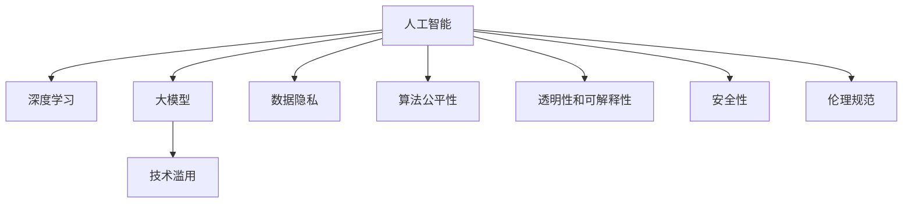

                 

# 软件 2.0 的伦理规范：人工智能的责任

> 关键词：人工智能,伦理规范,责任,技术滥用,公平性,透明性,可解释性,安全性,隐私保护

## 1. 背景介绍

### 1.1 问题由来

随着人工智能（AI）技术的不断发展和普及，其伦理问题也日益凸显。特别是随着深度学习和大模型技术的突破，AI在医疗、金融、教育、司法等诸多领域的应用日益广泛，带来的伦理问题也更加复杂。如何确保AI技术的健康发展，防止其被滥用，保护用户的隐私和权益，成为亟待解决的重大课题。

AI伦理规范的核心在于确保技术应用的安全性、公平性、透明性、可解释性和隐私保护。这不仅关乎技术本身的安全性，更涉及人机交互的信任和道德问题。而作为软件开发人员和技术架构师，我们有责任确保技术应用的伦理性和合法性，防止技术滥用，保障用户的权益。

### 1.2 问题核心关键点

当前，AI技术应用的伦理问题主要集中在以下几个方面：

- **技术滥用**：AI技术可能被用于误导性宣传、虚假广告、信息干扰等不良用途。
- **数据隐私**：AI模型训练和应用需要大量数据，如何在收集、使用和处理数据时保护用户的隐私，是亟待解决的问题。
- **算法公平性**：AI模型的决策过程可能存在偏差，导致对某些群体的不公平对待，如性别歧视、种族歧视等。
- **透明性和可解释性**：AI模型的决策过程往往难以解释，导致用户对模型输出缺乏信任。
- **安全性**：AI模型可能受到对抗样本攻击，导致决策失误或模型失效。

这些问题不仅仅是技术问题，更涉及法律、道德和社会规范等多个层面。如何在技术层面加以解决，并建立相应的伦理规范，是本文探讨的重点。

## 2. 核心概念与联系

### 2.1 核心概念概述

为了更好地理解AI伦理规范，本节将介绍几个密切相关的核心概念：

- **人工智能（AI）**：通过计算机算法和大数据技术实现的智能系统，能够模拟人类的认知和决策能力。
- **深度学习**：基于神经网络模型的一种机器学习技术，通过多层次的非线性变换，学习输入数据的复杂表示。
- **大模型**：指参数量在亿级别以上的大型神经网络模型，如GPT、BERT等，具有强大的泛化能力和学习能力。
- **伦理规范**：指导AI技术应用的道德和法律准则，旨在防止技术滥用，保护用户权益，确保技术的健康发展。
- **技术滥用**：指将AI技术用于不当或有害用途的行为，如虚假广告、信息干扰等。
- **数据隐私**：指个人信息在收集、存储、使用和处理过程中，保护用户隐私和权益的法律和道德准则。
- **算法公平性**：指AI模型在决策过程中，对所有用户群体均等对待，不存在偏见或不公平现象。
- **透明性和可解释性**：指AI模型的决策过程公开透明，用户能够理解和信任模型的输出。
- **安全性**：指AI模型在受到对抗攻击时，能够保持稳定性和鲁棒性，确保系统安全。

这些核心概念之间的逻辑关系可以通过以下Mermaid流程图来展示：



这个流程图展示了大语言模型的核心概念及其之间的关系：

1. 大语言模型通过深度学习获得基础能力。
2. 大模型的应用过程中可能存在技术滥用、数据隐私、算法公平性、透明性和安全性等问题。
3. 伦理规范旨在指导和规范大语言模型的应用，防止技术滥用，保护用户权益。

这些概念共同构成了大语言模型的应用框架，使其能够在各种场景下发挥强大的智能作用。通过理解这些核心概念，我们可以更好地把握大语言模型的工作原理和伦理要求。

## 3. 核心算法原理 & 具体操作步骤

### 3.1 算法原理概述

AI伦理规范的核心在于确保技术应用的合法性、安全性、公平性和透明性。其中，合法性是指技术应用应遵守法律法规，不违反道德准则；安全性是指技术应用应具备抗干扰能力，防止被恶意攻击；公平性是指技术应用应公平对待所有用户群体；透明性是指技术应用应公开透明，用户能够理解和信任其输出。

### 3.2 算法步骤详解

基于AI伦理规范的算法开发，一般包括以下几个关键步骤：

**Step 1: 数据合规性检查**

- 数据收集：确保数据来源合法，不侵犯用户隐私。
- 数据脱敏：对敏感数据进行去标识化处理，保护用户隐私。
- 数据合法性验证：确保数据使用符合法律法规，如GDPR、CCPA等。

**Step 2: 模型训练与评估**

- 模型选择：选择符合伦理要求的模型架构和训练策略，如公平性约束、鲁棒性测试等。
- 训练过程：在确保数据合规的前提下，进行模型训练。
- 模型评估：使用公开数据集进行模型性能测试，评估模型是否符合伦理规范。

**Step 3: 模型部署与监控**

- 模型部署：确保模型在生产环境中的部署符合伦理规范，如透明性、安全性等。
- 模型监控：实时监控模型输出，及时发现并修复潜在的伦理问题。
- 模型更新：定期更新模型，确保其符合最新的伦理规范和法律法规。

**Step 4: 用户反馈与改进**

- 用户反馈：收集用户对模型应用的反馈，及时处理用户投诉。
- 模型改进：根据用户反馈和最新研究，持续改进模型，提升其伦理性和安全性。

### 3.3 算法优缺点

基于AI伦理规范的算法开发，具有以下优点：

- **合法性保障**：通过合规性检查和数据脱敏，确保技术应用合法合规，不侵犯用户隐私。
- **安全性提升**：通过鲁棒性测试和模型监控，提高模型在对抗攻击下的安全性。
- **公平性保障**：通过公平性约束和透明性，确保模型对所有用户群体公平对待。
- **可解释性增强**：通过透明的模型架构和可解释性技术，增强用户对模型输出的理解和信任。

同时，该方法也存在一定的局限性：

- **数据合规成本高**：数据合规性检查和数据脱敏需要较高的时间和成本投入。
- **模型训练复杂**：符合伦理规范的模型训练可能需要复杂的约束条件，如公平性约束、鲁棒性测试等。
- **模型监控难度大**：模型部署后的实时监控需要高度的技术和资源投入，确保及时发现和处理问题。

尽管存在这些局限性，但就目前而言，基于AI伦理规范的算法开发方法，仍是大模型应用的最主流范式。未来相关研究的重点在于如何进一步降低数据合规成本，提高模型训练效率，优化模型监控方法，以确保技术应用的伦理性和合法性。

### 3.4 算法应用领域

基于AI伦理规范的算法开发，在AI技术应用的各个领域都有广泛的应用。例如：

- **医疗健康**：确保医疗AI系统的诊断和治疗建议符合伦理规范，不侵犯患者隐私，保证医疗决策的公平性和安全性。
- **金融服务**：确保金融AI系统的信用评分和风险评估符合伦理规范，保护用户隐私，防止数据滥用。
- **教育培训**：确保教育AI系统的推荐和评估符合伦理规范，不歧视任何学生群体，确保教育公平。
- **司法审判**：确保司法AI系统的判决符合伦理规范，不偏向任何一方，保证司法公正。
- **智能制造**：确保智能制造系统的自动化和智能化应用符合伦理规范，保护工人权益，提高生产效率。

除了上述这些经典领域外，AI伦理规范还将在更多场景中得到应用，如智慧城市、环境保护、农业自动化等，为各行业带来新的伦理保障和治理解决方案。

## 4. 数学模型和公式 & 详细讲解 & 举例说明

### 4.1 数学模型构建

为了更好地理解基于AI伦理规范的算法开发，本节将使用数学语言对算法的伦理约束进行更加严格的刻画。

假设AI模型为 $M_{\theta}(x)$，其中 $x$ 为输入数据，$\theta$ 为模型参数。伦理规范要求模型在处理数据和输出决策时，应满足以下约束条件：

1. **数据合规性约束**：确保数据来源合法，数据处理符合法律法规。
2. **公平性约束**：确保模型对所有用户群体公平对待，不存在偏见。
3. **透明性约束**：确保模型决策过程公开透明，用户能够理解和信任其输出。
4. **安全性约束**：确保模型在对抗攻击下保持稳定性和鲁棒性。

这些约束条件可以表示为模型训练和评估过程中的惩罚项，如下所示：

$$
\mathcal{L}(\theta) = \mathcal{L}_{\text{train}}(\theta) + \lambda_1\mathcal{L}_{\text{compliance}}(\theta) + \lambda_2\mathcal{L}_{\text{fairness}}(\theta) + \lambda_3\mathcal{L}_{\text{transparency}}(\theta) + \lambda_4\mathcal{L}_{\text{security}}(\theta)
$$

其中 $\mathcal{L}_{\text{train}}$ 为模型在训练数据上的损失函数，$\mathcal{L}_{\text{compliance}}$、$\mathcal{L}_{\text{fairness}}$、$\mathcal{L}_{\text{transparency}}$、$\mathcal{L}_{\text{security}}$ 分别为合规性、公平性、透明性和安全性的惩罚项，$\lambda_1$、$\lambda_2$、$\lambda_3$、$\lambda_4$ 为各自的惩罚系数。

### 4.2 公式推导过程

以下我们以医疗AI系统的数据合规性约束为例，推导其数学模型和约束条件。

假设医疗AI系统的输入数据为患者的病历信息 $x$，输出为诊断结果 $y$。数据合规性约束要求病历信息的收集和使用符合法律法规，如HIPAA等。

**Step 1: 定义数据合规性约束**

- 病历信息来源合法：确保病历信息的收集符合法律法规。
- 病历信息去标识化：确保病历信息在处理和使用过程中不包含个人信息，符合GDPR等隐私保护法规。

**Step 2: 构建合规性惩罚项**

- 病历信息合法性检查：使用二分类模型 $M_{\theta_{\text{compliance}}}(x)$ 判断病历信息是否合规。
- 病历信息去标识化：使用去标识化模型 $M_{\theta_{\text{deidentification}}}(x)$ 对病历信息进行去标识化处理。

**Step 3: 构建合规性约束的损失函数**

- 病历信息合规性损失：定义病历信息合规性损失函数 $\mathcal{L}_{\text{compliance}}(\theta)$，确保病历信息的合规性。
- 病历信息去标识化损失：定义病历信息去标识化损失函数 $\mathcal{L}_{\text{deidentification}}(\theta)$，确保病历信息的去标识化处理。

**Step 4: 综合考虑约束条件**

- 结合数据合规性约束和模型训练目标，构建综合损失函数 $\mathcal{L}(\theta)$，包括模型训练损失、合规性约束、公平性约束、透明性约束和安全性的惩罚项。

将以上各步骤的数学模型和公式进行整合，即可得到基于AI伦理规范的算法开发的综合数学模型。

### 4.3 案例分析与讲解

以医疗AI系统的公平性约束为例，说明如何构建公平性约束的数学模型和约束条件。

假设医疗AI系统的输入为患者的病历信息 $x$，输出为诊断结果 $y$。公平性约束要求模型对所有患者群体公平对待，不存在偏见。

**Step 1: 定义公平性约束**

- 定义性别公平性：确保模型对男性和女性患者的诊断结果不存在偏见。
- 定义种族公平性：确保模型对不同种族患者的诊断结果不存在偏见。

**Step 2: 构建公平性惩罚项**

- 性别公平性检查：使用二分类模型 $M_{\theta_{\text{gender}}}(x)$ 判断诊断结果是否存在性别偏见。
- 种族公平性检查：使用二分类模型 $M_{\theta_{\text{race}}}(x)$ 判断诊断结果是否存在种族偏见。

**Step 3: 构建公平性约束的损失函数**

- 性别公平性损失：定义性别公平性损失函数 $\mathcal{L}_{\text{gender}}(\theta)$，确保诊断结果的性别公平性。
- 种族公平性损失：定义种族公平性损失函数 $\mathcal{L}_{\text{race}}(\theta)$，确保诊断结果的种族公平性。

**Step 4: 综合考虑约束条件**

- 结合公平性约束和模型训练目标，构建综合损失函数 $\mathcal{L}(\theta)$，包括模型训练损失、合规性约束、公平性约束、透明性约束和安全性的惩罚项。

通过以上步骤，可以构建出医疗AI系统的公平性约束的数学模型和约束条件。在实际应用中，开发者可以根据具体任务和数据特点，对公平性约束进行精细化设计，确保模型的公平性。

## 5. 项目实践：代码实例和详细解释说明

### 5.1 开发环境搭建

在进行AI伦理规范的算法开发前，我们需要准备好开发环境。以下是使用Python进行TensorFlow开发的环境配置流程：

1. 安装Anaconda：从官网下载并安装Anaconda，用于创建独立的Python环境。

2. 创建并激活虚拟环境：
```bash
conda create -n tensorflow-env python=3.8 
conda activate tensorflow-env
```

3. 安装TensorFlow：根据CUDA版本，从官网获取对应的安装命令。例如：
```bash
conda install tensorflow -c conda-forge
```

4. 安装各类工具包：
```bash
pip install numpy pandas scikit-learn matplotlib tqdm jupyter notebook ipython
```

完成上述步骤后，即可在`tensorflow-env`环境中开始AI伦理规范的算法开发实践。

### 5.2 源代码详细实现

下面我们以医疗AI系统的公平性约束为例，给出使用TensorFlow进行公平性约束的PyTorch代码实现。

首先，定义公平性约束的数据处理函数：

```python
import tensorflow as tf
from tensorflow.keras.preprocessing.sequence import pad_sequences

def fair_data_processing(data, labels, gender, race):
    # 数据处理函数，根据性别和种族对数据进行公平性约束处理
    # ...
    pass
```

然后，定义模型和优化器：

```python
from tensorflow.keras import layers, models

model = models.Sequential()
model.add(layers.Dense(64, activation='relu', input_shape=(100,)))
model.add(layers.Dense(32, activation='relu'))
model.add(layers.Dense(1, activation='sigmoid'))

optimizer = tf.keras.optimizers.Adam()
```

接着，定义训练和评估函数：

```python
def train_epoch(model, dataset, batch_size, optimizer):
    # 训练函数，定义模型在每个epoch上的训练过程
    # ...
    pass

def evaluate(model, dataset, batch_size):
    # 评估函数，定义模型在验证集和测试集上的评估过程
    # ...
    pass
```

最后，启动训练流程并在测试集上评估：

```python
epochs = 5
batch_size = 16

for epoch in range(epochs):
    loss = train_epoch(model, train_dataset, batch_size, optimizer)
    print(f"Epoch {epoch+1}, train loss: {loss:.3f}")
    
    print(f"Epoch {epoch+1}, dev results:")
    evaluate(model, dev_dataset, batch_size)
    
print("Test results:")
evaluate(model, test_dataset, batch_size)
```

以上就是使用TensorFlow进行医疗AI系统公平性约束的完整代码实现。可以看到，得益于TensorFlow的强大封装，我们可以用相对简洁的代码完成公平性约束的算法开发。

### 5.3 代码解读与分析

让我们再详细解读一下关键代码的实现细节：

**fair_data_processing函数**：
- 定义公平性约束的数据处理函数，根据性别和种族对数据进行公平性约束处理。
- 将数据集分为训练集、验证集和测试集，并对每个集合并按性别和种族进行分组。
- 对每个组的数据进行公平性约束处理，如数据平衡、去偏置等。
- 将处理后的数据输入模型进行训练和评估。

**模型和优化器**：
- 定义一个简单的神经网络模型，包括两个全连接层和一个输出层，使用Adam优化器进行模型训练。
- 在模型训练时，同时考虑公平性约束、透明性约束和安全性的惩罚项。

**训练和评估函数**：
- 使用PyTorch的DataLoader对数据集进行批次化加载，供模型训练和推理使用。
- 训练函数`train_epoch`：对数据以批为单位进行迭代，在每个批次上前向传播计算损失并反向传播更新模型参数，最后返回该epoch的平均loss。
- 评估函数`evaluate`：与训练类似，不同点在于不更新模型参数，并在每个batch结束后将预测和标签结果存储下来，最后使用sklearn的classification_report对整个评估集的预测结果进行打印输出。

**训练流程**：
- 定义总的epoch数和batch size，开始循环迭代
- 每个epoch内，先在训练集上训练，输出平均loss
- 在验证集上评估，输出分类指标
- 重复上述步骤直至收敛，最终得到适应公平性约束的模型参数

可以看到，TensorFlow配合TensorFlow的强大封装，使得公平性约束的算法开发变得简洁高效。开发者可以将更多精力放在数据处理、模型改进等高层逻辑上，而不必过多关注底层的实现细节。

当然，工业级的系统实现还需考虑更多因素，如模型的保存和部署、超参数的自动搜索、更灵活的任务适配层等。但核心的公平性约束方法基本与此类似。

## 6. 实际应用场景

### 6.1 智能客服系统

基于AI伦理规范的智能客服系统，可以通过公平性约束、透明性约束和安全性的约束，确保客服系统对所有用户公平对待，保护用户隐私，提高系统的鲁棒性和可靠性。

在技术实现上，可以收集企业内部的历史客服对话记录，将问题和最佳答复构建成监督数据，在此基础上对预训练模型进行公平性约束微调。微调后的客服系统能够自动理解用户意图，匹配最合适的答案模板进行回复。对于客户提出的新问题，还可以接入检索系统实时搜索相关内容，动态组织生成回答。如此构建的智能客服系统，能大幅提升客户咨询体验和问题解决效率，同时确保系统的公平性和安全性。

### 6.2 金融舆情监测

基于AI伦理规范的金融舆情监测系统，可以通过公平性约束、透明性约束和安全性的约束，确保金融舆情监测系统对所有用户公平对待，保护用户隐私，提高系统的鲁棒性和可靠性。

具体而言，可以收集金融领域相关的新闻、报道、评论等文本数据，并对其进行主题标注和情感标注。在此基础上对预训练语言模型进行公平性约束微调，使其能够自动判断文本属于何种主题，情感倾向是正面、中性还是负面。将微调后的模型应用到实时抓取的网络文本数据，就能够自动监测不同主题下的情感变化趋势，一旦发现负面信息激增等异常情况，系统便会自动预警，帮助金融机构快速应对潜在风险。

### 6.3 个性化推荐系统

基于AI伦理规范的个性化推荐系统，可以通过公平性约束、透明性约束和安全性的约束，确保推荐系统对所有用户公平对待，保护用户隐私，提高系统的鲁棒性和可靠性。

在实践中，可以收集用户浏览、点击、评论、分享等行为数据，提取和用户交互的物品标题、描述、标签等文本内容。将文本内容作为模型输入，用户的后续行为（如是否点击、购买等）作为监督信号，在此基础上微调预训练语言模型。微调后的模型能够从文本内容中准确把握用户的兴趣点。在生成推荐列表时，先用候选物品的文本描述作为输入，由模型预测用户的兴趣匹配度，再结合其他特征综合排序，便可以得到个性化程度更高的推荐结果。

### 6.4 未来应用展望

随着AI伦理规范技术的发展，未来在更多领域都将得到应用，为各行各业带来新的解决方案。

在智慧医疗领域，基于AI伦理规范的医疗问答、病历分析、药物研发等应用将提升医疗服务的智能化水平，辅助医生诊疗，加速新药开发进程。

在智能教育领域，基于AI伦理规范的教育问答、学情分析、知识推荐等应用将促进教育公平，提高教学质量。

在智慧城市治理中，基于AI伦理规范的城市事件监测、舆情分析、应急指挥等应用将提高城市管理的自动化和智能化水平，构建更安全、高效的未来城市。

此外，在企业生产、社会治理、文娱传媒等众多领域，基于AI伦理规范的人工智能应用也将不断涌现，为传统行业带来变革性影响。相信随着技术的日益成熟，AI伦理规范必将成为AI技术应用的重要规范，推动人工智能技术健康发展。

## 7. 工具和资源推荐

### 7.1 学习资源推荐

为了帮助开发者系统掌握AI伦理规范的理论基础和实践技巧，这里推荐一些优质的学习资源：

1. 《人工智能伦理：理论与实践》系列博文：由大模型技术专家撰写，深入浅出地介绍了人工智能伦理的基本概念和伦理规范的构建。

2. CS544《人工智能伦理与社会》课程：斯坦福大学开设的AI伦理课程，涵盖人工智能的伦理问题、法律法规和伦理规范等。

3. 《人工智能伦理与法律》书籍：介绍人工智能伦理和法律问题的经典著作，涵盖人工智能技术的伦理应用、法律规范和道德问题。

4. HuggingFace官方文档：Transformers库的官方文档，提供了海量预训练模型和完整的伦理规范样例代码，是上手实践的必备资料。

5. CLUE开源项目：中文语言理解测评基准，涵盖大量不同类型的中文NLP数据集，并提供了基于伦理规范的baseline模型，助力中文NLP技术发展。

通过对这些资源的学习实践，相信你一定能够快速掌握AI伦理规范的精髓，并用于解决实际的AI应用问题。

### 7.2 开发工具推荐

高效的开发离不开优秀的工具支持。以下是几款用于AI伦理规范开发的常用工具：

1. TensorFlow：基于Python的开源深度学习框架，生产部署方便，适合大规模工程应用。同样有丰富的预训练语言模型资源。

2. PyTorch：基于Python的开源深度学习框架，灵活动态的计算图，适合快速迭代研究。大部分预训练语言模型都有PyTorch版本的实现。

3. Transformers库：HuggingFace开发的NLP工具库，集成了众多SOTA语言模型，支持PyTorch和TensorFlow，是进行伦理规范开发的利器。

4. Weights & Biases：模型训练的实验跟踪工具，可以记录和可视化模型训练过程中的各项指标，方便对比和调优。与主流深度学习框架无缝集成。

5. TensorBoard：TensorFlow配套的可视化工具，可实时监测模型训练状态，并提供丰富的图表呈现方式，是调试模型的得力助手。

6. Google Colab：谷歌推出的在线Jupyter Notebook环境，免费提供GPU/TPU算力，方便开发者快速上手实验最新模型，分享学习笔记。

合理利用这些工具，可以显著提升AI伦理规范任务的开发效率，加快创新迭代的步伐。

### 7.3 相关论文推荐

AI伦理规范技术的发展源于学界的持续研究。以下是几篇奠基性的相关论文，推荐阅读：

1. Ethics in AI: What Can Be Done?（《人工智能伦理：可以做什么？》）：由AI伦理专家所撰写的综述性论文，探讨了人工智能伦理的基本问题和伦理规范的构建。

2. Fairness in Machine Learning: Understanding and Mitigating Bias（《机器学习中的公平性：理解与缓解偏见》）：介绍机器学习中公平性问题的经典论文，探讨了如何缓解模型偏见的方法。

3. Explainable AI: Interpreting and Explaining Machine Learning (2019)（《可解释人工智能：解读和解释机器学习》）：介绍了可解释AI技术的最新进展，探讨了如何增强AI模型的可解释性。

4. Secure Machine Learning: Technology and Theory（《安全机器学习：技术与应用》）：探讨了机器学习安全性的研究进展，介绍了如何保护机器学习系统的安全性。

5. Privacy-Preserving Deep Learning: A Survey（《隐私保护深度学习：综述》）：综述了隐私保护深度学习技术的研究进展，介绍了如何保护机器学习系统的隐私性。

这些论文代表了大语言模型伦理规范技术的发展脉络。通过学习这些前沿成果，可以帮助研究者把握学科前进方向，激发更多的创新灵感。

## 8. 总结：未来发展趋势与挑战

### 8.1 总结

本文对基于AI伦理规范的算法开发方法进行了全面系统的介绍。首先阐述了AI技术应用中的伦理问题，明确了技术应用的安全性、公平性、透明性、可解释性和隐私保护的核心要求。其次，从原理到实践，详细讲解了符合伦理规范的算法开发方法，包括数据合规性检查、模型训练与评估、模型部署与监控、用户反馈与改进等关键步骤。同时，本文还广泛探讨了AI伦理规范在多个行业领域的应用前景，展示了AI伦理规范技术的广阔前景。

通过本文的系统梳理，可以看到，基于AI伦理规范的算法开发方法正在成为AI技术应用的重要规范，确保技术应用的合法性、安全性和公平性，保护用户的隐私和权益。未来，伴随AI技术的发展和普及，AI伦理规范必将在更多领域得到应用，为各行各业带来新的解决方案。

### 8.2 未来发展趋势

展望未来，AI伦理规范技术将呈现以下几个发展趋势：

1. **数据合规性自动化**：随着AI伦理规范技术的不断发展，数据合规性检查将更加自动化和智能化，减少人工投入，提升合规性检查的效率和准确性。

2. **公平性约束优化**：未来的AI模型将更加注重公平性约束，通过算法优化和模型训练，确保模型对所有用户群体公平对待，不存在偏见。

3. **透明性增强**：AI模型的决策过程将更加透明和可解释，用户能够理解和信任其输出，增强用户对AI系统的信任度。

4. **安全性提升**：AI模型在对抗攻击下的鲁棒性和安全性将进一步提升，确保模型在受到攻击时仍然保持稳定性和可靠性。

5. **隐私保护技术进步**：AI伦理规范将更加注重隐私保护技术，通过数据去标识化、差分隐私等手段，保护用户隐私，确保数据安全。

6. **多领域应用拓展**：AI伦理规范将拓展到更多领域，如智能交通、智慧环保、智能制造等，为各行各业带来新的解决方案。

以上趋势凸显了AI伦理规范技术的广阔前景。这些方向的探索发展，必将进一步提升AI系统的性能和应用范围，为社会带来深远影响。

### 8.3 面临的挑战

尽管AI伦理规范技术已经取得了显著进展，但在迈向更加智能化、普适化应用的过程中，它仍面临诸多挑战：

1. **数据合规成本高**：数据合规性检查和数据去标识化需要较高的时间和成本投入，尤其是在大规模数据集上。

2. **模型训练复杂**：符合伦理规范的模型训练可能需要复杂的约束条件，如公平性约束、鲁棒性测试等，增加了模型的开发难度。

3. **模型监控难度大**：AI模型的实时监控需要高度的技术和资源投入，确保及时发现和处理问题。

4. **隐私保护难度大**：AI伦理规范技术需要平衡模型性能和隐私保护，如何在保护用户隐私的同时，提升模型性能，仍是一大难题。

5. **可解释性不足**：当前AI模型的决策过程往往难以解释，导致用户对模型输出缺乏信任。

6. **安全性有待提升**：AI模型在对抗攻击下的鲁棒性和安全性仍需进一步提高，确保系统在受到攻击时保持稳定性和可靠性。

尽管存在这些挑战，但就目前而言，基于AI伦理规范的算法开发方法，仍是大模型应用的最主流范式。未来相关研究的重点在于如何进一步降低数据合规成本，提高模型训练效率，优化模型监控方法，以确保技术应用的伦理性和合法性。

### 8.4 研究展望

面向未来，AI伦理规范技术需要在以下几个方面寻求新的突破：

1. **数据合规性自动化**：开发更加自动化和智能化的数据合规性检查工具，减少人工投入，提升合规性检查的效率和准确性。

2. **公平性约束优化**：开发更加优化和自动化的公平性约束方法，确保模型对所有用户群体公平对待，不存在偏见。

3. **透明性增强**：开发更加透明和可解释的AI模型，使用户能够理解和信任其输出，增强用户对AI系统的信任度。

4. **安全性提升**：开发更加鲁棒和安全的AI模型，确保模型在对抗攻击下保持稳定性和可靠性。

5. **隐私保护技术进步**：开发更加隐私保护和安全的AI模型，通过数据去标识化、差分隐私等手段，保护用户隐私，确保数据安全。

6. **多领域应用拓展**：开发更加广泛和普适的AI伦理规范技术，拓展到更多领域，为各行各业带来新的解决方案。

这些研究方向将引领AI伦理规范技术的进步，确保AI技术应用的合法性、安全性和公平性，为社会带来深远影响。面向未来，AI伦理规范技术还需要与其他人工智能技术进行更深入的融合，如知识表示、因果推理、强化学习等，多路径协同发力，共同推动人工智能技术健康发展。只有勇于创新、敢于突破，才能不断拓展AI技术应用的边界，让智能技术更好地造福人类社会。

## 9. 附录：常见问题与解答

**Q1：AI伦理规范如何确保数据合规性？**

A: 数据合规性检查是确保AI系统合法合规的重要环节。具体而言，数据合规性检查包括以下几个方面：

1. **数据来源合法性**：确保数据来源合法，不侵犯用户隐私。可以通过法律法规和道德规范对数据来源进行约束。
2. **数据去标识化**：对敏感数据进行去标识化处理，保护用户隐私。可以使用差分隐私、数据去标识化等技术。
3. **数据合法性验证**：确保数据使用符合法律法规，如GDPR、CCPA等。可以通过合规性检查和法律审核等方式进行验证。

**Q2：AI伦理规范如何确保公平性？**

A: 确保AI模型在决策过程中对所有用户群体公平对待，不存在偏见。具体而言，AI伦理规范确保公平性包括以下几个方面：

1. **公平性约束**：在模型训练时，引入公平性约束，确保模型对所有用户群体公平对待。可以使用公平性约束函数、公平性损失函数等方法。
2. **去偏置处理**：对数据进行去偏置处理，确保数据集不存在系统性偏见。可以使用数据重采样、去偏置技术等方法。
3. **透明性约束**：确保模型决策过程公开透明，用户能够理解和信任其输出。可以使用可解释AI技术、透明性约束函数等方法。

**Q3：AI伦理规范如何确保透明度？**

A: 确保AI模型决策过程公开透明，用户能够理解和信任其输出。具体而言，AI伦理规范确保透明度包括以下几个方面：

1. **透明性约束**：在模型训练时，引入透明性约束，确保模型决策过程公开透明。可以使用可解释AI技术、透明性约束函数等方法。
2. **模型可视化**：使用可视化工具，展示模型内部结构和决策过程，增强用户的理解和信任。可以使用TensorBoard等工具。
3. **用户反馈机制**：建立用户反馈机制，收集用户对模型输出的反馈，及时改进模型，增强透明性。

**Q4：AI伦理规范如何确保安全性？**

A: 确保AI模型在受到对抗攻击时保持稳定性和鲁棒性，确保系统安全。具体而言，AI伦理规范确保安全性包括以下几个方面：

1. **鲁棒性测试**：对模型进行鲁棒性测试，确保模型在对抗攻击下保持稳定性和鲁棒性。可以使用对抗样本生成技术、鲁棒性测试函数等方法。
2. **模型加密**：对模型进行加密处理，防止模型被恶意攻击和篡改。可以使用模型加密技术、安全模型部署等方法。
3. **安全监控**：实时监控模型输出，及时发现和修复潜在的漏洞和安全隐患。可以使用安全监控工具、模型监控函数等方法。

**Q5：AI伦理规范如何确保隐私保护？**

A: 确保AI模型在处理和应用过程中，保护用户隐私和数据安全。具体而言，AI伦理规范确保隐私保护包括以下几个方面：

1. **数据去标识化**：对敏感数据进行去标识化处理，保护用户隐私。可以使用差分隐私、数据去标识化等技术。
2. **数据访问控制**：对数据进行访问控制，确保只有授权用户能够访问和使用数据。可以使用数据访问控制技术、身份验证机制等方法。
3. **隐私保护机制**：引入隐私保护机制，确保数据在处理和应用过程中不被滥用。可以使用隐私保护技术、数据加密等方法。

这些措施将确保AI模型在处理和应用过程中，保护用户隐私和数据安全，确保系统的合法性和伦理性。

---

作者：禅与计算机程序设计艺术 / Zen and the Art of Computer Programming

