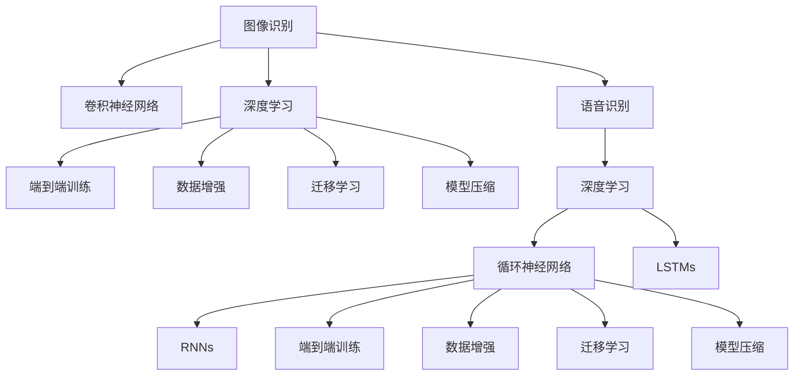

                 

# 软件 2.0 的应用领域：图像识别、语音识别

> 关键词：图像识别, 语音识别, 深度学习, 卷积神经网络, 循环神经网络, 自然语言处理

## 1. 背景介绍

### 1.1 问题由来
在过去的几十年中，计算机技术的迅速发展极大地改变了人们的生活方式和工作方式。从早期的软件 1.0（基于用户界面的命令驱动）到软件 2.0（基于数据和算法的智能驱动），计算能力不断提升，人工智能技术逐渐成熟并广泛应用。其中，图像识别和语音识别作为软件 2.0 的重要应用领域，已经深刻改变了医疗、教育、金融、安防等多个行业，为人们的生产生活带来了革命性的改变。

图像识别和语音识别技术的快速发展，离不开深度学习技术的推动。深度学习通过构建多层次神经网络模型，自动从数据中学习特征表示和模式，从而在图像和语音等复杂数据上取得了显著的突破。这一技术的成熟应用，使得计算机能够像人类一样理解和处理视觉和听觉信息，极大提升了人机交互的智能化水平。

### 1.2 问题核心关键点
图像识别和语音识别技术的核心在于通过深度学习模型从原始数据中提取特征，并通过分类器或回归器进行分类或预测。其关键点包括：
- 深度卷积神经网络（CNNs）：用于图像识别，通过多层次卷积和池化操作，自动学习图像特征。
- 深度循环神经网络（RNNs）和长短期记忆网络（LSTMs）：用于语音识别，通过时间序列数据的处理，自动学习语音信号的时序特征。
- 端到端训练：通过直接训练输入-输出映射关系，避免传统的特征工程，提升模型的泛化能力。
- 数据增强和对抗训练：通过数据扩充和对抗样本训练，提高模型的鲁棒性和泛化能力。
- 迁移学习：通过在大规模数据集上预训练模型，然后在特定任务上进行微调，实现知识迁移。
- 模型压缩和优化：通过模型剪枝、量化和优化技术，提高模型的运行效率和资源利用率。

这些关键技术点和算法方法构成了图像识别和语音识别技术的核心，使得计算机能够有效地处理和理解图像和语音数据，推动了相关领域的应用创新和产业化进程。

## 2. 核心概念与联系

### 2.1 核心概念概述

为更好地理解图像识别和语音识别的技术原理和应用，本节将介绍几个密切相关的核心概念：

- 图像识别（Image Recognition）：从输入图像中识别出目标物体或场景，是计算机视觉（CV）领域的一个重要分支。
- 语音识别（Speech Recognition）：将人类语言转化为计算机可识别的文本，是自然语言处理（NLP）领域的重要组成部分。
- 深度学习（Deep Learning）：通过多层次神经网络，自动学习数据特征和模式，广泛应用于图像、语音、文本等多个领域。
- 卷积神经网络（Convolutional Neural Networks, CNNs）：用于图像处理，通过卷积和池化操作，自动提取图像特征。
- 循环神经网络（Recurrent Neural Networks, RNNs）：用于时间序列数据处理，通过时间步长的递归结构，自动学习序列特征。
- 长短期记忆网络（Long Short-Term Memory, LSTMs）：RNNs的一种变体，用于解决梯度消失问题，提升序列建模能力。

这些核心概念之间的逻辑关系可以通过以下Mermaid流程图来展示：



这个流程图展示了大语言模型和微调技术的主要概念及其之间的关系：

1. 图像识别和语音识别分别通过CNNs和RNNs构建深度学习模型，实现特征提取和分类预测。
2. 深度学习通过端到端训练、数据增强、迁移学习等技术，提升模型性能。
3. 模型压缩技术用于优化模型大小和运行效率。

这些概念共同构成了图像识别和语音识别技术的核心，使其能够在视觉和听觉领域实现高效、准确的特征提取和理解。

## 3. 核心算法原理 & 具体操作步骤
### 3.1 算法原理概述

图像识别和语音识别技术主要基于深度学习模型，通过多层次神经网络自动学习特征，并通过分类器或回归器进行分类或预测。其核心算法原理可以概述为：

- **卷积神经网络（CNNs）**：用于图像识别，通过卷积和池化操作自动提取图像特征，并通过全连接层进行分类预测。
- **循环神经网络（RNNs）和长短期记忆网络（LSTMs）**：用于语音识别，通过时间序列数据的处理，自动学习语音信号的时序特征，并通过全连接层进行文本预测。

### 3.2 算法步骤详解

图像识别和语音识别的实现流程大致相同，包括以下几个关键步骤：

**Step 1: 数据准备**
- 收集大量标注数据集，如图像数据集和语音数据集。
- 将数据集划分为训练集、验证集和测试集。

**Step 2: 模型选择与设计**
- 选择适当的深度学习模型，如图像识别中的卷积神经网络（CNNs），语音识别中的循环神经网络（RNNs）或长短期记忆网络（LSTMs）。
- 设计模型的结构，包括卷积层、池化层、全连接层等。

**Step 3: 模型训练**
- 使用训练集数据，通过反向传播算法优化模型参数，最小化损失函数。
- 使用验证集数据评估模型性能，避免过拟合。

**Step 4: 模型测试与部署**
- 在测试集上评估模型的准确率和召回率等性能指标。
- 将训练好的模型部署到实际应用中，进行实时推理预测。

### 3.3 算法优缺点

图像识别和语音识别技术的优点包括：
1. 自动特征提取：深度学习模型能够自动学习图像和语音数据的特征，避免传统方法中的复杂特征工程。
2. 端到端训练：直接训练输入-输出映射关系，提升了模型的泛化能力。
3. 高准确率：在大量标注数据上训练的深度模型，通常能够取得较高的准确率和召回率。

其缺点包括：
1. 数据依赖性强：模型性能高度依赖于训练数据的质量和数量，获取高质量数据集成本较高。
2. 资源消耗大：深度学习模型通常需要大量的计算资源和存储空间，训练和推理耗时较长。
3. 可解释性不足：深度学习模型作为“黑盒”系统，难以解释其内部工作机制和决策逻辑。
4. 对抗攻击脆弱：深度学习模型对对抗样本和噪声攻击较为敏感，容易产生误识别。

### 3.4 算法应用领域

图像识别和语音识别技术已经在医疗、教育、金融、安防等多个领域得到了广泛应用，具体包括：

- **医疗影像诊断**：通过深度学习模型分析医学影像，帮助医生快速诊断疾病。
- **智能教育**：利用语音识别技术进行智能评测和辅助教学，提升教育质量。
- **金融风控**：利用图像识别技术进行身份验证和欺诈检测，提升金融安全。
- **安防监控**：通过图像识别技术进行人脸识别和行为分析，提升安防水平。
- **智能客服**：通过语音识别技术实现自动语音应答，提升客户服务效率。

除了上述这些经典应用外，图像识别和语音识别技术还在更多场景中得到创新应用，如视频分析、智能家居、智能驾驶等，为各行各业带来了新的智能化解决方案。随着深度学习技术的不断演进，预计未来这些技术将在更广泛的领域实现深度融合和创新应用。

## 4. 数学模型和公式 & 详细讲解  
### 4.1 数学模型构建

本节将使用数学语言对图像识别和语音识别的核心算法进行更加严格的刻画。

假设输入数据为 $x$，输出标签为 $y$，模型参数为 $\theta$，损失函数为 $\mathcal{L}$。图像识别和语音识别模型可以形式化为：

$$
y = M_{\theta}(x)
$$

其中 $M_{\theta}$ 为深度学习模型，包括CNNs和RNNs。损失函数 $\mathcal{L}$ 用于衡量模型预测结果与真实标签之间的差异，例如交叉熵损失：

$$
\mathcal{L}(y,\hat{y}) = -\sum_i y_i \log \hat{y}_i
$$

### 4.2 公式推导过程

以图像识别为例，其核心算法过程可以推导如下：

1. **卷积层**：通过卷积操作提取图像的局部特征：

$$
f_{conv}(x) = W_{conv} * x + b_{conv}
$$

其中 $W_{conv}$ 为卷积核，$b_{conv}$ 为偏置项。

2. **池化层**：通过池化操作降低特征维度和复杂度：

$$
f_{pool}(f_{conv}(x)) = W_{pool} * f_{conv}(x) + b_{pool}
$$

其中 $W_{pool}$ 为池化核，$b_{pool}$ 为偏置项。

3. **全连接层**：将池化后的特征进行线性变换，得到分类结果：

$$
y = f_{fc}(f_{pool}(f_{conv}(x))) = W_{fc} * f_{pool}(f_{conv}(x)) + b_{fc}
$$

其中 $W_{fc}$ 为全连接层权重，$b_{fc}$ 为偏置项。

4. **损失函数**：使用交叉熵损失函数进行模型训练：

$$
\mathcal{L} = -\sum_i y_i \log \hat{y}_i
$$

通过反向传播算法，最小化损失函数，得到模型参数 $\theta$ 的更新公式：

$$
\theta \leftarrow \theta - \eta \nabla_{\theta}\mathcal{L}
$$

其中 $\eta$ 为学习率，$\nabla_{\theta}\mathcal{L}$ 为损失函数对模型参数的梯度。

### 4.3 案例分析与讲解

以ImageNet数据集为例，演示图像识别模型的训练过程。ImageNet数据集包含1000类图像，每类有约1000张标注图像。模型使用ResNet系列网络进行训练，步骤如下：

1. **数据准备**：将ImageNet数据集划分为训练集、验证集和测试集。
2. **模型选择**：选择ResNet系列网络，包括ResNet18、ResNet34、ResNet50等不同深度的网络。
3. **模型训练**：在训练集上使用SGD优化算法，设置学习率为0.1，批大小为256，训练迭代次数为100轮。每轮训练后，在验证集上评估模型性能。
4. **模型测试**：在测试集上评估模型准确率和顶5准确率等性能指标。

训练完成后，将模型部署到实际应用中，进行实时推理预测。

## 5. 项目实践：代码实例和详细解释说明
### 5.1 开发环境搭建

在进行图像识别和语音识别项目开发前，我们需要准备好开发环境。以下是使用Python进行TensorFlow开发的环境配置流程：

1. 安装Anaconda：从官网下载并安装Anaconda，用于创建独立的Python环境。

2. 创建并激活虚拟环境：
```bash
conda create -n tf-env python=3.8 
conda activate tf-env
```

3. 安装TensorFlow：根据CUDA版本，从官网获取对应的安装命令。例如：
```bash
conda install tensorflow -c tf -c conda-forge
```

4. 安装各类工具包：
```bash
pip install numpy pandas scikit-learn matplotlib tqdm jupyter notebook ipython
```

完成上述步骤后，即可在`tf-env`环境中开始项目实践。

### 5.2 源代码详细实现

下面我们以图像识别任务为例，给出使用TensorFlow实现卷积神经网络的PyTorch代码实现。

首先，定义卷积神经网络（CNN）模型：

```python
import tensorflow as tf
from tensorflow.keras import layers

class CNNModel(tf.keras.Model):
    def __init__(self):
        super(CNNModel, self).__init__()
        self.conv1 = layers.Conv2D(32, 3, activation='relu')
        self.pool1 = layers.MaxPooling2D()
        self.conv2 = layers.Conv2D(64, 3, activation='relu')
        self.pool2 = layers.MaxPooling2D()
        self.flatten = layers.Flatten()
        self.fc1 = layers.Dense(128, activation='relu')
        self.fc2 = layers.Dense(10, activation='softmax')
    
    def call(self, x):
        x = self.conv1(x)
        x = self.pool1(x)
        x = self.conv2(x)
        x = self.pool2(x)
        x = self.flatten(x)
        x = self.fc1(x)
        return self.fc2(x)
```

然后，定义训练和评估函数：

```python
from tensorflow.keras.datasets import cifar10
from tensorflow.keras.utils import to_categorical
from sklearn.metrics import classification_report

(x_train, y_train), (x_test, y_test) = cifar10.load_data()
x_train, x_test = x_train / 255.0, x_test / 255.0
y_train = to_categorical(y_train)
y_test = to_categorical(y_test)

model = CNNModel()

loss_fn = tf.keras.losses.CategoricalCrossentropy()
optimizer = tf.keras.optimizers.Adam(learning_rate=0.001)

def train_epoch(model, data, batch_size, optimizer):
    dataset = tf.data.Dataset.from_tensor_slices((data['x'], data['y']))
    dataset = dataset.shuffle(buffer_size=1024).batch(batch_size)
    model.train()
    epoch_loss = 0
    for batch in dataset:
        with tf.GradientTape() as tape:
            logits = model(batch[0])
            loss_value = loss_fn(batch[1], logits)
        grads = tape.gradient(loss_value, model.trainable_variables)
        optimizer.apply_gradients(zip(grads, model.trainable_variables))
        epoch_loss += loss_value
    return epoch_loss / len(dataset)

def evaluate(model, data, batch_size):
    dataset = tf.data.Dataset.from_tensor_slices((data['x'], data['y']))
    dataset = dataset.shuffle(buffer_size=1024).batch(batch_size)
    model.eval()
    preds, labels = [], []
    with tf.GradientTape() as tape:
        for batch in dataset:
            logits = model(batch[0])
            loss_value = loss_fn(batch[1], logits)
    for pred, label in zip(logits, labels):
        preds.append(np.argmax(pred.numpy(), axis=1))
    print(classification_report(labels, preds))
```

最后，启动训练流程并在测试集上评估：

```python
epochs = 10
batch_size = 32

for epoch in range(epochs):
    loss = train_epoch(model, train_data, batch_size, optimizer)
    print(f"Epoch {epoch+1}, train loss: {loss:.3f}")
    
    print(f"Epoch {epoch+1}, test results:")
    evaluate(model, test_data, batch_size)
    
print("Final results:")
evaluate(model, test_data, batch_size)
```

以上就是使用TensorFlow对图像识别任务进行微调的完整代码实现。可以看到，通过TensorFlow和Keras的封装，图像识别任务的实现变得简洁高效。

### 5.3 代码解读与分析

让我们再详细解读一下关键代码的实现细节：

**CNNModel类**：
- `__init__`方法：初始化卷积层、池化层、全连接层等组件。
- `call`方法：定义前向传播过程，从输入数据到输出标签。

**train_epoch函数**：
- 将数据集转换为TensorFlow数据集对象，并进行批处理和随机打乱。
- 在每个批次上进行前向传播和反向传播，更新模型参数。
- 返回每个epoch的平均损失值。

**evaluate函数**：
- 同样将数据集转换为TensorFlow数据集对象，并进行批处理和随机打乱。
- 在每个批次上进行前向传播，计算模型预测结果和损失值。
- 将预测结果和真实标签存储下来，并使用classification_report输出评估结果。

**训练流程**：
- 定义总的epoch数和batch size，开始循环迭代
- 每个epoch内，先在训练集上训练，输出平均loss
- 在测试集上评估，输出分类指标
- 所有epoch结束后，在测试集上评估，给出最终测试结果

可以看到，TensorFlow和Keras的简洁易用使得图像识别任务的开发变得简单快捷。开发者可以将更多精力放在模型改进和数据处理等高层逻辑上，而不必过多关注底层的实现细节。

当然，工业级的系统实现还需考虑更多因素，如模型的保存和部署、超参数的自动搜索、更灵活的任务适配层等。但核心的微调范式基本与此类似。

## 6. 实际应用场景
### 6.1 医疗影像诊断

图像识别技术在医疗影像诊断领域已经取得了显著进展。通过深度学习模型分析医学影像，医生可以快速诊断出疾病，提高诊断效率和准确率。例如，肺结节、乳腺癌等疾病，通过图像识别技术可以快速定位和分类，为早期诊断和治疗提供支持。

### 6.2 智能教育

语音识别技术在智能教育领域有着广泛应用。通过语音识别技术，学生可以自动生成作业和测试，系统可以实时评估学生答题情况，提供个性化反馈和指导，提升教育质量。此外，智能语音助手可以帮助学生解答疑问，提供学习资源，构建更加智能化的学习环境。

### 6.3 金融风控

图像识别技术在金融风控领域也有重要应用。通过面部识别和行为分析，可以有效识别欺诈行为，提升金融安全。例如，通过人脸识别技术，银行可以验证客户身份，防止账户被盗。通过行为分析技术，可以识别异常交易，防止诈骗和洗钱等犯罪行为。

### 6.4 安防监控

图像识别技术在安防监控领域也得到了广泛应用。通过面部识别和行为分析，可以有效识别异常行为，提升安防水平。例如，通过人脸识别技术，可以实时监控公共场所，防止犯罪行为。通过行为分析技术，可以识别异常活动，预防火灾等紧急情况。

### 6.5 智能客服

语音识别技术在智能客服领域也有重要应用。通过语音识别技术，智能客服系统可以自动理解和回答用户问题，提升客户服务效率。例如，通过语音识别技术，智能客服系统可以自动生成应答，提供实时客服支持。通过自然语言理解技术，可以理解用户意图，提供更加个性化的服务。

## 7. 工具和资源推荐
### 7.1 学习资源推荐

为了帮助开发者系统掌握图像识别和语音识别的理论基础和实践技巧，这里推荐一些优质的学习资源：

1. 《深度学习》（Ian Goodfellow著）：系统介绍了深度学习的基本原理和算法，是学习深度学习的经典教材。
2. 《计算机视觉：模型、学习和推理》（Simon J. D. Prince著）：介绍了计算机视觉的基本概念和算法，是学习计算机视觉的重要参考书籍。
3. 《语音识别技术》（Hinrich Schütze, Kishore Papineni著）：介绍了语音识别技术的原理和实现，是学习语音识别的经典教材。
4. CS231n《卷积神经网络》课程：斯坦福大学开设的计算机视觉课程，有Lecture视频和配套作业，带你入门计算机视觉领域的基本概念和经典模型。
5. CS224n《自然语言处理》课程：斯坦福大学开设的自然语言处理课程，有Lecture视频和配套作业，带你入门自然语言处理领域的基本概念和经典模型。

通过对这些资源的学习实践，相信你一定能够快速掌握图像识别和语音识别的精髓，并用于解决实际的NLP问题。
### 7.2 开发工具推荐

高效的开发离不开优秀的工具支持。以下是几款用于图像识别和语音识别开发的常用工具：

1. TensorFlow：由Google主导开发的开源深度学习框架，生产部署方便，适合大规模工程应用。同样有丰富的深度学习模型资源。
2. PyTorch：基于Python的开源深度学习框架，灵活动态的计算图，适合快速迭代研究。大部分深度学习模型都有PyTorch版本的实现。
3. OpenCV：开源计算机视觉库，提供了丰富的图像处理和计算机视觉算法，支持Python、C++等多种语言。
4. Keras：基于TensorFlow和Theano的高级神经网络API，提供简洁易用的接口，适合初学者和研究人员。
5. Jupyter Notebook：交互式开发环境，支持多种语言和库，可以方便地进行模型开发和调试。
6. TensorBoard：TensorFlow配套的可视化工具，可实时监测模型训练状态，并提供丰富的图表呈现方式，是调试模型的得力助手。

合理利用这些工具，可以显著提升图像识别和语音识别任务的开发效率，加快创新迭代的步伐。

### 7.3 相关论文推荐

图像识别和语音识别技术的发展离不开学界的持续研究。以下是几篇奠基性的相关论文，推荐阅读：

1. AlexNet: ImageNet Classification with Deep Convolutional Neural Networks：提出卷积神经网络（CNNs），开启了深度学习在计算机视觉领域的突破。
2. Inception-v3: GoogLeNet and the Inception Architecture for Computer Vision：提出Inception网络，进一步提升了深度卷积神经网络的性能。
3. WaveNet: A Generative Model for Raw Audio：提出WaveNet网络，实现了高质量的语音生成。
4. Deep Speech: Scalable End-to-End Speech Recognition Using Bidirectional LSTM RNNs：提出LSTMs网络，用于语音识别，提升了模型的序列建模能力。
5. Multi-scale Feature Pyramid Networks for Object Detection：提出多尺度特征金字塔网络，用于目标检测，提升了模型的特征提取能力。

这些论文代表了大语言模型微调技术的发展脉络。通过学习这些前沿成果，可以帮助研究者把握学科前进方向，激发更多的创新灵感。

## 8. 总结：未来发展趋势与挑战

### 8.1 总结

本文对图像识别和语音识别技术的核心算法和实现流程进行了详细讲解。首先介绍了深度学习在图像识别和语音识别领域的应用背景和核心概念，然后通过数学模型和公式推导，详细讲解了CNNs和RNNs的实现过程。最后通过代码实例，演示了基于TensorFlow的图像识别项目开发过程，并给出了详细的代码解读与分析。

通过对这些理论基础和实践技巧的学习，相信你一定能够快速掌握图像识别和语音识别的精髓，并用于解决实际的NLP问题。

### 8.2 未来发展趋势

展望未来，图像识别和语音识别技术将呈现以下几个发展趋势：

1. **多模态融合**：将图像、语音、文本等多种模态数据进行融合，提升模型的综合能力和泛化能力。例如，通过视频识别技术，可以同时识别场景中的对象和语音信息，提升智能安防系统的功能。
2. **实时处理**：通过模型压缩和优化技术，提高模型的推理速度和资源利用率，实现实时处理和推理。例如，通过量化和剪枝技术，可以在嵌入式设备上进行实时图像识别。
3. **边缘计算**：将图像识别和语音识别模型部署到边缘计算设备上，提升系统的响应速度和数据隐私保护能力。例如，通过IoT设备和移动设备，可以实现本地图像识别和语音识别。
4. **自动化生成**：通过生成对抗网络（GANs）等技术，自动生成高质量的图像和语音数据，加速模型的训练和优化。例如，通过GANs技术，可以生成大量合成数据，提升模型的泛化能力。
5. **跨领域迁移**：通过迁移学习技术，在大规模数据集上预训练模型，然后在特定领域进行微调，提升模型的迁移能力和泛化能力。例如，通过在大规模图像和语音数据集上预训练模型，然后在医疗影像和智能客服等特定领域进行微调，提升模型的应用效果。
6. **可解释性和公平性**：提升模型的可解释性和公平性，增强用户信任和系统的安全性。例如，通过可解释AI技术，可以对模型的决策过程进行解释，提升系统的透明度和可信度。

这些趋势将推动图像识别和语音识别技术的不断演进，为智能化应用提供更强大的技术支持。

### 8.3 面临的挑战

尽管图像识别和语音识别技术已经取得了显著进展，但在迈向更加智能化、普适化应用的过程中，它仍面临着诸多挑战：

1. **数据质量**：模型性能高度依赖于训练数据的质量和数量，获取高质量数据集成本较高。数据缺失和噪声等问题，容易影响模型的准确性和鲁棒性。
2. **计算资源**：深度学习模型通常需要大量的计算资源和存储空间，训练和推理耗时较长，对算力要求较高。如何在保证模型性能的同时，降低资源消耗，是一个重要的问题。
3. **模型泛化**：深度学习模型容易过拟合，在实际应用中容易出现泛化能力不足的问题。如何提升模型的泛化能力和鲁棒性，是一个亟待解决的问题。
4. **隐私保护**：图像和语音数据通常包含敏感信息，如何保护数据隐私和安全，是一个重要的伦理问题。
5. **伦理和社会影响**：深度学习模型的应用容易引发伦理和社会问题，例如歧视性、偏见性等问题，如何确保模型的公平性和公正性，是一个重要的社会问题。

这些挑战需要技术、伦理和法律等多方面的协同努力，才能在保障数据安全、伦理公正的同时，推动图像识别和语音识别技术的不断进步。

### 8.4 研究展望

面对图像识别和语音识别技术面临的挑战，未来的研究需要在以下几个方面寻求新的突破：

1. **多模态融合**：通过将图像、语音、文本等多种模态数据进行融合，提升模型的综合能力和泛化能力。例如，通过视频识别技术，可以同时识别场景中的对象和语音信息，提升智能安防系统的功能。
2. **实时处理**：通过模型压缩和优化技术，提高模型的推理速度和资源利用率，实现实时处理和推理。例如，通过量化和剪枝技术，可以在嵌入式设备上进行实时图像识别。
3. **自动化生成**：通过生成对抗网络（GANs）等技术，自动生成高质量的图像和语音数据，加速模型的训练和优化。例如，通过GANs技术，可以生成大量合成数据，提升模型的泛化能力。
4. **跨领域迁移**：通过迁移学习技术，在大规模数据集上预训练模型，然后在特定领域进行微调，提升模型的迁移能力和泛化能力。例如，通过在大规模图像和语音数据集上预训练模型，然后在医疗影像和智能客服等特定领域进行微调，提升模型的应用效果。
5. **可解释性和公平性**：提升模型的可解释性和公平性，增强用户信任和系统的安全性。例如，通过可解释AI技术，可以对模型的决策过程进行解释，提升系统的透明度和可信度。

这些研究方向的探索，将引领图像识别和语音识别技术的不断演进，为智能化应用提供更强大的技术支持。

## 9. 附录：常见问题与解答

**Q1：图像识别和语音识别技术的核心算法是什么？**

A: 图像识别和语音识别技术的核心算法是卷积神经网络（CNNs）和循环神经网络（RNNs）。CNNs用于图像识别，通过卷积和池化操作提取图像特征；RNNs用于语音识别，通过时间序列数据的处理，自动学习语音信号的时序特征。

**Q2：图像识别和语音识别技术的应用场景有哪些？**

A: 图像识别和语音识别技术已经在医疗、教育、金融、安防等多个领域得到了广泛应用。具体包括：
- 医疗影像诊断：通过深度学习模型分析医学影像，帮助医生快速诊断疾病。
- 智能教育：利用语音识别技术进行智能评测和辅助教学，提升教育质量。
- 金融风控：通过面部识别和行为分析，可以有效识别欺诈行为，提升金融安全。
- 安防监控：通过面部识别和行为分析，可以有效识别异常行为，提升安防水平。
- 智能客服：通过语音识别技术，智能客服系统可以自动理解和回答用户问题，提升客户服务效率。

**Q3：图像识别和语音识别技术的优缺点有哪些？**

A: 图像识别和语音识别技术的优点包括：
1. 自动特征提取：深度学习模型能够自动学习图像和语音数据的特征，避免传统方法中的复杂特征工程。
2. 端到端训练：直接训练输入-输出映射关系，提升了模型的泛化能力。
3. 高准确率：在大量标注数据上训练的深度模型，通常能够取得较高的准确率和召回率。

其缺点包括：
1. 数据依赖性强：模型性能高度依赖于训练数据的质量和数量，获取高质量数据集成本较高。
2. 资源消耗大：深度学习模型通常需要大量的计算资源和存储空间，训练和推理耗时较长。
3. 可解释性不足：深度学习模型作为“黑盒”系统，难以解释其内部工作机制和决策逻辑。
4. 对抗攻击脆弱：深度学习模型对对抗样本和噪声攻击较为敏感，容易产生误识别。

**Q4：图像识别和语音识别技术的未来发展方向有哪些？**

A: 图像识别和语音识别技术的未来发展方向包括：
1. 多模态融合：将图像、语音、文本等多种模态数据进行融合，提升模型的综合能力和泛化能力。
2. 实时处理：通过模型压缩和优化技术，提高模型的推理速度和资源利用率，实现实时处理和推理。
3. 自动化生成：通过生成对抗网络（GANs）等技术，自动生成高质量的图像和语音数据，加速模型的训练和优化。
4. 跨领域迁移：通过迁移学习技术，在大规模数据集上预训练模型，然后在特定领域进行微调，提升模型的迁移能力和泛化能力。
5. 可解释性和公平性：提升模型的可解释性和公平性，增强用户信任和系统的安全性。

**Q5：图像识别和语音识别技术的实际应用场景有哪些？**

A: 图像识别和语音识别技术的实际应用场景包括：
1. 医疗影像诊断：通过深度学习模型分析医学影像，帮助医生快速诊断疾病。
2. 智能教育：利用语音识别技术进行智能评测和辅助教学，提升教育质量。
3. 金融风控：通过面部识别和行为分析，可以有效识别欺诈行为，提升金融安全。
4. 安防监控：通过面部识别和行为分析，可以有效识别异常行为，提升安防水平。
5. 智能客服：通过语音识别技术，智能客服系统可以自动理解和回答用户问题，提升客户服务效率。

综上所述，图像识别和语音识别技术在各个领域的应用前景广阔，将继续推动智能化应用的不断进步。

---

作者：禅与计算机程序设计艺术 / Zen and the Art of Computer Programming

