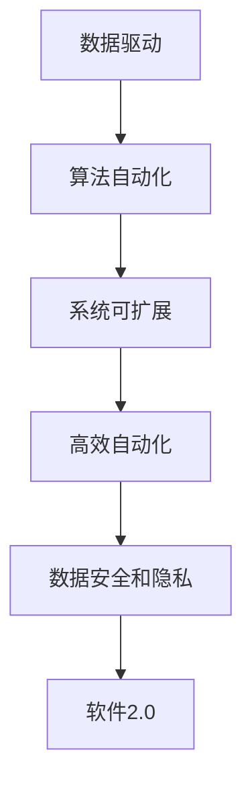

                 

## 1. 背景介绍

### 1.1 问题由来
随着大数据和人工智能技术的迅猛发展，我们正处在一个数据驱动的新时代。在这个时代，数据不仅是一种资源，更是一种生产要素，是推动经济社会发展的重要动力。

过去，软件1.0时代主要依赖于人类的编程能力和经验，软件开发者需要手写代码，进行复杂的逻辑设计和算法优化。这种方式依赖于个体的知识和技能，开发周期长，成本高，而且容易出错。但随着算法自动化和数据驱动的兴起，我们进入到了软件2.0时代。

在软件2.0时代，软件开发者可以利用大量的数据和先进的算法，通过自动化的方式，快速构建高效、稳定、可扩展的软件系统。这种转变，不仅仅意味着技术的进步，更是对传统软件开发模式的颠覆。

### 1.2 问题核心关键点
软件2.0时代的核心在于以下几个方面：

- **数据驱动**：软件系统的构建和优化，从依赖手工编码和经验设计，转变为依赖数据和自动化算法。开发者不再需要手动调试，而是可以通过数据分析和模型训练，直接生成软件代码和系统架构。

- **算法自动化**：利用先进的机器学习、深度学习等算法，自动化地处理复杂的逻辑和算法问题。这些算法能够自动从数据中学习规则和模式，生成高效的代码和系统。

- **系统可扩展**：软件2.0时代，软件系统更加注重可扩展性和灵活性。通过数据驱动的方式，开发者可以根据需求灵活调整系统结构和功能。

- **高效自动化**：自动化工具和框架的进步，使得软件开发变得更加高效和可维护。自动化测试、持续集成等技术，确保了软件质量的稳定性和可靠性。

- **数据安全和隐私**：随着数据在软件系统中的重要性日益增强，数据安全和隐私保护也成为核心问题。如何在保护数据隐私的前提下，充分利用数据价值，成为了一个重要的挑战。

### 1.3 问题研究意义
研究软件2.0时代的数据驱动模式，对于提升软件开发的效率、质量和安全性，推动经济发展，具有重要意义：

1. **提升开发效率**：数据驱动模式大大缩短了软件开发周期，降低了开发成本，使得软件可以快速迭代，快速响应市场需求。

2. **提高软件质量**：数据驱动模式通过自动化的算法生成代码，减少了人为错误，提高了软件的稳定性和可靠性。

3. **增强系统可扩展性**：数据驱动模式使得软件系统更加灵活，能够快速适应新的需求和变化，提高系统的生命周期。

4. **推动经济发展**：数据驱动模式可以更充分地利用数据资源，推动数据驱动型产业的发展，提升经济增长质量。

5. **保障数据安全和隐私**：随着数据在软件系统中的重要性日益增强，研究如何保障数据安全和隐私，成为了一个重要的研究方向。

## 2. 核心概念与联系

### 2.1 核心概念概述

为更好地理解软件2.0时代的数据驱动模式，本节将介绍几个密切相关的核心概念：

- **软件2.0（Software 2.0）**：一种基于数据和算法自动化的软件构建和优化模式，强调数据驱动、算法自动化、系统可扩展、高效自动化。

- **数据驱动（Data-Driven）**：软件系统构建和优化过程中，从依赖手工编码和经验设计，转变为依赖数据和自动化算法。

- **算法自动化（Algorithm Automation）**：利用先进的机器学习、深度学习等算法，自动化地处理复杂的逻辑和算法问题。

- **系统可扩展（System Scalability）**：软件系统更加注重可扩展性和灵活性，能够快速适应新的需求和变化。

- **高效自动化（Efficient Automation）**：自动化工具和框架的进步，使得软件开发变得更加高效和可维护。

- **数据安全和隐私（Data Security and Privacy）**：在利用数据资源的同时，如何保障数据安全和隐私，成为了一个重要的挑战。

这些核心概念之间的逻辑关系可以通过以下Mermaid流程图来展示：



这个流程图展示了大语言模型的核心概念及其之间的关系：

1. 数据驱动是软件2.0时代的基础，通过数据驱动的方式，软件系统可以更好地理解用户需求，快速迭代优化。

2. 算法自动化是数据驱动的核心技术，利用算法自动化地生成代码和系统架构，使得软件开发变得更加高效和可维护。

3. 系统可扩展是软件2.0时代的目标，通过数据驱动和算法自动化，软件系统能够快速适应新的需求和变化，提高系统的生命周期。

4. 高效自动化是软件2.0时代的保障，自动化工具和框架的进步，使得软件开发变得更加高效和可维护。

5. 数据安全和隐私是软件2.0时代的重要挑战，需要在利用数据资源的同时，保障数据安全和隐私。

这些概念共同构成了软件2.0时代的核心思想，使得软件系统可以更加高效、稳定、可扩展地运行。

## 3. 核心算法原理 & 具体操作步骤
### 3.1 算法原理概述

软件2.0时代的数据驱动模式，本质上是一个基于数据和算法自动化的优化过程。其核心思想是：通过收集和分析用户行为数据，自动化地生成和优化软件系统的结构和功能。

形式化地，假设软件系统S的构建和优化目标为 $f(S)$，其中 $S$ 为系统结构和功能，$f$ 为优化目标函数。给定一组用户行为数据 $D=\{(x_i,y_i)\}_{i=1}^N$，数据驱动的优化过程目标是最小化目标函数：

$$
\min_{S} \mathcal{L}(f(S),D)
$$

其中 $\mathcal{L}$ 为损失函数，用于衡量模型预测输出与真实标签之间的差异。常见的损失函数包括均方误差、交叉熵等。

通过梯度下降等优化算法，优化过程不断更新系统结构和功能，最小化损失函数，使得系统输出逼近理想状态。由于优化目标和损失函数的复杂性，软件2.0时代的数据驱动过程通常需要高效的算法和自动化工具来支持。

### 3.2 算法步骤详解

软件2.0时代的数据驱动优化过程一般包括以下几个关键步骤：

**Step 1: 数据收集和预处理**
- 收集用户行为数据，包括使用场景、操作行为、系统反馈等。
- 对数据进行清洗、去重、归一化等预处理，确保数据的质量和一致性。

**Step 2: 特征工程和模型训练**
- 提取有意义的特征，如点击率、停留时间、操作序列等。
- 选择适当的算法模型，如决策树、随机森林、神经网络等，对数据进行训练。

**Step 3: 自动化代码生成**
- 将训练得到的模型转化为软件代码，自动生成系统架构和功能模块。
- 将生成的代码和架构进行验证和测试，确保其正确性和稳定性。

**Step 4: 系统部署和迭代优化**
- 将生成的系统部署到实际环境中，收集用户反馈和行为数据。
- 根据反馈和数据，自动进行系统优化和迭代升级。

### 3.3 算法优缺点

数据驱动的软件2.0时代，具有以下优点：

- **高效自动化**：通过自动化算法生成代码和系统架构，大大提升了软件开发效率和质量。
- **灵活可扩展**：根据用户行为数据，快速调整系统结构和功能，增强系统适应性。
- **降低成本**：自动化工具和框架的普及，减少了手动编码和调试的时间，降低了开发成本。

同时，该方法也存在一些局限性：

- **依赖数据质量**：数据驱动的优化效果很大程度上取决于数据的质量和完整性，数据偏差和噪声可能影响优化结果。
- **算法复杂性**：算法模型的选择和优化过程复杂，需要专业知识和工具支持。
- **安全和隐私问题**：大量用户数据的收集和处理，带来了数据安全和隐私保护的挑战。
- **模型解释性不足**：自动化生成的代码和系统架构缺乏可解释性，难以理解和调试。

尽管存在这些局限性，但就目前而言，数据驱动的软件2.0时代依然是大规模软件系统构建和优化的重要范式。未来相关研究的重点在于如何进一步提升数据驱动的自动化水平，增强系统的鲁棒性和可解释性，同时兼顾数据安全和隐私等因素。

### 3.4 算法应用领域

数据驱动的软件2.0时代，在软件开发、系统优化、业务运营等多个领域得到了广泛应用，例如：

- **软件系统自动化构建**：利用数据驱动的模式，自动化生成软件系统架构和代码，提高开发效率。

- **系统优化和迭代**：根据用户行为数据，自动化进行系统优化和迭代升级，提升系统性能和用户体验。

- **业务流程自动化**：利用数据驱动的模式，自动化分析和优化业务流程，提高运营效率。

- **数据分析与决策支持**：利用数据驱动的模式，自动进行数据挖掘和分析，提供决策支持。

除了上述这些经典应用外，数据驱动的软件2.0时代还被创新性地应用到更多场景中，如智能运维、智能客服、智能推荐等，为软件开发带来了全新的突破。随着数据驱动技术的不断进步，相信软件2.0时代将在更广阔的应用领域大放异彩。

## 4. 数学模型和公式 & 详细讲解  
### 4.1 数学模型构建

本节将使用数学语言对软件2.0时代的数据驱动优化过程进行更加严格的刻画。

假设软件系统S的构建和优化目标为 $f(S)$，给定一组用户行为数据 $D=\{(x_i,y_i)\}_{i=1}^N$，其中 $x_i$ 为输入特征，$y_i$ 为输出标签。

定义损失函数为 $\ell(y_i,f(x_i))$，表示模型预测输出与真实标签之间的差异。则在数据集 $D$ 上的经验风险为：

$$
\mathcal{L}(f)=\frac{1}{N}\sum_{i=1}^N\ell(y_i,f(x_i))
$$

软件2.0时代的数据驱动优化目标是最小化经验风险，即：

$$
f^*=\mathop{\arg\min}_{f}\mathcal{L}(f)
$$

在实践中，我们通常使用基于梯度的优化算法（如SGD、Adam等）来近似求解上述最优化问题。设 $\eta$ 为学习率，则参数的更新公式为：

$$
f \leftarrow f - \eta \nabla_{f}\mathcal{L}(f)
$$

其中 $\nabla_{f}\mathcal{L}(f)$ 为损失函数对参数 $f$ 的梯度，可通过反向传播算法高效计算。

### 4.2 公式推导过程

以下我们以线性回归模型为例，推导最小二乘法优化过程的公式。

假设模型 $f(x)=\theta^Tx$，其中 $\theta$ 为模型参数。给定训练集 $D=\{(x_i,y_i)\}_{i=1}^N$，则损失函数为均方误差：

$$
\ell(y_i,f(x_i))=\frac{1}{2}(y_i-f(x_i))^2
$$

则在数据集 $D$ 上的经验风险为：

$$
\mathcal{L}(\theta)=\frac{1}{2N}\sum_{i=1}^N(y_i-f(x_i))^2
$$

根据梯度下降算法，参数的更新公式为：

$$
\theta \leftarrow \theta - \eta\nabla_{\theta}\mathcal{L}(\theta)
$$

其中 $\nabla_{\theta}\mathcal{L}(\theta)$ 为损失函数对参数 $\theta$ 的梯度，可通过链式法则和反向传播算法计算。

在得到梯度后，即可带入参数更新公式，完成模型的迭代优化。重复上述过程直至收敛，最终得到适应数据驱动目标的最优模型参数 $\theta^*$。

## 5. 项目实践：代码实例和详细解释说明
### 5.1 开发环境搭建

在进行数据驱动的软件系统构建和优化前，我们需要准备好开发环境。以下是使用Python进行PyTorch开发的环境配置流程：

1. 安装Anaconda：从官网下载并安装Anaconda，用于创建独立的Python环境。

2. 创建并激活虚拟环境：
```bash
conda create -n pytorch-env python=3.8 
conda activate pytorch-env
```

3. 安装PyTorch：根据CUDA版本，从官网获取对应的安装命令。例如：
```bash
conda install pytorch torchvision torchaudio cudatoolkit=11.1 -c pytorch -c conda-forge
```

4. 安装必要的库：
```bash
pip install pandas numpy scikit-learn matplotlib seaborn jupyter notebook ipython
```

完成上述步骤后，即可在`pytorch-env`环境中开始数据驱动的软件系统构建。

### 5.2 源代码详细实现

下面我们以数据驱动的软件系统优化为例，给出使用PyTorch进行最小二乘法线性回归优化的PyTorch代码实现。

```python
import torch
import torch.nn as nn
import torch.optim as optim
import pandas as pd
import matplotlib.pyplot as plt

# 定义模型
class LinearRegression(nn.Module):
    def __init__(self, input_dim, output_dim):
        super(LinearRegression, self).__init__()
        self.linear = nn.Linear(input_dim, output_dim)

    def forward(self, x):
        return self.linear(x)

# 加载数据
data = pd.read_csv('data.csv')
X = data.iloc[:, :-1].values
y = data.iloc[:, -1].values

# 构建模型
input_dim = X.shape[1]
output_dim = 1
model = LinearRegression(input_dim, output_dim)

# 定义损失函数和优化器
criterion = nn.MSELoss()
optimizer = optim.SGD(model.parameters(), lr=0.01)

# 训练模型
epochs = 1000
for epoch in range(epochs):
    optimizer.zero_grad()
    outputs = model(X)
    loss = criterion(outputs, y)
    loss.backward()
    optimizer.step()

    if (epoch+1) % 100 == 0:
        print('Epoch [{}/{}], Loss: {:.4f}'.format(epoch+1, epochs, loss.item()))

# 可视化结果
plt.scatter(X[:, 0], y, color='red')
plt.plot(X[:, 0], outputs.data.numpy(), color='blue')
plt.show()
```

### 5.3 代码解读与分析

让我们再详细解读一下关键代码的实现细节：

**LinearRegression类**：
- `__init__`方法：初始化线性回归模型，定义线性层。
- `forward`方法：定义前向传播过程，将输入数据通过线性层输出。

**数据加载**：
- 使用pandas库加载CSV文件数据。
- 将输入特征X和输出标签y分别提取出来。

**模型构建**：
- 定义模型的输入和输出维度。
- 使用`LinearRegression`类构建线性回归模型。

**损失函数和优化器**：
- 定义均方误差损失函数。
- 使用随机梯度下降优化器。

**训练模型**：
- 设置训练轮数和批次大小。
- 在每个epoch中，更新模型参数，输出损失。
- 每100个epoch输出一次损失。

**可视化结果**：
- 使用matplotlib库绘制输入数据和模型输出的可视化图像。

可以看到，利用数据驱动的软件2.0模式，我们可以高效地构建和优化线性回归模型，无需手工编写复杂的计算逻辑。

## 6. 实际应用场景
### 6.1 智能推荐系统

数据驱动的软件2.0模式，在智能推荐系统中的应用非常广泛。传统的推荐系统往往依赖于人工设计的特征和规则，难以高效地构建和优化。而利用数据驱动的模式，可以从用户行为数据中自动提取有意义的特征，通过机器学习算法，自动化生成推荐模型。

在实践中，可以收集用户的历史行为数据，如浏览、点击、购买等，提取和用户交互的物品标题、描述、标签等文本内容。将文本内容作为模型输入，用户的后续行为（如是否点击、购买等）作为监督信号，在此基础上对模型进行训练和优化。微调后的模型能够从文本内容中准确把握用户的兴趣点，生成个性化的推荐结果。

### 6.2 医疗诊断系统

在医疗领域，数据驱动的软件2.0模式同样具有广阔的应用前景。传统的医疗诊断系统往往需要医生手动输入病历、分析诊断，效率低、误诊率高。而利用数据驱动的模式，可以从电子病历、医学影像等数据中自动提取有意义的特征，通过机器学习算法，自动化生成诊断模型。

在实践中，可以收集患者的电子病历、医学影像、基因数据等，提取和分析这些数据中的关键特征。将特征输入到深度学习模型中，训练得到精准的诊断模型。微调后的模型能够自动分析患者数据，提供诊断结果和建议，辅助医生进行决策。

### 6.3 金融风控系统

在金融领域，数据驱动的软件2.0模式同样具有广泛的应用前景。传统的金融风控系统往往需要大量的人工审核和规则设计，成本高、效率低。而利用数据驱动的模式，可以从交易数据、用户行为数据中自动提取有意义的特征，通过机器学习算法，自动化生成风控模型。

在实践中，可以收集用户的交易数据、行为数据、社交网络数据等，提取和分析这些数据中的关键特征。将特征输入到深度学习模型中，训练得到精准的风控模型。微调后的模型能够自动分析用户数据，识别出潜在的风险点，提供决策支持。

### 6.4 未来应用展望

随着数据驱动技术的不断进步，软件2.0时代的应用将更加广泛，为各行各业带来变革性影响。

在智慧医疗领域，数据驱动的软件系统可以自动分析患者数据，提供精准的诊断和个性化治疗方案，提升医疗服务的智能化水平，辅助医生进行决策。

在智能教育领域，数据驱动的软件系统可以自动分析学生的学习数据，提供个性化的学习推荐和辅导，因材施教，促进教育公平，提高教学质量。

在智慧城市治理中，数据驱动的软件系统可以自动分析城市事件数据，提供决策支持，提高城市管理的自动化和智能化水平，构建更安全、高效的未来城市。

此外，在企业生产、社会治理、文娱传媒等众多领域，数据驱动的软件系统也将不断涌现，为传统行业数字化转型升级提供新的技术路径。相信随着技术的日益成熟，数据驱动模式将成为软件开发的重要范式，推动人工智能技术在垂直行业的规模化落地。

## 7. 工具和资源推荐
### 7.1 学习资源推荐

为了帮助开发者系统掌握数据驱动的软件2.0模式，这里推荐一些优质的学习资源：

1. **深度学习基础课程**：如Coursera上的深度学习课程，提供从基础到高级的深度学习知识体系。

2. **数据科学基础课程**：如Coursera上的数据科学课程，涵盖数据收集、清洗、分析等数据科学基础知识。

3. **机器学习实战书籍**：如《机器学习实战》，提供丰富的机器学习算法和实践案例。

4. **TensorFlow官方文档**：TensorFlow是当前最流行的深度学习框架，提供了详细的文档和教程，帮助开发者快速上手。

5. **PyTorch官方文档**：PyTorch是另一种流行的深度学习框架，提供了丰富的文档和教程，帮助开发者快速上手。

6. **数据驱动的书籍**：如《数据驱动：使用算法自动化业务决策》，提供数据驱动模式下的业务决策方法和实践案例。

通过对这些资源的学习实践，相信你一定能够快速掌握数据驱动的软件2.0模式的精髓，并用于解决实际的业务问题。

### 7.2 开发工具推荐

高效的开发离不开优秀的工具支持。以下是几款用于数据驱动软件开发和优化的常用工具：

1. **Jupyter Notebook**：用于快速构建和调试数据驱动的模型和算法，支持Python、R等语言。

2. **TensorFlow**：由Google主导开发的深度学习框架，生产部署方便，适合大规模工程应用。

3. **PyTorch**：由Facebook主导开发的深度学习框架，灵活动态的计算图，适合快速迭代研究。

4. **Pandas**：用于数据处理和分析的Python库，支持大规模数据集的操作和分析。

5. **NumPy**：用于数值计算和矩阵运算的Python库，提供了高效的数学运算工具。

6. **Scikit-learn**：用于机器学习算法的Python库，提供了丰富的模型和算法。

合理利用这些工具，可以显著提升数据驱动的软件开发效率，加快创新迭代的步伐。

### 7.3 相关论文推荐

数据驱动的软件2.0模式的不断发展，源于学界的持续研究。以下是几篇奠基性的相关论文，推荐阅读：

1. **Deep Learning**：Goodfellow等人的著作，全面介绍了深度学习的基本概念、算法和应用。

2. **Data Science for Business**：Johnson等人的著作，提供数据科学在商业决策中的应用方法。

3. **Algorithmic Trading**：Derman等人的著作，提供算法交易中的数据驱动模式。

4. **Machine Learning Yearning**：Andrew Ng的博客文章，提供机器学习中的实践经验和方法。

5. **Human-Centered Machine Learning**：Davenport等人的著作，提供机器学习在商业应用中的最佳实践。

这些论文代表了大数据和人工智能技术的发展脉络，帮助研究者把握学科前进方向，激发更多的创新灵感。

## 8. 总结：未来发展趋势与挑战
### 8.1 总结

本文对数据驱动的软件2.0模式进行了全面系统的介绍。首先阐述了软件2.0时代的背景和意义，明确了数据驱动的优化目标和关键步骤，展示了数据驱动模式在智能推荐、医疗诊断、金融风控等众多领域的广泛应用。其次，从原理到实践，详细讲解了数据驱动的软件2.0模式的具体操作流程，给出了数据驱动模式在实际项目中的代码实现。

通过本文的系统梳理，可以看到，数据驱动的软件2.0时代已经在各行各业取得了显著的成果，推动了软件系统的智能化进程。未来，伴随数据驱动技术的持续演进，数据驱动的软件2.0时代必将迎来更大的突破和发展。

### 8.2 未来发展趋势

展望未来，数据驱动的软件2.0时代将呈现以下几个发展趋势：

1. **数据质量提升**：随着数据采集和处理技术的进步，数据质量将进一步提升，数据驱动的优化效果也将更加显著。

2. **算法自动化**：利用先进的深度学习算法，自动化地处理复杂的逻辑和算法问题，进一步提升软件系统的自动化水平。

3. **系统可扩展**：随着数据驱动技术的进步，软件系统将更加灵活可扩展，能够快速适应新的需求和变化。

4. **高效自动化**：自动化工具和框架的进步，使得软件开发变得更加高效和可维护。

5. **安全性和隐私保护**：随着数据在软件系统中的重要性日益增强，数据安全和隐私保护也将成为核心问题。如何在保护数据隐私的前提下，充分利用数据价值，成为了一个重要的研究方向。

6. **跨领域应用**：数据驱动的模式将被应用于更多领域，如智能运维、智能客服、智能推荐等，为各行各业带来变革性影响。

以上趋势凸显了数据驱动的软件2.0时代的广阔前景。这些方向的探索发展，必将进一步提升软件系统的性能和应用范围，为人类认知智能的进化带来深远影响。

### 8.3 面临的挑战

尽管数据驱动的软件2.0模式已经取得了瞩目成就，但在迈向更加智能化、普适化应用的过程中，它仍面临着诸多挑战：

1. **数据依赖性高**：数据驱动的优化效果很大程度上取决于数据的质量和数量，数据偏差和噪声可能影响优化结果。

2. **算法复杂性高**：算法模型的选择和优化过程复杂，需要专业知识和工具支持。

3. **安全和隐私问题**：大量用户数据的收集和处理，带来了数据安全和隐私保护的挑战。

4. **模型解释性不足**：自动化生成的代码和系统架构缺乏可解释性，难以理解和调试。

5. **资源消耗高**：大规模数据处理和模型训练，对计算资源和存储空间提出了很高的要求。

6. **实时性要求高**：实时数据驱动的应用场景，对系统的实时性和响应速度提出了更高的要求。

正视数据驱动模式面临的这些挑战，积极应对并寻求突破，将是大数据和人工智能技术迈向成熟的必由之路。相信随着学界和产业界的共同努力，这些挑战终将一一被克服，数据驱动模式必将在构建人机协同的智能系统中扮演越来越重要的角色。

### 8.4 未来突破

面对数据驱动模式所面临的种种挑战，未来的研究需要在以下几个方面寻求新的突破：

1. **无监督学习与半监督学习**：摆脱对大规模标注数据的依赖，利用自监督学习、主动学习等无监督和半监督范式，最大限度利用非结构化数据，实现更加灵活高效的优化。

2. **参数高效算法**：开发更加参数高效的算法，在固定大部分预训练参数的同时，只更新极少量的任务相关参数。同时优化算法模型的计算图，减少前向传播和反向传播的资源消耗，实现更加轻量级、实时性的部署。

3. **因果推断与对比学习**：通过引入因果推断和对比学习思想，增强数据驱动模型的建立稳定因果关系的能力，学习更加普适、鲁棒的语言表征，从而提升模型泛化性和抗干扰能力。

4. **跨领域知识整合**：将符号化的先验知识，如知识图谱、逻辑规则等，与神经网络模型进行巧妙融合，引导数据驱动过程学习更准确、合理的语言模型。同时加强不同模态数据的整合，实现视觉、语音等多模态信息与文本信息的协同建模。

5. **因果分析与博弈论**：将因果分析方法引入数据驱动模型，识别出模型决策的关键特征，增强输出解释的因果性和逻辑性。借助博弈论工具刻画人机交互过程，主动探索并规避模型的脆弱点，提高系统稳定性。

6. **伦理道德约束**：在数据驱动模型的训练目标中引入伦理导向的评估指标，过滤和惩罚有偏见、有害的输出倾向。同时加强人工干预和审核，建立模型行为的监管机制，确保输出符合人类价值观和伦理道德。

这些研究方向的探索，必将引领数据驱动软件2.0模式的未来发展，为构建安全、可靠、可解释、可控的智能系统铺平道路。面向未来，数据驱动模式还需要与其他人工智能技术进行更深入的融合，如知识表示、因果推理、强化学习等，多路径协同发力，共同推动自然语言理解和智能交互系统的进步。只有勇于创新、敢于突破，才能不断拓展语言模型的边界，让智能技术更好地造福人类社会。

## 9. 附录：常见问题与解答

**Q1：数据驱动模式是否适用于所有NLP任务？**

A: 数据驱动模式在大多数NLP任务上都能取得不错的效果，特别是对于数据量较大的任务。但对于一些特定领域的任务，如医学、法律等，仅仅依靠通用语料预训练的模型可能难以很好地适应。此时需要在特定领域语料上进一步预训练，再进行数据驱动的优化，才能获得理想效果。此外，对于一些需要时效性、个性化很强的任务，如对话、推荐等，数据驱动模式也需要针对性的改进优化。

**Q2：如何选择合适的损失函数？**

A: 选择合适的损失函数取决于具体任务的目标。对于回归任务，如房价预测，通常使用均方误差损失；对于分类任务，如情感分析，通常使用交叉熵损失。在实践中，也可以根据数据分布和任务特点，设计自定义的损失函数。

**Q3：数据驱动模式是否需要大规模标注数据？**

A: 数据驱动模式在处理标注数据不足的情况下，可以通过无监督和半监督学习方法，从未标注数据中提取有意义的特征，进行模型训练和优化。这些方法包括自编码器、生成对抗网络等，可以充分利用数据资源，实现更加灵活高效的优化。

**Q4：数据驱动模式是否需要大量的计算资源？**

A: 数据驱动模式通常需要大量的计算资源，用于数据处理、特征提取、模型训练等环节。对于大规模数据集，建议使用GPU或TPU等高性能设备，以提升计算效率。同时，也可以考虑分布式计算和模型压缩等技术，优化计算资源的使用。

**Q5：如何保障数据安全和隐私？**

A: 在数据驱动模式的实现过程中，保障数据安全和隐私至关重要。可以采用数据加密、匿名化等技术，保护用户数据隐私。同时，限制数据访问权限，确保只有授权人员能够访问和使用数据。

通过本文的系统梳理，可以看到，数据驱动的软件2.0模式正在成为软件系统构建和优化的重要范式，极大地提升了软件开发效率和质量，推动了人工智能技术在各行各业的规模化落地。未来，伴随数据驱动技术的持续演进，数据驱动模式必将迎来更大的突破和发展，为人类认知智能的进化带来深远影响。

---

作者：禅与计算机程序设计艺术 / Zen and the Art of Computer Programming

