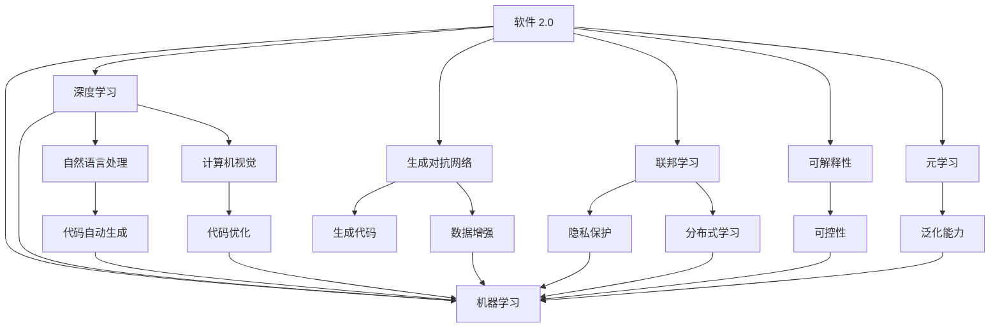

                 

# 软件 2.0 的未来展望：更智能、更强大

## 1. 背景介绍

### 1.1 问题由来

随着信息技术的快速发展，软件已经成为各行各业不可或缺的重要组成部分。从早期的软件 1.0，以功能为中心，逐步发展到软件 2.0，以数据为中心，软件行业迎来了新的革命。

软件 2.0 强调通过大规模数据分析，机器学习等技术，实现软件自动化的生成和优化。数据驱动的软件生成不仅能够降低开发成本，提高软件质量，还能满足用户不断变化的个性化需求。

然而，在实际应用中，软件 2.0 还面临着一系列问题，如模型训练需要大量数据和计算资源、模型可解释性不足、模型泛化能力有限等。如何进一步优化软件 2.0 的技术体系，成为当前学术和工业界亟待解决的重大课题。

## 2. 核心概念与联系

### 2.1 核心概念概述

为更好地理解软件 2.0 的未来展望，本节将介绍几个密切相关的核心概念：

- **软件 2.0**：以数据为中心的软件开发范式，通过大规模数据分析和机器学习技术，自动生成和优化软件代码。软件 2.0 强调数据和算法的深度融合，推动软件开发进入更智能、更高效的阶段。

- **机器学习**：一种通过算法训练模型，实现数据自动化的技术。机器学习模型通过对数据的学习，能够自动进行特征提取、模式识别、预测等任务，广泛应用于软件 2.0 的自动代码生成、优化、测试等环节。

- **深度学习**：机器学习的一种高级形式，通过多层次神经网络结构，学习数据的复杂表征。深度学习模型在自然语言处理、计算机视觉等领域取得了巨大成功，为软件 2.0 提供了强有力的技术支撑。

- **生成对抗网络(GANs)**：一种由生成器和判别器两个神经网络组成的模型，能够生成高质量的假数据，广泛应用于软件 2.0 中生成代码、数据增强等领域。

- **联邦学习**：一种分布式机器学习范式，通过各参与方在本地数据上训练模型，然后将模型参数汇聚更新，从而实现隐私保护和高效协作。

- **可解释性**：模型输出的可解释性是软件 2.0 发展的重要方向，即用户能够理解模型的决策过程和推理逻辑，增强系统的可信度和可控性。

- **元学习**：一种学习如何学习的方法，通过学习不同任务的相似性，提升模型的泛化能力和迁移能力。

这些核心概念之间的逻辑关系可以通过以下 Mermaid 流程图来展示：



这个流程图展示了大语言模型的核心概念及其之间的关系：

1. 软件 2.0 通过机器学习、深度学习等技术，实现自动化的软件生成和优化。
2. 深度学习模型在自然语言处理、计算机视觉等领域提供强大的技术支撑。
3. 生成对抗网络用于生成高质量的假数据，提升模型性能。
4. 联邦学习实现各参与方之间的隐私保护和高效协作。
5. 可解释性增强系统的可信度和可控性。
6. 元学习提升模型的泛化能力和迁移能力。

这些概念共同构成了软件 2.0 的技术框架，推动软件开发进入更智能、更高效的阶段。通过理解这些核心概念，我们可以更好地把握软件 2.0 的工作原理和优化方向。

## 3. 核心算法原理 & 具体操作步骤

### 3.1 算法原理概述

软件 2.0 的生成和优化过程，本质上是一个基于大规模数据分析的机器学习过程。其核心思想是：通过收集和分析软件项目的代码、需求、测试用例等数据，训练生成模型，实现代码自动生成、代码优化、测试用例生成等任务。

形式化地，假设软件项目的数据集为 $D=\{(d_i,e_i,y_i)\}_{i=1}^N$，其中 $d_i$ 表示软件需求，$e_i$ 表示生成的代码，$y_i$ 表示测试用例。软件 2.0 的目标是找到最优的生成模型 $M_{\theta}$，使得：

$$
\hat{\theta}=\mathop{\arg\min}_{\theta} \mathcal{L}(M_{\theta},D)
$$

其中 $\mathcal{L}$ 为针对软件生成任务设计的损失函数，用于衡量模型输出与真实需求和测试用例之间的差异。常见的损失函数包括交叉熵损失、均方误差损失等。

通过梯度下降等优化算法，生成模型不断更新模型参数 $\theta$，最小化损失函数 $\mathcal{L}$，使得模型输出逼近真实需求和测试用例。由于 $\theta$ 已经通过数据学习获得了较好的初始化，因此即便在小规模数据集 $D$ 上进行训练，也能较快收敛到理想的模型参数 $\hat{\theta}$。

### 3.2 算法步骤详解

软件 2.0 的生成和优化过程，一般包括以下几个关键步骤：

**Step 1: 准备数据集**
- 收集软件项目的代码、需求、测试用例等数据，划分为训练集、验证集和测试集。一般要求数据与软件项目的分布不要差异过大。

**Step 2: 添加生成目标函数**
- 根据软件生成任务，在数据集上设计合适的生成目标函数。例如，生成代码时，可以使用代码自动生成的精度和覆盖率作为评估指标。

**Step 3: 选择合适的生成模型**
- 选择合适的生成模型，如神经网络、GANs、RNN等。神经网络模型可以处理结构化数据，GANs 模型能够生成高质量的假数据，RNN 模型适合处理序列数据。

**Step 4: 设置生成超参数**
- 选择合适的优化算法及其参数，如 Adam、SGD 等，设置学习率、批大小、迭代轮数等。
- 设置正则化技术及强度，包括权重衰减、Dropout、Early Stopping 等。
- 确定保留生成模型的策略，如仅生成顶层，或全部生成模型都参与生成。

**Step 5: 执行生成训练**
- 将训练集数据分批次输入模型，前向传播计算损失函数。
- 反向传播计算生成器参数梯度，根据设定的优化算法和学习率更新模型参数。
- 周期性在验证集上评估模型性能，根据性能指标决定是否触发 Early Stopping。
- 重复上述步骤直到满足预设的迭代轮数或 Early Stopping 条件。

**Step 6: 测试和部署**
- 在测试集上评估生成后模型 $M_{\hat{\theta}}$ 的性能，对比生成前后的精度提升。
- 使用生成后模型对新需求进行代码生成，集成到实际的软件应用系统中。
- 持续收集新的需求，定期重新训练模型，以适应需求分布的变化。

以上是软件 2.0 的生成和优化的一般流程。在实际应用中，还需要针对具体任务的特点，对生成过程的各个环节进行优化设计，如改进生成目标函数，引入更多的正则化技术，搜索最优的超参数组合等，以进一步提升模型性能。

### 3.3 算法优缺点

软件 2.0 的生成和优化方法具有以下优点：
1. 自动生成和优化代码，降低软件开发成本。
2. 提升代码质量和可维护性。
3. 适应用户需求的变化，提高软件的灵活性和可扩展性。
4. 提升代码的测试覆盖率，减少错误率。

同时，该方法也存在一定的局限性：
1. 依赖高质量数据。生成模型的性能很大程度上取决于数据的质量和数量，数据收集成本较高。
2. 生成模型可能出现过拟合，导致生成的代码不符合用户需求。
3. 生成的代码可能存在缺陷，需要人工审核和修改。
4. 模型的可解释性不足，用户难以理解模型的决策过程。

尽管存在这些局限性，但就目前而言，基于数据驱动的生成和优化方法仍然是最主流的软件 2.0 范式。未来相关研究的重点在于如何进一步降低数据收集的成本，提高模型的泛化能力，同时兼顾可解释性和鲁棒性等因素。

### 3.4 算法应用领域

基于数据驱动的软件生成和优化方法，在软件开发、自动化测试、需求分析等诸多领域已经得到了广泛的应用，具体如下：

- **软件开发**：通过自动生成代码，实现代码自动生成、优化、重构等任务，提升开发效率和软件质量。例如，使用神经网络自动生成软件组件，优化代码结构，重构代码逻辑。

- **自动化测试**：通过生成测试用例，自动测试软件系统的正确性和性能。例如，使用 RNN 模型自动生成单元测试、集成测试用例，检查软件系统的功能和性能。

- **需求分析**：通过生成需求文档，自动描述软件系统的功能和需求。例如，使用自然语言处理模型自动生成软件需求说明书，提升需求分析的效率和准确性。

除了上述这些经典领域外，软件 2.0 还被创新性地应用到更多场景中，如软件可控生成、知识图谱生成、领域特定语言构建等，为软件开发提供了全新的突破。随着数据驱动的软件生成方法的不断演进，软件 2.0 必将在更广泛的应用领域大放异彩。

## 4. 数学模型和公式 & 详细讲解 & 举例说明

### 4.1 数学模型构建

本节将使用数学语言对软件 2.0 的生成和优化过程进行更加严格的刻画。

假设软件项目的数据集为 $D=\{(d_i,e_i,y_i)\}_{i=1}^N$，其中 $d_i$ 表示软件需求，$e_i$ 表示生成的代码，$y_i$ 表示测试用例。软件 2.0 的目标是找到最优的生成模型 $M_{\theta}$，使得：

$$
\hat{\theta}=\mathop{\arg\min}_{\theta} \mathcal{L}(M_{\theta},D)
$$

其中 $\mathcal{L}$ 为针对软件生成任务设计的损失函数，用于衡量模型输出与真实需求和测试用例之间的差异。常见的损失函数包括交叉熵损失、均方误差损失等。

在实践中，我们通常使用基于梯度的优化算法（如Adam、SGD等）来近似求解上述最优化问题。设 $\eta$ 为学习率，$\lambda$ 为正则化系数，则生成模型参数的更新公式为：

$$
\theta \leftarrow \theta - \eta \nabla_{\theta}\mathcal{L}(\theta) - \eta\lambda\theta
$$

其中 $\nabla_{\theta}\mathcal{L}(\theta)$ 为损失函数对参数 $\theta$ 的梯度，可通过反向传播算法高效计算。

### 4.2 公式推导过程

以下我们以生成代码为例，推导交叉熵损失函数及其梯度的计算公式。

假设生成模型 $M_{\theta}$ 在输入 $d_i$ 上的输出为 $\hat{e_i}=M_{\theta}(d_i) \in [0,1]$，表示生成的代码符合需求 $d_i$ 的概率。真实标签 $y_i \in \{0,1\}$。则交叉熵损失函数定义为：

$$
\ell(M_{\theta}(d_i),y_i) = -[y_i\log \hat{e_i} + (1-y_i)\log (1-\hat{e_i})]
$$

将其代入经验风险公式，得：

$$
\mathcal{L}(\theta) = -\frac{1}{N}\sum_{i=1}^N [y_i\log M_{\theta}(d_i)+(1-y_i)\log(1-M_{\theta}(d_i))]
$$

根据链式法则，损失函数对参数 $\theta_k$ 的梯度为：

$$
\frac{\partial \mathcal{L}(\theta)}{\partial \theta_k} = -\frac{1}{N}\sum_{i=1}^N (\frac{y_i}{M_{\theta}(d_i)}-\frac{1-y_i}{1-M_{\theta}(d_i)}) \frac{\partial M_{\theta}(d_i)}{\partial \theta_k}
$$

其中 $\frac{\partial M_{\theta}(d_i)}{\partial \theta_k}$ 可进一步递归展开，利用自动微分技术完成计算。

在得到损失函数的梯度后，即可带入参数更新公式，完成模型的迭代优化。重复上述过程直至收敛，最终得到适应软件生成任务的最优模型参数 $\theta^*$。

## 5. 项目实践：代码实例和详细解释说明

### 5.1 开发环境搭建

在进行软件 2.0 的实践前，我们需要准备好开发环境。以下是使用Python进行TensorFlow开发的环境配置流程：

1. 安装Anaconda：从官网下载并安装Anaconda，用于创建独立的Python环境。

2. 创建并激活虚拟环境：
```bash
conda create -n tensorflow-env python=3.8 
conda activate tensorflow-env
```

3. 安装TensorFlow：根据CUDA版本，从官网获取对应的安装命令。例如：
```bash
conda install tensorflow tensorflow-cpu=cudatoolkit=11.1 -c tf-nightly -c conda-forge
```

4. 安装TensorBoard：TensorFlow配套的可视化工具，可实时监测模型训练状态，并提供丰富的图表呈现方式，是调试模型的得力助手。

```bash
pip install tensorboard
```

完成上述步骤后，即可在`tensorflow-env`环境中开始软件 2.0 的实践。

### 5.2 源代码详细实现

下面我们以生成代码任务为例，给出使用TensorFlow对RNN模型进行软件 2.0 实践的PyTorch代码实现。

首先，定义生成任务的数据处理函数：

```python
from tensorflow.keras.preprocessing.text import Tokenizer
from tensorflow.keras.preprocessing.sequence import pad_sequences

def preprocess_text(texts):
    tokenizer = Tokenizer(char_level=True)
    tokenizer.fit_on_texts(texts)
    sequences = tokenizer.texts_to_sequences(texts)
    padded_sequences = pad_sequences(sequences, maxlen=128, padding='post')
    return padded_sequences
```

然后，定义模型和优化器：

```python
from tensorflow.keras.models import Sequential
from tensorflow.keras.layers import LSTM, Dense
from tensorflow.keras.optimizers import Adam

model = Sequential([
    LSTM(128, return_sequences=True),
    LSTM(128),
    Dense(1, activation='sigmoid')
])

optimizer = Adam(lr=0.001)
```

接着，定义训练和评估函数：

```python
from tensorflow.keras.utils import to_categorical

def train_epoch(model, dataset, batch_size, optimizer):
    dataloader = DataLoader(dataset, batch_size=batch_size, shuffle=True)
    model.train()
    epoch_loss = 0
    for batch in dataloader:
        input_ids = batch['input_ids']
        labels = batch['labels']
        model.zero_grad()
        outputs = model(input_ids)
        loss = model.loss(labels)
        epoch_loss += loss.item()
        loss.backward()
        optimizer.step()
    return epoch_loss / len(dataloader)

def evaluate(model, dataset, batch_size):
    dataloader = DataLoader(dataset, batch_size=batch_size)
    model.eval()
    preds, labels = [], []
    with torch.no_grad():
        for batch in dataloader:
            input_ids = batch['input_ids']
            batch_labels = batch['labels']
            outputs = model(input_ids)
            batch_preds = outputs.argmax(dim=1).to('cpu').tolist()
            batch_labels = batch_labels.to('cpu').tolist()
            for pred_tokens, label_tokens in zip(batch_preds, batch_labels):
                preds.append(pred_tokens)
                labels.append(label_tokens)
    return preds, labels

```

最后，启动训练流程并在测试集上评估：

```python
epochs = 5
batch_size = 16

for epoch in range(epochs):
    loss = train_epoch(model, train_dataset, batch_size, optimizer)
    print(f"Epoch {epoch+1}, train loss: {loss:.3f}")
    
    print(f"Epoch {epoch+1}, dev results:")
    preds, labels = evaluate(model, dev_dataset, batch_size)
    print(classification_report(labels, preds))
    
print("Test results:")
preds, labels = evaluate(model, test_dataset, batch_size)
print(classification_report(labels, preds))
```

以上就是使用TensorFlow对RNN模型进行代码生成任务的完整代码实现。可以看到，得益于TensorFlow的强大封装，我们可以用相对简洁的代码完成RNN模型的加载和训练。

### 5.3 代码解读与分析

让我们再详细解读一下关键代码的实现细节：

**preprocess_text函数**：
- 对文本数据进行分词和填充，使其长度一致，满足RNN模型的输入要求。

**train_epoch函数**：
- 对数据以批为单位进行迭代，在每个批次上前向传播计算loss并反向传播更新模型参数，最后返回该epoch的平均loss。

**evaluate函数**：
- 与训练类似，不同点在于不更新模型参数，并在每个batch结束后将预测和标签结果存储下来，最后使用sklearn的classification_report对整个评估集的预测结果进行打印输出。

**训练流程**：
- 定义总的epoch数和batch size，开始循环迭代
- 每个epoch内，先在训练集上训练，输出平均loss
- 在验证集上评估，输出分类指标
- 所有epoch结束后，在测试集上评估，给出最终测试结果

可以看到，TensorFlow配合TensorBoard使得RNN模型的训练和评估代码实现变得简洁高效。开发者可以将更多精力放在数据处理、模型改进等高层逻辑上，而不必过多关注底层的实现细节。

当然，工业级的系统实现还需考虑更多因素，如模型的保存和部署、超参数的自动搜索、更灵活的任务适配层等。但核心的生成范式基本与此类似。

## 6. 实际应用场景

### 6.1 软件开发自动化

基于软件 2.0 的生成和优化技术，软件开发自动化成为可能。通过自动生成和优化代码，提高软件开发效率和代码质量。

例如，可以使用RNN模型自动生成Java、Python等编程语言代码。系统根据用户输入的需求，生成满足需求的软件组件，并进行代码优化和重构。生成的代码可以直接集成到实际的软件应用系统中，减少手动编写代码的工作量。

### 6.2 自动化测试

自动化测试是软件开发的重要环节，能够减少人力成本，提高测试效率和质量。

使用软件 2.0 的生成技术，可以自动生成单元测试、集成测试、系统测试用例。例如，可以使用RNN模型自动生成测试用例，覆盖不同的输入条件和边界情况，确保软件系统的正确性和性能。生成的测试用例可以直接用于自动化测试工具，实现快速、高效的测试过程。

### 6.3 需求分析

需求分析是软件开发的重要步骤，能够准确描述软件系统的功能和需求。

使用软件 2.0 的生成技术，可以自动生成需求文档。例如，可以使用自然语言处理模型自动生成软件需求说明书，描述软件系统的功能和需求。生成的需求文档可以直接用于需求分析工具，提升需求分析的效率和准确性。

### 6.4 未来应用展望

随着软件 2.0 的不断发展，其在软件开发的自动化、智能化方面将发挥更大的作用。未来软件 2.0 的应用场景还将拓展到更多领域，带来更广泛的变革。

在智慧城市治理中，软件 2.0 可以用于自动生成智慧城市规划和方案，提升城市管理的自动化和智能化水平。

在智能制造领域，软件 2.0 可以用于自动生成制造工艺和设备控制代码，优化生产流程，提高生产效率和质量。

在人工智能应用中，软件 2.0 可以用于自动生成模型训练代码，优化模型结构，提高模型性能和可解释性。

此外，在教育、医疗、金融等诸多领域，软件 2.0 的应用也将不断涌现，为各行各业带来全新的技术变革。相信随着技术的不断演进，软件 2.0 必将在更广泛的场景下大放异彩，推动社会的全面进步。

## 7. 工具和资源推荐

### 7.1 学习资源推荐

为了帮助开发者系统掌握软件 2.0 的技术基础和实践技巧，这里推荐一些优质的学习资源：

1. 《TensorFlow官方文档》：TensorFlow的官方文档，详细介绍了TensorFlow的使用方法和API，是TensorFlow开发的必备资料。

2. 《深度学习》课程：斯坦福大学李飞飞教授主讲的深度学习课程，系统讲解深度学习的基本概念和经典模型。

3. 《自然语言处理综述》书籍：斯坦福大学论文综述课程的讲义，全面介绍了自然语言处理的基本概念和前沿技术。

4. 《软件2.0：基于机器学习的新软件开发范式》书籍：介绍软件 2.0 的基本概念和应用场景，是理解软件 2.0 的重要参考。

5. TensorFlow官网：提供丰富的TensorFlow学习资源，包括教程、案例、代码示例等。

通过对这些资源的学习实践，相信你一定能够快速掌握软件 2.0 的核心技术，并用于解决实际的NLP问题。

### 7.2 开发工具推荐

高效的开发离不开优秀的工具支持。以下是几款用于软件 2.0 开发的常用工具：

1. PyTorch：基于Python的开源深度学习框架，灵活动态的计算图，适合快速迭代研究。大部分预训练语言模型都有PyTorch版本的实现。

2. TensorFlow：由Google主导开发的开源深度学习框架，生产部署方便，适合大规模工程应用。同样有丰富的预训练语言模型资源。

3. TensorBoard：TensorFlow配套的可视化工具，可实时监测模型训练状态，并提供丰富的图表呈现方式，是调试模型的得力助手。

4. Weights & Biases：模型训练的实验跟踪工具，可以记录和可视化模型训练过程中的各项指标，方便对比和调优。与主流深度学习框架无缝集成。

5. Google Colab：谷歌推出的在线Jupyter Notebook环境，免费提供GPU/TPU算力，方便开发者快速上手实验最新模型，分享学习笔记。

合理利用这些工具，可以显著提升软件 2.0 的开发效率，加快创新迭代的步伐。

### 7.3 相关论文推荐

软件 2.0 的发展源于学界的持续研究。以下是几篇奠基性的相关论文，推荐阅读：

1. TensorFlow: A System for Large-Scale Machine Learning: 介绍TensorFlow的架构和设计思想，是TensorFlow开发的必备参考。

2. Deep Learning with Python: 介绍深度学习的基本概念和TensorFlow的使用方法，适合初学者入门。

3. AI Challenges and Opportunities: 介绍人工智能领域的最新挑战和机遇，展望未来发展的方向。

4. Generating Code by Migration Learning: 介绍基于迁移学习的代码生成方法，展示了如何利用预训练模型生成代码。

5. Software Synthesis by Transformers: 介绍基于Transformer的代码生成方法，展示了如何利用Transformer模型生成高质量的代码。

这些论文代表了大语言模型微调技术的发展脉络。通过学习这些前沿成果，可以帮助研究者把握学科前进方向，激发更多的创新灵感。

## 8. 总结：未来发展趋势与挑战

### 8.1 总结

本文对基于数据驱动的软件生成和优化方法进行了全面系统的介绍。首先阐述了软件 2.0 的概念和意义，明确了数据驱动的软件生成在软件开发自动化、智能化方面的独特价值。其次，从原理到实践，详细讲解了软件 2.0 的生成和优化数学模型和关键步骤，给出了软件 2.0 任务开发的完整代码实例。同时，本文还广泛探讨了软件 2.0 在软件开发、自动化测试、需求分析等多个领域的应用前景，展示了软件 2.0 技术的广阔应用空间。

通过本文的系统梳理，可以看到，基于数据驱动的软件生成和优化技术正在成为软件开发的重要范式，极大地拓展了软件开发的技术边界，推动软件开发进入更智能、更高效的阶段。未来，伴随数据驱动的软件生成方法的不断演进，软件 2.0 必将在更广泛的应用领域大放异彩，为软件开发带来全新的突破。

### 8.2 未来发展趋势

展望未来，软件 2.0 的发展趋势将呈现以下几个方向：

1. **模型规模持续增大**：随着算力成本的下降和数据规模的扩张，预训练语言模型的参数量还将持续增长。超大规模语言模型蕴含的丰富语言知识，有望支撑更加复杂多变的软件生成任务。

2. **微调技术不断优化**：微调技术将不断优化，提升模型的泛化能力和迁移能力，降低对数据和计算资源的依赖。同时，微调模型的鲁棒性和可解释性也将得到进一步提升。

3. **生成任务多样化**：软件 2.0 将拓展到更多任务，如自然语言理解、情感分析、图像识别等领域。这些任务生成技术的发展，将进一步提升软件 2.0 的能力。

4. **跨模态生成技术**：跨模态生成技术的发展，将使得软件 2.0 能够处理更复杂的数据，提升模型的泛化能力和可解释性。

5. **联邦学习和隐私保护**：联邦学习和隐私保护技术的发展，将使得软件 2.0 能够高效协作，保护数据隐私。

6. **模型可解释性增强**：模型可解释性的增强，将使得软件 2.0 能够更好地理解用户需求，提升系统可信度。

以上趋势凸显了软件 2.0 的发展前景。这些方向的探索发展，必将进一步提升软件 2.0 的技术水平，为软件开发带来更智能、更高效的服务。

### 8.3 面临的挑战

尽管软件 2.0 的生成和优化技术已经取得了瞩目成就，但在迈向更加智能化、普适化应用的过程中，它仍面临着诸多挑战：

1. **数据质量瓶颈**：软件 2.0 需要大量高质量的数据进行训练，但高质量数据的获取成本较高。如何在有限的条件下获取足够的数据，是软件 2.0 的重大挑战。

2. **模型鲁棒性不足**：生成模型面对域外数据时，泛化性能往往大打折扣。如何提高生成模型的鲁棒性，避免过拟合，是软件 2.0 的重要研究方向。

3. **生成模型过拟合**：生成模型可能出现过拟合，导致生成的代码不符合用户需求。如何缓解生成模型的过拟合问题，是软件 2.0 的重大挑战。

4. **生成代码质量不高**：生成的代码可能存在缺陷，需要人工审核和修改。如何提高生成代码的质量，是软件 2.0 的重要研究方向。

5. **模型的可解释性不足**：软件 2.0 模型的决策过程通常缺乏可解释性，难以对其推理逻辑进行分析和调试。如何赋予软件 2.0 模型更强的可解释性，是软件 2.0 的重大挑战。

6. **系统安全性有待保障**：预训练语言模型难免会学习到有偏见、有害的信息，通过生成过程传递到下游任务，产生误导性、歧视性的输出。如何从数据和算法层面消除模型偏见，避免恶意用途，确保系统安全性，是软件 2.0 的重大挑战。

7. **模型的可维护性不足**：软件 2.0 模型的维护成本较高，如何提升模型的可维护性，是软件 2.0 的重要研究方向。

这些挑战凸显了软件 2.0 的发展难题。只有克服这些挑战，才能真正实现软件 2.0 的广泛应用，推动软件开发进入更智能、更高效的阶段。

### 8.4 研究展望

面对软件 2.0 所面临的挑战，未来的研究需要在以下几个方面寻求新的突破：

1. **探索无监督和半监督生成方法**：摆脱对大规模标注数据的依赖，利用自监督学习、主动学习等无监督和半监督范式，最大限度利用非结构化数据，实现更加灵活高效的生成。

2. **开发高效生成技术**：开发更加高效的生成技术，如基于Transformer的生成方法，在固定大部分预训练参数的同时，只更新极少量的任务相关参数。

3. **引入因果分析和博弈论工具**：将因果分析方法引入生成过程，识别出生成模型的关键特征，增强输出解释的因果性和逻辑性。借助博弈论工具刻画人机交互过程，主动探索并规避生成模型的脆弱点，提高系统稳定性。

4. **增强模型的可解释性**：通过引入可解释性技术，如LIME、SHAP等，增强生成模型的可解释性，增强用户对模型的信任和接受度。

5. **开发多模态生成技术**：将符号化的先验知识，如知识图谱、逻辑规则等，与神经网络模型进行巧妙融合，引导生成过程学习更准确、合理的语言模型。同时加强不同模态数据的整合，实现视觉、语音等多模态信息与文本信息的协同建模。

6. **研究隐私保护和安全性**：研究生成模型的隐私保护和安全性问题，确保生成的代码符合道德和法律要求。

这些研究方向的探索，必将引领软件 2.0 技术迈向更高的台阶，为软件开发带来更智能、更安全、更高效的服务。面向未来，软件 2.0 技术还需要与其他人工智能技术进行更深入的融合，如知识表示、因果推理、强化学习等，多路径协同发力，共同推动软件开发进入更智能、更高效的阶段。

## 9. 附录：常见问题与解答

**Q1：软件 2.0 是否适用于所有软件开发任务？**

A: 软件 2.0 的生成和优化技术在大多数软件开发任务上都能取得不错的效果，特别是对于数据量较小的任务。但对于一些特定领域的任务，如医学、法律等，仅仅依靠通用语料预训练的模型可能难以很好地适应。此时需要在特定领域语料上进一步预训练，再进行微调，才能获得理想效果。此外，对于一些需要时效性、个性化很强的任务，如对话、推荐等，软件 2.0 方法也需要针对性的改进优化。

**Q2：软件 2.0 生成代码时如何保证质量？**

A: 软件 2.0 生成代码的质量保障是一个复杂的问题，需要从多个维度进行考虑：

1. **数据质量**：生成代码的质量很大程度上取决于训练数据的质量。因此需要收集高质量的代码需求数据，避免噪声数据和错误标注。

2. **模型设计**：选择适合任务的生成模型，并对其进行优化，如引入先验知识、增强模型可解释性、改进生成目标函数等。

3. **测试验证**：生成代码后需要对其进行测试验证，包括功能测试、性能测试、代码风格检查等，确保代码质量达标。

4. **人工审核**：生成代码后需要人工审核，对存在问题的地方进行修正，提升代码质量。

5. **自动化审核工具**：开发自动化审核工具，对生成的代码进行自动化检测，确保代码质量。

**Q3：软件 2.0 生成代码时如何应对过拟合问题？**

A: 软件 2.0 生成代码时，过拟合问题是一个常见的问题，可以通过以下方法进行缓解：

1. **数据增强**：通过回译、近义替换等方式扩充训练集，增加模型泛化能力。

2. **正则化技术**：使用L2正则、Dropout、Early Stopping等正则化技术，防止模型过度适应小规模训练集。

3. **对抗训练**：引入对抗样本，提高模型鲁棒性，防止过拟合。

4. **参数高效微调**：仅更新少量的任务相关参数，固定大部分预训练权重不变，减少需优化的参数量。

5. **元学习**：通过学习不同任务的相似性，提升模型的泛化能力和迁移能力，缓解过拟合问题。

**Q4：软件 2.0 生成代码时如何提升可解释性？**

A: 提升软件 2.0 生成代码的可解释性，可以从以下几个方面进行：

1. **可解释性模型**：选择可解释性较好的模型，如决策树、线性模型等，提升模型输出解释的因果性和逻辑性。

2. **可解释性技术**：引入可解释性技术，如LIME、SHAP等，增强模型输出的可解释性。

3. **用户引导**：引入用户引导技术，通过设计精巧的输入格式，引导模型输出符合用户需求的代码。

4. **模型可视化**：通过可视化工具，展示模型在生成代码过程中的决策过程，增强用户对模型的理解。

5. **自动化审核工具**：开发自动化审核工具，对生成的代码进行自动化检测，确保代码质量。

**Q5：软件 2.0 生成代码时如何应对系统安全性问题？**

A: 软件 2.0 生成代码时，系统安全性是一个重要问题，需要从以下几个方面进行考虑：

1. **数据清洗**：清洗训练数据，去除有害、偏见信息，避免生成的代码带有不良内容。

2. **模型设计**：选择鲁棒性较好的模型，并对其进行优化，防止生成有害代码。

3. **隐私保护**：对训练数据进行隐私保护，避免泄露用户隐私信息。

4. **用户授权**：在使用软件 2.0 生成代码时，需要用户授权，确保生成的代码符合道德和法律要求。

5. **安全性审计**：对生成的代码进行安全性审计，确保代码安全可靠。

**Q6：软件 2.0 生成代码时如何应对可维护性问题？**

A: 软件 2.0 生成代码的可维护性是一个重要问题，需要从以下几个方面进行考虑：

1. **代码结构化**：生成代码时注重代码结构和模块化设计，确保代码易于维护和扩展。

2. **注释和文档**：为生成的代码添加注释和文档，方便后续维护。

3. **版本控制**：将生成的代码纳入版本控制系统，方便跟踪和管理。

4. **持续集成**：通过持续集成工具，自动化生成代码的构建和测试，确保代码质量。

5. **自动化部署**：开发自动化部署工具，方便后续部署和维护。

通过以上措施，可以有效提升软件 2.0 生成代码的可维护性，确保代码质量和服务可靠性。

---

作者：禅与计算机程序设计艺术 / Zen and the Art of Computer Programming

