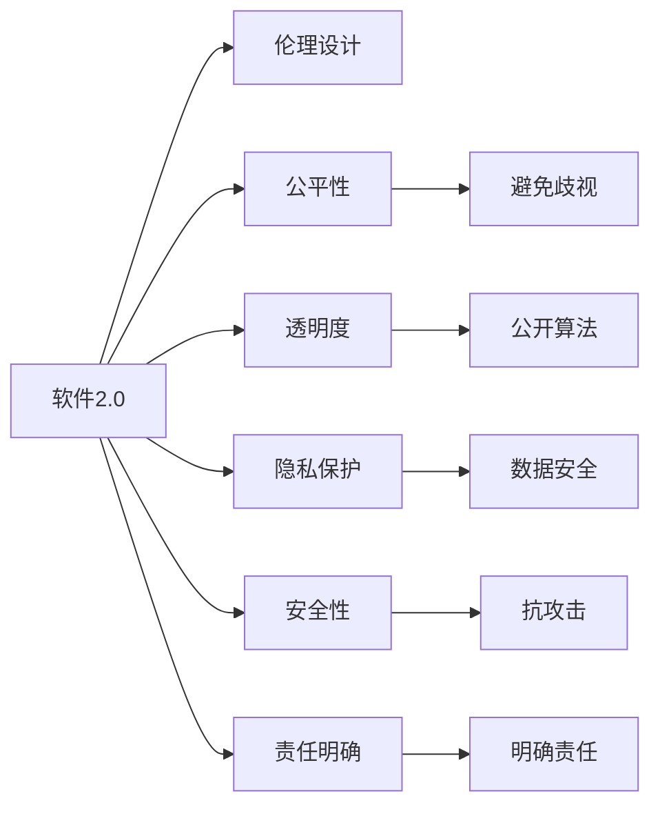

                 

## 1. 背景介绍

### 1.1 问题由来
随着人工智能（AI）技术的迅猛发展，软件系统开始具备超越传统编程逻辑的自主行为和智能决策能力。软件2.0（Software 2.0）这一概念应运而生，强调软件不仅是一系列代码和数据，更是一个拥有自我意识和智能功能的“生命体”。面对这样的新变化，如何设计伦理合理的软件系统，使其既能发挥其智能化优势，又能有效规避伦理风险，成为当前科技伦理领域的重要课题。

### 1.2 问题核心关键点
软件2.0伦理设计的核心在于确保软件系统的行为符合道德规范和法律法规，同时尊重用户隐私，维护社会公序良俗，促进公平正义。关键点包括：

- **透明性（Transparency）**：软件系统的决策过程和内部算法应公开透明，用户应能理解和解释软件的决策依据。
- **公平性（Fairness）**：软件系统应避免歧视和偏见，确保不同背景和群体的平等待遇。
- **隐私保护（Privacy Protection）**：软件系统应尊重用户隐私，避免未经授权的数据收集和使用。
- **安全性（Security）**：软件系统应具备一定的抗攻击能力，防止恶意利用。
- **责任明确（Accountability）**：软件系统在造成损害时应能够追究责任，提供必要的补救措施。

这些关键点在软件2.0的设计中缺一不可，需要从软件架构、算法选择、数据治理等多个层面进行综合考虑。

### 1.3 问题研究意义
探讨软件2.0的伦理设计原则，对于确保技术的健康发展，构建安全、公正、可解释的智能系统具有重要意义：

1. **促进技术创新**：伦理合理的设计原则能够引导开发者创造更加安全和公平的技术，推动技术社会的健康发展。
2. **保障用户权益**：透明和公平的设计原则可以增强用户对软件的信任，保障用户隐私和安全，提升用户体验。
3. **规避风险**：明确责任和安全性设计可以防止软件系统被滥用，降低社会风险和伦理风险。
4. **社会进步**：伦理设计原则有助于构建正义、包容、平等的智能社会，推动社会进步。

## 2. 核心概念与联系

### 2.1 核心概念概述

为了更好地理解软件2.0的伦理设计，首先介绍几个核心概念：

- **软件2.0（Software 2.0）**：指具备自主行为和智能决策能力，能够学习、进化和适应用户需求的软件系统。
- **伦理设计（Ethical Design）**：强调在软件设计过程中遵循道德规范和法律法规，确保软件系统的行为符合社会价值观。
- **公平性（Fairness）**：指软件系统在处理数据和决策时，避免对特定群体或个体产生歧视或不公平待遇。
- **透明度（Transparency）**：指软件系统的操作和决策过程公开透明，用户可以理解和解释其工作机制。
- **隐私保护（Privacy Protection）**：指软件系统在数据收集和使用过程中，尊重用户隐私，避免未经授权的个人信息使用。
- **安全性（Security）**：指软件系统具备抗攻击能力，防止恶意利用和数据泄露。
- **责任明确（Accountability）**：指软件系统在造成损害时，能够明确责任并采取补救措施。

这些核心概念共同构成了软件2.0伦理设计的基础，确保软件系统在智能化过程中不会偏离道德轨道。

### 2.2 核心概念原理和架构的 Mermaid 流程图



这个流程图展示了软件2.0伦理设计的各个核心概念及其相互关系：

1. 软件2.0通过伦理设计确保其行为符合道德规范。
2. 公平性要求软件避免歧视，确保平等对待。
3. 透明度要求软件公开算法，使用户能理解其决策过程。
4. 隐私保护要求软件尊重用户隐私，防止数据滥用。
5. 安全性要求软件具备抗攻击能力，防止恶意利用。
6. 责任明确要求软件在造成损害时，能够明确责任并采取补救措施。

## 3. 核心算法原理 & 具体操作步骤
### 3.1 算法原理概述

软件2.0的伦理设计涉及多个层次的算法和模型，其中关键在于决策算法的设计和数据治理。决策算法应确保公平性、透明度和安全性，而数据治理则应保障隐私保护和责任明确。

### 3.2 算法步骤详解

1. **算法选择**：选择合适的决策算法，如线性回归、逻辑回归、决策树、随机森林等，确保其在处理不同类型数据时具有较好的公平性和透明度。
2. **数据预处理**：对数据进行清洗、归一化、特征选择等预处理，确保数据质量。
3. **公平性约束**：通过算法约束或后处理技术，确保算法在训练和预测过程中不引入歧视或不公平。
4. **透明度增强**：使用可解释的算法或模型，如线性模型、决策树等，增加决策过程的透明度。
5. **安全性保障**：采用加密、匿名化等技术，保护数据安全，防止数据泄露。
6. **责任明确设计**：通过记录和审计日志，确保软件系统在造成损害时能够明确责任。

### 3.3 算法优缺点

**优点**：

- **公平性增强**：伦理设计的决策算法和后处理技术能够显著减少歧视，提升系统的公平性。
- **透明性提升**：透明算法和记录日志可以增强软件的可解释性，使用户更容易理解和信任软件。
- **安全性保障**：加密和匿名化技术可以有效保护用户隐私，防止数据滥用和泄露。
- **责任明确**：明确责任设计有助于在软件系统造成损害时，及时追究责任并采取补救措施。

**缺点**：

- **复杂度增加**：伦理设计的算法和数据治理策略可能增加系统的复杂度，影响性能。
- **开发成本上升**：伦理设计涉及多方面考量，可能需要投入更多的资源和时间。
- **隐私泄露风险**：尽管隐私保护技术可以提高数据安全，但仍然存在一定的泄露风险。

### 3.4 算法应用领域

软件2.0的伦理设计原则在多个领域具有广泛应用，例如：

- **医疗健康**：在医疗诊断和治疗方案推荐中，确保算法的公平性和透明度，保障患者隐私。
- **金融服务**：在信用评分和贷款审批中，防止算法偏见，保护用户隐私，增强系统的安全性。
- **教育培训**：在个性化推荐和智能评估中，确保公平性，保护学生隐私。
- **人力资源**：在招聘和员工评估中，确保算法公平，保护应聘者和员工隐私。
- **智能安防**：在面部识别和行为监控中，确保算法不歧视，保护个人隐私。

## 4. 数学模型和公式 & 详细讲解 & 举例说明

### 4.1 数学模型构建

在软件2.0的伦理设计中，数学模型构建是关键环节之一。以下是几个常见的数学模型及其构建方法：

- **线性回归模型**：用于预测连续数值型数据，公式为 $y = \beta_0 + \beta_1 x_1 + \beta_2 x_2 + \cdots + \beta_n x_n + \epsilon$，其中 $\beta$ 为模型参数，$\epsilon$ 为误差项。
- **逻辑回归模型**：用于分类问题，公式为 $\log \frac{p(y=1|x)}{p(y=0|x)} = \beta_0 + \beta_1 x_1 + \beta_2 x_2 + \cdots + \beta_n x_n$，其中 $p(y=1|x)$ 为正类概率，$p(y=0|x)$ 为负类概率。
- **决策树模型**：用于分类和回归，公式为 $D = \{(r_k, A_k), k = 1, 2, \cdots, N\}$，其中 $r_k$ 为决策规则，$A_k$ 为属性集合。

### 4.2 公式推导过程

以线性回归模型为例，推导其参数求解过程。

假设样本数据集为 $(x_i, y_i)$，其中 $x_i = [x_{i1}, x_{i2}, \cdots, x_{in}]^T$，$y_i$ 为连续型数据，目标为求解模型参数 $\beta$。最小二乘法求解过程如下：

$$
\beta = \arg\min_{\beta} \sum_{i=1}^N (y_i - (\beta_0 + \beta_1 x_{i1} + \beta_2 x_{i2} + \cdots + \beta_n x_{in}))^2
$$

根据公式可得：

$$
\beta = (\mathbf{X}^T \mathbf{X})^{-1} \mathbf{X}^T \mathbf{Y}
$$

其中 $\mathbf{X} = \begin{bmatrix} 1 & x_{11} & x_{12} & \cdots & x_{1n} \\ 1 & x_{21} & x_{22} & \cdots & x_{2n} \\ \vdots & \vdots & \vdots & \ddots & \vdots \\ 1 & x_{N1} & x_{N2} & \cdots & x_{Nn} \end{bmatrix}$，$\mathbf{Y} = \begin{bmatrix} y_1 \\ y_2 \\ \vdots \\ y_N \end{bmatrix}$。

### 4.3 案例分析与讲解

以面部识别系统为例，分析其伦理设计问题。

面部识别系统在许多场景下被广泛应用，如门禁、支付等。然而，该系统在应用过程中也存在一些伦理问题：

1. **算法偏见**：训练数据可能存在种族、性别等偏见，导致算法在处理不同种族和性别时表现不一致。
2. **隐私泄露**：面部识别涉及个人隐私，未经授权的面部信息采集和使用可能侵犯用户隐私。
3. **透明度不足**：用户通常无法理解面部识别系统的决策过程，无法解释其行为。
4. **责任不明确**：面部识别系统在造成误判时，如何明确责任是一个重要问题。

针对这些问题，可以采取以下措施：

- **数据治理**：使用多样化的数据集，确保训练数据不包含偏见，采用数据脱敏技术保护隐私。
- **算法选择**：选择可解释性强的算法，如线性回归和决策树，增加系统的透明度。
- **责任明确**：记录和审计面部识别系统的决策过程，确保在造成误判时能够追究责任。

## 5. 项目实践：代码实例和详细解释说明

### 5.1 开发环境搭建

为了进行软件2.0的伦理设计实践，需要搭建一套开发环境，具体步骤如下：

1. **安装Python**：从官网下载并安装Python 3.x版本，确保环境稳定。
2. **安装相关库**：
   ```
   pip install numpy pandas scikit-learn transformers
   ```
3. **数据准备**：收集和准备用于模型训练和测试的数据集，如面部识别数据集、医疗健康数据集等。
4. **环境配置**：设置系统变量和运行环境，确保代码能够顺利执行。

### 5.2 源代码详细实现

以下是一个使用Python和Scikit-learn库进行公平性约束的线性回归模型示例代码：

```python
from sklearn.linear_model import LinearRegression
from sklearn.preprocessing import StandardScaler, RobustScaler
from sklearn.compose import ColumnTransformer
from sklearn.pipeline import Pipeline

# 准备数据
X = df.drop('y', axis=1)
y = df['y']

# 数据预处理
scaler = RobustScaler()
preprocessor = ColumnTransformer([('scaler', scaler, ['feature_1', 'feature_2', ...])])

# 模型构建
model = Pipeline(steps=[
    ('preprocessor', preprocessor),
    ('regressor', LinearRegression())
])

# 训练模型
model.fit(X, y)
```

### 5.3 代码解读与分析

上述代码展示了使用RobustScaler进行数据预处理，并通过LinearRegression构建线性回归模型。RobustScaler能够应对异常值，避免算法偏见。通过ColumnTransformer和Pipeline，可以方便地集成数据预处理和模型训练过程，提高代码的可读性和可维护性。

### 5.4 运行结果展示

模型训练后，可以通过测试集进行验证，计算模型预测值与真实值之间的误差：

```python
from sklearn.metrics import mean_squared_error

# 测试集
X_test = df_test.drop('y', axis=1)
y_test = df_test['y']

# 模型预测
y_pred = model.predict(X_test)

# 计算误差
mse = mean_squared_error(y_test, y_pred)
print(f"Mean Squared Error: {mse:.4f}")
```

## 6. 实际应用场景

### 6.1 医疗健康

在医疗健康领域，软件2.0的伦理设计可以应用于疾病预测、治疗方案推荐和病历分析等场景。例如，通过分析患者的历史病历数据，构建预测模型，辅助医生进行疾病预测和治疗方案推荐。同时，系统应确保算法的公平性和透明度，尊重患者隐私，保护医疗数据安全。

### 6.2 金融服务

在金融服务领域，软件2.0的伦理设计可以应用于信用评分、贷款审批和欺诈检测等场景。系统应确保算法不引入歧视，保护用户隐私，增强系统的安全性，明确责任设计，确保在造成损害时能够追究责任。

### 6.3 教育培训

在教育培训领域，软件2.0的伦理设计可以应用于个性化推荐和智能评估等场景。系统应确保算法公平，保护学生隐私，增强系统的透明度，明确责任设计，确保在造成误判时能够追究责任。

### 6.4 智能安防

在智能安防领域，软件2.0的伦理设计可以应用于面部识别和行为监控等场景。系统应确保算法不歧视，保护个人隐私，增强系统的透明度，明确责任设计，确保在造成误判时能够追究责任。

## 7. 工具和资源推荐

### 7.1 学习资源推荐

为了深入学习软件2.0的伦理设计，推荐以下学习资源：

1. **《人工智能伦理与隐私保护》**：由清华大学出版社出版的书籍，系统介绍了人工智能伦理的基本原理和隐私保护技术。
2. **Coursera《AI伦理与社会影响》**：由斯坦福大学提供的课程，探讨人工智能在伦理和社会影响方面的挑战和解决方案。
3. **IEEE《人工智能伦理与标准》**：IEEE发布的标准文件，提供了人工智能伦理的规范和指导。
4. **《数据科学与伦理》**：由Coursera提供的课程，介绍了数据科学和伦理之间的关系，涵盖隐私保护、公平性等内容。

### 7.2 开发工具推荐

为了进行软件2.0的伦理设计实践，推荐以下开发工具：

1. **Jupyter Notebook**：用于编写和执行Python代码，支持代码块的灵活组合和输出展示。
2. **PyTorch**：深度学习框架，支持动态计算图，适合进行复杂算法的实现和调试。
3. **TensorFlow**：深度学习框架，支持分布式计算和模型部署，适合大规模应用。
4. **TensorBoard**：用于可视化模型训练过程，帮助开发者调试和优化算法。

### 7.3 相关论文推荐

为了深入理解软件2.0的伦理设计，推荐以下相关论文：

1. **《公平性、透明度和隐私保护在人工智能中的应用》**：论文探讨了人工智能系统在公平性、透明度和隐私保护方面的挑战和解决方案。
2. **《软件2.0伦理设计原则》**：论文系统介绍了软件2.0伦理设计的核心概念和设计原则，提供了具体的实施建议。
3. **《深度学习系统的公平性和可解释性》**：论文探讨了深度学习系统在公平性和可解释性方面的改进方法，提出了一些创新技术。

## 8. 总结：未来发展趋势与挑战

### 8.1 研究成果总结

软件2.0的伦理设计已经成为人工智能技术发展的重要方向之一。本文探讨了软件2.0的伦理设计原则，提出了公平性、透明度、隐私保护、安全性、责任明确等核心概念，并提供了具体的实现方法。这些研究成果为软件2.0的伦理设计提供了理论和实践的指导。

### 8.2 未来发展趋势

展望未来，软件2.0的伦理设计将呈现以下几个发展趋势：

1. **隐私保护技术进步**：随着隐私保护技术的不断进步，软件系统将能够更好地保护用户隐私，防止数据滥用。
2. **公平性算法优化**：更多公平性算法将被开发和应用，确保软件系统的决策过程更加公平和透明。
3. **可解释性增强**：通过引入可解释性算法和模型，增强软件系统的透明度，使用户更容易理解和信任。
4. **责任明确机制完善**：通过记录和审计日志，确保软件系统在造成损害时能够明确责任。

### 8.3 面临的挑战

尽管软件2.0的伦理设计取得了一定的进展，但仍面临诸多挑战：

1. **隐私保护难度增加**：随着数据量的增加，隐私保护技术的复杂度也随之增加，如何在保护隐私的同时，不影响软件系统的性能。
2. **公平性难以衡量**：不同场景下对公平性的定义和衡量标准各不相同，如何确保算法在不同场景下的公平性是一个重要问题。
3. **透明度实现困难**：复杂的算法和模型往往难以解释，如何增强系统的透明度，使用户理解和信任，仍然是一个挑战。
4. **责任明确难度大**：在分布式和动态环境中，明确责任设计将变得更加复杂和困难。

### 8.4 研究展望

未来的研究应在以下几个方向进行突破：

1. **隐私保护新技术**：开发更加高效的隐私保护技术，如差分隐私、联邦学习等，确保在保护隐私的同时，不影响系统性能。
2. **公平性算法创新**：开发更多公平性算法，如基于对抗的公平性算法、基于公平性约束的优化算法等，确保算法在不同场景下的公平性。
3. **可解释性提升**：引入可解释性算法和模型，增强系统的透明度，使用户更容易理解和信任。
4. **责任明确机制优化**：开发更加高效的责任明确机制，确保在分布式和动态环境中，软件系统能够明确责任。

## 9. 附录：常见问题与解答

### 常见问题与解答

**Q1: 软件2.0的伦理设计是否适用于所有AI系统？**

A: 软件2.0的伦理设计原则适用于具备自主行为和智能决策能力的AI系统。然而，对于简单的规则系统或纯数据驱动的系统，可能不需要进行伦理设计。

**Q2: 如何判断一个AI系统是否具有伦理设计？**

A: 一个具备伦理设计的AI系统应该具备以下几个特点：
1. 算法和模型可解释性强，用户能够理解和信任。
2. 数据治理措施完善，保护用户隐私和数据安全。
3. 决策过程透明，能够记录和审计。
4. 在造成损害时能够明确责任，提供补救措施。

**Q3: 如何提升AI系统的公平性？**

A: 提升AI系统的公平性可以采取以下措施：
1. 使用多样化的数据集，确保训练数据不包含偏见。
2. 选择可解释性强的算法，增加系统的透明度。
3. 通过后处理技术，减少算法偏见的影响。

**Q4: 隐私保护有哪些常见技术？**

A: 隐私保护技术主要包括：
1. 数据脱敏：通过加密和匿名化技术，保护用户隐私。
2. 差分隐私：在数据分析过程中，加入噪声，防止数据泄露。
3. 联邦学习：在不共享数据的前提下，进行分布式模型训练。

**Q5: 如何记录和审计AI系统的决策过程？**

A: 记录和审计AI系统的决策过程可以采取以下措施：
1. 使用日志记录系统，记录模型输入、输出和决策依据。
2. 定期审计系统决策，发现并修复潜在问题。
3. 采用透明度工具，如LIME、SHAP等，帮助用户理解模型决策。

---

作者：禅与计算机程序设计艺术 / Zen and the Art of Computer Programming

