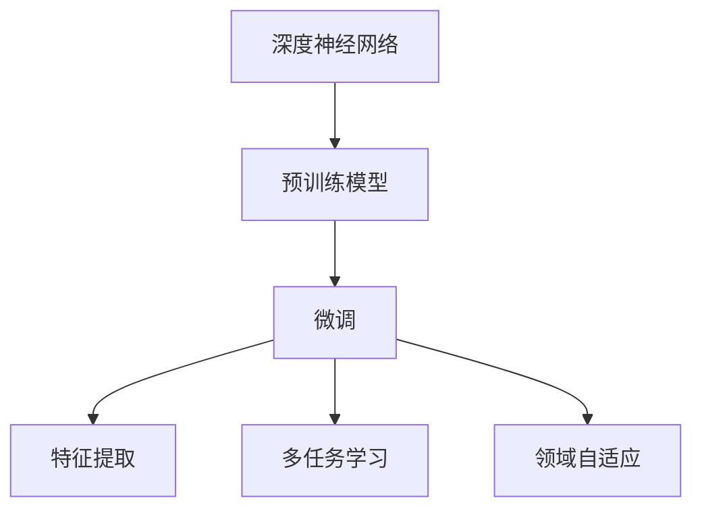

                 

## 1. 背景介绍

### 1.1 问题由来

迁移学习（Transfer Learning）是机器学习领域中一种重要的技术范式。它基于“经验之上的经验”（Experience-based Experience），利用已学习到的知识解决新问题，提升模型在特定任务上的表现。这一概念最早可以追溯到20世纪70年代，但直到近年来的深度学习时代，尤其是基于深度神经网络（DNNs）的迁移学习，才真正成为了主流。

这一范式的兴起，源于深度学习模型在计算机视觉、自然语言处理等领域所取得的巨大成功，以及海量标注数据的稀缺性。通过在特定领域收集的有限标注数据上，利用预训练模型作为初始化参数，进行微调（Fine-Tuning），可以在不牺牲模型泛化能力的前提下，大幅提升模型在新任务上的表现。这种策略不仅减少了对标注数据的依赖，降低了开发成本，还提高了模型的适应性和泛化能力。

### 1.2 问题核心关键点

迁移学习的核心思想是通过迁移已有的知识来加速新任务的学习过程。在这一范式中，主要涉及以下几个关键点：

1. **预训练模型（Pretrained Models）**：使用在大规模无标签数据上预训练得到的模型作为初始化参数。
2. **微调（Fine-Tuning）**：在新任务上对预训练模型进行有监督的调整，使其适应新任务的数据分布。
3. **特征提取（Feature Extraction）**：利用预训练模型提取任务的特征，减少对标注数据的需求。
4. **多任务学习（Multitask Learning）**：在多个相关任务上同时训练模型，促进知识的迁移和共享。
5. **领域自适应（Domain Adaptation）**：在不同领域之间的知识迁移，提升模型在特定领域的表现。

这些关键点共同构成了迁移学习的核心框架，使得模型能够在不同的任务和领域之间进行知识的迁移和应用。

### 1.3 问题研究意义

研究迁移学习，对于提升深度学习模型的泛化能力和适应性，具有重要意义：

1. **减少数据需求**：通过利用预训练模型的特征提取能力，可以减少对标注数据的依赖，降低开发成本。
2. **提升模型泛化能力**：预训练模型在大规模数据上的训练，使其具备更强的泛化能力，能够在各种新任务上快速适应和优化。
3. **加速模型训练**：通过微调，可以利用预训练模型的初始化参数，加速新任务的模型训练过程。
4. **推动技术应用**：迁移学习使得深度学习模型更容易在实际应用中落地，推动技术的产业化进程。
5. **促进理论研究**：迁移学习涉及到多个领域的知识，推动了深度学习与多领域知识的交叉融合，促进了理论研究的深入。

## 2. 核心概念与联系

### 2.1 核心概念概述

为更好地理解迁移学习，本节将介绍几个密切相关的核心概念：

- **深度神经网络（DNNs）**：通过多层的非线性变换，实现对复杂非线性数据的建模。
- **预训练模型（Pretrained Models）**：在大规模无标签数据上，通过自监督学习任务训练得到的模型，具备强大的特征提取能力。
- **微调（Fine-Tuning）**：在新任务上对预训练模型进行有监督的调整，使其适应新任务的数据分布。
- **特征提取（Feature Extraction）**：利用预训练模型提取任务的特征，减少对标注数据的需求。
- **多任务学习（Multitask Learning）**：在多个相关任务上同时训练模型，促进知识的迁移和共享。
- **领域自适应（Domain Adaptation）**：在不同领域之间的知识迁移，提升模型在特定领域的表现。

这些核心概念之间的逻辑关系可以通过以下Mermaid流程图来展示：



这个流程图展示了大规模无标签数据与新任务之间的关系：

1. 通过深度神经网络在预训练数据上进行训练，获得预训练模型。
2. 在新任务上对预训练模型进行微调，利用其特征提取能力，适应新任务的数据分布。
3. 通过特征提取和领域自适应，将预训练模型的知识应用于不同领域，提升模型在不同场景中的表现。
4. 通过多任务学习，在多个相关任务上同时训练，促进知识在不同任务之间的迁移和共享。

## 3. 核心算法原理 & 具体操作步骤
### 3.1 算法原理概述

迁移学习的核心思想是通过迁移已有的知识来解决新问题，提升模型在特定任务上的表现。其核心算法流程包括：

1. **数据预处理**：准备标注数据集，将其划分为训练集、验证集和测试集。
2. **模型初始化**：选择预训练模型作为初始化参数。
3. **微调**：在新任务上对预训练模型进行有监督的调整，以适应新任务的数据分布。
4. **评估**：在新任务上评估微调后的模型性能。
5. **应用**：将微调后的模型应用于实际任务中。

迁移学习的目标是最小化在新任务上的损失函数，通常使用交叉熵损失函数。其优化目标为：

$$
\min_{\theta} \mathcal{L}(\theta) = \frac{1}{N} \sum_{i=1}^N \ell(y_i, M_{\theta}(x_i))
$$

其中 $\theta$ 为模型参数，$\mathcal{L}$ 为损失函数，$x_i, y_i$ 分别为输入和输出，$M_{\theta}$ 为模型。

### 3.2 算法步骤详解

基于迁移学习的算法流程一般包括以下几个关键步骤：

**Step 1: 准备标注数据集**
- 收集新任务的数据集，划分为训练集、验证集和测试集。
- 确保标注数据与预训练数据的分布相似，以减少模型过拟合的风险。

**Step 2: 选择预训练模型**
- 选择合适的预训练模型作为初始化参数。如使用ImageNet上预训练的ResNet作为计算机视觉任务的初始模型。
- 选择适当的预训练模型的层次（Fine-Tuning或Frozen）。若预训练模型的层次较低，通常可以选择微调全部或部分层；若层次较高，可以选择Frozen预训练模型，仅调整顶层。

**Step 3: 定义损失函数**
- 根据新任务的性质，选择适当的损失函数。如分类任务使用交叉熵损失，回归任务使用均方误差损失。
- 设置适当的正则化技术，如L2正则化、Dropout等，以防止模型过拟合。

**Step 4: 执行梯度训练**
- 将训练集数据分批次输入模型，前向传播计算损失函数。
- 反向传播计算参数梯度，根据设定的优化算法和学习率更新模型参数。
- 周期性在验证集上评估模型性能，根据性能指标决定是否触发Early Stopping。
- 重复上述步骤直到满足预设的迭代轮数或Early Stopping条件。

**Step 5: 测试和部署**
- 在测试集上评估微调后的模型性能。
- 使用微调后的模型对新样本进行推理预测，集成到实际的应用系统中。
- 持续收集新的数据，定期重新微调模型，以适应数据分布的变化。

### 3.3 算法优缺点

迁移学习的主要优点包括：

1. **减少标注数据需求**：通过利用预训练模型的特征提取能力，可以减少对标注数据的需求。
2. **提升模型泛化能力**：预训练模型在大规模数据上的训练，使其具备更强的泛化能力。
3. **加速模型训练**：通过微调，可以利用预训练模型的初始化参数，加速新任务的模型训练过程。
4. **降低开发成本**：利用已有的预训练模型，可以减少从头训练所需的时间和计算资源。
5. **促进知识共享**：通过多任务学习，促进知识在不同任务之间的迁移和共享。

但迁移学习也存在一些局限性：

1. **领域适应性问题**：若预训练模型与新任务的领域差异较大，模型性能可能会受到影响。
2. **模型偏见**：预训练模型可能在训练数据中学习到一些偏见，这些偏见可能会在新任务中继续存在，影响模型性能。
3. **过拟合问题**：若微调过程过于复杂，可能面临过拟合的风险。

## 4. 数学模型和公式 & 详细讲解  
### 4.1 数学模型构建

本节将使用数学语言对迁移学习过程进行更加严格的刻画。

记预训练模型为 $M_{\theta}$，其中 $\theta$ 为模型参数。假设新任务的标注数据集为 $D=\{(x_i, y_i)\}_{i=1}^N, x_i \in \mathcal{X}, y_i \in \mathcal{Y}$，其中 $\mathcal{X}$ 为输入空间，$\mathcal{Y}$ 为输出空间。

定义模型 $M_{\theta}$ 在输入 $x$ 上的输出为 $M_{\theta}(x)$。在新任务上，模型的损失函数为：

$$
\mathcal{L}(\theta) = \frac{1}{N} \sum_{i=1}^N \ell(y_i, M_{\theta}(x_i))
$$

其中 $\ell$ 为损失函数，可以采用交叉熵损失函数、均方误差损失函数等。

### 4.2 公式推导过程

以二分类任务为例，推导交叉熵损失函数及其梯度的计算公式。

假设模型 $M_{\theta}$ 在输入 $x$ 上的输出为 $M_{\theta}(x) \in [0,1]$，表示样本属于正类的概率。真实标签 $y \in \{0,1\}$。则二分类交叉熵损失函数定义为：

$$
\ell(y_i, M_{\theta}(x_i)) = -[y_i\log M_{\theta}(x_i) + (1-y_i)\log(1-M_{\theta}(x_i))]
$$

将其代入经验风险公式，得：

$$
\mathcal{L}(\theta) = -\frac{1}{N}\sum_{i=1}^N [y_i\log M_{\theta}(x_i)+(1-y_i)\log(1-M_{\theta}(x_i))]
$$

根据链式法则，损失函数对参数 $\theta_k$ 的梯度为：

$$
\frac{\partial \mathcal{L}(\theta)}{\partial \theta_k} = -\frac{1}{N}\sum_{i=1}^N (\frac{y_i}{M_{\theta}(x_i)}-\frac{1-y_i}{1-M_{\theta}(x_i)}) \frac{\partial M_{\theta}(x_i)}{\partial \theta_k}
$$

其中 $\frac{\partial M_{\theta}(x_i)}{\partial \theta_k}$ 可进一步递归展开，利用自动微分技术完成计算。

## 5. 项目实践：代码实例和详细解释说明
### 5.1 开发环境搭建

在进行迁移学习实践前，我们需要准备好开发环境。以下是使用Python进行PyTorch开发的环境配置流程：

1. 安装Anaconda：从官网下载并安装Anaconda，用于创建独立的Python环境。

2. 创建并激活虚拟环境：
```bash
conda create -n pytorch-env python=3.8 
conda activate pytorch-env
```

3. 安装PyTorch：根据CUDA版本，从官网获取对应的安装命令。例如：
```bash
conda install pytorch torchvision torchaudio cudatoolkit=11.1 -c pytorch -c conda-forge
```

4. 安装Transformers库：
```bash
pip install transformers
```

5. 安装各类工具包：
```bash
pip install numpy pandas scikit-learn matplotlib tqdm jupyter notebook ipython
```

完成上述步骤后，即可在`pytorch-env`环境中开始迁移学习实践。

### 5.2 源代码详细实现

这里我们以计算机视觉中的图像分类任务为例，给出使用Transformers库对ResNet模型进行迁移学习的PyTorch代码实现。

首先，定义数据处理函数：

```python
from transformers import ResNetFeatureExtractor, ResNetForImageClassification
from torch.utils.data import Dataset
import torch

class ImageDataset(Dataset):
    def __init__(self, images, labels, feature_extractor, max_len=128):
        self.images = images
        self.labels = labels
        self.feature_extractor = feature_extractor
        
    def __len__(self):
        return len(self.images)
    
    def __getitem__(self, item):
        image = self.images[item]
        label = self.labels[item]
        
        inputs = self.feature_extractor(image, return_tensors='pt')
        inputs['labels'] = torch.tensor(label, dtype=torch.long)
        
        return inputs

# 加载特征提取器和模型
feature_extractor = ResNetFeatureExtractor.from_pretrained('resnet50')
model = ResNetForImageClassification.from_pretrained('resnet50', num_labels=1000)
```

然后，定义训练和评估函数：

```python
from transformers import AdamW

device = torch.device('cuda') if torch.cuda.is_available() else torch.device('cpu')
model.to(device)

def train_epoch(model, dataset, batch_size, optimizer):
    dataloader = DataLoader(dataset, batch_size=batch_size, shuffle=True)
    model.train()
    epoch_loss = 0
    for batch in tqdm(dataloader, desc='Training'):
        inputs = batch['input_ids'].to(device)
        labels = batch['labels'].to(device)
        model.zero_grad()
        outputs = model(inputs, labels=labels)
        loss = outputs.loss
        epoch_loss += loss.item()
        loss.backward()
        optimizer.step()
    return epoch_loss / len(dataloader)

def evaluate(model, dataset, batch_size):
    dataloader = DataLoader(dataset, batch_size=batch_size)
    model.eval()
    preds, labels = [], []
    with torch.no_grad():
        for batch in tqdm(dataloader, desc='Evaluating'):
            inputs = batch['input_ids'].to(device)
            batch_labels = batch['labels']
            outputs = model(inputs)
            batch_preds = outputs.logits.argmax(dim=1).to('cpu').tolist()
            batch_labels = batch_labels.to('cpu').tolist()
            for pred, label in zip(batch_preds, batch_labels):
                preds.append(pred)
                labels.append(label)
                
    print(classification_report(labels, preds))
```

最后，启动训练流程并在测试集上评估：

```python
epochs = 5
batch_size = 16

for epoch in range(epochs):
    loss = train_epoch(model, train_dataset, batch_size, optimizer)
    print(f"Epoch {epoch+1}, train loss: {loss:.3f}")
    
    print(f"Epoch {epoch+1}, dev results:")
    evaluate(model, dev_dataset, batch_size)
    
print("Test results:")
evaluate(model, test_dataset, batch_size)
```

以上就是使用PyTorch对ResNet进行迁移学习的完整代码实现。可以看到，得益于Transformers库的强大封装，我们可以用相对简洁的代码完成迁移学习任务。

### 5.3 代码解读与分析

让我们再详细解读一下关键代码的实现细节：

**ImageDataset类**：
- `__init__`方法：初始化图像、标签、特征提取器等关键组件。
- `__len__`方法：返回数据集的样本数量。
- `__getitem__`方法：对单个样本进行处理，将图像输入转换为特征表示，并将标签转换为模型所需的输入。

**特征提取器和模型加载**：
- 使用ResNetFeatureExtractor加载特征提取器，使用ResNetForImageClassification加载模型，并设置合适的输出类别数。

**训练和评估函数**：
- 使用PyTorch的DataLoader对数据集进行批次化加载，供模型训练和推理使用。
- 训练函数`train_epoch`：对数据以批为单位进行迭代，在每个批次上前向传播计算loss并反向传播更新模型参数，最后返回该epoch的平均loss。
- 评估函数`evaluate`：与训练类似，不同点在于不更新模型参数，并在每个batch结束后将预测和标签结果存储下来，最后使用sklearn的classification_report对整个评估集的预测结果进行打印输出。

**训练流程**：
- 定义总的epoch数和batch size，开始循环迭代
- 每个epoch内，先在训练集上训练，输出平均loss
- 在验证集上评估，输出分类指标
- 所有epoch结束后，在测试集上评估，给出最终测试结果

可以看到，PyTorch配合Transformers库使得迁移学习的代码实现变得简洁高效。开发者可以将更多精力放在数据处理、模型改进等高层逻辑上，而不必过多关注底层的实现细节。

当然，工业级的系统实现还需考虑更多因素，如模型的保存和部署、超参数的自动搜索、更灵活的任务适配层等。但核心的迁移学习范式基本与此类似。

## 6. 实际应用场景
### 6.1 智能推荐系统

基于迁移学习的推荐系统，可以广泛应用在电商、社交网络、视频网站等平台，为用户推荐个性化内容。传统的推荐系统往往只依赖用户的历史行为数据进行物品推荐，难以捕捉用户的兴趣和偏好。而迁移学习可以利用预训练模型提取用户兴趣，结合实际行为数据，提升推荐系统的效果。

具体而言，可以收集用户的浏览、点击、评分等行为数据，提取和用户交互的物品的特征向量，构建用户兴趣向量。使用预训练的图像特征提取器（如ResNet）对物品图片进行特征提取，结合用户的兴趣向量进行相似度计算，推荐相似物品。此外，还可以利用迁移学习的方法，在多个相关任务上训练模型，如用户画像生成、物品属性匹配等，进一步提升推荐系统的效果。

### 6.2 自然语言处理

迁移学习在自然语言处理（NLP）领域也有广泛应用。例如，利用预训练的语言模型（如BERT）提取文本的语义表示，作为迁移学习的特征表示。在新任务上对模型进行微调，可以得到比从头训练更高效的模型。这种方法在文本分类、命名实体识别、情感分析等任务上都有应用。

在实际应用中，可以收集特定领域的标注数据，如医疗领域的疾病描述、医疗报告等，使用预训练的语言模型对其进行微调，提升模型在医疗领域的表现。

### 6.3 计算机视觉

计算机视觉中的迁移学习也有重要应用。例如，在图像分类、目标检测、图像分割等任务上，使用预训练的模型作为初始化参数，在新任务上进行微调，可以获得更好的性能。此外，迁移学习还可以用于图像生成任务，如风格迁移、图像修复等，利用预训练模型生成符合特定风格或修复目标的图像。

## 7. 工具和资源推荐
### 7.1 学习资源推荐

为了帮助开发者系统掌握迁移学习的理论基础和实践技巧，这里推荐一些优质的学习资源：

1. 《深度学习》书籍：Ian Goodfellow、Yoshua Bengio和Aaron Courville的《深度学习》，全面介绍了深度学习的基础知识和经典模型。
2. CS231n《卷积神经网络》课程：斯坦福大学开设的计算机视觉经典课程，介绍了卷积神经网络、迁移学习等重要概念。
3. CS224n《序列建模》课程：斯坦福大学开设的自然语言处理课程，介绍了序列建模、迁移学习等重要概念。
4.《Python深度学习》书籍：François Chollet的《Python深度学习》，介绍了TensorFlow、Keras等框架，以及迁移学习的应用。
5. HuggingFace官方文档：Transformers库的官方文档，提供了海量预训练模型和迁移学习的样例代码，是入门和实践的必备资料。

通过对这些资源的学习实践，相信你一定能够快速掌握迁移学习的精髓，并用于解决实际的机器学习问题。
###  7.2 开发工具推荐

高效的开发离不开优秀的工具支持。以下是几款用于迁移学习开发的常用工具：

1. PyTorch：基于Python的开源深度学习框架，灵活动态的计算图，适合快速迭代研究。
2. TensorFlow：由Google主导开发的开源深度学习框架，生产部署方便，适合大规模工程应用。
3. Transformers库：HuggingFace开发的NLP工具库，集成了众多SOTA模型，支持PyTorch和TensorFlow，是进行迁移学习任务的开发利器。
4. Weights & Biases：模型训练的实验跟踪工具，可以记录和可视化模型训练过程中的各项指标，方便对比和调优。
5. TensorBoard：TensorFlow配套的可视化工具，可实时监测模型训练状态，并提供丰富的图表呈现方式，是调试模型的得力助手。

合理利用这些工具，可以显著提升迁移学习的开发效率，加快创新迭代的步伐。

### 7.3 相关论文推荐

迁移学习的研究源于学界的持续研究。以下是几篇奠基性的相关论文，推荐阅读：

1. ImageNet Classification with Deep Convolutional Neural Networks：Hinton等人提出的卷积神经网络在ImageNet数据集上的应用，奠定了迁移学习在计算机视觉领域的基础。
2. Learning from Large-Scale Noisy Data with Convex-Concave Procedure：Robinton等人提出的迁移学习算法，解决了在噪声数据上训练模型的难题。
3. A Survey of Transfer Learning：Peng等人对迁移学习的全面综述，涵盖了迁移学习的基本概念、算法和应用。
4. Cross-View Action Recognition using Deep Transfer Learning with Multi-Channel Loss Function：Pan等人提出的多模态迁移学习方法，将视觉、听觉等多模态数据结合，提升了迁移学习的效果。
5. Adversarial Examples for Evasion Attacks against Machine Learning Models：Szegedy等人提出的对抗训练方法，通过加入对抗样本，提高了迁移学习模型的鲁棒性。

这些论文代表了大规模迁移学习的最新进展，通过学习这些前沿成果，可以帮助研究者把握学科前进方向，激发更多的创新灵感。

## 8. 总结：未来发展趋势与挑战
### 8.1 总结

本文对迁移学习的核心思想和实践方法进行了全面系统的介绍。首先阐述了迁移学习的重要性和实际应用场景，明确了迁移学习在减少数据需求、提升模型泛化能力等方面的独特价值。其次，从原理到实践，详细讲解了迁移学习的数学模型和关键步骤，给出了迁移学习任务开发的完整代码实例。同时，本文还广泛探讨了迁移学习在多个领域的应用前景，展示了其广阔的应用前景。最后，精选了迁移学习的各类学习资源，力求为读者提供全方位的技术指引。

通过本文的系统梳理，可以看到，迁移学习技术已经在多个领域得到了广泛应用，为机器学习模型的泛化能力和适应性带来了显著提升。未来，随着迁移学习理论的不断深入和实践的不断探索，相信迁移学习将继续在人工智能技术的发展中发挥重要作用，推动机器学习技术向更广泛的应用场景迈进。

### 8.2 未来发展趋势

展望未来，迁移学习技术将呈现以下几个发展趋势：

1. **模型规模持续增大**：随着算力成本的下降和数据规模的扩张，深度神经网络的规模将持续增大，为迁移学习提供更强大的模型支持。
2. **多模态迁移学习**：除了图像、文本数据，迁移学习还将在多模态数据上得到广泛应用，如图像、语音、视频等。多模态数据的结合将提升模型的综合能力。
3. **小样本学习**：迁移学习将在小样本学习场景中得到广泛应用，利用预训练模型的特征提取能力，提升模型在小数据上的表现。
4. **自适应迁移学习**：随着数据分布的变化，迁移学习将更加注重模型的自适应能力，通过持续学习不断更新模型，以适应新数据的分布。
5. **领域自适应**：迁移学习将在不同领域之间进行知识迁移，提升模型在特定领域的表现。
6. **实时迁移学习**：迁移学习将更多地应用于实时场景，如自动驾驶、实时推荐等，对模型的实时性和适应性提出了更高的要求。

以上趋势凸显了迁移学习的广阔前景。这些方向的探索发展，必将进一步提升迁移学习模型的泛化能力和适应性，为机器学习技术的应用提供新的突破。

### 8.3 面临的挑战

尽管迁移学习技术已经取得了瞩目成就，但在迈向更加智能化、普适化应用的过程中，它仍面临着诸多挑战：

1. **数据分布变化**：随着数据分布的变化，迁移学习模型的泛化能力可能会受到影响，需要更多探索自适应迁移学习方法。
2. **模型泛化性不足**：迁移学习模型在新任务上的表现可能不够理想，需要更多研究模型泛化能力的提升方法。
3. **计算资源需求高**：大规模深度神经网络对计算资源的需求较高，需要更多研究高效训练方法和资源优化技术。
4. **可解释性不足**：迁移学习模型通常具有黑盒特性，难以解释其内部工作机制和决策逻辑，需要更多研究模型的可解释性和透明性。
5. **隐私与安全问题**：迁移学习模型在实际应用中可能面临隐私和安全问题，需要更多研究模型的隐私保护和安全保障。

正视迁移学习面临的这些挑战，积极应对并寻求突破，将是大规模迁移学习技术走向成熟的必由之路。相信随着学界和产业界的共同努力，这些挑战终将一一被克服，迁移学习技术将在人工智能技术的发展中发挥重要作用。

### 8.4 未来突破

面对迁移学习面临的种种挑战，未来的研究需要在以下几个方面寻求新的突破：

1. **探索多模态迁移学习方法**：将视觉、语音、文本等多模态数据结合，提升模型的综合能力。
2. **研究小样本学习算法**：在少样本数据上，利用迁移学习的方法，提升模型的学习效率和泛化能力。
3. **引入因果推理**：通过引入因果推理方法，增强模型的因果关系建立能力，提高模型的泛化性和鲁棒性。
4. **结合对抗训练**：通过加入对抗样本，提高模型的鲁棒性和泛化能力，增强模型的安全性。
5. **融合知识图谱**：将知识图谱与迁移学习结合，提升模型的推理能力和知识整合能力。
6. **引入伦理约束**：在迁移学习目标中引入伦理导向的评估指标，过滤和惩罚有害的输出倾向。

这些研究方向的探索，必将引领迁移学习技术迈向更高的台阶，为构建安全、可靠、可解释、可控的智能系统铺平道路。面向未来，迁移学习技术还需要与其他人工智能技术进行更深入的融合，如知识表示、因果推理、强化学习等，多路径协同发力，共同推动人工智能技术的进步。

## 9. 附录：常见问题与解答

**Q1：什么是迁移学习？**

A: 迁移学习是一种机器学习技术，利用已有知识解决新问题，提升模型在新任务上的表现。其核心思想是经验之上的经验。

**Q2：迁移学习的主要优势有哪些？**

A: 迁移学习的主要优势包括：
1. 减少数据需求：利用预训练模型的特征提取能力，减少对标注数据的需求。
2. 提升模型泛化能力：预训练模型在大规模数据上的训练，使其具备更强的泛化能力。
3. 加速模型训练：利用预训练模型的初始化参数，加速新任务的模型训练过程。
4. 降低开发成本：利用已有的预训练模型，减少从头训练所需的时间和计算资源。
5. 促进知识共享：在多个相关任务上同时训练模型，促进知识的迁移和共享。

**Q3：迁移学习的主要步骤是什么？**

A: 迁移学习的主要步骤包括：
1. 准备标注数据集。
2. 选择预训练模型作为初始化参数。
3. 定义损失函数。
4. 执行梯度训练。
5. 评估模型性能。
6. 应用模型于实际任务。

**Q4：迁移学习的主要挑战有哪些？**

A: 迁移学习的主要挑战包括：
1. 数据分布变化。
2. 模型泛化性不足。
3. 计算资源需求高。
4. 可解释性不足。
5. 隐私与安全问题。

**Q5：如何应对迁移学习中的数据分布变化？**

A: 应对数据分布变化的方法包括：
1. 自适应迁移学习方法：通过持续学习不断更新模型，以适应新数据的分布。
2. 领域自适应方法：在不同领域之间进行知识迁移，提升模型在特定领域的表现。

**Q6：如何提高迁移学习模型的泛化能力？**

A: 提高迁移学习模型的泛化能力的方法包括：
1. 引入因果推理方法：增强模型的因果关系建立能力，提高模型的泛化性和鲁棒性。
2. 融合知识图谱：将知识图谱与迁移学习结合，提升模型的推理能力和知识整合能力。

通过这些方法，可以提升迁移学习模型的泛化能力和适应性，更好地适应新任务和新数据。

