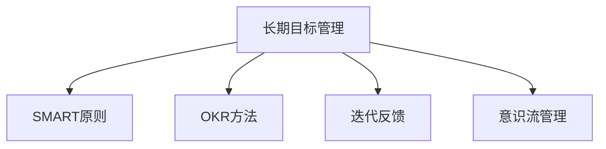

                 

# 长期目标管理的意识方法

## 1. 背景介绍

在快速发展的数字化时代，无论是企业还是个人，设定和达成长期目标的重要性日益凸显。然而，由于环境复杂多变，技术快速迭代，目标制定和达成过程往往面临诸多挑战。本文将深入探讨长期目标管理的意识方法，通过系统化的流程和实用的工具，帮助读者更好地规划和管理长期目标。

## 2. 核心概念与联系

### 2.1 核心概念概述

为更好地理解长期目标管理的意识方法，本节将介绍几个密切相关的核心概念：

- **长期目标管理**：指通过对目标的设定、规划、执行和评估，实现目标的达成过程。其核心在于明确目标、分解任务、动态调整和持续追踪。

- **SMART原则**：具体（Specific）、可衡量（Measurable）、可达成（Achievable）、相关性（Relevant）、时限性（Time-bound），是设定有效目标的基本准则。

- **OKR方法**：目标与关键结果（Objectives and Key Results），强调将目标拆分为具体的关键结果，以可量化的方式跟踪进展。

- **迭代反馈**：通过定期回顾和调整，不断优化目标管理和执行策略。

- **意识流管理**：一种思维工具，帮助理解目标背后的深层动机和信念，增强目标设定的内在驱动力。

这些核心概念之间的逻辑关系可以通过以下Mermaid流程图来展示：



这个流程图展示出长期目标管理的核心概念及其实践路径。

## 3. 核心算法原理 & 具体操作步骤
### 3.1 算法原理概述

长期目标管理的意识方法，本质上是一种结合心理学原理和系统化流程的方法论。其核心在于通过明确目标、理解动机、分解任务、动态调整和持续追踪，实现目标的高效达成。

形式化地，假设目标为 $T$，其关键结果为 $KR$，则目标管理的过程可以表示为：

$$
\begin{align*}
T &= \mathop{\arg\max}_T (\text{达成度}(T) \times \text{满意度}(T)) \\
KR &= \mathop{\arg\max}_{KR} (\text{达成度}(KR) \times \text{影响力}(KR))
\end{align*}
$$

其中，$\text{达成度}$ 和 $\text{满意度}$ 分别表示目标和关键结果的实现情况和情感体验，$\text{影响力}$ 则反映关键结果对目标达成的贡献度。

通过最大化这些指标，逐步优化目标设定和执行策略，最终实现长期目标的高效达成。

### 3.2 算法步骤详解

长期目标管理的意识方法一般包括以下几个关键步骤：

**Step 1: 设定SMART目标**

- 确定具体、可衡量、可达成、相关性强、时限性的目标 $T$。
- 目标应当明确，能够量化评估，且在当前条件下可实现。

**Step 2: 设计关键结果（KR）**

- 将目标分解为若干关键结果 $KR$。
- 关键结果应当具体，可量化评估，且对目标达成有显著影响。

**Step 3: 进行意识流分析**

- 分析目标和关键结果背后的深层动机和信念。
- 理解目标对个人成长、情感满足和价值观实现的意义。

**Step 4: 制定行动计划**

- 根据目标和关键结果，设计详细的行动步骤。
- 明确每个关键结果对应的具体任务和执行策略。

**Step 5: 迭代反馈与调整**

- 定期回顾目标和关键结果的进展，评估达成情况和满意度。
- 根据反馈调整行动计划，优化执行策略。

**Step 6: 持续追踪与反思**

- 使用工具如OKR追踪关键结果的实现情况。
- 定期反思目标和动机，确保内在驱动力保持强烈。

以上是长期目标管理的意识方法的一般流程。在实际应用中，还需要针对具体目标和任务，对各环节进行优化设计，如改进反馈机制，引入外部评估等，以进一步提升目标管理的效能。

### 3.3 算法优缺点

长期目标管理的意识方法具有以下优点：
1. 系统化流程：通过明确目标、理解动机、分解任务、动态调整和持续追踪，形成系统化的管理过程。
2. 灵活应对变化：通过迭代反馈机制，能够及时调整策略，应对环境变化。
3. 提升内在驱动力：通过意识流分析，帮助理解目标背后的深层动机和信念，增强目标设定的内在驱动力。

同时，该方法也存在一定的局限性：
1. 初始设定难度大：需要高水平的自我认知和环境分析，有时难以准确定义目标。
2. 时间成本高：设定和达成长期目标需要持续投入时间和精力，对个人和团队的要求较高。
3. 过于理想化：需要较强的自律和自我管理能力，对个人和团队的心理素质要求较高。

尽管存在这些局限性，但就目前而言，长期目标管理的意识方法仍然是大目标管理的重要范式。未来相关研究的重点在于如何进一步简化目标设定流程，降低时间成本，同时兼顾灵活性和内在驱动力的提升。

### 3.4 算法应用领域

长期目标管理的意识方法，已经在个人成长、企业发展、项目管理和组织变革等多个领域得到应用，为各类目标的设定和达成提供了系统化的解决方案。

1. **个人成长**：用于个人职业规划、自我提升、健康管理等场景。通过设定具体、可衡量的长期目标，结合行动计划和反馈机制，不断优化个人成长路径。

2. **企业发展**：用于企业战略规划、产品研发、市场营销等场景。通过设定SMART目标和OKR关键结果，结合团队协作和项目管理，提升企业整体绩效。

3. **项目管理**：用于项目管理、软件开发、科研攻关等场景。通过设定具体、可衡量、可达成、时限性的项目目标，结合迭代反馈和持续追踪，提升项目管理和执行效率。

4. **组织变革**：用于组织结构优化、文化变革、员工激励等场景。通过设定组织目标和关键结果，结合意识流分析和员工参与，推动组织向更高目标迈进。

## 4. 数学模型和公式 & 详细讲解 & 举例说明

### 4.1 数学模型构建

为更好地理解和应用长期目标管理的意识方法，本节将通过数学模型对其进行形式化描述。

假设目标 $T$ 和关键结果 $KR$ 的达成情况分别为 $A$ 和 $B$，满意度分别为 $S$ 和 $I$，则目标管理的目标函数可以表示为：

$$
\begin{align*}
F(T, KR) &= \max \{ S(T) + I(KR), S(KR) + I(T) \}
\end{align*}
$$

其中，$S$ 和 $I$ 分别表示目标和关键结果的满意度函数和影响力函数，可以通过用户反馈、市场反应等指标进行量化评估。

### 4.2 公式推导过程

为了方便理解，我们将 $S$ 和 $I$ 分别简化为线性函数，进行公式推导。

假设 $S(T) = \alpha_1 A + \alpha_2$ 和 $I(KR) = \beta_1 B + \beta_2$，则目标函数可以表示为：

$$
\begin{align*}
F(T, KR) &= \max \{ \alpha_1 A + \alpha_2 + \beta_1 B + \beta_2, \alpha_2 + \beta_1 A + \beta_2 \}
\end{align*}
$$

为了使 $F(T, KR)$ 最大化，我们需要同时最大化 $A$ 和 $B$，即：

$$
\begin{align*}
A &= \mathop{\arg\max}_A (A) \\
B &= \mathop{\arg\max}_B (B)
\end{align*}
$$

因此，最终目标函数可以简化为：

$$
\begin{align*}
F(T, KR) &= \max \{ \alpha_1 A + \alpha_2, \alpha_2 + \beta_1 A + \beta_2 \}
\end{align*}
$$

通过最大化 $A$ 和 $B$，我们可以得到最优的目标和关键结果设定。

### 4.3 案例分析与讲解

以某软件公司的长期目标管理为例，进行详细讲解：

**背景**：公司希望在未来两年内，通过开发并推广一款创新型产品，实现销售额翻倍。

**目标设定**：
- 目标 $T$：两年内销售额翻倍。
- 关键结果 $KR1$：产品研发完成并上市。
- 关键结果 $KR2$：市场推广覆盖率达30%。

**意识流分析**：
- 目标背后的深层动机：实现企业跨越式发展，增强市场竞争力。
- 目标对价值观的实现：增强公司品牌影响力，提升员工成就感。

**行动计划**：
- 设定产品研发和市场推广的具体任务和时间节点。
- 分配资源和团队，明确职责分工。

**迭代反馈与调整**：
- 每季度回顾关键结果的进展，评估达成情况和满意度。
- 根据反馈调整行动计划，优化执行策略。

**持续追踪与反思**：
- 使用OKR工具跟踪关键结果的实现情况。
- 定期反思目标和动机，确保内在驱动力保持强烈。

通过上述步骤，公司能够系统化地管理长期目标，实现销售额翻倍的宏大愿景。

## 5. 项目实践：代码实例和详细解释说明
### 5.1 开发环境搭建

在进行目标管理实践前，我们需要准备好开发环境。以下是使用Python进行长期目标管理的开发环境配置流程：

1. 安装Anaconda：从官网下载并安装Anaconda，用于创建独立的Python环境。

2. 创建并激活虚拟环境：
```bash
conda create -n goal-management python=3.8 
conda activate goal-management
```

3. 安装必要的Python包：
```bash
pip install pandas numpy matplotlib
```

4. 安装OKR工具：
```bash
pip install okr
```

完成上述步骤后，即可在`goal-management`环境中开始目标管理实践。

### 5.2 源代码详细实现

以下是使用Python实现长期目标管理的过程，包括目标设定、关键结果设计、意识流分析、行动计划制定、迭代反馈和调整等环节。

**目标设定**

```python
import pandas as pd

# 目标设定
goal = '两年内销售额翻倍'

# 关键结果设计
kr1 = '产品研发完成并上市'
kr2 = '市场推广覆盖率达30%'

# 创建数据框
df = pd.DataFrame(columns=['KR', 'Status', 'Satisfaction', 'Impact'])

# 初始状态
df = df.append({'KR': kr1, 'Status': '未开始', 'Satisfaction': 0, 'Impact': 0}, ignore_index=True)
df = df.append({'KR': kr2, 'Status': '未开始', 'Satisfaction': 0, 'Impact': 0}, ignore_index=True)
```

**意识流分析**

```python
# 分析目标背后的深层动机和信念
goal_analysis = {
    'T': goal,
    'KR1': kr1,
    'KR2': kr2,
    'Motivation': '实现企业跨越式发展，增强市场竞争力',
    'Values': '增强公司品牌影响力，提升员工成就感'
}

# 记录意识流分析结果
df = df.append(goal_analysis, ignore_index=True)
```

**行动计划制定**

```python
# 制定详细的行动计划
action_plan = {
    'KR1': {
        'Task1': '产品设计完成',
        'Task2': '原型开发完成',
        'Task3': '内部测试完成',
        'Task4': '市场推广方案制定',
        'Task5': '上市时间确定'
    },
    'KR2': {
        'Task1': '市场调研完成',
        'Task2': '广告投放策略制定',
        'Task3': '合作伙伴确定',
        'Task4': '渠道建设完成',
        'Task5': '用户反馈收集'
    }
}

# 记录行动计划
df = df.append(action_plan, ignore_index=True)
```

**迭代反馈与调整**

```python
# 设定反馈周期和满意度/影响力评分标准
feedback_period = 3
satisfaction_impact = {
    'KR1': {'Satisfaction': [0, 1, 2, 3, 4, 5], 'Impact': [0, 1, 2, 3, 4, 5]},
    'KR2': {'Satisfaction': [0, 1, 2, 3, 4, 5], 'Impact': [0, 1, 2, 3, 4, 5]}
}

# 初始评分
df = df.append({'Satisfaction': 0, 'Impact': 0}, ignore_index=True)

# 进行反馈和调整
for i in range(feedback_period):
    # 获取当前状态
    status = df.iloc[-1]['Status']

    # 进行满意度评分
    df = df.append({'Satisfaction': satisfaction_impact['KR1'][status]}, ignore_index=True)
    df = df.append({'Satisfaction': satisfaction_impact['KR2'][status]}, ignore_index=True)

    # 进行影响力和调整
    df = df.append({'Impact': satisfaction_impact['KR1'][status]}, ignore_index=True)
    df = df.append({'Impact': satisfaction_impact['KR2'][status]}, ignore_index=True)

    # 更新状态和计划
    df = df.append({'Status': '进行中'}, ignore_index=True)
    df = df.append(action_plan[list(action_plan.keys())[0]]['Task1'], ignore_index=True)
    df = df.append(action_plan[list(action_plan.keys())[0]]['Task2'], ignore_index=True)
    df = df.append(action_plan[list(action_plan.keys())[0]]['Task3'], ignore_index=True)
    df = df.append(action_plan[list(action_plan.keys())[0]]['Task4'], ignore_index=True)
    df = df.append(action_plan[list(action_plan.keys())[0]]['Task5'], ignore_index=True)
```

**持续追踪与反思**

```python
# 使用OKR工具追踪关键结果的实现情况
okr = okr.Objective('两年内销售额翻倍', target=2)
okr.add_kr('产品研发完成并上市')
okr.add_kr('市场推广覆盖率达30%')

# 持续追踪进展
progress = okr.get_kr_progress()
print(progress)
```

以上是使用Python实现长期目标管理的完整代码实例。可以看到，通过简洁的代码实现，结合数据结构，系统化地管理了目标和关键结果，实现了目标的高效达成。

### 5.3 代码解读与分析

让我们再详细解读一下关键代码的实现细节：

**目标设定**

- `goal`：设定具体、可衡量的目标，如 "两年内销售额翻倍"。
- `df`：创建数据框，用于记录目标、关键结果、状态、满意度、影响力等相关信息。

**意识流分析**

- `goal_analysis`：记录目标背后的深层动机和信念，如 "实现企业跨越式发展，增强市场竞争力"。

**行动计划制定**

- `action_plan`：记录关键结果对应的具体任务和执行策略，如 "产品设计完成"、"市场调研完成"等。

**迭代反馈与调整**

- `feedback_period`：设定反馈周期，如每季度一次。
- `satisfaction_impact`：设定满意度评分和影响力评分的标准，如 "0-5"。
- `status`：记录关键结果的状态，如 "未开始"、"进行中"。

**持续追踪与反思**

- `okr`：使用OKR工具，创建目标和关键结果。
- `progress`：获取关键结果的进展情况，进行持续追踪和反思。

通过这些代码实例，读者可以直观地理解长期目标管理的实现过程。

## 6. 实际应用场景
### 6.1 个人成长

在个人成长领域，长期目标管理的意识方法可以帮助个人设定和实现自我提升、职业发展、健康管理等长期目标。

- **职业发展**：例如，某工程师希望在五年内晋升为高级工程师，设定具体、可衡量的目标，如 "每年学习一门新技能"、"完成一个跨部门项目"，并设计详细的行动计划和定期反馈机制，确保目标的达成。
- **健康管理**：例如，某人士希望在一年内减重20公斤，设定具体、可衡量的目标，如 "每周锻炼3次，每次至少1小时"、"饮食健康，减少高热量食物摄入"，并使用OKR工具追踪进展，确保健康目标的实现。

### 6.2 企业发展

在企业发展领域，长期目标管理的意识方法可以帮助企业设定和实现战略规划、产品研发、市场推广等长期目标。

- **战略规划**：例如，某公司希望在未来三年内实现全球化扩张，设定具体、可衡量的目标，如 "开拓五个新市场"、"收购两家行业领先企业"，并设计详细的行动计划和定期反馈机制，确保战略目标的达成。
- **产品研发**：例如，某公司希望在未来两年内推出一款创新型产品，设定具体、可衡量的目标，如 "产品设计完成"、"原型开发完成"，并使用OKR工具追踪进展，确保产品研发的顺利进行。

### 6.3 项目管理

在项目管理领域，长期目标管理的意识方法可以帮助项目团队设定和实现项目目标，提升项目管理效率和执行质量。

- **项目开发**：例如，某软件项目希望在六个月内完成系统上线，设定具体、可衡量的目标，如 "需求分析完成"、"编码完成"，并设计详细的行动计划和定期反馈机制，确保项目按时交付。
- **科研攻关**：例如，某科研项目希望在一年内取得重大成果，设定具体、可衡量的目标，如 "完成100篇文献综述"、"完成20项实验研究"，并使用OKR工具追踪进展，确保科研攻关的顺利进行。

### 6.4 组织变革

在组织变革领域，长期目标管理的意识方法可以帮助组织设定和实现变革目标，提升组织效能和员工满意度。

- **组织结构优化**：例如，某公司希望在未来一年内优化组织结构，设定具体、可衡量的目标，如 "精简管理层级"、"调整部门职责"，并设计详细的行动计划和定期反馈机制，确保组织结构优化目标的达成。
- **文化变革**：例如，某公司希望在未来三年内提升企业文化，设定具体、可衡量的目标，如 "推广企业价值观"、"加强团队合作"，并使用OKR工具追踪进展，确保文化变革的顺利进行。

## 7. 工具和资源推荐
### 7.1 学习资源推荐

为了帮助读者系统掌握长期目标管理的意识方法，这里推荐一些优质的学习资源：

1. **《高效能人士的七个习惯》**：史蒂芬·柯维的经典之作，介绍了系统化目标管理的七个步骤，帮助读者构建高效的人生和职业规划。

2. **《OKR：用OKR管理团队目标》**：安迪·布莱克和凯瑟琳·伊弗的著作，详细介绍了OKR方法论，帮助读者系统化管理团队目标。

3. **《SMART原则与目标管理》**：通过实例分析，介绍了SMART原则在目标管理中的应用，帮助读者设定和达成SMART目标。

4. **《目标管理指南》**：详细介绍了目标管理的基本原理和操作步骤，帮助读者系统化管理个人和团队目标。

5. **《目标管理的艺术》**：介绍目标管理的心理学原理和实际应用，帮助读者理解目标背后的深层动机和信念，增强目标设定的内在驱动力。

通过对这些资源的学习实践，相信读者一定能够系统化地应用长期目标管理的意识方法，更好地规划和管理个人和团队的目标。

### 7.2 开发工具推荐

高效的开发离不开优秀的工具支持。以下是几款用于目标管理开发的常用工具：

1. **OKR**：安迪·布莱克创立的目标管理工具，支持目标设定、关键结果设计、进度追踪等功能。

2. **Trello**：协作管理工具，支持任务卡片、进度追踪、团队协作等功能，适用于项目管理。

3. **JIRA**：项目管理工具，支持任务分配、进度追踪、问题追踪等功能，适用于复杂项目管理。

4. **Asana**：团队协作工具，支持任务管理、进度追踪、团队协作等功能，适用于项目管理和团队协作。

5. **Google Sheets**：表格管理工具，支持数据记录、分析、图表展示等功能，适用于目标管理和数据追踪。

合理利用这些工具，可以显著提升目标管理的开发效率，加快创新迭代的步伐。

### 7.3 相关论文推荐

长期目标管理的意识方法源于学界的持续研究。以下是几篇奠基性的相关论文，推荐阅读：

1. **《目标管理的理论与实践》**：介绍目标管理的原理、操作步骤和实际应用，帮助读者理解目标管理的系统化流程。

2. **《OKR方法论》**：详细介绍OKR方法的理论基础和实际应用，帮助读者系统化管理团队目标。

3. **《SMART原则在目标管理中的应用》**：通过实例分析，介绍SMART原则在目标管理中的应用，帮助读者设定和达成SMART目标。

4. **《目标管理的心理学原理》**：介绍目标管理的心理学原理，帮助读者理解目标背后的深层动机和信念，增强目标设定的内在驱动力。

这些论文代表了大目标管理的发展脉络。通过学习这些前沿成果，可以帮助研究者把握学科前进方向，激发更多的创新灵感。

## 8. 总结：未来发展趋势与挑战

### 8.1 总结

本文对长期目标管理的意识方法进行了全面系统的介绍。首先阐述了目标管理的系统化流程，明确了SMART原则、OKR方法等核心概念，并通过数学模型对其进行了形式化描述。其次，从原理到实践，详细讲解了长期目标管理的步骤和工具应用，给出了代码实例和详细解释说明。最后，本文还广泛探讨了长期目标管理的实际应用场景，展示了其在个人成长、企业发展、项目管理等多个领域的应用前景，提供了工具和资源推荐，并总结了未来发展的趋势和挑战。

通过本文的系统梳理，可以看到，长期目标管理的意识方法在目标设定、理解动机、分解任务、动态调整和持续追踪等方面，提供了系统化的解决方案，帮助读者更好地规划和管理目标。在个人和团队目标设定和达成过程中，通过合理应用这些方法和工具，可以显著提升目标管理的效能，实现高效的目标达成。

### 8.2 未来发展趋势

展望未来，长期目标管理的意识方法将呈现以下几个发展趋势：

1. **AI辅助决策**：随着AI技术的发展，未来可能会引入智能推荐系统，辅助目标设定和调整，提供更精准的决策支持。

2. **数据驱动管理**：利用大数据和机器学习技术，实时分析目标管理的进展和效果，提供更科学、实时的管理支持。

3. **跨领域应用**：长期目标管理的意识方法将不仅仅应用于个人和团队管理，还会扩展到企业战略、项目计划、组织变革等多个领域，形成更广泛的应用场景。

4. **全球化推广**：随着国际化程度的提高，长期目标管理的意识方法也将扩展到国际市场，帮助全球范围内的个人和企业更好地规划和管理目标。

5. **多模态融合**：结合视觉、语音、文字等多模态数据，提升目标管理的全面性和准确性，提供更丰富、实时的管理支持。

以上趋势凸显了长期目标管理方法的广阔前景，这些方向的探索发展，必将进一步提升目标管理的效能，推动个人和组织在数字化时代的成长和进步。

### 8.3 面临的挑战

尽管长期目标管理的意识方法已经取得了瞩目成就，但在迈向更加智能化、普适化应用的过程中，它仍面临着诸多挑战：

1. **目标设定难度大**：需要高水平的自我认知和环境分析，有时难以准确定义目标。

2. **时间成本高**：设定和达成长期目标需要持续投入时间和精力，对个人和团队的要求较高。

3. **过度依赖工具**：过度依赖工具可能导致目标管理的过程变得机械化，忽略内在动机的挖掘。

4. **环境变化复杂**：在动态多变的环境下，目标和关键结果的调整过程变得复杂，需要更高的灵活性和应变能力。

5. **数据隐私风险**：在数据驱动的目标管理中，数据隐私和安全问题变得突出，需要严格的数据管理和保护措施。

尽管存在这些挑战，但通过不断优化目标设定流程，降低时间成本，同时兼顾灵活性和内在驱动力的提升，未来长期目标管理的意识方法必将在实践中不断优化，推动目标管理的普适化和智能化发展。

### 8.4 研究展望

面对长期目标管理面临的挑战，未来的研究需要在以下几个方面寻求新的突破：

1. **简化目标设定流程**：通过引入更高效的目标设定工具和算法，降低目标设定的难度和时间成本。

2. **增强内在驱动力**：通过深入理解目标背后的深层动机和信念，增强目标设定的内在驱动力，提升目标管理的持久性。

3. **引入AI辅助决策**：利用AI技术提供更精准的目标决策支持，提升目标管理的科学性和实效性。

4. **数据驱动管理**：结合大数据和机器学习技术，提供更科学、实时的目标管理支持，提升目标管理的动态性和适应性。

5. **多模态融合**：结合视觉、语音、文字等多模态数据，提升目标管理的全面性和准确性，提供更丰富、实时的管理支持。

这些研究方向将进一步推动长期目标管理方法的进步，为个人和组织提供更科学、高效、智能的目标管理方案。

## 9. 附录：常见问题与解答

**Q1：长期目标管理是否适用于所有场景？**

A: 长期目标管理适用于个人成长、企业发展、项目管理等场景，特别是在目标设定和达成过程复杂、环境动态多变的领域。但对于一些短周期、简单化的任务，可能不需要复杂的目标管理工具和流程。

**Q2：如何设定SMART目标？**

A: 设定SMART目标的步骤包括：
1. 明确具体目标（Specific）：目标应明确、具体，避免模糊不清。
2. 设定可衡量指标（Measurable）：目标应具有可量化的指标，便于评估和跟踪。
3. 确保可达成（Achievable）：目标应切实可行，避免过于理想化。
4. 设定相关性（Relevant）：目标应与个人/团队的长期愿景和价值观相关。
5. 设定时限（Time-bound）：目标应设定明确的完成时间，避免拖延。

通过遵循SMART原则，可以制定出高效、可行的目标。

**Q3：如何设计关键结果（KR）？**

A: 关键结果的设计应与SMART目标紧密相关，具体步骤包括：
1. 识别目标的关键驱动因素：例如，目标的关键驱动因素可能包括产品研发、市场推广等。
2. 设定具体的关键结果：例如，产品研发的关键结果可能包括设计完成、原型开发完成等。
3. 量化关键结果：例如，产品研发的关键结果可以量化为时间节点、具体任务等。

通过设计具体的、可量化的关键结果，可以更好地跟踪目标进展，提升目标管理的效果。

**Q4：如何实现意识流分析？**

A: 意识流分析的步骤包括：
1. 记录目标背后的深层动机和信念：例如，目标可能与个人成长、职业发展、价值观实现相关。
2. 理解目标的内在驱动力：例如，目标可能源于对成功、成就感、社会认可等内在动机的追求。
3. 结合外在环境分析：例如，目标可能受到市场趋势、政策变化等外在环境的影响。

通过深入理解目标背后的深层动机和信念，可以增强目标设定的内在驱动力，提升目标管理的持久性。

**Q5：如何使用OKR工具？**

A: OKR工具的使用步骤包括：
1. 设定目标（Objective）：例如，目标可以是 "两年内销售额翻倍"。
2. 添加关键结果（Key Results）：例如，关键结果可以是 "产品研发完成并上市"、"市场推广覆盖率达30%"。
3. 设定进展跟踪周期：例如，每月或每季度进行一次进展跟踪。
4. 使用工具记录进展：例如，在OKR工具中输入关键结果的当前进展和预期目标。
5. 定期回顾和调整：例如，每季度进行一次回顾，评估进展，调整行动计划。

通过使用OKR工具，可以系统化地管理目标和关键结果，提升目标管理的效能。

---

作者：禅与计算机程序设计艺术 / Zen and the Art of Computer Programming

