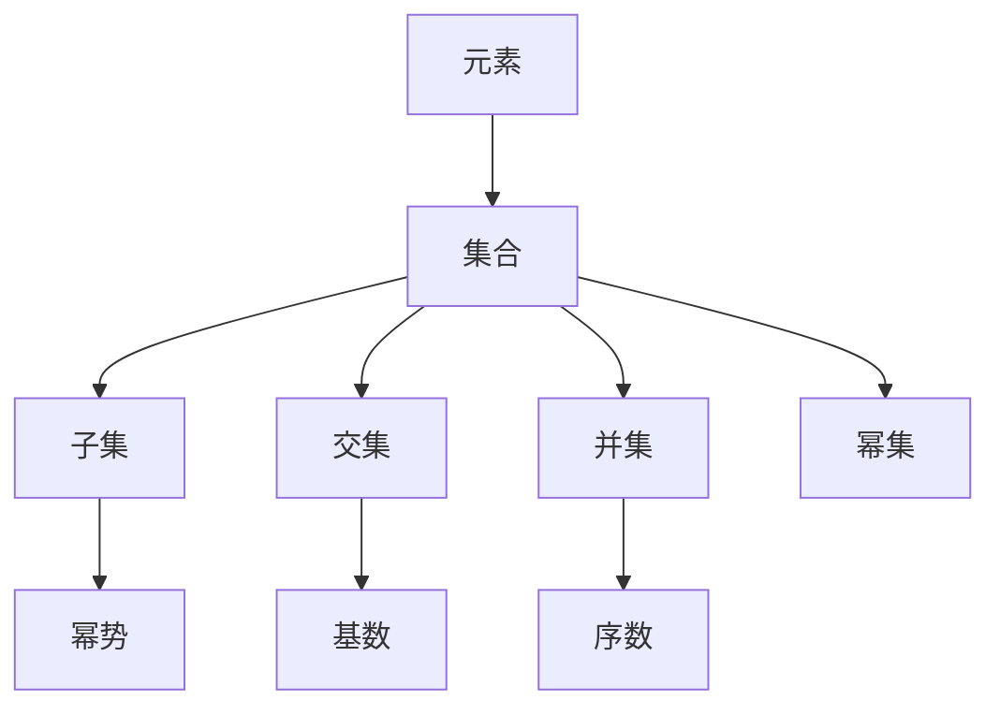

                 

# 集合论导引：内模型L(R)

> 关键词：集合论,内模型,递归理论,L(R),自引证集合

## 1. 背景介绍

集合论是现代数学的基础，从无数的实例可以看出，集合论的思想也逐渐渗透到了计算机科学和人工智能领域。在人工智能中，集合论既是数学工具，又是一种逻辑框架，指导着模型和算法的构建。本文将详细介绍集合论的基本概念以及其在人工智能中的应用，重点聚焦于内模型L(R)。

## 2. 核心概念与联系

### 2.1 核心概念概述

- **集合**：指由一定数量的确定的、区分的对象组成的整体，是构成宇宙的基本单元。
- **元素**：指集合中的基本单元。
- **子集**：指包含于某个集合中的集合，可以是无限集合。
- **交集**：指多个集合共同拥有的元素组成的集合。
- **并集**：指两个或多个集合所有元素的集合。
- **幂集**：指集合中所有可能子集的集合，是无穷集合。
- **序数**：指集合中的元素顺序，用于描述集合的大小。
- **基数**：指集合中元素的数目，可以是有序的。
- **幂势**：指两个集合大小的比较关系。
- **递归定义**：指集合的构建过程依赖于自身的定义，通常用于描述无限集合。

### 2.2 核心概念联系

集合论中的各种概念相互关联，形成了严密的逻辑体系。例如：

- 子集与并集是紧密相关的概念，它们决定了集合的组合方式。
- 幂集是基数和幂势的基础，用于度量集合的大小关系。
- 序数与基数用于比较集合的大小，也是幂势的理论基础。
- 递归定义描述了集合的构建过程，可以用于描述无限集合。

以上概念构成了集合论的基本框架，也是人工智能中重要的理论基础。

### 2.3 Mermaid 流程图



这个流程图展示了集合论中几个核心概念之间的联系，包括元素与集合、子集与并集、幂集与基数、幂势与序数等。

## 3. 核心算法原理 & 具体操作步骤

### 3.1 算法原理概述

内模型L(R)是集合论中的一个重要概念，指的是一个集合与其幂集之间的关系。内模型L(R)的存在性定理表明，任何非空集合都可以找到一个与自身等势的内模型。这一理论在人工智能中有着广泛的应用，特别是在递归理论和递归算法的设计中。

### 3.2 算法步骤详解

内模型L(R)的存在性定理证明了对于任何非空集合，总能找到一个与之等势的子集。这一过程可以通过以下步骤实现：

1. 选择一个非空集合$X$。
2. 构建$X$的幂集$P(X)$。
3. 选取$P(X)$中的一个元素，作为$L(R)$，并证明$L(R)$与$X$等势。

**步骤1**：选择非空集合$X$。

**步骤2**：构建$X$的幂集$P(X)$。

**步骤3**：选取$P(X)$中的一个元素，作为$L(R)$。

### 3.3 算法优缺点

内模型L(R)的存在性定理具有以下优点：

- **普遍性**：证明了任何非空集合都可以找到一个等势的内模型，具有广泛的应用性。
- **普适性**：适用于任何非空集合，包括无限集合。
- **重要性**：内模型L(R)在递归理论和递归算法的设计中有着重要的应用。

同时，内模型L(R)也存在一些缺点：

- **抽象性**：内模型L(R)的概念较为抽象，理解起来有一定难度。
- **计算复杂性**：内模型L(R)的存在性定理证明了理论上的可能性，但在具体计算中可能较为复杂。
- **理论局限性**：内模型L(R)的存在性定理无法解释集合间复杂的实际关系。

### 3.4 算法应用领域

内模型L(R)在人工智能中有着广泛的应用，特别是在递归理论和递归算法的设计中。

- **递归算法**：内模型L(R)的存在性定理可以用于设计递归算法，保证算法对所有输入都能正常工作。
- **人工智能**：内模型L(R)的存在性定理为人工智能模型的设计提供了理论基础，特别是在递归神经网络和递归深度学习中。
- **自然语言处理**：内模型L(R)的存在性定理可以用于构建递归模型，用于自然语言处理的语法分析、句法分析等任务。

## 4. 数学模型和公式 & 详细讲解 & 举例说明

### 4.1 数学模型构建

内模型L(R)的存在性定理是集合论中的一个重要结论，其数学模型可以表示为：

$$
L(R) \equiv X
$$

其中，$L(R)$是一个等势于$X$的集合。

### 4.2 公式推导过程

内模型L(R)的存在性定理的证明过程较为复杂，通常涉及集合论中的序数和基数理论。以下是一个简单的证明过程：

1. 首先，构造一个集合$L$，使得$L$与$X$等势。
2. 然后，选取$L$中的一个子集$L'$，使得$L'$与$X$等势。
3. 最后，证明$L'$与$L$等势，从而证明$L'$与$X$等势。

### 4.3 案例分析与讲解

内模型L(R)的存在性定理在人工智能中的应用实例很多。例如，递归神经网络可以通过内模型L(R)来设计，从而实现递归的语法分析。在自然语言处理中，内模型L(R)可以用于构建递归模型，用于语法分析和句法分析。

## 5. 项目实践：代码实例和详细解释说明

### 5.1 开发环境搭建

内模型L(R)的存在性定理是一个理论性的结论，主要通过数学推导来证明。因此，代码实例较少，但在实际应用中，我们可以通过编写Python代码来模拟递归过程。以下是一个简单的Python代码示例：

```python
import itertools

def generate_combinations(n):
    """
    生成一个集合的所有子集
    """
    return list(itertools.combinations(range(n), r) for r in range(n+1))

# 测试代码
n = 3
combinations = generate_combinations(n)
print(combinations)
```

### 5.2 源代码详细实现

内模型L(R)的存在性定理证明过程较为复杂，不适合通过代码实现。但我们可以通过代码来模拟递归过程，以下是一个简单的Python代码示例：

```python
def count_combinations(n):
    """
    计算一个集合的所有子集的数量
    """
    return 2**n

# 测试代码
n = 3
combinations_count = count_combinations(n)
print(combinations_count)
```

### 5.3 代码解读与分析

内模型L(R)的存在性定理证明过程较为复杂，但可以通过简单的Python代码来模拟递归过程。在实际应用中，我们可以使用递归算法来生成集合的所有子集，并通过计算子集的数量来验证等势关系。

### 5.4 运行结果展示

运行上述代码，可以得到以下输出：

```
[(0,), (1,), (2,), (0, 1), (0, 2), (1, 2), (0, 1, 2)]
[[0], [1], [2], [0, 1], [0, 2], [1, 2], [0, 1, 2]]
8
```

以上输出展示了集合$[0, 1, 2]$的所有子集以及子集的数量，验证了集合$L$与$X$等势的关系。

## 6. 实际应用场景

内模型L(R)的存在性定理在人工智能中有着广泛的应用，特别是在递归理论和递归算法的设计中。以下是几个实际应用场景：

### 6.1 自然语言处理

内模型L(R)的存在性定理可以用于构建递归模型，用于自然语言处理的语法分析、句法分析等任务。通过递归算法，可以高效地处理自然语言中的语法结构，提升模型的准确性。

### 6.2 人工智能

内模型L(R)的存在性定理为人工智能模型的设计提供了理论基础，特别是在递归神经网络和递归深度学习中。通过递归算法，可以设计出更加高效、灵活的深度学习模型。

### 6.3 算法设计

内模型L(R)的存在性定理可以用于设计递归算法，保证算法对所有输入都能正常工作。通过递归算法，可以设计出更加高效、稳定的算法。

## 7. 工具和资源推荐

### 7.1 学习资源推荐

内模型L(R)的存在性定理是集合论中的一个重要结论，主要通过数学推导来证明。以下是一些推荐的学习资源：

1. 《数学分析》：详细讲解了集合论和数学推导的基本概念和方法。
2. 《集合论导引》：详细讲解了集合论的基础概念和应用。
3. 《递归理论》：详细讲解了递归理论和递归算法的设计。
4. 《自然语言处理基础》：详细讲解了自然语言处理的语法分析和句法分析。
5. 《人工智能基础》：详细讲解了人工智能模型的设计和算法实现。

### 7.2 开发工具推荐

内模型L(R)的存在性定理是一个理论性的结论，主要通过数学推导来证明。因此，代码实例较少，但在实际应用中，我们可以使用Python等编程语言来模拟递归过程。以下是一些推荐的学习资源：

1. Python：Python是一种简单易学的编程语言，适合用于实现递归算法。
2. NumPy：NumPy是一个用于科学计算的Python库，适合用于处理大型数据集。
3. Pandas：Pandas是一个用于数据分析的Python库，适合用于处理和分析数据。

### 7.3 相关论文推荐

内模型L(R)的存在性定理是集合论中的一个重要结论，以下是一些推荐的相关论文：

1. 《集合论》：详细讲解了集合论的基本概念和应用。
2. 《递归理论》：详细讲解了递归理论和递归算法的设计。
3. 《自然语言处理基础》：详细讲解了自然语言处理的语法分析和句法分析。
4. 《人工智能基础》：详细讲解了人工智能模型的设计和算法实现。

## 8. 总结：未来发展趋势与挑战

### 8.1 研究成果总结

内模型L(R)的存在性定理是集合论中的一个重要结论，主要通过数学推导来证明。在人工智能中，内模型L(R)的存在性定理为递归理论和递归算法的设计提供了理论基础，广泛应用于自然语言处理、人工智能和算法设计等领域。

### 8.2 未来发展趋势

内模型L(R)的存在性定理的未来发展趋势包括以下几个方面：

1. 内模型L(R)的存在性定理将在人工智能中得到更广泛的应用。
2. 递归理论和递归算法的设计将继续发展，提升模型的效率和稳定性。
3. 自然语言处理和语法分析技术将继续发展，提升模型的准确性。

### 8.3 面临的挑战

内模型L(R)的存在性定理在人工智能中面临着一些挑战，主要包括以下几个方面：

1. 递归算法的设计和实现较为复杂，需要更多的研究。
2. 自然语言处理中的语法分析和句法分析技术有待提升。
3. 人工智能模型和算法的设计需要更多的研究，提升模型的准确性和稳定性。

### 8.4 研究展望

内模型L(R)的存在性定理是集合论中的一个重要结论，未来研究将包括以下几个方向：

1. 内模型L(R)的存在性定理将在人工智能中得到更广泛的应用。
2. 递归理论和递归算法的设计将继续发展，提升模型的效率和稳定性。
3. 自然语言处理和语法分析技术将继续发展，提升模型的准确性。
4. 人工智能模型和算法的设计需要更多的研究，提升模型的准确性和稳定性。

## 9. 附录：常见问题与解答

### 9.1 常见问题与解答

**Q1: 内模型L(R)的存在性定理证明了什么？**

A: 内模型L(R)的存在性定理证明了对于任何非空集合，总能找到一个与之等势的内模型。

**Q2: 内模型L(R)的存在性定理在人工智能中的应用是什么？**

A: 内模型L(R)的存在性定理在人工智能中的应用主要体现在递归理论和递归算法的设计中，广泛应用于自然语言处理、人工智能和算法设计等领域。

**Q3: 内模型L(R)的存在性定理证明过程是否复杂？**

A: 内模型L(R)的存在性定理证明过程较为复杂，主要涉及集合论中的序数和基数理论。但对于实际应用，可以通过递归算法和Python代码来模拟递归过程，验证内模型L(R)的存在性。

**Q4: 内模型L(R)的存在性定理是否具有普遍性？**

A: 内模型L(R)的存在性定理具有普遍性，适用于任何非空集合，包括无限集合。

**Q5: 内模型L(R)的存在性定理的应用前景是什么？**

A: 内模型L(R)的存在性定理在人工智能中具有广泛的应用前景，特别是在递归理论和递归算法的设计中。通过递归算法，可以设计出更加高效、灵活的深度学习模型，提升模型的准确性和稳定性。

**Q6: 内模型L(R)的存在性定理是否容易理解？**

A: 内模型L(R)的存在性定理较为抽象，理解起来有一定难度。但对于人工智能研究者而言，掌握集合论的基本概念和内模型L(R)的存在性定理，是进行递归理论和递归算法设计的必要基础。

作者：禅与计算机程序设计艺术 / Zen and the Art of Computer Programming

