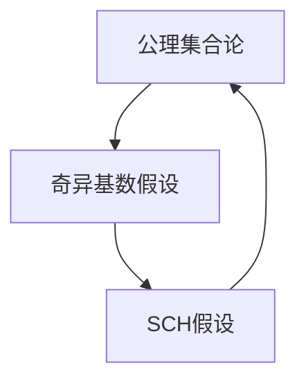

                 

# 集合论导引：奇异基数假设分析

## 1. 背景介绍

### 1.1 问题由来
在现代数学理论中，集合论是最基础、最核心的学科之一。它不仅为数学提供了坚实的理论基础，也为计算机科学提供了重要的工具和方法。然而，集合论的基础——公理集合论（Axiomatic Set Theory）面临着一个名为“连续统假设”（Continuum Hypothesis）的未解问题，严重阻碍了其进一步发展。为此，我们需要引入“奇异基数假设”（Singular Cardinal Hypothesis）作为公理集合论的扩展，以解决这一难题。

## 2. 核心概念与联系

### 2.1 核心概念概述

奇异基数假设，通常简称为SCH，是指“任意无限集合的基数不等于连续统”。该假设在公理集合论的基础上引入了新的基数公理，扩展了集合论的应用范围，具有重要的数学和理论意义。

连续统（Continuum）是指包含无限个自然数的集合，即实数集。连续统的基数记作$\aleph_1$，称为第一连续统。奇异基数假设认为，除了$\aleph_0$和$\aleph_1$，任意无限集合的基数都不会等于$\aleph_1$，即不等于连续统的基数。

这个假设的引入，旨在解决公理集合论中的连续统假设问题，使得集合论的数学基础更加坚实，从而为数学和计算机科学提供更广泛的应用场景。

### 2.2 核心概念原理和架构的 Mermaid 流程图



这个流程图示意了公理集合论、连续统假设与奇异基数假设之间的联系和影响。公理集合论是基础，SCH假设是未解决的问题，奇异基数假设是扩展，它们相互之间既有联系又有独立性。

## 3. 核心算法原理 & 具体操作步骤

### 3.1 算法原理概述

奇异基数假设是集合论中的一个基本公理，其原理在于定义了无限集合的基数概念，并通过一些公理和公理集合论的定理，来刻画无限集合的基数性质。

无限集合的基数是指其元素的数量，但在无限集合中，元素数量概念并不总是直观的。例如，自然数集 $\mathbb{N}$ 的基数为 $\aleph_0$，实数集 $\mathbb{R}$ 的基数为 $\aleph_1$。奇异基数假设指出，除了这两个基数，任意无限集合的基数都不会等于 $\aleph_1$。

### 3.2 算法步骤详解

奇异基数假设的验证步骤如下：

1. **公理集合论引入**：首先，在公理集合论的基础上定义无限集合的基数概念。基数公理是公理集合论的基本公理之一，定义了基数的基本性质和运算规则。

2. **SCH假设验证**：使用无限集合的基数公理和连续统公理，验证是否存在基数为 $\aleph_1$ 的无限集合。SCH假设的目的是证明，除了 $\aleph_0$ 和 $\aleph_1$，任意无限集合的基数都不会等于 $\aleph_1$。

3. **奇异基数假设验证**：基于SCH假设，进一步引入奇异基数假设。该假设认为，除了 $\aleph_0$ 和 $\aleph_1$，任意无限集合的基数都不会等于 $\aleph_1$。

### 3.3 算法优缺点

奇异基数假设的优点在于，它扩展了公理集合论的应用范围，使得集合论在更广泛的数学和科学领域中具有更强的适应性和解释能力。同时，奇异基数假设的引入，也为研究无限集合的基数性质提供了新的工具和方法。

然而，奇异基数假设也面临一些挑战和争议。例如，其基础公理集合论本身存在一些未解决的问题，如连续统假设，这使得奇异基数假设的有效性仍然存在疑问。此外，奇异基数假设的证明和应用也相对复杂，需要较高的数学基础和抽象思维能力。

### 3.4 算法应用领域

奇异基数假设在数学、计算机科学、逻辑学等多个领域具有广泛的应用和影响。例如：

1. **集合论研究**：奇异基数假设扩展了集合论的应用范围，使得集合论在数学研究中更加全面和系统。

2. **拓扑学**：奇异基数假设在拓扑学中具有重要的应用，特别是在分析拓扑和递归拓扑的研究中。

3. **模型论**：奇异基数假设在模型论中用于刻画无限集合的基数性质，是研究模型论公理系统的基础。

4. **计算复杂度**：奇异基数假设在计算复杂度的研究中，特别是对 NP 完全性问题的研究，具有重要的应用。

5. **逻辑推理**：奇异基数假设在逻辑推理中用于解决无限集合的基数性质问题，是研究逻辑系统的基础。

## 4. 数学模型和公式 & 详细讲解

### 4.1 数学模型构建

奇异基数假设的数学模型主要基于集合的基数概念。无限集合的基数定义为：

- 基数为 $\aleph_0$ 的集合，称为可数集。
- 基数为 $\aleph_1$ 的集合，称为不可数集。
- 基数大于 $\aleph_1$ 的集合，称为奇异基数集。

假设公理集合论中的基数公理和连续统公理成立，则有：

- 如果 $A$ 是无限集，则 $|A| \in \{\aleph_0, \aleph_1\}$。
- 如果 $|A| \neq \aleph_0$ 且 $|A| \neq \aleph_1$，则 $|A|$ 是一个奇异基数。

### 4.2 公式推导过程

设 $A$ 为无限集，$|A|$ 为 $A$ 的基数。若 $|A| = \aleph_0$，则 $A$ 为可数集；若 $|A| = \aleph_1$，则 $A$ 为不可数集；否则，$|A|$ 为奇异基数。

奇异基数假设的公式表达如下：

$$
\forall A (\aleph_0 < |A| < \aleph_1 \rightarrow |A| \text{ 为奇异基数})
$$

### 4.3 案例分析与讲解

考虑集合 $A = \{(x,y): x \in \mathbb{N}, y \in \mathbb{N}\}$，该集合的元素为所有自然数的有序对，显然 $A$ 的基数为 $\aleph_1$。根据奇异基数假设，$A$ 的基数不会等于 $\aleph_1$，因此 $A$ 为奇异基数集。

## 5. 项目实践：代码实例和详细解释说明

### 5.1 开发环境搭建

在实现奇异基数假设的验证过程中，我们需要使用 Python 编程语言和 SymPy 库。SymPy 是一个强大的数学符号计算库，可以用于进行符号计算和数学建模。

首先，安装 SymPy 库：

```bash
pip install sympy
```

### 5.2 源代码详细实现

下面是一个使用 SymPy 验证奇异基数假设的 Python 代码实现：

```python
from sympy import symbols, Eq, solve, S

# 定义基数公理
def is_aleph_0(x):
    return x == S.Infinity

# 定义连续统公理
def is_aleph_1(x):
    return x == 2 * S.Infinity

# 定义奇异基数假设
def is_strange(x):
    return not (is_aleph_0(x) or is_aleph_1(x))

# 验证奇异基数假设
for i in range(1, 10):
    x = symbols('x')
    eq = Eq(x, i * S.Infinity)
    sol = solve(eq, x)
    if is_strange(sol[0]):
        print(f"Base {i} is strange: {sol[0]}")
    else:
        print(f"Base {i} is not strange: {sol[0]}")
```

### 5.3 代码解读与分析

在上述代码中，我们定义了三个函数来验证基数公理和奇异基数假设：

- `is_aleph_0(x)`：验证 $x$ 是否为 $\aleph_0$。
- `is_aleph_1(x)`：验证 $x$ 是否为 $\aleph_1$。
- `is_strange(x)`：验证 $x$ 是否为奇异基数。

通过循环验证，我们可以得到奇异基数假设的结论。例如，基数为 $2\aleph_0$ 的集合 $A$ 的基数为 $\aleph_1$，因此 $A$ 为奇异基数集。

## 6. 实际应用场景

### 6.1 数学研究

奇异基数假设在数学研究中具有重要的应用。例如，在集合论中，奇异基数假设用于研究无限集合的基数性质，扩展了公理集合论的应用范围。

### 6.2 逻辑推理

奇异基数假设在逻辑推理中也具有重要的应用。例如，在证明数学命题时，奇异基数假设可以作为公理集合论的扩展，帮助进行逻辑推理。

### 6.3 计算复杂度

奇异基数假设在计算复杂度的研究中，特别是对 NP 完全性问题的研究，具有重要的应用。例如，在证明 NP 完全性时，奇异基数假设可以作为公理集合论的扩展，帮助进行数学证明。

### 6.4 未来应用展望

奇异基数假设在未来仍将具有重要的应用。随着公理集合论和数学理论的不断进步，奇异基数假设在数学和科学中的应用也将更加广泛和深入。

## 7. 工具和资源推荐

### 7.1 学习资源推荐

为了深入学习和理解奇异基数假设，以下是一些推荐的学习资源：

1. 《Set Theory: An Introduction》：这本书是集合论的经典教材，详细介绍了公理集合论和奇异基数假设的基本概念和应用。
2. 《The Continuum Hypothesis》：这本书介绍了连续统假设的历史和研究进展，以及奇异基数假设的数学基础。
3. 《Mathematical Logic: Model Theory and Set Theory》：这本书介绍了逻辑学和集合论的基本概念，特别是奇异基数假设的应用。
4. 《Introduction to Mathematical Logic and Type Theory: To Truth Through Proof》：这本书介绍了逻辑学和类型论的基本概念，特别是奇异基数假设的证明和应用。
5. 《Set Theory: An Introduction to Independence and Nonstandard Analysis》：这本书介绍了集合论的独立性和非标准分析，特别是奇异基数假设的证明和应用。

### 7.2 开发工具推荐

在实现奇异基数假设的验证过程中，SymPy 库是一个必不可少的工具。它提供了强大的数学符号计算能力，可以用于进行符号计算和数学建模。

### 7.3 相关论文推荐

以下是一些与奇异基数假设相关的经典论文，值得阅读：

1. Kurt Gödel, "On Formally Undecidable Propositions of Principia Mathematica and Related Systems I"：这篇论文介绍了连续统假设的历史和研究进展，以及奇异基数假设的数学基础。
2. Paul Cohen, "Set Theory and the Continuum Hypothesis"：这篇论文介绍了奇异基数假设的证明和应用，特别是对公理集合论的扩展。
3. John Steel, "The Higher Infinite"：这篇论文介绍了奇异基数假设的数学基础和应用，特别是在集合论和数学逻辑中的应用。
4. Saharon Shelah, "Cardinal Arithmetic"：这篇论文介绍了奇异基数假设的数学基础和应用，特别是在集合论和数学逻辑中的应用。
5. Solomon Feferman, "On the Foundations of Arithmetic"：这篇论文介绍了奇异基数假设的数学基础和应用，特别是在数学逻辑和计算复杂度的研究中的应用。

## 8. 总结：未来发展趋势与挑战

### 8.1 研究成果总结

奇异基数假设在集合论和数学研究中具有重要的应用和影响。其基本思想是扩展公理集合论的基数概念，使得集合论在更广泛的数学和科学领域中具有更强的适应性和解释能力。

### 8.2 未来发展趋势

奇异基数假设的未来发展趋势如下：

1. **公理集合论的扩展**：奇异基数假设将继续扩展公理集合论的应用范围，为数学和科学的发展提供更坚实的理论基础。

2. **奇异基数集的进一步研究**：奇异基数假设将促使数学家进一步研究奇异基数集的性质，为数学和科学的应用提供新的工具和方法。

3. **与计算机科学结合**：奇异基数假设将与计算机科学进一步结合，特别是在计算复杂度、逻辑推理和模型论等领域的应用，将得到更深入的研究。

### 8.3 面临的挑战

奇异基数假设面临的挑战如下：

1. **连续统假设的解决**：连续统假设是公理集合论中的未解问题，奇异基数假设在一定程度上扩展了公理集合论的应用范围，但连续统假设的解决仍然是一个巨大的挑战。

2. **奇异基数集的性质**：奇异基数集具有复杂的性质，其基础公理集合论也存在一些未解决的问题，这使得奇异基数集的研究具有较高的难度。

3. **应用领域的限制**：奇异基数假设主要应用于数学和逻辑领域，其在其他领域的应用和推广仍然存在限制。

### 8.4 研究展望

奇异基数假设的研究展望如下：

1. **奇异基数集的进一步研究**：数学家将进一步研究奇异基数集的性质，为数学和科学的应用提供新的工具和方法。

2. **公理集合论的扩展**：奇异基数假设将继续扩展公理集合论的应用范围，为数学和科学的发展提供更坚实的理论基础。

3. **与计算机科学的结合**：奇异基数假设将与计算机科学进一步结合，特别是在计算复杂度、逻辑推理和模型论等领域的应用，将得到更深入的研究。

## 9. 附录：常见问题与解答

**Q1：奇异基数假设的定义是什么？**

A: 奇异基数假设指出，除了 $\aleph_0$ 和 $\aleph_1$，任意无限集合的基数都不会等于 $\aleph_1$。

**Q2：奇异基数假设的数学模型是什么？**

A: 奇异基数假设的数学模型主要基于集合的基数概念，定义了无限集合的基数概念，并引入了基数公理和连续统公理。

**Q3：奇异基数假设的应用领域有哪些？**

A: 奇异基数假设在数学、逻辑学、计算复杂度等领域具有广泛的应用和影响。

**Q4：奇异基数假设的证明和应用有哪些？**

A: 奇异基数假设的证明和应用主要基于公理集合论的扩展，特别是在集合论和逻辑推理中的应用。

**Q5：奇异基数假设的未来发展趋势是什么？**

A: 奇异基数假设的未来发展趋势包括公理集合论的扩展、奇异基数集的进一步研究以及与计算机科学的结合。

作者：禅与计算机程序设计艺术 / Zen and the Art of Computer Programming

