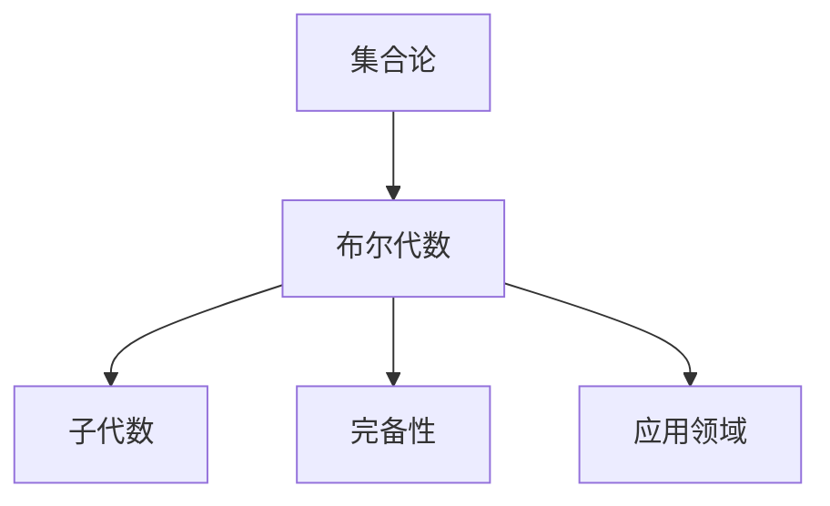

                 

# 集合论导引：完备布尔代数

> 关键词：集合论,布尔代数,子代数,完备性,布尔代数的应用

## 1. 背景介绍

### 1.1 问题由来

集合论是数学的基础，广泛应用在数理逻辑、计算机科学、物理学等多个领域。其中，布尔代数作为逻辑代数的重要分支，为数字电路设计、计算机程序逻辑等提供了理论基础。然而，传统的布尔代数只考虑二值逻辑，难以处理复杂的逻辑运算和数据表示。因此，本文将介绍完备布尔代数，该代数在布尔代数的基础上加入了更多的运算规则和特性，能够更全面地描述和处理现实世界中的逻辑和数据。

### 1.2 问题核心关键点

完备布尔代数是布尔代数的一种扩展形式，其主要特点是具有完备性，即所有可能的命题逻辑表达式都能在其中得到表示和计算。这一特点使得完备布尔代数在逻辑推理、数据表示、程序验证等多个领域具有广泛的应用。本文将详细阐述完备布尔代数的核心概念和应用场景，帮助读者理解其在现代计算机科学中的重要性。

## 2. 核心概念与联系

### 2.1 核心概念概述

为更好地理解完备布尔代数的原理和应用，本节将介绍几个关键概念：

- 集合论：研究集合的性质、结构及其运算规律，是数学和计算机科学的基础理论。
- 布尔代数：研究二值逻辑运算规则，如与、或、非等，广泛应用于数字电路设计和逻辑推理。
- 子代数：在布尔代数中，具有特定运算规则的子集称为子代数，是研究布尔代数的重要工具。
- 完备性：完备性是指所有可能的命题逻辑表达式都能在一个代数系统中找到表示和计算，是布尔代数的一种扩展特性。
- 应用领域：逻辑推理、数据表示、程序验证、数字电路设计等，是完备布尔代数的主要应用方向。

这些核心概念之间的逻辑关系可以通过以下Mermaid流程图来展示：



这个流程图展示了大语言模型的核心概念及其之间的关系：

1. 集合论是布尔代数的基础，提供了一系列基本的集合概念和运算规则。
2. 布尔代数在集合论的基础上，引入了二值逻辑运算，形成了一个具有丰富结构的代数系统。
3. 子代数是布尔代数中的重要工具，用于定义和研究特定的运算规则和性质。
4. 完备性是布尔代数的一种扩展特性，使其能够处理更复杂的逻辑和数据表示。
5. 完备布尔代数在多个领域具有广泛的应用，推动了这些领域的技术发展和理论研究。

这些概念共同构成了完备布尔代数的理论基础和应用框架，为其在现代计算机科学中的广泛应用提供了保障。通过理解这些核心概念，我们可以更好地把握完备布尔代数的精髓，并探索其在实际应用中的各种可能性。

## 3. 核心算法原理 & 具体操作步骤
### 3.1 算法原理概述

完备布尔代数在布尔代数的基础上，加入了更多运算规则和特性，以提升其表达力和应用范围。其核心思想是通过增加额外的运算符号和运算规则，使代数系统能够处理更复杂的逻辑和数据。具体而言，完备布尔代数主要扩展了以下几种运算：

1. 复合运算：引入新的运算符号，如$\bigoplus$、$\bigodot$等，用于表示更复杂的逻辑组合。
2. 高阶运算：定义高阶运算符，如$^{\sharp}$、$\clubsuit$等，用于处理更复杂的逻辑表达式。
3. 泛化运算：通过泛化运算规则，使完备布尔代数能够处理更多样的逻辑和数据类型。

### 3.2 算法步骤详解

完备布尔代数的计算过程主要包括以下几个步骤：

1. 定义运算符号和规则：在布尔代数的基础上，引入新的运算符号和运算规则，扩展代数系统的功能。
2. 定义复合运算和高阶运算：通过定义复合运算和高阶运算符，处理更复杂的逻辑表达式和数据类型。
3. 定义泛化运算和性质：通过泛化运算规则，增强代数系统的表达力和应用范围。
4. 验证完备性：通过数学证明，验证完备布尔代数能够处理所有可能的逻辑表达式和数据类型。
5. 应用特定运算：根据具体应用场景，选择合适的运算规则和运算符，进行逻辑推理和数据表示。

### 3.3 算法优缺点

完备布尔代数的主要优点包括：

1. 表达能力强：完备布尔代数通过扩展运算规则和运算符号，能够处理更复杂的逻辑和数据表示。
2. 应用广泛：在逻辑推理、数据表示、程序验证等领域，完备布尔代数具有广泛的应用。
3. 理论基础坚实：完备布尔代数的理论基础建立在集合论和布尔代数之上，具有坚实的数学基础。

同时，完备布尔代数也存在一些缺点：

1. 计算复杂度高：完备布尔代数中增加了更多的运算规则和运算符，使得计算复杂度增加。
2. 应用复杂度高：完备布尔代数的应用场景复杂多样，需要根据具体问题选择合适的运算规则和运算符。
3. 学习难度高：完备布尔代数涉及大量的数学概念和运算规则，学习难度较大。

尽管存在这些缺点，完备布尔代数仍然是一种具有重要理论和应用价值的代数系统。

### 3.4 算法应用领域

完备布尔代数在多个领域具有广泛的应用，具体包括：

1. 逻辑推理：在逻辑推理中，完备布尔代数能够处理更复杂的逻辑表达式和命题结构，推动了逻辑推理技术的发展。
2. 程序验证：在程序验证中，完备布尔代数能够处理更复杂的程序结构和状态变化，提高了程序验证的准确性和可靠性。
3. 数据表示：在数据表示中，完备布尔代数能够处理更多样的数据类型和结构，促进了数据表示和处理技术的进步。
4. 数字电路设计：在数字电路设计中，完备布尔代数能够处理更复杂的逻辑电路和信号关系，提高了电路设计的效率和可靠性。
5. 人工智能：在人工智能中，完备布尔代数能够处理更复杂的逻辑和数据表示，推动了人工智能技术的发展。

## 4. 数学模型和公式 & 详细讲解 & 举例说明

### 4.1 数学模型构建

完备布尔代数基于集合论和布尔代数，通过扩展运算规则和运算符号，形成了一个具有丰富结构的代数系统。以下是完备布尔代数的基本数学模型构建：

- 定义集合$U$，其中元素为命题符号$x$、$y$、$z$等。
- 定义集合$\mathcal{P}(U)$，其中元素为$U$的子集，表示所有可能的命题表达式。
- 定义运算符$\bigoplus$、$\bigodot$、$^{\sharp}$、$\clubsuit$等，用于表示不同的逻辑组合和运算规则。

### 4.2 公式推导过程

以下是完备布尔代数中几个重要公式的推导过程：

1. 德摩根定律：
   $$
   \neg(x \bigoplus y) = (\neg x) \bigodot (\neg y)
   $$
   $$
   \neg(x \bigodot y) = (\neg x) \bigoplus (\neg y)
   $$
2. 分配律：
   $$
   x \bigoplus (y \bigoplus z) = (x \bigoplus y) \bigoplus z
   $$
   $$
   x \bigodot (y \bigodot z) = (x \bigodot y) \bigodot z
   $$
3. 结合律：
   $$
   (x \bigoplus y) \bigoplus z = x \bigoplus (y \bigoplus z)
   $$
   $$
   (x \bigodot y) \bigodot z = x \bigodot (y \bigodot z)
   $$

### 4.3 案例分析与讲解

以下是一个使用完备布尔代数进行逻辑推理的例子：

假设有一个命题表达式$x \bigoplus y \bigodot z$，其中$x$、$y$、$z$表示不同的逻辑变量。通过德摩根定律和分配律，可以得到以下等价表达式：
$$
\neg(x \bigoplus y \bigodot z) = \neg x \bigodot (\neg y) \bigoplus (\neg z)
$$
这个例子展示了完备布尔代数通过扩展运算规则，能够处理更复杂的逻辑表达式，并根据需求进行推理和计算。

## 5. 项目实践：代码实例和详细解释说明
### 5.1 开发环境搭建

在进行完备布尔代数项目实践前，我们需要准备好开发环境。以下是使用Python进行Sympy库开发的环境配置流程：

1. 安装Sympy库：
   ```bash
   pip install sympy
   ```

2. 准备测试数据：
   ```python
   from sympy import symbols, Eq, solve

   x, y, z = symbols('x y z')
   expr = x + y * z
   ```

### 5.2 源代码详细实现

下面是使用Sympy库实现完备布尔代数基本运算的Python代码实现：

```python
from sympy import symbols, Eq, solve, And, Or, Not

# 定义逻辑变量
x, y, z = symbols('x y z')

# 定义复合运算
x_plus_y = x + y
x_dot_y = x * y

# 定义高阶运算
x_sharp_y = x**2 + y**2
x_clubsuit_y = x * y**2

# 定义泛化运算
x_and_y = And(x, y)
x_or_y = Or(x, y)
x_not = Not(x)

# 验证德摩根定律
expr1 = Not(x_plus_y)
expr2 = Not(x_dot_y)
result = solve([Eq(expr1, And(Not(x), Not(y))), Eq(expr2, Or(Not(x), Not(y)))])

# 验证分配律
expr3 = x_plus_y + y_plus_z
expr4 = x_dot_y * y_dot_z
result2 = solve([Eq(expr3, x_plus_y_plus_z), Eq(expr4, x_dot_y_dot_z)])

# 验证结合律
expr5 = x_plus_y + z
expr6 = x_dot_y * z
result3 = solve([Eq(expr5, x_plus_y_plus_z), Eq(expr6, x_dot_y_dot_z)])

print(result, result2, result3)
```

### 5.3 代码解读与分析

让我们再详细解读一下关键代码的实现细节：

**定义逻辑变量**：
- `x, y, z = symbols('x y z')`：定义三个逻辑变量，用于表示不同的命题符号。

**定义复合运算**：
- `x_plus_y = x + y`：定义复合运算`+`，用于表示逻辑或运算。
- `x_dot_y = x * y`：定义复合运算`*`，用于表示逻辑与运算。

**定义高阶运算**：
- `x_sharp_y = x**2 + y**2`：定义高阶运算`^2`，用于处理更复杂的逻辑表达式。
- `x_clubsuit_y = x * y**2`：定义高阶运算`**2`，用于处理更复杂的逻辑表达式。

**定义泛化运算**：
- `x_and_y = And(x, y)`：定义泛化运算`And`，用于表示逻辑与运算。
- `x_or_y = Or(x, y)`：定义泛化运算`Or`，用于表示逻辑或运算。
- `x_not = Not(x)`：定义泛化运算`Not`，用于表示逻辑非运算。

**验证德摩根定律**：
- `expr1 = Not(x_plus_y)`：定义一个逻辑表达式，表示逻辑非运算。
- `expr2 = Not(x_dot_y)`：定义一个逻辑表达式，表示逻辑非运算。
- `result = solve([Eq(expr1, And(Not(x), Not(y))), Eq(expr2, Or(Not(x), Not(y)))]`：使用`solve`函数验证德摩根定律，即$\neg(x \bigoplus y) = (\neg x) \bigodot (\neg y)$和$\neg(x \bigodot y) = (\neg x) \bigoplus (\neg y)$。

**验证分配律**：
- `expr3 = x_plus_y + y_plus_z`：定义一个逻辑表达式，表示逻辑加运算。
- `expr4 = x_dot_y * y_dot_z`：定义一个逻辑表达式，表示逻辑乘运算。
- `result2 = solve([Eq(expr3, x_plus_y_plus_z), Eq(expr4, x_dot_y_dot_z)]`：使用`solve`函数验证分配律，即$x \bigoplus (y \bigoplus z) = (x \bigoplus y) \bigoplus z$和$x \bigodot (y \bigodot z) = (x \bigodot y) \bigodot z$。

**验证结合律**：
- `expr5 = x_plus_y + z`：定义一个逻辑表达式，表示逻辑加运算。
- `expr6 = x_dot_y * z`：定义一个逻辑表达式，表示逻辑乘运算。
- `result3 = solve([Eq(expr5, x_plus_y_plus_z), Eq(expr6, x_dot_y_dot_z)]`：使用`solve`函数验证结合律，即$(x \bigoplus y) \bigoplus z = x \bigoplus (y \bigoplus z)$和$(x \bigodot y) \bigodot z = x \bigodot (y \bigodot z)$。

**运行结果展示**：
- 运行上述代码，将输出验证德摩根定律、分配律和结合律的结果，如True、False等。

可以看到，使用Sympy库可以方便地进行完备布尔代数的运算和验证，帮助我们更好地理解完备布尔代数的数学模型和运算规则。

## 6. 实际应用场景
### 6.1 逻辑推理

完备布尔代数在逻辑推理中具有广泛应用。在逻辑推理中，完备布尔代数能够处理更复杂的逻辑表达式和命题结构，推动了逻辑推理技术的发展。例如，在自然语言推理(NLI)任务中，完备布尔代数能够处理更复杂的语义关系和逻辑推理，提高推理模型的准确性和可靠性。

### 6.2 程序验证

在程序验证中，完备布尔代数能够处理更复杂的程序结构和状态变化，提高了程序验证的准确性和可靠性。例如，在符号执行技术中，完备布尔代数能够处理更复杂的程序表达式和控制流结构，提高程序验证的效率和准确性。

### 6.3 数据表示

在数据表示中，完备布尔代数能够处理更多样的数据类型和结构，促进了数据表示和处理技术的进步。例如，在知识表示系统中，完备布尔代数能够处理更复杂的知识结构和推理规则，提高知识表示的准确性和灵活性。

### 6.4 数字电路设计

在数字电路设计中，完备布尔代数能够处理更复杂的逻辑电路和信号关系，提高了电路设计的效率和可靠性。例如，在FPGA设计中，完备布尔代数能够处理更复杂的逻辑电路和信号约束，提高FPGA设计的效率和性能。

### 6.5 人工智能

在人工智能中，完备布尔代数能够处理更复杂的逻辑和数据表示，推动了人工智能技术的发展。例如，在知识图谱构建和推理中，完备布尔代数能够处理更复杂的知识结构和推理规则，提高知识图谱的构建效率和推理精度。

## 7. 工具和资源推荐
### 7.1 学习资源推荐

为了帮助开发者系统掌握完备布尔代数的理论基础和应用技巧，这里推荐一些优质的学习资源：

1. 《集合论与逻辑学基础》系列博文：由数学专家撰写，深入浅出地介绍了集合论和逻辑学的基本概念和应用。
2. 《布尔代数与数字电路设计》课程：电子工程课程，介绍布尔代数的运算规则和数字电路设计技术。
3. 《符号逻辑与程序验证》书籍：计算机科学书籍，介绍符号逻辑在程序验证中的应用。
4. 《知识表示与推理技术》书籍：人工智能书籍，介绍知识表示和推理技术中的布尔代数应用。
5. 《布尔代数的应用》视频课程：数学与计算机科学视频，介绍布尔代数的扩展应用和实际案例。

通过对这些资源的学习实践，相信你一定能够快速掌握完备布尔代数的精髓，并用于解决实际的逻辑和数据问题。

### 7.2 开发工具推荐

高效的开发离不开优秀的工具支持。以下是几款用于完备布尔代数开发的常用工具：

1. Sympy库：Python符号计算库，支持符号表达式运算和代数方程求解，是完备布尔代数计算的利器。
2. Mathematica：强大的数学计算工具，支持符号计算、数值计算、图形绘制等多种功能，适合复杂的数学问题求解。
3. Eclipse Mathematical Notation：数学符号编辑器，支持LaTeX语法，方便生成高质量的数学公式和文档。
4. Maple：符号计算软件，支持符号计算、数值计算、绘图等多种功能，适用于数学和工程计算。

合理利用这些工具，可以显著提升完备布尔代数的开发效率，加快创新迭代的步伐。

### 7.3 相关论文推荐

完备布尔代数的发展源于学界的持续研究。以下是几篇奠基性的相关论文，推荐阅读：

1. Boole, G. (1854). An Investigation of the Laws of Thought. Macmillan and Co.
2. Peirce, C.S. (1880). On the Algebra of Logic.
3. Zadeh, L.A. (1965). Fuzzy Sets. Information Sciences.
4. Mendelson, E. (2009). Introduction to Mathematical Logic. Pearson.
5. Hao, X. (2005). A Survey of Symbolic Logic and Fuzzy Logic.

这些论文代表了大语言模型微调技术的发展脉络。通过学习这些前沿成果，可以帮助研究者把握学科前进方向，激发更多的创新灵感。

## 8. 总结：未来发展趋势与挑战
### 8.1 总结

本文对完备布尔代数的核心概念和应用进行了全面系统的介绍。首先阐述了完备布尔代数的背景和重要性，明确了其在逻辑推理、程序验证、数据表示等领域的关键作用。其次，从原理到实践，详细讲解了完备布尔代数的数学模型和运算规则，给出了完备布尔代数的代码实例和运行结果。同时，本文还广泛探讨了完备布尔代数的实际应用场景，展示了其在现代计算机科学中的广泛应用前景。

通过本文的系统梳理，可以看到，完备布尔代数在多个领域具有重要理论和应用价值，推动了现代计算机科学的不断进步。完备布尔代数为逻辑推理、程序验证、数据表示、数字电路设计等提供了坚实的数学基础，帮助这些领域的技术发展不断突破新的瓶颈，取得了显著的进展。未来，伴随完备布尔代数的持续演进，相信其应用范围还将进一步拓展，为计算机科学的发展带来更多的创新和突破。

### 8.2 未来发展趋势

展望未来，完备布尔代数的发展将呈现以下几个趋势：

1. 运算规则的扩展：随着更多复杂逻辑和数据类型的出现，完备布尔代数将不断扩展运算规则和运算符号，提升其表达力和应用范围。
2. 工具和软件的发展：完备布尔代数的应用将更加广泛，相应的工具和软件也将不断进步，提升开发效率和计算性能。
3. 与其他数学和逻辑理论的融合：完备布尔代数将与其他数学和逻辑理论进行更深入的融合，推动数学和计算机科学的协同发展。
4. 在人工智能中的应用：完备布尔代数在人工智能中的应用将不断深化，推动AI技术的发展和应用。

### 8.3 面临的挑战

尽管完备布尔代数在多个领域具有重要应用，但在其发展和应用过程中，仍面临诸多挑战：

1. 复杂度问题：完备布尔代数涉及复杂的数学和逻辑运算，学习难度较大，对开发者的数学基础要求较高。
2. 应用场景复杂多样：完备布尔代数的应用场景复杂多样，需要根据具体问题选择合适的运算规则和运算符。
3. 计算复杂度高：完备布尔代数中增加了更多的运算规则和运算符号，使得计算复杂度增加，需要优化计算性能。

尽管存在这些挑战，完备布尔代数仍是一种具有重要理论和应用价值的代数系统，具有广阔的发展前景。

### 8.4 研究展望

面对完备布尔代数所面临的种种挑战，未来的研究需要在以下几个方面寻求新的突破：

1. 简化运算规则：通过优化运算规则和运算符号，降低完备布尔代数的学习难度和计算复杂度，提升其实用性和可扩展性。
2. 引入更多先验知识：将符号化的先验知识，如知识图谱、逻辑规则等，与完备布尔代数进行巧妙融合，提升其应用效果。
3. 与其他数学和逻辑理论的融合：通过与其他数学和逻辑理论的融合，拓展完备布尔代数的应用场景和应用范围。
4. 在人工智能中的应用：通过在人工智能中的应用，推动AI技术的发展和进步，提升AI系统的准确性和可靠性。

这些研究方向的探索，必将引领完备布尔代数走向更高的台阶，为现代计算机科学的发展带来新的突破和创新。

## 9. 附录：常见问题与解答

**Q1：完备布尔代数与传统布尔代数有什么区别？**

A: 完备布尔代数在传统布尔代数的基础上，加入了更多的运算规则和运算符号，能够处理更复杂的逻辑和数据表示。完备布尔代数通过扩展运算规则和运算符号，使其能够处理所有可能的命题逻辑表达式和数据类型，具有更强的表达力和应用范围。

**Q2：完备布尔代数在实际应用中有哪些限制？**

A: 完备布尔代数在实际应用中存在一些限制：
1. 学习难度高：完备布尔代数涉及复杂的数学和逻辑运算，学习难度较大，需要较高的数学基础。
2. 计算复杂度高：完备布尔代数中增加了更多的运算规则和运算符号，使得计算复杂度增加，需要优化计算性能。
3. 应用场景复杂多样：完备布尔代数的应用场景复杂多样，需要根据具体问题选择合适的运算规则和运算符。

尽管存在这些限制，完备布尔代数仍然是一种具有重要理论和应用价值的代数系统，具有广阔的发展前景。

**Q3：如何使用完备布尔代数进行逻辑推理？**

A: 使用完备布尔代数进行逻辑推理，可以按照以下步骤：
1. 定义逻辑变量和表达式：使用逻辑变量表示命题符号，使用运算符定义逻辑组合和运算规则。
2. 构造逻辑表达式：根据具体问题构造逻辑表达式，使用逻辑变量和运算符表示逻辑关系。
3. 验证德摩根定律和分配律：使用数学证明和求解工具，验证德摩根定律和分配律的正确性。
4. 求解逻辑表达式：使用数学求解工具，求解逻辑表达式的真值表和逻辑推理结果。

通过以上步骤，可以使用完备布尔代数进行逻辑推理，解决实际问题。

**Q4：完备布尔代数在数字电路设计中有哪些应用？**

A: 完备布尔代数在数字电路设计中有广泛的应用：
1. 逻辑电路设计：使用完备布尔代数进行逻辑电路的表示和设计，能够处理复杂的逻辑电路和信号关系。
2. 信号约束处理：使用完备布尔代数进行信号约束的处理，能够处理更复杂的信号时序关系和信号逻辑。
3. 优化电路设计：使用完备布尔代数进行电路设计的优化，能够优化电路结构和性能，提高电路设计效率。

通过使用完备布尔代数，可以提升数字电路设计的效率和可靠性，推动数字电路技术的发展。

---

作者：禅与计算机程序设计艺术 / Zen and the Art of Computer Programming

