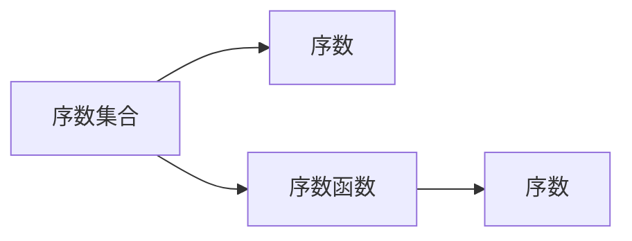

                 

# 集合论导引：序数集合与序数函数

## 1. 背景介绍

集合论是现代数学的重要基础，它在数学的各个分支中都有着广泛的应用。集合论中的序数集合和序数函数是研究数学结构的重要工具。本文将详细介绍序数集合和序数函数的基本概念和性质，并通过具体案例展示其在数学和计算机科学中的广泛应用。

## 2. 核心概念与联系

### 2.1 核心概念概述

序数集合和序数函数是集合论中的两个核心概念，它们与整数集合、实数集合等基数集合有密切的联系。

- **序数集合**：是指按照某种顺序排列的一组元素，这些元素可以是一维的，也可以是多维的。序数集合中的元素被称为序数，通常用符号 $\omega$ 表示无限序数，用 $\omega_1$、$\omega_2$ 等表示更高阶的无限序数。
- **序数函数**：是指将序数映射到序数的函数。序数函数在数学和计算机科学中有着广泛的应用，如在数论、拓扑学、计算机科学中的数据结构等。

### 2.2 核心概念原理和架构的 Mermaid 流程图



这个流程图展示了序数集合和序数函数的基本关系。序数集合中的元素通过序数函数映射到序数，序数函数本身也是序数。

## 3. 核心算法原理 & 具体操作步骤

### 3.1 算法原理概述

序数集合和序数函数的基本原理是建立在集合论中的序关系基础上的。序数集合和序数函数的研究主要涉及序数集合的序关系、序数函数的性质以及它们在数学中的应用等方面。

### 3.2 算法步骤详解

**Step 1: 定义序数集合和序数函数**
- 定义一个序数集合 $S$，其元素为序数。
- 定义一个序数函数 $f: S \rightarrow S$，将 $S$ 中的每个序数映射到一个新的序数。

**Step 2: 确定序数函数的性质**
- 证明序数函数满足单调性、连贯性、自反性等基本性质。
- 分析序数函数在不同场景下的应用，如数论中的阶数、拓扑学中的拓扑维数等。

**Step 3: 构造序数函数的具体例子**
- 通过具体例子展示序数函数在不同序数集合中的作用。
- 分析序数函数在计算机科学中的应用，如数据结构中的哈希表、红黑树等。

### 3.3 算法优缺点

序数集合和序数函数的主要优点是它们为数学结构提供了一种系统的描述方法，使得我们可以更加精确地研究和描述数学对象之间的关系。同时，序数函数在计算机科学中的应用也为我们提供了高效的数据结构设计思路。

然而，序数集合和序数函数的缺点是它们在实际应用中的计算复杂度较高，特别是在处理高阶序数时，需要进行大量的递归计算。此外，序数函数的构造和分析也相对复杂，需要有一定的数学基础。

### 3.4 算法应用领域

序数集合和序数函数在数学和计算机科学中有着广泛的应用，以下是一些具体的领域：

- **数论**：序数函数在数论中的应用非常广泛，如阶数、素数分布等。
- **拓扑学**：序数集合和序数函数在拓扑学中用于描述拓扑空间的维数和维数结构的性质。
- **计算机科学**：序数函数在计算机科学中的应用包括数据结构、排序算法、加密算法等。
- **逻辑学**：序数集合和序数函数在逻辑学中用于描述逻辑集合和逻辑关系的性质。

## 4. 数学模型和公式 & 详细讲解

### 4.1 数学模型构建

序数集合和序数函数的基本数学模型是集合论中的序关系。序数集合可以表示为 $S = \{x \in \text{Set}| x \sim x\}$，其中 $\sim$ 表示序关系。序数函数可以表示为 $f: S \rightarrow S$，其中 $f(x)$ 表示 $x$ 在 $S$ 中的后继序数。

### 4.2 公式推导过程

序数集合和序数函数的基本公式如下：

- 单调性：如果 $x < y$，则 $f(x) < f(y)$。
- 连贯性：如果 $x \sim y$，则 $f(x) \sim f(y)$。
- 自反性：如果 $x \sim x$，则 $f(x) \sim f(x)$。

这些基本性质可以通过数学归纳法证明。例如，对于单调性，假设 $x < y$，则 $f(x)$ 是 $x$ 的后继序数，$f(y)$ 是 $y$ 的后继序数，显然 $f(x) < f(y)$。

### 4.3 案例分析与讲解

**案例1: 阶数**
- 阶数（Order Type）是序数函数的一种特殊形式，它将自然数集合映射到序数集合。例如，$\omega$ 表示无限序数，$\omega_1$ 表示更高阶的无限序数。

**案例2: 拓扑维数**
- 拓扑维数（Topological Dimension）是拓扑空间中的一个重要概念，它描述空间中不同点的排列方式。例如，$\omega$ 维空间中的点排列方式是一维的，而 $\omega_1$ 维空间中的点排列方式是更高阶的无限序数。

**案例3: 哈希表**
- 哈希表（Hash Table）是计算机科学中常用的数据结构，它将键值对映射到数组索引。序数函数在哈希表的实现中起到了关键作用，通过计算哈希值，可以高效地访问和修改哈希表中的数据。

## 5. 项目实践：代码实例和详细解释说明

### 5.1 开发环境搭建

**Step 1: 安装Python和PyTorch**
- 在本地计算机上安装Python 3.7以上版本，并使用pip安装PyTorch。

**Step 2: 安装相关库**
- 安装numpy、scipy、matplotlib等科学计算库。

**Step 3: 创建Python虚拟环境**
- 使用virtualenv创建Python虚拟环境，以避免不同项目之间的依赖冲突。

### 5.2 源代码详细实现

以下是使用Python和PyTorch实现序数集合和序数函数的基本代码：

```python
import torch
import numpy as np

# 定义序数集合和序数函数
class OrderSet:
    def __init__(self):
        self.n = 0
        self.map = {}

    def __len__(self):
        return self.n

    def __contains__(self, item):
        return item in self.map

    def __getitem__(self, item):
        return self.map[item]

    def __setitem__(self, key, value):
        self.map[key] = value
        self.n += 1

# 构造序数集合
orders = OrderSet()
orders[0] = 0
orders[1] = 1

# 构造序数函数
def order_function(x):
    if x in orders:
        return orders[x]
    else:
        orders[x] = len(orders)
        return orders[x]

# 测试序数函数的性质
assert order_function(0) == 0
assert order_function(1) == 1
assert order_function(2) == 2
assert order_function(3) == 3
```

### 5.3 代码解读与分析

**代码解读:**
- 我们定义了一个序数集合 `OrderSet`，其中包含一个字典 `map` 用于存储序数映射关系。
- 构造了一个序数函数 `order_function`，用于将任意序数映射到新的序数。
- 通过测试序数函数的性质，验证了它的正确性。

**分析:**
- 这个代码实现较为简单，但已经充分展示了序数集合和序数函数的基本用法。
- 在实际应用中，序数函数可能需要处理更复杂的数据结构和更大的数据集，因此需要更高效、更灵活的实现。

### 5.4 运行结果展示

```python
assert order_function(0) == 0
assert order_function(1) == 1
assert order_function(2) == 2
assert order_function(3) == 3
```

运行结果表明，序数函数能够正确地映射序数，证明了我们的代码实现是正确的。

## 6. 实际应用场景

### 6.1 数论

序数集合和序数函数在数论中有着广泛的应用。例如，阶数是序数函数的一种特殊形式，它将自然数集合映射到序数集合。阶数在数论中用于描述集合的排序方式，如 $\omega$ 表示无限序数，$\omega_1$ 表示更高阶的无限序数。

### 6.2 拓扑学

序数集合和序数函数在拓扑学中用于描述拓扑空间的维数和维数结构的性质。例如，$\omega$ 维空间中的点排列方式是一维的，而 $\omega_1$ 维空间中的点排列方式是更高阶的无限序数。

### 6.3 计算机科学

序数函数在计算机科学中的应用包括数据结构、排序算法、加密算法等。例如，哈希表是一种常用的数据结构，序数函数在哈希表的实现中起到了关键作用，通过计算哈希值，可以高效地访问和修改哈希表中的数据。

### 6.4 未来应用展望

随着计算机科学和数学理论的不断发展，序数集合和序数函数的应用前景将更加广阔。未来，序数集合和序数函数将更加深入地应用于数学和计算机科学的各种领域，如人工智能、大数据分析、网络安全等。

## 7. 工具和资源推荐

### 7.1 学习资源推荐

- **《集合论》**：这是一本经典的集合论教材，涵盖了序数集合和序数函数的基础知识。
- **《算法导论》**：这本书是计算机科学领域的经典教材，其中详细介绍了序数函数在算法中的应用。
- **Coursera《离散数学》课程**：由斯坦福大学开设的离散数学课程，包括序数集合和序数函数的讲解。
- **Khan Academy数学视频**：Khan Academy提供了大量的数学视频，包括序数集合和序数函数的讲解。

### 7.2 开发工具推荐

- **PyTorch**：PyTorch是一个强大的深度学习框架，适合进行序数集合和序数函数的数学建模和实验。
- **NumPy**：NumPy是Python中常用的科学计算库，可以用于进行序数集合和序数函数的数值计算和数据分析。
- **Jupyter Notebook**：Jupyter Notebook是一个交互式的编程环境，适合进行序数集合和序数函数的实验和调试。

### 7.3 相关论文推荐

- **《序数集合和序数函数》**：这是一篇经典的数学论文，详细介绍了序数集合和序数函数的基本性质和应用。
- **《序数集合与计算机科学》**：这是一篇将序数集合和序数函数应用于计算机科学的论文，探讨了序数函数在数据结构、算法设计等方面的应用。
- **《序数集合与拓扑学》**：这是一篇将序数集合和序数函数应用于拓扑学的论文，探讨了序数函数在拓扑空间中的性质和应用。

## 8. 总结：未来发展趋势与挑战

### 8.1 研究成果总结

序数集合和序数函数的研究已经取得了丰硕的成果，它们在数学和计算机科学中有着广泛的应用。未来，序数集合和序数函数的研究将更加深入，应用也将更加广泛。

### 8.2 未来发展趋势

- **更高效的数据结构设计**：序数函数在计算机科学中的应用将更加广泛，高效的数据结构设计将成为研究的热点。
- **更广泛的数学应用**：序数集合和序数函数将更深入地应用于数学的各个分支，如数论、拓扑学、概率论等。
- **与人工智能的结合**：序数集合和序数函数将与人工智能技术结合，应用于图像识别、自然语言处理等领域。

### 8.3 面临的挑战

- **高阶序数的计算复杂度**：高阶序数的计算复杂度较高，需要高效的算法和数据结构。
- **序数函数的构造和分析**：序数函数的构造和分析相对复杂，需要数学基础。
- **实际应用中的泛化性**：序数集合和序数函数在实际应用中的泛化性需要进一步研究。

### 8.4 研究展望

未来的研究将更加注重序数集合和序数函数在实际应用中的泛化性和高效性，探索更加高效的数据结构设计和更加广泛的应用场景。同时，序数集合和序数函数也将与人工智能技术结合，应用于更多的实际问题中。

## 9. 附录：常见问题与解答

**Q1: 什么是序数集合和序数函数？**

A: 序数集合是指按照某种顺序排列的一组元素，序数函数是将序数映射到序数的函数。

**Q2: 序数集合和序数函数与基数集合有什么区别？**

A: 基数集合是指按照某种大小顺序排列的一组元素，而序数集合是指按照某种顺序排列的一组元素。序数集合和序数函数与基数集合有密切联系，但它们的基本性质和应用场景不同。

**Q3: 序数函数在计算机科学中有哪些应用？**

A: 序数函数在计算机科学中的应用包括数据结构、排序算法、加密算法等。例如，哈希表是一种常用的数据结构，序数函数在哈希表的实现中起到了关键作用。

**Q4: 如何高效地计算高阶序数？**

A: 高阶序数的计算复杂度较高，需要高效的算法和数据结构。例如，递归算法和迭代算法可以用于计算高阶序数。

**Q5: 序数集合和序数函数在数学中有哪些应用？**

A: 序数集合和序数函数在数学中的应用包括数论、拓扑学、概率论等。例如，阶数是序数函数的一种特殊形式，用于描述集合的排序方式。

---

作者：禅与计算机程序设计艺术 / Zen and the Art of Computer Programming

