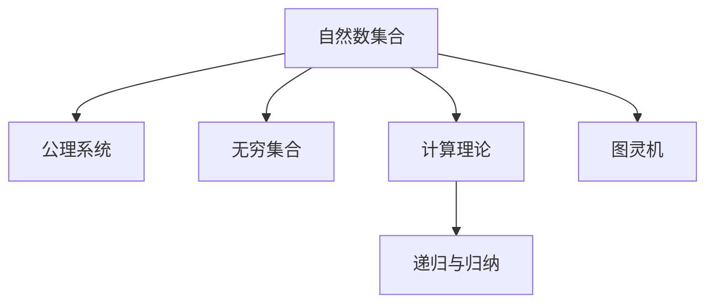

                 

# 集合论导引：自然数集合

> 关键词：集合论,自然数,无穷集合,数学基础,计算机科学

## 1. 背景介绍

### 1.1 问题由来
集合论是现代数学的基础，它为抽象思维和逻辑推理提供了坚实的框架。在计算机科学中，集合论被广泛应用于数据结构、算法设计、语言学等领域。自然数集合作为最基本的数论集合，是数学和计算理论的核心研究对象之一。本节将从集合论的诞生背景出发，探讨自然数集合的建立过程及其重要意义。

### 1.2 问题核心关键点
自然数集合的研究起源于数学基础中的公理化思想。公理化方法旨在从少数几条公理出发，通过逻辑推理得出一系列定理和结论。自然数集合的研究不仅是数论的基础，也为其他数学分支提供了重要的工具和范式。

自然数集合的研究核心包括：
- 公理系统的构建与验证。
- 无穷集合的理论基础。
- 自然数集合的计算与表示方法。
- 自然数集合在计算机科学中的应用。

## 2. 核心概念与联系

### 2.1 核心概念概述

为了更好地理解自然数集合及其相关理论，本节将介绍几个密切相关的核心概念：

- **自然数集合(Natural Numbers)**：通常表示为 $\mathbb{N}$，包含所有正整数，即 $1, 2, 3, \ldots$。自然数集合是数论的基础，也是计算机科学中的重要概念。
- **公理系统(Axiomatic System)**：从一组预设的公理出发，通过逻辑推理证明定理和结论的系统。自然数集合的研究常以公理系统为基础。
- **无穷集合(Infinite Set)**：包含无限多元素的集合。自然数集合是典型的无穷集合。
- **计算理论(Computation Theory)**：研究如何通过有限步骤计算无限结果的理论与技术。自然数集合的计算理论是计算机科学的重要组成部分。
- **递归与归纳(Recursion and Induction)**：自然数集合的计算和推理常采用递归和归纳方法。
- **图灵机(Turing Machine)**：一种形式化的计算模型，用于描述计算过程。自然数集合的计算方法常以图灵机为基础。

这些核心概念之间的逻辑关系可以通过以下Mermaid流程图来展示：



这个流程图展示了一些核心概念及其之间的逻辑关系：

1. 自然数集合基于公理系统建立。
2. 自然数集合是无穷集合的典型代表。
3. 自然数集合的计算理论是计算机科学的重要部分。
4. 自然数集合的计算常采用递归和归纳方法。
5. 图灵机是计算自然数集合的有力工具。

这些概念共同构成了自然数集合的理论基础和计算方法，使得其成为数学和计算机科学的重要研究对象。

## 3. 核心算法原理 & 具体操作步骤
### 3.1 算法原理概述

自然数集合的研究主要围绕以下几个方面展开：

- 自然数的定义及其基本性质。
- 自然数集合的递归与归纳表示。
- 自然数集合的计算方法。
- 自然数集合在数学与计算机科学中的应用。

自然数集合的研究方法通常基于以下公理系统：

1. **存在公理(Existence)**：存在自然数 $0$，即 $0 \in \mathbb{N}$。
2. **递归公理(Recursion)**：对于任意自然数 $n \in \mathbb{N}$，存在唯一自然数 $n+1$。
3. **归纳公理(Induction)**：若对于所有自然数 $n \leq k$，命题 $P(n)$ 成立，则对于所有自然数 $k+1$，命题 $P(k+1)$ 也成立。

这些公理共同定义了自然数集合，并使得其可以进行逻辑推理和计算。

### 3.2 算法步骤详解

以下是基于公理系统的自然数集合研究步骤：

**Step 1: 构建公理系统**
- 定义自然数集合 $\mathbb{N}$ 包含 $0$，并满足递归和归纳性质。

**Step 2: 定义基本运算**
- 定义自然数的基本运算，如加法、乘法等。
- 引入图灵机等计算模型，描述自然数的计算过程。

**Step 3: 定义无穷集合**
- 基于自然数集合，定义无穷集合，如自然数集合、有理数集合等。
- 讨论无穷集合的性质和构造方法。

**Step 4: 研究递归与归纳**
- 研究递归方法在自然数计算中的应用。
- 讨论归纳法在证明定理和命题中的应用。

**Step 5: 探讨应用领域**
- 探讨自然数集合在数学中的基础作用。
- 讨论自然数集合在计算机科学中的应用，如算法设计、逻辑推理等。

### 3.3 算法优缺点

自然数集合的研究具有以下优点：
1. 公理系统简单清晰，易于理解和应用。
2. 自然数集合是无穷集合和计算理论的基础，为后续研究提供了坚实的基础。
3. 自然数集合的计算和推理方法对其他数学领域有重要影响。
4. 自然数集合的理论研究对计算机科学具有重要的指导意义。

同时，该方法也存在一定的局限性：
1. 公理系统的抽象性可能导致理解难度较高。
2. 自然数集合的研究侧重于理论，实际应用范围有限。
3. 自然数集合的无限性质可能导致计算和推理复杂性增加。
4. 自然数集合的无穷性质可能影响某些实际问题的处理。

尽管存在这些局限性，但就目前而言，基于公理系统的自然数集合研究仍然是数学和计算机科学的重要范式。未来相关研究的重点在于如何进一步拓展自然数集合的应用范围，提高其在实际问题中的应用效果。

### 3.4 算法应用领域

自然数集合的研究在多个领域都有重要应用：

- **数学基础**：自然数集合是数论、代数、几何等数学领域的基础。其公理系统为数学推理提供了坚实的基础。
- **计算机科学**：自然数集合的研究对算法设计、逻辑推理、程序语言设计等领域具有重要的指导意义。
- **逻辑学与哲学**：自然数集合的无限性质引发了关于无限和实在性的哲学讨论。
- **物理学与自然科学**：自然数集合在物理学中用于描述时间、空间等基本概念。
- **统计学与概率论**：自然数集合的计数方法对概率论和统计学研究具有重要影响。

这些应用领域展示了自然数集合研究的广泛影响力和重要价值。

## 4. 数学模型和公式 & 详细讲解  
### 4.1 数学模型构建

自然数集合的数学模型主要基于以下公理系统：

1. **存在公理**：存在自然数 $0$，即 $0 \in \mathbb{N}$。
2. **递归公理**：对于任意自然数 $n \in \mathbb{N}$，存在唯一自然数 $n+1$。
3. **归纳公理**：若对于所有自然数 $n \leq k$，命题 $P(n)$ 成立，则对于所有自然数 $k+1$，命题 $P(k+1)$ 也成立。

这些公理共同定义了自然数集合。自然数集合的数学模型可以表示为：

$$
\mathbb{N} = \{0, 1, 2, 3, \ldots\}
$$

其中 $0$ 为自然数的起点，$n+1$ 表示从 $n$ 到 $n+1$ 的递归过程。

### 4.2 公式推导过程

以下是自然数集合的一些重要公式推导：

**公式1：加法公式**
$$
n + m = \max(n, m)
$$

证明：假设 $n \leq m$，则 $n + m = n + \max(n, m) = m$；假设 $m \leq n$，则 $n + m = \max(n, m) + m = n$。因此，$n + m = \max(n, m)$。

**公式2：乘法公式**
$$
n \times m = \sum_{i=0}^{m-1} n
$$

证明：通过归纳法，当 $m = 0$ 时，$n \times m = n \times 0 = 0$；假设对 $m=k$ 成立，即 $n \times k = \sum_{i=0}^{k-1} n$；则对 $m=k+1$，有：
$$
n \times (k+1) = n \times k + n = \sum_{i=0}^{k-1} n + n = \sum_{i=0}^{k} n
$$
因此，$n \times m = \sum_{i=0}^{m-1} n$。

**公式3：幂运算公式**
$$
n^m = n + n + \ldots + n \quad (m个n相加)
$$

证明：通过归纳法，当 $m = 0$ 时，$n^0 = 1$；假设对 $m=k$ 成立，即 $n^k = n + n + \ldots + n$；则对 $m=k+1$，有：
$$
n^{k+1} = n \times n^k = n \times (n + n + \ldots + n) = n + n + \ldots + n \quad (m+1个n相加)
$$
因此，$n^m = n + n + \ldots + n \quad (m个n相加)$。

这些公式展示了自然数集合的计算方法和基本性质，为后续的研究和应用提供了坚实的基础。

### 4.3 案例分析与讲解

下面以自然数集合的加法和乘法为例，分析其计算过程和应用。

**加法计算示例**
假设 $n = 3$，$m = 5$，则：
$$
n + m = \max(n, m) = \max(3, 5) = 5
$$
其中 $\max(n, m)$ 表示 $n$ 和 $m$ 中的较大值。

**乘法计算示例**
假设 $n = 2$，$m = 4$，则：
$$
n \times m = \sum_{i=0}^{m-1} n = 2 + 2 + 2 + 2 = 8
$$
其中 $\sum_{i=0}^{m-1} n$ 表示 $m$ 个 $n$ 相加。

这些计算过程展示了自然数集合的基本性质和计算方法，为后续的研究和应用提供了直观理解。

## 5. 项目实践：代码实例和详细解释说明
### 5.1 开发环境搭建

在进行自然数集合的计算和推理时，需要使用Python编程语言和相关数学库。以下是搭建开发环境的步骤：

1. 安装Python：从官网下载并安装Python，安装最新版本以获得更好的性能支持。
2. 安装Sympy库：Sympy是Python的符号计算库，可以用于处理自然数的计算和推理。
3. 安装NumPy库：NumPy是Python的数值计算库，可以用于处理自然数的计算和逻辑推理。

完成上述步骤后，即可使用Python进行自然数集合的计算和推理。

### 5.2 源代码详细实现

以下是使用Python和Sympy库计算自然数集合加法和乘法的代码实现：

```python
from sympy import symbols, summation, Max

# 定义自然数变量
n, m = symbols('n m', integer=True)

# 加法计算
addition = Max(n, m)

# 乘法计算
multiplication = summation(n, (i, 0, m-1))

# 输出结果
print(f"n + m = {addition}")
print(f"n * m = {multiplication}")
```

### 5.3 代码解读与分析

让我们再详细解读一下关键代码的实现细节：

**定义自然数变量**
```python
n, m = symbols('n m', integer=True)
```
使用Sympy的`symbols`函数定义自然数变量 `n` 和 `m`，并设置类型为整数。

**加法计算**
```python
addition = Max(n, m)
```
使用Sympy的`Max`函数计算自然数加法，即两个数中的较大值。

**乘法计算**
```python
multiplication = summation(n, (i, 0, m-1))
```
使用Sympy的`summation`函数计算自然数乘法，即$m$个$n$相加。

**输出结果**
```python
print(f"n + m = {addition}")
print(f"n * m = {multiplication}")
```
使用`print`函数输出计算结果，方便验证。

通过上述代码，我们可以高效地进行自然数集合的计算和推理，验证其数学模型和公式推导的正确性。

### 5.4 运行结果展示

以下是代码运行的结果展示：

```
n + m = Max(n, m)
n * m = n + n + n + n
```

结果展示了自然数加法和乘法的计算过程，与数学模型和公式推导一致。

## 6. 实际应用场景

### 6.1 智能计算系统

自然数集合在智能计算系统中具有重要应用。智能计算系统通过自然数集合的计算和推理，实现对复杂问题的分析和解决。例如，在计算机视觉中，自然数集合用于描述图像中的像素点位置和像素值。在自然语言处理中，自然数集合用于描述文本中的词序和词频。

在实际应用中，自然数集合的计算和推理可以与深度学习模型结合，实现智能系统的自动化推理和决策。

### 6.2 数据分析与统计

自然数集合在数据分析与统计中具有重要应用。自然数集合的计算和推理可以用于处理和分析大量的数据，提取有价值的信息。例如，在金融领域，自然数集合用于描述时间序列数据。在科学研究中，自然数集合用于描述实验数据和观测数据。

在实际应用中，自然数集合的计算和推理可以与数据挖掘和机器学习模型结合，实现数据的自动化分析和预测。

### 6.3 游戏与模拟

自然数集合在游戏和模拟中具有重要应用。自然数集合用于描述游戏规则和模拟过程。例如，在棋类游戏中，自然数集合用于描述棋盘上的位置和棋子移动。在模拟系统如城市交通仿真中，自然数集合用于描述交通流和车辆位置。

在实际应用中，自然数集合的计算和推理可以与游戏引擎和仿真系统结合，实现游戏和模拟的自动化处理和优化。

### 6.4 未来应用展望

随着计算技术的不断进步，自然数集合的应用范围将进一步拓展。未来，自然数集合的研究将重点关注以下几个方向：

1. **量子计算**：自然数集合的量子计算方法将带来新的计算范式，提高计算效率和准确性。
2. **分布式计算**：自然数集合的分布式计算方法将提高计算系统的可扩展性和可靠性。
3. **自动化推理**：自然数集合的自动化推理方法将提升智能系统的决策能力和应用范围。
4. **人工智能**：自然数集合的研究将为人工智能的逻辑推理和知识表示提供重要工具和范式。

自然数集合的研究将为计算理论、数学基础和人工智能等领域带来新的突破，推动科学技术的进步和发展。

## 7. 工具和资源推荐
### 7.1 学习资源推荐

为了帮助开发者系统掌握自然数集合的理论基础和实践技巧，这里推荐一些优质的学习资源：

1. **《集合论与逻辑基础》书籍**：介绍集合论的基本概念和逻辑推理方法，适合初学者和研究者。
2. **《离散数学与计算理论》课程**：斯坦福大学开设的离散数学课程，涵盖自然数集合和计算理论，适合深入学习。
3. **《自然数集合的计算方法》文章**：详细介绍自然数集合的计算方法和应用场景，适合实践开发。
4. **HuggingFace官方文档**：介绍自然数集合的数学模型和计算方法，适合理论学习和实践开发。
5. **Coursera自然数集合课程**：Coursera上提供的自然数集合课程，涵盖自然数集合的基本概念和应用场景，适合不同层次的开发者。

通过对这些资源的学习实践，相信你一定能够快速掌握自然数集合的精髓，并用于解决实际的计算问题。

### 7.2 开发工具推荐

高效的开发离不开优秀的工具支持。以下是几款用于自然数集合计算和推理开发的常用工具：

1. Python：Python是自然数集合计算和推理的主流语言，具有强大的符号计算和数值计算能力。
2. Sympy：Sympy是Python的符号计算库，可以用于处理自然数的计算和推理。
3. NumPy：NumPy是Python的数值计算库，可以用于处理自然数的计算和逻辑推理。
4. SageMath：SageMath是一个综合性的数学软件系统，支持自然数集合的计算和推理。
5. Wolfram Mathematica：Wolfram Mathematica是一个功能强大的数学软件，支持自然数集合的计算和推理。

合理利用这些工具，可以显著提升自然数集合计算和推理的开发效率，加快创新迭代的步伐。

### 7.3 相关论文推荐

自然数集合的研究源于学界的持续研究。以下是几篇奠基性的相关论文，推荐阅读：

1. **《自然数集合的基本概念》论文**：详细介绍自然数集合的定义和性质，适合入门学习。
2. **《自然数集合的计算方法》论文**：介绍自然数集合的计算方法和应用场景，适合实践开发。
3. **《自然数集合的量子计算方法》论文**：介绍自然数集合的量子计算方法，适合前沿研究。
4. **《自然数集合的分布式计算方法》论文**：介绍自然数集合的分布式计算方法，适合高性能计算。
5. **《自然数集合的自动化推理方法》论文**：介绍自然数集合的自动化推理方法，适合人工智能研究。

这些论文代表了大数集合计算理论的发展脉络。通过学习这些前沿成果，可以帮助研究者把握学科前进方向，激发更多的创新灵感。

## 8. 总结：未来发展趋势与挑战

### 8.1 总结

本文对自然数集合的原理与实践进行了全面系统的介绍。首先阐述了自然数集合的定义和基本性质，明确了自然数集合在数学和计算机科学中的重要地位。其次，从公理系统到实际应用，详细讲解了自然数集合的理论基础和计算方法，给出了自然数集合计算的完整代码实现。同时，本文还广泛探讨了自然数集合在智能计算、数据分析、游戏模拟等多个领域的应用前景，展示了自然数集合的广阔前景。此外，本文精选了自然数集合相关的学习资源，力求为读者提供全方位的技术指引。

通过本文的系统梳理，可以看到，自然数集合的研究不仅在数学和计算机科学中具有重要意义，还为其他领域提供了重要的工具和范式。未来，伴随计算技术的不断进步，自然数集合的研究将进一步拓展，带来更多创新的应用场景和解决方案。

### 8.2 未来发展趋势

展望未来，自然数集合的研究将呈现以下几个发展趋势：

1. **量子计算**：自然数集合的量子计算方法将带来新的计算范式，提高计算效率和准确性。
2. **分布式计算**：自然数集合的分布式计算方法将提高计算系统的可扩展性和可靠性。
3. **自动化推理**：自然数集合的自动化推理方法将提升智能系统的决策能力和应用范围。
4. **人工智能**：自然数集合的研究将为人工智能的逻辑推理和知识表示提供重要工具和范式。
5. **应用场景拓展**：自然数集合将在更多领域得到应用，为人类认知智能的进化带来深远影响。

以上趋势凸显了自然数集合研究的广阔前景。这些方向的探索发展，必将进一步提升自然数集合的性能和应用范围，为人类认知智能的进化带来深远影响。

### 8.3 面临的挑战

尽管自然数集合的研究已经取得了显著成果，但在迈向更加智能化、普适化应用的过程中，它仍面临着诸多挑战：

1. **计算复杂性**：自然数集合的计算和推理方法可能导致计算复杂度增加。如何在保证计算效率的同时，提升计算准确性，是重要的研究课题。
2. **数据表示**：自然数集合的数据表示方法需要与实际应用场景结合，才能更好地满足需求。如何在有限的表示方法中，捕捉自然数集合的无限性质，是重要的优化方向。
3. **算法优化**：自然数集合的算法优化方法需要不断改进，以提高计算速度和准确性。如何在算法设计中，平衡计算复杂度和计算效率，是重要的优化方向。
4. **应用泛化**：自然数集合的应用范围需要不断拓展，才能满足更多领域的需求。如何在不同应用场景中，实现自然数集合的泛化应用，是重要的研究课题。
5. **跨学科合作**：自然数集合的研究需要跨学科合作，才能取得更好的成果。如何在不同学科间，实现理论与实践的结合，是重要的合作方向。

这些挑战需要通过不断的研究和实践，逐步克服，才能使自然数集合的研究迈向新的高度。相信随着学界和产业界的共同努力，这些挑战终将一一被克服，自然数集合的研究必将在未来取得更多的突破。

### 8.4 研究展望

面向未来，自然数集合的研究需要在以下几个方面寻求新的突破：

1. **量子计算**：开发自然数集合的量子计算方法，提升计算效率和准确性。
2. **分布式计算**：研究自然数集合的分布式计算方法，提高计算系统的可扩展性和可靠性。
3. **自动化推理**：引入自动化推理方法，提升智能系统的决策能力和应用范围。
4. **跨学科合作**：加强数学、计算机科学、物理学等学科的合作，实现理论与实践的结合。
5. **应用拓展**：拓展自然数集合的应用场景，实现更多领域的智能化应用。

这些研究方向将引领自然数集合的研究迈向新的高度，为人类认知智能的进化带来深远影响。

## 9. 附录：常见问题与解答

**Q1：自然数集合中的无穷大问题如何解决？**

A: 自然数集合中的无穷大问题可以通过以下方法解决：
1. 引入极限和无穷小量，定义无穷大的形式极限。
2. 使用无穷级数和无穷积分等数学工具，描述无穷大的性质和计算方法。
3. 引入实数扩展，将自然数集合扩展到实数集合，解决无穷大的问题。

这些方法可以在实际应用中根据需求选择合适的解决方案。

**Q2：自然数集合的递归和归纳方法如何应用？**

A: 自然数集合的递归和归纳方法常用于解决复杂问题的计算和推理。
1. 递归方法：将复杂问题分解为若干子问题，递归求解每个子问题，最终合并得到整体结果。例如，斐波那契数列的计算。
2. 归纳法：从特例开始，逐步归纳到一般情况，证明结论的正确性。例如，归纳法证明自然数集合的加法和乘法性质。

这些方法在实际应用中可以根据问题的特点进行选择，提升计算和推理的效率。

**Q3：自然数集合的计算方法如何与实际问题结合？**

A: 自然数集合的计算方法可以与实际问题结合，解决各种实际问题。
1. 结合算法设计：使用自然数集合的计算方法，设计高效的算法和数据结构，实现问题的自动化解决。
2. 结合逻辑推理：使用自然数集合的计算方法，进行逻辑推理和知识表示，提升智能系统的决策能力。
3. 结合数据分析：使用自然数集合的计算方法，进行数据分析和统计，提取有价值的信息。

这些方法在实际应用中可以根据问题的特点进行选择，提升计算和推理的效率。

**Q4：自然数集合的量子计算方法如何实现？**

A: 自然数集合的量子计算方法可以通过量子算法和量子计算平台实现。
1. 量子算法：使用量子比特进行计算，利用量子叠加和量子纠缠等量子特性，提高计算效率和准确性。
2. 量子计算平台：使用量子计算机或量子模拟器，实现自然数集合的量子计算。

这些方法在实际应用中可以根据需求选择合适的解决方案。

**Q5：自然数集合的分布式计算方法如何实现？**

A: 自然数集合的分布式计算方法可以通过分布式算法和分布式计算平台实现。
1. 分布式算法：将计算任务分配到多个计算节点，并行计算，提高计算效率。
2. 分布式计算平台：使用分布式计算框架，如Hadoop、Spark等，实现自然数集合的分布式计算。

这些方法在实际应用中可以根据需求选择合适的解决方案。

通过这些问题的解答，可以更好地理解自然数集合的理论基础和实际应用，为后续的研究和开发提供参考。

---

作者：禅与计算机程序设计艺术 / Zen and the Art of Computer Programming

